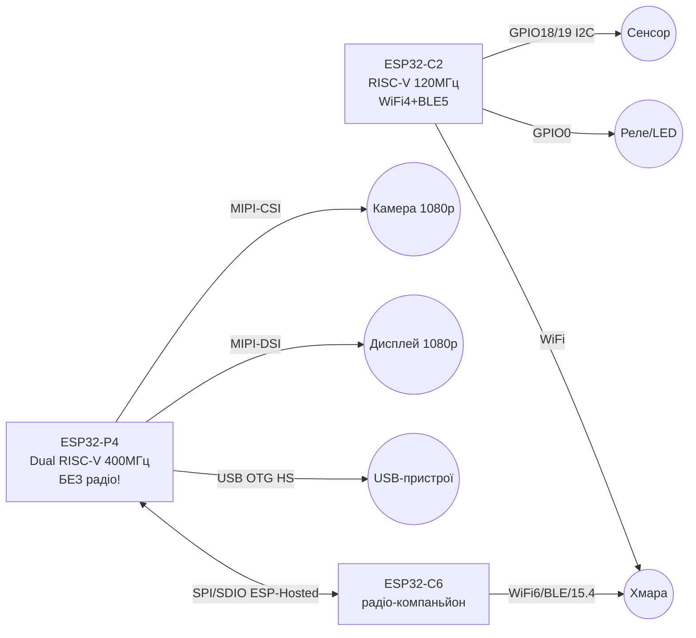
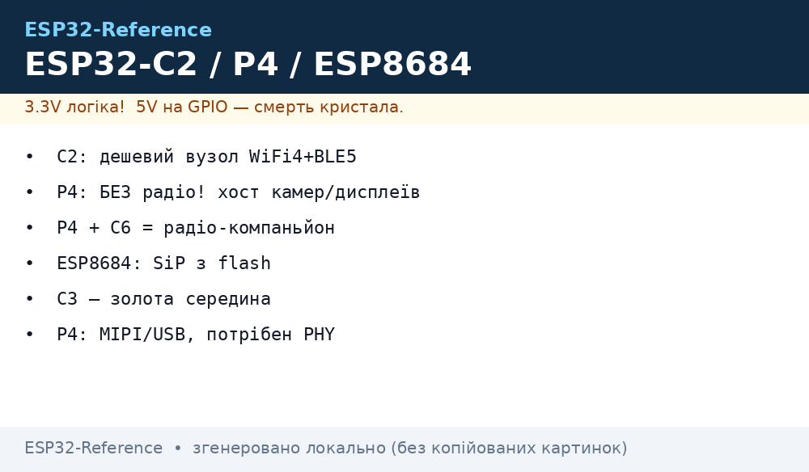

# ESP32-C2 / ESP32-P4 - дешевий RISC-V вузол і потужний хост без радіо

EN version: `01-Hardware/09-ESP32-C2-P4.en.md`

## Призначення

Два крайні полюси лінійки Espressif: ESP32-C2 - найдешевший WiFi4+BLE5 RISC-V для простих вузлів
(мало GPIO і пам'яті - свідомий компроміс ціни),
та ESP32-P4 - потужний dual-core RISC-V БЕЗ радіо: хост для камер/дисплеїв (MIPI, USB HS OTG)
з ESP32-C6 як радіо-компаньйоном. Плюс ESP8684/ESP8685 - SiP-версії C2 з вбудованою flash.
Сусіди: C3/C6/H2 - [04-ESP32-C3-C6-H2](../../../ESP32-Reference/01-Hardware/04-ESP32-C3-C6-H2.md), Classic - [01-ESP32-Classic](../../../ESP32-Reference/01-Hardware/01-ESP32-Classic.md),
S2 - [02-ESP32-S2](../../../ESP32-Reference/01-Hardware/02-ESP32-S2.md), S3 - [03-ESP32-S3](../../../ESP32-Reference/01-Hardware/03-ESP32-S3.md).

## Характеристики

| Параметр | ESP32-C2 (ESP8684/85 - SiP) | ESP32-P4 |
| --- | --- | --- |
| CPU | RISC-V 32-bit single-core, до 120 МГц | Dual-core RISC-V HP до 400 МГц + FPU + AI-розширення, плюс LP-core 40 МГц |
| Пам'ять | 272 КБ SRAM (16 КБ cache), 576 КБ ROM; flash зовнішня (C2) / вбудована 2-4 МБ (ESP8684/85) | 768 КБ HP SRAM + 8 КБ TCM, PSRAM зовнішня; flash зовнішня |
| Радіо | WiFi 4 (802.11n, до 72 Мбіт, 18-20 дБм) + BLE 5 | НЕМАЄ! WiFi/BLE - тільки через компаньйона (C6/S3 по SPI/SDIO/UART) |
| GPIO | ~14 доступних (QFN32) | 55 програмованих GPIO |
| Периферія | SPI, UART, I2C, LED PWM, ADC, USB-Serial-JTAG | MIPI-CSI (камера) + ISP, MIPI-DSI (дисплей до 1080p), USB OTG 2.0 HS, Ethernet, SDIO Host 3.0, SPI/I2S/I2C/MCPWM/RMT/ADC/UART/TWAI, H.264 @1080p30, PPA/2D-DMA, тач |
| Безпека | Secure Boot, flash encryption | Secure Boot, flash encryption, DSA+HMAC+Key Manager, TEE |
| Корпус | QFN32 5×5 мм (C2); QFN24 4×4 мм (ESP8684H2/H4, ESP8685H2/H4) | - (модулі/DevKit) |
| Живлення | Строго 3.3 В, GPIO не 5V-tolerant | Строго 3.3 В, GPIO не 5V-tolerant |
| Ціль | Розумні розетки/лампи, прості сенсори, ESP-AT слейв | HMI-панелі, камери, edge-AI, USB-хост, шлюзи |

> ESP8684 = C2 + вбудована flash 2 МБ (H2) / 4 МБ (H4); ESP8685 = те ж + вбудований PSRAM-слот-сумісний варіант.
> Літера означає обсяг SiP-flash - дивитися маркування на корпусі перед вибором таблиці партицій!

## Легенда пінів модуля

### ESP32-C2 / ESP8684 DevKit (типова плата)

| Пін | Позначення | Тип | Куди / до чого | Примітка |
| --- | --- | --- | --- | --- |
| 1 | 3V3 | Живлення вхід/вихід | 3.3 В | LDO з USB 5 В; НЕ подавати 5 В на 3V3! |
| 2 | GND | Земля | Спільна земля | - |
| 3 | GPIO8 | Strapping + LED | Вбудований LED (активний HIGH на частині плат) | Strapping: при boot не тримати LOW! |
| 4 | GPIO9 | Strapping (BOOT) | Кнопка BOOT | LOW при reset = download-режим |
| 5 | TX0 / RX0 (GPIO20/21) | UART0 | USB-UART міст / консоль | Логи, прошивка |
| 6 | GPIO18/19 | I2C за замовч. | SDA/SCL сенсорів | Pull-up 4.7 кОм |
| 7 | GPIO0-7 | GPIO/ADC/PWM | Сенсори, реле, LED | ADC 0-3.3 В, ШІМ через LEDC |
| 8 | EN | Enable, active high | Кнопка EN | LOW = чип вимкнено |

> У C2 всього ~14 GPIO: кожен пін на рахунку. Другого I2C/SPI-порту для «роскоші» немає -
> розводити шини з першого разу правильно, див. [01-GPIO-oglyad](../../../ESP32-Reference/03-GPIO/01-GPIO-oglyad.md) і [07-Boot-Strapping-Reset](../../../ESP32-Reference/01-Hardware/07-Boot-Strapping-Reset.md).

### ESP32-P4 DevKit (типова плата)

| Пін / група | Позначення | Тип | Куди / до чого | Примітка |
| --- | --- | --- | --- | --- |
| 1 | 3V3 / 5V (VIN) | Живлення | 5 В USB або 3.3 В | P4 + PSRAM + камера їдять відчутно - БЖ з запасом |
| 2 | GND | Земля | Спільна земля | Зірка до БЖ при камері/дисплеї |
| 3 | USB D+/D− (OTG HS) | USB 2.0 HS | USB-роз'єм плати | Хост для камер/флешок або device |
| 4 | MIPI-CSI (2/4 lane) | Камера | FPC-шлейф камери | До 1080p, вбудований ISP |
| 5 | MIPI-DSI (2 lane) | Дисплей | FPC-шлейф дисплея | До 1080p + PPA/2D-DMA для GUI |
| 6 | SDIO / SPI (компаньйон) | Шина до C6 | ESP32-C6 модуль | ESP-Hosted / ESP-AT: WiFi+BLE для P4 |
| 7 | UART0 (TX/RX) | Консоль | USB-UART міст | Логи, прошивка |
| 8 | JTAG (TCK/TMS/TDI/TDO) | Налагодження | JTAG-пробник | Залізний debug без printf |
| 9 | GPIO (55 шт) | GPIO | Периферія | SPI/I2C/UART/MCPWM/RMT/ADC/TWAI/Ethernet |

### Зв'язка P4 + C6 (радіо-компаньйон)

| P4 | C6 | Призначення | Примітка |
| --- | --- | --- | --- |
| SPI: SCK/MOSI/MISO/CS | SPI slave | ESP-Hosted (швидко) | Основний шлях даних WiFi |
| SDIO CLK/CMD/D0-D3 | SDIO slave | ESP-Hosted (найшвидше) | Для потокового трафіку |
| UART TX/RX | UART | ESP-AT (просто) | AT-команди, повільніше, але просто |
| GPIO (handshake) | GPIO | Переривання готовності | Data-ready сигнали |
| 3V3 / GND | 3V3 / GND | Живлення компаньйона | Спільна земля обов'язково |

## Схема підключення

| ESP32-C2 вузол | Сенсор / актуатор | Примітка |
| --- | --- | --- |
| 3V3 | VCC сенсора 3.3 В | Бюджет струму LDO ~300-500 мА |
| GND | GND | Спільна земля |
| GPIO18 (SDA) | SDA (BME280 тощо) | I2C, pull-up |
| GPIO19 (SCL) | SCL | 400 кГц |
| GPIO0 | Реле через MOSFET | НЕ strapping-критичний у роботі |
| TX0/RX0 | Консоль | Логи |

| ESP32-P4 хост | Периферія | Примітка |
| --- | --- | --- |
| 5V VIN | БЖ 5 В 2 А+ | Камера + дисплей + PSRAM |
| MIPI-CSI FPC | Модуль камери | Шлейф до клацання, без перекосів |
| MIPI-DSI FPC | Дисплей | GUI через PPA/2D-DMA |
| USB OTG | USB-камера/флешка | Хост-режим, живлення 5 В на VBUS |
| SPI/SDIO + UART | ESP32-C6 компаньйон | ESP-Hosted (швидко) або ESP-AT (просто) |
| JTAG | Пробник | OpenOCD, точки зупину |

Таблиця «коли брати замість C3/S3»:

| Задача | Беріть | Чому не C3/S3 |
| --- | --- | --- |
| Розетка/лампа/простий сенсор, ціна критична | C2 / ESP8684 | C3 дорожчий і більший; S3 - overkill |
| ESP-AT WiFi-слейв до головного MCU | C2 | Дешевший за C3, AT-прошивка готова |
| Батарейний BLE-маяк | C3, не C2! | У C2 гірший deep-sleep профіль і менше LP-периферії |
| Zigbee/Thread/Matter | C6/H2, не C2/P4! | У C2 немає 802.15.4, у P4 немає радіо взагалі |
| Камера/дисплей 1080p, HMI, USB-хост | P4 (+C6 на радіо) | S3 слабший (немає MIPI/USB HS); C3/C6 камеру не тягнуть |
| Камера бюджетна (OV2640, 2 МП) | S3, не P4! | P4 без радіо і дорожчий - для OV2640 вистачає S3 |
| Шлюз з Ethernet + WiFi | P4 (Ethernet MAC) + C6 | Classic/S3: Ethernet тільки через зовнішній PHY-модуль |

### ASCII-схема

```text
ESP32-C2 вузол (простий сенсор, WiFi4+BLE5)
------------
USB 5V ──[LDO]──► 3V3 (чип строго 3.3В! GPIO не 5V-tolerant)
GND ────────────► GND
GPIO18 ─────────► SDA сенсора (I2C, pull-up 4.7к)
GPIO19 ─────────► SCL сенсора
GPIO0 ──────────► MOSFET реле/LED
TX0/RX0 ────────► консоль (логи/прошивка)
GPIO9 (BOOT) LOW при reset = download-режим
УВАГА: ~14 GPIO — шини планувати одразу, другого порту немає!
ESP8684/85: flash ВСЕРЕДИНІ (H2=2МБ/H4=4МБ) — таблиця партицій під неї!

ESP32-P4 хост (потужний, БЕЗ радіо!) + C6-компаньйон
------------
[БЖ 5В 2А+] ────► VIN P4 (камера+дисплей+PSRAM жеруть!)
MIPI-CSI FPC ───► модуль камери (до 1080p, ISP всередині)
MIPI-DSI FPC ───► дисплей (до 1080p, PPA/2D-DMA малюють GUI)
USB OTG ────────► USB-камера/флешка (хост, 5В на VBUS)
P4 SPI/SDIO ────► ESP32-C6 (ESP-Hosted: WiFi6+BLE+15.4 для P4!)
P4 UART ────────► ESP32-C6 (ESP-AT: простіше, повільніше)
P4 JTAG ────────► пробник OpenOCD
Спільний GND P4+C6+БЖ обов'язково!
P4 БЕЗ C6 = без WiFi/BLE взагалі. Не шукати "увімкнути WiFi на P4"!
```

### Mermaid




*Рис. C2-вузол з сенсором та P4-хост з камерою/дисплеєм і C6-компаньйоном. Місце під схему - див. .*

## Код ESP-IDF

```c
// ESP32-C2: WiFi STA + BLE (target: esp32c2, пам'ять економити!)
#include "esp_wifi.h"
#include "nvs_flash.h"

void app_main_c2(void)
{
    nvs_flash_init();
    // C2: маленька SRAM — мінімальні буфери WiFi, без PSRAM!
    wifi_init_config_t cfg = WIFI_INIT_CONFIG_DEFAULT();
    esp_wifi_init(&cfg);
    wifi_config_t wc = {.sta = {.ssid = "SSID", .password = "PASS"}};
    esp_wifi_set_mode(WIFI_MODE_STA);
    esp_wifi_set_config(WIFI_IF_STA, &wc);
    esp_wifi_start();
    esp_wifi_connect();
    // BLE5 advertising — через NimBLE, GATT-сервер температури.
}

// ESP32-P4: камера MIPI-CSI + дисплей MIPI-DSI (target: esp32p4)
#include "esp_camera.h"
void app_main_p4(void)
{
    // Піни — зі схеми конкретної P4-плати (FPC-конектори)!
    camera_config_t cc = {
        .pixel_format = PIXFORMAT_RGB565,
        .frame_size = FRAMESIZE_HD,   // 720p: 1080p — тільки з PSRAM!
        .fb_count = 2,
        // .pin_pwdn/sccb/sda/vsync/href/pclk/data — за платою
    };
    // esp_camera_init(&cc);  // після заповнення пінів плати
    // Дисплей: esp_lcd_new_panel_... (MIPI-DSI) + LVGL через PPA/2D-DMA.
    // Радіо: ESP-Hosted — P4 майстер SPI/SDIO, C6 слейв з hosted-прошивкою.
}
```

## Код Arduino

```cpp
// ESP32-C2 (плата: "ESP32C2 Dev Module"): простий WiFi-вузол
#include <WiFi.h>
void setup() {
  Serial.begin(115200);
  WiFi.mode(WIFI_STA);
  WiFi.begin("SSID", "PASS");
  while (WiFi.status() != WL_CONNECTED) delay(300);
  Serial.println(WiFi.localIP());
  // Пам'ять: уникати String-накопичень, великі буфери — у flash (PROGMEM).
}
void loop() {
  // опитування сенсора по I2C + publish; deep-sleep між циклами
}

// ESP32-P4 (ядро Arduino-ESP32 з підтримкою P4): камера + C6 AT-лінк
#include <HardwareSerial.h>
HardwareSerial Radio(2);  // UART до C6 з ESP-AT
void setup_p4() {
  Serial.begin(115200);
  Radio.begin(115200, SERIAL_8N1, 16, 17);  // TX/RX до C6
  Radio.println("AT");  // відповідь OK = компаньйон живий
  // Камера: див. приклад CameraWebServer під піни своєї P4-плати.
}
```

## Код MicroPython

```python
# ESP32-C2: MicroPython збірка під c2 (обмежена RAM — код компактно!)
import network, time
w = network.WLAN(network.STA_IF)
w.active(True)
w.connect("SSID", "PASS")
for _ in range(40):
    if w.isconnected(): break
    time.sleep_ms(500)
print("IP:", w.ifconfig()[0])
# from machine import I2C, Pin  # I2C(0, scl=Pin(19), sda=Pin(18))

# ESP32-P4: MicroPython під p4 — UART до C6-компаньйона з ESP-AT
from machine import UART
radio = UART(2, baudrate=115200, tx=17, rx=16, timeout=500)
radio.write("AT\r\n"); time.sleep_ms(300)
print("C6:", radio.read())  # чекаємо OK
# Камеру/DSI-дисплей з MicroPython на P4 — через нативні модулі збірки плати.
```

## Типові помилки

1. **Шукають WiFi на P4** → його немає апаратно. Тільки компаньйон C6/S3 (ESP-Hosted/AT) по SPI/SDIO/UART.
2. **C2 беруть під камеру/Matter** → не тягне: мало RAM/GPIO, немає 802.15.4. Камера - S3/P4, Matter - C6/H2.
3. **5 В на GPIO C2/P4** → смерть піна/чипа. Обидва строго 3.3 В, див. [03-Pidtyaguvannya-rivni](../../../ESP32-Reference/03-GPIO/03-Pidtyaguvannya-rivni.md).
4. **Партиції від C3 на ESP8684H2** → boot-loop. SiP-flash 2 МБ: таблиця партицій під H2, не під 4 МБ!
5. **P4 живлять від слабкого USB** → ребути при камері. БЖ 5 В 2 А+, товсті дроти, зірка земель.
6. **FPC-шлейфи криво вставлені** → смуги/тиша MIPI. Шлейф до клацання фіксатора, контакти до себе/від себе за маркуванням плати.
7. **1080p без PSRAM на P4** → немає кадрів. Frame buffer HD/FHD - тільки в PSRAM, перевірити `fb_count` і розмір.
8. **ESP-Hosted без handshake-GPIO** → втрати пакетів. Data-ready пін обов'язковий, швидкість SPI узгодити з обох боків.
9. **BOOT/strapping C2 ігнорують** → не прошивається. GPIO9 LOW при reset = download; GPIO8 не тримати LOW при boot.
10. **Чекають deep-sleep C3-рівня від C2** → розряд швидший. У C2 скромніший LP-домен - рахувати бюджет за даташитом, див. [03-Sleep-ULP](../../../ESP32-Reference/07-Timeri-Son/03-Sleep-ULP.md).

## Офіційні джерела

- [ESP32-C2 - сторінка продукту (Espressif)](https://www.espressif.com/en/products/socs/esp32-c2) - RISC-V, WiFi4+BLE5, SRAM/ROM, фото.
- [ESP32-P4 - сторінка продукту (Espressif)](https://www.espressif.com/en/products/socs/esp32-p4) - dual-core 400 МГц, MIPI/USB HS, компаньйон через ESP-Hosted/AT.
- [ESP32-C6 - сторінка продукту (Espressif)](https://www.espressif.com/en/products/socs/esp32-c6) - WiFi6+BLE+802.15.4, ідеальний радіо-компаньйон P4.
- [ESP-IDF SPI Master - документація з кодом (Espressif)](https://docs.espressif.com/projects/esp-idf/en/latest/esp32/api-reference/peripherals/spi_master.html) - шина P4↔C6 для ESP-Hosted.
- [ESP-IDF UART - документація з кодом (Espressif)](https://docs.espressif.com/projects/esp-idf/en/latest/esp32/api-reference/peripherals/uart.html) - UART-лінк P4↔C6 для ESP-AT.

## eFuse і захист (C2 / P4)

> [!danger] eFuse C2/P4 - необоротні!
> Запис тільки `0` → `1`. У C2 блоків мало - помилка в `KEY_PURPOSE` може зʼїсти єдиний слот під XTS. У P4 ключів більше (Key Manager, HMAC, DSA), але `UART_DOWNLOAD_DIS` так само робить цеглу. Старт завжди з `summary`. База: [04-Secure-Boot-Encrypt](../../../ESP32-Reference/08-Pamyat/04-Secure-Boot-Encrypt.md).

### Ключові біти C2 vs P4

| Біт / поле | C2 (дешевий вузол) | P4 (хост) | Необоротність |
| --- | --- | --- | --- |
| `JTAG_DISABLE` | + (немає сенсу лишати на розетці) | + (лишай відкритим до кінця дебагу!) | Так |
| `FLASH_CRYPT_CNT` | 7 бітів, непарне = ON | 7 бітів, XTS для зовнішньої flash | Тільки допалювати |
| `SECURE_BOOT_EN` | + (ECDSA, мало памʼяті під ключ - плануй) | + (RSA/ECDSA + TEE) | Так |
| `KEY_PURPOSE_0..5` | Є, слотів обмаль | Є + Key Manager призначення | Один раз! |
| `UART_DOWNLOAD_DIS` | + | + (не палити поки дебажиш MIPI!) | Так, останнім |
| `DISABLE_DL_ENCRYPT/DECRYPT/CACHE` | + | + | Так |
| `SECURE_BOOT_KEY_REVOKE` | + | + (3 шт) | Так |
| Особливе C2 | SiP-flash ESP8684/85 шифрується тим самим XTS | - | - |
| Особливе P4 | - | DSA/HMAC/Key Manager, ізоляція TEE, JTAG-захист | Так |

```bash
# Інспекція (безпечно)
espefuse.py --chip esp32c2 --port /dev/ttyUSB0 summary
espefuse.py --chip esp32p4 --port /dev/ttyACM0 summary
espefuse.py --chip esp32c2 --port /dev/ttyUSB0 get FLASH_CRYPT_CNT

# C2: ключ з файлу (32 випадкові байти!)
python3 -c "import os; open('/tmp/opencode/c2_xts.bin','wb').write(os.urandom(32))"
espefuse.py --chip esp32c2 --port /dev/ttyUSB0 burn_key BLOCK_KEY0 /tmp/opencode/c2_xts.bin XTS_AES_128_KEY

# P4: тільки після стабільного MIPI + PSRAM-тесту!
espefuse.py --chip esp32p4 --port /dev/ttyACM0 burn_efuse SECURE_BOOT_EN
```

> [!warning] C2 + Secure Boot + 272 КБ SRAM
> Підпис перевіряється при кожному boot - це +час старту і +RAM. На C2 з великою прошивкою спочатку заміряй `boot time` до і після. Якщо вузол прокидається на 2 с для відправки температури - secure boot може зʼїсти 10-20% бюджету батареї. Рахуй за [03-Sleep-ULP](../../../ESP32-Reference/07-Timeri-Son/03-Sleep-ULP.md) і [Споживання](../../../ESP32-Reference/02-Zhivlennya/03-Spozhivannya.md).

```c
// Єдина діагностика C2/P4
#include "esp_flash_encrypt.h"
#include "esp_secure_boot.h"
void c2p4_prot(void) {
    ESP_LOGI("p", "crypt=%d sb=%d",
        esp_flash_encryption_enabled(), esp_secure_boot_enabled());
}
```

## Типові тактові / кварци (C2 / P4)

| Джерело | C2 | P4 | Призначення |
| --- | --- | --- | --- |
| XTAL | 40 МГц | 40 МГц | Опора |
| CPU | 120 МГц single RISC-V | 400 МГц dual HP + 40 МГц LP | Обчислення |
| APB | 60-80 МГц | 80-200 МГц (домени!) | Шини |
| USB-Serial-JTAG (C2) | 48 МГц | - | Прошивка/логи |
| USB OTG HS (P4) | - | 60 МГц PHY (480 Мбіт) | Хост USB-камер/флешок |
| MIPI (P4) | - | CSI до 1.5 Гбіт/лейн, DSI до 1080p | Камера/дисплей |
| RTC_SLOW | 150 кГц / 32.768 кГц | 150 кГц / 32.768 кГц + LP-core | Сон |
| Допуск кварцу | ±10 ppm (WiFi!) | ±20 ppm (немає WiFi - мʼякше) | Точність |

Розрахунок кадрів P4:

```text
1080p RGB565 кадр = 1920×1080×2 = ~4 МБ.
Без PSRAM (768 КБ HP SRAM): влазить тільки QVGA (320×240×2 = 150 КБ).
720p (1280×720×2 = 1.8 МБ): потрібна PSRAM 8+ МБ, fb_count=2 → 3.6 МБ.
1080p30 H.264: тільки з PSRAM + апаратний кодер, інакше пропуск кадрів.
Висновок: P4 без PSRAM = без камери. Перевірка: ESP.getPsramSize().
```

```cpp
// C2: економія (120→80 МГц, WiFi живий)
#include <Arduino.h>
void setup() {
  Serial.begin(115200);
  setCpuFrequencyMhz(80);
  Serial.println(getCpuFrequencyMhz());
}
```

## Режим завантаження (C2 / P4)

| Режим | C2: GPIO8/9 | P4: strapping | EN | Лог / дія |
| --- | --- | --- | --- | --- |
| SPI-boot (норма) | GPIO8 HIGH, GPIO9 HIGH | BOOT HIGH | HIGH | `boot:0x8`, старт з flash |
| Download | GPIO9 LOW при reset | BOOT LOW при reset | фронт 0→1 | `waiting for download`, ший |
| JTAG | GPIO8 HIGH, GPIO9 HIGH | JTAG-піни вільні | HIGH | Boot + OpenOCD |
| Пастка C2 | GPIO8 LOW (LED!) = застряг | - | - | Не вішай кнопку на GPIO8 |
| Пастка P4 | - | Слабкий БЖ = `rst:0x10` на старті камери | HIGH | БЖ 5В 2А+, див. живлення вище |

```bash
esptool.py --chip esp32c2 --port /dev/ttyUSB0 flash_id
esptool.py --chip esp32p4 --port /dev/ttyACM0 flash_id
# C2 мовчить? GPIO9→GND + EN клік. P4 мовчить? Перевір БЖ і USB HS-кабель.
```

| Лог C2/P4 | Значення | Дія |
| --- | --- | --- |
| `boot:0x8` | Норма | Працюй |
| `waiting for download` | ROM чекає | Ший `write_flash --flash_mode dio` |
| `flash read err` | SiP (H2=2МБ) vs партиції 4МБ | Партиції під факт! [06-Flash-PSRAM](../../../ESP32-Reference/01-Hardware/06-Flash-PSRAM.md) |
| `invalid header` на P4 | PSRAM не ініціалізувалась | Зменш `fb_count`, перевір FPC |

## Див. також

- [Home](../../../ESP32-Reference/Home.md)
- [03-Porivnyannya-chipiv](../../../ESP32-Reference/00-Start/03-Porivnyannya-chipiv.md)
- [01-ESP32-Classic](../../../ESP32-Reference/01-Hardware/01-ESP32-Classic.md)
- [02-ESP32-S2](../../../ESP32-Reference/01-Hardware/02-ESP32-S2.md)
- [03-ESP32-S3](../../../ESP32-Reference/01-Hardware/03-ESP32-S3.md)
- [04-ESP32-C3-C6-H2](../../../ESP32-Reference/01-Hardware/04-ESP32-C3-C6-H2.md)
- [05-Moduli-WROOM-WROVER-MINI](../../../ESP32-Reference/01-Hardware/05-Moduli-WROOM-WROVER-MINI.md)
- [06-Flash-PSRAM](../../../ESP32-Reference/01-Hardware/06-Flash-PSRAM.md)
- [07-Boot-Strapping-Reset](../../../ESP32-Reference/01-Hardware/07-Boot-Strapping-Reset.md)
- [UART](../../../ESP32-Reference/04-Shini/01-UART.md)
- [SPI](../../../ESP32-Reference/04-Shini/02-SPI.md)
- [02-Troubleshooting-FAQ](../../../ESP32-Reference/99-Dodatki/02-Troubleshooting-FAQ.md)
