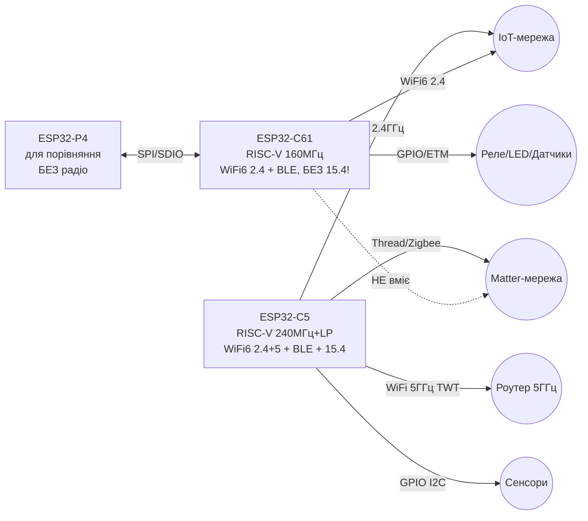
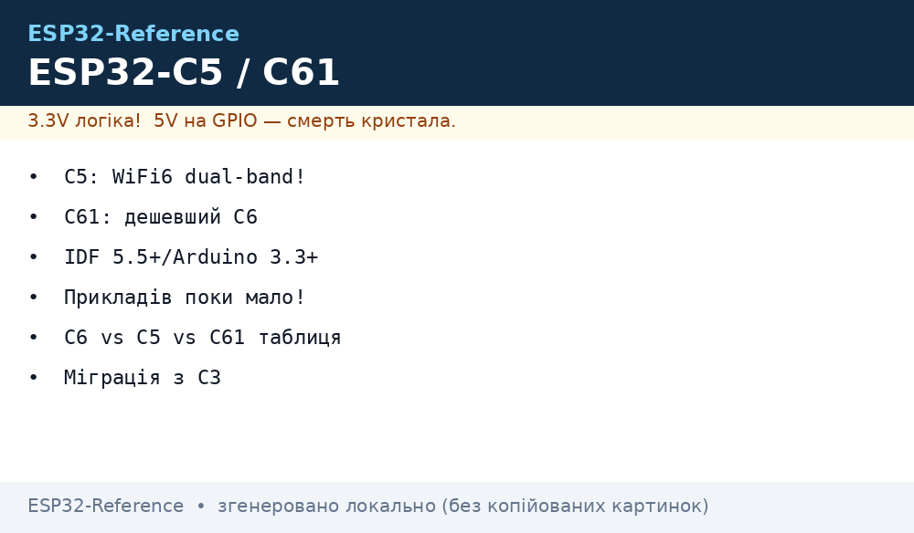

# ESP32-C5 / ESP32-C61 - dual-band Wi-Fi 6 і здешевлений Wi-Fi 6

## Призначення

ESP32-C5 - флагман C-лінійки: перший RISC-V MCU Espressif з **dual-band 2.4 + 5 ГГц Wi-Fi 6**,
плюс Bluetooth 5 (LE) і **IEEE 802.15.4 (Zigbee/Thread/Matter!)** в одному кристалі.
Позиціонування: **між C6 і S3** - радіо крутіше за C6 (додався діапазон 5 ГГц, CPU 240 МГц),
але без камерно-дисплейної потужності S3 (немає MIPI, USB HS, Octal PSRAM під LVGL/камеру).
Бери C5 коли потрібен Wi-Fi 6 з низькою затримкою (5 ГГц), шлюз Matter з Thread + Wi-Fi,
або заділ на майбутнє в забитому ефірі 2.4 ГГц.

ESP32-C61 - **здешевлений наступник C6**: той же Wi-Fi 6 + BLE 5, але **без 802.15.4!**
Урізано саме радіо Zigbee/Thread, зате залишили 160 МГц RISC-V, 320 КБ SRAM,
in-package PSRAM і багату периферію (ETM, компаратор). Бери C61 коли потрібен
дешевий Wi-Fi 6 вузол (розетка, лампа, датчик з Wi-Fi), а Matter - тільки **over-WiFi**,
без Thread. Потрібен Thread/Zigbee - бери C6/H2/C5, а не C61!
Сусіди по лінійці: [04-ESP32-C3-C6-H2](../../../ESP32-Reference/01-Hardware/04-ESP32-C3-C6-H2.md) (C3/C6/H2),
[09-ESP32-C2-P4](../../../ESP32-Reference/01-Hardware/09-ESP32-C2-P4.md) (дешевий C2 і хост P4),
порівняння всіх чипів - [03-Porivnyannya-chipiv](../../../ESP32-Reference/00-Start/03-Porivnyannya-chipiv.md).

> [!warning] Обидва - строго 3.3V!
> C5 і C61 живляться від **3.3V**, GPIO не 5V-tolerant. Плати DevKit роблять 3.3V з 5V USB через LDO.
> Датчики 5V - тільки через узгодження рівнів. Живлення 5 ГГц-передавача C5 вимогливе до струму!

## Характеристики C5 vs C61

| Параметр | ESP32-C5 | ESP32-C61 |
| --- | --- | --- |
| CPU | 32-bit single-core RISC-V до **240 МГц** + LP-CPU до 40 МГц | 32-bit single-core RISC-V до 160 МГц |
| Пам'ять | **384 КБ SRAM** + підтримка зовнішньої PSRAM, 320 КБ ROM | **320 КБ SRAM**, 256 КБ ROM, Quad SPI flash + in-package PSRAM (Quad SPI до 120 МГц) |
| Wi-Fi | **Dual-band 2.4 + 5 ГГц Wi-Fi 6** (802.11ax 20 МГц; b/g/n 20/40 МГц; a/b/g/n/ac сумісність) | **2.4 ГГц Wi-Fi 6** (802.11ax 20 МГц; b/g/n 20/40 МГц) |
| Wi-Fi фічі | TWT, OFDMA, MU-MIMO, BSS coloring | OFDMA, MU-MIMO, TWT |
| Bluetooth | BLE 5 (LE): coded PHY long-range, advertising extensions, 2 Мбіт, Mesh + ESP-Mesh-Lite | BLE 5 (LE): extended advertising, coded PHY, 2 Мбіт, Mesh 1.1 |
| 802.15.4 | **Так: Zigbee + Thread + Matter** (PHY+MAC на кристалі) | **Немає!** Урізано заради ціни |
| GPIO | До **29** програмованих | Стандартний набір MCU (див. даташит модуля) |
| Інтерфейси | SPI, UART, I2C, I2S, LED PWM, ADC, GDMA, SDIO 2.0 Slave, QSPI | SPI, I2C, UART, I2S, ADC, GDMA, **ETM**, аналоговий компаратор, LED PWM, GPIO, LP IO, Timers |
| Безпека | Secure Boot, flash+PSRAM encryption, криптоакселератори, Digital Signature, Key Manager, TEE + APM + PMP | Secure Boot, flash+PSRAM encryption, криптоакселератори, ECDSA Digital Signature, TEE + APM + PMP |
| Живлення | Строго 3.3 В, GPIO не 5V-tolerant | Строго 3.3 В, GPIO не 5V-tolerant |
| Статус | Масове виробництво з 30.04.2025 | Масове виробництво з 16.06.2025 |
| Ціль | Шлюзи, dual-band вузли, Matter + Thread, низьколатентний Wi-Fi | Дешеві Wi-Fi 6 вузли, Matter-over-WiFi, ESP-AT слейв |

> C5: LP-CPU 40 МГц може бути головним процесором для чутливих до живлення задач -
> основне ядро спить, LP збирає сенсори. C61: фішка - **ETM** (автоматизація тригер→задача без CPU)
> і компаратор для zero-cross детекції (димери, лічильники).

## Велика таблиця C-лінійки + P4: ядра / радіо / RAM / ціна / коли брати

| Чип | Ядра | Радіо | RAM / Flash | Ціна модуля 2026, $ * | Коли брати |
| --- | --- | --- | --- | --- | --- |
| C2 (ESP8684/85 SiP) | RISC-V 120 МГц | WiFi 4 + BLE 5 | 272 КБ SRAM; SiP-flash 2-4 МБ | 1.5-2.5 | Найдешевше: розетка, лампа, ESP-AT слейв |
| C3 | RISC-V 160 МГц | WiFi 4 + BLE 5.0 | 400 КБ SRAM; 4-8 МБ зовн. | 2-4 | Батарейний Wi-Fi датчик, ESP-NOW, BLE-маяк |
| C6 | RISC-V HP 160 МГц + LP 20 МГц | WiFi 6 (2.4) + BLE 5.3 + **15.4** | 512 КБ SRAM; 8 МБ | 4-6 | Matter/Thread/Zigbee-шлюз, Wi-Fi 6 2.4 ГГц |
| **C5** | RISC-V **240 МГц** + LP 40 МГц | WiFi 6 **(2.4+5)** + BLE 5 + **15.4** | **384 КБ** SRAM + зовн. PSRAM; 320 КБ ROM | 5-8 | **Wi-Fi 6 dual-band**, низька латентність, Thread+5 ГГц |
| **C61** | RISC-V 160 МГц | WiFi 6 (2.4) + BLE 5, **без 15.4** | **320 КБ** SRAM + in-package PSRAM; 256 КБ ROM | 2.5-4 | **Дешевий Wi-Fi 6** замість C3/C6 там, де Thread не треба |
| H2 | RISC-V 96 МГц + LP | Без Wi-Fi! BLE 5.2 + **15.4** | 320 КБ SRAM; 4-8 МБ | 3-5 | Zigbee-кінцевий пристрій на батареї + border router |
| P4 | Dual RISC-V HP 400 МГц + LP 40 МГц | **Немає!** Тільки через компаньйона C6 | 768 КБ HP SRAM + зовн. PSRAM; зовн. flash | 8-12 | HMI 1080p, камера MIPI, USB HS, edge-AI (+C6 на радіо) |

\* Ціни - орієнтовні роздрібні на модулі/DevKit у 2026 (AliExpress/дистриб'ютори), залежать від PSRAM і корпусу.
Оновлений зріз цін - [03-Porivnyannya-chipiv](../../../ESP32-Reference/00-Start/03-Porivnyannya-chipiv.md).

> [!tip] Формула вибору
> Треба Thread/Zigbee → C6/H2/**C5** (не C61, не C2!). Треба дешево Wi-Fi 6 → **C61**.
> Треба 5 ГГц → тільки **C5**. Треба камера/дисплей → S3/P4 (див. [03-ESP32-S3](../../../ESP32-Reference/01-Hardware/03-ESP32-S3.md)).
> Найдешевший вузол без Wi-Fi 6 → C2 (див. [09-ESP32-C2-P4](../../../ESP32-Reference/01-Hardware/09-ESP32-C2-P4.md)).

## Легенда пінів модулів

### ESP32-C5-DevKitC-1 (типова плата)

| Пін / група | Позначення | Тип | Куди / до чого | Примітка |
| --- | --- | --- | --- | --- |
| 1 | 5V (VIN) / 3V3 | Живлення | USB 5 В → LDO → 3.3 В | C5 на 5 ГГц TX їсть більше - LDO з запасом 600+ мА |
| 2 | GND | Земля | Спільна земля | Зірка до БЖ при шлюзі з периферією |
| 3 | GPIO9 | Strapping BOOT | Кнопка BOOT | LOW при reset = download-режим |
| 4 | GPIO8 | Strapping | Має бути HIGH при boot | Не тримати LOW (див. страппінг нижче)! |
| 5 | TX0/RX0 (GPIO11/12 тип.) | UART0 | USB-UART міст / консоль | Логи 115200, прошивка, 3.3V логіка |
| 6 | GPIO0/1 (I2C0) | I2C | SDA/SCL сенсорів | Pull-up 4.7 кОм до 3.3V |
| 7 | GPIO (до 29 шт) | GPIO/ADC/PWM/SPI | Сенсори, реле, LED | ADC 0-3.3 В, ШІМ через LEDC |
| 8 | EN | Enable | Кнопка EN | LOW = чип вимкнено, RC 10к + 1uF |

### ESP32-C61-MINI-1 / DevKit (типова плата)

| Пін / група | Позначення | Тип | Куди / до чого | Примітка |
| --- | --- | --- | --- | --- |
| 1 | 3V3 / 5V (VIN) | Живлення | 5 В USB або 3.3 В | LDO 500+ мА, конденсатори біля модуля |
| 2 | GND | Земля | Спільна земля | Обов'язково спільна з датчиками |
| 3 | GPIO9 | Strapping BOOT | Кнопка BOOT | LOW при reset = download |
| 4 | GPIO8 | Strapping | Має бути HIGH | Світлодіод/кнопка на GND = незавантаження |
| 5 | TX0/RX0 | UART0 | USB-UART міст | Консоль, прошивка |
| 6 | GPIO (I2C/SPI) | Шина | Сенсори | ETM вміє зв'язувати тригери без CPU |
| 7 | ADC-вхід | Аналог | Дільник/датчик 0-3.3 В | Без 5V! |
| 8 | EN | Enable | Кнопка EN | RC-ланцюг як у всіх C-чипів |

## Схема підключення

| ESP32-C5 шлюз | Периферія | Примітка |
| --- | --- | --- |
| 3V3 | VCC сенсорів 3.3 В | Бюджет LDO 600+ мА (5 ГГц TX пік!) |
| GND | GND | Спільна земля |
| GPIO0 (SDA) / GPIO1 (SCL) | I2C-сенсори | Pull-up до 3.3V |
| GPIO SPI | Zigbee/Thread-логіка внутр.! | Зовнішнього 15.4-модуля не треба |
| 5 ГГц антена | Dual-band PCB/IPEX | Однодіапазонна 2.4 ГГц антена зріже 5 ГГц! |
| TX0/RX0 | Консоль | Логи, прошивка |

| ESP32-C61 вузол | Периферія | Примітка |
| --- | --- | --- |
| 3V3 | VCC сенсора 3.3 В | LDO 500 мА достатньо (тільки 2.4 ГГц) |
| GND | GND | Спільна земля |
| GPIO I2C | SDA/SCL | 400 кГц, pull-up |
| GPIO | Реле через MOSFET | ETM-тригери без пробудження CPU |
| TX0/RX0 | Консоль | Логи |

### ASCII-схема

```text
ESP32-C5 (dual-band Wi-Fi 6 + BLE + 15.4!) — позиція між C6 і S3
------------
USB 5V ──[LDO 600мА+]──► 3V3 (чип строго 3.3В! 5 ГГц TX = пік струму!)
GND ───────────────────► GND
GPIO0 ────────────────► SDA сенсорів (I2C, pull-up 4.7к до 3.3V)
GPIO1 ────────────────► SCL сенсорів
GPIO8 (strapping) ────► HIGH при boot! Не вішати кнопку на GND!
GPIO9 (BOOT) LOW при reset = download-режим
ANT ──────────────────► DUAL-BAND антена 2.4+5 ГГц (IPEX/PCB)!
15.4 ─────────────────► ВСЕРЕДИНІ (Zigbee/Thread, зовнішній модуль НЕ треба)
PSRAM ────────────────► ЗОВНІШНЯ (квад SPI), батарею рахувати з нею!
C5 НЕ тягне камеру MIPI / USB HS — це S3/P4!

ESP32-C61 (здешевлений C6-наступник, БЕЗ 15.4!)
------------
USB 5V ──[LDO]──► 3V3 (строго 3.3В! GPIO не 5V-tolerant)
GND ────────────► GND
GPIO I2C ───────► SDA/SCL сенсорів (ETM: тригери без CPU!)
GPIO9 (BOOT) LOW при reset = download-режим
GPIO8 ──────────► HIGH при boot!
PSRAM ──────────► IN-PACKAGE (Quad SPI до 120 МГц) — вистачає без оптимізацій
УВАГА: 802.15.4 НЕМАЄ! Zigbee/Thread шукати на C6/H2/C5, не тут!
Matter на C61 = тільки over-WiFi!
```

### Mermaid




*Рис. C5 dual-band шлюз і C61 Wi-Fi 6 вузол. Місце під схему - див. .*

## Код ESP-IDF

```c
// ESP32-C5: dual-band Wi-Fi STA (target esp32c5, IDF 5.5+!)
#include "esp_wifi.h"
#include "nvs_flash.h"

void app_main_c5(void)
{
    nvs_flash_init();
    wifi_init_config_t cfg = WIFI_INIT_CONFIG_DEFAULT();
    esp_wifi_init(&cfg);
    wifi_config_t wc = {.sta = {.ssid = "SSID_5G", .password = "PASS"}};
    esp_wifi_set_mode(WIFI_MODE_STA);
    esp_wifi_set_config(WIFI_IF_STA, &wc);
    esp_wifi_start();
    esp_wifi_connect();
    // 802.15.4: esp_ieee802154_enable() + openthread/zigbee стек окремо.
    // LP-CPU 40 МГц: окремий firmware для збору сенсорів у сні.
}

// ESP32-C61: Wi-Fi 6 вузол (target esp32c61, IDF 5.5+)
#include "esp_wifi.h"
#include "nvs_flash.h"

void app_main_c61(void)
{
    nvs_flash_init();
    // C61: in-package PSRAM вже доступна — великі буфери без оптимізацій.
    wifi_init_config_t cfg = WIFI_INIT_CONFIG_DEFAULT();
    esp_wifi_init(&cfg);
    wifi_config_t wc = {.sta = {.ssid = "SSID", .password = "PASS"}};
    esp_wifi_set_mode(WIFI_MODE_STA);
    esp_wifi_set_config(WIFI_IF_STA, &wc);
    esp_wifi_start();
    esp_wifi_connect();
    // Matter: esp-matter over-WiFi (не Thread!). 15.4 тут НЕ шукати.
}
```

```bash
# ESP-IDF 5.5+: вибір цілі (C5 / C61 — тільки 5.5 і новіші!)
idf.py set-target esp32c5
idf.py set-target esp32c61
idf.py build flash monitor
esptool.py --chip esp32c5 --port /dev/ttyACM0 flash_id
esptool.py --chip esp32c61 --port /dev/ttyACM0 flash_id
```

## Код Arduino

```cpp
// ESP32-C5 (ядро arduino-esp32 3.3.x+, плата "ESP32C5 Dev Module")
#include <WiFi.h>
void setup() {
  Serial.begin(115200);
  WiFi.mode(WIFI_STA);
  WiFi.begin("SSID_5G", "PASS");  // C5 вміє 5 ГГц — SSID точки 5G!
  while (WiFi.status() != WL_CONNECTED) delay(300);
  Serial.println(WiFi.localIP());
  // USB CDC On Boot: Enabled (DevKitC-1 — native USB-Serial-JTAG).
}
void loop() {}

// ESP32-C61 (ядро 3.3.x+, плата "ESP32C61 ..." / MINI-1)
#include <WiFi.h>
void setup_c61() {
  Serial.begin(115200);
  WiFi.mode(WIFI_STA);
  WiFi.begin("SSID", "PASS");  // тільки 2.4 ГГц!
  while (WiFi.status() != WL_CONNECTED) delay(300);
  Serial.println(WiFi.localIP());
}
```

## Код MicroPython

```python
# C5/C61: стабільної збірки MicroPython станом на 2026 НЕМАЄ — тільки експеримент!
# Стратегія: прототип на C3 (є збірка) → продакшн на C5/C61 через ESP-IDF/Arduino.
# Слідкувати за гілками micropython + oplopcний порт esp32c5/esp32c61.
import network, time
# w = network.WLAN(network.STA_IF)  # запрацює лише після офіційного порту
# w.active(True); w.connect("SSID", "PASS")
```

## Страппінг-особливості C5 / C61

| Режим | C5: GPIO8/9 | C61: GPIO8/9 | EN | Лог / дія |
| --- | --- | --- | --- | --- |
| SPI-boot (норма) | GPIO8 HIGH, GPIO9 HIGH | GPIO8 HIGH, GPIO9 HIGH | HIGH | `boot:0x8`, старт з flash |
| Download | GPIO9 LOW при reset | GPIO9 LOW при reset | фронт 0→1 | `waiting for download`, ший |
| USB-JTAG | GPIO8 HIGH, GPIO9 HIGH | GPIO8 HIGH, GPIO9 HIGH | HIGH | Boot + OpenOCD |
| Пастка | GPIO8 LOW = застряг (не вішати LED/кнопку на GND!) | Те саме | - | Кнопки - на інші піни! |

> [!danger] GPIO8-пастка всього C-сімейства
> C5/C61 успадкували логіку C3/C6/H2/C2: GPIO8 має бути HIGH у момент reset.
> Світлодіод на GPIO8 - тільки через резистор до 3.3V (активний LOW - не можна!),
> кнопки з підтяжкою до GND на GPIO8/9 - заборонені. Повна таблиця: [07-Boot-Strapping-Reset](../../../ESP32-Reference/01-Hardware/07-Boot-Strapping-Reset.md).
> Flash/PSRAM - 3.3V, режими flash: [06-Flash-PSRAM](../../../ESP32-Reference/01-Hardware/06-Flash-PSRAM.md).

```bash
# Діагностика завантаження
esptool.py --chip esp32c5 --port /dev/ttyACM0 flash_id
esptool.py --chip esp32c61 --port /dev/ttyACM0 flash_id
# Мовчить? BOOT(GPIO9)→GND, клік EN, ший, відпусти BOOT після Connecting...
```

| Лог C5/C61 | Значення | Дія |
| --- | --- | --- |
| `boot:0x8` | Норма | Працюй |
| `waiting for download` | ROM чекає | Ший `write_flash` |
| `invalid chip id` | Не той `--chip` (c5 vs c61!) | Підстав правильний чип |
| `flash read err` | Не той розмір flash / режим QSPI | Див. [06-Flash-PSRAM](../../../ESP32-Reference/01-Hardware/06-Flash-PSRAM.md) |
| Тиша + `rst:0x10` | Просадка 3.3V (5 ГГц TX на C5!) | Потужніший LDO, коротший USB |

## Підтримка в ESP-IDF / Arduino (версії!)

| Середовище | ESP32-C5 | ESP32-C61 | Примітка |
| --- | --- | --- | --- |
| ESP-IDF | **5.5+** (initial, mass-production анонс 04.2025) → latest стабільно | **5.5+** (повна, + ESP-Matter SDK) | `set-target esp32c5` / `esp32c61`; старіші 5.1/5.2 ціль не знають! |
| Arduino-ESP32 | **3.3.x+** (3.3.7 протестовано, 3.3.11 має `esp32c5-libs`) | **3.3.x+** (PR #12019 `feat(esp32c61)`) | Плати C5/C61 Dev Module; **2.x - немає!** |
| PlatformIO | Через pioarduino / community, тестується | Аналогічно | Для продакшну - чистий IDF надійніший |
| MicroPython | Експеримент / немає стабільної | Експеримент / немає стабільної | Прототип на C3 - [MicroPython](../../../ESP32-Reference/09-Proshivka/03-MicroPython.md) |
| ESP-AT / ESP-Hosted | Так (C5 як coprocessor) | Так (C61 як coprocessor) | AT по UART, Hosted по SPI/SDIO |
| Налагодження | USB-Serial-JTAG + OpenOCD | USB-Serial-JTAG + OpenOCD | JTAG: [05-JTAG-Debug](../../../ESP32-Reference/09-Proshivka/05-JTAG-Debug.md) |

Деталі встановлення: [01-ESP-IDF-setup](../../../ESP32-Reference/09-Proshivka/01-ESP-IDF-setup.md), [02-Arduino-PlatformIO](../../../ESP32-Reference/09-Proshivka/02-Arduino-PlatformIO.md),
вибір середовища - [05-Vibir-seredovischa](../../../ESP32-Reference/00-Start/05-Vibir-seredovischa.md), прошивка - [04-Esptool-Flash](../../../ESP32-Reference/09-Proshivka/04-Esptool-Flash.md).

> [!warning] Купив C5 - онови SDK першим ділом!
> Симптом «IDF не знає esp32c5» = старий IDF (<5.5). Симптом «немає плати C5/C61 в Arduino» =
> ядро 2.x або 3.0-3.2 без свіжих дефінішенів - онови до **3.3.x+** через Boards Manager.

## Типові помилки

1. **Купив C5, а прикладів немає** → бо шукаєш в Arduino 2.x / IDF 5.1. Лікування: IDF **5.5+**, Arduino **3.3.x+**, приклади з IDF `examples/wifi`, `examples/openthread`, `examples/zigbee`.
2. **Чекають 5 ГГц від C61/C6/C3** → 5 ГГц вміє тільки **C5**! Перевір SSID точки 5G і dual-band антену.
3. **Беруть C61 під Zigbee/Thread** → там немає 802.15.4 апаратно! Тільки C5/C6/H2. C61 - Matter лише over-WiFi.
4. **Беруть C5 під камеру/HMI 1080p** → немає MIPI/USB HS. Камера бюджетна - S3, HMI важка - P4 + C6/C61 на радіо.
5. **5 В на GPIO/3V3** → смерть піна. Обидва строго 3.3 В.
6. **Слабкий LDO/довгий USB на C5** → ребути при 5 ГГц TX (`rst:0x10`). LDO 600+ мА, кабель ≤50 см, електроліт біля модуля.
7. **Однодіапазонна антена на C5** → 5 ГГц «не ловить». Тільки dual-band PCB/IPEX 2.4+5, трасування за [08-Anteni-RF](../../../ESP32-Reference/01-Hardware/08-Anteni-RF.md).
8. **GPIO8 на GND (LED/кнопка)** → вічне незавантаження. Див. страппінг вище + [07-Boot-Strapping-Reset](../../../ESP32-Reference/01-Hardware/07-Boot-Strapping-Reset.md).
9. **Шукають стабільний MicroPython на C5/C61** → його немає. Прототип на C3, продакшн на IDF/Arduino.
10. **PSRAM на межі (C61 in-package 120 МГц QSPI)** → артефакти при довгих шлейфах/шумі живлення. Знизити частоту PSRAM у menuconfig, чистити 3.3V.
11. **Плутають `--chip` в esptool** → `esp32c5` vs `esp32c61` vs `esp32c6`. `invalid chip id` = не та ціль.
12. **Чекають deep-sleep C6-рівня від C5 на 5 ГГц** → 5 ГГц тримає ефір дорожче. Для років на батареї - C3/H2 + TWT, див. [03-Porivnyannya-chipiv](../../../ESP32-Reference/00-Start/03-Porivnyannya-chipiv.md).

## eFuse і захист (C5 / C61)

> [!danger] eFuse - необоротні!
> `0` → `1` назавжди. `UART_DOWNLOAD_DIS` останнім, `JTAG_DISABLE` після кінця дебагу.
> База ключів і шифрування: [04-Secure-Boot-Encrypt](../../../ESP32-Reference/08-Pamyat/04-Secure-Boot-Encrypt.md), дебаг: [05-JTAG-Debug](../../../ESP32-Reference/09-Proshivka/05-JTAG-Debug.md).

| Біт / поле | C5 | C61 | Необоротність |
| --- | --- | --- | --- |
| `JTAG_DISABLE` | + (лишай відкритим поки дебажиш 5 ГГц!) | + | Так |
| `FLASH_CRYPT_CNT` | 7 бітів, непарне = ON (flash + PSRAM) | 7 бітів, XTS + PSRAM-шифрування | Тільки допалювати |
| `SECURE_BOOT_EN` | + (ECDSA) | + (ECDSA) | Так |
| `KEY_PURPOSE_0..5` | Є + Key Manager призначення | Є + ECDSA DS слот | Один раз! |
| `UART_DOWNLOAD_DIS` | + | + | Так, останнім |
| `DISABLE_DL_ENCRYPT/DECRYPT/CACHE` | + | + | Так |
| `SECURE_BOOT_KEY_REVOKE` | 3 шт | 3 шт | Так |
| Особливе | TEE + APM + PMP ізоляція, DS-периферія | TEE + APM + PMP, ETM не чіпає ключі | - |

```bash
# Інспекція (безпечно)
espefuse.py --chip esp32c5 --port /dev/ttyACM0 summary
espefuse.py --chip esp32c61 --port /dev/ttyACM0 summary
espefuse.py --chip esp32c5 --port /dev/ttyACM0 get FLASH_CRYPT_CNT

# Ключ XTS з файлу (32 випадкові байти!)
python3 -c "import os; open('/tmp/opencode/c5_xts.bin','wb').write(os.urandom(32))"
espefuse.py --chip esp32c5 --port /dev/ttyACM0 burn_key BLOCK_KEY0 /tmp/opencode/c5_xts.bin XTS_AES_128_KEY
```

```c
// Єдина діагностика C5/C61
#include "esp_flash_encrypt.h"
#include "esp_secure_boot.h"
void c5c61_prot(void) {
    ESP_LOGI("p", "crypt=%d sb=%d",
        esp_flash_encryption_enabled(), esp_secure_boot_enabled());
}
```

## Типові тактові / кварци (C5 / C61)

| Джерело | C5 | C61 | Призначення |
| --- | --- | --- | --- |
| XTAL | 40 МГц | 40 МГц | Опора |
| CPU | 240 МГц HP + 40 МГц LP | 160 МГц single | Обчислення |
| APB | 80 МГц | 80 МГц | Шини |
| USB-Serial-JTAG | 48 МГц від PLL | 48 МГц від PLL | Прошивка/логи/дебаг |
| Radio PHY | 2.4 + **5 ГГц** Wi-Fi 6 + BLE + 15.4 | 2.4 ГГц Wi-Fi 6 + BLE 5 | Радіо-домен |
| RTC_SLOW | 150 кГц / 32.768 кГц + LP-core | 150 кГц / 32.768 кГц | Сон, LP-задачі |
| Допуск кварцу | **±10 ppm (Wi-Fi 6 dual-band строгий!)** | ±10 ppm (Wi-Fi 6) | Точність |

```text
C5 на 5 ГГц чутливіший до фазового шуму, ніж будь-який 2.4 ГГц чип.
Кварц ±10 ppm обов'язковий; ±20 ppm = retries, просадка MCS, втрата 5 ГГц.
Перевірка: ping -c 100 на 5G → loss >5% при сильному RSSI = підозра на кварц/живлення.
C61 (тільки 2.4): вимоги м'якші, але для Wi-Fi 6 теж тримай ±10 ppm.
```

```cpp
// C5/C61: економія (WiFi живий, струм -30%)
#include <Arduino.h>
void setup() {
  Serial.begin(115200);
  setCpuFrequencyMhz(80);  // C5: 240→80, C61: 160→80
  Serial.println(getCpuFrequencyMhz());
}
```

## Режим завантаження (C5 / C61)

| Режим | C5 | C61 | EN | Лог / дія |
| --- | --- | --- | --- | --- |
| SPI-boot (норма) | GPIO8 HIGH, GPIO9 HIGH | GPIO8 HIGH, GPIO9 HIGH | HIGH | `boot:0x8` |
| Download | GPIO9 LOW при reset | GPIO9 LOW при reset | фронт 0→1 | `waiting for download` |
| JTAG | Піни вільні, strapping як boot | Так само | HIGH | Boot + OpenOCD |

```bash
esptool.py --chip esp32c5 --port /dev/ttyACM0 flash_id
esptool.py --chip esp32c61 --port /dev/ttyACM0 flash_id
# C5 мовчить на 5V-просадці? Короткий USB-кабель + живлення плати безпосередньо 3.3В.
```

## Практика 5 ГГц на C5: діапазон, канали, співіснування

| Тема | Практика |
| --- | --- |
| Вибір діапазону | 5 ГГц - швидкість і чистота; 2.4 - дальність і стіни |
| Канали 5 ГГц | 36-64 (без DFS), 100+ з DFS-радаром - для дому нижні! |
| DFS | Радар аеропорту викидає з каналу - не для критичного |
| Ширина 20 МГц | 40+ тільки якщо ефір чистий, інакше гірше |
| Роумінг | Перехід між точками - розрив, закладати реконект |

| Співіснування на одному кристалі | Правило |
| --- | --- |
| WiFi 5 ГГц + BLE | Рознесені частоти - конфліктів мінімум |
| WiFi 2.4 + BLE/15.4 | Coex-арбітр обов'язковий! |
| WiFi 2.4 + Thread | Time-slicing, пріоритет Thread-кадрів |
| Два активні радіо | Піки струму складаються - живлення з запасом |

```text
Практика виміру:
  iperf на 2.4 vs 5 поруч з роутером — цифри, не відчуття;
  дальність кроками з RSSI-логом;
  просадка живлення осцилографом саме на 5 ГГц TX.
```

## Міграція C3/C6 → C5/C61: карта відмінностей

| Тема | C3/C6 | C5/C61 | Дія |
| --- | --- | --- | --- |
| IDF | 4.4+/5.1+ | 5.5+ обов'язково! | Оновити першим ділом |
| Стрепінг | Свої комбінації | GPIO8/9, пастка GPIO8 LOW | Перечитати таблицю! |
| Радіо | 2.4 тільки | C5 +5 ГГц | Діапазон у конфігу явно |
| PSRAM | Опційно | Зовнішня, конфіг той же | Перевірити розмір |
| LP-ядро | Немає/є | LP 40 МГц | Сон-логіка переписується |
| Піни | Своя карта | Інша карта! | Перемапити все |
| Arduino | 2.x працює | Тільки 3.3.x+ | Оновити ядро |

```text
Порядок міграції:
  1. Оновити IDF/Arduino;
  2. Новий проєкт з нуля, не копія старого;
  3. Піни і стрепінг за новим даташитом;
  4. Радіо-конфіг під задачу;
  5. Стрес: WiFi + сон добу без ребутів.
```

## Офіційні джерела

- [ESP32-C5 - сторінка продукту (Espressif)](https://www.espressif.com/en/products/socs/esp32-c5) - dual-band Wi-Fi 6 + BLE + 15.4, 240 МГц, 384 КБ SRAM, 29 GPIO.
- [ESP32-C61 - сторінка продукту (Espressif)](https://www.espressif.com/en/products/socs/esp32-c61) - Wi-Fi 6 + BLE 5, 160 МГц, 320 КБ SRAM, in-package PSRAM, без 15.4.
- [ESP-IDF Programming Guide - ESP32-C5 (Espressif docs)](https://docs.espressif.com/projects/esp-idf/en/latest/esp32c5/index.html) - старт, API, ціль `esp32c5`.
- [ESP-IDF Programming Guide - ESP32-C61 (Espressif docs)](https://docs.espressif.com/projects/esp-idf/en/latest/esp32c61/index.html) - старт, API, ціль `esp32c61`.
- [ESP32-C5 now in Mass Production (Espressif news, 30.04.2025)](https://www.espressif.com/en/news/ESP32-C5_Mass_Production) - 384 КБ SRAM, LP-CPU 40 МГц, IDF v5.5 initial support, ESP-AT/Hosted.
- [ESP32-C61 now in Mass Production (Espressif news, 16.06.2025)](https://www.espressif.com/en/news/C61_Mass_Production) - OFDMA/MU-MIMO/TWT, Mesh 1.1, IDF + Matter SDK.
- [Arduino-ESP32 releases (GitHub)](https://github.com/espressif/arduino-esp32/releases) - 3.3.x на IDF 5.5.x: `esp32c5-libs`, `feat(esp32c61)`.

## Див. також

- [Home](../../../ESP32-Reference/Home.md)
- [03-Porivnyannya-chipiv](../../../ESP32-Reference/00-Start/03-Porivnyannya-chipiv.md)
- [04-ESP32-C3-C6-H2](../../../ESP32-Reference/01-Hardware/04-ESP32-C3-C6-H2.md)
- [09-ESP32-C2-P4](../../../ESP32-Reference/01-Hardware/09-ESP32-C2-P4.md)
- [01-ESP32-Classic](../../../ESP32-Reference/01-Hardware/01-ESP32-Classic.md)
- [03-ESP32-S3](../../../ESP32-Reference/01-Hardware/03-ESP32-S3.md)
- [06-Flash-PSRAM](../../../ESP32-Reference/01-Hardware/06-Flash-PSRAM.md)
- [07-Boot-Strapping-Reset](../../../ESP32-Reference/01-Hardware/07-Boot-Strapping-Reset.md)
- [08-Anteni-RF](../../../ESP32-Reference/01-Hardware/08-Anteni-RF.md)
- [05-Vibir-seredovischa](../../../ESP32-Reference/00-Start/05-Vibir-seredovischa.md)
- [01-ESP-IDF-setup](../../../ESP32-Reference/09-Proshivka/01-ESP-IDF-setup.md)
- [02-Arduino-PlatformIO](../../../ESP32-Reference/09-Proshivka/02-Arduino-PlatformIO.md)
- [04-Esptool-Flash](../../../ESP32-Reference/09-Proshivka/04-Esptool-Flash.md)
- [02-Troubleshooting-FAQ](../../../ESP32-Reference/99-Dodatki/02-Troubleshooting-FAQ.md)
