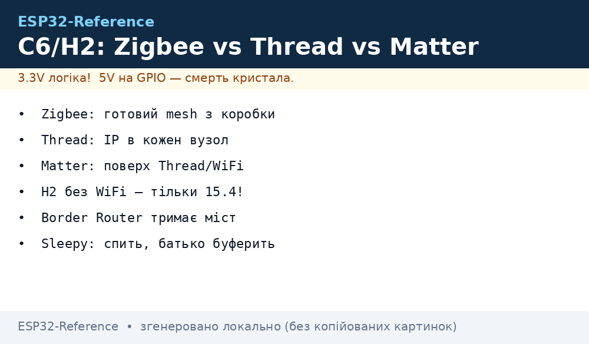
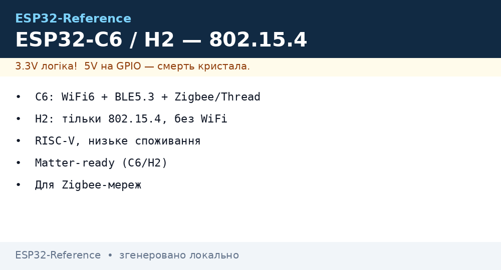
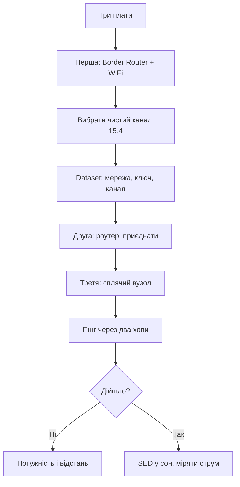

# ESP32-C6 / H2 - 802.15.4 mesh глибоко





## Призначення

ESP32-C6 / H2 - 802.15.4 mesh глибоко. Оглядова нота [04-ESP32-C3-C6-H2](../../../ESP32-Reference/01-Hardware/04-ESP32-C3-C6-H2.md) дає порівняння лінійки, ця - практику mesh: коли Zigbee, коли Thread, коли Matter зверху, як комісіонувати вузли, як сплять кінцеві і хто буферить їм пакети, як C6 ділить ефір між WiFi і 15.4. Після прочитання - робочий mesh з трьох вузлів за вечір.

## Zigbee проти Thread проти Matter: вибір

| Критерій | Zigbee | Thread | Matter |
| --- | --- | --- | --- |
| Модель | Mesh з координатором | Mesh без єдиної точки (leader) | Протокол застосунків поверх |
| Транспорт | Свій стек цілком | IPv6 (6LoWPAN) | Thread або WiFi |
| Координатор вмер | Мережа осиротіла | Новий leader обрано | Залежить від транспорту |
| Екосистема | Готова: лампи, датчики | Роутери+BR | Apple/Google/Home Assistant |
| Інструменти | Zigbee2MQTT | OTBR + веб-морда | chip-tool, контролер |

```text
Правило вибору:
  готові девайси з магазину .... Zigbee + Zigbee2MQTT;
  своя IP-мережа датчиків ....... Thread + Border Router;
  голосові асистенти ............ Matter поверх Thread або WiFi;
  H2 без WiFi ................... тільки 15.4-варіанти!
```

## Ролі вузлів: хто спить, хто ні

| Роль | Спить? | Живлення | Приклад |
| --- | --- | --- | --- |
| Координатор/Leader | Ні | Мережа | Шлюз на столі |
| Роутер | Ні | Мережа | Лампа-ретранслятор |
| Кінцевий (ED) | Так, прокидається сам | Батарея | Вимикач |
| Сплячий (SED) | Так, глибоко | Батарея на роки | Датчик раз на годину |
| Батько (Parent) | Ні | Мережа | Буферить пакети сплячим дітям! |

> Роутером може бути тільки вузол від мережі. Сплячий роутер - діра в мережі, через яку пакети не ходять.

## Комісіонування: як вузол потрапляє в мережу

| Спосіб | Як | Коли |
| --- | --- | --- |
| Install code / QR | Сканування + короткий ключ | Matter і Zigbee 3.0 |
| Passphrase мережі | Вводиться руками | Thread dataset |
| Кнопка на роутері | Open commissioning вікно | Домашня мережа |
| Заводський dataset | Прошито з заводу | Серія з претензією |

| Пастка | Наслідок |
| --- | --- |
| Один ключ на всі вузли | Злам одного = злам мережі |
| Комісіонування не закрито | Сусід підкинув свій вузол |
| Канал захардкожено | WiFi-роутер поруч глушить |

## Канали 15.4 проти WiFi: рознести

| Діапазон 15.4 | Перетин з WiFi | Висновок |
| --- | --- | --- |
| Канали 11-14 | WiFi 1 | Уникати при WiFi на 1 |
| Канали 15-19 | Між WiFi 1 і 6 | Відносно тихо |
| Канали 20-24 | WiFi 6-11 | Уникати |
| Канали 25-26 | Вище WiFi 11 | Найчистіші! |

```text
Практика:
  сканувати ефір перед вибором каналу;
  канали 25–26 — перший кандидат;
  фіксувати канал у dataset, не стрибати.
```

## Mermaid: підняття mesh з трьох вузлів



## Співіснування C6: WiFi + 15.4 на одному кристалі

| Тема | Практика |
| --- | --- |
| Coex-арбітр | Увімкнено завжди при двох радіо! |
| Пріоритети | 15.4-кадри реального часу вище фонового WiFi |
| Піки струму | Обидва TX одночасно - живлення з запасом |
| Тест | Прогнати трафік обома шляхами добу |

## H2 як USB-донгл: сніфер і Border Router

| Роль донгла | Як |
| --- | --- |
| Сніфер 15.4 | Прошивка сніфера + Wireshark |
| Thread BR | H2 радіо + хост з OTBR |
| Zigbee-координатор | Zigbee2MQTT бачить порт |
| Тестовий роутер | Живлення від USB, антена вгору |

## OTA в mesh: оновлення повільно

| Тема | Практика |
| --- | --- |
| Швидкість | Кілобайти, не мегабайти - образ довго! |
| Сплячі вузли | Прокидаються за пакетами, оновлення годинами |
| Спочатку роутери | Магістраль оновити першою |
| Відкат | Два слоти або заводський образ |

## Живлення mesh-вузлів: цифри

| Роль | Струм | Батарея |
| --- | --- | --- |
| Координатор/BR | Десятки мА постійно | Тільки мережа! |
| Роутер | Десятки мА | Тільки мережа! |
| SED датчик | Мікроампери + піки TX | Роки від CR2450 |
| Тестовий вузол | USB | Не міряти сон з USB-UART! |

## Thread dataset: поля, які мусиш знати

| Поле | Зміст |
| --- | --- |
| Network Name | Імя мережі, видно при скані |
| Channel | Фіксований після виміру ефіру! |
| PAN ID | Ідентифікатор мережі |
| Network Key | Головний секрет - не в git! |
| PSKc | Пароль комісіонування |
| Channel Mask | Дозволені канали для стрибків |

```text
Практика dataset:
  генерувати новий ключ на мережу, не копіпастити з прикладу;
  бекап dataset в сейфі — втратив, перекомісіоновуй все;
  канал фіксувати після сканування, не авто.
```

## Zigbee binding і групи: щоб вимикач знав лампу

| Тема | Практика |
| --- | --- |
| Binding-таблиця | Хто кому шле без координатора |
| Групи | Одна команда - десять ламп |
| Сцени | Набір станів однією командою |
| Привʼязка при комісіонуванні | Одразу, поки руки дійшли! |

## Matter fabric: адміністратори і вузли

| Тема | Практика |
| --- | --- |
| Fabric | Спільна довіра: адмін + вузли |
| Кілька адмінів | Apple і Google одночасно - можна |
| Видалення вузла | З усіх fabric, не лише з одного! |
| Paring code | Одноразовий, не світити в лог |

## SED polling: як сплячий забирає пакети

| Параметр | Значення |
| --- | --- |
| Інтервал опитування | Секунди-хвилини: частіше - живіше, голодніше |
| Батько буферить | Поки дитина спить, пакети чекають |
| Таймаут дитини | Проспав довго - викинули з таблиці! |
| Переприєднання | Автоматичне, але повільне |

```text
Бюджет SED-датчика:
  сон мікроампери, вимір мілісекунди, TX десятки мілісекунд;
  раз на 10 хвилин — роки від CR2450;
  раз на 10 секунд — місяці, рахуй чесно.
```

## Сканування ефіру перед вибором каналу

| Крок | Дія |
| --- | --- |
| 1 | Energy scan усіма каналами 15.4 |
| 2 | WiFi-скан: які канали зайняті роутерами |
| 3 | Вибрати найтихіший з 25-26 у пріоритеті |
| 4 | Зафіксувати в dataset, перевірити добу |

## Типові помилки

| # | Помилка | Чому погано | Як правильно |
| --- | --- | --- | --- |
| 1 | Роутер на батареї | Мережа з дірою | Роутери тільки від мережі! |
| 2 | H2 як WiFi-вузол | WiFi немає фізично | H2 - mesh + хост |
| 3 | Канал поруч з WiFi | Колізії і повтори | 25-26 або сканування |
| 4 | Один ключ скрізь | Злам масштабується | Унікальні install codes |
| 5 | Комісіонування відкрите | Чужі вузли | Закривати вікно! |
| 6 | Coex вимкнено на C6 | Рвуться обидва радіо | Арбітр завжди |
| 7 | OTA відразу на всіх | Мережа лежить годинами | Спочатку роутери, потім сплячі |
| 8 | Тест одним вузлом | Mesh не перевірено | Мінімум три: BR, роутер, SED |

## Офіційні джерела

- [ESP Zigbee SDK (Espressif)](https://docs.espressif.com/projects/esp-zigbee-sdk/en/latest/) - координатор, роутер, ED.
- [ESP Thread BR (Espressif)](https://docs.espressif.com/projects/esp-thread-br/en/latest/) - Border Router, dataset.
- [ESP Matter SDK (Espressif)](https://docs.espressif.com/projects/esp-matter/en/latest/) - комісіонування, chip-tool.

## Див. також

- [Home](../../../ESP32-Reference/Home.md)
- [04-ESP32-C3-C6-H2](../../../ESP32-Reference/01-Hardware/04-ESP32-C3-C6-H2.md)
- [02-BLE-Bluetooth](../../../ESP32-Reference/05-Radio/02-BLE-Bluetooth.md)
- [09-Matter-Thread-Zigbee](../../../ESP32-Reference/15-Protokoli/09-Matter-Thread-Zigbee.md)
- [13-ESP32C6-Boards](../../../ESP32-Reference/14-Devboards/13-ESP32C6-Boards.md)
- [14-ESP32H2-Boards](../../../ESP32-Reference/14-Devboards/14-ESP32H2-Boards.md)
- [08-Diagnostic-Map](../../../ESP32-Reference/99-Dodatki/08-Diagnostic-Map.md)
