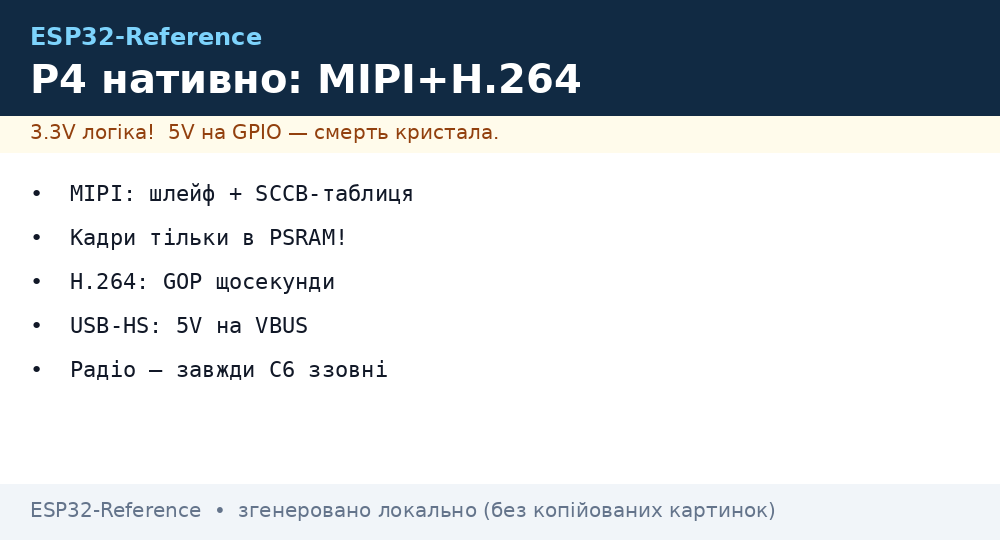
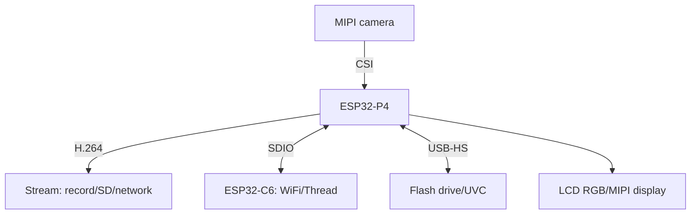

# ESP32-P4 natively - MIPI, H.264 and USB without the Arduino core


*Fig. P4 natively: MIPI camera to H.264 to record/stream, USB-OTG HS for flash drives and cameras, C6 for radio.*

> [!tip] What this note is
> Chip-level P4 without the Arduino layer: direct IDF drivers, MIPI, codec, USB host. Board: [P4 board](../../../ESP32-Reference/14-Devboards/16-P4-DevKit.md), USB host: [ESP32 USB host](../../../ESP32-Reference/12-Moduli-zvyazku/30-USB-Host.md).

## 1. Goal

Squeeze P4 natively:

- MIPI-CSI cameras: init and frames without ready wrappers;
- H.264 encoder: stream parameters for recording;
- USB-OTG HS: speed and device classes;
- P4 (host) plus C6 (radio) bundle over SDIO;
- when P4, and when S3 is enough.

| Parameter | ESP32-P4 | ESP32-S3 |
| --- | --- | --- |
| CPU | 2xRISC-V 400 MHz | 2xLX7 240 MHz |
| Radio | none | WiFi plus BLE |
| Camera | MIPI-CSI | DVP |
| Video | H.264 encoder | none |
| USB | OTG HS | OTG FS |

## 2. Architecture



## 3. Function EV Board pinout

| Signal | Pins | Note |
| --- | --- | --- |
| MIPI-CSI | dedicated FPC connector | cable to the stop |
| USB-OTG HS | board USB-A connector | 5V power for devices |
| USB-Serial | USB-C (JTAG plus log) | flashing and monitor |
| SDMMC | 4-bit SD slot | video recording |
| GPIO | 2.54 headers | 3.3V logic! |
| 5V/GND | power terminals | 2A minimum |

## 4. MIPI-CSI natively

- `esp_lcd`/`mipi_csi` driver: lane and frequency config;
- OV5647/IMX636 sensor - init with an SCCB table;
- buffers in PSRAM: a 1080p frame does not fit in SRAM;
- double-buffering - no stream tears;
- IDF `mipi_csi_dvp` example as the frame.

## 5. Working code (C, ESP-IDF)

```c
#include "esp_video.h"
#include "esp_log.h"

static const char *TAG = "p4mipi";

void app_main(void) {
  esp_video_init_config_t cfg = {
    .csi = {
      .sccb_config = {.init_sccb = true, .freq = 100000},
      .reset_pin = 12, .pwdn_pin = -1,
    },
  };
  ESP_ERROR_CHECK(esp_video_init(&cfg));
  int fd = esp_video_open("/dev/video0", 0);
  uint8_t *frame = heap_caps_malloc(230400, MALLOC_CAP_SPIRAM);
  while (1) {
    int len = read(fd, frame, 230400);
    if (len > 0) {
      ESP_LOGI(TAG, "frame %d bytes", len);
    }
    vTaskDelay(pdMS_TO_TICKS(100));
  }
}
```

IDF V4L2 layer: open `/dev/video0` - read frames like a file. Real structures - from the example for your sensor.

## 6. Working code (MicroPython)

```python
# MicroPython на P4: статуси і керування (важке відео — на C!)
import network
import urequests
import time
from machine import Pin, ADC

status = Pin(48, Pin.OUT)
temp = ADC(Pin(3))
wlan = network.WLAN(network.STA_IF)
wlan.active(True)

def report(ip, t):
    try:
        urequests.post('http://' + ip + '/p4', json={'temp': t})
    except OSError:
        pass

while True:
    raw = temp.read_u16()
    status.value(not status.value())
    report('192.168.1.10', raw * 3.3 / 65535)
    time.sleep(5)
```

Honest note: MicroPython on P4 is for the wiring (monitoring, buttons, MQTT), MIPI/H.264 - only C drivers of IDF.

## 7. H.264: stream parameters

- bitrate: 2-8 Mbit/s for 1080p (the scene decides);
- GOP: key frame every second for streaming;
- CBR for the channel, VBR for recording;
- recording: MP4 muxer on top of the encoder;
- stream: RTSP server on P4 or chunks into MQTT (no!).

## 8. Common issues

| Symptom | Cause | Fix |
| --- | --- | --- |
| Black MIPI frame | sensor cable/power | reseat, check the camera LDO |
| H.264 falls apart | slow PSRAM/overheat | lower resolution, heatsink |
| USB-HS sees nothing | no 5V on VBUS | enable OTG power |
| IDF does not know P4 | old version | IDF 5.3+, `set-target esp32p4` |
| Torn frame | single buffer | double buffer in PSRAM |
| C6 silent over SDIO | frequency/pins | start from 10 MHz, verify mapping |

## 9. Quick P4 cheat sheet

- MIPI: cable plus sensor SCCB table;
- frames - only in PSRAM;
- H.264: GOP every second for streaming;
- USB-HS: 5V on VBUS mandatory;
- radio - always an external C6.

## 10. See also

- [P4 board](../../../ESP32-Reference/14-Devboards/16-P4-DevKit.md) - the product in detail.
- [ESP32 USB host](../../../ESP32-Reference/12-Moduli-zvyazku/30-USB-Host.md) - OTG practice.
- [camera streaming](../../../ESP32-Reference/12-Moduli-zvyazku/13-Camera-Streaming.md) - the server side.
- [C6 boards](../../../ESP32-Reference/14-Devboards/13-ESP32C6-Boards.md) - the radio buddy.
- [home map](../../../ESP32-Reference/Home.md) - full navigation.

## Official sources

- [ESP32-P4 (Espressif)](https://www.espressif.com/en/products/socs/esp32-p4) - die characteristics.
- [ESP-IDF P4 API (Espressif)](https://docs.espressif.com/projects/esp-idf/en/latest/esp32p4/) - MIPI, H.264, USB.
- [USB Host examples (Espressif, GitHub)](https://github.com/espressif/esp-idf/tree/master/examples/peripherals/usb/host) - OTG practice.
