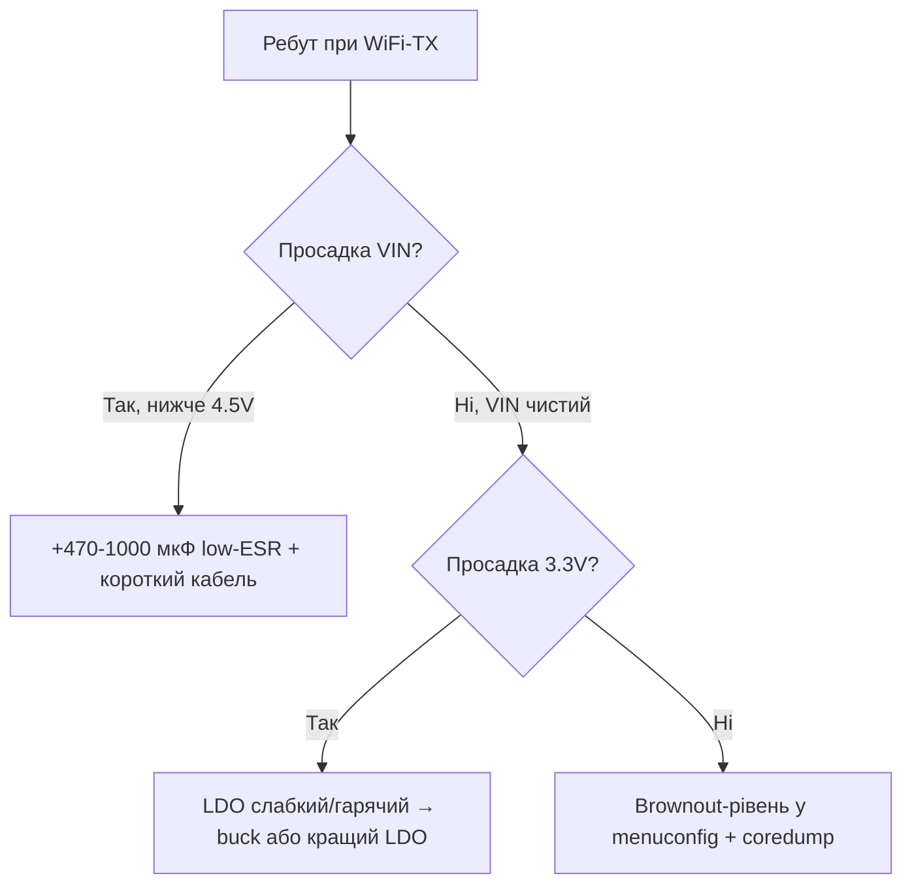

# Ланцюги живлення ESP32


> [!warning] Тільки 3.3V на кристал!
> Пін 3V3 - це **3.3V**. Категорично НЕ подавати 5V на пін 3V3. VIN/5V пін - вхід 5V, USB - 5V, а кристал і GPIO - строго **3.3V**.

## Призначення

Ланцюги живлення ESP32 - Схема-таблиця живлення; Струми і конденсатори; Таблиця з'єднань ESP32|Модуль. Пін 3V3 - це 3.3V. Категорично НЕ подавати 5V на пін 3V3. VIN/5V пін - вхід 5V, USB - 5V, а кристал і GPIO - строго 3.3V. 100 nF + 10 uF біля модуля + 470 uF на шині 3.3V. Без них - boot-loop при старті WiFi. Заміна LDO: 02-LDO-DC-DC.

## Схема-таблиця живлення

| Вхід | Шлях | Вихід | Примітка |
| --- | --- | --- | --- |
| USB 5V | USB -> LDO -> | **3.3V** кристал | Стандарт DevKit |
| VIN 5V | VIN -> LDO -> | **3.3V** кристал | 5-12V залежно від LDO |
| 3V3 пін | Безпосередньо | **3.3V** кристал | Тільки регульовані 3.3V! |
| LiPo 3.7V | Buck/LDO -> | **3.3V** кристал | Див. [04-Akumulyatori-TP4056](../../../ESP32-Reference/02-Zhivlennya/04-Akumulyatori-TP4056.md) |

> [!danger] 3V3 пін НЕ вхід 5V
> Поширена смерть плат: подали 5V на пін 3V3 - кристал згорів миттєво. Перевіряй мультиметром перед вмиканням. Strapping: [02-Strapping-pini](../../../ESP32-Reference/03-GPIO/02-Strapping-pini.md).

## Струми і конденсатори

| Режим | Струм | Конденсатор |
| --- | --- | --- |
| WiFi TX пік | до 500 мА | 470 uF електроліт на вході 3.3V |
| Середній WiFi | 160-260 мА | 10 uF кераміка біля модуля |
| RF-розв'язка | імпульси | 100 nF прямо на пінах 3V3-GND |
| Deep-sleep | 10-150 мкА | LDO з малим Iq, див. [03-Spozhivannya](../../../ESP32-Reference/02-Zhivlennya/03-Spozhivannya.md) |

> [!tip] Три конденсатори - обов'язково
> 100 nF + 10 uF біля модуля + 470 uF на шині **3.3V**. Без них - boot-loop при старті WiFi. Заміна LDO: [02-LDO-DC-DC](../../../ESP32-Reference/02-Zhivlennya/02-LDO-DC-DC.md).

## Таблиця з'єднань ESP32|Модуль

| ESP32 | Модуль | Опис |
| --- | --- | --- |
| 5V (VIN) | Модуль живлення 5V | Вхід 5V з USB/адаптера |
| 3V3 | Модуль сенсорів | Вихід **3.3V** до 500 мА |
| GND | Модуль земля | Спільна земля, товстий провід |
| EN | Модуль RC-ланцюг | 10 кОм до 3.3V + 1 uF |
| GPIO34 | Модуль контроль батареї | Дільник для вимірювання, 0-3.3V |

## Методика вимірювання просадок (осцилограф на VIN при WiFi-TX)

Просадка - причина №1 «загадкових» ребутів ESP32. Мультиметр її не бачить (імпульс 100-300 мкс), тільки осцилограф.

### Підключення щупів

```text
Осцилограф, 2 канали, розгортка 100 мкс/под, single-trigger по спаду:

Канал 1 (жовтий): щуп ×10 прямо на піни 3V3–GND МОДУЛЯ (не на БЖ!)
  Земля щупа — найкоротшим пружинним контактом на GND модуля.
  Довгий «крокодил» 15 см = +50 нГн = брехливі дзвони 200 мВ!

Канал 2 (синій, опц.): GPIO-пін-маркер, який смикаєш перед WiFi-TX:
  digitalWrite(MARK, HIGH); WiFi.begin(); digitalWrite(MARK, LOW);
  Тригер по фронту MARK → бачиш просадку синхронно з TX.
```

### Процедура тесту

| Крок | Дія | Що має бути |
| --- | --- | --- |
| 1 | Живлення штатне, код: підключення WiFi + `client.publish` в циклі | - |
| 2 | Тригер single, поріг 3.0V, спад | Осцилограф ловить момент TX |
| 3 | Запусти TX, подивись мінімум кривої 3.3V | Провал не нижче 3.0V |
| 4 | Повтори з увімкненими дисплеєм/мотором (макс. навантаження) | Провал не нижче 3.0V |
| 5 | Прогрій 10 хв, повтори | Дрейф LDO не повинен погіршити |

| Картинка просадки | Діагноз | Лікування |
| --- | --- | --- |
| Провал 3.3→2.7V на 200 мкс при кожному TX | Малі/далекі конденсатори, тонкі дроти | 470uF ближче, дроти товстіші, див. розрахунок нижче |
| Пилка 100-200 мВ 1 МГц постійно | Buck-фон без LC-фільтра | LC-фільтр за [02-LDO-DC-DC](../../../ESP32-Reference/02-Zhivlennya/02-LDO-DC-DC.md) |
| Повільний спад до 2.5V і ребут | Слабкий БЖ / довгий USB 2 м | БЖ 5В 2А, кабель ≤50 см |
| `rst:0x10 (RTCWDT)` + провал | Brownout-детектор спрацював | Лікуй живлення, потім дебаж за [03-Spozhivannya](../../../ESP32-Reference/02-Zhivlennya/03-Spozhivannya.md) |

```cpp
// Тестовий скетч-просадкомір (ганяє TX в циклі для осцилографа)
#include <WiFi.h>
#define MARK 25
void setup() {
  pinMode(MARK, OUTPUT);
  Serial.begin(115200);
  WiFi.mode(WIFI_STA);
  WiFi.begin("SSID", "PASS");
  while (WiFi.status() != WL_CONNECTED) delay(200);
}
void loop() {
  digitalWrite(MARK, HIGH);          // маркер для тригера
  WiFiClient c; c.connect("192.168.1.1", 80); c.print("GET /big HTTP/1.0\r\n\r\n");
  delay(50);                          // TX-імпульс тут
  digitalWrite(MARK, LOW);
  delay(500);
}
```

## Вибір ємностей РОЗРАХУНКОМ (I×dt/dV)

Формула, яку можна порахувати на коліні:

```text
C = I × dt / dV

I  = імпульсний струм (WiFi TX пік 0.5 А для Classic/S3)
dt = тривалість імпульсу (типово 100–300 мкс, бери 250 мкс)
dV = допустимий провал (3.3V − 3.0V = 0.3V, нижче — brownout!)

Приклад Classic:
C = 0.5 А × 250 мкс / 0.3 В = 417 мкФ → став 470 мкФ електроліт.

Перевірка трьох рівнів:
- 100 nF кераміка (X7R, ≤5 мм від пінів): давить ВЧ-дзвін 10–100 МГц.
- 10 uF кераміка (≤10 мм): давить середні 100 кГц–1 МГц.
- 470 uF електроліт/low-ESR (на вході шини 3.3V): тримає сам імпульс TX.
```

| Чип | I пік | dt | dV | C мін | Став |
| --- | --- | --- | --- | --- | --- |
| Classic / S3 | 0.5 А | 250 мкс | 0.3V | 417 мкФ | 470 мкФ |
| S2 | 0.4 А | 250 мкс | 0.3V | 333 мкФ | 470 мкФ (запас) |
| C3 / C6 | 0.35 А | 200 мкс | 0.3V | 233 мкФ | 220-330 мкФ |
| H2 / C2 | 0.25 А | 200 мкс | 0.3V | 167 мкФ | 220 мкФ |
| P4 + камера | 0.8 А | 300 мкс | 0.3V | 800 мкФ | 1000 мкФ |

> [!warning] ESR має значення
> Звичайний електроліт 470 мкФ з ESR 1 Ом на імпульсі 0.5 А сам дасть падіння 0.5V - гірше ніж без нього! Бери low-ESR (≤0.2 Ом) або полімерний, або 2×220 мкФ паралельно. Перевірка: після пайки повтори осцилограмму - провал має зникнути.

## Вузол захисту PTC + TVS (ASCII)

```text
Вхід 5V (USB/VIN)
  │
  ├──[PTC 500мА]──┬──[TVS SMBJ5.0A]── GND   ← TVS якомога ближче до входу!
  │               │    (пробій 6.4V, clamp ~9V при 600W/1мс)
  │               │
  │              [100nF]── GND  (ВЧ-шунт перешкод)
  │               │
  │               └──► до LDO/buck IN+ ──► 3V3 ──► ESP32
  │
[GND суцільна, зірка: силова земля ≠ земля ADC!]

Номінали:
- PTC: тримаючий струм 500 мА (середній вузол) / 1.1 А (P4+камера),
       спрацьовування ~1 А / 2.2 А. Відновлення — після охолодження.
- TVS: SMBJ5.0A для 5V-шини; для VIN до 12V — SMBJ12A (Vrwm 12V!).
       НЕ ставити Zener замість TVS: Zener повільний, згорить разом з ESP.
- Діод Шотткі (опц., послідовно): SS14 проти переплюсовки, падіння 0.3V врахуй!
```

| Помилка | Наслідок | Правильно |
| --- | --- | --- |
| TVS на 3.3V-шину з Vrwm 3.3V | TVS підтікає в нормі, гріється | На 3.3V-шину - TVS з Vrwm 3.3V типу ESD5Z3V3, а силовий - на вхід! |
| PTC після великих конденсаторів | PTC не бачить кидок заряду | PTC - першим від входу, потім TVS, потім C |
| Без PTC взагалі | КЗ на платі = пожежа USB-кабелю | PTC 0.1-0.3$ рятує стіл |

Контроль струму шини: [06-INA219-HX711-BH1750](../../../ESP32-Reference/10-Sensori/06-INA219-HX711-BH1750.md), вибір стабілізатора: [02-LDO-DC-DC](../../../ESP32-Reference/02-Zhivlennya/02-LDO-DC-DC.md), батареї: [04-Akumulyatori-TP4056](../../../ESP32-Reference/02-Zhivlennya/04-Akumulyatori-TP4056.md).

### Mermaid: діагностика просадки



## Типові помилки

| # | Помилка | Чому погано | Як правильно |
| --- | --- | --- | --- |
| 1 | Тонкий довгий USB-кабель | Просадка 0.5V+ на піках | Короткий товстий, 1000 мкФ на VIN |
| 2 | Кераміка далеко від модуля | Не давить ВЧ-піки | 100нФ впритул + 10мкФ поруч |
| 3 | Без TVS на вході | Кидок адаптера вбиває LDO | SMBJ5.0A + PTC |
| 4 | Спільна тонка GND | Дзвін і просадки | Зірка, товсті полігони |

## Офіційні джерела

- [ESP32 Hardware Design Guidelines - Power](https://docs.espressif.com/projects/esp-hardware-design-guidelines/en/latest/esp32/index.html) - розв'язка, конденсатори.
- [ESP32 Datasheet - Power Management](https://www.espressif.com/sites/default/files/documentation/esp32_datasheet_en.pdf) - домени, brownout.

## Див. також

- [Home](../../../ESP32-Reference/Home.md)
- [03-Porivnyannya-chipiv](../../../ESP32-Reference/00-Start/03-Porivnyannya-chipiv.md)
- [01-GPIO-oglyad](../../../ESP32-Reference/03-GPIO/01-GPIO-oglyad.md)
- [02-Strapping-pini](../../../ESP32-Reference/03-GPIO/02-Strapping-pini.md)
- [01-Lancjugi-zhivlennya](../../../ESP32-Reference/02-Zhivlennya/01-Lancjugi-zhivlennya.md)
- [02-LDO-DC-DC](../../../ESP32-Reference/02-Zhivlennya/02-LDO-DC-DC.md)
- [03-Spozhivannya](../../../ESP32-Reference/02-Zhivlennya/03-Spozhivannya.md)
- [01-ESP32-Classic](../../../ESP32-Reference/01-Hardware/01-ESP32-Classic.md)
