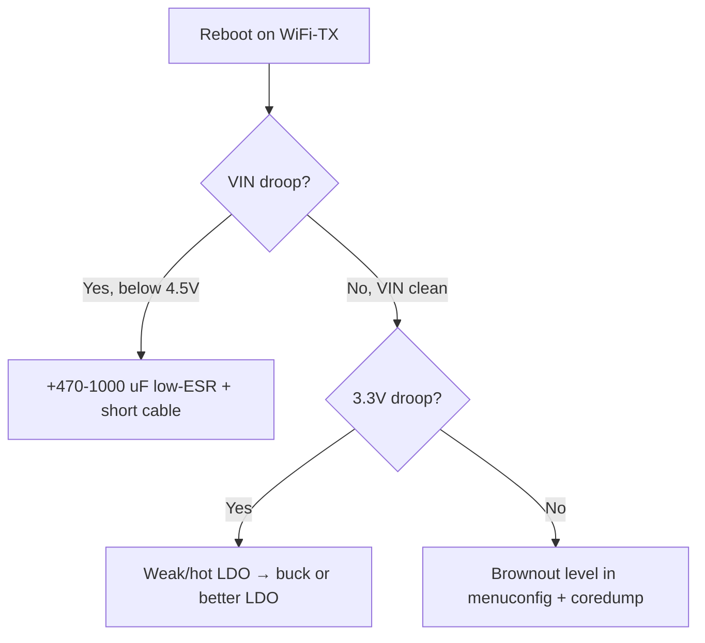

# ESP32 Power Rails


> [!warning] Only 3.3V to the chip!
> The 3V3 pin is **3.3V**. NEVER feed 5V into the 3V3 pin. The VIN/5V pin is a 5V input, USB is 5V, but the chip and GPIO are strictly **3.3V**.

## Purpose

ESP32 power rails - power schematic-table; currents and capacitors; ESP32-to-module wiring table. The 3V3 pin is 3.3V. NEVER feed 5V into the 3V3 pin. The VIN/5V pin is a 5V input, USB is 5V, but the chip and GPIO are strictly 3.3V. 100 nF + 10 uF next to the module + 470 uF on the 3.3V rail. Without them - boot-loop at WiFi start. LDO replacement: 02-LDO-DC-DC.

## Power schematic-table

| Input | Path | Output | Note |
| --- | --- | --- | --- |
| USB 5V | USB -> LDO -> | **3.3V** chip | Standard DevKit |
| VIN 5V | VIN -> LDO -> | **3.3V** chip | 5-12V depending on LDO |
| 3V3 pin | Direct | **3.3V** chip | Only regulated 3.3V! |
| LiPo 3.7V | Buck/LDO -> | **3.3V** chip | See [04-Batteries-TP4056.en] |

> [!danger] The 3V3 pin is NOT a 5V input
> A common way boards die: 5V fed into the 3V3 pin - the chip burns instantly. Check with a multimeter before powering on. Strapping: [02-Strapping-pini](../../../ESP32-Reference/03-GPIO/02-Strapping-pini.md).

## Currents and capacitors

| Mode | Current | Capacitor |
| --- | --- | --- |
| WiFi TX peak | up to 500 mA | 470 uF electrolytic at the 3.3V input |
| Average WiFi | 160-260 mA | 10 uF ceramic next to the module |
| RF decoupling | pulses | 100 nF right at the 3V3-GND pins |
| Deep-sleep | 10-150 uA | LDO with low Iq, see [03-Power-Consumption.en] |

> [!tip] Three capacitors are mandatory
> 100 nF + 10 uF next to the module + 470 uF on the **3.3V** rail. Without them - boot-loop at WiFi start. LDO replacement: [02-LDO-DC-DC](../../../ESP32-Reference/02-Zhivlennya/02-LDO-DC-DC.md).

## ESP32 to module wiring table

| ESP32 | Module | Description |
| --- | --- | --- |
| 5V (VIN) | 5V power module | 5V input from USB/adapter |
| 3V3 | Sensor module | **3.3V** output up to 500 mA |
| GND | Module ground | Common ground, thick wire |
| EN | Module RC circuit | 10 kOhm to 3.3V + 1 uF |
| GPIO34 | Module battery monitor | Divider for measurement, 0-3.3V |

## Droop measurement method (oscilloscope on VIN during WiFi-TX)

Droop is cause #1 of "mysterious" ESP32 reboots. A multimeter cannot see it (a 100-300 us pulse), only an oscilloscope can.

### Probe connection

```text
Осцилограф, 2 канали, розгортка 100 мкс/под, single-trigger по спаду:

Канал 1 (жовтий): щуп ×10 прямо на піни 3V3–GND МОДУЛЯ (не на БЖ!)
  Земля щупа — найкоротшим пружинним контактом на GND модуля.
  Довгий «крокодил» 15 см = +50 нГн = брехливі дзвони 200 мВ!

Канал 2 (синій, опц.): GPIO-пін-маркер, який смикаєш перед WiFi-TX:
  digitalWrite(MARK, HIGH); WiFi.begin(); digitalWrite(MARK, LOW);
  Тригер по фронту MARK → бачиш просадку синхронно з TX.
```

### Test procedure

| Step | Action | Expected |
| --- | --- | --- |
| 1 | Normal power, code: WiFi connect + `client.publish` in a loop | - |
| 2 | Single trigger, 3.0V threshold, falling edge | Oscilloscope catches the TX moment |
| 3 | Start TX, look at the minimum of the 3.3V curve | Dip no lower than 3.0V |
| 4 | Repeat with display/motor on (max load) | Dip no lower than 3.0V |
| 5 | Warm up 10 min, repeat | LDO drift must not make it worse |

| Droop picture | Diagnosis | Fix |
| --- | --- | --- |
| Dip 3.3 to 2.7V for 200 us on every TX | Small/distant capacitors, thin wires | 470uF closer, thicker wires, see calculation below |
| 100-200 mV 1 MHz sawtooth all the time | Buck noise without LC filter | LC filter per [02-LDO-DC-DC](../../../ESP32-Reference/02-Zhivlennya/02-LDO-DC-DC.md) |
| Slow sag to 2.5V and reboot | Weak PSU / long 2 m USB cable | 5V 2A PSU, cable 50 cm or shorter |
| `rst:0x10 (RTCWDT)` + dip | Brownout detector fired | Fix power first, then debug per [03-Power-Consumption.en] |

```cpp
// Тестовий скетч-просадкомір (ганяє TX в циклі для осцилографа)
#include <WiFi.h>
#define MARK 25
void setup() {
  pinMode(MARK, OUTPUT);
  Serial.begin(115200);
  WiFi.mode(WIFI_STA);
  WiFi.begin("SSID", "PASS");
  while (WiFi.status() != WL_CONNECTED) delay(200);
}
void loop() {
  digitalWrite(MARK, HIGH);          // маркер для тригера
  WiFiClient c; c.connect("192.168.1.1", 80); c.print("GET /big HTTP/1.0\r\n\r\n");
  delay(50);                          // TX-імпульс тут
  digitalWrite(MARK, LOW);
  delay(500);
}
```

## Capacitor choice BY CALCULATION (I×dt/dV)

A formula you can compute on the back of an envelope:

```text
C = I × dt / dV

I  = імпульсний струм (WiFi TX пік 0.5 А для Classic/S3)
dt = тривалість імпульсу (типово 100–300 мкс, бери 250 мкс)
dV = допустимий провал (3.3V − 3.0V = 0.3V, нижче — brownout!)

Приклад Classic:
C = 0.5 А × 250 мкс / 0.3 В = 417 мкФ → став 470 мкФ електроліт.

Перевірка трьох рівнів:
- 100 nF кераміка (X7R, ≤5 мм від пінів): давить ВЧ-дзвін 10–100 МГц.
- 10 uF кераміка (≤10 мм): давить середні 100 кГц–1 МГц.
- 470 uF електроліт/low-ESR (на вході шини 3.3V): тримає сам імпульс TX.
```

| Chip | I peak | dt | dV | C min | Use |
| --- | --- | --- | --- | --- | --- |
| Classic / S3 | 0.5 A | 250 us | 0.3V | 417 uF | 470 uF |
| S2 | 0.4 A | 250 us | 0.3V | 333 uF | 470 uF (margin) |
| C3 / C6 | 0.35 A | 200 us | 0.3V | 233 uF | 220-330 uF |
| H2 / C2 | 0.25 A | 200 us | 0.3V | 167 uF | 220 uF |
| P4 + camera | 0.8 A | 300 us | 0.3V | 800 uF | 1000 uF |

> [!warning] ESR matters
> A plain 470 uF electrolytic with 1 Ohm ESR drops 0.5V by itself on a 0.5 A pulse - worse than no capacitor at all! Take low-ESR (0.2 Ohm or less), or polymer, or 2x220 uF in parallel. Check: after soldering repeat the oscilloscope capture - the dip must be gone.

## PTC + TVS protection node (ASCII)

```text
Вхід 5V (USB/VIN)
  │
  ├──[PTC 500мА]──┬──[TVS SMBJ5.0A]── GND   ← TVS якомога ближче до входу!
  │               │    (пробій 6.4V, clamp ~9V при 600W/1мс)
  │               │
  │              [100nF]── GND  (ВЧ-шунт перешкод)
  │               │
  │               └──► до LDO/buck IN+ ──► 3V3 ──► ESP32
  │
[GND суцільна, зірка: силова земля ≠ земля ADC!]

Номінали:
- PTC: тримаючий струм 500 мА (середній вузол) / 1.1 А (P4+камера),
       спрацьовування ~1 А / 2.2 А. Відновлення — після охолодження.
- TVS: SMBJ5.0A для 5V-шини; для VIN до 12V — SMBJ12A (Vrwm 12V!).
       НЕ ставити Zener замість TVS: Zener повільний, згорить разом з ESP.
- Діод Шотткі (опц., послідовно): SS14 проти переплюсовки, падіння 0.3V врахуй!
```

| Mistake | Result | Correct |
| --- | --- | --- |
| TVS on the 3.3V rail with Vrwm 3.3V | TVS leaks normally, heats up | On the 3.3V rail - a Vrwm 3.3V TVS like ESD5Z3V3, and the power one - at the input! |
| PTC after the big capacitors | PTC does not see the charge surge | PTC - first from the input, then TVS, then C |
| No PTC at all | A short on the board = USB cable fire | A 0.1-0.3$ PTC saves your desk |

Bus current monitoring: [06-INA219-HX711-BH1750](../../../ESP32-Reference/10-Sensori/06-INA219-HX711-BH1750.md), regulator choice: [02-LDO-DC-DC](../../../ESP32-Reference/02-Zhivlennya/02-LDO-DC-DC.md), batteries: [04-Batteries-TP4056.en].

### Mermaid: droop diagnostics



## Common issues

| # | Mistake | Why it is bad | Correct |
| --- | --- | --- | --- |
| 1 | Thin long USB cable | 0.5V+ droop on peaks | Short thick cable, 1000 uF on VIN |
| 2 | Ceramic far from the module | Does not suppress HF peaks | 100nF tight + 10uF nearby |
| 3 | No TVS at the input | Adapter surge kills the LDO | SMBJ5.0A + PTC |
| 4 | Shared thin GND | Ringing and droops | Star, thick polygons |

## Official sources

- [ESP32 Hardware Design Guidelines - Power](https://docs.espressif.com/projects/esp-hardware-design-guidelines/en/latest/esp32/index.html) - decoupling, capacitors.
- [ESP32 Datasheet - Power Management](https://www.espressif.com/sites/default/files/documentation/esp32_datasheet_en.pdf) - domains, brownout.

## See also

- [Home](../../../ESP32-Reference/Home.md)
- [00-Start/03-Chip-Comparison.en]
- [01-GPIO-oglyad](../../../ESP32-Reference/03-GPIO/01-GPIO-oglyad.md)
- [02-Strapping-pini](../../../ESP32-Reference/03-GPIO/02-Strapping-pini.md)
- [02-Zhivlennya/01-Power-Rails.en]
- [02-LDO-DC-DC](../../../ESP32-Reference/02-Zhivlennya/02-LDO-DC-DC.md)
- [03-Power-Consumption.en]
- [01-ESP32-Classic](../../../ESP32-Reference/01-Hardware/01-ESP32-Classic.md)
