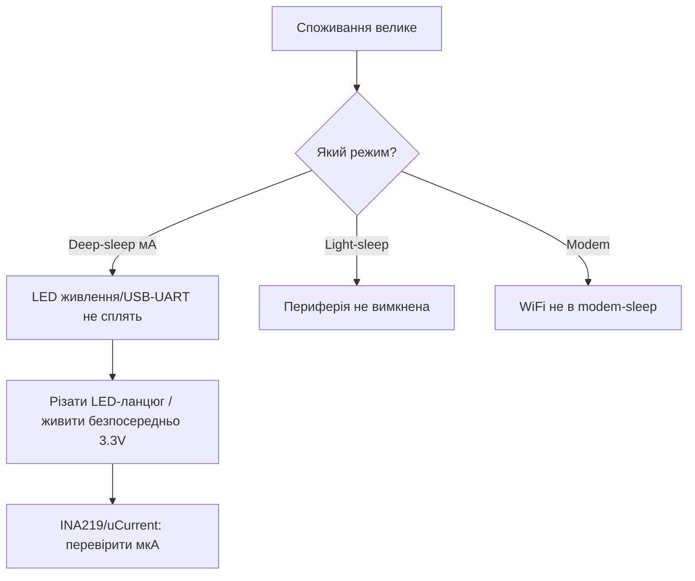

# Споживання ESP32


> [!warning] Вимірюй на шині 3.3V!
> Усі цифри нижче - струм шини **3.3V**. Не плутай зі струмом 5V USB (там менше через ККД LDO). GPIO в sleep підтягни до 3.3V/GND, щоб не текло.

## Призначення

Споживання ESP32 - Таблиця режимів; Вимірювання INA219; Таблиця з'єднань ESP32|Модуль. Усі цифри нижче - струм шини 3.3V. Не плутай зі струмом 5V USB (там менше через ККД LDO). GPIO в sleep підтягни до 3.3V/GND, щоб не текло. AMS1117 зїдає 5 мА навіть у deep-sleep - батарея сяде за тижні. Для батарей бери ME6211 або buck з малим Iq. Живлення: [01-Lancjugi-zhivlennya](../../../ESP32-Reference/02-Zhivlennya/01-Lancjugi-zhivlennya.md), 02-LDO-DC-DC, батареї: 04-Akumulyatori-TP4056.

## Таблиця режимів

| Режим | Струм (3.3V) | WiFi | Пробудження |
| --- | --- | --- | --- |
| Active RX/TX | 160-260 мА, пік 500 мА | увімкнено | - |
| Modem-sleep | 20-40 мА | DTIM паузи | WiFi |
| Light-sleep | 0.8 мА | вимкнено | GPIO/таймер |
| Deep-sleep | 10-150 мкА | вимкнено | RTC/ULP |
| Hibernation | 2.5 мкА | вимкнено | тільки RTC |

> [!info] ADC2 і modem-sleep
> У modem-sleep ADC2 звільняється - можна міряти. В active з WiFi - тільки ADC1. Див. [01-GPIO-oglyad](../../../ESP32-Reference/03-GPIO/01-GPIO-oglyad.md), [01-ESP32-Classic](../../../ESP32-Reference/01-Hardware/01-ESP32-Classic.md).

## Вимірювання INA219

| Крок | Дія |
| --- | --- |
| 1 | INA219 у розрив шини **3.3V** (не 5V) |
| 2 | Шунт 0.1 Ом, діапазон 400 мА / 3.2A |
| 3 | Логуй піки TX 500 мА осцилографом |
| 4 | Для deep-sleep перемкни на мкА-діапазон |

> [!tip] Пастка LDO
> AMS1117 зїдає 5 мА навіть у deep-sleep - батарея сяде за тижні. Для батарей бери ME6211 або buck з малим Iq. Живлення: [01-Lancjugi-zhivlennya](../../../ESP32-Reference/02-Zhivlennya/01-Lancjugi-zhivlennya.md), [02-LDO-DC-DC](../../../ESP32-Reference/02-Zhivlennya/02-LDO-DC-DC.md), батареї: [04-Akumulyatori-TP4056](../../../ESP32-Reference/02-Zhivlennya/04-Akumulyatori-TP4056.md).

## Таблиця з'єднань ESP32|Модуль

| ESP32 | Модуль | Опис |
| --- | --- | --- |
| 3V3 | Модуль INA219 VCC | Живлення датчика **3.3V** |
| GND | Модуль INA219 GND | Спільна земля |
| GPIO21 | Модуль INA219 SDA | I2C 3.3V |
| GPIO22 | Модуль INA219 SCL | I2C 3.3V |
| 3V3 (розрив) | Модуль навантаження | Шина вимірювання 3.3V |

## Таблиця струмів усіх режимів по чипах (шина 3.3V)

Заміряно на DevKit при 25°C, WiFi 20 дБм. Твої плати відрізнятимуться на ±20% через LDO і периферію.

| Режим | Classic | S2 | S3 | C3 | C6 | H2 | C2 | Умови |
| --- | --- | --- | --- | --- | --- | --- | --- | --- |
| Active CPU 240/160 МГц, WiFi RX | 100-160 мА | 90-140 мА | 110-170 мА | 80-120 мА | 90-130 мА | - (немає WiFi) | 70-100 мА | Сканування/прийом |
| WiFi TX середній | 160-260 мА | 150-240 мА | 180-300 мА | 150-250 мА | 160-260 мА | - | 140-220 мА | Передача, 20 дБм |
| WiFi TX пік (імпульс 250 мкс) | до 500 мА | до 400 мА | до 500 мА | до 350 мА | до 350 мА | - | до 300 мА | Конденсатори обовʼязкові! |
| BLE TX/скан | 100-150 мА | - | 100-150 мА | 80-130 мА | 90-140 мА | 60-100 мА | 70-110 мА | Реклама 100 мс |
| 802.15.4 TX (C6/H2) | - | - | - | - | 80-120 мА | 60-100 мА | - | Zigbee/Thread |
| CPU без радіо | 30-60 мА | 25-50 мА | 30-70 мА | 20-40 мА | 25-45 мА | 15-30 мА | 15-30 мА | WiFi/BLE вимкнено |
| Modem-sleep (DTIM) | 20-40 мА | 15-30 мА | 20-40 мА | 15-30 мА | 15-30 мА | - | 10-25 мА | WiFi асоційовано, паузи |
| Light-sleep | 0.8-2 мА | 0.5-1.5 мА | 0.8-2 мА | 0.5-1.5 мА | 0.5-1.5 мА | 0.3-1 мА | 0.5-1 мА | CPU стоп, RTC/ULP живі |
| Deep-sleep + RTC-памʼять | 10-150 мкА | 10-100 мкА | 10-150 мкА | 5-50 мкА | 5-50 мкА | 3-30 мкА | 10-80 мкА | ULP/RTC-таймер |
| Hibernation (тільки RTC) | 2.5 мкА | 2 мкА | 2.5 мкА | 2 мкА | 2 мкА | 1.5 мкА | 2 мкА | Мінімум чипа |
| Реальний вузол на батареї* | 150 мкА-5 мА | - | - | 50 мкА-2 мА | - | 20 мкА-1 мА | - | `*` З LDO, дільником, LED! |

> [!danger] Рядок з зірочкою - найважливіший!
> Голий чип їсть 10 мкА, а плата - 5 мА: AMS1117 зʼїдає 5 мА, дільник батареї 100к/100к - 16 мкА, power-LED - 2-3 мА, USB-UART міст - 5-15 мА. Батарейний вузол починається з ВИПАЮВАННЯ LED і моста, а не з оптимізації коду. Сон і ULP: [03-Sleep-ULP](../../../ESP32-Reference/07-Timeri-Son/03-Sleep-ULP.md).

Розрахунок життя від батареї:

```text
Приклад: 18650 2600 мАг, вузол: deep-sleep 150 мкА + прокидання 200 мА × 5 с щогодини.
Середній струм = 0.15 мА + (200 мА × 5 с / 3600 с) = 0.15 + 0.28 = 0.43 мА.
Час = 2600 / 0.43 ≈ 6000 год ≈ 250 днів (ідеально; реально −30% на саморозряд і холод).
Без deep-sleep (modem 30 мА): 2600/30 ≈ 87 год ≈ 3.5 дні. Різниця ×70!
```

## Методика вимірювання deep-sleep (uCurrent / INA226, розрив перемичкою)

Проблема: один прилад не міряє і 500 мА, і 10 мкА. Потрібні два діапазони.

### Варіант A: розрив перемичкою + два прилади

```text
Шина 3V3 ──[джампер J1]──► ESP32 VCC
              │  │
              │  └── мультиметр в режимі мкА (для сну, джампер ЗНЯТО, струм через прилад)
              └── перемичка (для роботи, джампер ВСТАВЛЕНО, прилад відключено)

Процедура:
1. Джампер ВСТАВЛЕНО → проший код deep-sleep (esp_deep_sleep_start через 5 с після boot).
2. Мультиметр на мкА-діапазон (2000 мкА) підключи паралельно джамперу.
3. Зніми джампер → струм пішов через мультиметр. Зачекай 10 с (плата має заснути!).
4. Зчитай: 10–150 мкА = норма; міліампери = не спить (див. таблицю витоків нижче).
5. Для виміру TX-імпульсу: поверни джампер, INA219/осцилограф на шунті (див. [[02-Zhivlennya/01-Lancjugi-zhivlennya]]).
```

### Варіант B: uCurrent Gold / INA226-логер

| Прилад | Діапазон | Точність внизу | Як |
| --- | --- | --- | --- |
| uCurrent Gold | нА-1 А (перемикач) | 10 нА | У розрив 3.3V, вихід-напруга на мультиметр/осцилограф |
| INA226 (16 біт) | шунт на вибір | ~10 мкА з шунтом 0.1 Ом | I2C-логер другим ESP: пише графік струму в часі |
| INA219 (12 біт) | ~100 мкА крок | Грубо для сну | Тільки для активних режимів, не для deep-sleep! |
| Мультиметр UT61E+ | 60 мкА-10 А | 10 мкА на межі | Дешево, але burden voltage садить шину - врахуй |

```cpp
// Код-вимірювач: 5 с на підключення приладу, потім сон на 1 хв
#include <Arduino.h>
#include "esp_sleep.h"
void setup() {
  Serial.begin(115200);
  Serial.println("5 s to remove jumper...");
  delay(5000);
  // Вимкни все зайве перед сном!
  WiFi.disconnect(true); btStop();
  gpio_hold_dis((gpio_num_t)25); // приклад звільнення hold
  esp_sleep_enable_timer_wakeup(60 * 1000000ULL);
  esp_deep_sleep_start();
}
void loop() {}
```

### Таблиця витоків «чому не 10 мкА»

| Виміряно в сні | Винний | Лікування |
| --- | --- | --- |
| 5-15 мА | USB-UART міст живий | Ріж доріжку живлення моста / окрема плата без моста |
| 2-5 мА | AMS1117 Iq + power LED | ME6211 + випаяй LED |
| 0.5-2 мА | GPIO в повітрі (floating) + pull | Усі невикористані GPIO → `pinMode(x, INPUT_PULLUP)` або HOLD |
| 100-300 мкА | Дільник батареї 100к/100к постійно підключений | Дільник через MOSFET-ключ, вмикай тільки на вимір |
| 50-150 мкА | ADC/датчик не спить (BME280 в normal, а не sleep) | Переводь периферію в sleep перед `deep_sleep_start` |
| 10-50 мкА | Норма для C3/H2 з RTC-памʼяттю | Так і лишай |

## Brownout-дебаг через coredump / gdbstub

Brownout - спрацювання детектора просадки (типово 2.7-3.0V): чип ресетиться з логом `Brownout detector was triggered`.

| Крок | Дія | Команда / код |
| --- | --- | --- |
| 1 | Підтверди brownout в логах | Шукай `Brownout detector was triggered` + `rst:0xc (SW_CPU_RESET)` |
| 2 | Увімкни coredump у flash | `menuconfig → Core dump → Flash, 64K`, партиція `coredump`! [01-Partitions-NVS](../../../ESP32-Reference/08-Pamyat/01-Partitions-NVS.md) |
| 3 | Зчитай coredump після ребуту | `espcoredump.py info_corefile -t elf -c /dev/ttyUSB0 build/app.elf` |
| 4 | Або gdbstub по UART | `menuconfig → Panic handler → GDBStub`, після крашу `xtensa-esp32-elf-gdb -ex "target remote /dev/ttyUSB0"` |
| 5 | Подивись PC (лічильник команд) | Якщо PC у `wifi_tx`/`spi_flash_write` = просадка під навантаженням, не баг коду! |
| 6 | Паралельно - осцилограмма 3.3V | Див. [01-Lancjugi-zhivlennya](../../../ESP32-Reference/02-Zhivlennya/01-Lancjugi-zhivlennya.md): провал синхронно з крашем = живлення |

```c
// Лови brownout програмно (раннє попередження до ребуту)
#include "soc/rtc_cntl_reg.h"
#include "driver/rtc_io.h"
void brownout_hook(void) {
    // ESP-IDF: Component config → Brownout detector → Enabled + callback
    ESP_LOGW("pwr", "BROWNOUT! Vcc просів, див. осцилограмму 3.3V");
    // Збережи стан у RTC-памʼять ДО ресету:
    // RTC_DATA_ATTR int brownout_cnt = 0; brownout_cnt++;
}
// Після ребуту прочитай brownout_cnt з RTC-памʼяті — лічильник просадок.
```

> [!tip] Відрізни brownout від софтверного WDT
> `rst:0xc + Brownout` = живлення. `rst:0x7 (TG0WDT)` без Brownout = завис код (цикл без yield, заблокований I2C). Не лікуй WDT конденсаторами, не лікуй brownout таймаутами. FAQ ребутів: [02-Troubleshooting-FAQ](../../../ESP32-Reference/99-Dodatki/02-Troubleshooting-FAQ.md), живлення: [01-Lancjugi-zhivlennya](../../../ESP32-Reference/02-Zhivlennya/01-Lancjugi-zhivlennya.md).

### Mermaid: куди тече струм



## Типові помилки

| # | Помилка | Чому погано | Як правильно |
| --- | --- | --- | --- |
| 1 | Мультиметр на мА-діапазоні при TX | Burden voltage садить плату | Піки - гніздо 10A |
| 2 | USB-UART живий у сні | +мА замість мкА | Живлення повз міст / відпаяти LED |
| 3 | WiFi не спить | 50+ мА в idle | Modem-sleep / deep-sleep |
| 4 | ADC2 + WiFi | Конфлікт драйвера | ADC1 при WiFi |

## Офіційні джерела

- [ESP32 Sleep Modes - струми](https://docs.espressif.com/projects/esp-idf/en/latest/esp32/api-reference/system/sleep_modes.html) - таблиці мкА.
- [ESP-IDF Power Management](https://docs.espressif.com/projects/esp-idf/en/latest/esp32/api-reference/system/power_management.html) - DFS, light-sleep.

## Див. також

- [Home](../../../ESP32-Reference/Home.md)
- [03-Porivnyannya-chipiv](../../../ESP32-Reference/00-Start/03-Porivnyannya-chipiv.md)
- [01-GPIO-oglyad](../../../ESP32-Reference/03-GPIO/01-GPIO-oglyad.md)
- [02-Strapping-pini](../../../ESP32-Reference/03-GPIO/02-Strapping-pini.md)
- [01-Lancjugi-zhivlennya](../../../ESP32-Reference/02-Zhivlennya/01-Lancjugi-zhivlennya.md)
- [02-LDO-DC-DC](../../../ESP32-Reference/02-Zhivlennya/02-LDO-DC-DC.md)
- [04-Akumulyatori-TP4056](../../../ESP32-Reference/02-Zhivlennya/04-Akumulyatori-TP4056.md)
