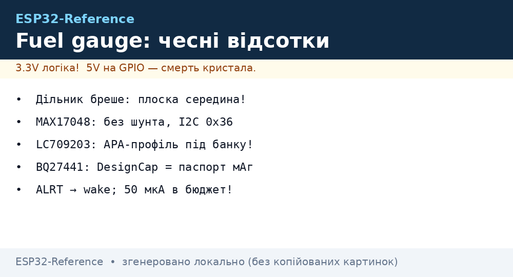
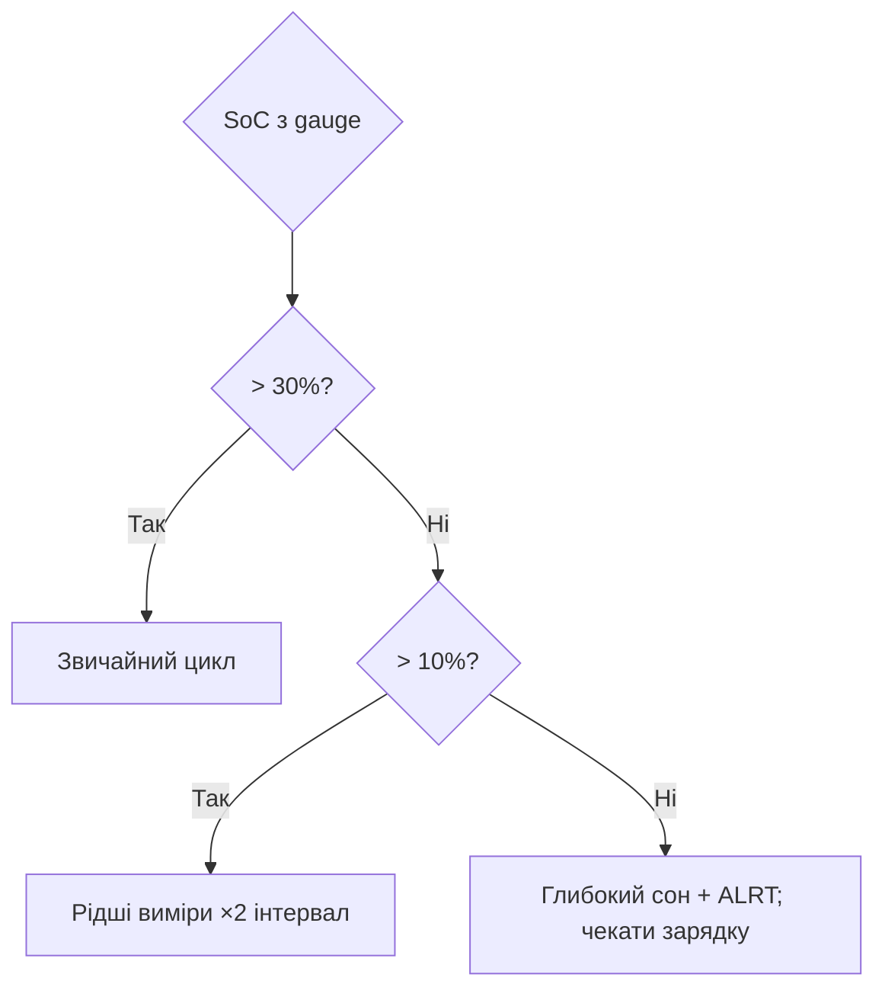

# Fuel Gauge: точний відсоток батареї (MAX17048 / LC709203 / BQ27441)

EN version: `02-Zhivlennya/05-Fuel-Gauge.en.md`

## Призначення

Дільник + АЦП бреше: напруга Li-Ion нелінійна, пласка в середині, пливе з температурою і струмом. Fuel gauge рахує СПРАВЖНІЙ State-of-Charge: ModelGauge (напруга+модель), або кулонометр (інтеграл струму). Результат - чесні відсотки для deep-sleep рішень і «залишилось 2 дні».

База: старт - [Home](../../../ESP32-Reference/Home.md), акумулятори - [04-Akumulyatori-TP4056](../../../ESP32-Reference/02-Zhivlennya/04-Akumulyatori-TP4056.md), ADC - [ADC](../../../ESP32-Reference/06-Analog/01-ADC.md), сон - [Sleep](../../../ESP32-Reference/07-Timeri-Son/03-Sleep-ULP.md).


*Рис. Батарея → gauge (I2C) → ESP32: відсотки SoC, поріг-алерт будить із сну.*

## Порівняння мікросхем

| Мікросхема | Метод | Інтерфейс | Точність | Ціна | Коли |
| --- | --- | --- | --- | --- | --- |
| MAX17048 | ModelGauge (V+модель) | I2C 0x36 | ±3-5% | $2-3 | Дефолт: без шунта, 2 дроти! |
| LC709203F | Hermit-Crab (V+T) | I2C 0x0B | ±3% | $2 | Є термокомпенсація, дешевший |
| BQ27441 | Impedance Track (кулонометр) | I2C 0x55 | ±1-2% | $4-5 | Точність важливіша за ціну |
| Дільник + АЦП | Напруга | ADC | ±10-15% | $0.1 | Індикатор «живий/сідає», не відсотки |

```text
Підключення MAX17048 (типове):
  LiPo+ ──► CELL+ (gauge між батареєю і навантаженням НЕ потрібен — тільки sense!)
  LiPo− ──► CELL− (= GND)
  SDA/SCL ──► GPIO21/22 + pull-up 4.7к; ALRT ──► GPIO (поріг розряду, wake!)
  Увага: gauge їсть сам ~50 мкА — для CR2032-проєктів рахувати в бюджеті!
```

### Mermaid: що робити з відсотками



## Код (Arduino - MAX17048)

```cpp
// Arduino: читання SoC з MAX17048 (I2C 0x36), поріг-алерт 15%
#include <Wire.h>
#define GAUGE 0x36
float readSOC() {
  Wire.beginTransmission(GAUGE); Wire.write(0x04); Wire.endTransmission(false);
  Wire.requestFrom(GAUGE, 2);
  uint16_t v = (Wire.read() << 8) | Wire.read();
  return v / 256.0;  // відсотки!
}
void setup() {
  Wire.begin(21, 22);
  Serial.printf("Battery: %.1f%%\n", readSOC());
}
```

### Калібрування (один раз на тип батареї!)

```text
1. Повний заряд (4.20V, струм < C/20) → записати empty/full точки (BQ274: DesignCap!).
2. Розряд відомим струмом до 3.0V → звірити мАг з паспортом банки.
3. LC709203: вибрати профіль батареї (параметр APA!) — чужий профіль = ±10%.
4. Перевірка: 3 цикли, похибка SoC на кінцях < 5% — інакше перекалібрувати.
```

## Типові помилки

| # | Помилка | Чому погано | Як правильно |
| --- | --- | --- | --- |
| 1 | Дільник як «відсотки» | Нелінійність + плоска середина | Gauge для відсотків |
| 2 | Чужий APA-профіль | ±10% одразу | Профіль під свою банку |
| 3 | Gauge без калібрування | Заводські ±7% | 3 цикли калібрування |
| 4 | ALRT не підключено | Проспали розряд | ALRT → wake-GPIO |
| 5 | 50 мкА gauge ігнорують | З'їдає CR2032 за рік | Рахувати в бюджеті сну |
| 6 | BQ274 без DesignCap | Кулонометр без бази | DesignCap = паспортні мАг |

## Офіційні джерела

- [MAX17048 datasheet (ADI)](https://www.analog.com/en/products/max17048.html) - ModelGauge, регістри.
- [LC709203F datasheet (onsemi)](https://www.onsemi.com/products/power-management/battery-management/lc709203f) - APA-профілі.
- [BQ27441 Technical Reference (TI)](https://www.ti.com/product/BQ27441-G1) - Impedance Track, калібрування.

## Регістри MAX17048 (що читати)

| Регістр | Адреса | Що дає |
| --- | --- | --- |
| VCELL | 0x02 | Напруга банки, 78.125 мкВ/LSB |
| SOC | 0x04 | Відсотки, 1/256 %/LSB |
| VERSION | 0x08 | Версія чипа (перевірка зв'язку!) |
| CONFIG | 0x0C | Поріг ALRT (біт 0-4: 1%/LSB нижче 32%) |
| STATUS | 0x1A | Прапор спрацювання ALRT |

```cpp
// Arduino: ALRT на 15% (прокидає ESP32!)
void setupAlert() {
  Wire.beginTransmission(0x36); Wire.write(0x0C);
  Wire.write(0x1F); Wire.write(0x1D);  // поріг 15%, ALRT увімкнено
  Wire.endTransmission();
  pinMode(34, INPUT_PULLUP);  // ALRT — open-drain, активний LOW!
}
```

### APA-профілі LC709203F (вибір!)

| Батарея | APA (hex) | Коментар |
| --- | --- | --- |
| Малінькі LiPo 300-500 мАг | 0x10-0x14 | Починати звідси для носимих |
| 18650 2600-3500 мАг | 0x28-0x30 | Звірити з даташитом банки! |
| LiPo 2000 мАг пакети | 0x20-0x24 | Плоскі пакети дронів/трекерів |

## BQ27441: ключові команди (I2C 0x55)

```text
0x00/0x01 CONTROL → підкоманди: CONTROL_STATUS, DEVICE_NUMBER, FW_VERSION.
0x02/0x03 TEMP, 0x04/0x05 VOLTAGE, 0x0A/0x0B Current (зі знаком!),
0x1C/0x1D StateOfCharge %, 0x10 FullChargeCapacity (після калібрування!).
Налаштування: DesignCapacity (паспорт!) + DesignEnergy + Terminate Voltage
(3000 мВ для довголіття або 2800 для максимуму ємності).
```

## Зв'язка gauge + deep-sleep (логіка вузла)

```text
Прокинувся → прочитати SoC → рішення:
  SoC > 30%  → повний цикл (виміри + передача)
  10–30%     → тільки виміри, передача раз на N циклів (NVS-лічильник!)
  < 10%      → ALRT уже спрацював: спати добу, чекати зарядку
  Зарядка детект (VBUS present) → повний цикл + звіт Reached-100% один раз
```

## Калібрування gauge за циклом

- Повний цикл заряд-розряд навчає модель батареї;
- Після 3 циклів точність SoC виходить на паспортну;
- Нову батарею не оцінювати перший тиждень.

## Див. також

- [Головна](../../../ESP32-Reference/Home.md)
- [Акумулятори](../../../ESP32-Reference/02-Zhivlennya/04-Akumulyatori-TP4056.md)
- [Споживання](../../../ESP32-Reference/02-Zhivlennya/03-Spozhivannya.md)
- [ADC](../../../ESP32-Reference/06-Analog/01-ADC.md)
- [Sleep](../../../ESP32-Reference/07-Timeri-Son/03-Sleep-ULP.md)
- [I2C](../../../ESP32-Reference/04-Shini/03-I2C.md)
