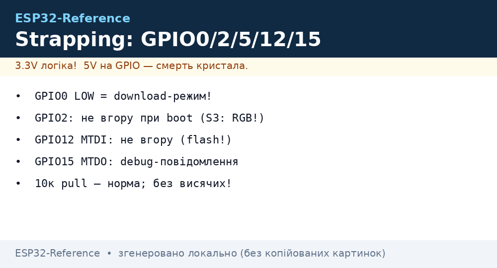
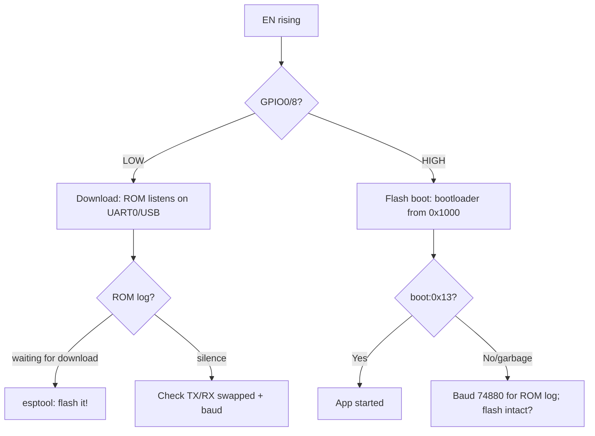

# ESP32 strapping pins


*Fig. Strapping pins: states at boot and safe combinations.*

Strapping pins are sampled by the ROM bootloader at the **EN rising edge** moment and define the boot mode. Wrong strapping = board will not start or will not flash.

> [!danger] Golden rule
> Do not connect anything to strapping pins so that it **hard-pulls the pin** at power-up. After boot - use freely.

## Purpose

ESP32 strapping pins - boot-state table (ESP32 Classic); why not to pull to ground / power; S3 / C3 specifics. Strapping pins are sampled by the ROM bootloader at the EN rising edge moment and define the boot mode. Wrong strapping = board will not start or will not flash. Do not connect anything to strapping pins so that it hard-pulls the pin at power-up. After boot - use freely.

## Boot-state table (ESP32 Classic)

| GPIO | Boot function | Level needed for normal boot | What happens on violation |
| --- | --- | --- | --- |
| GPIO0 | BOOT mode | **HIGH (pull-up 10k)** | LOW to download mode (flashing), board "hangs" |
| GPIO2 | BOOT + SDIO | **LOW or floating** (internal pull-down) | HIGH via strong pull-up to boot issues |
| GPIO5 | SDIO / Flash voltage | **HIGH** | LOW to flash init failure |
| GPIO12 | MTDI / VDD_SDIO | **LOW (floating)** | HIGH (>0.5V) to flash at 1.8V, crash |
| GPIO15 | MTDO / debug | **HIGH** | LOW to silent boot, no log / failure |

> [!warning] GPIO12 - the trickiest one
> If a sensor/peripheral pulls GPIO12 to 3.3V via 4.7k - the ESP32 will select 1.8V flash power and **hang**. So on GPIO12 - only outputs or inputs with weak pull that do not raise the level at boot.

## Why not to pull to ground / power

| Error | Consequence | Fix |
| --- | --- | --- |
| BOOT button on GPIO0 to GND without resistor | always download mode | button via 10k pull-up to 3.3V |
| LED + resistor GPIO2 to GND strong | boot ok, but LED affects | LED on a safe pin |
| Divider/sensor pulls GPIO15 to GND | silent boot, no UART log | move sensor to GPIO13/14 |
| PIR/relay holds GPIO5 LOW | flash will not start | move to GPIO21-23 |

## S3 / C3 specifics

| Chip | Strapping | Note |
| --- | --- | --- |
| ESP32-S3 | GPIO0, GPIO3, GPIO45, GPIO46 | GPIO45 = VDD_SPI, GPIO46 = ROM log; USB D-/D+ = GPIO19/20 |
| ESP32-C3 | GPIO2, GPIO8, GPIO9 | GPIO8 = BOOT, GPIO9 = BOOT; built-in USB Serial/JTAG |
| ESP32 Classic | GPIO0, 2, 5, 12, 15 | see table above |

> [!tip] Moving from Classic to S3/C3
> Do not copy the schematic 1:1. Check the datasheet chapter "Strapping Pins" - the set is different, and the [USB-OTG-JTAG](../../../ESP32-Reference/04-Shini/06-USB-OTG-JTAG.md) pins differ too.

## Safe pins (attach peripherals freely)

13, 14, 16, 17, 18, 19, 21, 22, 23, 25, 26, 27, 32, 33

## Wiring table - safe BOOT button

| ESP32 | Component | Value |
| --- | --- | --- |
| GPIO0 | button to GND | press = LOW = download |
| GPIO0 | resistor to 3V3 | pull-up 10 kOhm |
| EN | button to GND + 10k to 3V3 | reset |
| GND | common | - |

## Full strapping table by chip

| Chip | Strapping pins | BOOT (download) | Flash voltage | ROM log / USB | Source |
| --- | --- | --- | --- | --- | --- |
| ESP32 Classic | GPIO0, 2, 5, 12, 15 | GPIO0=LOW to download | GPIO12=HIGH to VDD_SDIO 1.8V | GPIO15: silent boot on LOW | [01-ESP32-Classic](../../../ESP32-Reference/01-Hardware/01-ESP32-Classic.md) |
| ESP32-S2 | GPIO0, GPIO45, GPIO46 | GPIO0=LOW to download | GPIO45: VDD_SPI (LOW=3.3V, HIGH=1.8V) | GPIO46: ROM log (LOW=see table) | [02-ESP32-S2](../../../ESP32-Reference/01-Hardware/02-ESP32-S2.md) |
| ESP32-S3 | GPIO0, 3, 45, 46 | GPIO0=LOW to download; GPIO3=HIGH for jtag? | GPIO45: VDD_SPI (0=3.3V) | GPIO46=LOW to download console | [03-ESP32-S3](../../../ESP32-Reference/01-Hardware/03-ESP32-S3.md) |
| ESP32-C3 | GPIO2, 8, 9 | GPIO8=LOW or GPIO9=LOW to download | - (no choice) | GPIO9 + built-in USB Serial/JTAG | [04-ESP32-C3-C6-H2](../../../ESP32-Reference/01-Hardware/04-ESP32-C3-C6-H2.md) |
| ESP32-C6 | GPIO8, 9, 15 | GPIO8=LOW to download; GPIO9=LOW to download | - | GPIO15: ROM log / JTAG | [04-ESP32-C3-C6-H2](../../../ESP32-Reference/01-Hardware/04-ESP32-C3-C6-H2.md) |
| ESP32-C5 / C61 (mention) | see C5 TRM, set about C6+ | GPIO0/8 combination per TRM | VDD_SPI selection like S3 | built-in USB-Serial | [10-ESP32-C5-C61](../../../ESP32-Reference/01-Hardware/10-ESP32-C5-C61.md) |

Details:

- **Classic GPIO5=LOW** - flash will not start (SDIO Slave / VDD_SDIO conflict). In practice keep GPIO5 HIGH or floating with pull-up.
- **S2/S3 GPIO45** - as critical as old GPIO12: HIGH at boot = flash at 1.8V to "brick", while the board is fine. Never hang a button to 3.3V there.
- **S3 GPIO3**: LOW at boot forces ROM code via USB-Serial (factory mode). If USB does not work - check whether GPIO3 is pulled to GND by a peripheral.
- **S3 GPIO46**: LOW at boot = ROM prints log to UART0; HIGH = minimum log. A silent board with working code - often exactly GPIO46.
- **C3 GPIO9**: BOOT button of typical boards (e.g. SuperMini) sits exactly here. Serial monitor via USB-CDC appears after flashing with `USB_CDC_ON_BOOT=1`.
- **C6**: plus a separate strapping JTAG session via GPIO15 - when debugging via [USB-OTG-JTAG](../../../ESP32-Reference/04-Shini/06-USB-OTG-JTAG.md) do not pull it down with an external resistor below 5.1k.

> [!warning] S2/S3 + built-in USB
> GPIO19/20 (S3) and GPIO19/20 (S2) - USB D-/D+. 22 Ohm series, no pull-up/down on them - will break USB enumeration.

## RC values of strapping

| Node | R pull-up | R pull-down / series | C | Comment |
| --- | --- | --- | --- | --- |
| GPIO0 to 3V3 | 10k | button to GND (no R, briefly) | 100 nF to GND opt. (debounce) | during boot level must reach HIGH in <1 ms |
| EN to 3V3 | 10k | button to GND; 1k series from USB-UART DTR | 1 uF to GND (start delay) | EN delay lets power settle; too big C (>10 uF) - esptool misses reset |
| GPIO45/GPIO12 (VDD_SPI) | - (floating) | 10k to GND if trace long | - | no strong pull-up, else 1.8V mode |
| GPIO46/GPIO15 (ROM log) | 10k to 3V3 (silent/normal boot) | - | - | can be jumpered for diagnostics |
| GPIO3 (S3) | 10k to 3V3 | - | - | LOW only with button at flashing time |
| Auto-reset (DTR/RTS) | - | 100 nF series DTR to GPIO0, RTS to EN | NPN transistor pair | DevKit classic; without C - flashing only manually via BOOT+EN |

Typical auto-reset schematic (DevKitV1):

```text
USB-UART DTR --|| 100н --+--> GPIO0
USB-UART RTS --|| 100н --+--> EN
                          R 10к до 3V3 на кожній лінії
```

> [!tip] CP2102 vs CH340
> On CH340 clones capacitors are sometimes 10 nF - esptool "timed out". Replace with 100 nF or press BOOT manually. See [USB-UART AutoReset](../../../ESP32-Reference/13-Moduli-zhivlennya-rivniv/05-USB-UART-AutoReset.md).

## Diagnostics of "will not boot"

Step-by-step checklist (measure with a multimeter **before** pressing EN, board powered):

| Step | What to measure | Normal | If not normal |
| --- | --- | --- | --- |
| 1 | 3V3 rail | 3.2-3.4V | [ Power supply]: LDO/cable/diode |
| 2 | EN pin | HIGH 3.3V, on button - LOW | open R 10k, broken C 1uF |
| 3 | GPIO0 | HIGH (about 3.3V) | stuck button / DTR holds LOW |
| 4 | GPIO45 (S2/S3) / GPIO12 (Classic) | LOW (<0.4V) | peripheral pulls HIGH to desolder, check |
| 5 | GPIO46 / GPIO15 | HIGH | see above |
| 6 | Current draw | 30-80 mA at boot | 0 mA - no power; >500 mA - short/broken regulator |
| 7 | UART log 115200 8N1 | `ets Jul 29... boot:0x13` | silence to swap RX/TX, check GND |

Decoding `boot:0xNN` (low bits = strapping state):

| boot code | Meaning |
| --- | --- |
| `0x13` | normal SPI boot (GPIO0=1) |
| `0x03` / `0x01` | download boot (GPIO0=0) - press EN again without BOOT |
| `0x12` + silence | likely VDD_SPI=1.8V (GPIO45/12 HIGH) |
| garbage at 74880 baud | Classic ROM log at nonstandard rate - set 74880 and read |

Minimal indicator sketch (flash via download mode; if boot is broken by a peripheral - desolder it first):

```cpp
void setup() {
  pinMode(2, OUTPUT);
  Serial.begin(115200);
  Serial.println("boot ok");
}
void loop() {
  digitalWrite(2, !digitalRead(2));
  delay(500);
}
```

> [!danger] Guilty peripheral
> 90% of "will not boot" cases - a sensor/relay/display on a strapping pin, not a dead chip. Desolder everything from strapping pins, reach `boot:0x13`, then return peripherals one wire at a time.

## Strapping C5 / C61 / P4 - specifics

New Espressif chips change strapping logic: fewer high-voltage traps like GPIO12, but more BOOT/USB/JTAG combinations.

| Chip | Core / process | Strapping pins | Main difference from Classic |
| --- | --- | --- | --- |
| ESP32-C5 | RISC-V 32-bit, 2.4 + 5 GHz | GPIO0, GPIO8, GPIO9 (+GPIO15 JTAG opt.) | Set close to C6; built-in USB-Serial/JTAG; VDD_SPI selection via GPIO45-like or eFuse (see C5 TRM) |
| ESP32-C61 | cut-down C5 (IoT, no 5 GHz) | GPIO8, GPIO9 (BOOT), GPIO15 (ROM log) | Like C6: GPIO8=LOW to download; watch GPIO9 (BOOT button of many mini boards) |
| ESP32-P4 | Dual-core RISC-V HP + LP-core | GPIO0, GPIO34, GPIO35, GPIO37, GPIO38 | High numbers! BOOT selection via GPIO0 + eFuse `BOOT_SEL`; USB/UART/JTAG via separate strapping; LP system has its own boot |

Details on C5/C61 (per ESP32-C5 TRM v0.9+ and datasheet):

| C5/C61 pin | Sample moment | 0 (LOW) | 1 (HIGH / floating+pull-up) | Trap |
| --- | --- | --- | --- | --- |
| GPIO8 | EN rising | download boot (ROM UART0/USB) | SPI boot (flash) | BOOT button here; external 10k pull-up mandatory, else noise = random download |
| GPIO9 | EN rising | forced download (with GPIO8) / ROM console | normal boot | On SuperMini-like boards a button is wired here; do not hang a sensor with strong pull-down |
| GPIO15 | EN rising | ROM log off / JTAG TAP active | ROM log on UART0 | External pull-down below 5.1k kills diagnostics - board "silent" while alive |
| VDD_SPI select | EN rising (+ eFuse override) | 3.3V flash | 1.8V flash | Do not repeat the GPIO12 mistake: peripheral on this pin = "brick" |

Details on P4 (per ESP32-P4 TRM):

| P4 pin | Strapping function | Normal for SPI boot | Comment |
| --- | --- | --- | --- |
| GPIO0 | BOOT_MODE0 | HIGH (10k pull-up) | LOW to download; same BOOT button |
| GPIO34 | BOOT_MODE1 / VDD_SPI | LOW or floating | HIGH to alternate boot media / 1.8V |
| GPIO35 | JTAG / ROM-log select | HIGH | LOW to silent boot or JTAG session |
| GPIO37 | USB PHY select | HIGH | LOW to ROM waits for USB instead of UART |
| GPIO38 | Secure-boot force | HIGH | LOW to ROM demands signed image (with eFuse secure-boot) |

> [!warning] P4: high GPIOs are not automatically safe
> On Classic "safe" means 13/14/21-23. On P4 some high numbers are strapping. Do not carry habits over without checking the Strapping Pins chapter of the P4 datasheet. See [ESP32-C2 P4](../../../ESP32-Reference/01-Hardware/09-ESP32-C2-P4.md).

C5/C61/P4 routing practice:

1. BOOT/EN buttons - like on Classic: 10k pull-up + button to GND + 100 nF debounce on BOOT, 1 uF on EN.
2. USB D+/D- (C5/C61 built-in USB-Serial): 22 Ohm series, no pull-up/down, differential pair of equal length. See [USB-OTG JTAG](../../../ESP32-Reference/04-Shini/06-USB-OTG-JTAG.md).
3. Do not pull C5/P4 JTAG pins hard: TCK/TMS have internal pull-ups, TDI - pull-up, TDO - floating. An external strong pull-down on TDO breaks the strapping sample.
4. C5 power (5 GHz PA - peaks to 500 mA!): LDO with 1 A margin + 470 uF electrolytic, else brownout on TX hides as a "strapping issue". See [ Power supply chains].

```cpp
// Універсальний детектор "я в download чи flash-boot?" — у setup():
#include "esp_system.h"
void setup() {
  Serial.begin(115200);
  delay(100);
  // boot:0x13 видно в ROM-лозі; програмно читаємо причину reset:
  auto r = esp_reset_reason();
  Serial.printf("reset reason: %d\n", (int)r);
  Serial.printf("GPIO0=%d (0=download був затиснутий)\n", digitalRead(0));
}
```

## Flowchart "will not boot" - full diagnostics

Extended algorithm: from wall outlet to ROM log. Follow strictly top to bottom, do not skip.

```text
START: плата не стартує / тиша в моніторі
  │
  ├─[1] Живлення: 3V3 пін мультиметром
  │     ├─ 0.0В → USB-кабель/діод/LDO/перемичка 5V-3V3. Заміни кабель!
  │     ├─ 2.5–3.1В → LDO в захисті / тонкі DuPont / КЗ. Міряй струм!
  │     └─ 3.2–3.4В → далі
  │
  ├─[2] Струм (розрив 3V3 або лабораторник з амперметром)
  │     ├─ 0 мА → обрив живлення / кнопка EN залипла в LOW / пробитий діод
  │     ├─ >500 мА → КЗ: зніми модулі, шукай нагрів пальцем/тепловізором
  │     ├─ 5–15 мА і тиша → чіп у download або flash 1.8В-режим (крок 4)
  │     └─ 30–80 мА пульсуючий → boot йде, проблема в UART-лозі (крок 6)
  │
  ├─[3] EN пін
  │     ├─ LOW постійно → кнопка залипла / пробитий C 1мкФ / DTR тримає LOW
  │     ├─ повільний ріст (<1В/мс) → C завелика (>10мкФ) + слабкий pull-up
  │     └─ чистий HIGH 3.3В → далі
  │
  ├─[4] GPIO0 (BOOT-режим)
  │     ├─ LOW → download-mode: відпусти кнопку, перевір DTR-конденсатор 100нФ
  │     └─ HIGH → flash-boot, далі
  │
  ├─[5] VDD_SPI пін (GPIO12 Classic / GPIO45 S2-S3 / C5-C61/P4 за datasheet)
  │     ├─ HIGH (>0.5В) → flash у 1.8В-режимі = "цегла". Відпаяй периферію!
  │     └─ LOW (<0.4В) → далі
  │
  ├─[6] UART-лог: 115200 8N1, поміняй RX/TX місцями, спільний GND!
  │     ├─ "ets ... boot:0x13" → нормальний boot, код користувача падає (дивись panic)
  │     ├─ "boot:0x03/0x01" → download: тисни EN без BOOT
  │     ├─ сміття → спробуй 74880 бод (ROM-лог Classic), перевір кварц 40МГц
  │     ├─ тиша + струм 30-80мА → GPIO46/15 (ROM-лог вимкнено) або USB-CDC без USB_CDC_ON_BOOT
  │     └─ тиша + струм 5-15мА → крок 7
  │
  ├─[7] Відпаяй ВСЮ периферію зі strapping-пінів → повтори з кроку 1
  │     └─ запрацювало → повертай периферію по ОДНОМУ дроту, кожного разу EN-reset
  │
  └─[8] Останнє: кварц (осцилограф 40МГц?), flash (прогрій/перепаяй?), eFuse (див. нижче)
        └─ все одно тиша → міняй модуль, цей — донор
```

Fast symptom-to-culprit table:

| Symptom | Current | UART log | Culprit (probability) |
| --- | --- | --- | --- |
| Silence, regulator heats | >500 mA | none | Short / swapped 5V-3V3 / broken LDO (70%) |
| Silence, cold | 0 mA | none | cable / EN button / open GND (60%) |
| Silence, warm | 5-15 mA | none | VDD_SPI=1.8V (GPIO12/45 HIGH) (80%) |
| `boot:0x03` in a loop | 30-60 mA | download prompt | GPIO0 pulled LOW: button/DTR/peripheral (85%) |
| Garbage instead of text | 30-80 mA | mojibake | wrong baud (74880 vs 115200) / crystal / long RX-TX wires (70%) |
| Starts without peripherals, not with them | jumps | `0x12` + stop | sensor on strapping (90%) |
| Starts every other time | 30-80 mA | sometimes `Brownout` | power: thin wires + WiFi peak + weak LDO (75%) |
| Works only while holding EN | - | log breaks off | C on EN too big / pull-up open (60%) |
| Silence after OTA | 30 mA | `invalid header` | broken partition / wrong flash mode (see [Boot and flashing](../../../ESP32-Reference/09-Proshivka/04-Esptool-Flash.md)) |

Minimal rig to check "alive or dead" (bare module, nothing but power+UART):

```text
3V3 --10к--> EN (C 1мк до GND)
3V3 --10к--> GPIO0 (кнопка до GND)
GPIO45/GPIO12 -- залишити floating (перевірити <0.4В)
TX0 --> USB-UART RX, RX0 --> USB-UART TX, GND --> GND
Живлення 3.3В 500мА+ безпосередньо в 3V3/GND (не через слабкий LDO макетки!)
```

### Mermaid: what booted?



## Download mode vs Flash boot - state table

| Signal at EN-rising moment | Download (flashing) | Flash boot (work) |
| --- | --- | --- |
| GPIO0 (Classic/S2/S3) / GPIO8 (C3/C6/C5) / GPIO0 (P4) | **LOW** (button pressed) | **HIGH** (pull-up 10k) |
| EN | rising edge 0 to 1 (reset released) | rising edge 0 to 1 |
| U0TXD (GPIO1) | ROM prints `waiting for download` | ROM prints `boot:0x13 ... SPI boot` |
| What ROM listens to | UART0 115200 + USB-Serial/JTAG (where present) | reads flash from 0x1000 (bootloader) |
| esptool.py | `Connecting... chip sync ok` | `Timed out waiting for packet header` (normal! flash - only via download) |
| Current | 30-60 mA stable | ripple 30 to 150 mA (bootloader loads code) |

Manual download entry (when no auto-reset):

1. Hold BOOT (GPIO0/GPIO8 to GND), keep holding.
2. Briefly press-release EN (reset pulse).
3. Release BOOT after 0.5 s.
4. `esptool.py --port COMx flash_id` should answer.

Auto-reset via DTR/RTS (why sometimes "Connecting..._____..."):

| esptool signal | Circuit | Action |
| --- | --- | --- |
| DTR LOW to pulse | DTR -100nF to GPIO0 | GPIO0 drops to LOW for about 50 ms |
| RTS LOW to pulse | RTS -100nF to EN | EN drops to chip in reset |
| esptool sequence | RTS+HOLD, DTR-PULSE | GPIO0=LOW catches EN-rising to download |

Auto-reset diagnostics with oscilloscope/logic probe: both pulses must be sharp, edge <10 us. Blurred edges (discharged 10 nF C on CH340 clones) to replace C with 100 nF ceramic. See [USB-UART AutoReset](../../../ESP32-Reference/13-Moduli-zhivlennya-rivniv/05-USB-UART-AutoReset.md).

> [!tip] esptool baud vs strapping
> If download starts but flashing breaks at high baud (`--baud 921600`): lower to 460800/115200. A break at high speed is NOT strapping, it is wires/ground/power. See [Boot and flashing](../../../ESP32-Reference/09-Proshivka/04-Esptool-Flash.md).

## eFuse strapping override - when hardware cannot be reworked

eFuse - one-time programmable bits: can **hard-fix** strapping values, ignoring pins. Saves a batch where routing is already done with an error.

| eFuse field (name depends on chip) | What it fixes | Application example |
| --- | --- | --- |
| `STRAPPING_SEL` / `SOFT_STRAPPING` | enables software override | enable before fixing |
| `BOOT_SEL_*` / `FLASH_VOLTAGE_SEL` | VDD_SPI 1.8/3.3V | board with 1.8V flash and floating pin - fix 1.8V |
| `UART_PRINT_CONTROL` | ROM log on/off | silent product without resoldering GPIO46/15 |
| `JTAG_DISABLE` / `SECURE_BOOT_EN` | JTAG/secure-boot | final product: close JTAG forever |
| `USB_PHY_SEL` (where present) | USB vs UART ROM console | fix USB console on C5/C61 |

> [!danger] eFuse - irreversible
> A written bit cannot be rolled back. Wrong `FLASH_VOLTAGE_SEL` or `JTAG_DISABLE` on a prototype = tossed chip. Work the logic out on 2-3 boards with jumpers, then burn eFuse on the batch. Always read current eFuse before writing:
>
> ```bash
> espefuse.py --port /dev/ttyUSB0 summary
> # читай, думай, тільки потім burn:
> espefuse.py --port /dev/ttyUSB0 burn_efuse STRAPPING_SEL 1
> ```

Check "does eFuse override my pins":

```bash
espefuse.py --port /dev/ttyUSB0 dump
# шукай SOFT_STRAPPING / STRAP_JTAG / VOL_SEL — якщо запрограмовані,
# рівень на піні ігнорується, дивись тільки eFuse!
```

Secure boot link: with secure boot on, ROM ignores part of strapping (downgrade-to-download protection). A board that after enabling secure boot "stopped flashing" - this is normal behavior, not a defect. See [08-Security-Hardening](../../../ESP32-Reference/15-Protokoli/08-Security-Hardening.md) and [Boot and flashing](../../../ESP32-Reference/09-Proshivka/04-Esptool-Flash.md).

## RC calculation of EN delay (why 1 uF and not 10 uF)

| C on EN | R pull-up | tau = R x C | HIGH delay | esptool in time? |
| --- | --- | --- | --- | --- |
| 100 nF | 10k | 1 ms | about 2 ms | yes, ideal |
| 1 uF | 10k | 10 ms | about 20 ms | yes (DevKit recommended) |
| 10 uF | 10k | 100 ms | about 200 ms | no - esptool timeout, press BOOT manually |
| 1 uF | 47k | 47 ms | about 100 ms | borderline, on power sag - reset swing |

Edge formula: `V(t) = 3.3 x (1 - e^(-t/RC))`, EN-HIGH threshold about 2.4V to `t approx 1.3 x RC`. Keep total delay 2-30 ms.

## Board review checklist before ordering (strapping review)

| Review item | How to check | PASS criterion |
| --- | --- | --- |
| No sensor/relay/LED pulls strapping stronger than 47k | schematic + pull values | weaker than 47k or via buffer |
| GPIO0/GPIO8 pull-up 10k in place | BOM + schematic | present, 10k +/-5% |
| EN: 10k + 1 uF, no 10 uF+ electrolytic | BOM | tau 2-30 ms |
| VDD_SPI pin floating or 10k to GND | schematic | no pull-up to 3V3! |
| DTR/RTS capacitors 100 nF | BOM (not 10 nF!) | 100 nF ceramic |
| USB D+/D-: 22 Ohm, diff pair, no pull | routing | lengths matched +/-0.5 mm |
| Test points: 3V3, EN, GPIO0, VDD_SPI pin, TX0 | Gerber/silkscreen | pads for probe/pogo pins |
| eFuse plan fixed in batch docs | `espefuse.py summary` in report | known what to burn and what not |

First-board bring-up (15 minutes, saves the batch):

1. Without firmware: power to current 30-80 mA ripple to UART 115200 to `boot:0x13`.
2. Manual download to `flash_id` to full erase to blink upload.
3. Insert peripherals (SD card / wires) to EN-reset x5 to `boot:0x13` every time.
4. Heat-gun warm-up + freeze-spray cool-down to repeat boot x3 (catches floating pulls).
5. Write `espefuse.py summary` into the batch passport.

> [!tip] Outside reviewer in 10 minutes
> Give the schematic to a colleague with only the question "where are the strapping pins here and what hangs on them". A fresh eye catches the GPIO12/45 error in 80% of cases. See [Assembly checklists](../../../ESP32-Reference/99-Dodatki/03-Cheklisti-montazhu.md) and [02-Troubleshooting-FAQ](../../../ESP32-Reference/99-Dodatki/02-Troubleshooting-FAQ.md).

## Typical boards: where the strapping conflict hides

| Board | Known conflict spot | Workaround without resoldering |
| --- | --- | --- |
| DevKitV1 (Classic) | GPIO2 blue LED, GPIO12 free | LED on GPIO2 - ok, but do not hang a button to GND there |
| NodeMCU-32S | GPIO5 pulled up onboard | peripherals off GPIO5 - outputs only, no inputs with pull-down |
| ESP32-CAM | GPIO0 = button/LED, flash LED on GPIO4 | with programmer attached remove IO0 jumper, else eternal download |
| S3-DevKitC-1 | GPIO3/45/46 near USB, RGB on GPIO48 | WS2812-RGB (GPIO48) - safe, hang sensors there, not on 45/46 |
| C3 SuperMini | BOOT on GPIO9, USB-CDC | after flashing add `USB_CDC_ON_BOOT=1`, else monitor silent |
| WROOM vs WROVER | WROVER: GPIO16/17 - PSRAM! | on WROVER do not treat 16/17 as "safe UART pins" - take 13/14/21/22, see [ WROOM WROVER MINI] |

Remember in one line: **before the first EN reset of a new board - buzz GPIO0, the VDD_SPI pin and EN to GND/3V3 with a multimeter; 30 seconds of buzzing save 3 hours of debug.**

Extra: keep a spare 10k jumper (0805) and a 6x6 tactile button at hand - field repair of strapping is done in 5 minutes with a soldering iron. And for the batch order a `strapping_selftest` test firmware (prints pin levels to UART at first boot) - it catches resistor mounting defects on the line. Write selftest results into the board passport together with `espefuse.py summary`. And never delete these records - in a year they will explain why a given batch behaves differently.

## Official sources

- ESP32 Series Datasheet - Strapping Pins chapter (each chip separately): classic GPIO0/2/5/12/15 levels, sample voltage tolerances.
- ESP32 Technical Reference Manual - Boot System / eFuse Controller chapter: sampling moments, `boot:0xNN` codes, software strapping.
- ESP32-S3 / C3 / C6 / C5 / P4 Technical Reference Manual - own strapping tables (pin sets differ!).
- ESP-IDF Programming Guide - Bootloader / esptool documentation: DTR/RTS sequence, manual download entry.
- espefuse.py documentation - STRAPPING_SEL, UART_PRINT_CONTROL fields, safe burning.
- Hardware Design Guidelines (Espressif) - recommended BOOT/EN RC values, USB routing, power requirements.

## See also

- [Home](../../../ESP32-Reference/Home.md)
- [01-ESP32-Classic](../../../ESP32-Reference/01-Hardware/01-ESP32-Classic.md)
- [ GPIO overview]
- [ Pull-ups and levels]
- [05-RTC-GPIO](../../../ESP32-Reference/03-GPIO/05-RTC-GPIO.md)
- [Sleep and ULP](../../../ESP32-Reference/07-Timeri-Son/03-Sleep-ULP.md)
- [Boot and flashing](../../../ESP32-Reference/09-Proshivka/04-Esptool-Flash.md)
