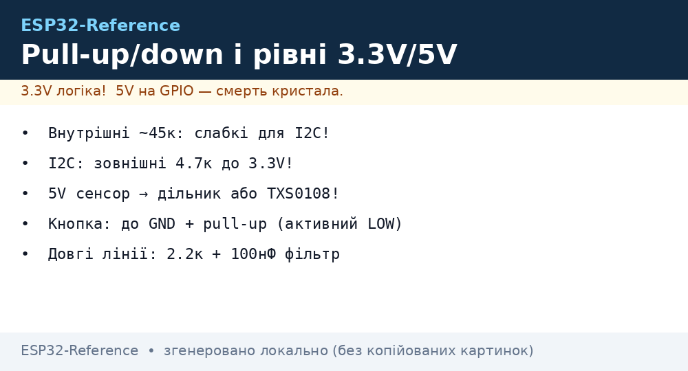

# Pull-ups and 3.3V levels


*Fig. Pull-ups and levels: internal/external pulls, 5V to 3.3V divider, TXS0108.*

ESP32 is **strictly 3.3V logic**. 5V on a pin = degradation/breakdown. Internal pulls are weak (about 45 kOhm) - for long lines and [I2C](../../../ESP32-Reference/04-Shini/03-I2C.md) add external ones.

> [!danger] 5V is NOT tolerated
> Unlike STM32 (5V-tolerant pins), ESP32 **has no** 5V-tolerant GPIO. A 5V sensor - only via divider or level-shifter.

## Purpose

Pull-ups and 3.3V levels - internal pull-up / pull-down; divider 5V to 3.3V - calculation; TXS0108 vs resistor divider. ESP32 is strictly 3.3V logic. 5V on a pin = degradation/breakdown. Internal pulls are weak (about 45 kOhm) - for long lines and [I2C](../../../ESP32-Reference/04-Shini/03-I2C.md) add external ones. Unlike STM32 (5V-tolerant pins), ESP32 has no 5V-tolerant GPIO. A 5V sensor - only via divider or level-shifter.

## Internal pull-up / pull-down

| Parameter | Value |
| --- | --- |
| R pull-up/down | about 45 kOhm (30-80 kOhm spread) |
| Enabling | in software + externally |
| Current | about 70 uA at 3.3V |
| When not enough | I2C, long wires, noisy buttons |

```cpp
// Arduino
pinMode(13, INPUT_PULLUP);
pinMode(14, INPUT_PULLDOWN);
```

```c
// ESP-IDF
gpio_set_pull_mode(13, GPIO_PULLUP_ONLY);
gpio_set_pull_mode(14, GPIO_PULLDOWN_ONLY);
```

```python
# MicroPython
from machine import Pin
b = Pin(13, Pin.IN, Pin.PULL_UP)
```

## Divider 5V to 3.3V - calculation

Formula: `Vout = Vin x R2 / (R1 + R2)`

| Vin | R1 | R2 | Vout | Current |
| --- | --- | --- | --- | --- |
| 5.0V | 2 kOhm | 3.3 kOhm | about 3.11V | about 0.94 mA |
| 5.0V | 1.8 kOhm | 3.3 kOhm | about 3.23V | about 0.98 mA |
| 5.0V | 10 kOhm | 20 kOhm | about 3.33V | about 0.17 mA (for slow signals) |

> [!tip] For UART 115200 take R1=2k, R2=3.3k. 10k+20k - only for buttons/slow signals, because the RC edge ruins the baud rate.

## TXS0108 vs resistor divider

| Criterion | Resistor divider | TXS0108 / TXB0108 |
| --- | --- | --- |
| Direction | only 5V to 3.3V | bidirectional |
| Speed | up to about 1 MHz | up to 24+ MHz (TXS) |
| I2C | bad (open-drain conflict) | TXS0108 - yes, TXB - no |
| Price | pennies | pricier, needs OE + power on both sides |
| When to take | UART RX, sensor divider | [I2C](../../../ESP32-Reference/04-Shini/03-I2C.md), [SPI](../../../ESP32-Reference/04-Shini/02-SPI.md), NeoPixel 5V |

> [!info] For 5V I2C sensors the classic is TXS0108E or a MOSFET level translator (BSS138). Do not put a divider on SDA/SCL.

## Button schematic with debounce

| ESP32 | Component | Value |
| --- | --- | --- |
| GPIO13 | button to GND | input |
| GPIO13 | resistor to 3V3 | 10 kOhm pull-up (or internal) |
| GPIO13 | capacitor to GND | 100 nF (hardware debounce) |

**Arduino (software debounce):**

```cpp
const int BTN = 13;
int last = HIGH; unsigned long t = 0;
void setup() { pinMode(BTN, INPUT_PULLUP); Serial.begin(115200); }
void loop() {
  int v = digitalRead(BTN);
  if (v != last && millis() - t > 50) { t = millis(); last = v;
    if (v == LOW) Serial.println("press"); }
}
```

**ESP-IDF:**

```c
gpio_set_direction(13, GPIO_MODE_INPUT);
gpio_set_pull_mode(13, GPIO_PULLUP_ONLY);
// далі опитування + vTaskDelay(20 / portTICK_PERIOD_MS) або interrupt + timer
```

**MicroPython:**

```python
from machine import Pin
import time
b = Pin(13, Pin.IN, Pin.PULL_UP)
last = 1
while True:
    v = b.value()
    if v != last:
        time.sleep_ms(50)
        v = b.value()
        if v != last:
            last = v
            if v == 0: print("press")
    time.sleep_ms(10)
```

## See also

- [Home](../../../ESP32-Reference/Home.md)
- [01-ESP32-Classic](../../../ESP32-Reference/01-Hardware/01-ESP32-Classic.md)
- [ GPIO overview]
- [ Strapping pins]
- [I2C](../../../ESP32-Reference/04-Shini/03-I2C.md)
- [Level shifters](../../../ESP32-Reference/13-Moduli-zhivlennya-rivniv/02-Level-Shifters.md)
- [ Buttons and encoders]

### Mermaid: pull-up choice

```mermaid
flowchart TB
    Q[Floating line?] --> LEN{Length / speed?}
    LEN -->|Button on board| INT[Internal pull-up about 45k]
    LEN -->|I2C up to 400 kHz| EXT47[External 4.7k to 3.3V]
    LEN -->|Wire over 20 cm| EXT22[External 2.2k + 100nF]
    Q --> V5{5V signal?}
    V5 -->|Slow| DIV[Divider (e.g. 1k/2k)]
    V5 -->|Fast/bidirectional| TXS[TXS0108 / TXB0104]
    V5 -->|Input only| OD[Open-drain + pull-up to 3.3V]
```

### RC debounce of button (when software is not enough)

```text
GPIO ──[10к pull-up до 3.3V]──┬──[1к]──┬──► вхід
                              │        │
                           кнопка   [100нФ до GND]
                              │        │
                             GND      GND
```

## Common issues

| # | Issue | Why it is bad | Correct approach |
| --- | --- | --- | --- |
| 1 | I2C on internal pulls only | about 45k too weak to NACK at 400 kHz | External 4.7k to 3.3V |
| 2 | Pull-up to 5V on SDA/SCL | 5V on GPIO via pull! | Pull ONLY to 3.3V |
| 3 | Divider with no margin for 5V logic | 5.5V instead of 5V to 3.6V on pin | Calculate for 5.5V + TVS |
| 4 | TXS0108 on I2C without pulls on both sides | Will not start | Pulls on BOTH sides (see 13-02) |
| 5 | Button without debounce | Contact bounce = 5 "presses" | RC + 20-50 ms in software |
| 6 | Long line without filter | Pickup, false edges | 2.2k + 100nF near input |

## Official sources

- [ESP32 Datasheet - DC Characteristics](https://www.espressif.com/sites/default/files/documentation/esp32_datasheet_en.pdf) - VIH/VIL, pull currents.
- [TXS0108E datasheet (TI)](https://www.ti.com/product/TXS0108E) - auto-direction shifter, pull requirements.
