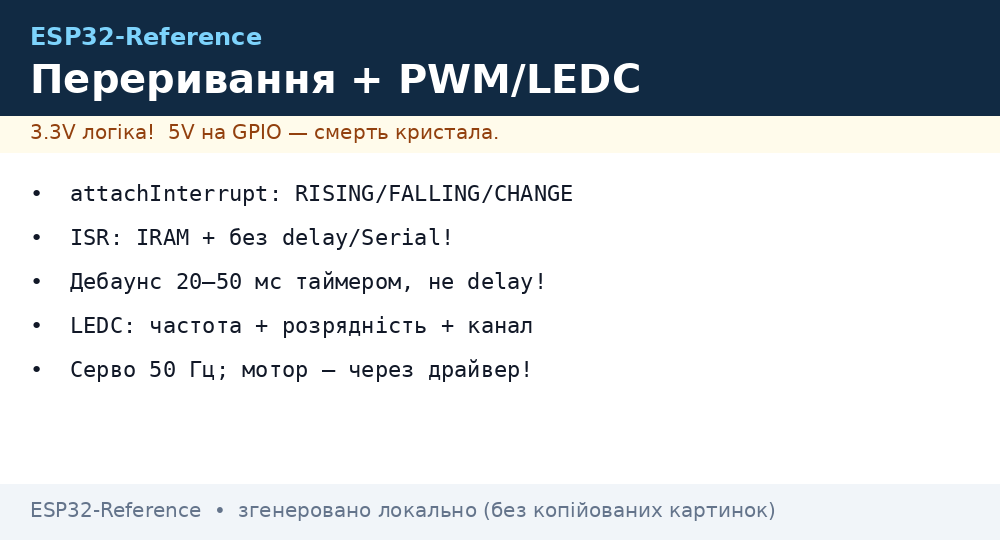
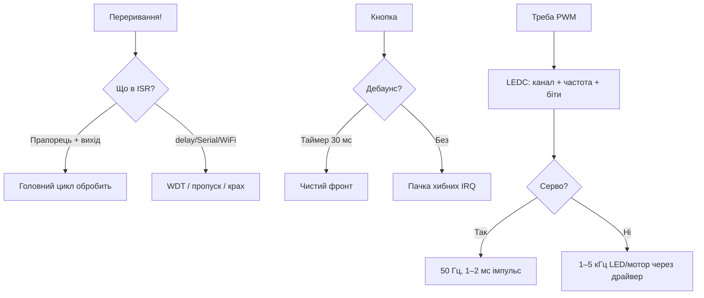

# Переривання та PWM (LEDC)

EN version: `03-GPIO/04-Interrupts-PWM.en.md`


*Рис. Переривання + LEDC: режими, ISR-правила, канали PWM.*

ESP32: переривання на **будь-якому GPIO**, LEDC - **16 каналів**, частота 1 Гц - 40 МГц.

> [!info] Два незалежні механізми
> `attachInterrupt` - реакція на фронт. LEDC - апаратний ШІМ без навантаження CPU. Не плутай з [MCPWM для моторів](../../../ESP32-Reference/07-Timeri-Son/01-Timeri-MCPWM-PCNT-RMT.md).

## Призначення

Переривання та PWM (LEDC) - Переривання - таблиця режимів; LEDC - 16 каналів; Таблиця з'єднань. ESP32: переривання на будь-якому GPIO, LEDC - 16 каналів, частота 1 Гц - 40 МГц. attachInterrupt - реакція на фронт. LEDC - апаратний ШІМ без навантаження CPU. Не плутай з 07-Timeri-Son/01-Timeri-MCPWM-PCNT-RMT.

## Переривання - таблиця режимів

| Режим Arduino | ESP-IDF | Коли |
| --- | --- | --- |
| RISING | GPIO_INTR_POSEDGE | кнопка відпущена / енкодер |
| FALLING | GPIO_INTR_NEGEDGE | кнопка натиснута (PULLUP) |
| CHANGE | GPIO_INTR_ANYEDGE | енкодер, манчестер |
| LOW / HIGH | GPIO_INTR_LOW_LEVEL | wakeup, тривога |

> [!warning] ISR правила
> В ISR - тільки `IRAM_ATTR`, без `delay()`, без `Serial.print`, прапорці `volatile`. Довгу роботу - в loop/task.

## LEDC - 16 каналів

| Параметр | Значення |
| --- | --- |
| Каналів | 16 (2 групи high/low speed) |
| Розрядність | 1-16 біт (чим вища частота - тим менше біт) |
| Частота | 1 Гц - 40 МГц |
| Прив'язка | будь-який GPIO через matrix |

| Задача | Частота | Розрядність |
| --- | --- | --- |
| LED dimming | 5 кГц | 8-12 біт |
| Servo SG90 | 50 Гц | 16 біт (1-2 мс імпульс) |
| Buzzer | 2-4 кГц | 8 біт |

## Таблиця з'єднань

| ESP32 | Пристрій | Примітка |
| --- | --- | --- |
| GPIO13 | кнопка → GND | INT FALLING, pull-up |
| GPIO18 | LED + 220 Ом → GND | LEDC CH0 |
| GPIO19 | Servo сигнал (помаранч.) | LEDC 50 Гц; живлення servo 5В окремо, GND спільний |

## Код - кнопка + LED PWM + Servo

**Arduino:**

```cpp
volatile bool flag = false;
void IRAM_ATTR isr() { flag = true; }
#define LED 18
#define SERVO 19
void setup() {
  pinMode(13, INPUT_PULLUP);
  attachInterrupt(13, isr, FALLING);
  ledcSetup(0, 5000, 8); ledcAttachPin(LED, 0);
  ledcSetup(1, 50, 16);  ledcAttachPin(SERVO, 1);
}
void loop() {
  if (flag) { flag = false; /* action */ }
  for (int d = 0; d < 255; d++) { ledcWrite(0, d); delay(5); }
  ledcWrite(1, 3277); delay(1000);  // ~1ms
  ledcWrite(1, 6554); delay(1000);  // ~2ms
}
```

**ESP-IDF:**

```c
#include "driver/gpio.h"
#include "driver/ledc.h"
#define LED 18
static void IRAM_ATTR isr(void *a) { /* xQueueSendFromISR */ }
void app_main(void) {
    gpio_set_direction(13, GPIO_MODE_INPUT);
    gpio_set_pull_mode(13, GPIO_PULLUP_ONLY);
    gpio_set_intr_type(13, GPIO_INTR_NEGEDGE);
    gpio_install_isr_service(0);
    gpio_isr_handler_add(13, isr, NULL);
    ledc_timer_config_t t = {.speed_mode=LEDC_LOW_SPEED_MODE,.timer_num=LEDC_TIMER_0,.duty_resolution=LEDC_TIMER_8_BIT,.freq_hz=5000,.clk_cfg=LEDC_AUTO_CLK};
    ledc_timer_config(&t);
    ledc_channel_config_t c = {.gpio_num=LED,.speed_mode=LEDC_LOW_SPEED_MODE,.channel=LEDC_CHANNEL_0,.timer_sel=LEDC_TIMER_0,.duty=128};
    ledc_channel_config(&c);
}
```

**MicroPython:**

```python
from machine import Pin, PWM
import time
btn = Pin(13, Pin.IN, Pin.PULL_UP)
led = PWM(Pin(18), freq=5000, duty=128)
servo = PWM(Pin(19), freq=50, duty=77)  # ~1ms/20ms ~ 77/1023
def cb(p): print("irq")
btn.irq(trigger=Pin.IRQ_FALLING, handler=cb)
while True:
    for d in range(0, 1024, 10):
        led.duty(d); time.sleep_ms(10)
```

## Див. також

- [Home](../../../ESP32-Reference/Home.md)
- [GPIO огляд](../../../ESP32-Reference/03-GPIO/01-GPIO-oglyad.md)
- [Підтягування](../../../ESP32-Reference/03-GPIO/03-Pidtyaguvannya-rivni.md)
- [Таймери MCPWM PCNT RMT](../../../ESP32-Reference/07-Timeri-Son/01-Timeri-MCPWM-PCNT-RMT.md)
- [LED та NeoPixel](../../../ESP32-Reference/11-Vivid/03-NeoPixel-Servo-Rele-MOSFET.md)
- [Кнопки та енкодери](../../../ESP32-Reference/03-GPIO/04-Pererivannya-PWM.md)
- [01-ESP32-Classic](../../../ESP32-Reference/01-Hardware/01-ESP32-Classic.md)

### Mermaid: ISR-гігієна



### LEDC-канали і серво-математика

| Параметр | LED | Серво SG90 | Мотор DC |
| --- | --- | --- | --- |
| Частота | 1-5 кГц | 50 Гц | 20-25 кГц (без свисту!) |
| Розрядність | 8-10 біт | 14-16 біт (точність 1 мкс!) | 8-10 біт |
| Імпульс серво | - | 1000-2000 мкс = 0-180° | - |
| Драйвер | Резистор/MOSFET | Живлення 5V окремо! | H-міст, див. 11-04 |

## Типові помилки

| # | Помилка | Чому погано | Як правильно |
| --- | --- | --- | --- |
| 1 | delay/Serial в ISR | Блокує систему, WDT-рестарт | Прапорець + обробка в loop |
| 2 | Кнопка без дебаунса | Пачка переривань | RC + 20-50 мс |
| 3 | CHANGE на енкодері без черги | Втрата кроків на швидкості | PCNT-периферія (див. 07-01!) |
| 4 | Серво від 3.3V піна живлення | Пік 500+ мА садить рейку | Окремий БЖ 5V, спільна GND |
| 5 | PWM 1 кГц на моторі | Свист + втрати | 20-25 кГц |
| 6 | Один LEDC-канал на два піни | Конфлікт налаштувань | Канал - один пін (їх 16!) |

## Офіційні джерела

- [ESP32 LEDC (ESP-IDF)](https://docs.espressif.com/projects/esp-idf/en/latest/esp32/api-reference/peripherals/ledc.html) - канали, частота, розрядність.
- [GPIO interrupts (ESP-IDF)](https://docs.espressif.com/projects/esp-idf/en/latest/esp32/api-reference/peripherals/gpio.html) - типи, ISR, IRAM.
