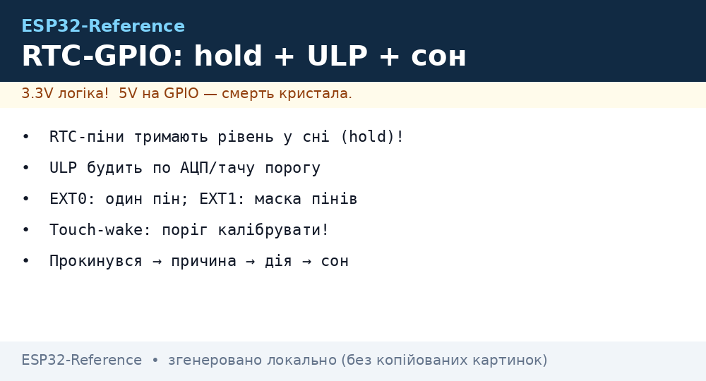
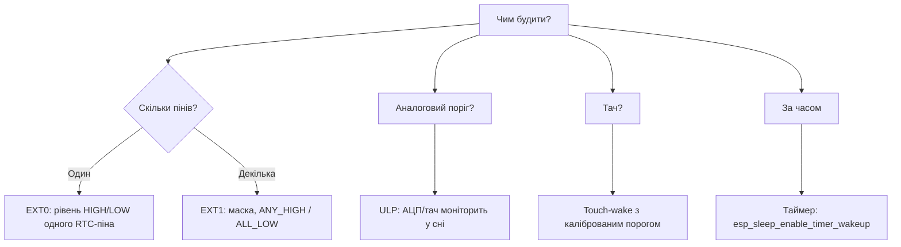

# RTC GPIO - hold та wakeup

EN version: `03-GPIO/05-RTC-GPIO.en.md`


*Рис. RTC-GPIO: hold рівня, ULP, EXT0/EXT1 wake.*

RTC-домен живиться навіть у [deep-sleep](../../../ESP32-Reference/07-Timeri-Son/03-Sleep-ULP.md). Тільки RTC-піни вміють тримати стан (hold) і будити чіп. Джерела пробудження - EXT0 (один пін), EXT1 (маска), тач і ULP-пороги. Утримання реле в сні - класична задача: встановити рівень, увімкнути hold, заснути. Після пробудження hold знімається, інакше пін лишиться замороженим.

> [!info] Які піни - RTC?
> **0, 2, 4, 12, 13, 14, 15, 25, 26, 27, 32, 33, 34, 35, 36, 39.** GPIO34-39 - тільки вхід, без pull.

## Призначення

RTC GPIO - hold та wakeup - Можливості RTC GPIO; Таблиця з'єднань - утримання реле в сні; Hold API у трьох фреймворках. RTC-домен живиться навіть у 07-Timeri-Son/03-Sleep-ULP. Тільки RTC-піни вміють тримати стан (hold) і будити чіп.

## Можливості RTC GPIO

| Функція | Опис |
| --- | --- |
| Hold | тримає OUT/HOLD під час deep-sleep (реле не клацає) |
| EXT0 wakeup | 1 пін RTC, рівень HIGH/LOW будить |
| EXT1 wakeup | маска кількох RTC-пінів, ANY_HIGH / ALL_LOW |
| ULP | [ULP](../../../ESP32-Reference/07-Timeri-Son/03-Sleep-ULP.md) читає RTC-сенсори без CPU |
| ADC RTC | ADC1 на RTC-пінах доступний в сні |

## Таблиця з'єднань - утримання реле в сні

| ESP32 | Модуль | Примітка |
| --- | --- | --- |
| GPIO33 | реле IN (через транзистор) | RTC8, hold працює |
| 3V3 / GND | живлення реле | окремо, якщо треба в сні - живити теж треба |
| GPIO32 | кнопка → GND | EXT0 wakeup |

## Код

**Arduino (hold + EXT0):**

```cpp
#include "driver/rtc_io.h"
#define RELAY 33
void setup() {
  pinMode(RELAY, OUTPUT); digitalWrite(RELAY, HIGH);
  rtc_gpio_hold_en((gpio_num_t)RELAY);  // тримати в сні
  esp_sleep_enable_ext0_wakeup((gpio_num_t)32, 0); // будити LOW
  esp_deep_sleep_start();
}
```

**ESP-IDF:**

```c
#include "driver/rtc_io.h"
#include "esp_sleep.h"
void app_main(void) {
    rtc_gpio_init(33);
    rtc_gpio_set_direction(33, RTC_GPIO_MODE_OUTPUT_ONLY);
    rtc_gpio_set_level(33, 1);
    rtc_gpio_hold_en(33);
    esp_sleep_enable_ext0_wakeup(32, 0);
    esp_deep_sleep_start();
}
```

**MicroPython:**

```python
from machine import Pin, deepsleep
import esp32
r = Pin(33, Pin.OUT); r.on()
# hold через esp32.gpio_hold_en у нових білдах
esp32.wake_on_ext0(pin=Pin(32), level=esp32.WAKEUP_ALL_LOW)
deepsleep(10000)
```

> [!warning] Не забудь зняти hold
> Після пробудження виклич `rtc_gpio_hold_dis()`, інакше `digitalWrite` на пін не діятиме - пін "заморожений".

### Hold API у трьох фреймворках

```cpp
// Arduino-ESP32: утримати реле у сні
#include "driver/rtc_io.h"
rtc_gpio_hold_en(GPIO_NUM_33);      // заморозити HIGH перед сном
esp_deep_sleep_start();
// ...після wake:
rtc_gpio_hold_dis(GPIO_NUM_33);     // розморозити, інакше digitalWrite мовчить!
```

```c
// ESP-IDF: те саме + ізоляція живлення RTC-домену
rtc_gpio_init(GPIO_NUM_33);
rtc_gpio_set_direction(GPIO_NUM_33, RTC_GPIO_MODE_OUTPUT_ONLY);
rtc_gpio_set_level(GPIO_NUM_33, 1);
rtc_gpio_hold_en(GPIO_NUM_33);
esp_sleep_enable_ext0_wakeup(GPIO_NUM_32, 0);  // будити кнопкою
esp_deep_sleep_start();
```

```text
Обмеження hold, про які забувають:
  - Hold тримає ТІЛЬКИ цифровий рівень; ADC/тач/DAC у сні безпосередньо не працюють —
    їх обслуговує ULP (див. 07-Timeri-Son/03).
  - GPIO34–39: входять у RTC-домен як ВХОДИ (EXT1/ULP), але hold-виходу в них нема.
  - Після будь-якого reset (не wake!) hold скидається — реле клацне. Конденсатор
    на затворі MOSFET (100нФ) маскує клацання на ~мс.
```

### Mermaid: вибір wake-джерела



### EXT0 vs EXT1 vs ULP - таблиця вибору

| Джерело | Піни | Струм у сні | Коли |
| --- | --- | --- | --- |
| Timer | - | ~10 мкА | Періодичні виміри |
| EXT0 | 1 RTC-пін, рівень | ~10 мкА | Кнопка/двері |
| EXT1 | Маска RTC-пінів | ~10 мкА | Декілька датчиків |
| Touch | Тач-піни | ~50+ мкА | Панель керування |
| ULP | ADC/тач пороги | ~100+ мкА | «Будити якщо…» без CPU |

## Типові помилки

| # | Помилка | Чому погано | Як правильно |
| --- | --- | --- | --- |
| 1 | Hold не знято після wake | Пін заморожений, `digitalWrite` мовчить | `rtc_gpio_hold_dis()` одразу |
| 2 | EXT0 на не-RTC піні | Не прокинеться ніколи | Тільки RTC-піни (див. таблицю!) |
| 3 | Touch-поріг «зі стелі» | Хибні/відсутні пробудження | Калібрувати на місці ± запас |
| 4 | ULP без виміру струму | 100+ мкА замість 10 | Рахувати бюджет (див. 02-03!) |
| 5 | Реле тримається GPIO без hold | У сні реле відпускає | Hold ДО сну + живлення реле окремо |

## Офіційні джерела

- [ESP32 Sleep Modes + RTC GPIO (ESP-IDF)](https://docs.espressif.com/projects/esp-idf/en/latest/esp32/api-reference/system/sleep_modes.html) - EXT0/EXT1, hold, ULP.
- [ULP coprocessor guide](https://docs.espressif.com/projects/esp-idf/en/latest/esp32/api-reference/system/ulp.html) - програмування ULP.

## Див. також

- [Home](../../../ESP32-Reference/Home.md)
- [01-ESP32-Classic](../../../ESP32-Reference/01-Hardware/01-ESP32-Classic.md)
- [GPIO огляд](../../../ESP32-Reference/03-GPIO/01-GPIO-oglyad.md)
- [Sleep та ULP](../../../ESP32-Reference/07-Timeri-Son/03-Sleep-ULP.md)
- [ADC](../../../ESP32-Reference/06-Analog/01-ADC.md)
- [WDT](../../../ESP32-Reference/07-Timeri-Son/02-WDT.md)
