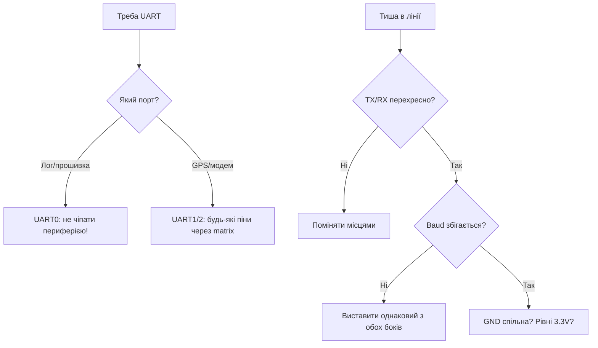

# UART ESP32 - 3 порти


ESP32 Classic має **3× UART** (U0, U1, U2). Будь-який UART можна перемапити на будь-які GPIO через GPIO Matrix (до ~5 Мбод).

> [!warning] U1 конфліктує з flash
> U1 за замовчуванням **GPIO9/10** - це QSPI flash. Не чіпай без перемаплення! Завжди роби `Serial1.begin(..., RX=.., TX=..)`.

## Призначення

UART ESP32 - 3 порти - Піни за замовчуванням; Таблиця з'єднань; Код - loopback U2. ESP32 Classic має 3× UART (U0, U1, U2). Будь-який UART можна перемапити на будь-які GPIO через GPIO Matrix (до ~5 Мбод). U1 за замовчуванням GPIO9/10 - це QSPI flash. Не чіпай без перемаплення! Завжди роби Serial1.begin(..., RX=.., TX=..).

## Піни за замовчуванням

| UART | RX | TX | Примітка |
| --- | --- | --- | --- |
| U0 | GPIO3 | GPIO1 | USB-консоль, прошивка |
| U1 | GPIO9 | GPIO10 | **flash!** - перемапити, напр. 16/17 або 12/13 |
| U2 | GPIO16 | GPIO17 | вільний, бери для [GPS](../../../ESP32-Reference/12-Moduli-zvyazku/03-SIM800L-GPS.md) / [RS485](../../../ESP32-Reference/04-Shini/05-CAN-TWAI-RS485.md) |

## Таблиця з'єднань

| ESP32 | RS232 MAX3232 / GPS | Примітка |
| --- | --- | --- |
| GPIO16 (U2 RX) | TX модуля | перехресно RX←TX |
| GPIO17 (U2 TX) | RX модуля | через дільник якщо модуль 5V |
| GND | GND | спільна земля |
| - | MAX3232 T1IN/R1OUT | до DB9, конденсатори 0.1мкФ ×4 |

> [!tip] Loopback-тест
> З'єднай TX↔RX одного UART - що відправив, те й прийшло. Швидка перевірка без осцилографа.

## Код - loopback U2

**Arduino:**

```cpp
#include <HardwareSerial.h>
HardwareSerial S2(2);
void setup() {
  Serial.begin(115200);
  S2.begin(115200, SERIAL_8N1, 16, 17);
  S2.println("hello");
}
void loop() {
  if (S2.available()) Serial.write(S2.read());
}
```

**ESP-IDF:**

```c
#include "driver/uart.h"
#define U UART_NUM_2
void app_main(void) {
    uart_config_t c = {.baud_rate=115200,.data_bits=UART_DATA_8_BITS,.parity=UART_PARITY_DISABLE,.stop_bits=UART_STOP_BITS_1,.flow_ctrl=UART_HW_FLOWCTRL_DISABLE,.source_clk=UART_SCLK_APB};
    uart_param_config(U, &c);
    uart_set_pin(U, 17, 16, -1, -1);
    uart_driver_install(U, 1024, 1024, 0, NULL, 0);
    uart_write_bytes(U, "hello\r\n", 7);
}
```

**MicroPython:**

```python
from machine import UART
u = UART(2, baudrate=115200, tx=17, rx=16)
u.write("hello\r\n")
print(u.read())
```

## RS232 / RS485 - фізика коротко

UART ESP32 - це **логічні рівні 3.3В**, а не RS232 (±12В) і не RS485 (диференціал). Перетворювачі обов'язкові:

| Стандарт | Сигнал | Дальність | Мікросхема | Схема |
| --- | --- | --- | --- | --- |
| TTL UART | 0-3.3В, спільний GND | ~1 м | - (безпосередньо) | TX↔RX перехресно |
| RS232 | ±3…±15В, single-ended | 15 м | MAX3232 (3.3В!) / MAX232 (5В) | 4× 0.1 мкФ charge-pump |
| RS485 | A/B диференціал ±1.5В | 1200 м | MAX485 / SP3485 (3.3В) / ADM2587E ізольована | twisted pair + 120 Ом на кінцях |

> [!warning] MAX232 vs MAX3232
> MAX232 - 5-вольтовий, його вихід RX (до ESP32) дасть 5В → спалиш пін. Для ESP32 тільки **MAX3232 / SP3232** або дільник на виході. Див. [рівні 5V→3.3V](../../../ESP32-Reference/03-GPIO/03-Pidtyaguvannya-rivni.md).

RS485-напівдуплекс на U2 (DE/RE керування):

```cpp
#include <HardwareSerial.h>
HardwareSerial RS485(2);
#define RX2 16
#define TX2 17
#define DE_RE 21  // HIGH = передача
void setup() {
  pinMode(DE_RE, OUTPUT);
  digitalWrite(DE_RE, LOW);
  RS485.begin(9600, SERIAL_8N1, RX2, TX2);
}
void rs485Write(const uint8_t *b, size_t n) {
  digitalWrite(DE_RE, HIGH);
  RS485.write(b, n);
  RS485.flush();  // дочекатись останнього стоп-біта!
  delayMicroseconds(500);
  digitalWrite(DE_RE, LOW);
}
```

Термінатори: **120 Ом між A-B на обох кінцях шини**, bias-резистори 680 Ом (A→3.3В, B→GND) тільки в одному місці. Без термінаторів на 100+ м - відбиття і «плаваючі» помилки кадру. Деталі шини - [05-CAN-TWAI-RS485](../../../ESP32-Reference/04-Shini/05-CAN-TWAI-RS485.md).

## HW FIFO + пороги переривань

Кожен UART ESP32 має **апаратний FIFO 128 байт** на RX і TX + окремий software ring-буфер драйвера:

| Параметр | Значення | Налаштування |
| --- | --- | --- |
| HW RX FIFO | 128 байт | `uart_set_rx_full_thr()` / `rxfifo_full_thrhd` |
| HW TX FIFO | 128 байт | `txfifo_empty_thrhd` |
| RX timeout | ~10 символьних часів тиші | `rx_timeout_thrhd` - межа пакета (Modbus!) |
| SW ring (IDF) | за замовчуванням 256-1024 | `uart_driver_install(u, rx_size, tx_size, ...)` |
| Arduino SW буфер | 256 байт | `Serial.setRxBufferSize(n)` до `begin()` |

Практика:

- **9600 бод + Modbus**: поріг RX 100-120 байт, timeout 3.5 символу. Пакет забрав цілком - кінець кадру визначив timeout.
- **115200 + GPS NMEA**: поріг 1-8 байт + великий SW ring (2048), парсинг по `\n`. Малий SW ring = втрата символів на фоні WiFi.
- **1+ Мбод**: threshold малий (10-20), ring ≥ 4096, обробка в окремому task з пріоритетом вище WiFi.

ESP-IDF приклад порогів:

```c
#include "driver/uart.h"
#define U UART_NUM_2
void uart_fifo_init(void) {
    uart_config_t c = {.baud_rate=115200,.data_bits=UART_DATA_8_BITS,
        .parity=UART_PARITY_DISABLE,.stop_bits=UART_STOP_BITS_1,
        .flow_ctrl=UART_HW_FLOWCTRL_DISABLE,.source_clk=UART_SCLK_APB};
    uart_param_config(U, &c);
    uart_set_pin(U, 17, 16, UART_PIN_NO_CHANGE, UART_PIN_NO_CHANGE);
    // 2 КБ ring + події; HW поріг: переривання кожні 100 байт або timeout 10
    uart_driver_install(U, 2048, 2048, 20, NULL, 0);
    uart_intr_config_t it = {.intr_enable_mask = UART_RXFIFO_FULL_INT_ENA_M
        | UART_RXFIFO_TOUT_INT_ENA_M, .rxfifo_full_thrhd = 100,
        .rx_timeout_thrhd = 10, .txfifo_empty_thrhd = 10};
    uart_intr_config(U, &it);
}
```

> [!tip] RTS/CTS flow-control
> На швидкостях ≥460800 або при повільній обробці вмикай HW flow-control (піни RTS/CTS). Без нього на довгих NMEA-потоках будуть overrun-и саме під час WiFi-сплесків.

## 9-біт режим, break-detect, інверсія рівнів

| Функція | Для чого | Як ввімкнути |
| --- | --- | --- |
| 9-біт (RS485 address) | 9-й біт = адреса/дані (Modbus-варіанти, MDB) | IDF: `UART_DATA_9_BITS` + `uart_set_parity()` як адресний біт; Arduino - через `Serial9Bit` бібліотеку або IDF |
| Break-detect | довгий LOW (>довжини кадру) = сигнал «скидання лінії», LIN-sync | переривання `UART_BRK_DET_INT_ENA`, читання `UART_BRK_DET_INT_ST` |
| Інверсія рівнів | RS485-трансивери з інверсією, оптопари, однопровідний half-duplex | `uart_set_line_inverse()` - інверсія TXD/RXD/RTS (див. код нижче) |
| RS485 half-duplex HW | автоматичне DE через RTS-пін | `uart_set_mode(U, UART_MODE_RS485_HALF_DUPLEX)` - RTS стає DE |

9-біт передача (IDF):

```c
// Адресний байт з 9-м бітом = 1:
uart_write_bytes_with_break(U, NULL, 0, 0);  // no-op приклад
// Реально: конфіг 9 біт, запис uint16_t слів через FIFO API:
uint16_t addr_frame = 0x100 | 0x55;  // 9-й біт + адреса
// ... uart_write_bytes(U, (char*)&addr_frame, 2) з UART_DATA_9_BITS
```

Інверсія для однопровідної лінії (два ESP32 одним дротом через діоди):

```c
uart_set_line_inverse(UART_NUM_2,
    UART_SIGNAL_TXD_INV | UART_SIGNAL_RXD_INV | UART_SIGNAL_RTS_INV);
uart_set_mode(UART_NUM_2, UART_MODE_RS485_HALF_DUPLEX);
```

## Baud-калькулятор похибки

UART ESP32 ділить APB-клок (80 МГц). Точні бодрейти - дільники 80 МГц; решта - з похибкою:

| Бажаний бод | Реальний (APB 80М) | Похибка | Статус |
| --- | --- | --- | --- |
| 9600 | 9600 | ~0% | ок |
| 115200 | 115200 | ~0% | ок |
| 460800 | 460800 | <1% | ок |
| 921600 | 923077 | +0.16% | ок (<2%) |
| 1 000 000 | 1 000 000 | 0% | ок (цілий дільник) |
| 1 500 000 | 1 538 461 | +2.5% | ризик |
| 2 000 000 | 2 000 000 | 0% | ок |
| 3 000 000 | 3 076 923 | +2.5% | ризик без flow-control |

Правило: **похибка сумарно (TX+RX) має бути < 4-5%** для 8N1 (запас на пів біта за 10 біт кадру). Перевірка в коді:

```cpp
// Швидкий тест стабільності: loopback 1000 пакетів на цільовому боді
HardwareSerial S2(2);
void baud_test(long baud) {
  S2.begin(baud, SERIAL_8N1, 16, 17);
  int err = 0;
  uint8_t p[64]; for (int i = 0; i < 64; i++) p[i] = i;
  for (int k = 0; k < 1000; k++) {
    S2.write(p, 64);
    for (int i = 0; i < 64; i++) {
      int c = -1; unsigned long t = millis();
      while ((c = S2.read()) < 0 && millis() - t < 50) yield();
      if (c != p[i]) { err++; break; }
    }
  }
  Serial.printf("baud %ld errors: %d/1000\n", baud, err);
}
```

> [!warning] APB vs REF_TICK
> При dynamic frequency scaling (DFS / light-sleep) APB пливе → бод пливе. Для стабільного UART: або `UART_SCLK_REF_TICK` (1 МГц, точний але макс. ~1 Мбод), або заборона DFS через `esp_pm_lock`. GPS-трекер що «пливе» після засинання - саме цей кейс. Див. [Sleep та ULP](../../../ESP32-Reference/07-Timeri-Son/03-Sleep-ULP.md).

## 9-біт multiprocessor-режим - докладно

Ідея: на одній парі дротів сидять N пристроїв; 9-й біт розрізняє **адресу** (1) і **дані** (0). Слейви ігнорують чужі дані на апаратному рівні - CPU не прокидається від чужого трафіку.

| Параметр | Значення | Коментар |
| --- | --- | --- |
| Кадр | 1 start + 9 data + 1 parity-addr/address-bit + 1 stop | ESP32 реалізує через `UART_DATA_9_BITS` + адресну маску |
| Передача адреси | 9-й біт = 1 | усі слейви перериваються, звіряють адресу |
| Передача даних | 9-й біт = 0 | слухає тільки адресований слейв |
| Швидкість | зазвичай 9600-38400 | на 115200+ толерантність до розсинхронізації падає |
| Термінація | як RS485 (120 Ом на кінцях) | див. розрахунок нижче |

ESP-IDF: повний приклад master → addressed slave:

```c
#include "driver/uart.h"
#define U UART_NUM_2
#define MY_ADDR 0x2A

void uart9_init_master(void) {
    uart_config_t c = {
        .baud_rate = 9600,
        .data_bits = UART_DATA_9_BITS,
        .parity = UART_PARITY_DISABLE,
        .stop_bits = UART_STOP_BITS_1,
        .flow_ctrl = UART_HW_FLOWCTRL_DISABLE,
        .source_clk = UART_SCLK_APB,
    };
    uart_param_config(U, &c);
    uart_set_pin(U, 17, 16, UART_PIN_NO_CHANGE, UART_PIN_NO_CHANGE);
    uart_driver_install(U, 1024, 1024, 0, NULL, 0);
}

// Передача: старший біт маркера в окремому API через parity/адресний біт.
// На практиці для 9-біт на ESP32 використовують RS485-адресний режим TRM:
// UART_RS485_CONF_REG: RS485_EN + ADDR_MATCH_EN.
void uart9_send_addr(uint8_t addr) {
    // адресний байт: hardware виставить 9-й біт = 1
    uart_write_bytes(U, (const char *)&addr, 1);
    // + налаштування регістра адреси слейва див. TRM "RS485 address match"
}

void uart9_send_data(const uint8_t *b, size_t n) {
    // байти даних: 9-й біт = 0, чують тільки обрані
    uart_write_bytes(U, (const char *)b, n);
    uart_wait_tx_done(U, 100);
}
```

Слейв з апаратним фільтром адреси (прокидається тільки на свою):

```c
// Псевдо-регістровий рівень (звірся з TRM свого чипа!):
// UART_RS485_CONF_REG.UART_RS485_EN = 1
// UART_RS485_CONF_REG.UART_DL1_EN = 1 (address match enable)
// UART_ADDR_CONF_REG.UART_ADDR = MY_ADDR
// Тоді переривання RX приходить тільки на збіг адреси + наступні дані.
```

> [!warning] Arduino vs IDF для 9-біт
> Arduino-HardwareSerial не має стабільного 9-біт API - або стороння бібліотека `Serial9Bit`, або прямий IDF. Для MDB-автоматів / ліфтів / домовентиляції з multiprocessor-протоколом бери IDF одразу.

Діагностика 9-біт логічним аналізатором: Saleae/DSLogic декодує тільки 8N1 - 9-й біт побачиш як «parity error» або зайвий біт. Став асинхронний декодер 9-bit / MDB, або міряй вручну: ширина біта на 9600 = 104 мкс, кадр 11 бітів = 1.15 мс.

## Modbus RTU таймінг 3.5 символу - розрахунок для будь-якого боду

Modbus RTU: кадр закінчується **мовчанкою 3.5 символу**. Немає тиші - немає межі кадру.

Формула (кадр 1 start + 8 data + 1 stop = 11 бітів, з парністю - теж 11):

```text
Tсимволу = 11 / baud  (секунд)
T3.5 = 3.5 × 11 / baud = 38.5 / baud
T1.5 (макс. пауза всередині кадру) = 16.5 / baud
```

| Бод | Tсимволу (11 біт) | T3.5 мовчанка | T1.5 межа | Практика ESP32 |
| --- | --- | --- | --- | --- |
| 1200 | 9.167 мс | **32.1 мс** | 13.75 мс | `vTaskDelay(35ms)` після flush |
| 2400 | 4.583 мс | **16.0 мс** | 6.9 мс | 18 мс запас |
| 4800 | 2.292 мс | **8.02 мс** | 3.44 мс | 9-10 мс |
| 9600 | 1.146 мс | **4.01 мс** | 1.72 мс | **5 мс** (класика) |
| 19200 | 573 мкс | **2.01 мс** | 0.86 мс | 2.5 мс |
| 38400 | 286 мкс | **1.00 мс** | 0.43 мс | 1.5 мс + HW-timeout |
| 57600 | 191 мкс | **669 мкс** | 287 мкс | тільки HW `rx_timeout_thrhd`! |
| 115200 | 95.5 мкс | **334 мкс** | 143 мкс | тільки HW timeout, ніяких `delay()` |

Код Modbus-майстра з правильним таймінгом:

```cpp
#include <HardwareSerial.h>
HardwareSerial MB(2);
#define RX2 16
#define TX2 17
#define DE_RE 21

// Мовчанка 3.5 символу для поточного боду:
uint32_t modbus_silence_us(long baud) {
  return (uint32_t)(38.5 * 1000000UL / baud) + 500;  // + запас
}

uint16_t modbus_crc(const uint8_t *b, size_t n) {
  uint16_t c = 0xFFFF;
  for (size_t i = 0; i < n; i++) {
    c ^= b[i];
    for (int k = 0; k < 8; k++)
      c = (c & 1) ? (c >> 1) ^ 0xA001 : (c >> 1);
  }
  return c;
}

void modbus_request(const uint8_t *frame, size_t n, long baud) {
  digitalWrite(DE_RE, HIGH);
  MB.write(frame, n);
  MB.flush();
  delayMicroseconds(modbus_silence_us(baud) / 2);
  digitalWrite(DE_RE, LOW);
  // далі чекай відповідь з timeout = 3.5 символу × 3 + час слейва (тип. 100–1000 мс)
}
```

HW-визначення кінця кадру через RX-timeout (не блокує CPU!):

```c
// timeout у "символьних часах": 3.5 символу ≈ tout_thresh 4 (крок = 1 символ ≈ 11 бітів)
uart_set_rx_timeout(UART_NUM_2, 4);
uart_set_always_rx_timeout(UART_NUM_2, true);  // timeout навіть при повному FIFO
// Подія UART_DATA + UART_RXFIFO_TOUT → кадр готовий, забирай uart_read_bytes().
```

> [!danger] Типові помилки Modbus на ESP32
>
> 1. `DE_RE` опустили до `flush()` - останній байт обрізаний, слейв мовчить. 2. `delay(5)` замість розрахунку при зміні боду - на 115200 це 50 символів простою, шина гальмує. 3. Два майстри на шині без арбітражу - колізії; лікується `uart_get_collision_flag()` + повтор. 4. Загальний GND відсутній на довгій лінії - плаваючі помилки CRC.

## RS485 biasing / termination - розрахунок, а не магія

| Елемент | Номінал | Де ставити | Навіщо |
| --- | --- | --- | --- |
| Термінатор | **120 Ом** між A-B | на ОБОХ кінцях шини (і тільки!) | поглинання відбиттів, match хвильового опору пари ~120 Ом |
| Fail-safe bias pull-up | **680 Ом** A → VCC (3.3В/5В) | в ОДНОМУ місці (зазвичай у майстра) | підтягує лінію в mark при мовчанні |
| Fail-safe bias pull-down | **680 Ом** B → GND | там само, парою до pull-up | разом дають ~200 мВ зміщення idle |
| Series-R | 10 Ом в A і B (опц.) | біля кожного трансивера | обмеження струму при гарячому підключенні |

Розрахунок idle-зміщення (перевірка, що приймач бачить лог. 1 у тиші):

```text
Еквівалент: два термінатори 120 Ом паралельно = 60 Ом між A-B.
Bias-ланцюг: VCC --680-- A --[60]-- B --680-- GND.
Струм bias: I = VCC / (680 + 60 + 680) = 3.3 / 1420 ≈ 2.32 мА.
Vidle(A-B) = I × 60 ≈ 139 мВ.
Поріг приймача RS485: ±200 мВ... проблема? Тому для 3.3В беруть 560 Ом:
I = 3.3/1180 ≈ 2.8 мА → Vidle ≈ 168 мВ — все ще мало!
Правильне рішення: bias 470 Ом: I = 3.3/1000 = 3.3 мА → Vidle ≈ 198 мВ ≈ поріг.
На практиці: при 3.3В живленні трансивера став 560 Ом пару (компроміс струм/запас),
при 5В — класичні 680 Ом (I = 5/1420 ≈ 3.5 мА → Vidle ≈ 211 мВ — норма).
```

Висновок таблицею:

| Живлення трансивера | Bias-пара | Vidle | Струм простою | Рекомендація |
| --- | --- | --- | --- | --- |
| 5.0В (MAX485) | 680 Ом | ~210 мВ | 3.5 мА | класика, бери |
| 3.3В (SP3485) | 680 Ом | ~140 мВ | 2.3 мА | мало запасу - бери 560 Ом |
| 3.3В (SP3485) | 560 Ом | ~170 мВ | 2.8 мА | прийнятно |
| 3.3В (SP3485) | 470 Ом | ~200 мВ | 3.3 мА | максимум запасу, більше споживання |
| Будь-яке | без bias | ~0 мВ | 0 | приймач у тиші видає сміття! |

> [!warning] Термінаторів має бути ДВА, bias - ОДИН
> Поставив 120 Ом на кожному вузлі (5 вузлів = 24 Ом навантаження) - трансивер перегрівається, дальність падає в рази. Bias у кожному вузлі - паралельні пари садять Vidle нижче порога. Правило: термінатори - кінці шини, bias - майстер, решта вузлів - голі A/B на трансивер.

Заземлення екрану: екран twisted pair - в GND в ОДНІЙ точці (у майстра). Заземлення з обох боків + різниця потенціалів корпусів = струм по екрану = вигорілі трансивери. При різниці земель >5В - тільки ізольований трансивер (ADM2587E / ISO1452). Див. [05-CAN-TWAI-RS485](../../../ESP32-Reference/04-Shini/05-CAN-TWAI-RS485.md).

## Інверсія рівнів + апаратний loopback-автотест

Інверсія потрібна: оптопари, однопровідний half-duplex через діоди, трансивери з інверсним DE.

```c
#include "driver/uart.h"
// Інвертувати TXD + RXD (оптопара перевертає обидва):
uart_set_line_inverse(UART_NUM_2,
    UART_SIGNAL_TXD_INV | UART_SIGNAL_RXD_INV);
// Плюс окремо можна: UART_SIGNAL_RTS_INV, UART_SIGNAL_CTS_INV, UART_SIGNAL_DTR_INV...
```

Апаратний внутрішній loopback (без перемичок! для самотесту плати):

```c
// Внутрішнє замикання TX→RX всередині периферії:
uart_set_loop_back(UART_NUM_2, true);
// ... тест ...
uart_set_loop_back(UART_NUM_2, false);  // не забудь вимкнути!
```

Повний автотест UART при старті (зовнішня перемичка TX↔RX або внутрішній loopback):

```cpp
bool uart_selftest(long baud, int rxPin, int txPin) {
  HardwareSerial S2(2);
  S2.begin(baud, SERIAL_8N1, rxPin, txPin);
  const char *msg = "UART-OK-1234";
  S2.write((const uint8_t *)msg, strlen(msg));
  S2.flush();
  delay(20);
  char buf[16] = {0};
  size_t n = S2.readBytes(buf, strlen(msg));
  S2.end();
  return n == strlen(msg) && memcmp(buf, msg, n) == 0;
}

void setup() {
  Serial.begin(115200);
  // На виробі: перемичка TX2-RX2 запаяна — тест ганяється при кожному boot:
  if (!uart_selftest(115200, 16, 17)) Serial.println("UART FAIL: нема loopback!");
  // Далі — робочий конфіг (піни можуть відрізнятись від тестових!)
}
```

Розширений стрес-тест (ловить «плаваючі» помилки матриці/живлення):

```cpp
// 1000 пакетів зі зростаючим лічильником + CRC: виявляє поодинокі биті байти
bool uart_stress(HardwareSerial &S, int packets = 1000) {
  uint8_t tx[64], rx[64];
  int err = 0;
  for (int p = 0; p < packets; p++) {
    for (int i = 0; i < 64; i++) tx[i] = (p + i) & 0xFF;
    S.write(tx, 64);
    if (S.readBytes(rx, 64) != 64) { err++; continue; }
    if (memcmp(tx, rx, 64)) err++;
    if ((p % 100) == 0) yield();  // не души WDT, див. [[07-Timeri-Son/02-WDT|WDT]]
  }
  Serial.printf("stress: %d/%d bad packets\n", err, packets);
  return err == 0;
}
```

## HW-FIFO watermark - практика під кожну задачу

| Задача | Бод | RX watermark | RX timeout | SW ring | Обробка |
| --- | --- | --- | --- | --- | --- |
| Modbus RTU slave | 9600 | 100-120 | 4 (≈3.5 симв.) | 512 | подія TOUT → розбір кадру |
| GPS NMEA потік | 9600-115200 | 1-8 | 10 | 2048-4096 | парсинг по `\n`, ring великий через WiFi-сплески |
| Консоль/CLI людини | 115200 | 1 | 10 | 1024 | ехо посимвольно |
| 460800+ без flow-control | 460800 | 10-20 | 10 | 4096 + окремий task | пріоритет вище WiFi |
| 1-2 Мбод | 1M+ | 10-20 | 10 | 8192 + `UART_SCLK_APB` | обов'язково RTS/CTS + короткі дроти |
| RS485 мережа | будь-який | 100 | 4 | 1024 | DE через `UART_MODE_RS485_HALF_DUPLEX` (RTS=DE автоматом) |

Пастка `rx_timeout_thrhd = 0`: TOUT-фіча вимкнена - пакети зависають у HW-FIFO, поки не назбирається watermark. Modbus-кадр 8 байт при watermark 100 не прийде НІКОЛИ. Або малий watermark, або timeout > 0. Завжди.

Перевірка overrun у продакшені (лічильник втрачених):

```c
// У подієвому task:
uart_event_t ev;
while (xQueueReceive(uart_queue, &ev, portMAX_DELAY)) {
  if (ev.type == UART_FIFO_OVF || ev.type == UART_BUFFER_FULL) {
    // статистика в NVS / телеметрія: рослий лічильник = ring замалий або task голодує
    uart_flush(UART_NUM_2);
    overflow_counter++;
  }
}
```

## Офіційні джерела Espressif

- ESP-IDF Programming Guide - UART (uart_param_config, uart_set_pin, uart_driver_install, uart_set_mode RS485, uart_set_line_inverse, uart_set_loop_back, uart_get_collision_flag, uart_set_rx_timeout).
- ESP32 Technical Reference Manual - глава UART Controller: FIFO 128 байт, RS485_CONF_REG біти (RS485_EN, RS485TX_RX_EN, RS485RXBY_TX_EN), collision detection, pattern-detect, break-detect, wakeup з light-sleep.
- ESP-IDF examples: peripherals/uart/uart_echo, uart_events, uart_echo_rs485, nmea0183_parser.
- Modbus: специфікація Modbus over Serial Line v1.02 - таймінг 3.5/1.5 символу; ESP-IDF component freemodbus.
- SP3232 Datasheet (Exar/MaxLinear, via alldatasheet): [SP3232 PDF search](https://www.alldatasheet.com/view.jsp?Searchword=SP3232) - 3V RS-232 трансивер, повний аналог MAX3232.
- TIA/EIA-485-A: рівні ±1.5В диференціал, поріг ±200 мВ, 120 Ом термінація.

### Mermaid: вибір UART і діагностика тиші



- ISO1452 Datasheet (TI): <https://www.ti.com/product/ISO1452> - ізольований RS485-трансивер.
- SP3485 Datasheet (Exar/MaxLinear, пошук PDF): [SP3485 search](https://www.alldatasheet.com/view.jsp?Searchword=SP3485) - 3.3V RS485.
- ADM2587E Datasheet (Analog Devices, пошук PDF): [ADM2587E search](https://www.alldatasheet.com/view.jsp?Searchword=ADM2587E) - ізольований RS485 + живлення.

## Див. також

- [Home](../../../ESP32-Reference/Home.md)
- [01-ESP32-Classic](../../../ESP32-Reference/01-Hardware/01-ESP32-Classic.md)
- [05-CAN-TWAI-RS485](../../../ESP32-Reference/04-Shini/05-CAN-TWAI-RS485.md)
- [Рівні 5V→3.3V](../../../ESP32-Reference/03-GPIO/03-Pidtyaguvannya-rivni.md)
- [GPS модулі](../../../ESP32-Reference/12-Moduli-zvyazku/03-SIM800L-GPS.md)
- [06-USB-OTG-JTAG](../../../ESP32-Reference/04-Shini/06-USB-OTG-JTAG.md)
- [GPIO огляд](../../../ESP32-Reference/03-GPIO/01-GPIO-oglyad.md)
