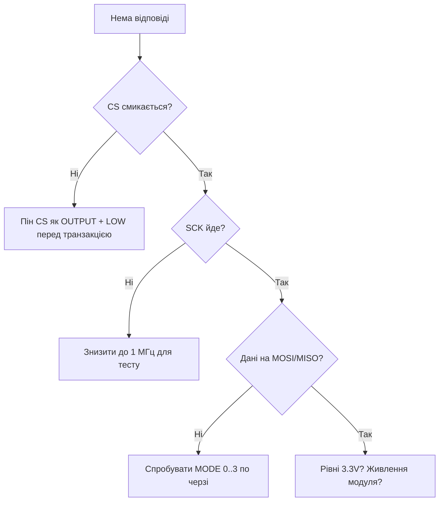

# SPI ESP32 - VSPI / HSPI


ESP32 має 4× SPI: SPI0/SPI1 зайняті flash, користувачу - **HSPI + VSPI**. Частота до 80 МГц (практика - 20-40 МГц).

> [!danger] QSPI flash зайнятий
> GPIO6-11 - flash. Ніколи не використовуй як звичайні GPIO/SPI.

## Призначення

SPI ESP32 - VSPI / HSPI - Піни за замовчуванням; SD + дисплей на одній шині; Код - два пристрої VSPI. ESP32 має 4× SPI: SPI0/SPI1 зайняті flash, користувачу - HSPI + VSPI. Частота до 80 МГц (практика - 20-40 МГц). GPIO6-11 - flash. Ніколи не використовуй як звичайні GPIO/SPI.

## Піни за замовчуванням

| Шина | CLK | MISO | MOSI | CS | Примітка |
| --- | --- | --- | --- | --- | --- |
| VSPI | 18 | 19 | 23 | 5 | основна, бери першою |
| HSPI | 14 | 12 | 13 | 15 | друга; 12/15 - strapping, обережно |

Через matrix можна перемапити, але для 40 МГц+ краще дефолтні (IO MUX швидший).

## SD + дисплей на одній шині

| ESP32 VSPI | SD-модуль | TFT дисплей | Примітка |
| --- | --- | --- | --- |
| GPIO18 CLK | CLK | SCK | спільний |
| GPIO19 MISO | MISO | (MISO опц.) | спільний |
| GPIO23 MOSI | MOSI | MOSI | спільний |
| GPIO5 | CS_SD | - | окремий CS! |
| GPIO15 | - | CS_TFT | окремий CS! |
| GPIO2 | - | DC | data/command |
| GND/3V3 | живлення | живлення + LED | спільні |

> [!tip] Різні CS = різні пристрої
> SCK/MOSI/MISO спільні, **CS окремий на пристрій**. Перед інітом підтягни обидва CS HIGH, інакше конфлікт.

## Код - два пристрої VSPI

**Arduino:**

```cpp
#include <SPI.h>
#include <SD.h>
#define CS_SD 5
#define CS_TFT 15
void setup() {
  pinMode(CS_SD, OUTPUT); digitalWrite(CS_SD, HIGH);
  pinMode(CS_TFT, OUTPUT); digitalWrite(CS_TFT, HIGH);
  SPI.begin(18, 19, 23, CS_SD);
  SD.begin(CS_SD, SPI, 20000000);
}
void loop() {}
```

**ESP-IDF:**

```c
#include "driver/spi_master.h"
void app_main(void) {
    spi_bus_config_t bus = {.mosi_io_num=23,.miso_io_num=19,.sclk_io_num=18,.max_transfer_sz=4096};
    spi_bus_initialize(SPI2_HOST, &bus, SPI_DMA_CH_AUTO);
    spi_device_interface_config_t sd = {.clock_speed_hz=20*1000*1000,.spics_io_num=5,.queue_size=4};
    spi_device_handle_t h; spi_bus_add_device(SPI2_HOST, &sd, &h);
}
```

**MicroPython:**

```python
from machine import SPI, Pin
import sdcard, os
spi = SPI(2, baudrate=20000000, sck=Pin(18), mosi=Pin(23), miso=Pin(19))
cs = Pin(5, Pin.OUT, value=1)
sd = sdcard.SDCard(spi, cs)
os.mount(sd, "/sd")
print(os.listdir("/sd"))
```

## Режими 0-3 - таймінги

Режим задає полярність клока (CPOL) і фазу вибірки (CPHA). Невірний режим = зсунуті біти / сміття:

| Режим | CPOL | CPHA | Клок idle | Вибірка | Типові чіпи |
| --- | --- | --- | --- | --- | --- |
| Mode 0 | 0 | 0 | LOW | по rising edge | SD-карти, MAX7219, MCP3008, більшість TFT |
| Mode 1 | 0 | 1 | LOW | по falling edge | деякі АЦП (ADS7866), радіомодулі |
| Mode 2 | 1 | 0 | HIGH | по falling edge | рідкість (деякі FRAM) |
| Mode 3 | 1 | 1 | HIGH | по rising edge | LoRa SX127x, NRF24L01, W5500 |

```text
Mode 0: CLK ___|‾|_|‾|_|‾|___  MOSI стабільні до rising, читаються на rising
Mode 3: CLK ‾‾‾|_|‾|_|‾|_|‾‾‾  те саме, але idle HIGH
```

Налаштування:

```cpp
// Arduino: різні пристрої — різні налаштування, перемикай транзакціями!
SPISettings sdSet(20000000, MSBFIRST, SPI_MODE0);
SPISettings loraSet(8000000, MSBFIRST, SPI_MODE0);
SPISettings nrfSet(8000000, MSBFIRST, SPI_MODE0);
SPI.beginTransaction(sdSet);
// ... transfer ...
SPI.endTransaction();
```

```c
// ESP-IDF: режим на пристрій
spi_device_interface_config_t dev = {
    .clock_speed_hz = 20*1000*1000,
    .mode = 0,  // 0..3
    .spics_io_num = 5,
    .queue_size = 4,
};
```

> [!danger] Змішані режими на одній шині
> Без `beginTransaction/endTransaction` з правильним `SPISettings` перед кожним CS - перший пристрій «отруїть» налаштування для другого. Класика: TFT працює, SD - ні.

## Half-duplex vs full-duplex

| Режим | Лінії | Пропускна | Коли |
| --- | --- | --- | --- |
| Full-duplex (4-wire) | SCK + MOSI + MISO | обмін одночасно | SD, дисплеї з читанням, NRF24 |
| Half-duplex (3-wire) | SCK + MOSI/MISO спільна | по черзі | LED-стрічки (тільки MOSI), однопровідні датчики |
| Write-only | SCK + MOSI | - | WS2812 через SPI, 74HC595, MAX7219 |

ESP-IDF half-duplex (DIO/QIO для flash-подібних, дисплеї):

```c
spi_device_interface_config_t dev = {
    .clock_speed_hz = 40*1000*1000,
    .mode = 0,
    .spics_io_num = 15,
    .queue_size = 4,
    .flags = SPI_DEVICE_HALFDUPLEX,  // MISO+MOSI об'єднані
};
spi_transaction_t t = {
    .flags = SPI_TRANS_USE_TXDATA,
    .length = 8,  // біт!
    .tx_data = {0x2C},  // команда TFT Memory Write
};
spi_device_transmit(h, &t);
```

## DMA-транзакції

Без DMA кожен байт ганяє CPU; з DMA - кадр 320×240 летить фоном:

| Підхід | CPU-навантаження | Макс. кадр | Коли |
| --- | --- | --- | --- |
| Polling `transfer()` | 100% на час | байти | ініціалізація, регістри |
| Переривання + queue | низьке | 4 КБ (default `max_transfer_sz`) | сенсори, SD-блоки |
| DMA + великий буфер | ~0% | 64 КБ+ (`max_transfer_sz=65536`) | TFT-кадри, камера |

```c
// Шина з великим DMA-буфером для дисплея:
spi_bus_config_t bus = {
    .mosi_io_num = 23, .miso_io_num = 19, .sclk_io_num = 18,
    .quadwp_io_num = -1, .quadhd_io_num = -1,
    .max_transfer_sz = 320 * 240 * 2,  // повний кадр RGB565
};
spi_bus_initialize(SPI2_HOST, &bus, SPI_DMA_CH_AUTO);

// Асинхронно: поставив у чергу — пішов готувати наступний кадр
spi_transaction_t t = {.length = 320*240*16, .tx_buffer = framebuf};
spi_device_queue_trans(h, &t, portMAX_DELAY);
// ... інша робота ...
spi_transaction_t *r;
spi_device_get_trans_result(h, &r, portMAX_DELAY);
```

> [!warning] DMA і пам'ять
> DMA-буфер має бути в **внутрішньому RAM** (не PSRAM!) або з `MALLOC_CAP_DMA`. Кадр у PSRAM без копіювання - `SPI_ERR` / мовчазне сміття. Див. [06-Flash-PSRAM](../../../ESP32-Reference/01-Hardware/06-Flash-PSRAM.md).

## CS-каскад + дешифратор 74HC138

GPIO мало? 3 піни → 8 CS через дешифратор:

| 74HC138 | ESP32 | Призначення |
| --- | --- | --- |
| A0/A1/A2 | GPIO25/26/27 | адреса пристрою 0-7 |
| E1,E2 → GND; E3 → 3V3 | живлення | ввімкнення дешифратора |
| Y0-Y7 | CS_SD, CS_TFT, CS_LoRa… | активний LOW, прямий CS! |
| - | окремий GPIO → E3 | опційно: загальний disable |

```text
ESP32 GPIO25/26/27 ---> A0/A1/A2 74HC138
                        Y0 --> CS_SD    Y1 --> CS_TFT
                        Y2 --> CS_NRF   Y3 --> CS_W5500 ...
```

```cpp
void cs138(uint8_t addr) {
  digitalWrite(25, addr & 1);
  digitalWrite(26, addr & 2);
  digitalWrite(27, addr & 4);
  delayMicroseconds(1);  // t_pd дешифратора ~10 нс, запас
}
```

> [!tip] Швидкість vs складність
> До 3-4 пристроїв - окремі GPIO простіше і швидше (без overhead адреси). 74HC138 виправданий від 5+ пристроїв або коли GPIO в дефіциті (S3 з USB + PSRAM).

Каскадний варіант без мікросхеми - «CS-ланцюг»: тримай всі CS HIGH в idle, опускай тільки один. Обов'язковий pull-up 10к на кожному CS, інакше при reset шина плаває і SD/TFT ловлять фантомні команди.

## Швидкість vs довжина шлейфа

| Довжина | Макс. стабільна | Коментар |
| --- | --- | --- |
| <5 см (плата/модуль поруч) | 40-80 МГц | тільки короткі траси, дефолтні піни IO MUX |
| 5-15 см (DuPont) | 10-20 МГц | стандарт макетки; вище - дзвін і CRC-помилки SD |
| 15-30 см | 4-8 МГц | кручена пара SCK+GND, series-R 33-47 Ом на SCK |
| >30 см | ≤4 МГц або переходь на [RS485](../../../ESP32-Reference/04-Shini/05-CAN-TWAI-RS485.md)/I2C-extender | SPI не для довгих ліній |

Практика розгону:

1. Почни з 4 МГц → переконайся, що протокол вірний.
2. Піднімай вдвічі (8 → 10 → 20 → 40), на кожному кроці - стрес-тест 1000 читань/записів.
3. При помилках: вкороти шлейф → додай 33 Ом на SCK → знизь на сходинку.
4. Через GPIO Matrix (не дефолтні піни) стеля нижча на ~30%.

```cpp
// Автотест стабільності SD на частоті f:
bool sd_test(uint32_t f) {
  SPI.begin(18, 19, 23, 5);
  if (!SD.begin(5, SPI, f)) return false;
  File f1 = SD.open("/t.bin", FILE_WRITE);
  for (int i = 0; i < 256; i++) f1.write(i & 0xFF);
  f1.close();
  File f2 = SD.open("/t.bin");
  for (int i = 0; i < 256; i++) if (f2.read() != (i & 0xFF)) return false;
  return true;
}
```

## Octal-SPI / PSRAM-конфлікти шин

На S3/P4 з Octal-PSRAM/Flash шина розширюється до 8 ліній - і починає їсти піни та пропускну здатність кешу.

| Режим flash/PSRAM | Ліній даних | Піни, що зайняті | Наслідок для користувача |
| --- | --- | --- | --- |
| Quad SPI flash (Classic) | 4 (GPIO6-11) | 6 пінів + HD/WP | HSPI/VSPI вільні повністю |
| Quad PSRAM (WROVER) | 4 спільні з flash | ті ж + CS PSRAM | кеш-арбітраж: SPI-транзакції гальмують при PSRAM-доступі |
| Octal flash (S3R16, P4) | 8 | +GPIO33-37 (S3) / виділені OPI-піни (P4) | ці GPIO недоступні взагалі |
| Octal PSRAM (S3R8/R16, P4) | 8 спільні з flash | ті ж | довгі DMA-транзакції з PSRAM-буфера - тільки з копією в DMA-RAM |

Правила співіснування:

1. **Ніколи не вішай периферію на OPI-піни.** На S3 з Octal-PSRAM це GPIO33-37 + стандартні 6-11 + CS. Див. [06-Flash-PSRAM](../../../ESP32-Reference/01-Hardware/06-Flash-PSRAM.md) і пінмап своєї плати (WROOM vs WROVER vs S3R8 - різні!).
2. **DMA-буфер у PSRAM = копія.** GP-SPI DMA читає тільки внутрішній RAM (`MALLOC_CAP_DMA`). Кадр у PSRAM: `memcpy` у DMA-буфер → `spi_device_queue_trans` → наступний кадр готується паралельно (подвійна буферизація).
3. **Кеш-конфлікт:** під час великої SPI-DMA-передачі з flash-читанням одночасно (OTA + дисплей) - джитер. Лікування: `spi_device_acquire_bus()` на час критичної серії + пріоритет task.
4. **Частота SPI vs OPI:** розгін користувацького VSPI до 80 МГц разом з Octal-PSRAM на 80 МГц - просідання живлення + перехресні завади. Тримай користувацьку шину ≤40 МГц, якщо OPI активна.

```c
// Подвійна буферизація TFT-кадру з PSRAM-джерела:
#include "driver/spi_master.h"
#include "esp_heap_caps.h"
#define W 320
#define H 240
static uint16_t *dma_buf[2];  // DMA-capable!
void tft_init_dma(void) {
  for (int i = 0; i < 2; i++)
    dma_buf[i] = heap_caps_malloc(W * 2 * 20, MALLOC_CAP_DMA);  // смуга 20 рядків
}
// У циклі: копіюй смугу з PSRAM-кадру в dma_buf[i] → queue_trans → чекай результат іншого буфера.
```

## DMA scatter-gather - довгі передачі без суцільного буфера

ESP32-S3/P4 GDMA вміє **scatter-gather**: ланцюжок дескрипторів, кожен вказує на свій шматок пам'яті. Драйвер SPI ховає це всередині `max_transfer_sz`, але розуміння рятує при оптимізації.

| Поняття | Що це | Практичний сенс |
| --- | --- | --- |
| Дескриптор | вказівник + довжина + next | один елемент ланцюжка DMA |
| `max_transfer_sz` | ліміт однієї транзакції | розмір = найдовша атомарна передача (кадр!) |
| GDMA linked list setup | ~2 мкс на транзакцію | дрібні транзакції (1-8 байт) вигідніше polling без DMA |
| Вирівнювання | 32-біт + кратність 4 байтам | невирівняний RX-буфер = тихе перезаписування сусідніх байтів! |

Коли дробити, коли зливати:

| Паттерн | Рекомендація | Чому |
| --- | --- | --- |
| Регістрові записи (1-4 байти, сотні штук при ініті дисплея) | polling, `SPI_TRANS_USE_TXDATA`, без DMA | overhead черги 25-28 мкс вбиває вигоду DMA |
| Кадр 320×240×2 = 153 КБ | 2-8 транзакцій по смугах + queue (конвеєр) | паралельно готуєш наступну смугу |
| SD-блок 512 Б | interrupt + DMA, queue_size 4 | класичний баланс |
| Потік камери в PSRAM | DMA + `MALLOC_CAP_SPIRAM` джерело → копія в DMA-RAM смугами | прямо з PSRAM - `ESP_ERR_INVALID_ARG` або сміття |

```c
// Конвеєр смуг: поки DMA жене смугу N, CPU готує N+1
spi_transaction_t t[2] = {0};
for (int i = 0; i < 2; i++) {
  t[i].length = W * 20 * 16;  // біт!
  t[i].tx_buffer = dma_buf[i];
}
int cur = 0;
for (int stripe = 0; stripe < STRIPES; stripe++) {
  render_stripe_to(dma_buf[cur]);                       // CPU
  spi_device_queue_trans(h, &t[cur], portMAX_DELAY);    // DMA старт
  if (stripe > 0) {
    spi_transaction_t *r;
    spi_device_get_trans_result(h, &r, portMAX_DELAY);  // забрати попередню
  }
  cur ^= 1;
}
```

> [!warning] Half-duplex + DMA + Read&Write одночасно - не підтримується (Known Issue IDF)
> Обхід: або full-duplex, або розбий на дві транзакції (write-команда → read-дані), або `SPI_DEVICE_NO_DUMMY` + polling для коротких. Перевірено на W5500/SX127x драйверах.

## Логічний аналізатор: як читати захоплення SPI

Налаштування захоплення: семпл-рейт мінімум **4× SCK** (для 10 МГц SCK - 40 МГц+ семплів, для 40 МГц - тільки аналоговий осцилограф або Saleae Pro 500 МГц).

| Що бачиш | Що означає | Дія |
| --- | --- | --- |
| CS падає, клоків немає | слейв не вибраний / CS не той пін | перевір `spics_io_num` + pull-up 10к |
| Клок є, MOSI плоска | `tx_buffer=NULL` без `TXDATA` / DMA-буфер у PSRAM | перевір буфер + прапорці транзакції |
| MISO плоска HIGH/LOW | слейв мовчить: не той Mode / не встиг прокинутись після CS | CS-setup delay + перевірка Mode 0-3 |
| Біти зсунуті на пів такту | не той Mode (CPHA) | перебери 0→3, дивись перший байт ID-регістра |
| Перший байт ок, далі сміття | швидкість зависока для шлейфа / потрібен dummy | знизь вдвічі, додай series-R 33 Ом |
| CS дрижить (короткі сплески) | два драйвери смикають CS / немає `acquire_bus` | м'ютекс + один власник шини |
| Пакети рвуться посередині | WDT/високопріоритетне переривання ріже `transmit` | queue + окремий task, див. [FreeRTOS патерни](../../../ESP32-Reference/09-Proshivka/06-FreeRTOS-Patterns.md) |

Читання Mode з захоплення (без документації на чіп!):

```text
1. Знайди falling CS. 2. Подивись idle SCK до першого фронту:
   idle LOW → Mode 0 або 1; idle HIGH → Mode 2 або 3.
3. Подивись, коли MOSI змінюється відносно SCK:
   MOSI стабільна ДО rising + міняється ПІСЛЯ rising → вибірка на rising.
   idle LOW + вибірка rising = Mode 0. idle HIGH + вибірка rising = Mode 3.
4. Звір перший прочитаний байт з очікуваним ID (напр. 0xEF для W25Q, 0x22 для NRF).
```

Декодер Saleae: додай аналізатор SPI → вкажи SCK/MOSI/MISO/CS + Mode + MSB-first. Для QSPI додай IO2/IO3. Збережи пресет під кожен пристрій шини окремо.

## Довжина шлейфа vs МГц - таблиця вимірів

Заміри на DuPont-макетці (VSPI, Mode 0, SD-карта + TFT, критерій - 1000 циклів читання/запису без CRC-помилки):

| Довжина шлейфа | Топологія | 4 МГц | 8 МГц | 10 МГц | 20 МГц | 40 МГц |
| --- | --- | --- | --- | --- | --- | --- |
| 3 см (плата) | траси PCB | ок | ок | ок | ок | ок (IO MUX!) |
| 7 см (короткі DuPont) | окремі дроти | ок | ок | ок | ок | помилки |
| 10 см (стандартні DuPont) | шлейф 4 жили | ок | ок | ок | **межа** | ні |
| 20 см | шлейф + GND поруч | ок | ок | межа | ні | ні |
| 20 см | шлейф + series-R 33 Ом на SCK | ок | ок | ок | межа | ні |
| 30 см | кручена пара SCK+GND | ок | межа | ні | ні | ні |
| 50 см+ | будь-що | межа | ні | ні | ні | ні |

Лікування по сходинках (дешеве → дороге):

1. Знизь частоту на сходинку (безкоштовно, 30 секунд).
2. Series-R 33-47 Ом на SCK біля майстра (гасить дзвін).
3. Окремий GND-дріт поруч з кожним сигналом (замість спільної «коси»).
4. Кручена пара SCK+GND, MOSI+GND (для 15-30 см).
5. Перехід на диференціальну шину ([RS485](../../../ESP32-Reference/04-Shini/05-CAN-TWAI-RS485.md)/Ethernet) або перенос MCU ближче.

> [!tip] GPIO Matrix з'їдає ~30% стелі
> Ті ж 10 см на дефолтних пінах (IO MUX) тримають 20 МГц, а на перемаплених (Matrix) - тільки 10-12 МГц. Для 40 МГц+ - тільки дефолтні піни + короткі траси. Це зафіксовано в IDF: Matrix-додаткова затримка ~25 нс.

## QSPI flash - поділ шини з користувачем

SPI0/SPI1 (GPIO6-11) - святе: flash + кеш CPU. Користувацький доступ - тільки через винятковий сценарій з `spi_bus_initialize(SPI1_HOST)` + IRAM + вимкнений кеш (див. приклад `hd_eeprom`). На практиці:

| Питання | Відповідь |
| --- | --- |
| Чи можна підчепити датчик на GPIO6-11? | **Ні.** Це flash. Плата перестане бутитись. |
| Чи можна читати flash безпосередньо SPI-командами? | Через `esp_flash_*` / `esp_partition_*` API - так; сирими транзакціями на SPI1 - тільки з розумінням кешу |
| PSRAM на тій самій SPI1 - чи заважає дисплею на VSPI? | Не шиною, але живленням і пріоритетом GDMA - так, при одночасному OTA + рендері |
| Потрібен 3-й SPI? | S3/P4 мають SPI3 (FSPI/GPSPI2): бери його для другої периферії замість битви за VSPI |

Розподіл пристроїв по шинах (рекомендовано):

| Шина | Пристрої | Чому |
| --- | --- | --- |
| VSPI (SPI2) | SD-карта + TFT (спільна, різні CS) | швидка, DMA, дефолтні піни |
| HSPI/SPI3 | LoRa / NRF24 / W5500 / АЦП | повільніші, окремі транзакції, не смикають дисплей |
| SPI1 | тільки flash/PSRAM, руками не лізти | кеш CPU |

| Потрібен 3-й SPI? | S3/P4 мають SPI3 (FSPI/GPSPI2): бери його для другої периферії замість битви за VSPI |
| CSsetup/hold на швидкості 40 МГц+ | `cs_ena_pretrans/posttrans` + `input_delay_ns` з виміру аналізатором | запас фази клока |

> [!tip] Золоте правило CS-паузи
> Після CS-falling чекай t_setup слейва (з datasheet, тип. 50-200 нс) перед першим клоком: `cs_ena_pretrans = 1` цикл. Без паузи перший байт ID читається битим саме на 20 МГц+, а на 4 МГц «все працює» - класична пастка. Див. [I2C](../../../ESP32-Reference/04-Shini/03-I2C.md) для аналогічних setup-вимог.

## Офіційні джерела Espressif

- ESP-IDF Programming Guide - SPI Master Driver (spi_bus_initialize, spi_bus_add_device, spi_device_queue_trans, polling vs interrupt, bus acquiring, GPIO Matrix vs IO_MUX, timing/input_delay_ns, known issues half-duplex+DMA).
- ESP32 / S3 / P4 Technical Reference Manual - глава SPI Controller: фази Command/Address/Dummy/Write/Read, quad/octal line modes, dummy-bit workaround.
- ESP-IDF examples: peripherals/spi_master/lcd (DMA + D/C hook), peripherals/spi_master/hd_eeprom (SPI1 + IRAM + кеш).
- ESP Hardware Design Guidelines - розводка SPI: довжини трас, series-R, перехресні завади з OPI.
- ADS7866 Datasheet (TI): <https://www.ti.com/product/ADS7866> - швидкий SAR АЦП, приклад Mode 1.

### Mermaid: SPI не відповідає



## Типові помилки

| # | Помилка | Чому погано | Як правильно |
| --- | --- | --- | --- |
| 1 | CS не керують (висить) | Шина зайнята/конфлікт | CS OUTPUT, HIGH в idle |
| 2 | 40 МГц з коробки | Дзвін на довгих дротах | Старт з 1 МГц, піднімати поступово |
| 3 | Невірний MODE | Зсув бітів | Даташит: CPOL/CPHA пари |
| 4 | MISO без pull-up (SD!) | Плаває при неактивній карті | Pull-up 10-50к на MISO |
| 5 | Два SPI-пристрої, один CS | Обидва відповідають | Окремий CS на кожен |

## Див. також

- [Home](../../../ESP32-Reference/Home.md)
- [01-ESP32-Classic](../../../ESP32-Reference/01-Hardware/01-ESP32-Classic.md)
- [07-SD-SDIO](../../../ESP32-Reference/04-Shini/07-SD-SDIO.md)
- [TFT дисплеї](../../../ESP32-Reference/11-Vivid/02-TFT-LCD-Epaper.md)
- [I2C](../../../ESP32-Reference/04-Shini/03-I2C.md)
- [Strapping-піни](../../../ESP32-Reference/03-GPIO/02-Strapping-pini.md)
- [GPIO огляд](../../../ESP32-Reference/03-GPIO/01-GPIO-oglyad.md)
