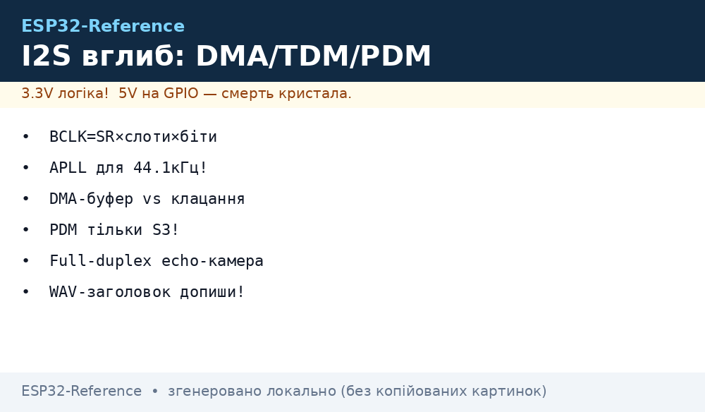
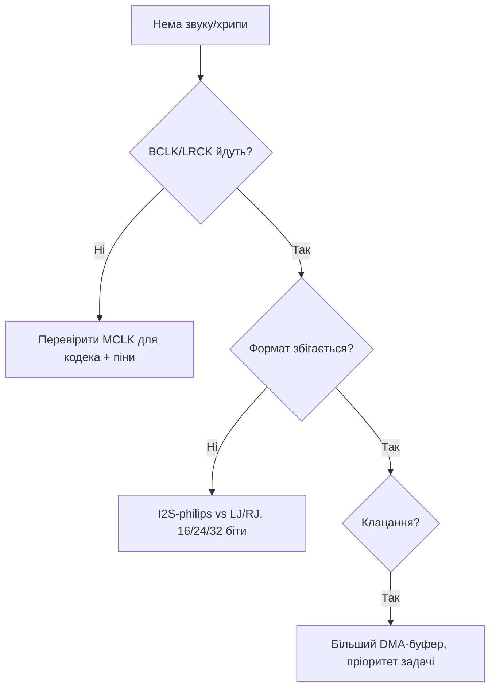

# I2S - звук ESP32



I2S - цифровий аудіоінтерфейс: **BCK (бітклок) + WS (вибір каналу) + DOUT/DIN (дані)**. Зв'язка: мікрофон INMP441 (вхід) + MAX98357A (вихід на динамік) - без кодеків і ЦАП.

> [!info] Чому I2S, а не ADC?
> MEMS-мікрофони дають вже цифровий 24-біт потік 16-48 кГц. Через [ADC](../../../ESP32-Reference/06-Analog/01-ADC.md) отримаєш шуми WiFi, через I2S - чисто.

## Призначення

I2S - звук ESP32 - Таблиця сигналів; Таблиця з'єднань; Режими I2S: Philips / MSB / LSB / PCM / TDM / PDM. I2S - цифровий аудіоінтерфейс: BCK (бітклок) + WS (вибір каналу) + DOUT/DIN (дані). Зв'язка: мікрофон INMP441 (вхід) + MAX98357A (вихід на динамік) - без кодеків і ЦАП. MEMS-мікрофони дають вже цифровий 24-біт потік 16-48 кГц. Через [ADC](../../../ESP32-Reference/06-Analog/01-ADC.md) отримаєш шуми WiFi, через I2S - чисто.

## Таблиця сигналів

| Сигнал | Напрям | Частота | Призначення |
| --- | --- | --- | --- |
| BCK | ESP→модулі | 1-3 МГц | тактування бітів |
| WS (LRCK) | ESP→модулі | 16-48 кГц | L/R канал |
| DOUT (MIC) | MIC→ESP | - | дані з мікрофона |
| DIN (AMP) | ESP→AMP | - | дані на динамік |

## Таблиця з'єднань

| ESP32 | INMP441 MIC | MAX98357A AMP | Примітка |
| --- | --- | --- | --- |
| GPIO14 | - | BCLK | BCK спільний |
| GPIO15 | - | LRC | WS спільний |
| GPIO32 | SD | - | дані MIC→ESP |
| GPIO22 | - | DIN | дані ESP→AMP |
| GPIO21 | WS | - | WS мікрофона |
| GPIO19 | SCK | - | BCK мікрофона |
| 3V3 / GND | VDD/GND, L/R→GND | VIN/GND, GAIN | L/R на GND = лівий канал |

> [!warning] Живлення динаміка
> MAX98357A + 4 Ом динамік на максимумі бере 1А+ піками. Живи підсилювач від **окремих 5В**, GND спільний з ESP.

## Код

**Arduino (запис + відтворення тон):**

```cpp
#include "driver/i2s.h"
#define I2S_MIC I2S_NUM_0
#define I2S_SPK I2S_NUM_1
void setup() {
  i2s_config_t c = {.mode=(i2s_mode_t)(I2S_MODE_MASTER|I2S_MODE_RX),.sample_rate=16000,.bits_per_sample=I2S_BITS_PER_SAMPLE_32BIT,.channel_format=I2S_CHANNEL_FMT_ONLY_LEFT,.communication_format=I2S_COMM_FORMAT_I2S,.intr_alloc_flags=0,.dma_buf_count=4,.dma_buf_len=256,.use_apll=false};
  i2s_pin_config_t p = {.bck_io_num=19,.ws_io_num=21,.data_out_num=-1,.data_in_num=32};
  i2s_driver_install(I2S_MIC, &c, 0, NULL);
  i2s_set_pin(I2S_MIC, &p);
}
void loop() {}
```

**ESP-IDF:** як вище + `i2s_read()` для MIC і окремий TX-драйвер для MAX98357A з `i2s_write()`.

**MicroPython:**

```python
from machine import I2S, Pin
mic = I2S(0, sck=Pin(19), ws=Pin(21), sd=Pin(32),
          mode=I2S.RX, bits=16, format=I2S.MONO, rate=16000, ibuf=4096)
buf = bytearray(2048)
n = mic.readinto(buf)
print("read", n)
```

## 1. Режими I2S: Philips / MSB / LSB / PCM / TDM / PDM

ESP-IDF v5 (`i2s_std`, `i2s_tdm`, `i2s_pdm`) ділить режими на три драйвери. Старий `driver/i2s.h` (legacy) - deprecated, не використовуй у нових проєктах.

### 1.1. Стандартні формати слота (2 канали, L/R)

| Формат | Макрос ESP-IDF | WS | Зсув даних | Коли треба |
| --- | --- | --- | --- | --- |
| Philips (I2S) | `I2S_STD_PHILIPS_SLOT_DEFAULT_CONFIG` | 50% меандр, f = sample_rate | дані зсунуті на **1 BCLK** від фронту WS | INMP441, MAX98357A, PCM5102 - 95% модулів |
| MSB (left-justified) | `I2S_STD_MSB_SLOT_DEFAULT_CONFIG` | 50% меандр | **без зсуву**, MSB одразу по фронту WS | SPH0645, деякі ЦАП |
| LSB (right-justified) | ручна конфігурація `slot_bit_width` + `ws_width` | 50% | дані притиснуті до **кінця** слота | рідкісні кодеки (TDA1543) |
| PCM short-frame | `I2S_STD_PCM_SLOT_DEFAULT_CONFIG` | імпульс **1 BCLK** на початку фрейма | зсув 1 BCLK | DSP-кодеки, телефонні чіпи |

Правило: якщо мікрофон мовчить або шипить, а тактування є - у 8 з 10 випадків **не той формат**. INMP441 = Philips, SPH0645 = MSB. Перемикання формату - одна строка в `slot_cfg`.

### 1.2. TDM - 8+ каналів по 2 дротах

TDM (Time-Division Multiplexing) - N слотів в одному WS-фреймі. На ESP32-S3 (`i2s_tdm`, I2S0/I2S1) - до **16 слотів**, на classic ESP32 - TDM **немає** (тільки STD/PDM).

| Параметр | Значення S3 | Коментар |
| --- | --- | --- |
| Слотів у фреймі | 2-16 (`I2S_TDM_SLOT0 \| SLOT1 \| ...`) | маска в `i2s_tdm_slot_config_t::slot_mask` |
| Бітів на слот | 8/16/24/32 | усі слоти однакові |
| Формати | Philips / MSB / PCM-short / **PCM-long** | PCM-long: WS = ширина 1 слота |
| Обмеження HW | 32 біт × 4 слоти макс; 16 біт × 8; 8 біт × 16 | добуток ≤ 512 біт/фрейм |

Типове застосування: каскад MEMS-мікрофонів (4× ICS-43434 через TDM-спліттер), кодек ES7210 (4 мікрофони в TDM4), багатоканальний запис конференції.

```c
// ESP-IDF v5: TDM4 RX, 16 біт, 16 кГц
i2s_tdm_config_t tdm = {
  .clk_cfg  = I2S_TDM_CLK_DEFAULT_CONFIG(16000),
  .slot_cfg = I2S_TDM_MSB_SLOT_DEFAULT_CONFIG(
      I2S_DATA_BIT_WIDTH_16BIT, I2S_SLOT_MODE_STEREO,
      I2S_TDM_SLOT0 | I2S_TDM_SLOT1 | I2S_TDM_SLOT2 | I2S_TDM_SLOT3),
  .gpio_cfg = {.mclk=I2S_GPIO_UNUSED,.bclk=GPIO_NUM_4,.ws=GPIO_NUM_5,
               .dout=I2S_GPIO_UNUSED,.din=GPIO_NUM_19},
};
i2s_channel_init_tdm_mode(rx_handle, &tdm);
```

### 1.3. PDM-мікрофони: НЕ через RMT

> [!danger] Часта помилка
> PDM - це **окремий режим I2S-периферії** (`i2s_pdm`, 2 піни: CLK + DIN). НЕ RMT, НЕ PCNT, НЕ бітбенг. RMT для PDM не має апаратного дециматора - отримаєш сирий 1-біт потік 1-3 МГц, який CPU не перетравить.

- PDM CLK: 1.024-6.144 МГц (типово 2.4 МГц для 16 кГц PCM після децимації ×64/×128).
- Конвертер **PDM→PCM апаратний тільки на I2S0** (ESP32 і S3). На I2S1 - тільки raw-PDM, потрібен програмний FIR-фільтр.
- ESP32-S3 PDM RX тримає до **4 ліній даних = 8 мікрофонів** (стерео-пара L/R на кожній лінії).
- PDM TX (PCM→PDM конвертер, теж тільки I2S0) - прямий привід динаміка через RC-фільтр без ЦАП.

```c
// PDM-мікрофон MP34DT01 / IM69D130 на S3, I2S0
i2s_pdm_rx_config_t pdm = {
  .clk_cfg  = I2S_PDM_RX_CLK_DEFAULT_CONFIG(16000),
  .slot_cfg = I2S_PDM_RX_SLOT_PCM_FMT_DEFAULT_CONFIG(I2S_DATA_BIT_WIDTH_16BIT, I2S_SLOT_MODE_MONO),
  .gpio_cfg = {.clk=GPIO_NUM_5, .din=GPIO_NUM_19},
};
i2s_channel_init_pdm_rx_mode(rx_handle, &pdm);
```

### 1.4. Тактування: BCLK / LRCK / MCLK і розрахунок частот

```text
sample_rate (Fs)  → LRCK/WS = Fs (16 / 44.1 / 48 кГц)
BCLK = Fs × бітів_на_слот × слотів_у_фреймі
MCLK = Fs × mclk_multiple (типово ×256)
```

Приклади:

| Режим | Fs | Слоти × біти | BCLK | MCLK (×256) |
| --- | --- | --- | --- | --- |
| INMP441 mono 16 кГц 32-біт слот | 16 кГц | 2 × 32 | 1.024 МГц | 4.096 МГц |
| MAX98357 stereo 44.1 кГц 16 біт | 44.1 кГц | 2 × 16 | 1.4112 МГц | 11.2896 МГц |
| TDM8 16 кГц 16 біт | 16 кГц | 8 × 16 | 2.048 МГц | 4.096 МГц |
| PCM5102 HiFi 48 кГц 32 біт | 48 кГц | 2 × 32 | 3.072 МГц | 12.288 МГц |

> [!warning] MCLK тільки з APLL - і не скрізь!
> MCLK потрібен **не всім**: INMP441 і MAX98357A працюють **без MCLK** (їм досить BCLK+WS). А от PCM5102 / UDA1334 / ES8388 вимагають MCLK 256×Fs. На **classic ESP32 MCLK виводиться тільки на GPIO0/1/3** (GPIO0 - strapping, обережно!). На S3 MCLK можна на будь-який GPIO через матрицю. Джерело точного MCLK - **APLL** (див. розділ 2). Без APLL джитер MCLK великий - HiFi-ЦАП шипітиме.

Для 24-біт слотів став `mclk_multiple = 384` (ділиться на 3), інакше WS попливе.

## 2. DMA: дескриптори, буфер vs затримка, APLL vs PLL_D2

### 2.1. Як їдуть дані

CPU семпли не копіює - працює GDMA: периферія → дескрипторний ланцюжок → кільце буферів → `i2s_channel_read/write`. Коли заповнився один DMA-буфер - переривання `I2S_IN_SUC_EOF` / `I2S_OUT_EOF`.

```text
dma_buffer_size = dma_frame_num × slot_num × slot_bit_width / 8  (≤ 4092 байт!)
interrupt_interval = dma_frame_num / sample_rate
```

### 2.2. Розмір буфера vs затримка vs клацання

| `dma_frame_num` | Інтервал при 16 кГц | Затримка (кільце 6 шт) | Поведінка |
| --- | --- | --- | --- |
| 120 | 7.5 мс | ~45 мс | мінімальна затримка, ризик underrun при WiFi |
| 240 | 15 мс | ~90 мс | золота середина для голосу |
| 480-511 | 30-32 мс | ~200 мс | стабільно, але echo-камера відчутна |

Правила:

1. `dma_buffer_size` **завжди ≤ 4092**. При 32 біт × стерео: `dma_frame_num ≤ 511`. При 24 біт - кратне 3!
2. `dma_desc_num` (кількість дескрипторів, типово 6-8) має покрити найдовший цикл опитування: `dma_desc_num > polling_cycle / interrupt_interval`.
3. Користувацький буфер `i2s_channel_read` має вмістити **все кільце**: `recv_size > dma_desc_num × dma_buffer_size`.
4. Клацання = **underrun TX** (не встиг подати дані) або **overrun RX** (не встиг забрати). Лікується: більші буфери + `i2s_channel_preload_data()` перед стартом + пріоритет задачі ≥ 5 + `CONFIG_I2S_ISR_IRAM_SAFE=y`.

### 2.3. APLL vs PLL_D2: чому 44.1 кГц «пливе»

- `PLL_D2` (160 МГц, за замовчуванням): дільник цілочисельний → 48 кГц / 16 кГц / 8 кГц **точні**, а 44.1 кГц дає **похибку ~1%**. Музика трохи «не в тоні», а головне - розсинхрон з Bluetooth A2DP і USB-аудіо.
- `APLL` (Audio PLL, тільки classic ESP32 і S3): частота програмована під Fs → **44.1 кГц точний**. Ціна: APLL один на чіп (конфлікт з Ethernet EMAC), блок `ESP_PM_NO_LIGHT_SLEEP` (немає light-sleep під час аудіо), трохи більший джитер при WiFi-активності.

```c
// Точні 44.1 кГц: APLL
i2s_std_clk_config_t clk = I2S_STD_CLK_DEFAULT_CONFIG(44100);
clk.clk_src = I2S_CLK_SRC_APLL;
clk.mclk_multiple = I2S_MCLK_MULTIPLE_256;
i2s_channel_reconfig_std_clock(tx_handle, &clk);
```

> [!tip] Евристика
> Голос 16 кГц, оповіщення, TinyML - залишай PLL_D2 (`use_apll=false`). Музика 44.1 кГц, HiFi через PCM5102 - вмикай APLL. Див. також [11-TinyML-Voice](../../../ESP32-Reference/12-Moduli-zvyazku/11-TinyML-Voice.md).

## 3. Full-duplex: запис + відтворення одночасно

### 3.1. I2S0 vs I2S1: куди що вішати

| Чіп | Портів | Full-duplex | Обмеження |
| --- | --- | --- | --- |
| ESP32 classic | 2 (I2S0, I2S1) | STD full-duplex на **одному** порті (TX+RX ділять BCLK/WS!) | PDM full-duplex **неможливий** (різні CLK). ADC/DAC-режим тільки I2S0 |
| ESP32-S2 | 1 (I2S0) | TX+RX на одному порту, незалежні GPIO | PDM/TDM немає |
| ESP32-S3 | 2 (I2S0, I2S1) | STD і **TDM** full-duplex; TX і RX - **різні** тактування і піни | PDM-конвертер тільки I2S0; MCLK-вихід один на порт |

Практика classic: дуплекс «мікрофон + динамік» роби на **одному** I2S0 (спільні BCLK/WS, різні DIN/DOUT). Другий порт залиш вільним або під дисплей. Розносити MIC на I2S0 і SPK на I2S1 у simplex - можна, але отримаєш два незалежні клоки і биття частот (див. помилку №9).

S3 навпаки: канали TX/RX повністю незалежні, можна різні Fs (наприклад RX 16 кГц мікрофон, TX 48 кГц музика).

### 3.2. Echo-камера і заготовка під AEC

Прямий loopback MIC→SPK без обробки дає **акустичний свист** (feedback) вже при підсиленні > 0.5. Мінімальний ланцюжок для голосового пристрою:

```text
MIC → high-pass 100 Гц (зняти DC) → AGC/лімітер → ×0.3–0.5 → SPK
```

Заготовка AEC (acoustic echo cancellation): чистий AEC на ESP32 без PSRAM важкий (потрібен адаптивний NLMS-фільтр 128-256 тапів), але мінімум, який реально працює:

1. Тримай копію TX-буфера (що пішло на динамік) із затримкою = акустична затримка кімнати (~10-30 мс).
2. Відніми її з RX з адаптивним коефіцієнтом (LMS-крок 0.01-0.05).
3. Додай VAD-гейт: поки сам говориш у динамік - придуши мікрофон на 12 дБ.

Для продакшн-AEC дивись бібліотеку Espressif `esp-aec` або кодек ES8388 з апаратним ехом. Див. [11-TinyML-Voice](../../../ESP32-Reference/12-Moduli-zvyazku/11-TinyML-Voice.md) і [A2DP](../../../ESP32-Reference/05-Radio/05-BLE-Mesh-A2DP-HID.md).

```c
// Full-duplex STD на одному порту (classic + S3 однаково)
i2s_chan_handle_t tx, rx;
i2s_chan_config_t cfg = I2S_CHANNEL_DEFAULT_CONFIG(I2S_NUM_0, I2S_ROLE_MASTER);
i2s_new_channel(&cfg, &tx, &rx);  // одна пара = дуплекс
i2s_std_config_t std = {
  .clk_cfg  = I2S_STD_CLK_DEFAULT_CONFIG(16000),
  .slot_cfg = I2S_STD_PHILIPS_SLOT_DEFAULT_CONFIG(I2S_DATA_BIT_WIDTH_16BIT, I2S_SLOT_MODE_STEREO),
  .gpio_cfg = {.mclk=I2S_GPIO_UNUSED,.bclk=GPIO_NUM_14,.ws=GPIO_NUM_15,
               .dout=GPIO_NUM_22,.din=GPIO_NUM_32},
};
i2s_channel_init_std_mode(tx, &std);
i2s_channel_init_std_mode(rx, &std);
i2s_channel_enable(tx);
i2s_channel_enable(rx);
```

## 4. Мікрофони: порівняння, DC-зсув, AGC

### 4.1. Порівняння MEMS-мікрофонів

| Мікрофон | Інтерфейс | Чутливість (1 кГц) | SNR | Особливість |
| --- | --- | --- | --- | --- |
| INMP441 | I2S Philips, 24 біт | −26 dBFS | 61 дБ | народний стандарт, L/R-пін, дешевий |
| SPH0645LM4H | I2S **MSB**, 18 біт | −26 dBFS | 65 дБ | гучніший низ, треба MSB-режим! |
| ICS-43434 | I2S Philips, 24 біт | −26 dBFS | 65 дБ | кращий НЧ-відгук, стабільна партія |
| IM69D130 | I2S / **PDM**, 24 біт | −36 dBFS | **69 дБ** | Hi-End, низький шум, режим PDM теж є |

Усі чотири живляться 3.3 В, споживають < 2 мА. Для вулиці/вітру додай поролонову насадку - MEMS свистить на вітрі.

Пін L/R (INMP441/ICS-43434): GND = лівий канал, VDD = правий. Два мікрофони на одну шину: один на GND, другий на VDD → стерео без другої шини.

### 4.2. Зсув DC + high-pass (обов'язково!)

Сирий потік з MEMS має **DC-зсув** (десятки-сотні LSB) + інфранизькочастотний дрейф. Без фільтра: WAV «лежить» не по нулях, RMS-метр бреше, AGC накачує тишу.

Однополюсний high-pass 80-120 Гц, цілочисельний (без float у перериванні):

```c
// y[n] = x[n] - x[n-1] + a*y[n-1], a ≈ 0.995 для 100 Гц при 16 кГц
static int32_t hp_x1 = 0, hp_y1 = 0;
int32_t hp_filter(int32_t x) {
  int32_t y = x - hp_x1 + (int32_t)(0.995f * hp_y1);
  hp_x1 = x; hp_y1 = y;
  return y;
}
// INMP441 дає 24 біт у 32-біт слові: valid = raw >> 8, знак розширити!
int32_t s = ((int32_t)raw >> 8);  // арифметичний зсув
s = hp_filter(s);
```

### 4.3. Програмний AGC (3-5 рядків, рятує запис)

```c
static float agc_gain = 1.0f;
void agc_process(int16_t *buf, int n) {
  int32_t peak = 0;
  for (int i = 0; i < n; i++) { int32_t a = abs(buf[i]); if (a > peak) peak = a; }
  float target = (peak > 0) ? (12000.0f / peak) : 1.0f;
  if (target > 8.0f) target = 8.0f;          // не качати шум тиші
  agc_gain += (target - agc_gain) * 0.05f;   // повільна атака/реліз
  for (int i = 0; i < n; i++) {
    int32_t v = (int32_t)(buf[i] * agc_gain);
    buf[i] = (v > 32767) ? 32767 : (v < -32768) ? -32768 : v;
  }
}
```

Атака 0.05/блок - без «пампінгу». Для мови додай noise gate: якщо RMS < порога тиші 3 блоки поспіль - gain заморожується.

## 5. Динаміки і ЦАП: MAX98357 / PCM5102 / UDA1334

### 5.1. Підключення

| Модуль | Тип | Живлення | MCLK? | Піни ESP → модуль |
| --- | --- | --- | --- | --- |
| MAX98357A | I2S-підсилювач 3 Вт, ЦАП всередині | 2.5-5.5 В (динамік окремо!) | **не треба** | BCLK, LRC, DIN + GAIN/SD |
| PCM5102 | HiFi-ЦАП 112 дБ, лінійний вихід | 3.3 В | **треба** (256×Fs, тільки APLL!) | BCLK, LRC, DIN, **MCLK/SCK**, FMT→GND (I2S) |
| UDA1334A | ЦАП + навушниковий підсилювач | 3.3 В | **треба** (SYSCLK) | BCLK, WCLK, DATA, SYSCLK |

> [!warning] MCLK-проблема
> PCM5102 без чистого MCLK або мовчить, або пищить на 3-8 кГц (PLL чіпа не захопив частоту). На classic ESP32 MCLK - тільки GPIO0/1/3, джерело - APLL. На S3 - будь-який пін. Перевірка осцилографом: MCLK має бути рівно 256×Fs (12.288 МГц при 48 кГц). Немає MCLK → для музики бери MAX98357A, йому MCLK не потрібен.

Спільна земля обов'язкова. Довжина I2S-шлейфа до динаміка - до 20 см без проблем; далі - екран або LVDS. Див. [Живлення](../../../ESP32-Reference/02-Zhivlennya/01-Lancjugi-zhivlennya.md).

### 5.2. Гучність: програмна vs GAIN-пін

MAX98357A має пін GAIN (фіксовані ступені 3/6/9/12/15 дБ через дільник до GND/VDD), плюс програмна гучність множенням семплів.

| Спосіб | Плюси | Мінуси |
| --- | --- | --- |
| GAIN-пін (резистор/дільник) | нуль спотворень, максимальний SNR | тільки 5 ступенів, треба паяти |
| Програмний `sample × k` (k 0-1) | плавна, з пульта/енкодера | втрата розрядності на тихому (16→12 біт ефективно), шум quantization |
| Комбінація (рекомендується) | GAIN=9 дБ апаратно + точна програмна 0-100% | трохи складніше |

```c
// Програмна гучність з дизерингом (менше «сходинок» на тихому)
static uint32_t dith = 22222;
int16_t vol_apply(int16_t s, float vol) {
  dith = dith * 1664525 + 1013904223;
  int32_t d = (int32_t)(dith >> 17) & 0xFF; d -= 128;  // ±64 LSB тріанг.
  int32_t v = (int32_t)(s * vol) + (d >> 3);
  if (v > 32767) v = 32767; if (v < -32768) v = -32768;
  return (int16_t)v;
}
```

Пін SD (shutdown) MAX98357 - глуши (`LOW`) при зміні треку/Fs, інакше бах у динаміку.

## 6. Код: WAV на SD, відтворення, loopback, VU-метр

> Зв'язка з картою: див. [SD-SDIO](../../../ESP32-Reference/04-Shini/07-SD-SDIO.md).

### 6.1. ESP-IDF v5: запис WAV на SD (з правильним заголовком!)

```c
#include "driver/i2s_std.h"
#include <stdio.h>

typedef struct __attribute__((packed)) {
  char riff[4]; uint32_t size; char wave[4]; char fmt[4];
  uint32_t fmt_len; uint16_t audio; uint16_t ch; uint32_t rate;
  uint32_t byte_rate; uint16_t align; uint16_t bits;
  char data[4]; uint32_t data_len;
} wav_hdr_t;

void wav_hdr_fill(wav_hdr_t *h, uint32_t rate, uint32_t samples) {
  memcpy(h->riff,"RIFF",4); memcpy(h->wave,"WAVE",4);
  memcpy(h->fmt,"fmt ",4);  memcpy(h->data,"data",4);
  h->fmt_len=16; h->audio=1; h->ch=1; h->rate=rate; h->bits=16;
  h->align=2; h->byte_rate=rate*2;
  h->data_len=samples*2; h->size=36+h->data_len;
}

// ... після i2s_channel_enable(rx):
FILE *f = fopen("/sdcard/rec.wav","wb");
wav_hdr_t h; wav_hdr_fill(&h, 16000, 0);
fwrite(&h, 1, sizeof h, f);          // плейсхолдер
size_t total = 0; int16_t buf[1024]; size_t n;
for (int i = 0; i < 500; i++) {      // ~16 с
  i2s_channel_read(rx, buf, sizeof buf, &n, portMAX_DELAY);
  // тут: high-pass + agc_process(buf, n/2)
  fwrite(buf, 1, n, f); total += n/2;
}
fseek(f, 0, SEEK_SET);               // дописати довжини!
wav_hdr_fill(&h, 16000, total);
fwrite(&h, 1, sizeof h, f);
fclose(f);
```

> [!danger] Без другого `fwrite` заголовка файл буде грати тільки в Audacity, а плеєр покаже 0:00. `data_len` і `size` - **після** запису.

### 6.2. ESP-IDF v5: відтворення WAV з SD по DMA

```c
FILE *f = fopen("/sdcard/music.wav","rb");
wav_hdr_t h; fread(&h, 1, sizeof h, f);   // перевірити h.audio==1, h.bits==16
// за потреби: i2s_channel_reconfig_std_clock(tx, &clk_44100);
uint8_t *dma = malloc(4096); size_t r, w;
while ((r = fread(dma, 1, 4096, f)) > 0) {
  // тут: vol_apply() по семплах
  i2s_channel_write(tx, dma, r, &w, portMAX_DELAY);
}
free(dma); fclose(f);
```

`i2s_channel_preload_data(tx, dma, 4096, &w)` перед `enable` - прибирає перше клацання.

### 6.3. Loopback-тест мікрофон → динамік (перевірка за 1 хвилину)

```c
// TX і RX вже в full-duplex (розділ 3.2)
int16_t io[512]; size_t n, w;
i2s_channel_preload_data(tx, io, 0, &w);  // тиша в чергу
while (1) {
  i2s_channel_read(rx, io, sizeof io, &n, portMAX_DELAY);
  for (int i = 0; i < (int)(n/2); i++) io[i] = io[i] / 3;  // ×0.33 проти свисту!
  i2s_channel_write(tx, io, n, &w, portMAX_DELAY);
}
```

Чуєш себе з затримкою ~100 мс - тракт живий. Свист - зменш дільник до /4 і рознеси мікрофон і динамік.

### 6.4. VU-метр: RMS-рівень сигналу

```c
#include <math.h>
float vu_rms_dbfs(const int16_t *b, int n) {
  double s = 0;
  for (int i = 0; i < n; i++) s += (double)b[i]*b[i];
  float rms = sqrt(s / n);
  return 20*log10f(rms / 32768.0f + 1e-9f);  // -96..0 dBFS
}
// Вивід: кожні 200 мс print смужку
// -60 тихо | -30 мова | -12 голосно | >-3 кліпінг!
```

Кліпінг-детектор: лічильник семплів `|x| > 31000`. Більше 10 поспіль - зменш AGC-стелю.

### 6.5. Arduino (новий драйвер `ESP_I2S.h`, core 3.x)

```cpp
#include <ESP_I2S.h>
I2SClass I2S;
void setup() {
  I2S.setPins(14, 15, 22, 32, -1);  // bclk, ws, dout, din, mclk(none)
  I2S.begin(I2S_MODE_STD, 16000, I2S_DATA_BIT_WIDTH_16BIT, I2S_SLOT_MODE_STEREO);
}
void loop() {
  uint8_t b[512];
  size_t n = I2S.readBytes((char*)b, sizeof b);
  I2S.write(b, n);
}
// Варіант через ESP8266Audio (MP3 з SD без ручного парсингу):
// #include "AudioFileSourceSD.h", "AudioGeneratorMP3.h", "AudioOutputI2S.h"
// AudioOutputI2S *out = new AudioOutputI2S(0, AudioOutputI2S::EXTERNAL_I2S);
// out->SetPinout(14, 15, 22);
```

### 6.6. MicroPython (`machine.I2S` - повний дуплекс і WAV)

```python
from machine import I2S, Pin, SDCard
import os, struct

# Дуплекс: один об'єкт TX + один RX
mic = I2S(0, sck=Pin(19), ws=Pin(21), sd=Pin(32),
          mode=I2S.RX, bits=16, format=I2S.MONO, rate=16000, ibuf=8192)
spk = I2S(1, sck=Pin(14), ws=Pin(15), sd=Pin(22),
          mode=I2S.TX, bits=16, format=I2S.MONO, rate=16000, ibuf=8192)

# VU-метр
import math
buf = bytearray(1024)
mic.readinto(buf)
s = sum(struct.unpack('<512h', buf)[i]**2 for i in range(512)) / 512
print('RMS dBFS:', 20*math.log10(math.sqrt(s)/32768 + 1e-9))

# Запис WAV 5 с на SD
sd = SDCard(slot=2); os.mount(sd, '/sd')
raw = bytearray(16000*2*5)
mic.readinto(raw)
with open('/sd/rec.wav','wb') as f:
    f.write(struct.pack('<4sI4s4sIHHIIHH4sI',
      b'RIFF', 36+len(raw), b'WAVE', b'fmt ', 16, 1, 1, 16000, 32000, 2, 16,
      b'data', len(raw)))
    f.write(raw)
```

Обмеження MicroPython: TDM і PDM-RAW не підтримуються, тільки STD MONO/STEREO 16 біт. Для MP3 - тільки через зовнішній декодер або ESP-IDF.

## 7. Типові помилки (12+)

| № | Симптом | Причина | Лікування |
| --- | --- | --- | --- |
| 1 | Клацання/тріск при відтворенні | DMA-буфер замалий або задача голодує | `dma_frame_num ≥ 240`, `desc ≥ 6`, пріоритет задачі ≥ 5, `preload_data()` |
| 2 | 44.1 кГц «пливе», тон не той | PLL_D2 не ділить 44.1 точно (~1% похибка) | `clk_src = I2S_CLK_SRC_APLL` |
| 3 | PCM5102 мовчить або пищить | Немає MCLK / MCLK не 256×Fs | дати MCLK з APLL; на classic - тільки GPIO0/1/3 |
| 4 | PDM-мікрофон мовчить на I2S1 | PDM→PCM конвертер тільки на I2S0 | перенести на I2S0 або писати software-FIR |
| 5 | Канали L/R переплутані або один мовчить | `slot_mask` / пін L/R мікрофона | `LEFT` vs `RIGHT`; L/R→GND = left, →VDD = right |
| 6 | SPH0645 шипить/мовчить у Philips-режимі | SPH0645 вимагає **MSB** | `I2S_STD_MSB_SLOT_DEFAULT_CONFIG` |
| 7 | Свист при loopback | акустичний feedback, gain ≥ 1 | ділити /3, рознести MIC і SPK, SD-глушіння |
| 8 | Бах у динаміку при старті/зміні Fs | черга DMA стартує зі сміттям | `preload_data()` тишею + SD=LOW на час reconfig |
| 9 | Два simplex-порти «биття» тону | незалежні клоки I2S0/I2S1 розходяться | один full-duplex порт замість двох simplex |
| 10 | WAV 0:00 у плеєрі | не дописано `data_len`/`size` після запису | `fseek` + перезапис заголовка (розд. 6.1) |
| 11 | 8/16-біт mono на classic «перемішані» семпли | HW-баг FIFO-упаковки v1 | новий драйвер `i2s_std`/Arduino 3.x обходить сам; на legacy - читати стерео і брати 1 канал |
| 12 | Тиша після `light-sleep` | клок зупинився | драйвер тримає PM-lock сам; не гасити APLL вручну; після deep-sleep - повна реініціалізація |
| 13 | Шум WiFi у записі | довгі неекрановані дроти MIC, спільне живлення з RF | коротший шлейф < 10 см, ферит + 100 нФ на VDD мікрофона, див. [Антени](../../../ESP32-Reference/01-Hardware/08-Anteni-RF.md) |
| 14 | `ESP_ERR_NOT_FOUND` на другий канал | порти зайняті (S2 - взагалі один!) | S2: тільки один I2S; classic/S3: `I2S_NUM_AUTO` або звільнити порт |

## 8. Шпаргалка вибору

- Голосовий асистент / рація: INMP441 + MAX98357A, 16 кГц, Philips, PLL_D2, full-duplex I2S0. Див. [11-TinyML-Voice](../../../ESP32-Reference/12-Moduli-zvyazku/11-TinyML-Voice.md).
- Музика HiFi: PCM5102 + APLL 44.1/48 кГц + MCLK, буфери 480+, SD-карта по [SD-SDIO](../../../ESP32-Reference/04-Shini/07-SD-SDIO.md).
- Масив мікрофонів / конференція: S3 + TDM4/8 або 2× PDM-лінії на I2S0.
- Батарейний диктофон: PDM-мікрофон + light-sleep між фразами, запис WAV на SD. Див. [Sleep](../../../ESP32-Reference/07-Timeri-Son/03-Sleep-ULP.md).

## Офіційні джерела

- ESP-IDF I2S (ESP32, STD/PDM/clock/APLL/MCLK-піни) - <https://docs.espressif.com/projects/esp-idf/en/latest/esp32/api-reference/peripherals/i2s.html>
- ESP-IDF I2S (ESP32-S3, TDM/PDM-конвертер тільки I2S0/незалежні канали) - <https://docs.espressif.com/projects/esp-idf/en/latest/esp32s3/api-reference/peripherals/i2s.html>
- Arduino-ESP32 I2S API (`ESP_I2S.h`, STD/TDM/PDM, simplex/duplex) - <https://github.com/espressif/arduino-esp32/blob/master/docs/en/api/i2s.rst>
- MicroPython ESP32 quickref (розділ I2S bus, `machine.I2S`) - <https://docs.micropython.org/en/latest/esp32/quickref.html>
- ESP-IDF приклади: `examples/peripherals/i2s/{wav_player,mic_recorder,i2s_basic,i2s_codec}` - <https://github.com/espressif/esp-idf/tree/master/examples/peripherals/i2s>

### Mermaid: хрипи і тиша в I2S



## Див. також

- [Home](../../../ESP32-Reference/Home.md)
- [01-ESP32-Classic](../../../ESP32-Reference/01-Hardware/01-ESP32-Classic.md)
- [03-ESP32-S3](../../../ESP32-Reference/01-Hardware/03-ESP32-S3.md)
- [ADC](../../../ESP32-Reference/06-Analog/01-ADC.md)
- [DAC](../../../ESP32-Reference/06-Analog/02-DAC-Touch-Hall.md)
- [Таймери та RMT](../../../ESP32-Reference/07-Timeri-Son/01-Timeri-MCPWM-PCNT-RMT.md)
- [Sleep](../../../ESP32-Reference/07-Timeri-Son/03-Sleep-ULP.md)
- [SPI](../../../ESP32-Reference/04-Shini/02-SPI.md)
- [SD-SDIO](../../../ESP32-Reference/04-Shini/07-SD-SDIO.md)
- [11-TinyML-Voice](../../../ESP32-Reference/12-Moduli-zvyazku/11-TinyML-Voice.md)
- [Живлення](../../../ESP32-Reference/02-Zhivlennya/01-Lancjugi-zhivlennya.md)
