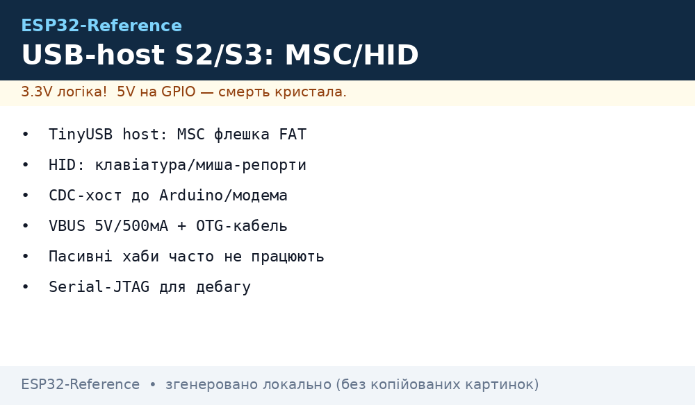
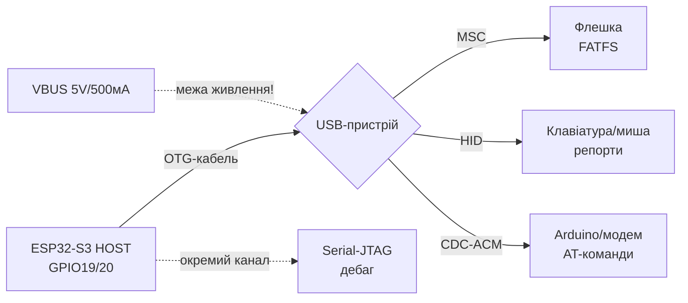

# USB OTG та JTAG


ESP32 Classic **не має** native USB - на платах стоїть мост [CH340 / CP2102](../../../ESP32-Reference/04-Shini/06-USB-OTG-JTAG.md). Native USB D-/D+ є тільки на **S2/S3** (GPIO19/20), JTAG - для відлагодження.

> [!info] Classic vs S2/S3
> Classic: прошивка через UART0 + CH340. S2/S3: CDC через USB + JTAG через той же кабель. Не шукай USB на Classic - його немає.

## Призначення

USB OTG та JTAG - Порівняння; Таблиця з'єднань; Код - CDC на S3. ESP32 Classic не має native USB - на платах стоїть мост [06-USB-OTG-JTAG](../../../ESP32-Reference/04-Shini/06-USB-OTG-JTAG.md). Native USB D-/D+ є тільки на S2/S3 (GPIO19/20), JTAG - для відлагодження. Classic: прошивка через UART0 + CH340. S2/S3: CDC через USB + JTAG через той же кабель. Не шукай USB на Classic - його немає.

## Порівняння

| Чіп | Native USB | Піни D-/D+ | CDC-консоль | JTAG |
| --- | --- | --- | --- | --- |
| ESP32 Classic | ні | - | ні (CH340) | зовнішній FT2232 |
| ESP32-S2 | USB OTG FS | GPIO19/20 | так | вбудований |
| ESP32-S3 | USB OTG FS | GPIO19/20 | так | вбудований USB-Serial-JTAG |
| ESP32-C3 | USB Serial/JTAG | GPIO18/19 | так | вбудований |
| ESP32-C6 | USB Serial/JTAG | - | так | вбудований |

## Таблиця з'єднань

| Плата | USB | UART-міст | JTAG |
| --- | --- | --- | --- |
| DevKit Classic | microUSB → CH340 → U0 (1/3) | CH340 TX→RX0, RX→TX0 + DTR/RTS для auto-reset | - |
| S3 DevKit | USB-C → GPIO19/20 | CDC, auto-reset | вбудований, `openocd -f esp32s3-builtin.cfg` |
| Classic + debug | - | - | TDI 12, TCK 13, TMS 14, TDO 15 |

> [!warning] JTAG займає strapping
> TDI=12, TMS=14, TDO=15 - див. [strapping-піни](../../../ESP32-Reference/03-GPIO/02-Strapping-pini.md). Під час debug не чіпляй туди периферію.

## Код - CDC на S3

**Arduino (S3 USB-CDC):**

```cpp
// Tools > USB CDC On Boot: Enabled
void setup() { Serial.begin(115200); }
void loop() { Serial.println("hello usb"); delay(1000); }
```

**ESP-IDF (S3):**

```c
// menuconfig: Component config > ESP System Settings > Channel for console output > USB CDC
// далі звичайний printf працює через USB
#include <stdio.h>
void app_main(void) { printf("hello usb\n"); }
```

**MicroPython:** на S3/C3 REPL одразу через USB-CDC, код той же `print()`.

## USB-host на S2/S3: флешки, миші, модеми

Той же порт GPIO19/20 вміє працювати хостом: S2/S3 підключають чужі USB-пристрої через стек TinyUSB-host (IDF) або `USBHost` (Arduino). Classic, C3, C6 хоста НЕ мають (у C3/C6 - тільки фіксований USB-Serial-JTAG).

| Чіп | USB-host (OTG) | Що реально тягне |
| --- | --- | --- |
| ESP32 Classic | ні | тільки CH340-міст |
| ESP32-S2 | так, OTG FS | MSC + HID + CDC, один порт без хаба |
| ESP32-S3 | так, OTG FS | те саме + паралельно вбудований Serial-JTAG |
| ESP32-C3/C6 | ні (тільки Serial-JTAG device) | хоста немає взагалі |


*Рис. ESP32-S3 як USB-хост: флешка (MSC+FAT), клавіатура/миша (HID), модем (CDC), живлення VBUS 5 В.*

### ASCII-схема підключення

```text
ESP32-S2/S3 (HOST, GPIO19=D-, GPIO20=D+)
  │
  ├─ OTG-кабель (ID на землю = host-режим)
  │
  ├─► USB-флешка ──► MSC BOT ──► FATFS ──► /usb/read.txt
  ├─► Клавіатура/миша ──► HID boot-протокол ──► парсер репортів
  ├─► Arduino/модем ──► CDC-ACM (tty) ──► AT-команди
  └─► [живлення!] VBUS 5V до 500 мА ──► флешка + світлодіод = межа

ОКРЕМО: вбудований USB-Serial-JTAG (той самий кабель S3)
  ──► прошивка + монітор + JTAG-дебаг (див. [[09-Proshivka/05-JTAG-Debug]])
```

### Mermaid



## MSC-флешка: читання/запис FAT

Хост-драйвер MSC (Bulk-Only Transport) + FATFS: флешка монтується як диск. Працює на S2/S3 через компонент `espressif/usb_host_msc`.

Правила практики:

- Файлова система - FAT32 (exFAT хост не тягне); довгі імена - так, кирилиця - як пощастить з кодуванням.
- Флешку монтувати/розмонтовувати явно; висмикування під час запису = бита FAT (див. [Файлові системи](../../../ESP32-Reference/08-Pamyat/02-Filesystem.md)).
- Живлення: флешка їсть 100-200 мА піками, запис - найбільше. Слабкий LDO = помилки запису.
- Для логера краще писати на SD (див. [07-SD-SDIO](../../../ESP32-Reference/04-Shini/07-SD-SDIO.md)), USB-флешка - для зняття дампів і конфігів.

## HID-клавіатура/миша: парсер репортів

HID boot-протокол - фіксований формат, парситься без дескрипторного дерева:

```text
Клавіатура (8 байт): [модифікатори][резерв][key1..key6]
  модифікатори: bit0=CtrlL bit1=ShiftL bit2=AltL bit3=WinL, біти 4-7 праві
  keyN: HID usage ID клавіші (0 = нема натискання)
Миша (4 байти): [кнопки][dx][dy][wheel]
  dx/dy: знакові зміщення, wheel: прокрутка
```

Повний парсинг кастомних HID-дескрипторів (ігрові панелі, баркод-сканери з vendor-сторінками) - через колбек репортів TinyUSB: читати `report_id` + довжину і розбирати за даташитом пристрою.

## CDC-хост: Arduino і модеми

CDC-ACM хост бачить Arduino (USB-serial), 4G-модеми, GPS-приймачі з USB як віртуальний COM-порт: відкрити, виставити baud, слати AT-команди.

- Arduino як USB-device + ESP32-S3 як хост = міст UART-даних між двома платами без дротів RX/TX.
- Модеми (SIM7600 по USB): AT-команди ті ж, що по UART (див. [07-SIM7600-W5500-MCP2515](../../../ESP32-Reference/12-Moduli-zvyazku/07-SIM7600-W5500-MCP2515.md)), але перевірити VID/PID і потребу в специфічному драйвері (деякі - не чистий CDC).
- Після `AT+CFUN` і конекту трафік іде через PPP/tty - важко для RAM без PSRAM, закладати буфер.

## UAC-мікрофон: оглядово

UAC (аудіо-клас, ізохронні передачі) хостом підтримується, але це важкий шлях: ізохронний трафік кожен мілісекундний фрейм, буфери і таймінги критичні. Для голосових команд і шумоміра простіше цифровий I2S-мікрофон (див. [I2S](../../../ESP32-Reference/04-Shini/04-I2S.md)). USB-мікрофон брати тільки коли пристрій уже є і перепаяти не можна.

## RNDIS/ECM: оглядово + застереження

> [!warning] RNDIS/ECM - не «USB-інтернет з коробки»!
> USB-модем як мережева карта вимагає хост-драйвер RNDIS/ECM + DHCP + TCP/IP поверх - це сотні кілобайт RAM і нестабільні vendor-реалізації. Для виходу в мережу дешевше WiFi-модуль або UART-PPP до модема.

## USB-Serial-JTAG: вбудований дебаг

На S3/C3 окремий апаратний блок (не OTG!): один USB-кабель дає CDC-консоль + JTAG без адаптерів. Вмикається вибором консолі в `menuconfig`, дебаг - `openocd -f board/esp32s3-builtin.cfg`. Повна процедура - [05-JTAG-Debug](../../../ESP32-Reference/09-Proshivka/05-JTAG-Debug.md). Пам'ятати: після Secure Boot JTAG закривається назавжди (див. [04-Secure-Boot-Encrypt](../../../ESP32-Reference/08-Pamyat/04-Secure-Boot-Encrypt.md)).

## Живлення VBUS 5V/500мА + OTG-кабель

| Вимога | Значення | Примітка |
| --- | --- | --- |
| VBUS | 5 В ±5% | від плати-хоста або активного хаба |
| Струм | до 500 мА (USB 2.0) | флешка 100-200 мА, HDD - заборонено |
| OTG-кабель/перехідник | ID-пін на GND | без нього S2/S3 лишається device |
| Хаб | тільки з власним живленням | пасивний хаб + флешка = просадка і відвали |
| Конденсатор | 47-100 мкФ по VBUS біля роз'єму | згладжує піки запису флешки |
| Вимір | USB-тестер / мультиметр на VBUS | при просадці нижче 4.75 В - помилки MSC |

Живлення логіки - як завжди через стабільні 3V3 (див. [01-Lancjugi-zhivlennya](../../../ESP32-Reference/02-Zhivlennya/01-Lancjugi-zhivlennya.md)). Не живити S3-хост від слабкого CH340-кабелю: саме VBUS лягає першим.

## Код ESP-IDF: MSC + HID хост

```c
// IDF S2/S3: компоненти espressif/usb_host_msc + usb_host_hid + fatfs
// idf.py add-dependency "espressif/usb_host_msc"
#include "usb/usb_host.h"
#include "usb_host_msc.h"
#include "usb_host_hid.h"
#include "esp_vfs_fat.h"

#define MNT "/usb"

void app_main(void) {
    // 1. USB-host install + daemon-задача (див. приклад msc в esp-idf):
    usb_host_config_t host_cfg = {
        .skip_phy_setup = false,
        .intr_flags = ESP_INTR_FLAG_LEVEL1,
    };
    ESP_ERROR_CHECK(usb_host_install(&host_cfg));
    xTaskCreate(usb_host_task, "usb_host", 4096, NULL, 2, NULL);

    // 2. MSC: чекати підключення флешки, змонтувати FAT:
    // (msc-драйвер кидає подію READY → монтуємо)
    // ESP_ERROR_CHECK(esp_vfs_fat_usb_mount(MNT, ...));
    FILE *f = fopen(MNT "/log.txt", "a");
    if (f) { fprintf(f, "hello usb\n"); fclose(f); }

    // 3. HID: колбек репортів клавіатури (boot-протокол, 8 байт):
    // usb_host_hid_set_report_callback(kbd_cb);
    // kbd_cb: buf[0]=модифікатори, buf[2..7]=keycodes → hid_usage_to_ascii()
}
```

Розбір клавіатурного репорту:

```c
// buf[8]: [mod][rsv][k1..k6]
static void kbd_report(const uint8_t *b) {
    bool shift = b[0] & 0x22;
    for (int i = 2; i < 8; i++) {
        if (b[i] == 0) continue;
        printf("key usage=0x%02x shift=%d\n", b[i], shift);
    }
}
```

## Код Arduino (S3, USBHost MSC + HID)

```cpp
// Arduino-ESP32 (core 3.x) на S3: Tools > USB Mode = "USB-OTG"
#include "USB.h"
#include "USBHost.h"
#include "USBHIDKeyboard.h"
#include "USBMSC.h"

USBHost host;
USBHIDKeyboard kbd;
USBMSC msc;

void onKey(uint8_t mod, uint8_t key) {
  Serial.printf("mod=0x%02x key=0x%02x\n", mod, key);
}

void setup() {
  Serial.begin(115200);
  host.begin();                 // S3 в host-режимі, OTG-кабель обов'язковий
  kbd.onKey(onKey);             // HID-колбек
  kbd.begin(host);
  if (msc.begin(host)) {        // MSC-флешка знайдена
    Serial.printf("sectors=%lu\n", (unsigned long)msc.sectorCount());
    // далі — FFat/FATFS поверх msc.readBlocks/writeBlocks
  }
}

void loop() {
  host.task();                  // опитування хоста — викликати ЧАСТО
}
```

> [!note] API Arduino-USBHost залежить від версії core!
> Назви класів (`USBHost`, `USBHIDKeyboard`) і прикладів (`USBHostMSC`, `USBHostHID`) дивитись у своїй версії ядра. Логіка однакова: `begin()` → `task()` у циклі → колбеки подій.

## Типові помилки USB-host

| Симптом | Причина | Рішення |
| --- | --- | --- |
| Дескриптор не парситься / `enumeration failed` | нестандартний пристрій, довгий дескриптор, брак endpoint-ресурсів | Урізати конфіг (менше CDC-інтерфейсів), взяти іншу флешку, дивитись лог дескриптора |
| Флешка монтується і відвалюється на записі | просадка VBUS, слабкий LDO/кабель | Конденсатор 47-100 мкФ, коротший кабель, активний хаб, замір 5 В |
| Хаб без живлення + 2 пристрої = нічого не видно | перевищено 500 мА | Тільки self-powered хаб; HDD/вентилятори - заборонено |
| Клавіатура мовчить, миша працює | не boot-протокол, потрібен report-парсер | Читати HID-дескриптор, парсити `report_id`, звірити довжину |
| CDC-модем не відповідає на AT | не чистий CDC-ACM (vendor-клас, QMI/RNDIS) | Перемкнути модем в CDC/ECM-режим AT-командою по UART, або UART-PPP |
| S3 видно як device, хост не стартує | кабель без OTG-ID, режим USB-Serial-JTAG | OTG-перехідник з ID на GND; `USB Mode = USB-OTG`, не CDC |
| `host.task()` рідко - пропуски символів | HID-репорти переповнюються | `task()` кожну ітерацію `loop()`, без `delay()` |
| Після deep-sleep хост не бачить пристрої | стек не переживає сон | Повна реініціалізація `usb_host_install` після пробудження |

## Офіційні джерела

- [USB Host - ESP-USB (S3)](https://docs.espressif.com/projects/esp-usb/en/latest/esp32s3/usb_host.html) - Host Library, MSC/HID/CDC class-драйвери, приклади `msc`/`hid`.
- [USB Serial/JTAG Console - ESP-IDF (S3)](https://docs.espressif.com/projects/esp-idf/en/stable/esp32s3/api-guides/usb-serial-jtag-console.html) - вбудований дебаг, прошивка через той же кабель.
- [USB OTG Console - ESP-IDF (S3)](https://docs.espressif.com/projects/esp-idf/en/stable/esp32s3/api-guides/usb-otg-console.html) - перемикання PHY між Serial-JTAG і OTG.
- [USB API - Arduino-ESP32](https://docs.espressif.com/projects/arduino-esp32/en/latest/api/usb.html) - `USBHost`, MSC/HID, TinyUSB vs IDF-стек.

## Див. також

- [Home](../../../ESP32-Reference/Home.md)
- [01-ESP32-Classic](../../../ESP32-Reference/01-Hardware/01-ESP32-Classic.md)
- [UART](../../../ESP32-Reference/04-Shini/01-UART.md)
- [Boot та прошивка](../../../ESP32-Reference/09-Proshivka/04-Esptool-Flash.md)
- [Strapping-піни](../../../ESP32-Reference/03-GPIO/02-Strapping-pini.md)
- [USB-UART мости](../../../ESP32-Reference/04-Shini/06-USB-OTG-JTAG.md)
- [Відлагодження](../../../ESP32-Reference/09-Proshivka/05-JTAG-Debug.md)
