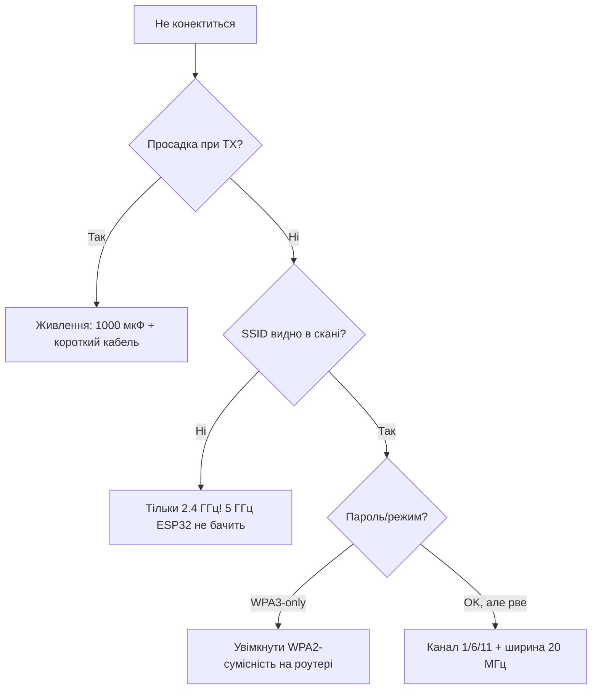

# WiFi - STA / AP / STA+AP


Три режими: **STA** (клієнт роутера), **AP** (точка доступу), **STA+AP** (одночасно). RSSI < −75 dBm - нестабільно, reconnection - обов'язковий.

> [!info] WIFI_STA + modem-sleep
> Для батарейних - [modem-sleep](../../../ESP32-Reference/07-Timeri-Son/03-Sleep-ULP.md) + періодичне пробудження. Постійний STA з'їдає ~100-200 мА.

## Призначення

WiFi - STA / AP / STA+AP - Режими; Таблиця з'єднань (мінімум); Перепідключення з backoff. Три режими: STA (клієнт роутера), AP (точка доступу), STA+AP (одночасно). RSSI < −75 dBm - нестабільно, reconnection - обов'язковий. Для батарейних - 07-Timeri-Son/03-Sleep-ULP + періодичне пробудження. Постійний STA з'їдає ~100-200 мА.

## Режими

| Режим | Опис | IP | Коли |
| --- | --- | --- | --- |
| STA | підключення до роутера | DHCP від роутера | сенсор → MQTT/HTTP |
| AP | своя мережа ESP32_AP | 192.168.4.1 | портал налаштування, прямий доступ |
| STA+AP | одночасно | обидва | WiFiManager портал + робота |

| RSSI | Якість |
| --- | --- |
| −30…−55 dBm | відмінно |
| −55…−70 dBm | добре |
| −70…−80 dBm | погано, рветься |
| < −85 dBm | не працює |

## Таблиця з'єднань (мінімум)

| ESP32 | Компонент | Примітка |
| --- | --- | --- |
| 3V3/GND | живлення | WiFi дає піки 400 мА! конденсатор 470 мкФ |
| GPIO2 | LED статусу | blink поки конектиться |
| EN | 10к → 3V3 + 100нФ | стабільний boot при просадках |

## Код

**Arduino (STA + reconnect + AP-портал):**

```cpp
#include <WiFi.h>
#include <WiFiManager.h>
void setup() {
  Serial.begin(115200);
  WiFi.mode(WIFI_STA);
  WiFi.setAutoReconnect(true);
  WiFiManager wm;
  wm.setConnectTimeout(15);
  if (!wm.autoConnect("ESP32_SETUP")) ESP.restart();
  Serial.println(WiFi.localIP());
}
void loop() {
  if (WiFi.status() != WL_CONNECTED) { WiFi.reconnect(); delay(5000); }
  Serial.println(WiFi.RSSI());
  delay(2000);
}
```

**ESP-IDF:**

```c
#include "esp_wifi.h"
#include "esp_event.h"
// esp_netif_init + esp_event_loop_create_default +
// wifi_init_config + esp_wifi_set_mode(WIFI_MODE_STA) +
// esp_wifi_set_config + esp_wifi_start + esp_wifi_connect
// reconnect через event WIFI_EVENT_STA_DISCONNECTED -> esp_wifi_connect()
```

**MicroPython:**

```python
import network, time
w = network.WLAN(network.STA_IF)
w.active(True)
if not w.isconnected():
    w.connect("SSID", "PASS")
    for _ in range(20):
        if w.isconnected(): break
        time.sleep(1)
print(w.ifconfig(), w.status("rssi"))
```

## Перепідключення з backoff

`setAutoReconnect(true)` + `WiFi.reconnect()` у кожному `loop()` - це hammering: роутер банить MAC за флуд. Правильно - **експоненційний backoff + джитер**.

| Спроба | Затримка | Коментар |
| --- | --- | --- |
| 1-2 | 1-2 с | роутер міг блимнути |
| 3-5 | 5-15 с | чекаємо DHCP/роумінг |
| 6+ | 30-60 с + джитер | не садимо батарею, не флудимо ефір |
| 10+ без успіху | `ESP.restart()` або портал | можливо, змінили пароль/SSID |

Події для IDF: `WIFI_EVENT_STA_DISCONNECTED` → запланувати `esp_wifi_connect()` через таймер backoff; `IP_EVENT_STA_GOT_IP` → скинути лічильник.

**Arduino (STA + backoff + джитер):**

```cpp
#include <WiFi.h>
const char *SSID = "Home", *PASS = "pass";
uint8_t fails = 0;
uint32_t nextTry = 0;
void wifiTry() {
  if (WiFi.status() == WL_CONNECTED) { fails = 0; return; }
  if (millis() < nextTry) return;
  WiFi.disconnect(false);
  WiFi.begin(SSID, PASS);
  fails++;
  uint32_t base = fails < 3 ? 2000 : fails < 6 ? 10000 : 45000;
  uint32_t jitter = random(0, 3000);
  nextTry = millis() + base + jitter;
  Serial.printf("wifi try #%d, next in %lus\n", fails, (base + jitter) / 1000);
  if (fails >= 12) { Serial.println("too many fails -> portal/restart"); ESP.restart(); }
}
void setup() {
  Serial.begin(115200);
  WiFi.mode(WIFI_STA);
  WiFi.setAutoReconnect(false);  // backoff робимо самі!
  wifiTry();
}
void loop() { wifiTry(); delay(500); }
```

**ESP-IDF (event + backoff):**

```c
// WIFI_EVENT_STA_DISCONNECTED -> {
//   static int fails = 0; fails++;
//   int delay_ms = fails < 3 ? 2000 : fails < 6 ? 10000 : 45000;
//   esp_timer_start_once(retry_timer, delay_ms * 1000);
//   // retry_timer callback: esp_wifi_connect();
// }
// IP_EVENT_STA_GOT_IP -> fails = 0;
```

**MicroPython (backoff):**

```python
import network, time, random
w = network.WLAN(network.STA_IF)
w.active(True)
fails = 0
while not w.isconnected():
    w.connect("SSID", "PASS")
    time.sleep(5)
    fails += 1
    wait = 2 if fails < 3 else 10 if fails < 6 else 45
    print("try", fails, w.status())
    time.sleep(wait + random.uniform(0, 3))
    if fails > 12:
        import machine; machine.reset()
```

## Сканування + вибір BSSID

У квартирі 2-3 точки з одним SSID (роутер + репітер). За замовчуванням ESP32 чіпляється до першої - може до слабкої через стіну. Лікування - **скан + вибір найсильнішого BSSID**.

**Arduino:**

```cpp
#include <WiFi.h>
void connectBest(const char *ssid, const char *pass) {
  int n = WiFi.scanNetworks(false, true);  // active scan, приховати сміття
  int best = -100; uint8_t bestBssid[6]; bool found = false;
  for (int i = 0; i < n; i++) {
    if (WiFi.SSID(i) == ssid) {
      Serial.printf("%s ch=%d rssi=%d\n",
        WiFi.BSSIDstr(i).c_str(), WiFi.channel(i), WiFi.RSSI(i));
      if (WiFi.RSSI(i) > best) { best = WiFi.RSSI(i); found = true;
        memcpy(bestBssid, WiFi.BSSID(i), 6); }
    }
  }
  WiFi.scanDelete();
  WiFi.begin(ssid, pass, 0, found ? bestBssid : NULL);  // 0 = будь-який канал
}
```

Поради: скан роби **раз при старті**, не в циклі (скан глушить трафік на ~2-3 с). Для роумінгу між точками - `esp_wifi_set_roam()` (IDF) або періодичний рескан раз на 10 хв.

## Static IP

DHCP дає +1-3 с до конекту і «плаваючий» IP - незручно для HTTP-панелі. Для стаціонарних пристроїв - статика.

**Arduino:**

```cpp
IPAddress ip(192, 168, 1, 50), gw(192, 168, 1, 1), mask(255, 255, 255, 0), dns(192, 168, 1, 1);
WiFi.config(ip, gw, mask, dns);
WiFi.begin(SSID, PASS);
```

**ESP-IDF:** `esp_netif_dhcpc_stop()` + `esp_netif_set_ip_info()` після `esp_netif_create_default_wifi_sta()`.

**MicroPython:**

```python
w = network.WLAN(network.STA_IF); w.active(True)
w.ifconfig(("192.168.1.50", "255.255.255.0", "192.168.1.1", "192.168.1.1"))
w.connect("SSID", "PASS")
```

> [!warning] Конфлікт IP
> Перевір, що адреса поза DHCP-пулом роутера (напр. пул .100-.200, а ESP32 - .50). Два пристрої з одним IP = обидва «моргають».

## Promiscuous sniffer (коротко)

Режим `WIFI_MODE_NULL + esp_wifi_set_promiscuous(true)` - ESP32 слухає **всі** WiFi-пакети в ефірі (MAC, RSSI, тип). Застосування: пошук вільних каналів, лічильник людей по probe-request, діагностика.

```c
// ESP-IDF, оглядово:
wifi_promiscuous_filter_t f = {.filter_mask = WIFI_PROMIS_FILTER_MASK_MGMT};
esp_wifi_set_promiscuous_filter(&f);
esp_wifi_set_promiscuous_rx_cb([](void *buf, wifi_promiscuous_pkt_type_t t){
  wifi_promiscuous_pkt_t *p = buf;
  printf("rssi=%d len=%d\n", p->rx_ctrl.rssi, p->rx_ctrl.sig_len);
});
esp_wifi_set_promiscuous(true);
```

Обмеження: в promiscuous **немає STA/AP-трафіку** одночасно повноцінно; на Arduino - бібліотеки `ESP32 WiFi Sniffer`. Юридично: слухай тільки свою мережу / метадані; чужий трафік не розшифровуй.

## TX-power vs дальність / струм

| `setTxPower()` | Потужність | Струм TX-пік | Дальність (пряма видимість) | Коли |
| --- | --- | --- | --- | --- |
| `WIFI_POWER_8_5dBm` | ~7 мВт | ~150 мА | ~10-20 м (кімната) | батарея, датчик поруч з роутером |
| `WIFI_POWER_13dBm` | ~20 мВт | ~200 мА | ~30-50 м | default для сенсорів |
| `WIFI_POWER_19_5dBm` (max) | ~90 мВт | ~350-400 мА | ~80-150+ м | вулиця, слабкий сигнал; гріється, батарея тане |

```cpp
WiFi.setTxPower(WIFI_POWER_13dBm);  // Arduino
// IDF: esp_wifi_set_max_tx_power(52); // одиниці 0.25 дБм: 52 = 13 дБм
```

Правило: почни з **13 дБм**; піднімай до 19.5 лише якщо RSSI < −75. Зниження з 19.5 до 13 подовжує життя батареї на ~20-30% при періодичній відправці. Антена і орієнтація плати впливають сильніше за +3 дБм (див. [Антени RF](../../../ESP32-Reference/01-Hardware/08-Anteni-RF.md)).

## Enterprise WPA2 (оглядово + застереження)

Університети/офіси: WPA2-Enterprise (EAP-PEAP/TTLS, логін+пароль, іноді сертифікат). ESP32 підтримує через IDF (`esp_wifi_sta_enterprise_enable()`), в Arduino - `WiFi.begin(ssid, WPA2_AUTH_PEAP, user, user, pass)`.

```cpp
// Arduino, оглядово (перевіряй під свою версію core!):
// esp_wifi_sta_wpa2_ent_set_identity(...);
// esp_wifi_sta_wpa2_ent_set_username(...);
// esp_wifi_sta_wpa2_ent_set_password(...);
// WiFi.begin(ssid);
```

Застереження:

- Enterprise з'їдає **~30-50 КБ heap** (TLS всередині) - на C3 без PSRAM + MQTT/TLS може не влізти.
- Сертифікати треба оновлювати (див. [Файлові системи](../../../ESP32-Reference/08-Pamyat/02-Filesystem.md) + [TLS](../../../ESP32-Reference/15-Protokoli/03-mDNS-NTP-TLS.md)).
- Часто простіше попросити в IT **окремий IoT-SSID з PSK** або завести ESP32 через провідний шлюз ([W5500](../../../ESP32-Reference/12-Moduli-zvyazku/07-SIM7600-W5500-MCP2515.md)), ніж боротися з EAP і політиками ротації паролів.

### Mermaid: не конектиться до WiFi



## Типові помилки

| # | Помилка | Чому погано | Як правильно |
| --- | --- | --- | --- |
| 1 | Мережа 5 ГГц | ESP32 її не бачить | Окремий SSID 2.4 ГГц |
| 2 | Слабке живлення | Ребут саме при конекті | Конденсатор + струм 500+ мА |
| 3 | WPA3-only | Старі стеки не проходять | WPA2/WPA3-mixed |
| 4 | Канал 12-13 в US-регіоні | Поза regulatory | Канали 1-11 або регіон EU |
| 5 | Довгий hostname/DHCP-таймаут | Здається «мертвим» | Статичний IP для тестів |

## Офіційні джерела

- [ESP32 Wi-Fi Guide (ESP-IDF)](https://docs.espressif.com/projects/esp-idf/en/latest/esp32/api-guides/wifi.html) - режими, сканування, події.
- [802.11 coexistence / RF](https://docs.espressif.com/projects/esp-idf/en/latest/esp32/api-guides/coexist.html) - WiFi+BLE одночасно.

## Див. також

- [Home](../../../ESP32-Reference/Home.md)
- [01-ESP32-Classic](../../../ESP32-Reference/01-Hardware/01-ESP32-Classic.md)
- [ESP-NOW](../../../ESP32-Reference/05-Radio/03-ESP-NOW.md)
- [ESP-MESH](../../../ESP32-Reference/05-Radio/04-ESP-MESH.md)
- [BLE](../../../ESP32-Reference/05-Radio/02-BLE-Bluetooth.md)
- [Sleep](../../../ESP32-Reference/07-Timeri-Son/03-Sleep-ULP.md)
- [MQTT](../../../ESP32-Reference/05-Radio/03-ESP-NOW.md)
