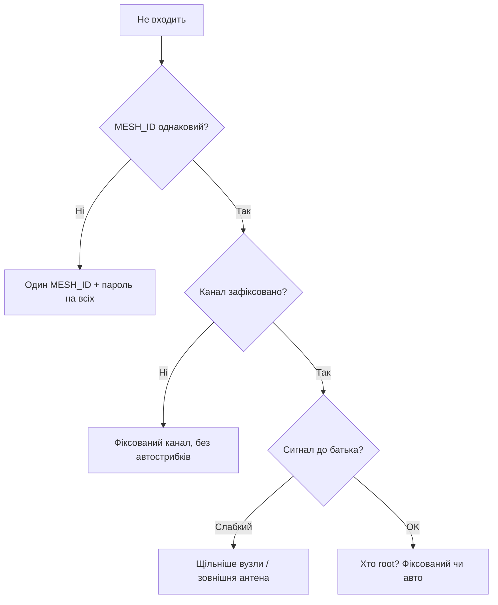

# ESP-MESH - коли брати замість ESP-NOW


MESH - самоорганізована мережа: **root** виходить в інтернет, **nodes** ретранслюють один одного. На відміну від [ESP-NOW](../../../ESP32-Reference/05-Radio/03-ESP-NOW.md), пакети стрибають через сусідів.

> [!info] MESH vs ESP-NOW
> ESP-NOW - зірка (всі чують gateway). MESH - дерево/сітка (дістає за рогом через ретрансляцію, але складніший і прожерливіший).

## Призначення

ESP-MESH - коли брати замість ESP-NOW - Топологія; Коли що брати; Таблиця з'єднань (типовий node). MicroPython: нативного MESH немає - тільки ESP-NOW або MQTT-міст; для mesh - прошивка Arduino/IDF. MESH-мережа живе на одному WiFi-каналі - тому що радіо одне. Root прив'язаний до каналу домашнього роутера.

## Топологія

```text
[Router] <-WiFi-> [Root] <-MESH-> [Node A] <-MESH-> [Node B]
                                   └------> [Node C]
```

| Роль | Функція |
| --- | --- |
| Root | один, міст MESH↔WiFi/[MQTT](../../../ESP32-Reference/05-Radio/03-ESP-NOW.md) |
| Intermediate node | сенсор + роутер для дітей |
| Leaf node | тільки сенсор, може спати |

## Коли що брати

| Критерій | ESP-NOW | ESP-MESH / painlessMesh |
| --- | --- | --- |
| Вузлів | <20, всі в радіовидимості | 20-100+, багатоповерхівка |
| Сон | deep-sleep ок | вузли-роутери не сплять |
| Затримка | 1-10 мс | 10-100+ мс (хопи) |
| Складність | 50 рядків | стек + конфіг |
| Root failover | немає (один gateway) | self-healing, новий root |

## Таблиця з'єднань (типовий node)

| ESP32 node | Периферія | Примітка |
| --- | --- | --- |
| GPIO21/22 | сенсор I2C | дані |
| 3V3 | мережеве живлення 5В→3.3В | mesh-вузли не на батареї (крім leaf) |
| GPIO2 | LED | blink = hop-count |

## Код (painlessMesh, Arduino)

```cpp
#include <painlessMesh.h>
painlessMesh mesh;
#define MESH_SSID "mesh_net"
#define MESH_PASS "12345678"
#define MESH_PORT 5555
void receivedCallback(uint32_t from, String &msg) { Serial.println(msg); }
void setup() {
  Serial.begin(115200);
  mesh.init(MESH_SSID, MESH_PASS, MESH_PORT);
  mesh.onReceive(&receivedCallback);
}
void loop() { mesh.update(); }
```

**ESP-IDF:** нативний `esp_mesh` (MESH_INIT_CONFIG_DEFAULT + `esp_mesh_start`), приклад `mesh/internal_communication`.

**MicroPython:** нативного MESH немає - тільки ESP-NOW або MQTT-міст; для mesh - прошивка Arduino/IDF.

## Ролі детально: root / node / leaf

```text
        [Домашній роутер 192.168.1.1, канал 6]
                    |
              +-----+-----+
              |   ROOT    |  MESH ID "mesh_net", не спить, міст MESH↔WiFi
              +-----+-----+
                    | MESH (той самий канал!)
          +---------+---------+
          |                   |
     [Node A]            [Node B]   intermediate: сенсор + ретранслятор
          |                   |
      [Leaf B1]           [Leaf B2]  leaf: тільки сенсор, deep-sleep можливий
```

| Роль | Живлення | Сон | Задачі |
| --- | --- | --- | --- |
| **Root** | мережеве 5 В (не батарея!) | заборонено | тримає uplink до роутера, MQTT-шлюз, DHCP-клієнт, пересилає весь трафік гілки |
| **Intermediate node** | мережеве | заборонено (має слухати дітей) | сенсор + маршрутизація, буфер пакетів дітей |
| **Leaf node** | батарея можлива | deep-sleep ок | прокинувся → відправив → заснув; дітей не обслуговує |

Root обирається автоматично (сигнал до роутера + задана пріоритетність), при падінні root - **self-healing**: новий root переобирається за ~10-60 с. Тому прошивка всіх вузлів - однакова, роль задається конфігом (`esp_mesh_set_type()` / `allow_root`).

> [!warning] Один root - одна точка відмови на хвилину
> Поки йдуть перевибори, дані буферизуються/губляться. Критичні аларми (пожежа) дублюй прямим [ESP-NOW](../../../ESP32-Reference/05-Radio/03-ESP-NOW.md) або локальним зумером.

## Канал і залежність від роутера

- MESH-мережа живе **на одному WiFi-каналі** - тому що радіо одне. Root прив'язаний до каналу домашнього роутера.
- Якщо роутер на **авто-каналі** і перестрибнув з 6 на 11 - вся mesh перебудовується (~30-120 с). Лікування: **зафіксувати канал роутера** (напр. 1/6/11) і той же канал прописати в `mesh_cfg.channel`.
- Root одночасно тримає **STA (до роутера) + MESH (до дітей)** - пам'ять і CPU діляться. На Classic це ~50 КБ heap тільки на стек; з увімкненим BLE одночасно - рахуй RAM (див. [06-Flash-PSRAM](../../../ESP32-Reference/01-Hardware/06-Flash-PSRAM.md)).
- Без роутера (поле, склад) mesh працює **автономно** (внутрішній обмін), але root нікуди не форвардить - або признач root-шлюз з LTE (див. [SIM800L](../../../ESP32-Reference/12-Moduli-zvyazku/03-SIM800L-GPS.md)), або збирай дані обходом.

## Таблиця лімітів

| Параметр | ESP-MESH (IDF) | painlessMesh (Arduino) | Коментар |
| --- | --- | --- | --- |
| Вузлів у мережі | до ~1000 (теор.), стабільно 50-100 | стабільно 20-50 | більше = більше службового трафіку |
| Глибина (hop) | до 6-8 (настр. `max_layer`) | 5-7 | кожен hop +10-50 мс затримки |
| Дітей на вузол | до 10 (`max_connection`) | ~5-8 | обмеж, щоб не забити heap |
| Розмір пакета | ~1.4 КБ (прикладний) | ~1 КБ (JSON String) | великі JSON ріж на частини |
| Затримка кінцева | 10-100+ мс (залежить від hop) | 50-300 мс (JSON+TCP) | не для керування мотором у реальному часі |
| Throughput вузла | ~1-5 Мбіт/с (ділиться на гілку!) | ~100-500 Кбіт/с | відео не ганяй |
| Root failover | ~10-60 с | ~10-60 с | буферуй дані на цей час |
| Сон роутерів | немає | немає | тільки leaf сплять |

> [!tip] Правило шарів
> Тримай глибину ≤ 4 hop плануванням (кореневі вузли ближче до root). Кожен зайвий hop - мінус надійність і плюс затримка.

## Код - конфіг ESP-IDF + root-шлюз MESH→MQTT

**ESP-IDF (нативний esp_mesh, скорочено):**

```c
#include "esp_mesh.h"
#define MESH_ID {0x77,0x77,0x77,0x77,0x77,0x77}
void app_main(void) {
    esp_netif_init(); esp_event_loop_create_default();
    wifi_init_config_t w = WIFI_INIT_CONFIG_DEFAULT();
    esp_wifi_init(&w);
    esp_mesh_cfg_t cfg = MESH_INIT_CONFIG_DEFAULT();
    mesh_cfg_t m = {
        .channel = 6,                    // той самий, що на роутері!
        .router.ssid = "HomeRouter",
        .router.password = "pass",
        .mesh_id = {.addr = MESH_ID},
        .mesh_ap.max_connection = 6,     // дітей на вузол
        .max_layer = 4,                  // глибина
    };
    cfg.channel = 6;
    esp_mesh_init(&cfg);
    esp_mesh_set_max_layer(4);
    esp_mesh_set_vote_percentage(1.0);   // всі можуть стати root
    esp_mesh_set_ap_authmode(WIFI_AUTH_WPA2_PSK);
    esp_mesh_set_config(&m);
    esp_mesh_start();                    // далі події MESH_EVENT_ROOT_GOT_IP тощо
    // Leaf: esp_mesh_set_type(MESH_STA); esp_mesh_set_sleep_enable(true);
}
```

**Arduino (painlessMesh + датчик):**

```cpp
#include <painlessMesh.h>
#include <ArduinoJson.h>
painlessMesh mesh;
#define MESH_SSID "mesh_net"
#define MESH_PASS "12345678"
#define MESH_PORT 5555
void receivedCallback(uint32_t from, String &msg) {
  StaticJsonDocument<256> d;
  if (!deserializeJson(d, msg)) {
    Serial.printf("from %u t=%.1f h=%.1f\n",
      from, d["t"].as<float>(), d["h"].as<float>());
  }
}
void setup() {
  Serial.begin(115200);
  mesh.setDebugMsgTypes(ERROR | STARTUP);
  mesh.init(MESH_SSID, MESH_PASS, MESH_PORT, WIFI_AP_STA, 6 /*канал*/);
  mesh.onReceive(&receivedCallback);
  mesh.setContainsRoot(true);  // у мережі є root-шлюз
}
void loop() {
  mesh.update();
  static uint32_t t = 0;
  if (millis() - t > 10000) {  // leaf/node шле раз на 10 с
    t = millis();
    StaticJsonDocument<128> d;
    d["t"] = 23.5; d["h"] = 55;
    String s; serializeJson(d, s);
    mesh.sendBroadcast(s);
  }
}
```

**Root-шлюз MESH→MQTT (логіка, Arduino):**

```cpp
// На ROOT: painlessMesh + PubSubClient одночасно.
// mesh.onReceive -> mqtt.publish("mesh/node/<from>", msg)
// mqtt callback "mesh/cmd/#" -> mesh.sendSingle(dst, cmd)
// Увага: WiFi-режим WIFI_AP_STA, heap стежити (див. 02-WDT / 08-Pamyat).
// Якщо heap < 40 КБ — зменшити max_connection і частоту broadcast.
```

**MicroPython:** нативного MESH немає. Варіанти: (а) вузли на Arduino/IDF + MicroPython тільки на leaf-сенсорі через [ESP-NOW](../../../ESP32-Reference/05-Radio/03-ESP-NOW.md); (б) весь проєкт на painlessMesh/IDF.

## Коли MESH, а коли ESP-NOW - рішення-таблиця

| Питання | Відповідь «так» → |
| --- | --- |
| Всі вузли чують шлюз безпосередньо (<50 м, 1 кімната)? | **ESP-NOW** (простіше, дешевше, deep-sleep) |
| Треба за ріг / на інший поверх / у підвал? | **MESH** (ретрансляція через сусідів) |
| Вузлів < 20 і пакети 1-10 мс? | **ESP-NOW** |
| Вузлів 20-100 і self-healing? | **MESH** |
| Живлення - батареї, сон обов'язковий? | **ESP-NOW** (mesh-роутери не сплять!) |
| Треба міст в інтернет/MQTT з кожного вузла? | **MESH** (root-шлюз) або ESP-NOW → один gateway |
| Керую моторами/світлом у реальному часі? | **ESP-NOW** (менша затримка) або провід ([RS485](../../../ESP32-Reference/04-Shini/05-CAN-TWAI-RS485.md)) |
| Ґрунт/поле без роутера, збір раз на годину? | **ESP-NOW** + один gateway з LTE |

Алгоритм: **спочатку пробуй ESP-NOW** (50 рядків). Переходь на MESH лише коли вузли реально не дістають шлюз безпосередньо або треба > 20 вузлів з маршрутизацією. Змішана схема теж нормальна: кластери ESP-NOW → 2-3 gateway → MQTT (див. [MQTT](../../../ESP32-Reference/15-Protokoli/01-MQTT.md)).

> [!tip] Пусконалагодження mesh
>
> 1. Проший 3 вузли поруч, перевір ping/broadcast. 2. Рознеси на реальні дистанції. 3. Вимкни root - засічи час перевиборів. 4. Зафіксуй канал роутера. 5. Додай моніторинг heap + RSSI на root (див. [Troubleshooting](../../../ESP32-Reference/99-Dodatki/02-Troubleshooting-FAQ.md)).

### Mermaid: вузол не входить у mesh



## Типові помилки

| # | Помилка | Чому погано | Як правильно |
| --- | --- | --- | --- |
| 1 | Різні MESH_ID/паролі | Окремі острови | Один ID+пароль |
| 2 | Автострибки каналів | Розпад мережі | Фіксований канал |
| 3 | Два root | Розкол | Один фіксований root |
| 4 | Рідкі вузли | Дірки в mesh | Крок 20-50 м + антени |
| 5 | Важкий трафік через root | Затор | Локальна обробка у вузлах |

## Офіційні джерела

- [ESP-MESH Guide (ESP-IDF)](https://docs.espressif.com/projects/esp-idf/en/latest/esp32/api-guides/mesh.html) - топологія, root, трафік.
- [MESH + MQTT приклад](https://github.com/espressif/esp-mdf) - фреймворк MDF.

## Див. також

- [Home](../../../ESP32-Reference/Home.md)
- [01-ESP32-Classic](../../../ESP32-Reference/01-Hardware/01-ESP32-Classic.md)
- [ESP-NOW](../../../ESP32-Reference/05-Radio/03-ESP-NOW.md)
- [WiFi](../../../ESP32-Reference/05-Radio/01-WiFi-STA-AP.md)
- [BLE](../../../ESP32-Reference/05-Radio/02-BLE-Bluetooth.md)
- [MQTT](../../../ESP32-Reference/05-Radio/03-ESP-NOW.md)
- [Sleep](../../../ESP32-Reference/07-Timeri-Son/03-Sleep-ULP.md)
