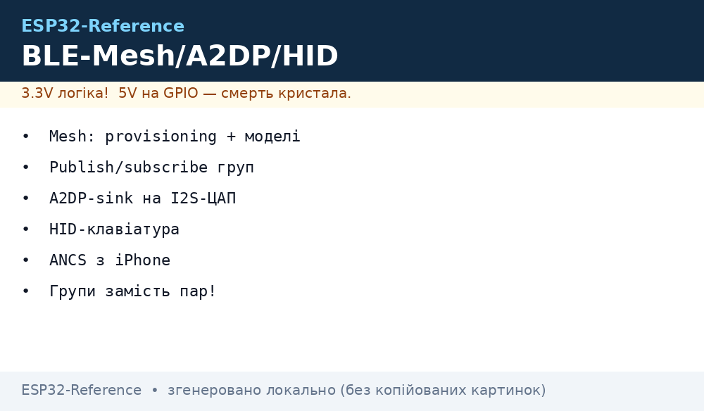
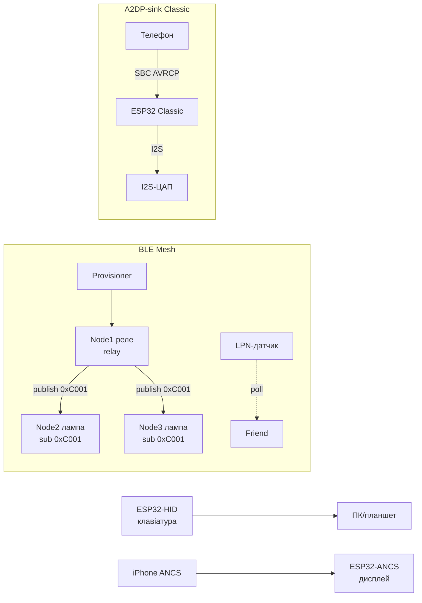

# BLE Mesh, A2DP, HFP, HID і ANCS на ESP32

> [!warning] A2DP/HFP - тільки ESP32 Classic!
> Classic BT (A2DP-sink, HFP hands-free, BT HID) є лише на звичайному ESP32. На S3/C3/C6 класики немає - там тільки BLE (HID через HOGP, звук через I2S/ADF). Вибір чіпа вирішує все.

База BLE: [BLE/Bluetooth](../../../ESP32-Reference/05-Radio/02-BLE-Bluetooth.md), звук: [I2S](../../../ESP32-Reference/04-Shini/04-I2S.md), старт [Home](../../../ESP32-Reference/Home.md).

## Призначення

П'ять різних BLE/BT-ролей, які часто плутають:

- **BLE Mesh (`esp_ble_mesh`)** - мережа «кожен з кожним» для сотень вузлів: provisioning вводить пристрій у мережу, моделі (OnOff/Level/Light) описують поведінку, publish/subscribe на групові адреси керує групами ламп одним пакетом. Managed flooding замість маршрутизації.
- **A2DP-sink** - прийом стерео-музики з телефону (Classic BT) і вивід на I2S-ЦАП. Телефон бачить ESP32 як Bluetooth-колонку. Керування треками - AVRCP.
- **HFP hands-free (оглядово)** - гарнітура для дзвінків (SCO-голос + AT-команди). На ESP32 - базовий аудіо-шлюз, не повноцінна гарнітура з шумозаглушенням.
- **BLE HID-клавіатура** - ESP32 як бездротова клавіатура/пульт (HOGP поверх GATT). Працює на всіх чіпах, включно з S3/C3. Набір тексту - реальний кейс: сканер штрих-кодів, макропад.
- **ANCS-клієнт (оглядово)** - читання сповіщень iPhone (дзвінки, SMS, месенджери) через Apple Notification Center Service. Тільки iOS, потрібне спарювання з bonding.

Коли що: освітлення будинку/офісу - Mesh; колонка з телефону - A2DP-sink (Classic); бездротова кнопка/клавіатура - HID; «дзвінок на дисплеї» з iPhone - ANCS; дзвінки - HFP.

## Параметри стеків

| Параметр | esp_ble_mesh | A2DP-sink | HFP-HF | BLE HID (HOGP) | ANCS-клієнт |
| --- | --- | --- | --- | --- | --- |
| Транспорт | BLE advertising/bearer | BT Classic A2DP | BT Classic HFP/SCO | BLE GATT | BLE GATT (iOS) |
| Чіпи | всі ESP32 (NimBLE/Bluedroid) | тільки Classic | тільки Classic | всі | всі з BLE |
| Ролі | node / provisioner | sink (колонка) | hands-free unit | keyboard/mouse | клієнт |
| Одночасно вузлів | сотні (flood) | 1 джерело | 1 шлюз | 1-3 хости | 1 iPhone |
| Шифрування | NetKey/AppKey/DeviceKey | pairing (SSP) | pairing (SSP) | bonding + MITM | bonding обов'язковий |
| Приклади IDF | `blemesh` (onoff server/client) | `a2dp_sink_stream` | `hfp_hf` | NimBLE HID-приклад | `ble_ancs` |
| Пам'ять | ~100+ КБ під таблиці | SBC-декодер + I2S-DMA | SCO + mSBC | мала (HID-дескриптор) | мала |


*Рис. Mesh-мережа з provisioner і групами, A2DP-потік телефону на I2S-ЦАП, HID-клавіатура і ANCS-сповіщення iPhone.*

### ASCII-схема

```text
BLE MESH (managed flooding, TTL=5):
  Provisioner (телефон nRF Mesh / ESP32) ──PB-GATT──► Node1 (реле, relay ON)
    Node1 ──publish 0xC001──► Node2 (лампа, sub 0xC001) — обидва гаснуть разом
    Node1 ──publish 0xC001──► Node3 (лампа, sub 0xC001)
    Node4 (LPN-датчик, спить) ──poll──► Node5 (friend, тримає чергу)
  Ключі: NetKey (мережа) / AppKey (застосунок) / DevKey (конфігурація вузла)

A2DP-SINK (тільки Classic):
  Телефон (source) ──SBC/AAC──► ESP32 Classic (sink) ──I2S──► MAX98357A/PCM5102A ──► динамік
  AVRCP: play/pause/next ──► назад у телефон

HID (HOGP, будь-який чіп):
  ESP32 ──GATT HID-reports──► ПК/телефон (набір тексту, медіаклавіші)

ANCS (тільки iPhone, bonding):
  iPhone ──ANCS notify──► ESP32-клієнт ──► дисплей "Дзвінок: Марічка"
```

### Mermaid



## esp_ble_mesh: provisioning, моделі, publish/subscribe

**Provisioning** - введення «голого» пристрою в мережу: несе NetKey, unicast-адресу і DevKey. Bearer: PB-ADV (advertising, без з'єднання) або PB-GATT (через з'єднання, зручно телефоном). OOB-аутентифікація (статичний ключ/число) - від MITM при заселенні. Після provisioning - **конфігурація**: AppKey, прив'язка моделей, підписки.

**Моделі (SIG + вендорні):**

| Модель | Opcode-приклад | Що робить |
| --- | --- | --- |
| Generic OnOff Server/Client | `0x8202/0x8203` SET/STATUS | реле, лампа вкл/викл |
| Generic Level Server/Client | `0x8206/0x8208` | яскравість, позиція штор |
| Light Lightness/CTL/HSL Server | `0x824C…` | димери, температура білого, RGB |
| Sensor Server | `0x8231` | датчик шле виміри |
| Time/Scene/Scheduler | сцени | «вечір», розклад |
| Config Server/Client | конфігурація | тільки службова |

**Publish/subscribe і групи.** Модель публікує в адресу (unicast або групову `0xC000-0xFEFF`), інші моделі підписані на неї. Одна команда на `0xC001` гасить весь поверх. All-nodes `0xFFFF` - тільки для тестів (шторм!). TTL обмежує хопи (типово 5); relay-вузли ретранслюють, LPN сплять через friend.

Приклади IDF: `examples/bluetooth/nimble/blemesh` (NimBLE-стек), `examples/bluetooth/esp_ble_mesh` (Bluedroid: `onoff_server`, `onoff_client`, `fast_provisioning`).

## A2DP-sink, AVRC, HFP (оглядово)

**A2DP-sink:** ESP32 реєструється як приймач (`a2dp_sink_stream`, `a2dp_sink_stream_aac`), телефон стрімить SBC (обов'язково) або AAC. Декодований PCM йде в I2S (`BCLK/LRCK/DIN`) на ЦАП - див. [I2S](../../../ESP32-Reference/04-Shini/04-I2S.md) і [кодеки](../../../ESP32-Reference/11-Vivid/13-Audio-Codecs.md). Затримка ~200-500 мс - для відео не годиться, для музики ок.

**AVRCP:** керування (play/pause/next/prev, гучність absolute-volume) і метадані треку (виконавець/назва - вивести на дисплей!). Приклади: `avrcp_ct_metadata`, `avrcp_absolute_volume`. Практика: кнопки на ESP32 шлють AVRCP-команди в телефон.

**HFP hands-free (оглядово):** ролі HF (гарнітура) і AG (шлюз-телефон). Приклад `hfp_hf`: прийняти/відхилити дзвінок, SCO-голос 8 кГц (CVSD) або 16 кГц (mSBC). Якість - рівень простої гарнітури: для домофона/оповіщення вистачить, для музики - ні (для музики беріть A2DP).

| Профіль | Напрям звуку | Якість | Чіп |
| --- | --- | --- | --- |
| A2DP-sink | телефон → ESP32 | стерео 44.1 кГц SBC/AAC | тільки Classic |
| AVRCP | команди + метадані | - | тільки Classic |
| HFP-HF | двосторонній голос | 8/16 кГц моно | тільки Classic |
| BLE HID | звіти клавіш | - | всі |

## BLE HID-клавіатура і ANCS-клієнт (оглядово)

**HID через HOGP:** сервіс `0x1812`, репорти клавіатури/медіа, HID-дескриптор описує розкладку. Бондінг обов'язковий (інакше хост відкине). Кейс «набір тексту»: сканер/ESP32 друкує рядок `send_text("https://…")` + Enter - працює без драйверів на Win/Android/iOS. Енергія: кнопка-cell живе місяцями (advertise рідко, deep-sleep між натисканнями).

**ANCS-клієнт:** приклад `ble_ancs` (NimBLE): підписка на Notification Source/Data Source iOS, запит атрибутів (назва застосунку, заголовок, текст), дії (позитивна/негативна). Вимоги: iPhone, спарювання з bonding, у сповіщеннях iOS дозволено «показ». Android тут не працює (у нього свій MAP/MCS - окрема тема).

## Код - mesh-вузол і A2DP-sink

**ESP-IDF, BLE Mesh: вузол onoff-server (скорочено, приклад `onoff_server`):**

```c
// menuconfig: Bluetooth → Bluedroid/NimBLE + ESP_BLE_MESH, NetKey/AppKey за замовч.
// Provisioning через телефон (nRF Mesh) або приклад fast_provisioning.
#include "esp_ble_mesh_defs.h"
#include "esp_ble_mesh_common_api.h"
#include "esp_ble_mesh_networking_api.h"
#include "esp_ble_mesh_generic_model_api.h"

#define CID_ESP 0x02E5
static uint8_t dev_uuid[16] = { 0xdd, 0xdd };

// onoff-сервер: стан реле
static esp_ble_mesh_gen_onoff_srv_t onoff_server = {
    .rsp_ctrl.get_auto_rsp = ESP_BLE_MESH_SERVER_AUTO_RSP,
    .rsp_ctrl.set_auto_rsp = ESP_BLE_MESH_SERVER_AUTO_RSP,
};

static esp_ble_mesh_model_t root_models[] = {
    ESP_BLE_MESH_MODEL_CFG_SRV(&cfg_server),
    ESP_BLE_MESH_MODEL_GEN_ONOFF_SRV(&onoff_pub, &onoff_server),
};
static esp_ble_mesh_elem_t elements[] = {
    ESP_BLE_MESH_ELEMENT(0, root_models, ESP_BLE_MESH_MODEL_NONE),
};
static esp_ble_mesh_comp_t composition = {
    .cid = CID_ESP, .elements = elements, .element_count = ARRAY_SIZE(elements),
};

static void mesh_cb(esp_ble_mesh_generic_server_cb_event_t event,
                    esp_ble_mesh_generic_server_cb_param_t *param)
{
    if (event == ESP_BLE_MESH_GENERIC_SERVER_STATE_CHANGE_EVT &&
        param->ctx.recv_op == ESP_BLE_MESH_MODEL_OP_GEN_ONOFF_SET) {
        bool on = param->value.state_change.onoff_set.onoff;
        gpio_set_level(GPIO_NUM_2, on); // фізичне реле
    }
}

void app_main(void)
{
    esp_ble_mesh_register_generic_server_callback(mesh_cb);
    esp_ble_mesh_init(&provision, &composition); // provision: UUID, OOB, bearer
    esp_ble_mesh_node_prov_enable(ESP_BLE_MESH_PROV_ADV | ESP_BLE_MESH_PROV_GATT_ADV);
    // Далі: provisioning телефоном → bind AppKey → sub на групу 0xC001
}
```

**ESP-IDF, A2DP-sink на I2S-ЦАП (скорочено, `a2dp_sink_stream`):**

```c
// ТІЛЬКИ ESP32 Classic! menuconfig: Bluetooth Classic + A2DP + I2S.
// Вивід: BCLK=GPIO26, LRCK=GPIO25, DIN=GPIO22 (див. I2S-ноту).
#include "esp_a2dp_api.h"
#include "driver/i2s_std.h"

static i2s_chan_handle_t tx_chan;

static void a2d_cb(esp_a2d_cb_event_t event, esp_a2d_cb_param_t *p)
{
    if (event == ESP_A2D_CONNECTION_STATE_EVT &&
        p->conn_stat.state == ESP_A2D_CONNECTION_STATE_CONNECTED) {
        // телефон підключився — можна гасити blink, показати ім'я на дисплеї
    }
}

static void a2d_data_cb(const uint8_t *data, uint32_t len)
{
    size_t written = 0;
    i2s_channel_write(tx_chan, data, len, &written, portMAX_DELAY); // PCM → ЦАП
}

void app_main(void)
{
    // ... i2s_channel_init_std_mode(tx_chan, 44100, I2S_DATA_BIT_WIDTH_16BIT, STEREO)
    esp_a2d_sink_init();
    esp_a2d_register_callback(a2d_cb);
    esp_a2d_sink_register_data_callback(a2d_data_cb);
    esp_a2d_sink_connect(peer_bd_addr); // або чекати вхідне (discoverable)
    // AVRCP: esp_avrc_ct_send_passthrough_cmd(PLAY/PAUSE/NEXT) з кнопок
}
```

**Arduino (A2DP-sink, Classic):** бібліотека `ESP32-A2DP` (pschatzmann): `BluetoothA2DPSink a2dp; a2dp.start("MySpeaker"); a2dp.set_on_audio_data(...)` або вивід прямо в I2S (`a2dp.set_pin_config(...)`). Mesh під Arduino - беріть приклад IDF `blemesh` (під Arduino-ядром стабільного Mesh-порту немає). HID-клавіатура під Arduino: `ESP32-BLE-Keyboard` (T-vK): `bleKeyboard.print("hello");` - працює і на S3.

**MicroPython:** BLE Mesh, A2DP і HFP у MicroPython не реалізовані (немає Classic-стека і Mesh-моделей). Доступно: BLE GATT/HID-рівень через `bluetooth.BLE()` (див. [BLE](../../../ESP32-Reference/05-Radio/02-BLE-Bluetooth.md)) і I2S-вивід (`machine.I2S`) для локальних WAV. Для Mesh/A2DP тримайте окремий вузол на ESP-IDF.

## Типові помилки

| Симптом | Причина | Рішення |
| --- | --- | --- |
| A2DP не збирається на S3/C3 | немає Classic BT на цих чіпах | тільки ESP32 Classic для A2DP/HFP |
| Mesh-вузол не проходить provisioning | телефон далеко; PB-ADV глушиться WiFi | PB-GATT замість PB-ADV; відстань < 3 м; WiFi тимчасово вимкнути |
| Команда на групу доходить через раз | TTL замалий; немає relay між поверхами | TTL 5-7; увімкнути relay на живлених вузлах |
| Шторм all-nodes `0xFFFF` | широкомовні команди в циклі | групові адреси `0xCxxx`, publish не частіше 5 Гц |
| LPN «мовчить» годинами | poll-interval великий; friend пішов з мережі | poll 5-15 с; heartbeat-моніторинг friend |
| HID не друкує на iOS | немає bonding; CCCD не підписано | bonding + MITM, перевірити HID-дескриптор |
| ANCS порожній | iOS не дав доступ до сповіщень | Налаштування → Bluetooth → (i) → «Сповіщення» увімкнути |
| HFP хрипить | SCO і WiFi одночасно; слабкий БЖ | рознести антени; живлення з запасом 500 мА |
| A2DP заїкається | I2S-DMA замалий; SBC 512 кбіт + WiFi-трафік | DMA ×4 буфери; окремий Classic без WiFi-стріму |

## Офіційні джерела

- [ESP-BLE-MESH - API reference (ESP-IDF)](https://docs.espressif.com/projects/esp-idf/en/latest/esp32/api-reference/bluetooth/esp-ble-mesh.html) - provisioning, моделі, publish/subscribe.
- [Bluetooth API - ESP-IDF](https://docs.espressif.com/projects/esp-idf/en/latest/esp32/api-reference/bluetooth/index.html) - Bluedroid vs NimBLE, Classic vs BLE.
- [Classic BT приклади - esp-idf](https://github.com/espressif/esp-idf/tree/master/examples/bluetooth/bluedroid/classic_bt) - `a2dp_sink_stream`, `hfp_hf`, AVRCP.
- [NimBLE приклади - esp-idf](https://github.com/espressif/esp-idf/tree/master/examples/bluetooth/nimble) - `blemesh`, `ble_ancs`, периферія/центр.

## Див. також

- [Home](../../../ESP32-Reference/Home.md)
- [BLE/Bluetooth](../../../ESP32-Reference/05-Radio/02-BLE-Bluetooth.md) - GATT, NimBLE, beacon, bonding
- [I2S](../../../ESP32-Reference/04-Shini/04-I2S.md) - вивід A2DP-потоку на ЦАП
- [Аудіо-кодеки](../../../ESP32-Reference/11-Vivid/13-Audio-Codecs.md) - ES8388/PCM5102A для A2DP-колонки
- [Matter/Thread/Zigbee](../../../ESP32-Reference/15-Protokoli/09-Matter-Thread-Zigbee.md) - mesh іншого сімейства (802.15.4)
- [DFPlayer/MAX98357A](../../../ESP32-Reference/11-Vivid/08-DFPlayer-MAX98357-Nextion-LCD2004.md) - I2S-підсилювач для sink
- [01-ESP32-Classic](../../../ESP32-Reference/01-Hardware/01-ESP32-Classic.md) - єдиний чіп з A2DP/HFP
