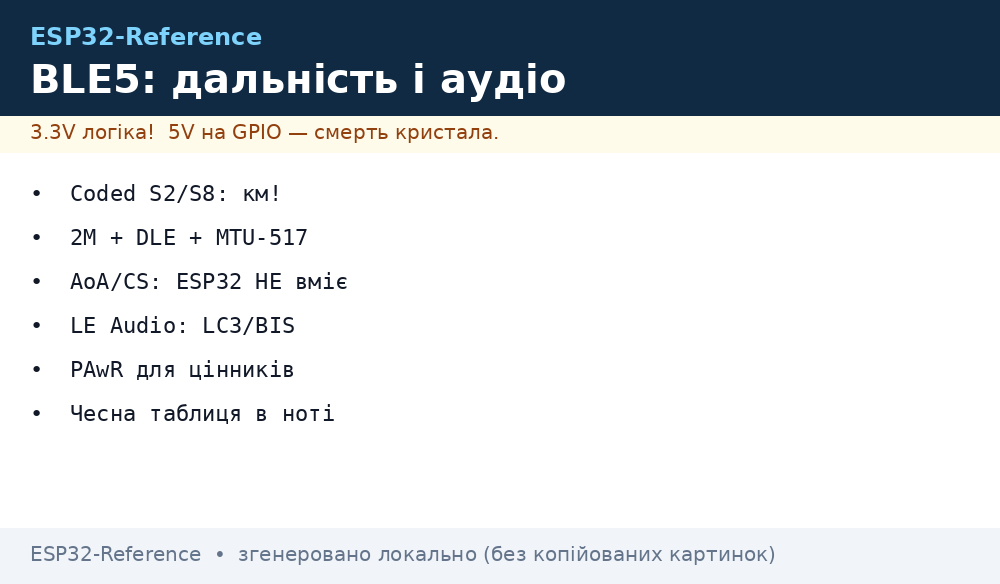
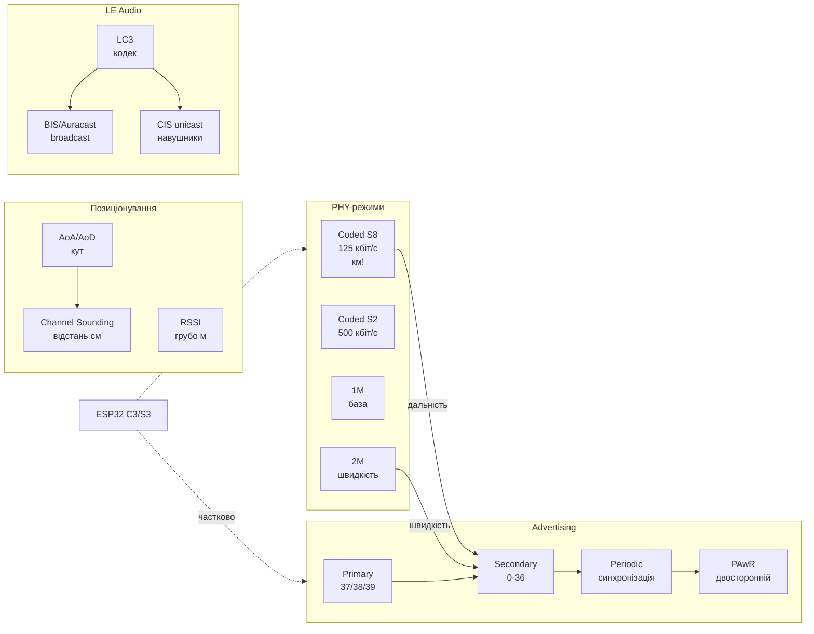

# BLE 5 Long Range і LE Audio на ESP32

База: [BLE/Bluetooth](../../../ESP32-Reference/05-Radio/02-BLE-Bluetooth.md), трекери: [BLE-шлюз і трекер](../../../ESP32-Reference/05-Radio/06-BLE-Gateway-Tracker.md), старт [Home](../../../ESP32-Reference/Home.md).

## Призначення

Bluetooth 5 приніс чотири незалежні речі, які постійно плутають: **дальність** (Coded PHY S2/S8 - кілометри замість десятків метрів), **швидкість** (2M PHY + Data Length Extension - мегабіти для OTA і сенсорів), **напрям і відстань** (Direction Finding AoA/AoD, Channel Sounding - позиціонування без GPS) і **звук нового покоління** (LE Audio: кодек LC3, broadcast Auracast). Плюс службові механізми: Advertising Extensions, Periodic Advertising, PAwR.

Ця нота - карта можливостей з чесною межею: що реально вміє ESP32 (C3/S3/C6/H2 - по-різному!), а що існує лише в специфікації SIG або в чипах Nordic/TI. Практика: поле з датчиками за 500 м - Coded PHY S8; прошивка по повітрю без дроту - 2M + MTU 517; «знайти візок на складі» - AoA-матриця (не ESP32!); колонка для всіх відвідувачів - Auracast (не ESP32!).


*Рис. Coded PHY тягне кілометр, 2M PHY качає мегабіти, AoA-матриця міряє кут, Auracast віщає на всіх - і де в цій картині ESP32.*

### ASCII-схема

```text
CODED PHY S8 (125 кбіт/с, +12 дБ до бюджету лінії):
  Сенсор (TX +6 дБм) ═══════ 800-1000 м прямої видимості ═══════► ESP32-C3/S3 (RX -105 дБм)
  Ціна: ефірний час x8, батарейка швидше сідає при частих adv

2M PHY + DLE + MTU 517 (швидкість):
  ESP32 ──LL PDU 251 Б──► телефон: OTA 300 КБ за ~10 с замість ~60 с на 1M/MTU23

ADVERTISING EXTENSIONS (ланцюжки):
  Primary (37/38/39): ADV_EXT_IND ──pointer──► Secondary (0-36 канали)
  AUX_ADV_IND ──► AUX_CHAIN_IND ──► AUX_CHAIN_IND ... (до 1650 Б даних!)

DIRECTION FINDING (НЕ ESP32 — зовнішня матриця!):
  Маяк (CTE-тон) ──► антена1/2/3/4 (перемикання) ──► IQ-семпли ──► кут φ

LE AUDIO (НЕ ESP32 — оглядово):
  Auracast-передавач ──BIS broadcast──► ♪ слухач1, слухач2, ... слухач∞ (без pairing!)
  Телефон ──CIS unicast──► лівий + правий навушники (синхронно, LC3)
```

### Mermaid



## Coded PHY S2/S8 - дальність у кілометри

Coded PHY не збільшує потужність - він додає **надлишковість**: кожен біт кодується кількома символами (S=2 → 2 символи, S=8 → 8 символів), приймач усереднює шум і витягує сигнал на −12 дБ нижче за звичайний. Ціна - швидкість падає до 500/125 кбіт/с і ефірний час росте.

| PHY | Символів на біт | Швидкість | Чутливість (тип.) | Виграш бюджету | Дальність (пряма видимість) |
| --- | --- | --- | --- | --- | --- |
| 1M (база) | 1 | 1 Мбіт/с | ~−97 дБм | 0 дБ | 50-100 м |
| 2M | 1 (швидші символи) | 2 Мбіт/с | ~−93 дБм | −4 дБ (гірше!) | 30-50 м |
| Coded S2 | 2 | 500 кбіт/с | ~−100…−103 дБм | +5 дБ | 200-400 м |
| Coded S8 | 8 | 125 кбіт/с | ~−103…−105 дБм | +12 дБ | 800-1000+ м |

| Чіп ESP32 | BLE-версія | Coded PHY | 2M PHY | Advertising ext | Коментар |
| --- | --- | --- | --- | --- | --- |
| ESP32 Classic | 4.2 | ні | ні | ні | тільки 1M, для дальності - не він |
| ESP32-S3 | 5.0 | **так (S2/S8)** | так | так | повний BLE5-набір далекобійника |
| ESP32-C3 | 5.0 | **так (S2/S8)** | так | так | дешевий далекобійник, одна антена PCB |
| ESP32-C6 | 5.3 | так | так | так + PAwR | + 802.15.4 (Thread/Zigbee) бонусом |
| ESP32-H2 | 5.3 | так | так | так + PAwR | 802.15.4-фокус, BLE як другий транспорт |

> [!tip] pvvx-термометри вже вміють Long Range
> Прошивка pvvx ATC (див. [трекер](../../../ESP32-Reference/05-Radio/06-BLE-Gateway-Tracker.md)): опція LE Long Range - advertising на Coded S8 + connectable. Заявлено ~1 км прямої видимості при TX +0 дБм. Скидання в BT4.2-режим - вийняти/вставити батарею або команда `0xDD`.

Правила дальності: обидва кінці мусять вміти Coded (телефон BT5.0+ теж!); S8 - для маяків-сенсорів (рідко, коротко), S2 - компроміс; TX-power +6…+10 дБм подвоює дальність, але вимагає живлення (не CR2032!); антена і висота підвісу важать більше за PHY (підніми на 2 м - отримаєш більше, ніж перемиканням S2→S8).

## Advertising extensions - secondary PHY і ланцюжки

Класичний advertising - 31 байт на трьох каналах (37/38/39). Extensions розбивають його на **primary** (короткий вказівник) і **secondary** (повноцінні дані на будь-якому з 37 каналів даних, іншим PHY, ланцюжками до 1650 байт).

| Елемент | Канал | Що несе |
| --- | --- | --- |
| `ADV_EXT_IND` (primary) | 37/38/39 | вказівник: де і коли secondary (канал, offset, PHY) |
| `AUX_ADV_IND` (secondary) | 0-36 | дані, іншим PHY (1M/2M/Coded - на вибір!) |
| `AUX_CHAIN_IND` | 0-36 | продовження ланцюжка (великі payload) |
| `AUX_SYNC_IND` (periodic) | 0-36 | періодичні дані для синхронізованих слухачів |

| Сценарій | Primary | Secondary | Навіщо |
| --- | --- | --- | --- |
| Маяк S8 | 1M вказівник | Coded S8 дані | старі сканери бачать хоч вказівник |
| Швидкий сенсор | 1M вказівник | 2M дані | більше даних за той же ефір |
| BTHome-термометр ext | 1M | 1M coded | сумісність + запас дальності |

Обмеження ESP32: прийом ext-advertising - так (C3/S3/C6); передача ланцюжків - базова; довгі chains у MicroPython/Arduino - часто обрізаються стеком, для повного контролю беріть ESP-IDF NimBLE API (`ble_gap_ext_adv_*`).

## 2M PHY + Data Length Extension + MTU-517 - тюнінг пропускної

Три незалежні множники швидкості з'єднання: швидші символи (2M), довші пакети (DLE), більші ATT-кадри (MTU). Усі три треба узгодити ОБОМ сторонам - інакше працює мінімум.

| Множник | Було (BT 4.2) | Стало (BT 5) | Виграш |
| --- | --- | --- | --- |
| PHY | 1M | 2M | ×2 |
| LL PDU (DLE) | 27 Б | 251 Б | ×9 менше overhead |
| ATT MTU | 23 (20 корисних) | 517 (512 корисних) | ×25 менше фрагментації |

| Конфігурація | Теоретично | Практика (ESP32↔телефон) | Кейс |
| --- | --- | --- | --- |
| 1M, MTU 23, DLE off | ~10 кБ/с | 5-8 кБ/с | сумісність з усім |
| 1M, MTU 185, DLE on | ~100 кБ/с | 30-60 кБ/с | типовий NimBLE-дефолт |
| 1M, MTU 517, DLE 251 | ~300 кБ/с | 80-150 кБ/с | сенсори-стріми |
| **2M, MTU 517, DLE 251** | **~1.4 Мбіт/с** | **200-400 кбіт/с** | OTA, швидко і стабільно |
| 2M + Coded mix | - | перемикання на льоту | швидкість поруч, дальність далеко |

Тюнінг-чеклист: `ble_att_set_preferred_mtu(517)` (IDF) / `ble.config(mtu=517)` (MicroPython) / MTU-exchange в Arduino-NimBLE; DLE - `esp_ble_gap_set_pkt_data_len()` або NimBLE-дефолт on; 2M - `ble_gap_set_prefered_le_phy(..., TX_2M, RX_2M)`; conn-interval 15-30 мс для швидкості (ціною струму!); notify без response (без ACK) замість indicate.

> [!warning] Швидкість ≠ дальність, обирай одне
> 2M PHY гірше чує на −4 дБ - для OTA поруч це ок, для поля - вбивця лінку. Стратегія: з'єднання починати на 1M/Coded, перемикатись на 2M лише при RSSI > −70 дБм. Coded і 2M одночасно на одному пакеті неможливі - це або-або на кожен напрям.

## Direction Finding - AoA / AoD (антенні матриці, точність)

Ідея: передавач шле **CTE-тон** (немодульована несуча в хвості пакета), приймач перемикає антени матриці і міряє фазу приходу - різниця фаз = кут. AoA (Angle of Arrival): матриця на локаторі, маяк дешевий. AoD (Angle of Departure): матриця на передавачі, локатор - телефон.

| Параметр | AoA | AoD |
| --- | --- | --- |
| Матриця антен | на приймачі (локатор) | на передавачі (маяк) |
| Хто рахує | локатор | телефон/тег |
| Кейс | «знайти візок на складі» (інфраструктура розумна) | «навігація в ТЦ» (телефон розумний) |
| Точність (ідеал) | 1-3° (сантиметри на 10 м) | 1-3° |
| Точність (цех з металом) | 5-15° (багат Eminence відбиття!) | так само гірше |
| Ціна | матриця 4-12 антен + RF-перемикач | те саме, але на кожному маяку |

| Вузол | Що треба | Чи вміє ESP32 |
| --- | --- | --- |
| CTE-передача | додати тон у хвіст пакета | частково (контролер C3/S3 - обмежено, без матриці безглуздо) |
| CTE-прийом + IQ-семпли | радіо з дискретизацією IQ | **ні** (немає API IQ у IDF) |
| Перемикання антен | GPIO-синхронізований RF-switch | можливо залізно, але стек не веде |
| Обчислення кута | MUSIC/ESPRIT або таблиці | можливо (математика на ESP32-S3 ок), але немає звідки взяти IQ |

Висновок чесний: **Direction Finding на ESP32 не реалізується штатними засобами** - потрібен чип з IQ-підтримкою (Nordic nRF52811/nRF5340, TI CC26x2) + матриця. ESP32 у такій системі - транспортний шлюз (зібрав кути з Nordic-локаторів → відправив у MQTT), або грубий RSSI-бекап (див. трекер-ноту).

## Channel Sounding - ranging (вимір відстані)

Channel Sounding (BT 5.4 / Core 6.x гілка) - двосторонній вимір **фази і часу прольоту (RTT)** на багатьох каналах: пристрої стрибають каналами, міряють фазовий нахил → відстань у сантиметрах + перевірка безпеки (anti-spoofing для ключів).

| Метод | Точність | Безпека | Залізо |
| --- | --- | --- | --- |
| RSSI (усі вміють) | метри (±2-5 м у приміщенні) | нуль (підсилювач обманює) | будь-який ESP32 |
| CTE/AoA-кут | градуси | низька | Nordic/TI матриця |
| **Channel Sounding RTT+фаза** | **сантиметри (±10-30 см)** | **висока (крипто-handshake)** | BT 5.4+ радіо з підтримкою |
| UWB (конкурент) | сантиметри (±10 см) | висока | окремий чип (не BLE) |

Статус для ESP32: **не підтримується** (потрібен контролер BT 5.4+ з CS-процедурами; у лінійці Espressif на 2026 - відсутній). Кейси, де CS виграє: цифровий ключ авто (relay-атака не проходить), «знайди мій I2C-адаптер» з точністю до дивана, доступ за наближенням. Поки що на ESP32 - RSSI + фільтри (див. трекер), для сантиметрів - окремий UWB/Nordic-модуль поруч.

## Periodic advertising + PAwR

| Режим | Як працює | Період | Кейс |
| --- | --- | --- | --- |
| Legacy adv | шле завжди, слухач сканує завжди | 20 мс - 10 с | маяки |
| **Periodic (PA)** | передавач шле строго періодично, слухач синхронізується і спить між вікнами | 7.5 мс - 81 с | датчики-трансляції, Auracast- discovery |
| **PAwR (з відгуком)** | слухач має свій слот для відповіді в періоді | ті ж | ESL-цінники, mesh-датчики без з'єднань! |

PAwR (Periodic Advertising with Responses, BT 5.4) - зірка для **електронних цінників (ESL)** і сенсорних полів: тисяча тегів слухає один періодичний потік і відповідає кожен у своєму слоті - без жодного з'єднання, батареї роками. ESP32-C6/H2 заявляють PAwR-підтримку на рівні контролера; приклади IDF - шукай `periodic_adv` / `pawr` у `examples/bluetooth/`.

| ESL-система на PAwR | Роль |
| --- | --- |
| ESP32-C6 (координатор) | періодичний передавач + збір слотів-відповідей → MQTT |
| Теги-цінники | синхронізовані слухачі зі слотом |
| HA | ціни/шаблони → координатор → ефір |

## LE Audio - LC3, BIS/Auracast, BAP/CAP/HAP/TMAP

LE Audio - звук поверх BLE-isochronous каналів: новий кодек **LC3** (краще за SBC у 2 рази за бітріंतु), unicast (CIS - навушники) і broadcast (BIS - Auracast на необмежену кількість слухачів).

| Блок | Що це | Приклад |
| --- | --- | --- |
| **LC3** (кодек) | Low Complexity Communication Codec, 8-48 кГц, 16-320 кбіт/с | заміна SBC/mSBC всюди |
| **BIS** (broadcast isochronous) | один передавач → ∞ слухачів, без pairing | Auracast в аеропорту |
| **CIS** (connected isochronous) | синхронні двосторонні потоки в з'єднанні | лівий+правий навушники без розсинхрону |
| **BAP** (basic audio profile) | база: виявлення, кодеки, потоки | фундамент усього |
| **CAP** (common audio) | unicast + broadcast керування разом | перемикання «навушники ↔ колонка» |
| **HAP** (hearing aid) | профіль слухових апаратів | слуховий апарат як гарнітура |
| **TMAP** (telephony/media) | телефонія + медіа | дзвінки через LE Audio |
| **Auracast** (бренд, не профіль!) | BIS + стандартні оголошення + UX | «підключись до ТВ у барі QR-кодом» |

| Параметр LC3 vs SBC | SBC (Classic) | LC3 (LE Audio) |
| --- | --- | --- |
| Бітрейт стерео «прозоро» | ~345 кбіт/с | ~160-192 кбіт/с |
| Затримка кадру | ~20+ мс | 7.5 / 10 мс |
| Втрата пакету | чутно клацання | PLC-маскування (менше чутно) |
| Енергія декоду | вища | нижча (простіший на DSP) |

### Чесна таблиця «що вміє ESP32, а що ні»

| Фіча | Статус на ESP32 (2026) | Що робити |
| --- | --- | --- |
| Coded PHY S2/S8 | **так** (S3/C3/C6/H2) | використовувати для дальності |
| 2M PHY + DLE + MTU 517 | **так** | OTA і стріми сенсорів |
| Advertising extensions | **частково** (прийом ок, chains обмежено) | IDF NimBLE для повного контролю |
| Periodic adv / PAwR | **частково** (C6/H2 контролер, приклади сирі) | ESL-пілоти на C6, не прод |
| AoA/AoD | **ні** (немає IQ API) | Nordic/TI локатор + ESP32-шлюз |
| Channel Sounding | **ні** | чекати / UWB-модуль поруч |
| CIS/BIS isochronous | **ні** (немає ISO-транспорту в IDF) | немає LE Audio на ESP32 |
| LC3 кодек | **ні** (немає стека; порт Fraunhofer можливий, але без транспорту безглуздо) | звук - Classic A2DP (див. Mesh/A2DP-ноту) або I2S + WiFi |
| Auracast-прийом/передача | **ні** | телефон + Nordic Auracast-донгл |
| BAP/CAP/HAP/TMAP | **ні** | оглядово знати терміни для ТЗ |

> [!warning] A2DP ≠ LE Audio
> Музика з телефону на ESP32 сьогодні - це Classic A2DP (SBC/AAC) і лише на ESP32 Classic (див. [Mesh/A2DP](../../../ESP32-Reference/05-Radio/05-BLE-Mesh-A2DP-HID.md)). LE Audio на ESP32 немає і не анонсовано - не закладай у проєкти 2026.

## Isochronous обмеження - чому звуку немає

Isochronous-канали (CIS/BIS) вимагають від контролера **жорсткого розкладу**: слоти кожні 7.5/10 мс, синхронні черги, flush-timeout для прострочених пакетів, шифрування BIS-груповим ключем. Контролер ESP32 цього розкладу не веде, хост IDF ISO API не експонує, прикладів `iso_*` в IDF немає. Порт самого LC3-декодера (C-код Fraunhofer) на S3 технічно можливий (FPU+DSP вистачить на 1-2 потоки), але без ISO-транспорту нікуди подіти пакети вчасно - джитер WiFi/BLE-стека з'їсть синхронізацію лівого/правого каналів. Тому: звук на ESP32 = I2S + A2DP-Classic / WiFi-стрім, а LE Audio - знати для вибору заліза (навушники/слухові апарати - Nordic/Qualcomm-сторона).

## Код - PHY, MTU, ext-adv у трьох фреймворках

**ESP-IDF (NimBLE: Coded PHY + 2M + MTU 517, сканер далекобійника):**

```c
// Далекобійний сканер: Coded-прийом + MTU 517. Чіп C3/S3/C6!
#include "nimble/nimble_port.h"
#include "host/ble_hs.h"
#include "host/ble_gap.h"

static int gap_event(struct ble_gap_event *ev, void *arg)
{
    if (ev->type == BLE_GAP_EVENT_DISC) {
        // ev->disc.phy: BLE_HCI_LE_PHY_1M / _2M / _CODED — логуємо яким прийняли
        printf("MAC %02X.. rssi %d phy %d\n",
               ev->disc.addr.val[0], ev->disc.rssi, ev->disc.phy);
    }
    if (ev->type == BLE_GAP_EVENT_MTU) {
        printf("MTU узгоджено: %d\n", ev->mtu.value); // чекаємо 517
    }
    return 0;
}

void app_main(void)
{
    nimble_port_init();
    ble_att_set_preferred_mtu(517);       // просимо максимум
    nimble_port_freertos_init(NULL);
    // Переважний PHY: прийом Coded (дальність), передача 1M (сумісність)
    ble_gap_set_prefered_le_phy(0, BLE_HCI_LE_PHY_CODED, BLE_HCI_LE_PHY_1M,
                                BLE_HCI_LE_PHY_CODED);
    struct ble_gap_disc_params p = { .passive = 1 };
    ble_gap_disc(0, BLE_HS_FOREVER, &p, gap_event, NULL);
}
// Передача ext-adv: ble_gap_ext_adv_configure() + ble_gap_ext_adv_start()
// (secondary Coded S8, connectable) — див. приклад nimble/blemesh ext_adv.
```

**Arduino (NimBLE: PHY + MTU + ext-scan):**

```cpp
#include <NimBLEDevice.h>

class CB : public NimBLEAdvertisedDeviceCallbacks {
  void onResult(NimBLEAdvertisedDevice* d) override {
    // d->getRSSI(), d->getAddressType(), adv-дані; PHY видно в логах стека
    Serial.printf("found %s rssi %d\n",
      d->getAddress().toString().c_str(), d->getRSSI());
  }
};

void setup() {
  Serial.begin(115200);
  NimBLEDevice::init("lr-scanner");
  NimBLEDevice::setMTU(517);                    // просимо 517
  NimBLEDevice::setPreferredPhy(0, 0x04, 0x04); // 0x04 = Coded (S2/S8 авто)
  // Альтернатива швидкості: setPreferredPhy(2, 2) = 2M обидва напрями
  auto* scan = NimBLEDevice::getScan();
  scan->setAdvertisedDeviceCallbacks(new CB());
  scan->setActiveScan(false);
  scan->setInterval(160); scan->setWindow(160); // щільний прийом Coded
  scan->start(0, nullptr, false);
}
void loop() {}
// Перевірка PHY: nRF Connect → Device info → PHY; дальній тест — поле, S8-маяк pvvx.
```

**MicroPython (база 1M + MTU-запит; Coded/ext - обмежено):**

```python
import bluetooth
ble = bluetooth.BLE()
ble.active(True)
ble.config(mtu=517)  # попросити максимум (сторгується сам)

def irq(ev, data):
    if ev == 5:  # SCAN_RESULT
        _a, _addr, _t, rssi, adv = data
        print("adv", rssi, adv[:8])
    elif ev == 22:  # MTU_EXCHANGED (порт-залежно)
        print("mtu", data)

ble.irq(irq)
# Увага: Coded PHY / ext-adv / 2M-вибір у порті MicroPython не експоновані —
# далекобій і тюнінг PHY робіть на ESP-IDF/Arduino, тут лише прийом сенсорів.
ble.gap_scan(0, 100000, 100000, False)
import time
while True:
    time.sleep(1)
```

Польовий тест дальності: маяк pvvx S8 на вікні → сканер C3 з ноутбуком (`idf.py monitor`, RSSI-лог) → відходити до −100 дБм (межа S8) проти −93 дБм (межа 1M). Різницю в метрах запиши в таблицю проєкту - це і є «карта покриття».

## Типові помилки

| Симптом | Причина | Лікування |
| --- | --- | --- |
| Coded PHY не вмикається на ESP32 Classic | чіп 4.2, немає Coded взагалі | тільки S3/C3/C6/H2 для Long Range |
| S8 не дає кілометр у місті | немає прямої видимості, 2.4 ГГц глушать стіни/WiFi | вікно→вікно, антени вище, S8 + TX +6 дБм |
| Телефон не бачить Coded-маяк | телефон BT < 5.0 або iOS ріже Coded-adv | перевірити nRF Connect → PHY; fallback 1M-вказівник |
| MTU лишилось 23 | друга сторона не відповіла на exchange | викликати exchange явно, читати `getMTU()`, фрагментувати |
| DLE увімкнено, швидкість та сама | conn-interval 100+ мс душить | interval 15-30 мс для OTA, назад 50+ для батареї |
| 2M рве з'єднання на межі дальності | −4 дБ чутливості проти 1M | авто-fallback на 1M при RSSI < −75 дБм |
| Ext-adv видно в nRF, ESP32 мовчить | Arduino-стек без ext-scan / старий IDF | свіжий IDF + NimBLE ext-scan, приклад `blecent` |
| Ланцюжки AUX_CHAIN обрізані | буфер adv малий (MicroPython/Arduino) | парсити в IDF або скоротити payload маяка |
| PAwR-приклад не збирається | чіп без 5.4-контролера (S3/C3) | тільки C6/H2, гілка IDF master/latest |
| AoA «кут стрибає ±20°» | спроба без матриці / залізні відбиття | визнати: треба Nordic-матриця; ESP32 - лише шлюз |
| LE Audio приклад не знаходиться | ISO-транспорту немає в IDF | не шукати: звук - A2DP-Classic або I2S/WiFi |
| Auracast-донгл не парується з ESP32 | pairing у BIS не існує (broadcast!) | слухати телефоном з LE Audio, ESP32 тут ні до чого |

> [!tip] Чек-лист «дальність не та»
>
> 1. Обидва кінці BT5.0+? 2. Coded S8 на передачу ввімкнено? 3. Пряма видимість є? 4. TX-power який (0 чи +6)? 5. Антена зовнішня чи PCB-під-козирком? 6. RSSI-лог на межі (−100 S8 / −93 1M)? Пункти 3 і 5 вирішують частіше за PHY.

## Офіційні джерела

- [Bluetooth Tech Overview - PHY, топології, позиціонування](https://www.bluetooth.com/learn-about-bluetooth/tech-overview/) - таблиця 1M/2M/Coded, чутливість, AoA/AoD/Channel Sounding місце в стеку.
- [Bluetooth LE Audio](https://www.bluetooth.com/learn-about-bluetooth/bluetooth-technology/le-audio/) - LC3, Multi-Stream, Auracast broadcast, слухові апарати.
- [ESP-IDF Bluetooth API (ESP32)](https://docs.espressif.com/projects/esp-idf/en/latest/esp32/api-reference/bluetooth/index.html) - Bluedroid vs NimBLE, приклади `bluetooth/nimble`, `ble_uart_service`.
- [ESP-IDF Bluetooth API (ESP32-C3)](https://docs.espressif.com/projects/esp-idf/en/latest/esp32c3/api-reference/bluetooth/index.html) - BLE5 на C3: відмінності від Classic (немає BR/EDR).
- [ESPresense MQTT reference](https://espresense.com/configuration/mqtt/) - як RSSI перетворюється на дистанцію на практиці (absorption/tx_ref).
- [pvvx ATC_MiThermometer](https://github.com/pvvx/ATC_MiThermometer) - живий приклад LE Long Range S8 на маяку (~1 км) + ext-adv.
- [TelinkMiFlasher](https://pvvx.github.io/ATC_MiThermometer/TelinkMiFlasher.html) - увімкнення Long Range на термометрі з браузера.
- [ESPHome Bluetooth Proxy](https://esphome.io/components/bluetooth_proxy.html) - active vs passive скан, що бачить проксі з ext-advertising.

## Див. також

- [Home](../../../ESP32-Reference/Home.md)
- [BLE/Bluetooth](../../../ESP32-Reference/05-Radio/02-BLE-Bluetooth.md) - GATT, NimBLE, beacon, MTU-база
- [BLE Mesh / A2DP / HID](../../../ESP32-Reference/05-Radio/05-BLE-Mesh-A2DP-HID.md) - Classic-звук (A2DP), поки LE Audio немає
- [BLE-шлюз і трекер](../../../ESP32-Reference/05-Radio/06-BLE-Gateway-Tracker.md) - RSSI-дистанція, ESPresense/Bermuda на практиці
- [MQTT](../../../ESP32-Reference/15-Protokoli/01-MQTT.md) - транспорт для шлюзів і координаторів
- [05-Cloud-Pipeline](../../../ESP32-Reference/15-Protokoli/05-Cloud-Pipeline.md) - куди складати RSSI/кути/телеметрію
- [Sleep / ULP](../../../ESP32-Reference/07-Timeri-Son/03-Sleep-ULP.md) - маяки на батареї: adv-інтервал, Coded-ціна струму
