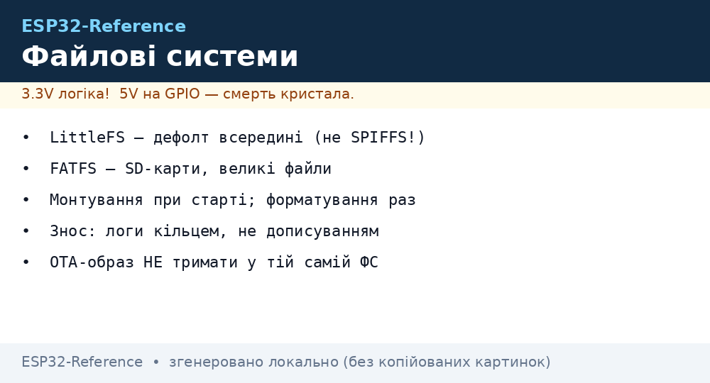
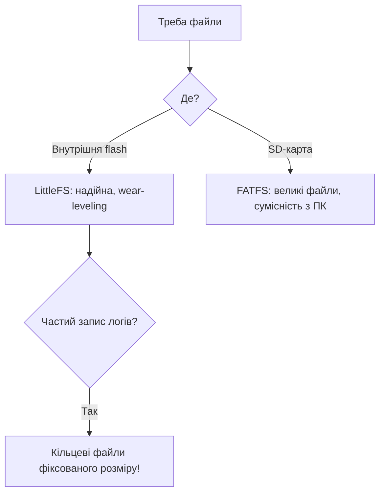

# Файлові системи ESP32

Внутрішня [flash](../../../ESP32-Reference/Home.md) (через partitions) або зовнішня SD-карта дають ESP32 повноцінні файли: конфіги, логи, веб-сторінки, OTA-образи. Вибір ФС впливає на надійність, швидкість і знос. Пов'язано з [типом flash](../../../ESP32-Reference/01-Hardware/06-Flash-PSRAM.md) та [розкладкою partitions](../../../ESP32-Reference/08-Pamyat/01-Partitions-NVS.md).

> [!IMPORTANT]
> SPIFFS **deprecated** в Arduino-ESP32 ≥ 2.x та IDF ≥ 5.x. Нові проєкти - тільки **LittleFS**.


*Рис. LittleFS (внутрішня) vs FATFS (SD): монтування, знос, ліміти розміру.*

## Призначення

Файлові системи ESP32 - Порівняння файлових систем; Розмітка partition під ФС; Форматування та монтування. Внутрішня Home (через partitions) або зовнішня SD-карта дають ESP32 повноцінні файли: конфіги, логи, веб-сторінки, OTA-образи. Вибір ФС впливає на надійність, швидкість і знос. Пов'язано з [06-Flash-PSRAM](../../../ESP32-Reference/01-Hardware/06-Flash-PSRAM.md) та [01-Partitions-NVS](../../../ESP32-Reference/08-Pamyat/01-Partitions-NVS.md). SPIFFS deprecated в Arduino-ESP32 ≥ 2.x та IDF ≥ 5.x. Нові проєкти - тільки LittleFS.

## 1. Порівняння файлових систем

| Критерій | LittleFS ✅ | SPIFFS ⚠️ | FAT (FFat) | SD (SDMMC/SPI) |
| --- | --- | --- | --- | --- |
| Призначення | Внутрішня flash | Внутрішня flash (legacy) | Внутрішня flash / USB | Зовнішня карта |
| Надійність при втраті живлення | Висока (journaling, COW) | Низька (биття при записі) | Середня | Середня |
| Швидкість запису | Швидка | Повільна, деградація з часом | Середня | Найшвидша (SDMMC 4-bit) |
| Підкаталоги | Так | Ні (flat) | Так | Так |
| Знос flash (wear-leveling) | Так, динамічний | Так, слабкий | Так (через WL-драйвер) | Контролер карти |
| Макс. обсяг | Розмір partition (≤ ~3 МБ) | Те саме | Те саме | До 32 ГБ (SDHC) |
| Підтримка IDF 5.x | Так (`littlefs` компонент) | Видалено | Так (`fatfs`) | Так |
| Підтримка Arduino | `LittleFS.h` | `SPIFFS.h` (legacy) | `FFat.h` | `SD.h` / `SD_MMC.h` |

> [!NOTE]
> Для вебу (HTML/CSS/JS) і конфігів беріть LittleFS. Для логів великого обсягу або камери - SD-карту.

## 2. Розмітка partition під ФС

| ФС | SubType в CSV | Приклад рядка |
| --- | --- | --- |
| LittleFS / SPIFFS | `spiffs` | `littlefs, data, spiffs, 0x3D0000, 0x30000,` |
| FAT | `fat` | `storage, data, fat, 0x3D0000, 0x100000,` |
| NVS | `nvs` | Не плутати з файловою системою! |

> [!TIP]
> Типовий розмір LittleFS: 256 КБ - 1.5 МБ. Менше 128 КБ форматування часто падає.

## 3. Форматування та монтування

### ESP-IDF - LittleFS

```c
#include "esp_littlefs.h"
esp_vfs_littlefs_conf_t conf = {
    .base_path = "/littlefs",
    .partition_label = "littlefs",
    .format_if_mount_failed = true,   // автоформат при першому старті
    .dont_mount = false,
};
esp_vfs_littlefs_register(&conf);
size_t total, used;
esp_littlefs_info("littlefs", &total, &used);
```

### Arduino - LittleFS

```cpp
#include <LittleFS.h>
void setup() {
  Serial.begin(115200);
  if (!LittleFS.begin(true)) {          // true = format on fail
    Serial.println("LittleFS mount failed!");
    return;
  }
  Serial.printf("Total %u, used %u\n", LittleFS.totalBytes(), LittleFS.usedBytes());
}
void loop() {}
```

### MicroPython - вбудована FAT / LittleFS

```python
import os, machine
# Внутрішня flash вже змонтована як /
print(os.listdir("/"))
print(os.statvfs("/"))   # (bsize, frsize, blocks, bfree, ...)
# SD-карта по SPI:
# import sdcard
# spi = machine.SPI(1, sck=machine.Pin(18), mosi=machine.Pin(23), miso=machine.Pin(19))
# sd = sdcard.SDCard(spi, machine.Pin(5))
# os.mount(sd, "/sd")
```

## 4. Запис і читання файлів

### ESP-IDF (POSIX API поверх VFS)

```c
FILE *f = fopen("/littlefs/config.txt", "w");
fprintf(f, "ssid=%s\n", "MyWiFi");
fclose(f);
char buf[64];
f = fopen("/littlefs/config.txt", "r");
fgets(buf, sizeof(buf), f);
fclose(f);
```

### Arduino (LittleFS + SD)

```cpp
#include <LittleFS.h>
void write_read_demo() {
  File f = LittleFS.open("/config.txt", "w");
  f.println("ssid=MyWiFi");
  f.close();
  f = LittleFS.open("/config.txt", "r");
  while (f.available()) Serial.write(f.read());
  f.close();
}
// SD по SDMMC (1-bit за замовчуванням на більшості плат):
// #include <SD_MMC.h>
// SD_MMC.begin("/sdcard", true);
```

### MicroPython

```python
with open("/config.txt", "w") as f:
    f.write("ssid=MyWiFi\n")
with open("/config.txt") as f:
    print(f.read())
```

## 5. Знос flash та довговічність

| Фактор | Вплив | Рекомендація |
| --- | --- | --- |
| Циклів перезапису NOR-flash | ~100 000 на сектор | Не писати логи щосекунди у flash |
| Розмір сектора | 4096 байт | Писати буферами ≥ 512 Б, рідше |
| Wear-leveling LittleFS | Рівномірний | Працює автоматично |
| Часті лічильники | Вбивають один сектор | Тримати в RTC-RAM, писати раз на годину |
| Логи | Швидкий знос | Логи → SD-карта або сервер, не flash |

> [!WARNING]
> Запис кожні 5 с у той же файл вбиває partition за місяці. Стратегія: кеш у RAM → `flush()` раз на 10 хв → ротація файлів.

Розрахунок: 100 000 циклів × 10 хв інтервал ≈ 1000 000 хв ≈ **1.9 року** мінімум; з wear-leveling на 1 МБ - у рази більше.

## 6. Команди та діагностика

| Команда | Що робить |
| --- | --- |
| `mklittlefs -c data/ -s 0x30000 image.bin` | Зібрати образ LittleFS для заливки |
| `esptool.py write_flash 0x3D0000 littlefs.bin` | Залити образ за offset з CSV |
| `idf.py menuconfig` → LittleFS | Налаштувати base_path, auto-format |
| `LittleFS.format()` | Форматування з Arduino |
| `os.statvfs("/")` | Вільне місце в MicroPython |

### Mermaid: вибір ФС



## Типові помилки

| # | Помилка | Чому погано | Як правильно |
| --- | --- | --- | --- |
| 1 | SPIFFS у новому проєкті | Deprecated, крихкий | LittleFS |
| 2 | Дописування одного логу роками | Знос сектора | Кільце / ротація |
| 3 | Немає pull-up на SD-DAT | Плаває в idle | Pull-up обов'язково |
| 4 | OTA-образ у тій самій ФС | Немає місця/конфлікт | Окремий partition |

## Офіційні джерела

- [LittleFS + FATFS (ESP-IDF Storage)](https://docs.espressif.com/projects/esp-idf/en/latest/esp32/api-reference/storage/index.html) - монтування, VFS.
- [Wear Levelling Guide](https://docs.espressif.com/projects/esp-idf/en/latest/esp32/api-reference/storage/wear-levelling.html) - знос flash.

## Див. також

- [Home](../../../ESP32-Reference/Home.md)
- [06-Flash-PSRAM](../../../ESP32-Reference/01-Hardware/06-Flash-PSRAM.md)
- [01-Partitions-NVS](../../../ESP32-Reference/08-Pamyat/01-Partitions-NVS.md)
- [OTA](../../../ESP32-Reference/08-Pamyat/03-OTA.md)
- [04-Secure-Boot-Encrypt](../../../ESP32-Reference/08-Pamyat/04-Secure-Boot-Encrypt.md)
- [02-Arduino-PlatformIO](../../../ESP32-Reference/09-Proshivka/02-Arduino-PlatformIO.md)
- [MicroPython](../../../ESP32-Reference/09-Proshivka/03-MicroPython.md)
- [04-Esptool-Flash](../../../ESP32-Reference/09-Proshivka/04-Esptool-Flash.md)
