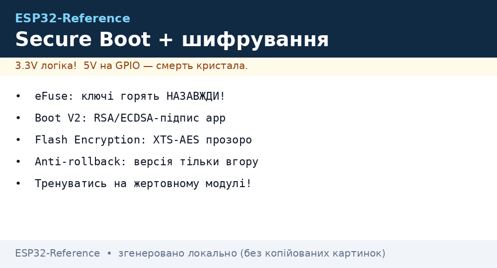
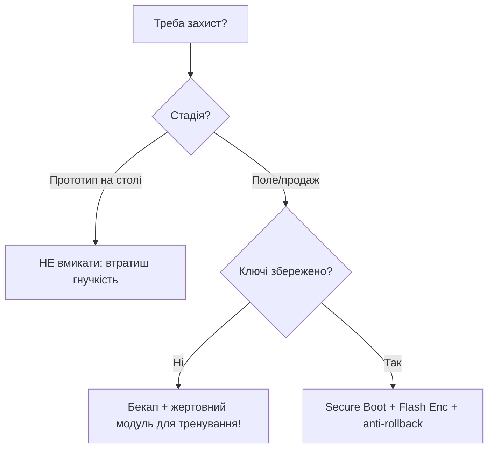

# Secure Boot та Flash Encryption

Захист прошивки ESP32 будується на трьох китах: **eFuse** (одноразові біти), **Secure Boot V2** (перевірка підпису) та **Flash Encryption** (шифрування [flash](../../../ESP32-Reference/Home.md)). Разом вони закривають [OTA](../../../ESP32-Reference/08-Pamyat/03-OTA.md) і фізичний доступ. Ціна - **незворотність**: помилка = цегла.

> [!CAUTION]
> eFuse перегорають **назавжди**. Увімкнення Secure Boot / Encryption на тестовому зразку без бекапу ключів знищує пристрій для розробки. Тренуйтеся на жертовному модулі.


*Рис. Ланцюг довіри: eFuse → Secure Boot V2 (підпис) → XTS-AES шифрування flash.*

## Призначення

Secure Boot та Flash Encryption - eFuse - апаратний корінь довіри; Flash Encryption; Secure Boot V2. Після Release-режиму esptool.py read_flash повертає шифротекст. Бекап робіть до ввімкнення. Охоплює Secure Boot V2 (перевірка підпису), шифрування Flash (XTS-AES) та необоротні eFuse-біти.

## 1. eFuse - апаратний корінь довіри

| Блок eFuse | Що зберігає | Одноразовий? |
| --- | --- | --- |
| `BLOCK_KEY0` | Ключ Flash Encryption (256 біт) | Так, запис один раз |
| `BLOCK_KEY1` | Ключ Secure Boot V2 (ECDSA/RSA) | Так |
| `FLASH_CRYPT_CNT` | Лічильник увімкнення шифрування | Так (непарне = ON) |
| `SECURE_BOOT_EN` | Прапор Secure Boot | Так |
| `DIS_DOWNLOAD_MODE` | Заборона UART-завантаження | Так |
| `DIS_USB_JTAG` | Заборона USB-JTAG (S3) | Так |
| `MAC`, калібрування | Заводські дані | Ні (записано на заводі) |

Перегляд (IDF):

```bash
espefuse.py --port /dev/ttyUSB0 summary
espefuse.py --port /dev/ttyUSB0 dump
```

> [!NOTE]
> `espefuse.py` читає без знищення. Запис (`burn_key`, `burn_efuse`) - точка неповернення.

## 2. Flash Encryption

| Параметр | ESP32 (classic) | ESP32-S3 / C3 / S2 |
| --- | --- | --- |
| Алгоритм | AES-256-XTS | AES-256-XTS |
| Ключ | eFuse BLOCK_KEY0, генерується пристроєм | Те саме |
| Режим | Release / Development | Release / Development |
| Шифрується | app + NVS (опційно) | Те саме + PSRAM (S3, опційно) |

Увімкнення (Development-режим для тестів):

```bash
idf.py menuconfig
# Security features → Enable flash encryption on boot
#                   → Development (NOT SECURE) — дозволяє перепрошивання
idf.py build flash monitor
# Перше завантаження: ключ генерується, flash шифрується на місці
```

| Режим | Перепрошивання | Безпека | Коли |
| --- | --- | --- | --- |
| Development | Дозволено (ключ у RAM) | Низька, для тестів | Лабораторія |
| Release | Тільки зашифровані образи / OTA | Висока | Продакшн |

> [!IMPORTANT]
> Після Release-режиму `esptool.py read_flash` повертає **шифротекст**. Бекап робіть до ввімкнення.

## 3. Secure Boot V2

Перевіряє RSA-3072 / ECDSA-P256 підпис bootloader + app перед стартом.

| Крок | Дія |
| --- | --- |
| 1 | `espsecure.py generate_signing_key --version 2 secure_boot_key.pem` - згенерувати ключ **на офлайн-машині** |
| 2 | `idf.py menuconfig` → Secure Boot V2 → вказати ключ |
| 3 | `idf.py build` - образи підписуються автоматично |
| 4 | Перше завантаження - дайджест ключа пропалюється в eFuse |
| 5 | Наступні завантаження - перевірка підпису |

```bash
espsecure.py generate_signing_key --version 2 --scheme ecdsa256 signing.pem
espsecure.py sign_data --version 2 --keyfile signing.pem -o app-signed.bin build/app.bin
espsecure.py verify_signature --version 2 --keyfile signing.pem app-signed.bin
```

Підпис в Arduino/PlatformIO:

```ini
; platformio.ini — підпис app для Secure Boot (ключ лежить поза репо!)
board_build.signing_key = keys/signing.pem
```

MicroPython: стокові збірки під Secure Boot не підписані - для захищеного флоту збирайте власний firmware через IDF + `mpy-cross`, потім підписуйте.

## 4. Наслідки незворотності

| Дія | Наслідок |
| --- | --- |
| Пропалено `SECURE_BOOT_EN` без збереження `signing.pem` | Жодне нове firmware не запуститься - пристрій заморожено |
| `FLASH_CRYPT_CNT` у Release + втрата ключа | Дані не розшифрувати, тільки заміна модуля |
| `DIS_DOWNLOAD_MODE` | Неможливий UART-флеш, тільки OTA |
| `DIS_USB_JTAG` + Secure Boot | Неможливий [JTAG-дебаг](../../../ESP32-Reference/09-Proshivka/05-JTAG-Debug.md) |
| Блокування читання eFuse (`RD_DIS`) | Навіть ви не прочитаєте ключі |

> [!WARNING]
> Порядок для продакшну: 1) бекап ключів у HSM/сейф, 2) тест на 3+ пристроях у Development, 3) тільки потім Release на партії.

## 5. Коли вмикати, а коли ні

| Сценарій | Secure Boot | Flash Encryption |
| --- | --- | --- |
| Домашній прототип, навчання | Ні | Ні |
| Комерційний продукт з [OTA](../../../ESP32-Reference/08-Pamyat/03-OTA.md) | Так | Так |
| Пристрій з персональними даними / ключами API в [NVS](../../../ESP32-Reference/08-Pamyat/01-Partitions-NVS.md) | Так | Так (шифрувати NVS) |
| Масовий флот у публічних місцях | Так (V2, ECDSA) | Так (Release) |
| Активна розробка + [JTAG](../../../ESP32-Reference/09-Proshivka/05-JTAG-Debug.md) | Ні (блокує дебаг) | Development або вимкнено |

Чек-лист перед Release:

| # | Перевірка |
| --- | --- |
| 1 | Ключі скопійовано у 2 незалежні сховища |
| 2 | OTA протестовано з підписаними образами |
| 3 | `espefuse.py summary` показує очікувані біти |
| 4 | Rollback-версія (anti-downgrade) виставлена |
| 5 | UART-консоль вимкнена або запаролена |

### Mermaid: вмикати чи ні



## Типові помилки

| # | Помилка | Чому погано | Як правильно |
| --- | --- | --- | --- |
| 1 | eFuse на бойовому одразу | Цегла без бекапу | Спочатку жертовний модуль |
| 2 | Ключ підпису втрачено | Нові прошивки не підписати | HSM/сейф + копії |
| 3 | JTAG потрібен, а закрито | Немає дебагу | Дебажити ДО запаювання |
| 4 | Версія вниз при rollback | Anti-rollback спрацює | Версії тільки вгору |

## Офіційні джерела

- [Secure Boot V2 (ESP-IDF)](https://docs.espressif.com/projects/esp-idf/en/latest/esp32/security/secure-boot-v2.html) - ключі, підпис.
- [Flash Encryption Guide](https://docs.espressif.com/projects/esp-idf/en/latest/esp32/security/flash-encryption.html) - XTS-AES, eFuse.

## Див. також

- [Home](../../../ESP32-Reference/Home.md)
- [06-Flash-PSRAM](../../../ESP32-Reference/01-Hardware/06-Flash-PSRAM.md)
- [01-Partitions-NVS](../../../ESP32-Reference/08-Pamyat/01-Partitions-NVS.md)
- [Файлові системи](../../../ESP32-Reference/08-Pamyat/02-Filesystem.md)
- [OTA](../../../ESP32-Reference/08-Pamyat/03-OTA.md)
- [01-ESP-IDF-setup](../../../ESP32-Reference/09-Proshivka/01-ESP-IDF-setup.md)
- [04-Esptool-Flash](../../../ESP32-Reference/09-Proshivka/04-Esptool-Flash.md)
- [05-JTAG-Debug](../../../ESP32-Reference/09-Proshivka/05-JTAG-Debug.md)
