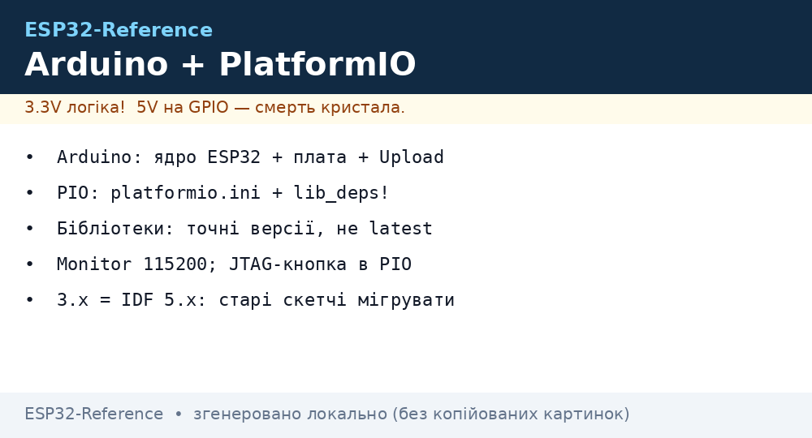
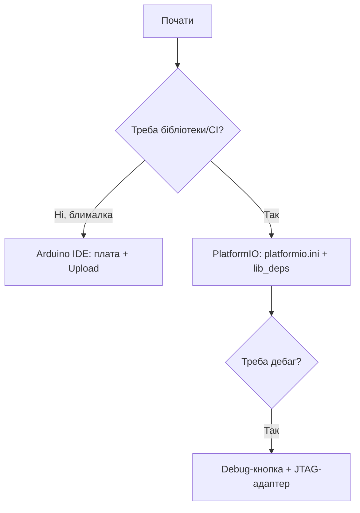

# Arduino IDE та PlatformIO для ESP32

Arduino-шар - найшвидший шлях від ідеї до блимаючого LED: тисячі бібліотек, `setup()/loop()`, прошивка однією кнопкою. PlatformIO дає те саме + нормальні залежності та [дебаг](../../../ESP32-Reference/09-Proshivka/05-JTAG-Debug.md). Обидва працюють поверх того ж [заліза](../../../ESP32-Reference/Home.md) і [flash](../../../ESP32-Reference/01-Hardware/06-Flash-PSRAM.md).

> [!NOTE]
> Arduino-ESP32 3.x базується на IDF 5.x. Старі скетчі з 2.x можуть вимагати міграції (`LED_BUILTIN`, ADC API).


*Рис. Arduino/PIO-потік: ядро/ini → бібліотеки → Upload → Monitor; JTAG-кнопка в PIO.*

## Призначення

Arduino IDE та PlatformIO для ESP32 - Arduino IDE: встановлення ядра ESP32; Перший скетч + Serial Monitor; PlatformIO: проєкт з нуля. Arduino-ESP32 3.x базується на IDF 5.x. Старі скетчі з 2.x можуть вимагати міграції (LED_BUILTIN, ADC API). 5. LittleFS / NVS / OTA в Arduino.

## 1. Arduino IDE: встановлення ядра ESP32

Стабільний URL (File → Preferences → Additional boards manager URLs):

```text
https://espressif.github.io/arduino-esp32/package_esp32_index.json
```

| Крок | Дія |
| --- | --- |
| 1 | Вставити URL, OK |
| 2 | Tools → Board → Boards Manager → знайти `esp32` → Install |
| 3 | Вибрати плату: `ESP32 Dev Module` / `ESP32-S3 Dev Module` / `XIAO_ESP32C3` |
| 4 | USB CDC On Boot → Enabled (для S3/C3, інакше немає Serial) |
| 5 | Partition Scheme → `Default 4MB with spiffs` (див. [partitions](../../../ESP32-Reference/08-Pamyat/01-Partitions-NVS.md)) |
| 6 | Upload Speed → `921600` (або `460800` при помилках) |

> [!TIP]
> На Linux додайте себе в `dialout`: `sudo usermod -aG dialout $USER` + перелогін. Інакше порт сірий.

## 2. Перший скетч + Serial Monitor

```cpp
void setup() {
  Serial.begin(115200);
  while (!Serial) delay(10);
  pinMode(LED_BUILTIN, OUTPUT);
  Serial.println("Hello ESP32!");
}
void loop() {
  digitalWrite(LED_BUILTIN, !digitalRead(LED_BUILTIN));
  Serial.println("blink");
  delay(500);
}
```

| Параметр монітора | Значення |
| --- | --- |
| Baud | `115200` (стандарт IDF/Arduino логів) |
| Line ending | `Both NL & CR` для команд |
| Порт | `/dev/ttyUSB0` (CP2102/CH340) або `/dev/ttyACM0` (native USB S3/C3) |

## 3. PlatformIO: проєкт з нуля

Структура + `platformio.ini`:

```ini
[env:esp32dev]
platform = espressif32
board = esp32dev
framework = arduino
monitor_speed = 115200
upload_speed = 921600
board_build.partitions = default_4MB.csv      ; кастом: partitions_custom.csv
lib_deps =
  bblanchon/ArduinoJson @ ^7.0.0
  madhephaestus/ESP32Encoder @ ^0.11.0
build_flags =
  -DCORE_DEBUG_LEVEL=3
```

| Команда PlatformIO | Призначення |
| --- | --- |
| `pio run` | Збірка |
| `pio run -t upload` | Прошивка |
| `pio device monitor -b 115200` | Serial-монітор |
| `pio run -t erase` | Стерти [flash](../../../ESP32-Reference/01-Hardware/06-Flash-PSRAM.md) |
| `pio pkg install -l <lib>` | Додати бібліотеку |
| `pio boards esp32` | Список плат |

Код `src/main.cpp` - той же Arduino-стиль:

```cpp
#include <Arduino.h>
#include <Preferences.h>   // NVS key-value, див. [[08-Pamyat/01-Partitions-NVS|NVS]]
Preferences prefs;
void setup() {
  Serial.begin(115200);
  prefs.begin("cfg", false);
  Serial.printf("boot=%u\n", prefs.getUInt("boot", 0));
}
void loop() { delay(1000); }
```

## 4. Бібліотеки: правила гігієни

| Правило | Чому |
| --- | --- |
| Фіксуйте версії (`@ ^x.y.z`) | Оновлення ламає збірку мовчки |
| Перевага `lib_deps` над ручним копіюванням | Відтворюваність |
| Перевіряйте архітектуру (`esp32` у `library.json`) | AVR-бібліотеки не стануть |
| Великі залежності (AsyncWebServer) - з реєстру, не ZIP | ZIP не оновлюється |

> [!WARNING]
> Конфлікт `ESPAsyncWebServer` (legacy) vs `ESPAsyncWebServer2` під Arduino 3.x - беріть форк з підтримкою IDF 5, інакше сотні помилок компіляції.

## 5. LittleFS / NVS / OTA в Arduino

```cpp
#include <LittleFS.h>   // деталі: [[08-Pamyat/02-Filesystem|Файлові системи]]
#include <ArduinoOTA.h> // деталі: [[08-Pamyat/03-OTA|OTA]]
void setupOTA() {
  ArduinoOTA.setHostname("esp32-lab");
  ArduinoOTA.setPassword("secret");
  ArduinoOTA.begin();
}
```

MicroPython-еквівалент для порівняння (деталі - [MicroPython](../../../ESP32-Reference/09-Proshivka/03-MicroPython.md)):

```python
from machine import Pin
led = Pin(2, Pin.OUT)
led.value(not led.value())
```

## 6. Типові помилки завантаження

| Помилка | Рішення (деталі - [Esptool-Flash](../../../ESP32-Reference/09-Proshivka/04-Esptool-Flash.md)) |
| --- | --- |
| `Failed to connect` | Утримувати BOOT, знизити `upload_speed` до 115200 |
| `MD5 mismatch` | Поганий кабель / живлення, стерти flash |
| `No serial data received` | Не той порт, або native-USB без `USB CDC On Boot` |
| `Sketch too big` | Змінити Partition Scheme на `Huge APP` / прибрати бібліотеки |

### Mermaid: Arduino чи PlatformIO



## Офіційні джерела

- [Arduino-ESP32 (GitHub)](https://github.com/espressif/arduino-esp32) - ядро, плати, міграція 2.x→3.x.
- [PlatformIO Espressif32](https://docs.platformio.org/en/latest/platforms/espressif32.html) - плати, опції, дебаг.

## Див. також

- [Home](../../../ESP32-Reference/Home.md)
- [06-Flash-PSRAM](../../../ESP32-Reference/01-Hardware/06-Flash-PSRAM.md)
- [01-Partitions-NVS](../../../ESP32-Reference/08-Pamyat/01-Partitions-NVS.md)
- [Файлові системи](../../../ESP32-Reference/08-Pamyat/02-Filesystem.md)
- [OTA](../../../ESP32-Reference/08-Pamyat/03-OTA.md)
- [01-ESP-IDF-setup](../../../ESP32-Reference/09-Proshivka/01-ESP-IDF-setup.md)
- [MicroPython](../../../ESP32-Reference/09-Proshivka/03-MicroPython.md)
- [04-Esptool-Flash](../../../ESP32-Reference/09-Proshivka/04-Esptool-Flash.md)
- [05-JTAG-Debug](../../../ESP32-Reference/09-Proshivka/05-JTAG-Debug.md)
