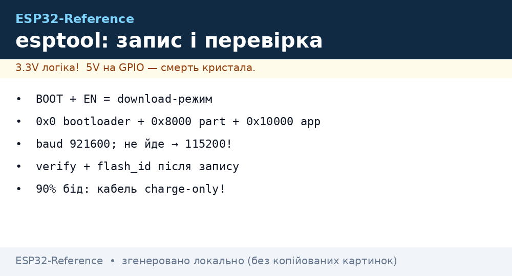
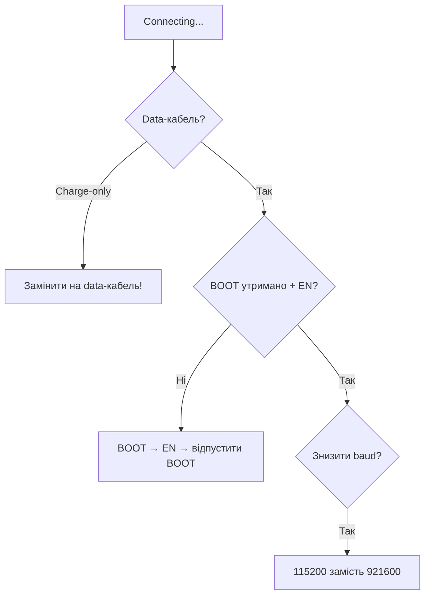

# Esptool та прошивка Flash

`esptool.py` - низькорівневий прошивальник Espressif: стирання, запис, читання [flash](../../../ESP32-Reference/01-Hardware/06-Flash-PSRAM.md), `chip_id`, зміна швидкості. Ним же користуються під капотом [IDF](../../../ESP32-Reference/09-Proshivka/01-ESP-IDF-setup.md), [Arduino/PlatformIO](../../../ESP32-Reference/09-Proshivka/02-Arduino-PlatformIO.md) та [MicroPython](../../../ESP32-Reference/09-Proshivka/03-MicroPython.md). Ця нотатка - польовий довідник, коли «не конектиться».

> [!IMPORTANT]
> 90% проблем esptool - це кабель (charge-only без даних), слабке живлення або зайнятий порт, а не сам ESP32.


*Рис. esptool: download-режим (BOOT+EN) → erase → write за офсетами → verify → flash_id.*

## Призначення

Esptool та прошивка Flash - Кнопки BOOT + EN та режими; Базові команди esptool; Таблиця помилок і рішень. 90% проблем esptool - це кабель (charge-only без даних), слабке живлення або зайнятий порт, а не сам ESP32. Не змішуйте bootloader.bin від одного проєкту з app.bin від іншого - ревізії IDF і flash-конфіг мають збігатися.

## 1. Кнопки BOOT + EN та режими

| Стан | GPIO0 (BOOT) | EN (RST) | Режим |
| --- | --- | --- | --- |
| Робота | HIGH (відпущена) | HIGH | Виконання firmware |
| Завантаження | LOW (утримувати) → натиснути EN → відпустити EN | імпульс | UART download |
| Auto-reset | DTR/RTS керують автоматично | автоматично | Прошивка без рук (більшість DevKit) |

Послідовність вручну:

```text
1. Утримувати BOOT
2. Натиснути-відпустити EN
3. Відпустити BOOT
4. esptool.py write_flash ...
```

> [!TIP]
> Плати без auto-reset (голі модулі, саморобні PCB) вимагають ручної послідовності. Додайте схему з конденсатором (див. розділ 5).

Схема підключення USB-UART:

| USB-UART | ESP32 |
| --- | --- |
| 3V3 | 3V3 (струм ≥ 500 мА!) |
| GND | GND |
| TX | RX0 (GPIO3) |
| RX | TX0 (GPIO1) |
| DTR → 100 нФ → EN | auto-reset |
| RTS → 100 нФ → GPIO0 | auto-reset |
| GPIO0 → кнопка → GND | ручний BOOT |
| EN → кнопка → GND (+ RC 10к/100нФ) | ручний reset |

## 2. Базові команди esptool

```bash
# хто на дроті?
esptool.py --chip esp32 -p /dev/ttyUSB0 chip_id
esptool.py --chip esp32 -p /dev/ttyUSB0 flash_id      # розмір/виробник flash
# повне стирання (лікує 80% «цеглин»)
esptool.py --chip esp32 -p /dev/ttyUSB0 erase_flash
# запис firmware (приклад IDF: bootloader + partitions + app)
esptool.py --chip esp32 -p /dev/ttyUSB0 -b 460800 write_flash -z \
  0x1000 build/bootloader/bootloader.bin \
  0x8000 build/partition_table/partition-table.bin \
  0x10000 build/app.bin
# бекап flash 4 МБ
esptool.py --chip esp32 -p /dev/ttyUSB0 -b 460800 read_flash 0x0 0x400000 backup.bin
# верифікація
esptool.py --chip esp32 -p /dev/ttyUSB0 verify_flash 0x10000 build/app.bin
```

Таблиця швидкостей:

| Baud | Коли |
| --- | --- |
| `115200` | Надійний мінімум, погані кабелі, довгі дроти |
| `460800` | Золота середина для щоденної роботи |
| `921600` | Швидко, якщо чип і міст (CP2102) тягнуть |
| `1500000+` | Тільки короткі якісні кабелі, не для діагностики |

IDF / Arduino / MicroPython-еквіваленти (все одно викликають esptool):

```bash
idf.py -p /dev/ttyUSB0 -b 460800 flash          # IDF
pio run -t upload --upload-port /dev/ttyUSB0    # PlatformIO
# MicroPython: write_flash -z 0x1000 mpy.bin (див. [[09-Proshivka/03-MicroPython|MicroPython]])
```

## 3. Таблиця помилок і рішень

| Помилка | Причина | Рішення |
| --- | --- | --- |
| `Failed to connect to ESP32: Timed out waiting for packet header` | Не ввійшов у download-режим | Утримувати BOOT + EN, перевірити auto-reset, знизити `-b 115200` |
| `Timed out waiting for packet content` | Поганий кабель / просадка живлення | Короткий data-кабель, окреме живлення 5В/1А, конденсатор 470 мкФ на 3V3 |
| `MD5 of file does not match data in flash!` / `MD5 mismatch` | Биті дані при записі | `-b 115200`, `erase_flash`, інший USB-порт без хаба |
| `Serial data received...` / garbage | Порт зайнятий монітором | Закрити `idf.py monitor` / Arduino Serial / Thonny |
| `Permission denied: /dev/ttyUSB0` | Немає прав / немає драйвера | `usermod -aG dialout`, драйвер CP210x/CH340, перелогін |
| `Wrong --chip, detected ESP32-S3` | Невірний `--chip` | Вказати правильний: `--chip esp32s3` / `auto` |
| `Partition table invalid` | Битий offset 0x8000 | Перезаписати `partition-table.bin`, перевірити CSV ([Partitions](../../../ESP32-Reference/08-Pamyat/01-Partitions-NVS.md)) |
| Зациклюється reboot після флешу | Не той bootloader / flash mode | `erase_flash` + повний `write_flash` з однієї збірки, DIO 40М |

> [!CAUTION]
> Не змішуйте `bootloader.bin` від одного проєкту з `app.bin` від іншого - ревізії IDF і flash-конфіг мають збігатися.

## 4. Читання / бекап / NVS

```bash
# тільки NVS (20 КБ з 0x9000 за default-розкладкою)
esptool.py -p /dev/ttyUSB0 read_flash 0x9000 0x5000 nvs_backup.bin
# тільки partition table
esptool.py -p /dev/ttyUSB0 read_flash 0x8000 0x1000 pt.bin
gen_esp32part.py pt.bin pt.csv   # декодувати
```

## 5. Схема auto-reset з конденсатором

Класична проблема дешевих плат: EN стрибає раніше, ніж GPIO0 встигає впасти.

```text
DTR ──||── EN        (100 нФ, вже є на DevKit)
RTS ──||── GPIO0     (100 нФ, вже є на DevKit)
EN ──[10к]── 3V3
EN ──||── GND        (додати 100 нФ–1 мкФ при глюках)
GPIO0 ──[10к]── 3V3
3V3 ──||── GND       (електроліт 100–470 мкФ біля модуля!)
```

| Симптом | Лікує |
| --- | --- |
| `Failed to connect` на саморобній платі | Конденсатор EN→GND 100 нФ + pull-up 10к |
| Ребут при старті Wi-Fi | Електроліт 470 мкФ на живленні |
| Працює тільки з утриманням BOOT | Немає ланцюгів DTR/RTS - прошити вручну або допаяти |

### Mermaid: не конектиться



## Офіційні джерела

- [esptool.py (GitHub)](https://github.com/espressif/esptool) - команди, офсети, baud.
- [ESP32 Boot Mode Selection](https://docs.espressif.com/projects/esptool/en/latest/esp32/advanced-topics/boot-mode-selection.html) - strapping.

## Див. також

- [Home](../../../ESP32-Reference/Home.md)
- [06-Flash-PSRAM](../../../ESP32-Reference/01-Hardware/06-Flash-PSRAM.md)
- [01-Partitions-NVS](../../../ESP32-Reference/08-Pamyat/01-Partitions-NVS.md)
- [Файлові системи](../../../ESP32-Reference/08-Pamyat/02-Filesystem.md)
- [OTA](../../../ESP32-Reference/08-Pamyat/03-OTA.md)
- [01-ESP-IDF-setup](../../../ESP32-Reference/09-Proshivka/01-ESP-IDF-setup.md)
- [02-Arduino-PlatformIO](../../../ESP32-Reference/09-Proshivka/02-Arduino-PlatformIO.md)
- [MicroPython](../../../ESP32-Reference/09-Proshivka/03-MicroPython.md)
- [05-JTAG-Debug](../../../ESP32-Reference/09-Proshivka/05-JTAG-Debug.md)
