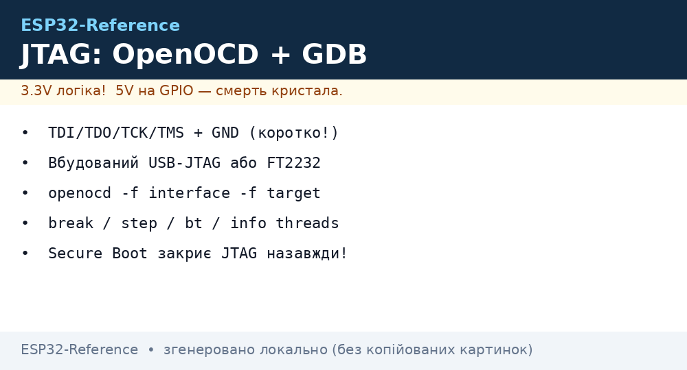
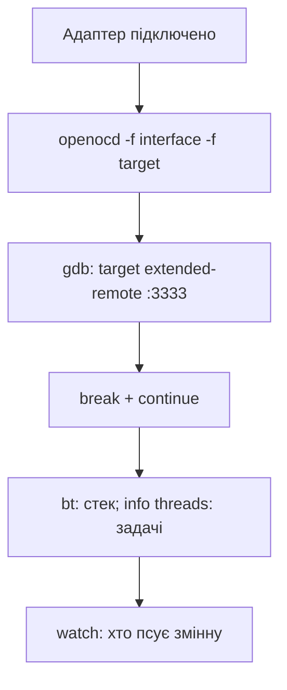

# JTAG-дебаг ESP32

Serial-логи показують *що* впало. JTAG показує *де*: брейкпоінти, покрокове виконання, регістри, стек FreeRTOS-задач. Необхідний для зависань, HardFault, гонок задач. Працює поверх того ж [заліза](../../../ESP32-Reference/Home.md), незалежно від [Arduino](../../../ESP32-Reference/09-Proshivka/02-Arduino-PlatformIO.md) чи [IDF](../../../ESP32-Reference/09-Proshivka/01-ESP-IDF-setup.md).

> [!IMPORTANT]
> Після ввімкнення [Secure Boot + DIS_USB_JTAG](../../../ESP32-Reference/08-Pamyat/04-Secure-Boot-Encrypt.md) JTAG назавжди закривається. Дебажте до запаювання eFuse.


*Рис. JTAG-ланцюг: TDI/TDO/TCK/TMS → OpenOCD → GDB: брейкпоінти, стек, регістри.*

## Призначення

JTAG-дебаг ESP32 - Варіанти JTAG-адаптерів; OpenOCD: запуск; GDB: брейкпоінти та стек. Після ввімкнення [04-Secure-Boot-Encrypt](../../../ESP32-Reference/08-Pamyat/04-Secure-Boot-Encrypt.md) JTAG назавжди закривається. Дебажте до запаювання eFuse. GPIO12-15 на ESP32 - strapping-піни. Підтяжки JTAG-адаптера можуть завадити завантаженню: вимкайте адаптер при звичайній прошивці через [04-Esptool-Flash](../../../ESP32-Reference/09-Proshivka/04-Esptool-Flash.md), якщо плата не стартує.

## 1. Варіанти JTAG-адаптерів

| Адаптер | Чипи | Швидкість | Коли брати |
| --- | --- | --- | --- |
| **Builtin USB-JTAG** (S3/C3/H2) | S3/C3/H2 | До ~1 МБіт | Безкоштовно, достатньо для 90% задач |
| **ESP-Prog** (FT2232) | Усі | Стабільний | Класика Espressif, JTAG + UART в одному |
| FT2232H міні-модулі | Усі | Добра | Дешевше за ESP-Prog |
| FT4232H міні-модулі | Усі | Добра | 4 канали: JTAG + 3× UART/SPI - один адаптер на весь стенд |
| ESP32 classic (без builtin) | ESP32/S2 | Тільки зовнішній | Обов'язково зовнішній адаптер |

Таблиця пінів JTAG (зовнішній адаптер):

| JTAG | ESP32 пін | ESP32-S3 пін | Примітка |
| --- | --- | --- | --- |
| TCK | GPIO13 | GPIO39 | Такт |
| TMS | GPIO14 | GPIO40 | Режим |
| TDI | GPIO12 | GPIO41 | Вхід даних |
| TDO | GPIO15 | GPIO42 | Вихід даних |
| GND | GND | GND | Спільна земля **обов'язкова** |
| VREF | 3V3 | 3V3 | Опорна напруга |

> [!WARNING]
> GPIO12-15 на ESP32 - strapping-піни. Підтяжки JTAG-адаптера можуть завадити завантаженню: вимкайте адаптер при звичайній прошивці через [esptool](../../../ESP32-Reference/09-Proshivka/04-Esptool-Flash.md), якщо плата не стартує.

Builtin USB-JTAG (S3): достатньо USB-кабелю в порт `USB` (не `UART`!) + драйвер не потрібен, пристрій з'являється як два інтерфейси (JTAG + CDC).

### JTAG-ESP-PROG і ESP-Bridge - фірмова зв'язка Espressif

| Позиція | Що це |
| --- | --- |
| JTAG-ESP-PROG (плата) | Заводський адаптер Espressif: FT2232H (JTAG) + CP2102N (UART) на одній платі, перемички живлення 3.3/5 В |
| ESP-Bridge (прошивка) | Перетворює будь-який ESP32-S2/S3 на USB-JTAG/UART міст: прошивка з прикладів ESP-IDF, далі - як звичайний адаптер |

> Саморобний міст з S3: дешевше за ESP-Prog, але стабільність JTAG нижча - для щоденного дебагу беріть апаратний FTDI.

## 2. OpenOCD: запуск

```bash
# S3 builtin:
openocd -f board/esp32s3-builtin.cfg
# ESP-Prog + ESP32 classic:
openocd -f interface/ftdi/esp32_devkitj_v1.cfg -f target/esp32.cfg
# S3 + ESP-Prog:
openocd -f interface/ftdi/esp32_devkitj_v1.cfg -f target/esp32s3.cfg
# C3 builtin:
openocd -f board/esp32c3-builtin.cfg
```

Очікуваний вивід: `Info: esp32s3: Target halted...`. Якщо `JTAG scan chain interrogation failed` - перевірити живлення, GND, порядок TCK/TMS/TDI/TDO.

| Конфіг | Для чого |
| --- | --- |
| `board/esp32s3-builtin.cfg` | S3/C3 через USB |
| `interface/ftdi/esp32_devkitj_v1.cfg` | ESP-Prog |
| `target/esp32.cfg` / `esp32s3.cfg` / `esp32c3.cfg` | Цільовий чип |
| `-c "adapter speed 20000"` | Знизити швидкість при довгих дротах |

## 3. GDB: брейкпоінти та стек

```bash
xtensa-esp32-elf-gdb build/app.elf -ex "target remote :3333"
# для S3 / C3 замінити префікс:
# xtensa-esp32s3-elf-gdb / riscv32-esp-elf-gdb
```

| Команда GDB | Що робить |
| --- | --- |
| `mon reset halt` | Скинути і зупинити CPU |
| `flushregs` | Оновити регістри після halt |
| `thb app_main` | Hardware-брейк на старті |
| `c` | Продовжити |
| `bt` | Стек викликів (де зависли) |
| `info threads` | Список задач FreeRTOS |
| `thread 3` + `bt` | Стек конкретної задачі |
| `p x` / `x/16xw 0x3FFB0000` | Змінна / дамп пам'яті |
| `mon esp appimage_offset 0x10000` | Offset app (при OTA-слотах) |

Типова сесія:

```text
(gdb) mon reset halt
(gdb) flushregs
(gdb) thb app_main
(gdb) c
Breakpoint 1, app_main () at main/app_main.c:17
(gdb) n            # наступний рядок
(gdb) bt           # де ми
(gdb) info threads # хто ще живе
```

> [!TIP]
> Збирайте з `-g` (IDF робить за замовчуванням у Debug). Без символів GDB покаже лише адреси.

## 4. PlatformIO: дебаг однією кнопкою

```ini
[env:esp32dev]
platform = espressif32
board = esp32dev
framework = arduino
debug_tool = esp-prog
debug_speed = 12000
debug_init_break = thb app_main
build_type = debug
```

| Дія | Як |
| --- | --- |
| Старт дебагу | Іконка Run → Debug (F5 у VS Code) |
| Брейкпоінт | Клік ліворуч від номера рядка |
| Кроки | Step Over / Into на панелі |
| WATCH | Додати змінну у Watch-панель |

Для builtin JTAG (S3):

```ini
debug_tool = esp-builtin
```

## 5. Arduino (gdb stub) та MicroPython

Мінімальний стек-трейс без JTAG-заліза:

```cpp
// Arduino-ESP32: вбудований GDB stub по Serial
#include <esp_gdbstub.h>
void setup() {
  Serial.begin(115200);
  gdbstub_init();   // при panic — керування через gdb по UART
}
```

```python
# MicroPython: програмний трейс замість JTAG
import sys, micropython
micropython.alloc_emergency_exception_buf(100)
try:
    1 // 0
except Exception as e:
    sys.print_exception(e)   # стек в REPL
```

ESP-IDF: `idf.py monitor` + `CONFIG_ESP_SYSTEM_PANIC_PRINT_HALT` дає регістри без JTAG; `coredump` в [partition](../../../ESP32-Reference/08-Pamyat/01-Partitions-NVS.md) + `esp-coredump.py info_corefile` - пост-мортем аналіз.

## 6. Типові проблеми

| Симптом | Рішення |
| --- | --- |
| `Target not examined` | Немає живлення цілі / переплутані TDI↔TDO |
| `JTAG scan failed` | Знизити `adapter speed`, коротші дроти (<10 см), спільний GND |
| GDB показує `??` | Не той `.elf` (перебудували після флешу) - перебудувати і перепрошити разом |
| Брейкпоінти не спрацьовують в flash | Мало HW-брейків (2 шт) - ставити `thb` точково |
| S3 не видно як JTAG | Кабель у порт UART замість USB; перевірити `dmesg`, інший кабель |

### Mermaid: перша сесія дебагу



## Офіційні джерела

- [JTAG Debugging (ESP-IDF)](https://docs.espressif.com/projects/esp-idf/en/latest/esp32/api-guides/jtag-debugging/index.html) - OpenOCD, GDB.
- [ESP-Prog Guide](https://docs.espressif.com/projects/esp-dev-kits/en/latest/other/esp-prog/user_guide.html) - залізо, перемички.

## Див. також

- [Home](../../../ESP32-Reference/Home.md)
- [06-Flash-PSRAM](../../../ESP32-Reference/01-Hardware/06-Flash-PSRAM.md)
- [01-Partitions-NVS](../../../ESP32-Reference/08-Pamyat/01-Partitions-NVS.md)
- [04-Secure-Boot-Encrypt](../../../ESP32-Reference/08-Pamyat/04-Secure-Boot-Encrypt.md)
- [01-ESP-IDF-setup](../../../ESP32-Reference/09-Proshivka/01-ESP-IDF-setup.md)
- [02-Arduino-PlatformIO](../../../ESP32-Reference/09-Proshivka/02-Arduino-PlatformIO.md)
- [MicroPython](../../../ESP32-Reference/09-Proshivka/03-MicroPython.md)
- [04-Esptool-Flash](../../../ESP32-Reference/09-Proshivka/04-Esptool-Flash.md)
