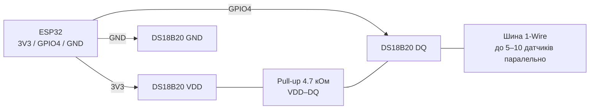
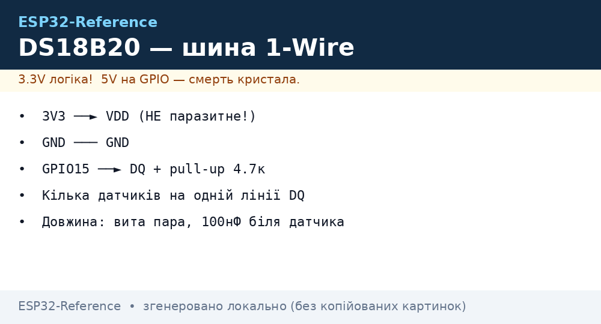

# DS18B20 - цифровий датчик температури (Dallas 1-Wire)

## Призначення

DS18B20 - цифровий датчик температури зі справжньою шиною Dallas 1-Wire: кожен екземпляр має унікальний 64-бітний ROM-код, тому десятки датчиків працюють на одній лінії GPIO. Корпуси: TO-92, гільза з кабелем (водонепроникний), SOP-8. Застосування: тепла підлога, бойлери, вуличні метеостанції, акваріуми, морозильні камери.

## Характеристики

| Параметр | Значення |
| --- | --- |
| Діапазон вимірювання | −55…+125 °C |
| Точність | ±0.5 °C (−10…+85 °C) |
| Роздільна здатність | 9-12 біт (0.5 / 0.25 / 0.125 / 0.0625 °C) |
| Час конверсії | 94 мс (9 біт) … 750 мс (12 біт) |
| Живлення | 3.0-5.5 В (рекомендовано 3.3 В від ESP32) |
| Струм | ~1 мА активний, ~750 нА в спокої |
| Протокол | Dallas 1-Wire, швидкість 16.3 кбіт/с (overdrive 142) |
| Унікальний код | 64-біт ROM, до ~100+ пристроїв на шині (практично 5-10) |
| Паразитне живлення | Є (від лінії DQ), але НЕ рекомендується з ESP32 |

> Паразитне живлення (2 дроти: DQ + GND) вимагає сильного pull-up (MOSFET) під час конверсії та дає збої на ESP32. Завжди тягніть третій провід VCC.

## Розпіновка

| Пін (TO-92, пласкою стороною до себе, зліва направо) | Призначення | Примітка |
| --- | --- | --- |
| 1 - GND | Земля | Спільний GND |
| 2 - DQ | Дані 1-Wire | GPIO + pull-up 4.7 кОм до VCC |
| 3 - VDD | Живлення 3.3 В | НЕ залишати висячим; не використовувати паразитний режим |

Кольори водонепроникної гільзи: червоний - VCC, жовтий/білий - DQ, чорний - GND (перевіряти мультиметром, бувають варіанти!).

## Схема підключення

| ESP32 | Модуль DS18B20 | Примітка |
| --- | --- | --- |
| 3V3 | VDD | Нормальне (не паразитне) живлення |
| GPIO4 | DQ | Будь-який GPIO; один пін на всю шину |
| GND | GND | Спільна земля |
| - | DQ-VDD | Pull-up 4.7 кОм (один на всю шину, біля ESP32) |

Кілька датчиків: всі DQ паралельно на один GPIO, всі VDD на 3V3, всі GND на GND. Один pull-up 4.7 кОм (при довжині >10 м або >5 датчиків - 2.2 кОм). Кабель: вита пара, DQ + GND в одній парі, до ~30-50 м на 3.3 В.

### ASCII-схема

```text
ESP32 DevKit              DS18B20 (TO-92 / гільза)
------------              ------------------------
3V3 ────────────────────► VDD (3) / червоний
GND ────────────────────► GND (1) / чорний
GPIO4 ──────────────────► DQ (2) / жовтий-білий
                          VDD ◄──[4.7 кОм]──► DQ (один на шину, біля ESP32)
                          VDD ◄──[100 нФ]──► GND (при довгій шині, біля ESP32)
Шина: всі DQ паралельно на GPIO4; DQ+GND — одна вита пара
Не використовувати паразитне живлення (VDD на GND)!
```

### Mermaid




*Рис. DS18B20 - трипровідна шина 1-Wire, один pull-up 4.7 кОм, вита пара DQ+GND. Місце під фото - див. .*

## Код ESP-IDF

```c
#include "ds18x20.h"  // компонент esp-idf-lib
#include "onewire.h"
#include "freertos/FreeRTOS.h"
#include "freertos/task.h"
#include "esp_log.h"

#define ONEWIRE_GPIO GPIO_NUM_4
static const char *TAG = "ds18b20";

void app_main(void)
{
    onewire_handle_t owb;
    onewire_config_t cfg = ONEWIRE_CONFIG_DEFAULT();
    onewire_new_bus(&cfg, ONEWIRE_GPIO, &owb);

    onewire_addr_t addr[4];
    int found = 0;
    onewire_search(owb, addr, 4, &found);
    ESP_LOGI(TAG, "Знайдено датчиків: %d", found);

    for (;;) {
        ds18x20_request_t req = DS18X20_REQUEST_DEFAULT();
        ds18x20_convert_and_read(owb, DS18X20_RESOLUTION_12BIT, addr, found, NULL);
        for (int i = 0; i < found; i++) {
            float t = 0;
            ds18x20_read_temperature(owb, addr[i], &t);
            ESP_LOGI(TAG, "[%d] %.2f C", i, t);
        }
        vTaskDelay(pdMS_TO_TICKS(1000));
    }
}
```

> Для старого API (esp-idf-lib до v5): `ds18x20_scan_devices()`, `ds18x20_measure_and_read_multi()` - див. README компонента.

## Код Arduino

```cpp
#include <OneWire.h>
#include <DallasTemperature.h>

#define ONE_WIRE_PIN 4
OneWire oneWire(ONE_WIRE_PIN);
DallasTemperature sensors(&oneWire);

void setup() {
  Serial.begin(115200);
  sensors.begin();
  Serial.printf("Датчиків: %d\n", sensors.getDeviceCount());
  sensors.setResolution(12); // 9..12 біт
}

void loop() {
  sensors.requestTemperatures();
  Serial.printf("T0 = %.2f C\n", sensors.getTempCByIndex(0));
  // За адресою (стабільно при кількох датчиках):
  // DeviceAddress addr; sensors.getAddress(addr, 0);
  // Serial.println(sensors.getTempC(addr));
  delay(1000);
}
```

## Код MicroPython

```python
from machine import Pin
import onewire, ds18x20
import time

ow = onewire.OneWire(Pin(4))
ds = ds18x20.DS18X20(ow)
roms = ds.scan()
print("Знайдено:", len(roms), [r.hex() for r in roms])

while True:
    ds.convert_temp()
    time.sleep_ms(750)  # 12 біт
    for rom in roms:
        print(rom.hex(), "{:.2f} C".format(ds.read_temp(rom)))
    time.sleep(1)
```

## Типові помилки

1. **Паразитне живлення (VDD на GND)** → −127 °C або CRC-error на ESP32. Підключити VDD до 3V3 окремим дротом.
2. **Немає pull-up 4.7 кОм** → шина мовчить, `getDeviceCount() = 0`. Один резистор DQ→VCC обов'язковий.
3. **Значення 85 °C або −127 °C** → 85 = POR-значення регістра (не завершена конверсія); −127 = немає відповіді. Збільшити затримку конверсії, перевірити живлення.
4. **Індекс датчика «пливе» при кількох DS18B20** → `getTempCByIndex()` залежить від порядку пошуку. Працювати за ROM-адресами, зберегти їх у NVS/конфіг.
5. **Довга шина + 4.7 кОм замало** → помилки CRC. Зменшити до 2.2 кОм, використати виту пару, додати 100 нФ біля ESP32.
6. **Живлення 5 В + DQ безпосередньо в GPIO** → 5 В на вході (ESP32 не 5V-tolerant). Живити датчик від 3V3.
7. **Читання частіше часу конверсії** → повтор старого значення. Чекати 750 мс при 12 бітах або знизити роздільність.

## Офіційні джерела

- DS18B20 Datasheet (Analog/Maxim) - `перевірити вручну` (сайт analog.com блокує автоматичні запити).
- [DS18B20 - живе фото (Adafruit)](https://www.adafruit.com/product/374) - сторінка товару з фото і документацією.
- [Туторіал DS18B20 + ESP32 з кодом (RNT)](https://randomnerdtutorials.com/esp32-ds18b20-temperature-arduino-ide/) - один і кілька датчиків на шині, приклад.
- [Розбір DS18B20 1-Wire з кодом (LME)](https://lastminuteengineers.com/ds18b20-arduino-tutorial/) - протокол, роздільна здатність, приклади.

## Див. також

- [01-GPIO-oglyad](../../../ESP32-Reference/03-GPIO/01-GPIO-oglyad.md)
- [I2C](../../../ESP32-Reference/04-Shini/03-I2C.md)
- [01-DHT11-DHT22](../../../ESP32-Reference/10-Sensori/01-DHT11-DHT22.md)
- [03-BME280-BMP280-SHT31](../../../ESP32-Reference/10-Sensori/03-BME280-BMP280-SHT31.md)
- [04-Pererivannya-PWM](../../../ESP32-Reference/03-GPIO/04-Pererivannya-PWM.md)
- [06-INA219-HX711-BH1750](../../../ESP32-Reference/10-Sensori/06-INA219-HX711-BH1750.md)
