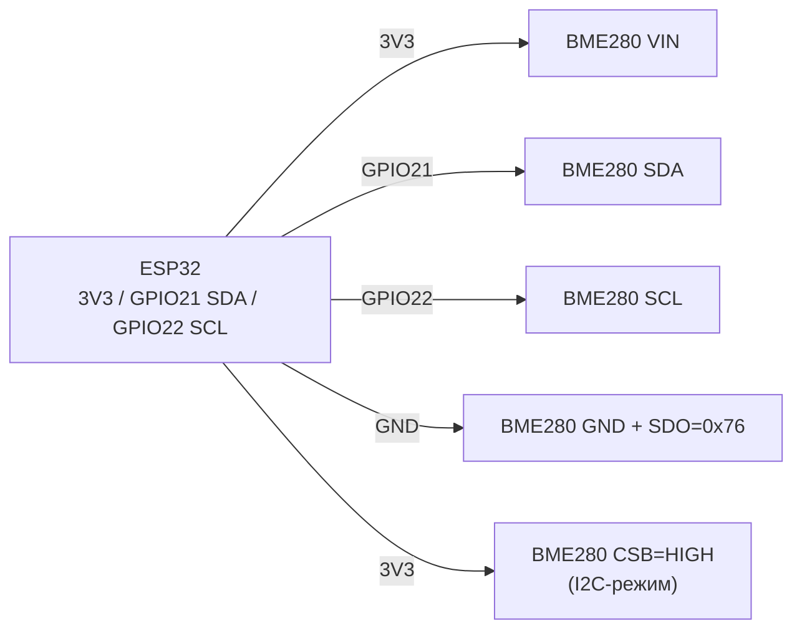
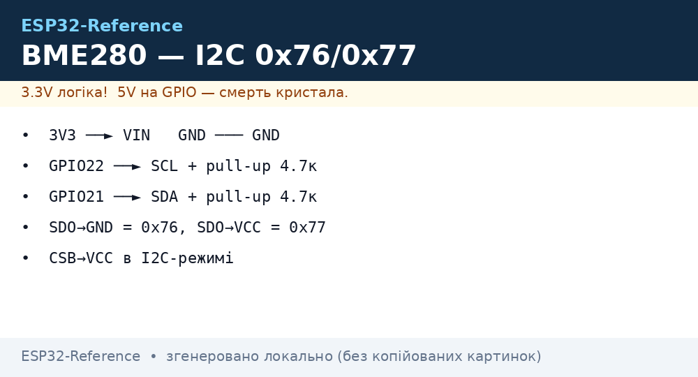

# BME280 / BMP280 / SHT31 - датчики тиску, вологості та температури

## Призначення

Лінійка прецизійних I2C/SPI сенсорів Bosch + Sensirion для метеостанцій, альтиметрів, клімат-контролю та вуличних IoT-вузлів. BME280: температура + вологість + тиск (все в одному). BMP280: температура + тиск, без вологості (дешевший). SHT31: еталонна вологість/температура від Sensirion, вища точність вологості. Інтерфейс - I2C (адреси 0x76/0x77 у Bosch, 0x44/0x45 у Sensirion), живлення 1.7-3.6V, сон - мікроампери.

## Характеристики

| Параметр | BME280 | BMP280 | SHT31-DIS |
| --- | --- | --- | --- |
| Температура | −40…+85 °C, ±1 °C | −40…+85 °C, ±1 °C | −40…+125 °C, ±0.3 °C |
| Вологість | 0…100 %, ±3 % | Немає | 0…100 %, ±2 % |
| Тиск | 300…1100 гПа, ±1 гПа | 300…1100 гПа, ±1 гПа | Немає |
| Інтерфейс | I2C + SPI | I2C + SPI | I2C |
| I2C-адреси | 0x76 (SDO→GND) / 0x77 (SDO→VCC) | 0x76 / 0x77 (аналогічно) | 0x44 / 0x45 (ADDR) |
| Живлення | 1.8-3.6 В (модулі GY-BME280 мають LDO → 3.3-5 В) | Так само | 2.4-5.5 В |
| Струм | ~3.6 мкА @1 Гц | ~2.7 мкА @1 Гц | ~1.5 мА вимір / 2 мкА сон |
| Особливість | Компенсація через калібрувальні регістри | Дешевший, той же тиск | Нагрівач проти конденсату |

> Увага: китайські модулі з маркуванням «BMP280» інколи реально BME280 і навпаки. Перевіряти ID регістра (`chip_id`: 0x60 = BME280, 0x58 = BMP280) або наявність вологості в даних.

## Розпіновка

| Пін модуля GY-BME/BMP280 | Призначення | Примітка |
| --- | --- | --- |
| VIN/VCC | Живлення 3.3 В | Модулі з LDO терплять 5 В, але ліпше 3.3 В |
| GND | Земля | Спільний GND |
| SCL | I2C clock | До GPIO22 (стандарт) + pull-up |
| SDA | I2C data | До GPIO21 (стандарт) + pull-up |
| SDO | Вибір адреси | GND → 0x76, VCC → 0x77 (залишений висячим = 0x76 на більшості модулів) |
| CSB | Chip select SPI | В I2C-режимі підтягнути до VCC; в SPI - до GPIO |
| SDI/SDO (SPI) | MOSI/MISO | Тільки для SPI-режиму |

SHT31: VIN, GND, SCL, SDA, ADDR (GND → 0x44, VCC → 0x45), ALERT (програмований поріг, можна не підключати).

## Схема підключення

| ESP32 | Модуль (I2C) | Примітка |
| --- | --- | --- |
| 3V3 | VIN | Живлення 3.3 В |
| GND | GND | Спільна земля |
| GPIO22 | SCL | Апаратний I2C0 SCL, pull-up 4.7 кОм (часто вже на модулі) |
| GPIO21 | SDA | Апаратний I2C0 SDA, pull-up 4.7 кОм |
| GND / 3V3 | SDO | GND → 0x76 (типово), 3V3 → 0x77 (якщо конфлікт адрес) |
| 3V3 | CSB | Обов'язково до VCC в I2C-режимі |

SPI-варіант BME280 (швидше опитування, окремий CS на кожен сенсор): SCL→SCK (GPIO18), SDA/SDI→MOSI (GPIO23), SDO→MISO (GPIO19), CSB→CS (GPIO5). Див. [SPI](../../../ESP32-Reference/04-Shini/02-SPI.md).

### ASCII-схема

```text
ESP32 DevKit            GY-BME280 / SHT31 (I2C)
------------            -----------------------
3V3 ──────────────────► VIN / VCC
GND ──────────────────► GND
GPIO22 ───────────────► SCL
GPIO21 ───────────────► SDA
GND ──────────────────► SDO / ADDR (= 0x76 / 0x44)
3V3 ──────────────────► CSB (тільки BME/BMP, тримати HIGH в I2C)
SDA ◄──[4.7 кОм]──► 3V3 (якщо нема pull-up на модулі)
SCL ◄──[4.7 кОм]──► 3V3 (якщо нема pull-up на модулі)
Для 0x77 / 0x45: SDO / ADDR ──► 3V3
```

### Mermaid




*Рис. BME280 / SHT31 - шина I2C, адреса через SDO/ADDR, CSB до VCC. Місце під фото - див. .*

## Код ESP-IDF

```c
#include "bme280.h"  // esp-idf-lib або Bosch API
#include "driver/i2c.h"
#include "esp_log.h"

#define I2C_PORT I2C_NUM_0
#define BME_ADDR 0x76

void app_main(void)
{
    i2c_config_t cfg = {
        .mode = I2C_MODE_MASTER,
        .sda_io_num = GPIO_NUM_21,
        .scl_io_num = GPIO_NUM_22,
        .sda_pullup_en = GPIO_PULLUP_ENABLE,
        .scl_pullup_en = GPIO_PULLUP_ENABLE,
        .master.clk_speed = 100000,
    };
    i2c_param_config(I2C_PORT, &cfg);
    i2c_driver_install(I2C_PORT, cfg.mode, 0, 0, 0);

    bme280_handle_t dev;
    bme280_init(&dev, I2C_PORT, BME_ADDR);
    for (;;) {
        float t = 0, h = 0, p = 0;
        bme280_read(&dev, &t, &p, &h);
        ESP_LOGI("bme", "T=%.2f C  P=%.1f hPa  H=%.1f %%", t, p, h);
        vTaskDelay(pdMS_TO_TICKS(2000));
    }
}
```

## Код Arduino

```cpp
#include <Wire.h>
#include <Adafruit_BME280.h>
#include <Adafruit_SHT31.h>

Adafruit_BME280 bme;
Adafruit_SHT31 sht31 = Adafruit_SHT31();

void setup() {
  Serial.begin(115200);
  Wire.begin(21, 22);
  if (!bme.begin(0x76)) { // спробувати 0x77 при невдачі
    Serial.println("BME280 не знайдено!");
  }
  if (!sht31.begin(0x44)) {
    Serial.println("SHT31 не знайдено!");
  }
  // Sea-level тиск для висоти:
  // bme.seaLevelForAltitude(150, bme.readPressure());
}

void loop() {
  Serial.printf("BME: T=%.2f P=%.1f H=%.1f | SHT31: T=%.2f H=%.1f\n",
    bme.readTemperature(), bme.readPressure() / 100.0, bme.readHumidity(),
    sht31.readTemperature(), sht31.readHumidity());
  delay(2000);
}
```

## Код MicroPython

```python
from machine import I2C, Pin
import bme280  # драйвер з micropython-bme280
import time

i2c = I2C(0, scl=Pin(22), sda=Pin(21), freq=100000)
print("I2C:", [hex(a) for a in i2c.scan()])  # 0x76 або 0x77
sensor = bme280.BME280(i2c=i2c, address=0x76)

while True:
    t, p, h = sensor.values  # рядки; або sensor.read_compensated_data()
    print(t, p, h)
    time.sleep(2)

# SHT31 (драйвер sht31.py):
# import sht31
# s = sht31.SHT31(i2c, addr=0x44)
# print(s.get_temp_humi())
```

## Типові помилки

1. **Не та I2C-адреса** → `Could not find sensor`. Сканувати шину (`i2cdetect` / `i2c.scan()`), перевірити SDO: GND = 0x76, VCC = 0x77.
2. **CSB висить у повітрі** → сенсор випадково переходить у SPI-режим. Підтягнути CSB до VCC при роботі по I2C.
3. **Немає pull-up на SDA/SCL** → шина зависає. Більшість модулів мають 4.7-10 кОм на борту; голі мікросхеми - ставити зовнішні.
4. **Самонагрів BME280** → температура завищена на 1-2 °C при частому опитуванні. Опитувати раз на 2-5 с, увімкнути sleep/forced mode.
5. **BMP280 замість BME280** → вологість завжди NaN/0. Перевірити `chip_id` та маркування, обробити відсутність вологості в коді.
6. **Конденсат на SHT31** → вологість 100 % і «залипання». Увімкнути вбудований heater на 1-2 с для просушування.
7. **Довгі I2C-лінії (>1 м)** → NACK, пошкоджені дані. Знизити частоту до 50-100 кГц, використати екран, або перейти на SPI.

## Офіційні джерела

- [BME280 - сторінка продукту і даташит (Bosch)](https://www.bosch-sensortec.com/products/environmental-sensors/humidity-sensors-bme280/) - офіційні характеристики та документація.
- [SHT31-DIS-F - каталог і даташит (Sensirion)](https://sensirion.com/products/catalog/SHT31-DIS-F) - офіційні характеристики та документація.
- [BME280-модуль - живе фото (Adafruit)](https://www.adafruit.com/product/2652) - сторінка товару з фото.
- [SHT31-D - живе фото (Adafruit)](https://www.adafruit.com/product/2857) - сторінка товару з фото.
- [Туторіал BME280 + ESP32 з кодом (RNT)](https://randomnerdtutorials.com/esp32-bme280-arduino-ide-pressure-temperature-humidity/) - тиск, температура, вологість.
- BMP280 Datasheet (Bosch) - `перевірити вручну` (редизайн сайту Bosch Sensortec).

## Див. також

- [I2C](../../../ESP32-Reference/04-Shini/03-I2C.md)
- [SPI](../../../ESP32-Reference/04-Shini/02-SPI.md)
- [01-GPIO-oglyad](../../../ESP32-Reference/03-GPIO/01-GPIO-oglyad.md)
- [ADC](../../../ESP32-Reference/06-Analog/01-ADC.md)
- [01-DHT11-DHT22](../../../ESP32-Reference/10-Sensori/01-DHT11-DHT22.md)
- [02-DS18B20](../../../ESP32-Reference/10-Sensori/02-DS18B20.md)
- [06-INA219-HX711-BH1750](../../../ESP32-Reference/10-Sensori/06-INA219-HX711-BH1750.md)
