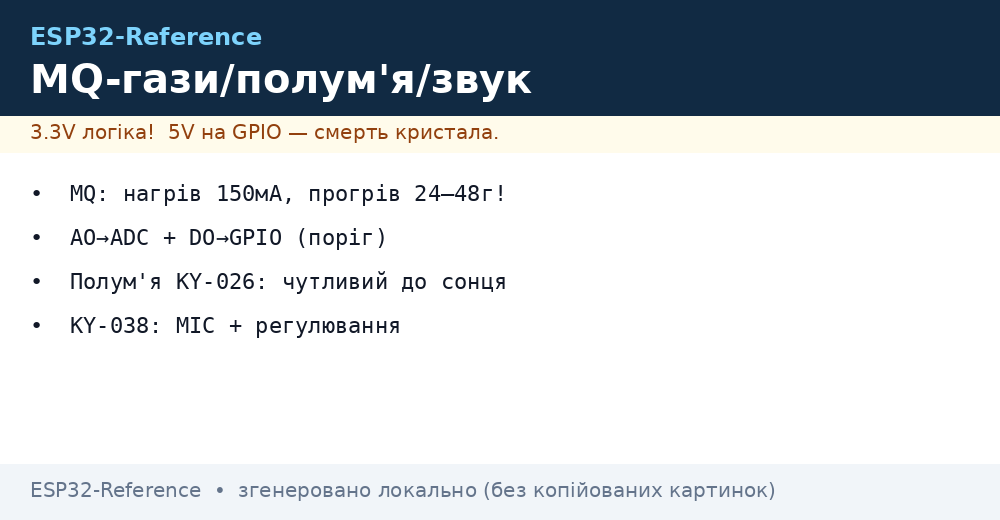
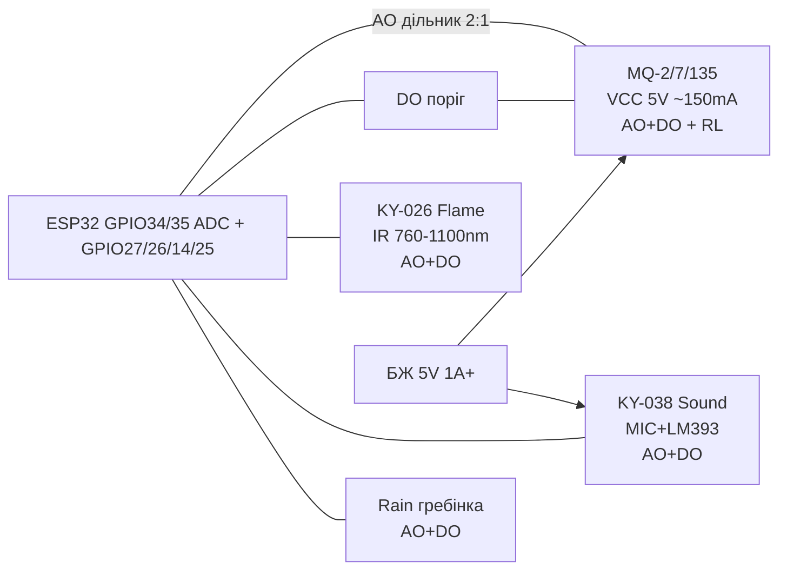

# MQ-2, MQ-7, MQ-135, полум'я KY-026, звук KY-038, дощ



## Призначення

Газові сенсори серії MQ - це напівпровідникові (SnO2) нагрівні датчики для **якісної** детекції газів і диму: витік LPG/метану/пропану (MQ-2), чадний газ CO (MQ-7), якість повітря/CO2/NH3/бензол (MQ-135). Модулі полум'я KY-026 (ІЧ-фотодіод), звуку KY-038 (електретний мікрофон MIC + компаратор LM393) та дощу/вологи (гребінчаста плата + компаратор) - це порогові модулі з подвійним виходом AO+DO для сигналізації, «розумного дому», охоронних шлейфів та димових сповіщувачів (не засобів безпеки життя без сертифікації!).

> Критично: MQ - це **нагрівач ~5 В / 150 мА (~800 мВт)**. Сенсор гріється до 200-300 °C, потребує **прогріву 24-48 год** для стабілізації базової лінії, не придатний для батареї без ключового керування живленням. Покази без калібрування по еталонному газу - лише відносні (Rs/R0), не ppm.

## Характеристики

| Параметр | MQ-2 (дим/LPG) | MQ-7 (CO) | MQ-135 (Air Quality) |
| --- | --- | --- | --- |
| Детектує | LPG, пропан, метан, H2, дим | CO (20-2000 ppm), H2 | NH3, NOx, бензол, CO2 (умовно), дим |
| Чутливий шар | SnO2, нагрів постійний 5 В | SnO2, імпульсний нагрів 5 В/1.4 В | SnO2, нагрів постійний 5 В |
| Діапазон (даташит) | 300-10000 ppm (LPG) | 20-2000 ppm (CO) | 10-1000 ppm (NH3/бензол) |
| Нагрівач | 5 В, ~150 мА, ~800 мВт | 5 В/1.4 В цикли 60/90 с, ~150 мА пік | 5 В, ~150 мА |
| Опір навантаження RL | 5 кОм (потенціометр модуля) | 10 кОм | 20 кОм (тип.) |
| Прогрів | 24-48 год перший, 2-5 хв щоразу | 48 год перший + цикл нагріву | 24-48 год перший |
| Вихід модуля | AO (0-VCC) + DO (поріг) | AO + DO | AO + DO |
| Живлення модуля | 5 В (логіка DO 5 В → дільник!) | 5 В | 5 В |
| Ціна/доступність | Дешевий, масовий | Дешевий | Дешевий |

| Модуль | Принцип | Виходи | Живлення |
| --- | --- | --- | --- |
| KY-026 Flame (полум'я) | ІЧ-фотодіод 760-1100 нм + LM393 | AO пропорційний ІЧ, DO поріг (потенціометр) | 3.3-5 В |
| KY-038 Sound (звук) | Електрет MIC + підсилювач + LM393 | AO огинаюча звуку, DO сплеск (потенціометр) | 3.3-5 В (краще 5 В) |
| Rain / Soil-water (дощ/волога) | Гребінка: опір падає від води + LM393 | AO вологість (інверсно), DO поріг | 3.3-5 В |
| FC-37 / HW-038 компаратор | LM393 на всіх модулях | DO open-collector з підтяжкою на модулі | - |

> Увага: DO більшості дешевих MQ-модулів підтягнутий до **5 В**. ESP32 не 5V-tolerant - став дільник 2:1 або живи компаратор модуля від 3.3 В (якщо дозволяє схема), або читай тільки AO через [ADC](../../../ESP32-Reference/06-Analog/01-ADC.md).

## Легенда пінів модуля

| Пін MQ-модуля (FC-22 тощо) | Призначення | Куди на ESP32 |
| --- | --- | --- |
| VCC | Живлення нагрівача + компаратора, 5 В | 5V (VIN/VU) або зовнішні 5 В 1 А |
| GND | Земля нагрівача | GND (товстий провід, спільна земля) |
| AO (A0) | Аналог дільника Rs/RL, 0-5 В (!) | GPIO34/35 через дільник 2:1 (на GPIO ≤3.3 В) |
| DO (D0) | Цифровий поріг LM393, HIGH - чисто, LOW - газ (зазвичай) | GPIO через дільник або безпосередньо якщо модуль на 3.3 В |
| Потенціометр | Поріг DO (обертати до клацання на чистому повітрі + чверть оберту назад) | - |
| Джампер/LED | PWR + DO-LED індикація спрацювання | - |

| KY-026 Flame | Призначення |
| --- | --- |
| VCC / GND | 3.3 В / GND (допустимо 5 В) |
| AO | Амплітуда ІЧ (полум'я свічки ~1-2 м на AO видно) |
| DO | LOW при полум'ї (поріг потенціометром) |
| Чутливість | Кут ~60°, дальність до 1-3 м (запальничка/свічка) |

| KY-038 Sound | Призначення |
| --- | --- |
| VCC / GND | 5 В краще (більший запас MIC), GND спільна |
| AO | Огинаюча звуку → [ADC](../../../ESP32-Reference/06-Analog/01-ADC.md) (тиша ~1.6 В, крик ~3 В) |
| DO | Імпульс LOW/HIGH на гучний сплеск (плескіт, стукіт) |
| Потенціометр | Поріг чутливості DO |

| Rain (гребінка + компаратор) | Призначення |
| --- | --- |
| VCC / GND | 3.3-5 В; для довговічності живити через GPIO тільки на вимір |
| AO (+/- плати) | Аналог: сухо ~3 В, мокро ~0.5-1 В |
| DO | LOW - мокро / дощ |
| Гребінка | Не занурювати роз'єм, тільки нікельовану гребінку; сушити після дощу |

## Схема підключення

| ESP32 | MQ-модуль | KY-026 | KY-038 | Rain | Примітка |
| --- | --- | --- | --- | --- | --- |
| 5V (VIN/VU) | VCC | - | VCC (5 В) | - | MQ тільки 5 В, струм 150 мА × N |
| 3V3 | - | VCC | - | VCC | Логіку KY-026/Rain можна 3.3 В |
| GND | GND | GND | GND | GND | Спільна земля обов'язково |
| GPIO34 (ADC1_CH6) | AO через дільник | - | - | - | Дільник 20 кОм / 10 кОм (5 В → 3.3 В) |
| GPIO35 (ADC1_CH7) | - | AO | AO (через дільник якщо 5 В) | AO | [ADC](../../../ESP32-Reference/06-Analog/01-ADC.md) |
| GPIO27 | DO через дільник | DO | - | - | [04-Pererivannya-PWM](../../../ESP32-Reference/03-GPIO/04-Pererivannya-PWM.md) для подій |
| GPIO26 | - | - | DO | DO | Переривання по фронту |

### ASCII-схема

```text
                ESP32-DevKitC
              +------------------+
  5V (VIN) ---| 5V        GPIO34 |---< 10k >---+---< 20k >--- AO (MQ, 0-5V)
              |                  |             |              (дільник 2:1 => 0-3.3V)
  3V3 --------| 3V3       GPIO35 |--- AO (KY-026 Flame / Rain)
              |                  |
  GND --------| GND          GND |--- GND (MQ / KY-026 / KY-038 / Rain)
              |           GPIO27 |---< дільник >--- DO (MQ)
              |           GPIO14 |--- DO (KY-026, LOW=полум'я)
              |           GPIO26 |--- DO (KY-038, сплеск звуку)
              |           GPIO25 |--- DO (Rain, LOW=мокро)
              +------------------+

  MQ-модуль: VCC=5V, прогрів 24-48г!  KY-038: VCC=5V для запасу MIC.
  AO ніколи безпосередньо з 5V-модуля в GPIO без дільника!
```

### Mermaid



## Код ESP-IDF

```c
#include "driver/adc.h"
#include "driver/gpio.h"
#include "esp_log.h"
#include "freertos/FreeRTOS.h"
#include "freertos/task.h"

#define MQ_AO_CH   ADC1_CHANNEL_6  // GPIO34
#define FLAME_DO   GPIO_NUM_14
#define SOUND_DO   GPIO_NUM_26
#define MQ_DO      GPIO_NUM_27
static const char *TAG = "gas";

// Rs/R0 базова лінія: калібрувати на чистому повітрі після прогріву!
static float mq_ratio(int raw) {
    float v = raw * 3.3f / 4095.0f;       // напруга на GPIO (після дільника!)
    float v_sensor = v * 1.5f;            // відновлення 0-5В шкали (дільник 2:1)
    if (v_sensor >= 5.0f) v_sensor = 4.99f;
    const float RL = 5.0f;                // кОм, MQ-2
    float rs = RL * (5.0f - v_sensor) / v_sensor;
    return rs; // поділити на R0 (заміряне на чистому повітрі) => Rs/R0
}

void app_main(void) {
    adc1_config_width(ADC_WIDTH_BIT_12);
    adc1_config_channel_atten(MQ_AO_CH, ADC_ATTEN_DB_11);
    gpio_set_direction(FLAME_DO, GPIO_MODE_INPUT);
    gpio_set_direction(SOUND_DO, GPIO_MODE_INPUT);
    gpio_set_direction(MQ_DO, GPIO_MODE_INPUT);
    // прогрів: у реальному пристрої чекати, тут логуємо нагадування
    ESP_LOGW(TAG, "MQ прогрів 24-48 год перший раз, 2-5 хв щоразу!");
    for (;;) {
        int raw = adc1_get_raw(MQ_AO_CH);
        ESP_LOGI(TAG, "MQ raw=%d Rs=%.1fk DO=%d FLAME=%d SOUND=%d",
            raw, mq_ratio(raw),
            gpio_get_level(MQ_DO), gpio_get_level(FLAME_DO),
            gpio_get_level(SOUND_DO));
        vTaskDelay(pdMS_TO_TICKS(500));
    }
}
```

## Код Arduino

```cpp
#define MQ_AO 34
#define MQ_DO 27
#define FLAME_AO 35
#define FLAME_DO 14
#define SOUND_DO 26
#define RAIN_AO 32

float R0 = 9.8; // підставити своє після калібрування на чистому повітрі!

void setup() {
  Serial.begin(115200);
  pinMode(MQ_DO, INPUT);
  pinMode(FLAME_DO, INPUT);
  pinMode(SOUND_DO, INPUT);
  analogReadResolution(12);
  Serial.println("MQ warm-up: чекай стабілізації 2-5 хв (перший раз 24-48 год)");
}

float readRs() {
  int raw = analogRead(MQ_AO);           // 0-4095
  float v = raw * 3.3 / 4095.0 * 1.5;    // компенсація дільника 2:1
  if (v >= 5.0) v = 4.99;
  return 5.0 * (5.0 - v) / v;            // RL=5k MQ-2
}

void loop() {
  float rs = readRs();
  Serial.printf("Rs/R0=%.2f DO=%d flame_AO=%d flame_DO=%d sound_DO=%d rain=%d\n",
    rs / R0, digitalRead(MQ_DO), analogRead(FLAME_AO),
    digitalRead(FLAME_DO), digitalRead(SOUND_DO), analogRead(RAIN_AO));
  if (digitalRead(FLAME_DO) == LOW) Serial.println("  ! ПОЛУМ'Я");
  if (digitalRead(MQ_DO) == LOW) Serial.println("  ! ГАЗ/ДИМ (поріг)");
  delay(500);
}
```

## Код MicroPython

```python
from machine import Pin, ADC
import time

mq = ADC(Pin(34)); mq.atten(ADC.ATTN_11DB); mq.width(ADC.WIDTH_12BIT)
flame_ao = ADC(Pin(35)); flame_ao.atten(ADC.ATTN_11DB)
rain = ADC(Pin(32)); rain.atten(ADC.ATTN_11DB)
mq_do = Pin(27, Pin.IN)
flame_do = Pin(14, Pin.IN)
sound_do = Pin(26, Pin.IN)

R0 = 9.8  # калібрувати на чистому повітрі!

def rs():
    raw = mq.read()
    v = raw * 3.3 / 4095 * 1.5
    if v >= 5.0: v = 4.99
    return 5.0 * (5.0 - v) / v

print("MQ warm-up: перший раз 24-48 год!")
while True:
    ratio = rs() / R0
    print("Rs/R0={:.2f} DO={} flame={}/{} sound={} rain={}".format(
        ratio, mq_do.value(), flame_ao.read(), flame_do.value(),
        sound_do.value(), rain.read()))
    if flame_do.value() == 0: print("  ! ПОЛУМ'Я")
    time.sleep_ms(500)
```

## Калібрування MQ на чистому повітрі

1. Винести на вулицю/провітрене приміщення, увімкнути на 24-48 год (перший раз).
2. Зчитати Rs 50 разів, усереднити → це R0 (зберегти у NVS/файл).
3. Поріг DO виставити: крутити потенціометр до згасання DO-LED, потім чверть оберту назад.
4. Перевірка: сірник/запальничка біля сенсора (обережно!) → Rs падає, Rs/R0 < 0.5.
5. MQ-7 окремо: потрібен імпульсний нагрів 5 В 60 с / 1.4 В 90 с - простий модуль без контролера дає лише якісний сигнал.

## Типові помилки

1. **Без прогріву 24-48 год** → «пливе» база, хибні ppm. Гріти добу перед калібруванням.
2. **Живлення MQ від 3.3 В** → нагрівач не виходить на режим, сенсор «сліпий». Тільки 5 В / 150 мА.
3. **AO 5 В безпосередньо в GPIO** → перевищення 3.6 В, деградація ADC. Дільник 20 кОм/10 кОм.
4. **DO 5 В безпосередньо в GPIO** → те саме. Дільник або живлення компаратора від 3.3 В.
5. **ppm по формулі з інтернету без еталону** → цифри «зі стелі». MQ - індикатор, не аналізатор.
6. **MQ на батареї постійно** → 150 мА з'їсть АКБ за години. Живити через MOSFET-ключ, вмикати на 5 хв/годину.
7. **KY-026 бачить лампи розжарювання/сонце** → хибне полум'я. Ставити козирок, перевіряти AO-динаміку (мерехтіння 5-15 Гц).
8. **KY-038 ловить вібрацію плати** → хибні сплески. Кріпити на демпфер, крутити поріг.
9. **Гребінка дощу під постійним живленням** → електрокорозія за тижні. Живити через GPIO тільки на вимір.
10. **Силіконові пари/лаки біля MQ** → отруєння SnO2 назавжди. Не фарбувати/герметизувати поруч.

## Офіційні джерела

- [Розбір датчика звуку KY-038 з кодом (LME)](https://lastminuteengineers.com/sound-sensor-arduino-tutorial/) - аналоговий і цифровий виходи, приклади.
- MQ-2/MQ-7/MQ-135 Datasheet (Winsen/Hanwei) - `перевірити вручну`.
- KY-026 Flame Datasheet (виробник модуля) - `перевірити вручну`.

- LM393 Datasheet (TI): <https://www.ti.com/product/LM393> - подвійний компаратор (пороги DO).

## Див. також

- [ADC](../../../ESP32-Reference/06-Analog/01-ADC.md)
- [04-Pererivannya-PWM](../../../ESP32-Reference/03-GPIO/04-Pererivannya-PWM.md)
- [01-GPIO-oglyad](../../../ESP32-Reference/03-GPIO/01-GPIO-oglyad.md)
- [I2C](../../../ESP32-Reference/04-Shini/03-I2C.md)
- [SPI](../../../ESP32-Reference/04-Shini/02-SPI.md)
- [UART](../../../ESP32-Reference/04-Shini/01-UART.md)
- [06-INA219-HX711-BH1750](../../../ESP32-Reference/10-Sensori/06-INA219-HX711-BH1750.md)
- [Home](../../../ESP32-Reference/Home.md)
