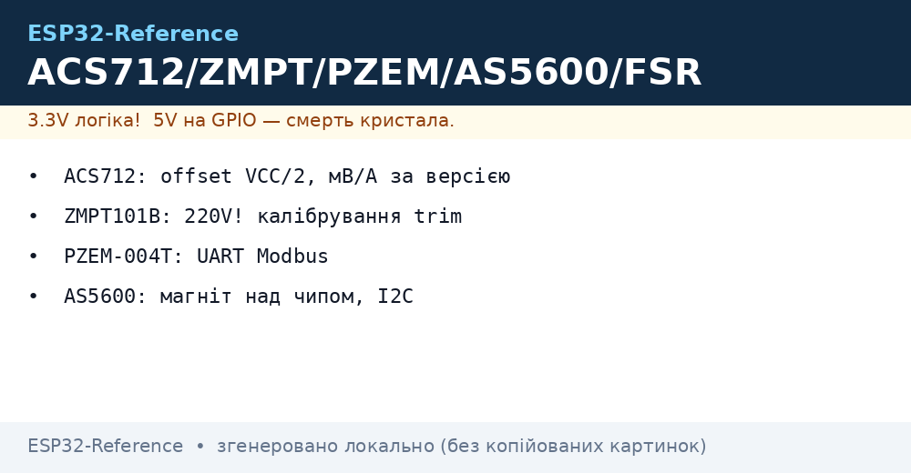
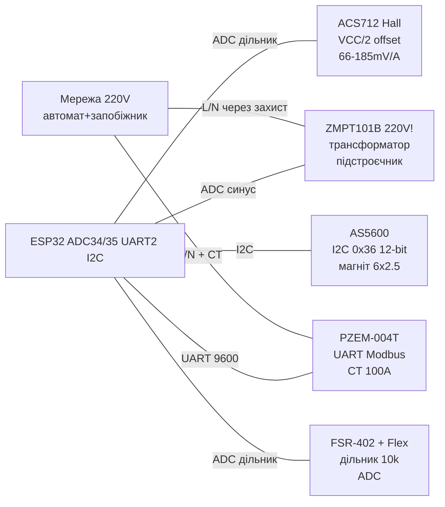
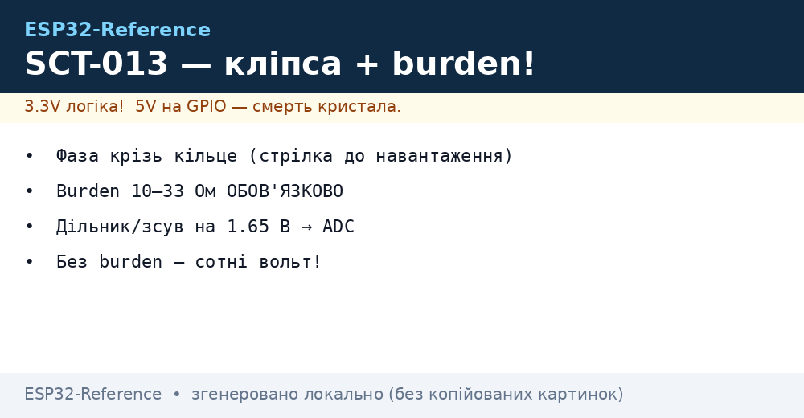

# ACS712, ZMPT101B, PZEM-004T, AS5600, FSR, Flex



## Призначення

Силова та магнітна група: ACS712 - Холл-датчик постійного/змінного струму (±5/20/30 А) з ізоляцією; ZMPT101B - трансформаторний модуль напруги мережі 220 В з підстроєчником калібрування; PZEM-004T - готовий UART/Modbus-лічильник (V/I/P/E) з роз'ємним CT; AS5600 - 12-бітний магнітний енкодер кута (I2C + PWM + аналог); FSR-402 та Flex 2.2" - резистивні датчики сили/згину через дільник напруги. Застосування: моніторинг споживання, розумні розетки, керування моторами (FOC), ваги/натискання, згини рукавичок/роботів.

> БЕЗПЕКА МЕРЕЖІ 220 В: ZMPT101B і PZEM-004T працюють з фазою! Один дотик - смертельно. Усі підключення - при вимкненому автоматі, перевірка індикатором, корпус закритий, повзучі відстані ≥3 мм, запобіжник + варистор на вході. Без досвіду - тільки PZEM з закритим CT (не розривати фазу) або викликати електрика.

## Характеристики

| Параметр | ACS712-05/20/30 | ZMPT101B модуль | PZEM-004T v3 | AS5600 |
| --- | --- | --- | --- | --- |
| Вимірює | Струм DC/AC, ізоляція 2.1 кВ | Напруга AC 0-250 В | V/I/P/E/F/PF по UART | Кут 0-360°, 12 біт |
| Вихід | Аналог: VCC/2 ± чутливість | Аналог-синус ~0-5 В (зсув 2.5 В) | UART 9600 Modbus-RTU + TTL | I2C 0x36 + PWM + AO |
| Чутливість | 185/100/66 мВ/А | Калібрується підстроєчником | CT 100 А макс, 0.5 % | 0.0879°/LSB |
| Живлення | 5 В (VCC/2 = 2.5 В нуль) | 5 В (ОП-підсилювач) | 5 В (логіка TTL → дільник RX!) | 3.3-5 В |
| Смуга/швидкість | 80 кГц, шум ~20 мА п-п | 50 Гц синус, потрібна вибірка ≥1 кГц | Оновлення ~1 с | I2C до 1 МГц |
| Калібрування | Нуль при 0 А (усереднити 1000 точок) | Підстроєчник по еталонному вольтметру | Заводське, CT стрілкою до навантаження | Магніт ⌀6×2.5 мм, зазор 0.5-3 мм |

| Параметр | FSR-402 | Flex 2.2" |
| --- | --- | --- |
| Діапазон | 0.1-10 кг (лог: 100 кОм → 200 Ом) | Згин 0-90°: 10 кОм → 20-30 кОм |
| Схема | Дільник з 10 кОм до VCC | Дільник з 10 кОм до VCC |
| Живлення | 3.3 В (безпосередньо в ADC) | 3.3 В |
| Дрейф | Гістерезис 10-15 %, старіння | Втома після 10k згинів |
| Захист | Активна зона не дряпати, шайба-розподільник | Не згинати за межами чутливої зони |

## Легенда пінів модуля

| ACS712 (30A) | Призначення | Куди |
| --- | --- | --- |
| VCC / GND | 5 В / земля (аналог чутливий!) | 5V / GND окремим дротом |
| OUT | VCC/2 (2.5 В) при 0 А, ±66-185 мВ/А | GPIO34 через дільник 2:1 (5 В шкала!) |
| IP+/IP− | Силові клеми (струм через мідну шину) | Розрив кола: джерело → IP+, навантаження → IP− |

| ZMPT101B | Призначення |
| --- | --- |
| VCC/GND | 5 В / GND |
| OUT | Синус зі зсувом ~2.5 В, амплітуда регулюється синім підстроєчником |
| Калібрувальник | багатооборотний потенціометр: крутити під еталонним 220 В до правильної амплітуди |
| Вхід L/N | Гвинтові клеми мережі (увага: фаза!) |

| PZEM-004T | Призначення | Куди на ESP32 |
| --- | --- | --- |
| 5V / GND | Живлення логіки | 5V / GND |
| TX / RX (TTL) | UART 9600 8N1 Modbus | TX→GPIO16 (RX2), RX→GPIO17 (TX2) через дільник (PZEM TX 5 В!) |
| L/N (AC input) | Власне живлення + вимір напруги | Паралельно мережі через запобіжник |
| CT (2 піни) | Роз'ємний трансформатор 100 А | Обхопити ОДИН фазний провід, стрілка до навантаження |

| AS5600 | Призначення | Куди |
| --- | --- | --- |
| VCC/GND | 3.3 В (рекомендовано) | 3V3 / GND |
| SDA/SCL | I2C 0x36, регістри RAW 0x0C-0x0E | GPIO21/22 |
| DIR | Напрям зростання кута (GND/VCC) | GND (або GPIO) |
| PWM/OUT | ШІМ 920 Гц ∝ кут (резерв) | GPIO (опційно) |

| FSR / Flex | Призначення |
| --- | --- |
| Пін 1 | 3.3 В |
| Пін 2 (середина) | Вузол дільника → GPIO32/33 ([ADC](../../../ESP32-Reference/06-Analog/01-ADC.md)) + резистор 10 кОм до GND |
| Екранування | Кручена пара, конденсатор 100 нФ паралельно 10 кОм для згладжування |

## Схема підключення

| ESP32 | ACS712 | ZMPT101B | PZEM-004T | AS5600 | FSR/Flex | Примітка |
| --- | --- | --- | --- | --- | --- | --- |
| 5V | VCC | VCC | 5V | - | - | Аналогове живлення 5 В |
| 3V3 | - | - | - | VCC | Верх дільника | Цифра/датчики 3.3 В |
| GND | GND | GND | GND | GND | Низ дільника | Зірка земель |
| GPIO34 | OUT дільник | - | - | - | - | ACS712 масштаб 5→3.3 В |
| GPIO35 | - | OUT дільник | - | - | - | ZMPT синус, зсув 2.5 В |
| GPIO16 (RX2) | - | - | TX дільник | - | - | [UART](../../../ESP32-Reference/04-Shini/01-UART.md) |
| GPIO17 (TX2) | - | - | RX безпосередньо | - | - | 3.3 В → 5 В вхід спрацьовує |
| GPIO21/22 | - | - | - | SDA/SCL | - | [I2C](../../../ESP32-Reference/04-Shini/03-I2C.md) |
| GPIO32/33 | - | - | - | - | Середина дільника | FSR/Flex ADC |

### ASCII-схема

```text
              ESP32-DevKitC
            +------------------+
 5V --------| 5V         GPIO34|---< 10k >---+---< 20k >--- ACS712 OUT (0-5V)
 3V3 -------| 3V3        GPIO35|---< 10k >---+---< 20k >--- ZMPT101B OUT (синус)
 GND -------| GND        GPIO16|---< дільник >--- PZEM TX (5V TTL!)
            |            GPIO17|--- PZEM RX
            |      GPIO21/22   |--- SDA/SCL (AS5600 0x36)
            |            GPIO32|---+--- FSR/Flex --- 3V3
            |                  |   +--- 10k --- GND  (+100nF)
            +------------------+

 МЕРЕЖА 220V: [Автомат]--[Запобіжник 1A]--+-- PZEM L/N
                                         +-- ZMPT L/N
               Фаза через CT (стрілка!) для PZEM. НЕ розривати нуль замість фази!
```

### Mermaid



## Код ESP-IDF

```c
#include "driver/adc.h"
#include "driver/i2c.h"
#include "driver/uart.h"
#include "esp_log.h"
#include "freertos/FreeRTOS.h"
#include "freertos/task.h"
#include <math.h>

static const char *TAG = "power";
#define ACS_CH ADC1_CHANNEL_6 // GPIO34

static float acs_zero = 2048; // калібрувати при 0А!

static void acs_cal(void) {
    // IDF 4.x API! У IDF 5.x: adc_oneshot_read() - див. 99-Dodatki/07-Versions
    long s = 0; for (int i = 0; i < 1000; i++) { s += adc1_get_raw(ACS_CH); }
    acs_zero = s / 1000.0f;
}

// Vrms мережі із ZMPT (канал GPIO35), вибірка 20мс вікна
static float zmpt_vrms(float cal_k) {
    long sum2 = 0; int mean = 0, n = 200;
    for (int i = 0; i < n; i++) mean += adc1_get_raw(ADC1_CHANNEL_7);
    mean /= n;
    for (int i = 0; i < n; i++) { int d = adc1_get_raw(ADC1_CHANNEL_7) - mean; sum2 += d * d; }
    return sqrtf(sum2 / (float)n) * cal_k; // cal_k підібрати по вольтметру
}

void app_main(void) {
    adc1_config_width(ADC_WIDTH_BIT_12);
    adc1_config_channel_atten(ACS_CH, ADC_ATTEN_DB_11);
    adc1_config_channel_atten(ADC1_CHANNEL_7, ADC_ATTEN_DB_11);
    acs_cal();
    ESP_LOGI(TAG, "ACS zero=%.0f", acs_zero);
    for (;;) {
        int raw = adc1_get_raw(ACS_CH);
        float amps = (raw - acs_zero) * 3.3 / 4095 * 1.5 / 0.066; // 30A: 66мВ/А + дільник
        ESP_LOGI(TAG, "I=%.2f A Vrms=%.1f (k)", amps, zmpt_vrms(1.0));
        vTaskDelay(pdMS_TO_TICKS(500));
    }
}
```

## Код Arduino

```cpp
#include <Wire.h>
#include <PZEM004Tv30.h>

#define ACS_PIN 34
#define ZMPT_PIN 35
#define FSR_PIN 32
#define PZEM_RX 16
#define PZEM_TX 17

PZEM004Tv30 pzem(Serial2, PZEM_RX, PZEM_TX);
float acsZero = 0;

void setup() {
  Serial.begin(115200);
  Serial2.begin(9600, SERIAL_8N1, PZEM_RX, PZEM_TX); // [[04-Shini/01-UART|UART]]
  Wire.begin(21, 22);
  analogReadResolution(12);
  long s = 0; for (int i = 0; i < 1000; i++) s += analogRead(ACS_PIN);
  acsZero = s / 1000.0; // калібрування нуля БЕЗ струму!
  Serial.printf("ACS zero=%.0f\n", acsZero);
}

float readVrms() {
  int mean = 0, n = 300;
  for (int i = 0; i < n; i++) mean += analogRead(ZMPT_PIN);
  mean /= n;
  long s2 = 0;
  for (int i = 0; i < n; i++) { int d = analogRead(ZMPT_PIN) - mean; s2 += (long)d * d; }
  return sqrt(s2 / (float)n) * 0.9; // коефіцієнт — по вольтметру підстроєчником+константою!
}

uint16_t as5600_raw() {
  Wire.beginTransmission(0x36); Wire.write(0x0C); Wire.endTransmission(false);
  Wire.requestFrom(0x36, 2);
  return ((Wire.read() & 0x0F) << 8) | Wire.read();
}

void loop() {
  float i = (analogRead(ACS_PIN) - acsZero) * 3.3 / 4095 * 1.5 / 0.066;
  Serial.printf("ACS I=%.2fA Vrms~%.0f AS5600=%d (%.1f deg) FSR=%d\n",
    i, readVrms(), as5600_raw(), as5600_raw() * 360.0 / 4096, analogRead(FSR_PIN));
  Serial.printf("PZEM: %.1fV %.3fA %.1fW %.0fWh\n",
    pzem.voltage(), pzem.current(), pzem.power(), pzem.energy());
  delay(1000);
}
```

## Код MicroPython

```python
from machine import Pin, ADC, I2C, UART
import time, math

acs = ADC(Pin(34)); acs.atten(ADC.ATTN_11DB)
zmpt = ADC(Pin(35)); zmpt.atten(ADC.ATTN_11DB)
fsr = ADC(Pin(32)); fsr.atten(ADC.ATTN_11DB)
i2c = I2C(0, scl=Pin(22), sda=Pin(21))
uart = UART(2, 9600, rx=16, tx=17)  # PZEM Modbus — потрібен драйвер modbus

zero = sum(acs.read() for _ in range(500)) / 500
print("ACS zero", zero)

def vrms(n=200):
    m = sum(zmpt.read() for _ in range(n)) / n
    s = sum((zmpt.read() - m) ** 2 for _ in range(n))
    return math.sqrt(s / n)  # помножити на калібрувальний коефіцієнт

def as5600():
    i2c.writeto(0x36, b"\x0c")
    d = i2c.readfrom(0x36, 2)
    return ((d[0] & 0x0F) << 8) | d[1]

while True:
    amps = (acs.read() - zero) * 3.3 / 4095 * 1.5 / 0.066
    print("I={:.2f}A Vrms_raw={:.0f ang={:.1f} fsr={}".format(
        amps, vrms(), as5600() * 360 / 4096, fsr.read()))
    time.sleep(1)
```

### SCT-013 - роз'ємний трансформатор струму (без розриву дроту!)

| Параметр | SCT-013-000 / -030 / -100 |
| --- | --- |
| Принцип | CT з кліпсою: провід-фаза проходить крізь кільце, розривати нічого не треба |
| Вихід | -000: струмовий 0-50 мА (потрібен burden-резистор!); -030/-100: вже з вбудованим burden, вихід 0-1 В |
| Діапазони | 30 А / 100 А (версії), точність ±1-3 % після калібрування |
| Підключення | Burden 10-33 Ом → дільник/зсув на 1.65 В → ADC (середина шкали = 0 А) |

```text
Фаза ──(крізь кліпсу SCT-013-000)──► навантаження
SCT вихід ──[burden 22 Ом]──┬──[C 10мкФ + дільник 2×10к до 3V3]──► GPIO34 (ADC)
                            └── стрілка кліпси ДО навантаження (фаза струму!)
```

> SCT-013-000 (без burden) vs -030/-100 (з burden): голому burden обов'язковий - без нього сотні вольт на холостому ходу і смерть ADC!


*Рис. SCT-013: кліпса на фазу, burden-резистор, зсув на середину шкали ADC.*

## Типові помилки

1. **ACS712 OUT 5 В в GPIO** → дільник обов'язковий; нуль VCC/2 пливе з 5 В - живити від стабільного БЖ.
2. **Нуль ACS не відкалібрований** → «струм» 0.3 А без навантаження. Усереднити 1000 точок при 0 А при кожному старті.
3. **Шум ACS на малих струмах** → усереднення 50-100 вибірок + конденсатор 1 нФ на OUT (за даташитом - пін FILTER).
4. **ZMPT без калібрування** → показує «погоду». Крутити підстроєчник під еталонним true-RMS вольтметром при ~220 В.
5. **ZMPT: дотик до L/N** → смертельно. Паяти тільки знеструмленим, заливати клеми, запобіжник 1 А.
6. **PZEM TX 5 В в RX ESP32** → дільник 1 кОм/2 кОм; інакше деградація входу.
7. **CT PZEM на двох дротах** → нуль (поля компенсуються). Обхопити тільки фазу, стрілка до навантаження.
8. **AS5600: не той магніт/зазор** → стрибки кута. Діаметрально намагнічений ⌀6×2.5 мм, зазор 0.5-3 мм по осі.
9. **AS5600 поруч із мотором** → магнітне поле ротора б'є. Виносити на вал через немагнітну муфту, кручена пара I2C.
10. **FSR без розподільника сили** → точкові піки. Шайба/гума Ø active area, не перегинати хвостовик.
11. **Спільна земля 220 В і ESP32** → петлі/небезпека. ZMPT/PZEM дають ізоляцію - не з'єднувати PE/фазу з GND логіки.
12. **SCT-013-000 без burden-резистора** → сотні вольт на виході, смерть ADC. Burden 10-33 Ом обов'язково; версії -030/-100 вже з вбудованим.

## Офіційні джерела

- [FSR - живе фото (Adafruit)](https://www.adafruit.com/product/166) - сторінка товару з фото і документацією.
- ACS712 Datasheet (Allegro) - `перевірити вручну`.
- ZMPT101B / PZEM-004T (Peacefair) - `перевірити вручну`.
- AS5600 Datasheet (ams-OSRAM) - `перевірити вручну` (редизайн сайту).

## Див. також

- [ADC](../../../ESP32-Reference/06-Analog/01-ADC.md)
- [04-Pererivannya-PWM](../../../ESP32-Reference/03-GPIO/04-Pererivannya-PWM.md)
- [I2C](../../../ESP32-Reference/04-Shini/03-I2C.md)
- [SPI](../../../ESP32-Reference/04-Shini/02-SPI.md)
- [UART](../../../ESP32-Reference/04-Shini/01-UART.md)
- [06-INA219-HX711-BH1750](../../../ESP32-Reference/10-Sensori/06-INA219-HX711-BH1750.md)
- [Home](../../../ESP32-Reference/Home.md)
