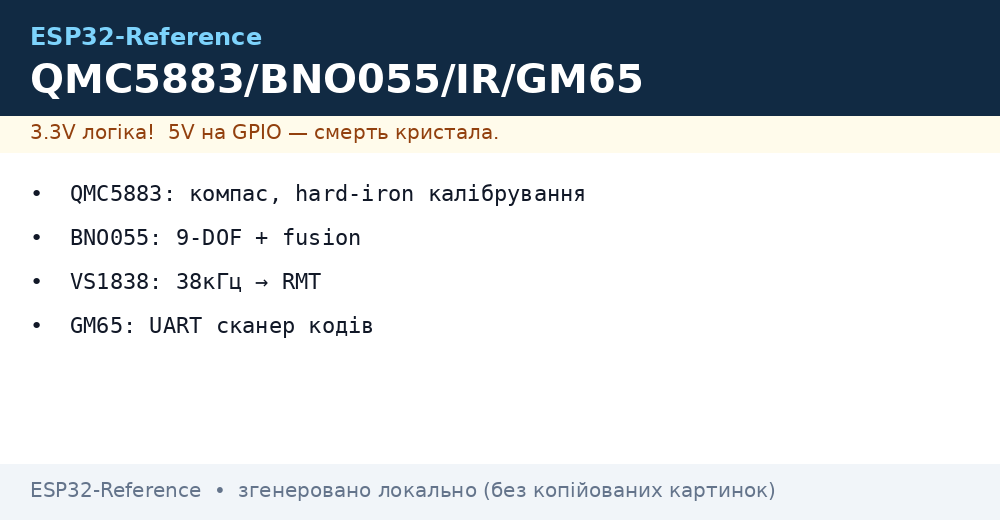
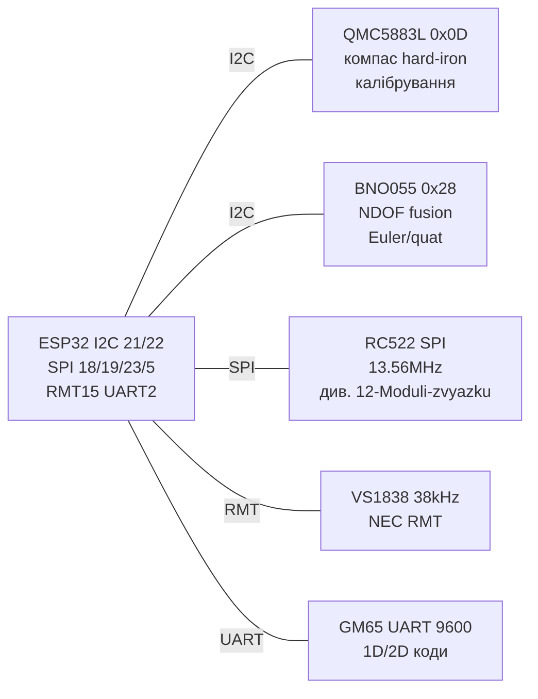

# QMC5883L компас, BNO055 9-DOF, RFID-RC522 міст, IR VS1838, сканер GM65



## Призначення

Вузол «орієнтація + ідентифікація»: QMC5883L (клон HMC5883L) - 3-осьовий магнітометр-компас (азимут), BNO055 / MPU-9250 - 9-DOF (акселерометр+гіроскоп+магнітометр з fusion на кристалі у BNO055), RC522 - RFID 13.56 МГц (міст до [01-RC522-RFID](../../../ESP32-Reference/12-Moduli-zvyazku/01-RC522-RFID.md)), VS1838 - ІЧ-приймач пультів (NEC), GM65 - лазерний/CMOS сканер штрих-/QR-кодів по UART. Разом - навігація робота, стабілізація, безконтактні мітки, керування з пульта, облік товарів.

> Калібрування компаса обов'язкове: hard-iron (зсув від батарей/моторів) прибирається обертанням «вісімкою» та відніманням (max+min)/2, soft-iron - масштабуванням осей. Без калібрування похибка 20-60° біля ESP32 (струми Wi-Fi!).

## Характеристики

| Параметр | QMC5883L (HMC5883L-клон) | BNO055 9-DOF | MPU-9250 (якщо є) |
| --- | --- | --- | --- |
| Сенсори | Магнітометр 3 осі, ±8 Гаус | Accel+Gyro+Mag + Cortex-M0 fusion | Accel+Gyro+AK8963 Mag |
| Інтерфейс/адреса | I2C 0x0D (увага: НЕ 0x1E як HMC!) | I2C 0x28/0x29 (ADR) + UART-HID | I2C 0x68 + AK8963 0x0C |
| Діапазон/роздільність | 16 біт, ~±8 G, 200 Гц | Euler/Quaternion, 100 Гц | 16 біт кожен |
| Точність азимуту | 1-2° після калібрування (поза металом) | 2-3° (NDOF fusion) | 2-5° (власний fusion) |
| Живлення | 3.3 В (модуль GY-273 з LDO) | 3.3 В | 3.3 В |
| Режими | Continuous 10-200 Гц, oversampling | CONFIG/ACCONLY/NDOF… | Sleep/Wake |
| Переривання | DRDY (дані готові) | INT (рух/дані) | INT |

| Параметр | RC522 RFID (міст) | VS1838 IR | GM65 сканер |
| --- | --- | --- | --- |
| Частота/протокол | 13.56 МГц, SPI, MIFARE Classic/Ultralight | 38 кГц несуча, NEC/RC5 | CMOS, читає 1D/2D, UART/USB-HID |
| Інтерфейс | SPI: SCK/MISO/MOSI/SDA(SS)/RST | Цифра: OUT LOW-імпульси посилок | UART 9600 (TTL) + тригер |
| Живлення | 3.3 В (5 В спалить!) | 2.7-5.5 В | 5 В (логіка TX 5 В → дільник!) |
| Дальність | 2-4 см (брелок/карта) | 5-10 м (пряма видимість) | 5-30 см від коду |
| Деталі | Детально - [01-RC522-RFID](../../../ESP32-Reference/12-Moduli-zvyazku/01-RC522-RFID.md) | AGC: сонце/лампи сліплять | Префікс/суфікс CR/LF налаштовується |

## Легенда пінів модуля

| GY-273 QMC5883L | Призначення | Куди |
| --- | --- | --- |
| VCC / GND | 3.3 В / земля (LDO на модулі, 5 В теж терпить але краще 3.3 В) | 3V3 / GND |
| SDA / SCL | I2C | GPIO21 / GPIO22 ([I2C](../../../ESP32-Reference/04-Shini/03-I2C.md)) |
| DRDY | Дані готові (опційно) | GPIO33 |

| BNO055 (CJMCU/Adafruit) | Призначення | Куди |
| --- | --- | --- |
| VIN/VCC / GND | 3.3 В | 3V3 / GND |
| SDA/SCL | I2C 0x28 (ADR=GND) / 0x29 (ADR=VCC) | GPIO21/22 |
| ADR | Вибір адреси | GND → 0x28 |
| INT / RST | Переривання / скидання | GPIO25 / GPIO26 (опційно) |
| PS0/PS1 | 00 = UART, 01 = HID-I2C - залишити для I2C | За шелкографією |

| RC522 (міст, коротко) | Призначення | Куди |
| --- | --- | --- |
| 3.3V / GND | Тільки 3.3 В! | 3V3 / GND |
| SCK/MISO/MOSI | SPI | GPIO18/19/23 ([SPI](../../../ESP32-Reference/04-Shini/02-SPI.md)) |
| SDA(SS)/RST | Вибір кристала/скидання | GPIO5 / GPIO27 |
| IRQ | Переривання карти (опційно) | NC/GPIO |

| VS1838 | Призначення | Куди |
| --- | --- | --- |
| VCC/GND | 3.3-5 В | 3V3 / GND + 100 Ом + 47 мкФ (фільтр!) |
| OUT | Пачки LOW (NEC: 9 мс + 4.5 мс старт) | GPIO15 ([04-Pererivannya-PWM](../../../ESP32-Reference/03-GPIO/04-Pererivannya-PWM.md) RMT!) |

| GM65 | Призначення | Куди |
| --- | --- | --- |
| VCC/GND | 5 В | 5V / GND |
| TX/RX | UART 9600 (заводське) | TX→GPIO16 дільник, RX→GPIO17 ([UART](../../../ESP32-Reference/04-Shini/01-UART.md)) |
| TRIG | Запуск сканування (LOW-імпульс) | GPIO13 або кнопка |
| BEEP/LED | Індикація (на модулі) | - |

## Схема підключення

| ESP32 | QMC5883L | BNO055 | RC522 | VS1838 | GM65 | Примітка |
| --- | --- | --- | --- | --- | --- | --- |
| 3V3 | VCC | VIN | 3.3V | VCC | - | Одна шина 3.3 В (ємність 47 мкФ біля VS1838) |
| 5V | - | - | - | - | VCC | Сканер тільки 5 В |
| GND | GND | GND | GND | GND | GND | Зірка |
| GPIO21 | SDA | SDA | - | - | - | I2C шина |
| GPIO22 | SCL | SCL | - | - | - | I2C шина |
| GPIO18/19/23 | - | - | SCK/MISO/MOSI | - | - | SPI |
| GPIO5/27 | - | - | SS/RST | - | - | RC522 вибір |
| GPIO15 | - | - | - | OUT | - | RMT-декодер NEC |
| GPIO16/17 | - | - | - | - | TX/RX | UART2 9600 |

### ASCII-схема

```text
              ESP32-DevKitC
            +------------------+
 3V3 -------| 3V3       GPIO21 |--- SDA (QMC5883L 0x0D + BNO055 0x28)
 GND -------| GND       GPIO22 |--- SCL (обидва, pullup 4k7)
 5V --------| 5V          GPIO5 |--- SS (RC522)
            |       GPIO18/19/3|--- SCK/MISO/MOSI (RC522 SPI)
            |           GPIO27 |--- RST (RC522)
            |           GPIO15 |--- OUT (VS1838, +RC 100R/47uF на VCC)
            |           GPIO16 |---< дільник >--- TX (GM65 5V!)
            |           GPIO17 |--- RX (GM65)
            |           GPIO33 |--- DRDY (QMC5883L)
            |           GPIO25 |--- INT (BNO055)
            +------------------+
 RC522 строго 3.3V! GM65 TRIG -> GND-кнопка або GPIO13.
 QMC5883L подалі від моторів/магнітів (>10см), вісь X - вперед.
```

### Mermaid



## Код ESP-IDF

```c
#include "driver/i2c.h"
#include "driver/rmt.h"
#include "esp_log.h"
#include <math.h>
#define I2C_P I2C_NUM_0
static const char *TAG = "imu";

// QMC5883L 0x0D: init continuous 200Hz, читання X/Y/Z
static void qmc_init(void) {
    uint8_t d1[] = {0x0B, 0x01}; // SET/RESET period
    uint8_t d2[] = {0x09, 0x1D}; // 200Hz, 8G, 512 OSR, continuous
    i2c_master_write_to_device(I2C_P, 0x0D, d1, 2, 100);
    i2c_master_write_to_device(I2C_P, 0x0D, d2, 2, 100);
}
static float heading(int16_t x, int16_t y, int16_t x0, int16_t y0) {
    float h = atan2f((y - y0), (x - x0)) * 180 / M_PI;
    if (h < 0) h += 360;
    return h;
}
// BNO055: NDOF mode, читання Euler H/L (0x1A..)
static void bno_ndof(void) {
    uint8_t m[] = {0x3D, 0x0C}; // OPR_MODE NDOF
    i2c_master_write_to_device(I2C_P, 0x28, m, 2, 100);
}

void app_main(void) {
    i2c_config_t c = {.mode=I2C_MODE_MASTER,.sda_io_num=21,.scl_io_num=22,
        .sda_pullup_en=1,.scl_pullup_en=1,.master.clk_speed=100000};
    i2c_param_config(I2C_P,&c); i2c_driver_install(I2C_P,c.mode,0,0,0);
    qmc_init(); bno_ndof();
    // hard-iron приклад: підстав свої min/max після «вісімки»
    int16_t x0 = 0, y0 = 0;
    for (;;) {
        uint8_t r = 0x00; uint8_t d[6];
        i2c_master_write_read_device(I2C_P, 0x0D, &r, 1, d, 6, 100);
        int16_t x = d[0]|(d[1]<<8), y = d[2]|(d[3]<<8);
        ESP_LOGI(TAG, "head=%.1f", heading(x, y, x0, y0));
        vTaskDelay(pdMS_TO_TICKS(200));
    }
}
```

## Код Arduino

```cpp
#include <Wire.h>
#include <Adafruit_Sensor.h>
#include <Adafruit_BNO055.h>
#include <QMC5883LCompass.h>
#include <IRremote.h>

QMC5883LCompass compass;
Adafruit_BNO055 bno(55, 0x28);
#define IR_PIN 15
#define GM_RX 16
#define GM_TX 17

void setup() {
  Serial.begin(115200);
  Serial2.begin(9600, SERIAL_8N1, GM_RX, GM_TX); // GM65 [[04-Shini/01-UART|UART]]
  Wire.begin(21, 22);
  compass.init();
  // compass.setCalibration(minX,maxX, minY,maxY, minZ,maxZ); // після калібрування!
  bno.begin();
  bno.setMode(Adafruit_BNO055::OPERATION_MODE_NDOF);
  IrReceiver.begin(IR_PIN, true);
}

void loop() {
  compass.read();
  int x = compass.getX(), y = compass.getY();
  float head = atan2(y, x) * 180 / PI; if (head < 0) head += 360;
  sensors_event_t e; bno.getEvent(&e);
  Serial.printf("comp=%.0f BNO yaw=%.0f pitch=%.0f roll=%.0f\n",
    head, e.orientation.x, e.orientation.y, e.orientation.z);
  if (IrReceiver.decode()) { // VS1838 NEC
    Serial.printf("IR: 0x%lX\n", (unsigned long)IrReceiver.decodedIRData.decodedRawData);
    IrReceiver.resume();
  }
  while (Serial2.available()) Serial.write(Serial2.read()); // штрих-код -> USB
  delay(200);
}
```

## Код MicroPython

```python
from machine import I2C, Pin, UART
import time, math

i2c = I2C(0, scl=Pin(22), sda=Pin(21), freq=100000)
uart = UART(2, 9600, rx=16, tx=17)  # GM65
ir = Pin(15, Pin.IN)

# QMC5883L init
i2c.writeto_mem(0x0D, 0x0B, b"\x01")
i2c.writeto_mem(0x0D, 0x09, b"\x1D")

def qmc():
    d = i2c.readfrom_mem(0x0D, 0x00, 6)
    x = int.from_bytes(d[0:2], "little", True)
    y = int.from_bytes(d[2:4], "little", True)
    return x, y

# hard-iron: обертати «вісімкою» 30с, зібрати min/max
mins = [9999, 9999]; maxs = [-9999, -9999]
t0 = time.ticks_ms()
print("Калібрування: обертай плату вісімкою 15с!")
while time.ticks_diff(time.ticks_ms(), t0) < 15000:
    x, y = qmc()
    mins[0] = min(mins[0], x); maxs[0] = max(maxs[0], x)
    mins[1] = min(mins[1], y); maxs[1] = max(maxs[1], y)
    time.sleep_ms(50)
x0 = (mins[0] + maxs[0]) // 2; y0 = (mins[1] + maxs[1]) // 2
print("offsets:", x0, y0)

while True:
    x, y = qmc()
    h = math.degrees(math.atan2(y - y0, x - x0))
    if h < 0: h += 360
    code = uart.read()
    print("head={:.0f} ir={} gm65={}".format(h, ir.value(), code))
    time.sleep_ms(200)
```

## Типові помилки

1. **QMC5883L шукають на 0x1E** → клон відповідає на **0x0D**. Сканувати шину `i2c.scan()`.
2. **Бібліотека HMC5883L з QMC** → різні регістри, сміття. Тільки QMC-драйвер (QMC5883LCompass).
3. **Без hard-iron калібрування** → похибка 30-60° від Wi-Fi струмів/гвинтів. «Вісімка» при кожному монтажі.
4. **Компас біля мотора/динаміка/ESP32-антени** → девіація. Виносити на щоглу 10+ см, кручена пара.
5. **BNO055 не в NDOF** → сирі дані без fusion. `setMode(NDOF)` + калібрувальні рухи (gyro спокій, mag вісімка, accel 6 поз).
6. **BNO055 адреса 0x29 vs 0x28** → залежить від ADR. Сканувати, підтягнути ADR до GND.
7. **RC522 від 5 В** → смерть. Тільки 3.3 В, деталі - [01-RC522-RFID](../../../ESP32-Reference/12-Moduli-zvyazku/01-RC522-RFID.md).
8. **VS1838 без RC-фільтра** → спрацювання від Wi-Fi/БЖ. 100 Ом + 47 мкФ на VCC, екран від сонця.
9. **IR-декодування через `digitalRead`** → нестабільне. Тільки RMT/IRremote з таймінгами NEC.
10. **GM65 TX 5 В в GPIO16** → дільник; швидкість перевірити (завод 9600, але буває 115200).
11. **I2C-шлейф довгий/без pullup** → NACK компаса. <30 см, 4.7 кОм до 3.3 В, ємність шини <400 пФ.

## Офіційні джерела

- [BNO055 - сторінка продукту і даташит (Bosch)](https://www.bosch-sensortec.com/en/products/smart-sensor-systems/bno055/) - офіційні характеристики та документація.
- [BNO055 - живе фото (Adafruit)](https://www.adafruit.com/product/2472) - сторінка товару з фото.
- [Гайд BNO055 з кодом (Adafruit Learn)](https://learn.adafruit.com/adafruit-bno055-absolute-orientation-sensor) - орієнтація, калібрування, приклади.
- HMC5883L/QMC5883L і NXP MFRC522 Datasheet - `перевірити вручну`.

## Див. також

- [I2C](../../../ESP32-Reference/04-Shini/03-I2C.md)
- [SPI](../../../ESP32-Reference/04-Shini/02-SPI.md)
- [UART](../../../ESP32-Reference/04-Shini/01-UART.md)
- [ADC](../../../ESP32-Reference/06-Analog/01-ADC.md)
- [04-Pererivannya-PWM](../../../ESP32-Reference/03-GPIO/04-Pererivannya-PWM.md)
- [01-RC522-RFID](../../../ESP32-Reference/12-Moduli-zvyazku/01-RC522-RFID.md)
- [MPU6050](../../../ESP32-Reference/10-Sensori/04-MPU6050.md)
- [Home](../../../ESP32-Reference/Home.md)
