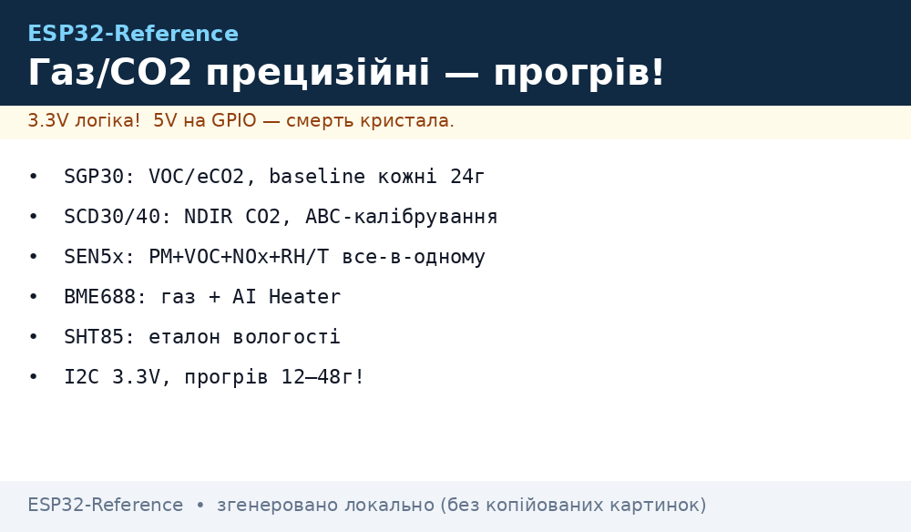
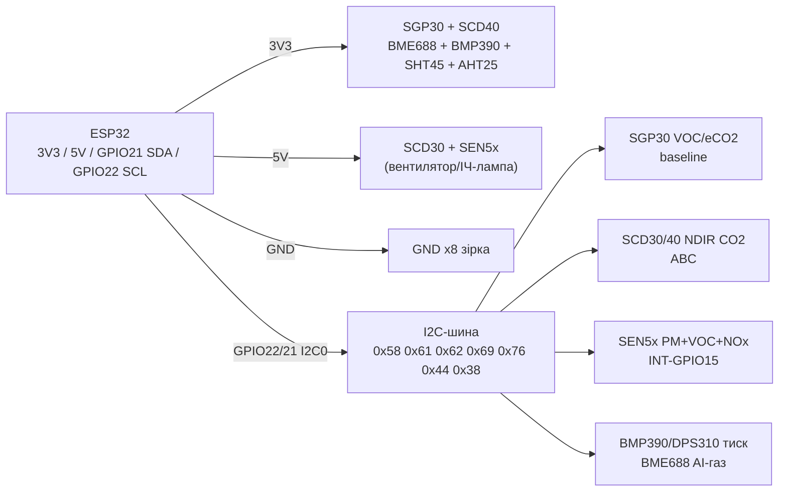

# SGP30, SCD30/SCD40, SEN5x, BME688, BMP390 - прецизійні гази, CO2, тиск і клімат


*Рис. 1. Прецизійні сенсори газу, CO2, тиску й клімату на спільній шині I2C ESP32: адреси різні, pull-up спільні.*

## Призначення

Набір прецизійних сенсорів наступного покоління після BME280/CCS811/MH-Z19: справжнє вимірювання CO2 (NDIR), а не розрахунковий eCO2, стабільний VOC з базовою лінією, усе-в-одному якість повітря, газ з AI-класифікацією та еталонні тиск/вологість. Для метеостанцій класу «плюс», вентиляції за CO2 (DCV), моніторингу IAQ у школах і офісах, альтиметрії дронів.

SGP30 - MOX-платформа VOC/eCO2 з baseline-збереженням. SCD30/SCD40 - справжній NDIR CO2 з автокалібруванням ABC. SEN5x (SEN54/SEN55) - усе-в-одному: PM + VOC + NOx + RH/T на одному I2C. BME688 - газ + AI (BME AI-Studio), тиск/вологість/температура. BMP390 - еталонний тиск для висоти. DPS310/LPS22 - прецизійний тиск з низьким шумом. SHT85/SHT45 - еталонна вологість/температура. AHT25 - бюджетна вологість/температура нового покоління після AHT10.

> SGP30 дає eCO2 (розрахунок з H2), а SCD30/SCD40 - справжній CO2 (NDIR). Не плутати: для вентиляції й норм EN50543/RESET/WELL потрібен саме NDIR.

## Характеристики

| Параметр | SGP30 | SCD30 | SCD40/SCD41 | SEN54/SEN55 | BME688 |
| --- | --- | --- | --- | --- | --- |
| Що міряє | TVOC 0-60000 ppb, eCO2 400-60000 ppm | CO2 400-10000 ppm (NDIR) + T/RH | CO2 400-5000 ppm (NDIR, мініатюрний) | PM1/2.5/4/10 + VOC + NOx + T/RH | T/H/P + VOC (IAQ, AI-індекси) |
| Принцип | MOX multi-pixel, hotplate | Подвійний ІЧ-канал, CMOSens | Фотоакустика PASens, міні-камера | Лазер PM + MOX + NDIR-нащадок | MOX + T/H/P, BSEC 2.x |
| Інтерфейс | I2C 0x58 | I2C 0x61 (+ Modbus/PWM-версія) | I2C 0x62 | I2C 0x69 | I2C 0x76/0x77 + SPI |
| Живлення | 1.62-1.98 В (модуль 3.3-5 В) | 3.3-5.5 В | 2.4-5.5 В (3.3 В типово) | 5 В ±10 % | 1.7-3.6 В (модуль 3.3-5 В) |
| Струм | ~48 мА (нагрів імпульсами) | ~19 мА середній, 75 мА пік | ~15 мА | ~100 мА (вентилятор PM) | 12 мА нагрів / 3 мкА сон |
| Точність | ±15 % TVOC (після калібрування) | ±(30 ppm + 3 %) | ±(30 ppm + 5 %) | PM ±10 %, VOC-індекс 1-500 | IAQ 0-500 через BSEC |
| Прогрів | 24 год перший раз, baseline в NVS | 3 хв, ABC раз на 7 днів | Авто, ABC на свіжому повітрі | 30 с вентилятор | 30 хв + BSEC |
| Особливість | baseline get/set кожну годину | Корпус 35×23×7 мм | 12×12×7 мм, низька потужність | Один драйвер для всього IAQ | BME AI-Studio, газ-сканер |

| Параметр | BMP390 | DPS310 / LPS22HB | SHT85 / SHT45 | AHT25 |
| --- | --- | --- | --- | --- |
| Що міряє | Тиск 300-1250 гПа + T | Тиск 300-1200 гПа + T | RH 0-100 % + T −40…+125 °C | RH 0-100 % + T −40…+85 °C |
| Точність | ±0.5 гПа абс., ±0.03 гПа відн. | DPS310: ±0.06 гПа відн., шум 0.02 Па | SHT45: RH ±1 %, T ±0.1 °C | RH ±2 %, T ±0.3 °C |
| Інтерфейс | I2C 0x76/0x77 + SPI | I2C + SPI (адреси 0x77/0x76) | I2C 0x44/0x45 | I2C 0x38 |
| Живлення | 1.65-3.6 В | 1.7-3.6 В | 1.08-3.6 В (SHT45) / 2.4-5.5 В (SHT85) | 2.2-5.5 В |
| Струм | 3.2 мкА @1 Гц | ~1.7 мкА @1 Гц | 0.4 мкА сон | ~1 мА вимір |
| Особливість | FIFO, 200 Гц, для альтиметрів | Найнижчий шум, для дронів | Нагрівач проти конденсату, JEDEC | Наступник AHT10, заводська калібровка |

> SEN5x вимагає саме 5 В: від 3V3 вентилятор PM не стартує, дані PM - нулі. SCD30/SCD40 і SGP30 чутливі до перегріву від ESP32: не ставити впритул до плати.

## Легенда пінів модуля

| Пін | Тип | Куди | Примітка |
| --- | --- | --- | --- |
| VIN (SGP30-модуль) | Живлення 3.3-5 В | 3V3 ESP32 | На модулі LDO 1.8 В; голий чип - тільки 1.8 В! |
| VIN (SCD30) | Живлення 3.3-5.5 В | 5V (VU/VIN) ESP32 | Пік 75 мА - конденсатор 100 мкФ поруч |
| VIN (SCD40) | Живлення 3.3-5 В | 3V3 ESP32 | Менший пік, можна 3V3 |
| VIN (SEN5x) | Живлення 5 В | 5V ESP32 | Строго 5 В, струм ~100 мА; від USB або окремого DC-DC |
| VIN (BME688/BMP390/DPS310) | Живлення 3.3 В | 3V3 ESP32 | BME688 з нагрівом - не ділити LDO з радіо |
| GND | Земля | GND ESP32 | Зірка, спільна для всіх восьми |
| SCL / SDA | I2C | GPIO22 / GPIO21 | Усі сенсори паралельно; адреси: 0x58, 0x61, 0x62, 0x69, 0x76/0x77, 0x44, 0x38 |
| SDO / ADDR (BME688/BMP390) | Вибір адреси | GND → 0x76, VCC → 0x77 | Залишений висячим = 0x76 на більшості модулів |
| CSB (BME688/BMP390/DPS310) | Chip select SPI | 3V3 в I2C-режимі | Обовʼязково HIGH в I2C, інакше випадковий SPI-режим |
| INT/DRDY (SEN5x/SCD) | Вихід готовності | GPIO (опційно) | Можна опитувати без нього |
| SEL (SHT85) | Вибір адреси | GND → 0x44, VCC → 0x45 | Аналог ADDR у SHT31 |
| AHT25 | Тільки 4 піни | VIN/GND/SCL/SDA | Адреса фіксована 0x38, без перемичок |

## Схема підключення

| ESP32 | Модуль | Примітка |
| --- | --- | --- |
| 3V3 | SGP30 VIN, SCD40 VIN, BME688/BMP390/DPS310 VIN, SHT85/SHT45/AHT25 VIN | Логіка 3.3 В для всіх малосигнальних |
| 5V (VU) | SCD30 VIN, SEN5x VIN | Тільки від USB 5 В, конденсатор 100-470 мкФ поруч із кожним |
| GND | GND усіх модулів | Зірка; мінус 5 В = GND ESP32 |
| GPIO22 | SCL усіх | Апаратний I2C0, pull-up 4.7 кОм (зазвичай уже на модулях) |
| GPIO21 | SDA усіх | Апаратний I2C0, pull-up 4.7 кОм |
| GND / 3V3 | SDO/ADDR/CSB | GND → 0x76/0x44, 3V3 → 0x77/0x45; CSB завжди до 3V3 в I2C |
| GPIO (опційно) | INT SEN5x → GPIO15 | Переривання готовності PM-кадру |

> Конфлікт адрес: BME688 і BMP390 обидва 0x76 за замовчуванням - розвести SDO (один на GND, другий на VCC) або використати [I2C](../../../ESP32-Reference/04-Shini/03-I2C.md)-мультиплексор TCA9548A чи другий I2C-порт (GPIO16/17).

### ASCII-схема

```text
ESP32 DevKit              Прецизійні гази / CO2 / тиск / клімат (I2C0)
------------              -------------------------------------------
3V3 ────────────────────► SGP30 VIN / SCD40 VIN / BME688 VIN / BMP390 VIN
 │                        DPS310 VIN / SHT45 VIN / AHT25 VIN (усі 3.3 В)
5V (VU) ────────────────► SCD30 VIN / SEN5x VIN (5 В! + елко 100 мкФ)
GND ────────────────────► GND x8 (зірка, спільна!)
GPIO22 ─────────────────► SCL x8 (паралельно, [4.7 кОм] до 3V3)
GPIO21 ─────────────────► SDA x8 (паралельно, [4.7 кОм] до 3V3)
GND ────────────────────► BME688 SDO (=0x76) / BMP390 SDO (=0x77 → до 3V3!)
3V3 ────────────────────► CSB усіх SPI-сумісних (тримати HIGH в I2C)
GPIO15 ◄───────────────── SEN5x INT (опційно, готовність даних)
I2C-адреси: 0x58 SGP30 | 0x61 SCD30 | 0x62 SCD40 | 0x69 SEN5x
            0x76/0x77 BME688/BMP390 | 0x44 SHTx | 0x38 AHT25
```

### Mermaid




*Рис. 2. Логіка шини: малосигнальні - 3V3, NDIR/PM - 5 В; CSB до HIGH; SDO розводить 0x76/0x77.*

## Код ESP-IDF

```c
#include "driver/i2c.h"
#include "esp_log.h"
#include "nvs_flash.h"

#define I2C_PORT I2C_NUM_0
static const char *TAG = "gas-prec";

// SCD30: тригер безперервного виміру 0x0010, читання 0x0300
static esp_err_t scd30_start(void)
{
    uint8_t cmd[2] = {0x00, 0x10};
    i2c_cmd_handle_t h = i2c_cmd_link_create();
    i2c_master_start(h);
    i2c_master_write_byte(h, (0x61 << 1) | I2C_MASTER_WRITE, true);
    i2c_master_write(h, cmd, 2, true);
    i2c_master_stop(h);
    esp_err_t e = i2c_master_cmd_begin(I2C_PORT, h, pdMS_TO_TICKS(100));
    i2c_cmd_link_delete(h);
    return e;
}

void app_main(void)
{
    nvs_flash_init();
    i2c_config_t cfg = {
        .mode = I2C_MODE_MASTER,
        .sda_io_num = GPIO_NUM_21, .scl_io_num = GPIO_NUM_22,
        .sda_pullup_en = GPIO_PULLUP_ENABLE,
        .scl_pullup_en = GPIO_PULLUP_ENABLE,
        .master.clk_speed = 100000,
    };
    i2c_param_config(I2C_PORT, &cfg);
    i2c_driver_install(I2C_PORT, cfg.mode, 0, 0, 0);
    scd30_start();
    // SGP30: init_air_quality (0x2003), get_baseline (0x2015),
    // SCD40: start_periodic (0x21B1), SEN5x: start_measurement (0x0021) —
    // драйвери: esp-idf-lib / Sensirion esp-idf drivers
    for (;;) {
        ESP_LOGI(TAG, "poll SCD30/SCD40/SEN5x/SGP30/BME688/BMP390...");
        vTaskDelay(pdMS_TO_TICKS(2000));
    }
}
```

## Код Arduino

```cpp
#include <Wire.h>
#include <Adafruit_SGP30.h>
#include <SensirionI2CScd4x.h>
#include <Adafruit_BME680.h>
#include <Adafruit_BMP3XX.h>
#include <Adafruit_SHT4x.h>

Adafruit_SGP30 sgp;
SensirionI2CScd4x scd4x;
Adafruit_BME680 bme;
Adafruit_BMP3XX bmp;
Adafruit_SHT4x sht4;

uint32_t getBaseline = 0;

void setup() {
  Serial.begin(115200);
  Wire.begin(21, 22);
  if (!sgp.begin()) Serial.println("SGP30 не знайдено (0x58)!");
  // baseline з NVS/EEPROM: sgp.setIAQBaseline(0x8973, 0x8AAE);
  scd4x.begin(Wire);
  scd4x.stopPeriodicMeasurement();
  scd4x.startPeriodicMeasurement(); // SCD40: ABC увімкнено за замовчуванням
  if (!bme.begin(0x76)) Serial.println("BME688 не знайдено!");
  bme.setGasHeater(320, 150);
  if (!bmp.begin_I2C(0x77)) Serial.println("BMP390 не знайдено (0x77)!");
  bmp.setPressureOversampling(BMP3_OVERSAMPLING_8X);
  if (!sht4.begin()) Serial.println("SHT45 не знайдено!");
  sht4.setPrecision(SHT4X_HIGH_PRECISION);
}

void loop() {
  if (sgp.IAQmeasure()) {
    Serial.printf("SGP30 TVOC=%d eCO2=%d\n", sgp.TVOC, sgp.eCO2);
    static uint32_t t = 0;
    if (millis() - t > 3600000) { // baseline щогодини в NVS
      t = millis();
      uint16_t eco2b, tvocb;
      if (sgp.getIAQBaseline(&eco2b, &tvocb))
        Serial.printf("baseline eCO2=0x%04X TVOC=0x%04X (зберегти!)\n", eco2b, tvocb);
    }
  }
  uint16_t co2; float t, h;
  if (scd4x.readMeasurement(co2, t, h) == 0)
    Serial.printf("SCD40 CO2=%d T=%.1f H=%.1f\n", co2, t, h);
  Serial.printf("BME688 gas=%.0f Om | BMP390 P=%.1f hPa | SHT45 T=%.2f H=%.1f\n",
    bme.readGas(), bmp.readPressure() / 100.0, sht4.readTemperature(), sht4.readHumidity());
  // SEN5x: бібліотека Sensirion SEN5x, 0x69, startMeasurement(), readMeasuredValues()
  // AHT25: бібліотека AHT20 (сумісна), адреса 0x38
  delay(5000);
}
```

## Код MicroPython

```python
from machine import I2C, Pin
import time

i2c = I2C(0, scl=Pin(22), sda=Pin(21), freq=100000)
print("I2C:", [hex(a) for a in i2c.scan()])
# Очікується: 0x58 SGP30, 0x61 SCD30, 0x62 SCD40, 0x69 SEN5x,
# 0x76/0x77 BME688/BMP390, 0x44 SHTx, 0x38 AHT25

# SGP30 (драйвер sgp30.py): прогрів + вологісна компенсація
# import sgp30
# sgp = sgp30.SGP30(i2c)
# sgp.iaq_init()
# sgp.set_iaq_baseline(0x8973, 0x8AAE)  # baseline з файлу/NVS!

# SCD40 (драйвер scd4x.py):
# import scd4x
# scd = scd4x.SCD4X(i2c)
# scd.start_periodic_measurement()

# SHT45 (драйвер sht4x.py) / AHT25 (драйвер ahtx0.py, addr 0x38):
# import sht4x
# env = sht4x.SHT4X(i2c)

while True:
    print("scan:", [hex(a) for a in i2c.scan()])
    # print(sgp.co2eq_tvoc(), scd.data_ready, env.measurements)
    time.sleep(5)
```

## Типові помилки

| № | Помилка | Симптом | Рішення |
| --- | --- | --- | --- |
| 1 | SGP30 плутають зі справжнім CO2 | «CO2» росте від парфумів, а не від людей | SGP30 - eCO2 (розрахунок з H2); для вентиляції ставити SCD30/SCD40 (NDIR) |
| 2 | Baseline SGP30 не зберігають | Після перезавантаження тиждень «пливе» IAQ | Щогодини `getIAQBaseline` → NVS/файл, при старті `setIAQBaseline`; перший прогрів 24 год |
| 3 | SEN5x живлять від 3V3 | PM завжди 0, вентилятор мовчить | Строго 5 В, струм ~100 мА, конденсатор 470 мкФ; перевірити USB-кабель |
| 4 | SCD30/SCD40 біля ESP32 | CO2 завищений на 50-150 ppm (самонагрів) | Винести на 5-10 см, калібрувати на свіжому повітрі (~420 ppm), ABC раз на 7 днів |
| 5 | BME688/BMP390 на одній адресі 0x76 | Один сенсор «зникає» зі скану | SDO одного на GND (0x76), другого на VCC (0x77); або TCA9548A/другий I2C |
| 6 | CSB висить у повітрі | Сенсори Bosch випадково йдуть у SPI | CSB до 3V3 в I2C-режимі; SDO не залишати висячим |
| 7 | BME688 без BSEC читають як IAQ | Сирий опір газу видають за «індекс якості» | IAQ рахує тільки BSEC 2.x / BME AI-Studio; сирі оми - не IAQ |
| 8 | SHT45/AHT25 біля нагріву BME688 | Вологість занижена на 5-10 % | Рознести сенсори, опитувати клімат раз на 2-5 с, не гріти плату феном |

## Офіційні джерела

- [SGP30 - каталог і даташит (Sensirion)](https://sensirion.com/products/catalog/SGP30) - MOX VOC/eCO2, I2C, baseline-компенсація.
- [SCD30 - каталог і даташит (Sensirion)](https://sensirion.com/products/catalog/SCD30) - NDIR CO2 ±(30 ppm + 3 %), ABC-калібрування.
- [BME688 - сторінка продукту і даташит (Bosch)](https://www.bosch-sensortec.com/products/environmental-sensors/gas-sensors/bme688/) - газ + AI, тиск/вологість/температура.
- [BMP390 - сторінка продукту і даташит (Bosch)](https://www.bosch-sensortec.com/products/environmental-sensors/pressure-sensors/bmp390/) - прецизійний тиск ±0.03 гПа.
- [Гайд SGP30 з кодом (Adafruit Learn)](https://learn.adafruit.com/adafruit-sgp30-gas-tvoc-eco2-mox-sensor) - baseline, вологісна компенсація, приклади.
- SCD40/SCD41, SEN54/SEN55, SHT85/SHT45, DPS310, LPS22, AHT25 - `перевірити вручну` (каталоги Sensirion/Infineon/ST/Aosong).

## Див. також

- [Home](../../../ESP32-Reference/Home.md)
- [ADC](../../../ESP32-Reference/06-Analog/01-ADC.md)
- [I2C](../../../ESP32-Reference/04-Shini/03-I2C.md)
- [SPI](../../../ESP32-Reference/04-Shini/02-SPI.md)
- [UART](../../../ESP32-Reference/04-Shini/01-UART.md)
- [03-BME280-BMP280-SHT31](../../../ESP32-Reference/10-Sensori/03-BME280-BMP280-SHT31.md)
- [06-INA219-HX711-BH1750](../../../ESP32-Reference/10-Sensori/06-INA219-HX711-BH1750.md)
- [08-BME680-CCS811-MHZ19-PMS5003](../../../ESP32-Reference/10-Sensori/08-BME680-CCS811-MHZ19-PMS5003.md)
- [18-Light-Spectral-Gesture](../../../ESP32-Reference/10-Sensori/18-Light-Spectral-Gesture.md)
- [19-IMU-6-9DOF](../../../ESP32-Reference/10-Sensori/19-IMU-6-9DOF.md)
- [20-Bio-IR-Temp](../../../ESP32-Reference/10-Sensori/20-Bio-IR-Temp.md)
- [21-Energy-Meters](../../../ESP32-Reference/10-Sensori/21-Energy-Meters.md)
