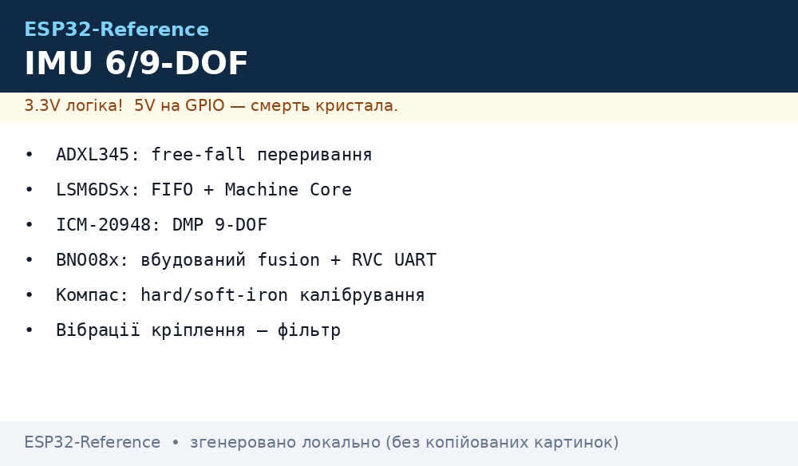
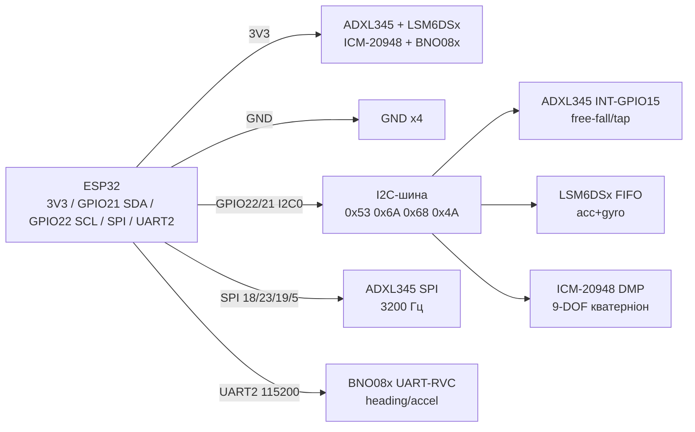

# ADXL345, LSM6DSx, ICM-20948, BNO08x - IMU 6/9-DOF


*Рис. 1. IMU-сенсори на ESP32: ADXL345 (SPI/I2C + переривання), LSM6DSx (I2C), ICM-20948 (I2C/SPI + DMP), BNO08x (I2C/SPI/UART-RVC).*

## Призначення

Інерціальна група для ESP32: детект руху/нахилу/падіння, крокомір, орієнтація в просторі, стабілізація дронів і роботів, компас. Від простого 3-осьового акселерометра до 9-DOF з апаратним sensor fusion.

ADXL345 - класичний 3-осьовий акселерометр, SPI/I2C, переривання free-fall/tap/activity, датарейт до 3200 Гц. LSM6DSx (DS3/DSOX/TR-C, ISM330) - 6-DOF acc+gyro з FIFO, machine-learning ядром у нових. ICM-20948 - 9-DOF acc+gyro+mag з DMP-процесором (кватерніони на чипі). BNO08x (BNO085/086) - вбудований fusion (SH-2 firmware): кватерніон, гравітація, лінійне прискорення, tap/step/shake, плюс простий UART-RVC режим для робопилососів.

> BNO08x видає готовий кватерніон - не треба писати Madgwick/Mahony. ADXL345 + LIS2MDL - бюджетний «9-DOF вручну». Для дронів - LSM6DSx/ICM з високим ODR і FIFO.

## Характеристики

| Параметр | ADXL345 | LSM6DSx (DS3/DSOX) | ICM-20948 | BNO08x (085/086) |
| --- | --- | --- | --- | --- |
| Склад | Acc 3 осі ±2/4/8/16 g | Acc ±2-16 g + gyro ±125-2000 dps | Acc ±2-16 g + gyro ±250-4000 dps + mag ±4900 мкТл | Acc + gyro + mag + M0 fusion |
| Інтерфейс | I2C 0x53/0x1D + SPI | I2C 0x6A/0x6B + SPI | I2C 0x68/0x69 + SPI | I2C 0x4A/0x4B + SPI + UART-RVC |
| ODR | 10-3200 Гц | Acc/gyro до 6.6-12.5 кГц, FIFO 4-9 КБ | Acc/gyro до 1-9 кГц, DMP | Fusion до 400 Гц (rotation vector) |
| Живлення | 2.0-3.6 В (модуль 3.3-5 В) | 1.71-3.6 В (модуль 3.3-5 В) | 1.71-3.6 В (модуль 3.3-5 В) | 2.4-3.6 В (модуль 3.3-5 В) |
| Струм | 140 мкА / 0.1 мкА сон | ~1 мА / сон мкА | ~3 мА (DMP + mag) | ~12 мА (fusion) |
| Переривання | INT1/INT2: free-fall, tap, activity | INT1/INT2: пороги, FIFO, tap | INT: DMP-ready, WOM | INT: детектори, RVC-потік |
| Калібрування | OFSX/OFSY/OFSZ регістри | Автоноль гіро, ML-ядро | DMP самокалібрується частково | Автокалібрування + hard/soft-iron для mag |
| Особливість | Найпростіший, 5 В-толерантний модуль | Промислова якість, ST-екосистема | DMP кватерніони, 7 I2C-slave | UART-RVC: калібровані heading/accel без бібліотек |
| MPU9250 (знятий з виробництва!) | Попередник ICM-20948: той же DMP-підхід, але NRND - у нових розробках брати ICM-20948, старі запаси MPU9250 лише для ремонту |

### Калібрування hard/soft-iron (коротко)

| Крок | Що робимо | Як на ESP32 |
| --- | --- | --- |
| Hard-iron (зсув нуля mag) | Обертати плату «вісімкою» 30 с, зібрати min/max по X/Y/Z | Offset = (max + min) / 2, віднімати з кожного виміру; BNO08x робить автоматично |
| Soft-iron (масштаб/перекіс) | Ті ж дані → еліпсоїд → сфера | Scale = (max − min) середнє / (max − min) осі; або Adafruit SensorLab Magnetometer Calibration |
| Гіроскоп (нуль дрейфу) | 200-500 вимірів у спокої на столі | Середнє = offset, віднімати; див. гайд SensorLab Gyroscope Calibration |
| Акселерометр | 6 положень (±X/±Y/±Z до землі) | Offset/scale щоб норма = 1 g; регістри OFS у ADXL345 |
| Перевірка | Норма acc ≈ 9.81, mag ≈ 45-60 мкТл (Україна) | Вивести в Serial Plotter, покрутити плату |

> Магнітометр калібрувати в корпусі з дротами й батареєю - залізо поруч зміщує hard-iron. Перекалібровувати при зміні монтажу.

## Легенда пінів модуля

| Пін | Тип | Куди | Примітка |
| --- | --- | --- | --- |
| VIN (усі IMU) | Живлення 3.3 В | 3V3 ESP32 | Чипи 1.7-3.6 В; модулі Adafruit/SparkFun мають LDO + level-shift |
| GND | Земля | GND ESP32 | Короткий, без петель біля моторів |
| SCL/SCK | I2C-clock / SPI-clock | GPIO22 (I2C) або GPIO18 (SPI SCK) | I2C 400 кГц; SPI до 5-10 МГц |
| SDA/SDI/SDO | Дані | GPIO21 (I2C) або GPIO23/19 (SPI MOSI/MISO) | ADXL345: SDO→GND = 0x53, SDO→VCC = 0x1D |
| CS | Chip select SPI | GPIO5 (кожному свій!) | В I2C-режимі CS до 3V3; в SPI - окремий CS на сенсор |
| INT1/INT2 | Вихід переривання | GPIO15 / GPIO13 | Free-fall/tap/WOM/FIFO-ready; підтяжка не потрібна (push-pull) |
| AD0/SA0 | Вибір I2C-адреси | GND/VCC | LSM6DSx: 0x6A/0x6B; ICM: 0x68/0x69; BNO08x: 0x4A/0x4B |
| RST (BNO08x) | Скидання | GPIO (опційно) / 3V3 | Активний LOW, імпульс 10 мс |
| TX/RX (BNO08x RVC) | UART | GPIO16 RX2 / GPIO17 TX2 | 115200 8N1; тільки RVC-прошивка/режим |

## Схема підключення

| ESP32 | Модуль | Примітка |
| --- | --- | --- |
| 3V3 | VIN IMU | Усі IMU - 3.3 В |
| GND | GND | Спільна, подалі від силових дротів |
| GPIO22 | SCL (I2C-варіант) | ADXL + LSM + ICM + BNO паралельно (адреси різні!) |
| GPIO21 | SDA (I2C-варіант) | Pull-up 4.7 кОм |
| GPIO18/23/19/5 | SCK/MOSI/MISO/CS (SPI-варіант ADXL345) | Швидкий ODR 3200 Гц тільки по SPI |
| GPIO15 | INT1 ADXL345 (free-fall) | Переривання падіння/тапу |
| GPIO16/GPIO17 | RX2/TX2 BNO08x RVC | UART-RVC 115200, хрест TX→RX |
| GND / 3V3 | AD0/SA0/SDO | Розвести адреси при дублікатах |

> I2C-адреси за замовчуванням не конфліктують: 0x53 (ADXL) + 0x6A (LSM) + 0x68 (ICM) + 0x4A (BNO). Конфлікт лише при двох однакових платах - тоді SA0/AD0 або другий I2C.

### ASCII-схема

```text
ESP32 DevKit              IMU 6/9-DOF (I2C0 + SPI + UART-RVC)
------------              -----------------------------------
3V3 ────────────────────► VIN x4 (ADXL345, LSM6DSx, ICM-20948, BNO08x)
GND ────────────────────► GND x4 (коротко, без петель!)
GPIO22 ─────────────────► SCL x4 (I2C0, [4.7 кОм] до 3V3)
GPIO21 ─────────────────► SDA x4 (I2C0, [4.7 кОм] до 3V3)
GPIO18 ─────────────────► ADXL SCK (SPI-варіант, ODR 3200 Гц)
GPIO23 ─────────────────► ADXL SDI/MOSI
GPIO19 ◄───────────────── ADXL SDO/MISO (+ вибір адреси 0x53/0x1D)
GPIO5 ──────────────────► ADXL CS (LOW=SPI, HIGH=I2C)
GPIO15 ◄───────────────── ADXL INT1 (free-fall/tap) / LSM INT1 (WOM)
GPIO17 TX2 ─────────────► BNO08x RX (UART-RVC 115200)
GPIO16 RX2 ◄───────────── BNO08x TX (heading/accel потік)
I2C: 0x53 ADXL | 0x6A LSM | 0x68 ICM | 0x4A BNO (SA0/AD0 → +1)
```

### Mermaid




*Рис. 2. Три шини: I2C для всіх, SPI для швидкого ADXL, UART для простого RVC BNO08x.*

## Код ESP-IDF

```c
#include "driver/i2c.h"
#include "driver/uart.h"
#include "esp_log.h"

#define I2C_PORT I2C_NUM_0
#define ADXL_ADDR 0x53
#define UART_RVC UART_NUM_2

// ADXL345: читання DATAX0 (0x32, 6 байт) після POWER_CTL 0x08
static void adxl_init(void)
{
    uint8_t cfg[][2] = {{0x31, 0x0B}, {0x2C, 0x0F}, {0x2E, 0x00}, {0x2D, 0x08}};
    for (int i = 0; i < 4; i++) {
        i2c_cmd_handle_t h = i2c_cmd_link_create();
        i2c_master_start(h);
        i2c_master_write_byte(h, (ADXL_ADDR << 1) | I2C_MASTER_WRITE, true);
        i2c_master_write(h, cfg[i], 2, true);
        i2c_master_stop(h);
        i2c_master_cmd_begin(I2C_PORT, h, pdMS_TO_TICKS(50));
        i2c_cmd_link_delete(h);
    }
}

void app_main(void)
{
    i2c_config_t c = {.mode = I2C_MODE_MASTER,
        .sda_io_num = GPIO_NUM_21, .scl_io_num = GPIO_NUM_22,
        .sda_pullup_en = GPIO_PULLUP_ENABLE,
        .scl_pullup_en = GPIO_PULLUP_ENABLE, .master.clk_speed = 400000};
    i2c_param_config(I2C_PORT, &c);
    i2c_driver_install(I2C_PORT, c.mode, 0, 0, 0);
    adxl_init();
    // BNO08x RVC: UART2 115200 8N1, кадри heading/accel без бібліотек
    uart_config_t u = {.baud_rate = 115200, .data_bits = UART_DATA_8_BITS,
        .parity = UART_PARITY_DISABLE, .stop_bits = UART_STOP_BITS_1,
        .flow_ctrl = UART_HW_FLOWCTRL_DISABLE};
    uart_param_config(UART_RVC, &u);
    uart_set_pin(UART_RVC, 17, 16, -1, -1);
    uart_driver_install(UART_RVC, 256, 0, 0, NULL, 0);
    // LSM6DSx: esp-idf-lib lsm6dsx (FIFO, ODR); ICM-20948: DMP driver (InvenSense)
    for (;;) vTaskDelay(pdMS_TO_TICKS(1000));
}
```

## Код Arduino

```cpp
#include <Wire.h>
#include <SPI.h>
#include <Adafruit_ADXL345_U.h>
#include <Adafruit_LSM6DSOX.h>
#include <Adafruit_BNO08x.h>

Adafruit_ADXL345_Unified accel(12345);
Adafruit_LSM6DSOX lsm;
Adafruit_BNO08x bno;
#define BNO_INT 13

void setup() {
  Serial.begin(115200);
  Wire.begin(21, 22);
  // ADXL345 по SPI (швидко) або I2C: accel.begin(0x53)
  if (!accel.begin()) Serial.println("ADXL345 не знайдено!");
  accel.setRange(ADXL345_RANGE_16_G);
  accel.setDataRate(ADXL345_DATARATE_400_HZ);
  // Переривання free-fall: поріг 0.5 g, час 100 мс -> INT1 -> GPIO15
  // accel.writeRegister(ADXL345_REG_THRESH_FF, 0x08); ...
  if (!lsm.begin_I2C(0x6A)) Serial.println("LSM6DSOX не знайдено!");
  lsm.setAccelRange(LSM6DS_ACCEL_RANGE_8_G);
  lsm.setGyroRange(LSM6DS_GYRO_RANGE_500_DPS);
  lsm.setAccelDataRate(LSM6DS_RATE_104_HZ);
  if (!bno.begin_I2C(0x4A)) Serial.println("BNO08x не знайдено!");
  bno.enableReport(SH2_ARVR_STABILIZED_RV, 5000); // rotation vector 200 Гц
  bno.enableReport(SH2_STEP_COUNTER, 10000);
  // ICM-20948: бібліотека SparkFun ICM_20948, DMP кватерніони
  // BNO08x UART-RVC альтернатива: Serial2.begin(115200, SERIAL_8N1, 16, 17)
}

void loop() {
  sensors_event_t a; accel.getEvent(&a);
  Serial.printf("ADXL x=%.2f y=%.2f z=%.2f g\n", a.acceleration.x, a.acceleration.y, a.acceleration.z);
  sensors_event_t ag, g, tmp; lsm.getEvent(&ag, &g, &tmp);
  Serial.printf("LSM acc=%.2f gyro=%.2f\n", ag.acceleration.x, g.gyro.x);
  sh2_SensorValue_t v;
  if (bno.getSensorEvent(&v) && v.sensorId == SH2_ARVR_STABILIZED_RV)
    Serial.printf("BNO quat w=%.3f x=%.3f y=%.3f z=%.3f\n",
      v.un.arvrStabilizedRV.real, v.un.arvrStabilizedRV.i,
      v.un.arvrStabilizedRV.j, v.un.arvrStabilizedRV.k);
  delay(200);
}
```

## Код MicroPython

```python
from machine import I2C, UART, Pin
import time

i2c = I2C(0, scl=Pin(22), sda=Pin(21), freq=400000)
print("I2C:", [hex(a) for a in i2c.scan()])  # 0x53 ADXL, 0x6A LSM, 0x68 ICM, 0x4A BNO

# ADXL345: запис 0x2D=0x08 (measure), читання 0x32 (6 байт)
i2c.writeto_mem(0x53, 0x2D, b"\x08")
raw = i2c.readfrom_mem(0x53, 0x32, 6)

# BNO08x UART-RVC (простий режим без SH-2 парсинга I2C):
rvc = UART(2, 115200, tx=17, rx=16)
rvc.init(115200, bits=8, parity=None, stop=1)

# Калібрування гіро: 300 вимірів у спокої -> середнє -> віднімати
# Hard-iron mag: крутити вісімкою, min/max -> offset=(max+min)/2

while True:
    raw = i2c.readfrom_mem(0x53, 0x32, 6)
    x = int.from_bytes(raw[0:2], "little", True)
    print("ADXL x-raw:", x, "| RVC bytes:", rvc.any())
    time.sleep(0.5)
```

## Типові помилки

| № | Помилка | Симптом | Рішення |
| --- | --- | --- | --- |
| 1 | ADXL345 CS висить (I2C-режим) | Сенсор випадково мовчить/йде в SPI | CS до 3V3 в I2C; в SPI - окремий CS GPIO5, інші CS HIGH |
| 2 | Дві однакові IMU на шині | Друга не видно в скані | SA0/AD0/SDO на VCC (+1 до адреси) або другий I2C (GPIO16/17) |
| 3 | BNO08x без стабільного 3.3 В | Fusion «пливе», перезавантаження | Окремий LDO, конденсатор 47 мкФ; не живити від довгих dupont |
| 4 | Mag без hard/soft-iron | Компас бреше на 20-40° біля батареї/моторів | Калібрувати вісімкою в зборі; BNO - дочекатись autocal; метали прибрати на 20 см |
| 5 | Гіро без нуля | Кут «повзе» 1-5°/с у спокої | 300 вимірів на столі → offset; температурний дрейф - перекалібрувати |
| 6 | I2C 100 кГц для 9-DOF 400 Гц | Дані запізнюються, FIFO переповнюється | 400 кГц I2C або SPI для ADXL/LSM/ICM; читати по INT/FIFO-ready |
| 7 | Вібрації моторів на acc | Шум ±2 g, крокомір бреше | Вібророзвʼязка (пінопласт/гума), LPF в драйвері, ODR під задачу |

## Офіційні джерела

- [Гайд ADXL345 з кодом (Adafruit Learn)](https://learn.adafruit.com/adxl345-digital-accelerometer) - SPI/I2C, діапазони ±2-16 g, переривання.
- [Гайд BNO085/BNO08x з кодом (Adafruit Learn)](https://learn.adafruit.com/adafruit-9-dof-orientation-imu-fusion-breakout-bno085) - SH-2 fusion, кватерніони, UART-RVC режим.
- [Гайд LIS2MDL-магнітометра з кодом (Adafruit Learn)](https://learn.adafruit.com/adafruit-lis2mdl-triple-axis-magnetometer) - 9-DOF пара до 6-DOF IMU, hard/soft-iron.
- [Гайд калібрування гіроскопа (Adafruit SensorLab)](https://learn.adafruit.com/adafruit-sensorlab-gyroscope-calibration) - нуль-дрейф, фільтрація шуму.
- LSM6DSx / ICM-20948 даташити (ST / TDK InvenSense) - `перевірити вручну` (центри документації ST/TDK).

## Див. також

- [Home](../../../ESP32-Reference/Home.md)
- [ADC](../../../ESP32-Reference/06-Analog/01-ADC.md)
- [I2C](../../../ESP32-Reference/04-Shini/03-I2C.md)
- [SPI](../../../ESP32-Reference/04-Shini/02-SPI.md)
- [UART](../../../ESP32-Reference/04-Shini/01-UART.md)
- [03-BME280-BMP280-SHT31](../../../ESP32-Reference/10-Sensori/03-BME280-BMP280-SHT31.md)
- [06-INA219-HX711-BH1750](../../../ESP32-Reference/10-Sensori/06-INA219-HX711-BH1750.md)
- [17-Gas-CO2-Precision](../../../ESP32-Reference/10-Sensori/17-Gas-CO2-Precision.md)
- [18-Light-Spectral-Gesture](../../../ESP32-Reference/10-Sensori/18-Light-Spectral-Gesture.md)
- [20-Bio-IR-Temp](../../../ESP32-Reference/10-Sensori/20-Bio-IR-Temp.md)
- [21-Energy-Meters](../../../ESP32-Reference/10-Sensori/21-Energy-Meters.md)
