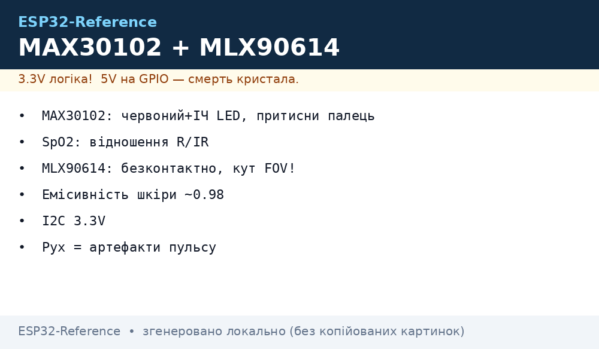
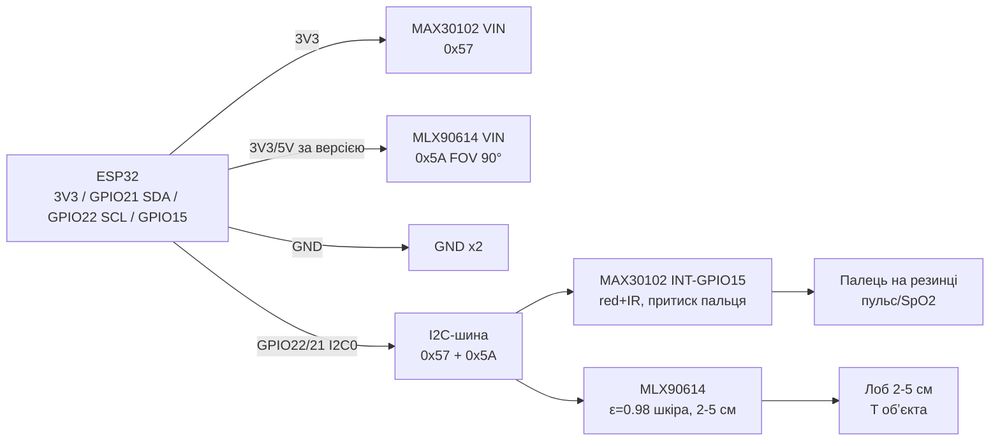

# MAX30102, MLX90614 - пульс, SpO2 і безконтактна температура


*Рис. 1. Біосенсори на I2C ESP32: MAX30102 (червоний + ІЧ LED, притискання пальця) і MLX90614 (ІЧ-термометр, FOV 90°).*

## Призначення

Біомедична пара для ESP32 (хобі/спорт, не медичний діагноз!): оптична пульсометрія й сатурація плюс безконтактна температура обʼєктів і тіла. Для фітнес-трекерів, розумних дзеркал, контролю температури без дотику, сигналізації лихоманки.

MAX30102 - відбивний фотоплетизмограф: червоний (660 нм) + ІЧ (880 нм) LED і фотодіод; за різницею поглинання кисневого/безкисневого гемоглобіну рахує пульс і SpO2; потрібне стабільне притискання пальця. MLX90614 - ІЧ-термометр Melexis: міряє температуру обʼєкта −70…+380 °C і чипа −40…+125 °C, заводська калібровка в EEPROM, FOV 90° (середня температура плями).

> Це не медичні прилади: точність SpO2 ±2-3 % у спокої, пульс губиться при русі. Для діагностики - сертифіковані пристрої. MLX90614 міряє середнє по конусу 90° - палець з 30 см дасть «кімнату», а не «тіло».

## Характеристики

| Параметр | MAX30102 | MLX90614 (ESFxx) |
| --- | --- | --- |
| Що міряє | Пульс 30-240 bpm, SpO2 70-100 %, температура чипа | T обʼєкта −70…+380 °C, T чипа −40…+125 °C |
| Принцип | Відбивна PPG: red 660 нм + IR 880 нм, 18-біт АЦП, FIFO 32 | Термобатарея ІЧ 5.5-14 мкм + DSP, SMBus/I2C |
| LED/Оптика | 2 LED, струм 0-50 мА (програмно), скло без подряпин | FOV 90° (версії 35°/10° - інші маркування), емісивність ε налаштовується |
| Інтерфейс | I2C 0x57, INT (FIFO-ready) | SMBus/I2C, фікс 0x5A (зміна через EEPROM) |
| Живлення | 1.8 В чип (модуль 3.3-5 В), LED 3.3-5 В | 3 В версія 2.6-3.6 В / 5 В версія 4.5-5.5 В (уважно!) |
| Струм | ~1 мА + LED імпульси до 50 мА | ~2 мА |
| Точність | SpO2 ±2 % (спокій, правильний притиск) | ±0.5 °C біля кімнатної (обʼєкт 0-50 °C) |
| Частота | 50-3200 sps, усереднення 1-32 | ~10 Гц (1-wire PWM-версія теж існує) |
| Особливість | Резинка/кліпса обовʼязкова; зелений LED - у MAX30105 | EEPROM: адреса, ε, пороги; SMBus-сумісний |

### Емісивність і FOV MLX90614 (коротко)

| Фактор | Правило | Приклад |
| --- | --- | --- |
| FOV 90° | Діаметр плями ≈ 2× дистанції | З 10 см - пляма ~20 см (середнє по лобі + фону!); для тіла міряти з 2-5 см |
| Емісивність ε | Шкіра ~0.98 (заводське); метал ~0.1-0.3 бреше | Блискучий метал обклеїти чорною стрічкою (ε ~0.95) |
| EEPROM | Адреса 0x5A, ε, сплячий режим | Не писати в EEPROM у циклі (знос!); тільки при налаштуванні |
| Версія живлення | 3 В і 5 В несумісні! | Перевірити маркування модуля: AAA (3 В) vs BAA (5 В) |

> MAX30102 і MAX30105 сумісні за бібліотекою SparkFun MAX3010x: MAX30102 - red+IR (пульс/SpO2), MAX30105 - +зелений (частинки/дистанція).

## Легенда пінів модуля

| Пін | Тип | Куди | Примітка |
| --- | --- | --- | --- |
| VIN (MAX30102-модуль) | Живлення 3.3-5 В | 3V3 (краще) або 5V | LED яскравіші від 5 В, але логіка - 3.3 В через level-shift на модулі |
| VIN (MLX90614-модуль) | Живлення за версією! | 3V3 для 3 В-версії / 5V для 5 В-версії | Переплутати = нестабільні покази або смерть чипа |
| GND | Земля | GND ESP32 | Спільна |
| SCL / SDA | I2C | GPIO22 / GPIO21 | MAX30102 0x57 + MLX90614 0x5A - конфлікту немає |
| INT (MAX30102) | Вихід FIFO-ready, open-drain | GPIO15 (опційно) | Pull-up 4.7 кОм; можна опитувати без нього |
| RD/IR-LED | Вбудовані LED | Нічого (на платі) | Не дивитись впритул; яскравість - регістром LED_PULSE_AMP |
| MLX90614 metal can | 4 піни TO-39 | VIN/GND/SCL/SDA + 2× pull-up 10 кОм | На голих can-модулях pull-up ставити зовнішні |

## Схема підключення

| ESP32 | Модуль | Примітка |
| --- | --- | --- |
| 3V3 | MAX30102 VIN (варіант А) | Рекомендовано для ESP32 (логіка 3.3 В) |
| 3V3 / 5V | MLX90614 VIN за версією | 3 В → 3V3, 5 В → VU/5V; перевірити маркування! |
| GND | GND обох | Спільна |
| GPIO22 | SCL обох | I2C0 100-400 кГц, pull-up 4.7-10 кОм |
| GPIO21 | SDA обох | I2C0 |
| GPIO15 (опційно) | MAX30102 INT | FIFO-ready переривання для рівного семплування |

> MAX30102 носити на пальці резинкою середнього натягу: блідий палець = перетиснуто (кров не тече), бовтається = артефакти руху. MLX90614 тримати перпендикулярно до лоба з 2-5 см.

### ASCII-схема

```text
ESP32 DevKit              Біо + ІЧ-температура (I2C0)
------------              ---------------------------
3V3 ────────────────────► MAX30102 VIN (логіка 3.3 В, LED вистачає)
3V3/5V ─────────────────► MLX90614 VIN (за версією! 3 В→3V3, 5 В→5V)
GND ────────────────────► GND x2 (спільна)
GPIO22 ─────────────────► SCL x2 ([4.7 кОм] до 3V3)
GPIO21 ─────────────────► SDA x2 ([4.7 кОм] до 3V3)
GPIO15 ◄───────────────── MAX30102 INT (FIFO-ready, опційно)
I2C-адреси: 0x57 MAX30102 | 0x5A MLX90614 (фікс, зміна тільки через EEPROM)
Палець ──резинка──► MAX30102 віконце (червоний+ІЧ LED, не перетискати!)
Лоб ──2-5 см──► MLX90614 (конус 90°, тримати перпендикулярно)
```

### Mermaid




*Рис. 2. Механіка виміру: стабільний притиск PPG і близька дистанція ІЧ-термометра.*

## Код ESP-IDF

```c
#include "driver/i2c.h"
#include "esp_log.h"

#define I2C_PORT I2C_NUM_0
#define MAX_ADDR 0x57
#define MLX_ADDR 0x5A

// MLX90614: читання RAM 0x07 (Tobj1), 16 біт + PEC
static float mlx_read_obj(void)
{
    uint8_t reg = 0x07;
    uint8_t d[3] = {0};
    i2c_cmd_handle_t h = i2c_cmd_link_create();
    i2c_master_start(h);
    i2c_master_write_byte(h, (MLX_ADDR << 1) | I2C_MASTER_WRITE, true);
    i2c_master_write_byte(h, reg, true);
    i2c_master_start(h);
    i2c_master_write_byte(h, (MLX_ADDR << 1) | I2C_MASTER_READ, true);
    i2c_master_read(h, d, 2, I2C_MASTER_ACK);
    i2c_master_read_byte(h, d + 2, I2C_MASTER_NACK);
    i2c_master_stop(h);
    i2c_master_cmd_begin(I2C_PORT, h, pdMS_TO_TICKS(100));
    i2c_cmd_link_delete(h);
    uint16_t raw = d[0] | (d[1] << 8);
    return raw * 0.02 - 273.15; // Кельвіни → °C
}

void app_main(void)
{
    i2c_config_t cfg = {.mode = I2C_MODE_MASTER,
        .sda_io_num = GPIO_NUM_21, .scl_io_num = GPIO_NUM_22,
        .sda_pullup_en = GPIO_PULLUP_ENABLE,
        .scl_pullup_en = GPIO_PULLUP_ENABLE, .master.clk_speed = 100000};
    i2c_param_config(I2C_PORT, &cfg);
    i2c_driver_install(I2C_PORT, cfg.mode, 0, 0, 0);
    // MAX30102: драйвер (SparkFun MAX3010x port / esp-idf-lib max30102):
    // reset, FIFO 32, LED 50 мА, SpO2-mode (red+IR), INT-GPIO15
    for (;;) {
        ESP_LOGI("bio", "Tobj=%.1f C", mlx_read_obj());
        vTaskDelay(pdMS_TO_TICKS(1000));
    }
}
```

## Код Arduino

```cpp
#include <Wire.h>
#include <Adafruit_MLX90614.h>
#include "MAX30105.h" // SparkFun MAX3010x: працює з MAX30102 (red+IR)

MAX30105 ppg;
Adafruit_MLX90614 ir;
#define PPG_INT 15

void setup() {
  Serial.begin(115200);
  Wire.begin(21, 22);
  if (!ppg.begin(Wire, I2C_SPEED_FAST)) Serial.println("MAX30102 не знайдено (0x57)!");
  // red+IR режим для SpO2, яскравість 0x7F (~25 мА), 400 sps
  ppg.setup(0x7F, 4, 2, 400, 411, 4096);
  ppg.enableDIETEMPRDY();
  if (!ir.begin(0x5A)) Serial.println("MLX90614 не знайдено (0x5A)!");
  // ir.writeEmissivity(0.98); // тільки при налаштуванні, не в циклі!
  pinMode(PPG_INT, INPUT);
}

void loop() {
  // PPG: чекати FIFO, читати red/IR, алгоритм PBA (Example5 HeartRate)
  ppg.check();
  while (ppg.available()) {
    uint32_t red = ppg.getFIFORed();
    uint32_t irv = ppg.getFIFOIR();
    // ... фільтр пульсу / SpO2 (див. SparkFun Example5) ...
    ppg.nextSample();
  }
  Serial.printf("Tobj=%.1f Tamb=%.1f C\n", ir.readObjectTempC(), ir.readAmbientTempC());
  delay(1000);
}
```

## Код MicroPython

```python
from machine import I2C, Pin
import time

i2c = I2C(0, scl=Pin(22), sda=Pin(21), freq=100000)
print("I2C:", [hex(a) for a in i2c.scan()])  # 0x57 MAX30102, 0x5A MLX90614

# MLX90614 без бібліотеки: RAM 0x07, молодший байт першим
def tobj():
    raw = int.from_bytes(i2c.readfrom_mem(0x5A, 0x07, 2), "little")
    return raw * 0.02 - 273.15

# MAX30102 (драйвер max30102.py): FIFO red/IR
# import max30102
# ppg = max30102.MAX30102(i2c)
# ppg.setup_sensor()

while True:
    print("Tobj={:.1f} C".format(tobj()))
    # print(ppg.read_fifo())  # (red, ir) -> фільтр пульсу
    time.sleep(1)
```

## Типові помилки

| № | Помилка | Симптом | Рішення |
| --- | --- | --- | --- |
| 1 | Палець тримають рукою без фіксації | Пульс стрибає 40→150, SpO2 «---» | Резинка/кліпса середнього натягу; не рухатись 15-20 с; блідий палець = перетиснуто |
| 2 | MLX90614 міряють з 30 см | «Температура тіла» 25 °C (середнє з фоном) | Дистанція 2-5 см, перпендикулярно; памʼятати конус 90° (пляма = 2× дистанції) |
| 3 | Не та версія живлення MLX90614 | Покази пливуть / чип гріється | 3 В-версія → тільки 3V3, 5 В-версія → 5V; перевірити маркування AAA/BAA |
| 4 | LED MAX30102 на максимумі 50 мА | Перегрів, шум, швидка розрядка батареї | Почати з 0x1F-0x7F, підняти лише якщо сигнал слабкий; зелений канал - тільки MAX30105 |
| 5 | Пишуть ε/адресу в EEPROM у циклі | MLX90614 «вмирає» через місяці | EEPROM писати один раз при налаштуванні; у циклі - тільки читання RAM |
| 6 | Брудне віконце PPG | Слабкий сигнал, SpO2 занижений | Протерти спиртом; прибрати пряме сонце (ІЧ-засвіт!) |
| 7 | Рух і тремор | Пульс подвоюється | Усереднення 4-8, пауза виміру в спокої; SpO2 рахувати тільки при стабільному PPG |

## Офіційні джерела

- [Гайд MAX30105/MAX30102 з кодом (SparkFun)](https://learn.sparkfun.com/tutorials/max30105-particle-and-pulse-ox-sensor-hookup-guide) - red+IR PPG, FIFO, LED-режими, алгоритм пульсу (бібліотека MAX3010x).
- [Гайд MLX90614 з кодом (Adafruit Learn)](https://learn.adafruit.com/using-melexis-mlx90614-non-contact-sensors) - FOV, ε, адреса 0x5A, 3 В/5 В версії.
- [SHT45 - еталон T/RH для порівняння (Sensirion)](https://sensirion.com/products/catalog/SHT45) - контактний еталон температури ±0.1 °C.
- MAX30102 даташит (Analog/Maxim), MLX90614 даташит (Melexis) - `перевірити вручну` (центри документації Analog/Melexis).

## Див. також

- [Home](../../../ESP32-Reference/Home.md)
- [ADC](../../../ESP32-Reference/06-Analog/01-ADC.md)
- [I2C](../../../ESP32-Reference/04-Shini/03-I2C.md)
- [SPI](../../../ESP32-Reference/04-Shini/02-SPI.md)
- [UART](../../../ESP32-Reference/04-Shini/01-UART.md)
- [03-BME280-BMP280-SHT31](../../../ESP32-Reference/10-Sensori/03-BME280-BMP280-SHT31.md)
- [06-INA219-HX711-BH1750](../../../ESP32-Reference/10-Sensori/06-INA219-HX711-BH1750.md)
- [17-Gas-CO2-Precision](../../../ESP32-Reference/10-Sensori/17-Gas-CO2-Precision.md)
- [18-Light-Spectral-Gesture](../../../ESP32-Reference/10-Sensori/18-Light-Spectral-Gesture.md)
- [19-IMU-6-9DOF](../../../ESP32-Reference/10-Sensori/19-IMU-6-9DOF.md)
- [21-Energy-Meters](../../../ESP32-Reference/10-Sensori/21-Energy-Meters.md)
