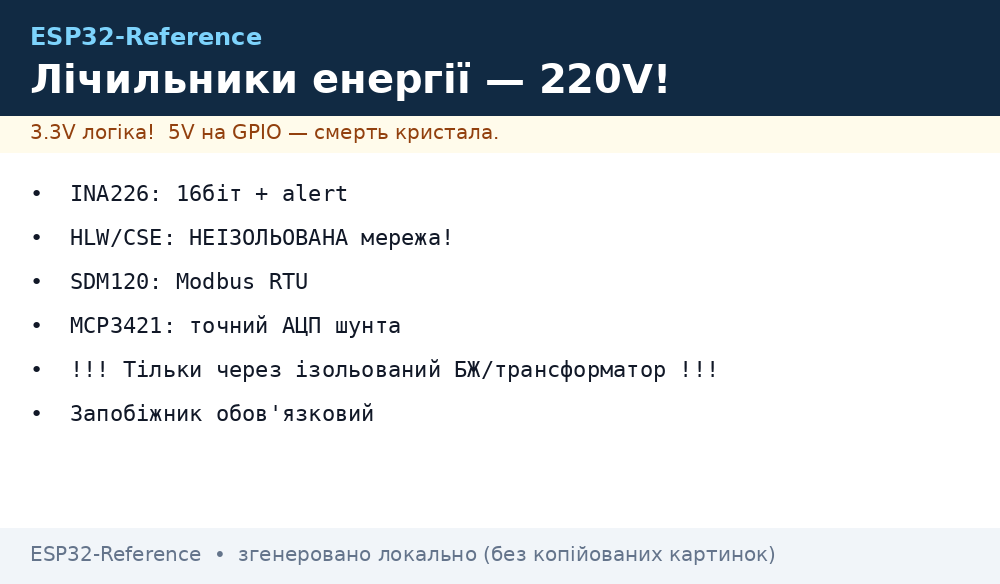
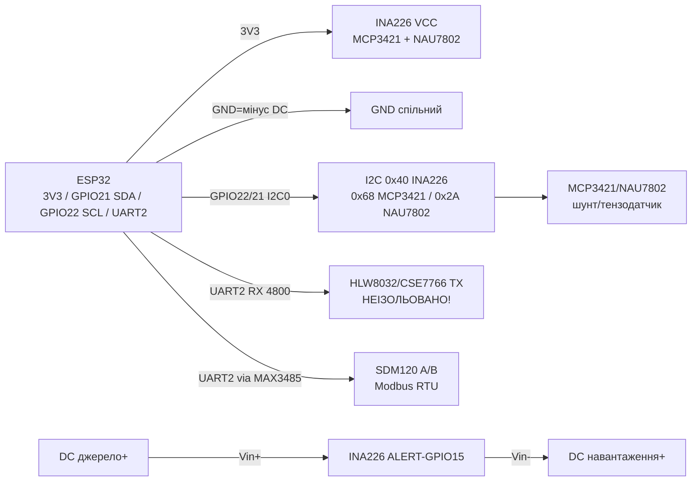
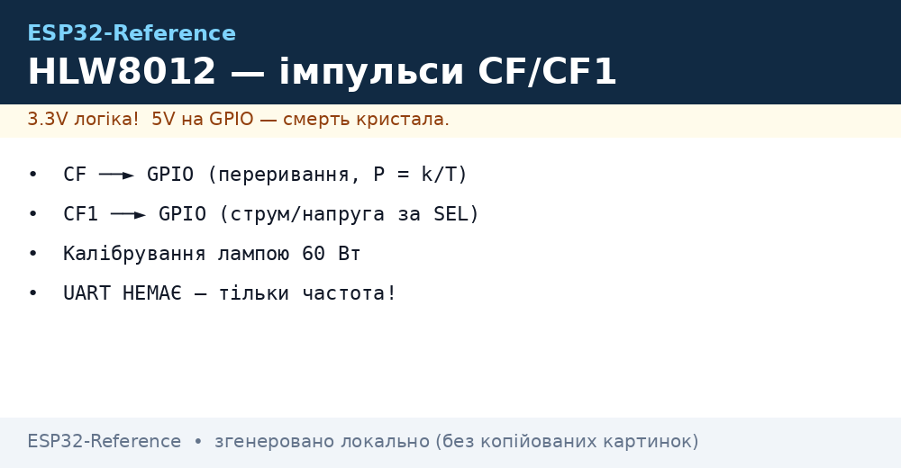

# INA226, HLW8032/CSE7766, SDM120, ADE7758, MCP3421/NAU7802 - енергія і точні АЦП


*Рис. 1. Вимір енергії з ESP32: DC-шунт (INA226), смарт-розетка (UART CF-імпульси), Modbus-лічильник (SDM120), точні АЦП для шунтів.*

## Призначення

Вимірювальна група «дорослої» енергетики на ESP32: DC-моніторинг батарей/сонця, облік 220 В через готові модулі й лічильники, точне зчитування шунтів і тензодатчиків диференційними АЦП. Для розумного дому, сонячних станцій, обліку оренди, ваг на тензодатчиках.

INA226 - 16-біт DC-монітор (Vbus + шунт + потужність), точніший за INA219, з alert-піном. HLW8032/CSE7766/BL0937 - чипи розумних розеток (Sonoff POW): рахують активну енергію й видають UART CF-імпульси. SDM120 - однофазний Modbus RTU лічильник на DIN-рейку (U/I/P/E). ADE7758 - 3-фазний облік (оглядово, складний фронт-енд). MCP3421 (18 біт, 1 канал) / HX710/NAU7802 (24 біти, міст) - точні АЦП для зовнішніх шунтів і тензодатчиків.

> ЖОРСТКЕ ЗАСТЕРЕЖЕННЯ - 220 V НЕБЕЗПЕЧНО ДЛЯ ЖИТТЯ. HLW8032/CSE7766/BL0937-модулі НЕІЗОЛЬОВАНІ: вся низьковольтна частина під потенціалом мережі! Монтаж тільки при вимкненому автоматі, корпус закритий, налагодження через ізольований USB-UART або взагалі без підключеного ПК. SDM120 ставити через автомат + варистор, дроти 2.5 мм², гвинти затягнуті. Без досвіду з мережами - тільки готові сертифіковані розетки/лічильники.

## Характеристики

| Параметр | INA226 | HLW8032 / CSE7766 / BL0937 | SDM120-Modbus |
| --- | --- | --- | --- |
| Що міряє | DC: Vbus 0-36 В, шунт ±81.9 мВ, струм, потужність | AC 220 В: U/I/P/E (активна енергія) | AC: U 176-276 В, I до 45 А, P, E, f, cos φ |
| Принцип | 16-біт АЦП + програмований шунт, I2C | Дельта-сигма + CF-імпульси по UART 4800 | Шунт/трансформатор + Modbus RTU 9600/2400 |
| Інтерфейс | I2C 0x40-0x4F (16 адрес), ALERT | UART TX (CF-пачки), 4800 8E1/8N1 | RS485 A/B → UART через MAX3485, Modbus 0x01 |
| Живлення | 2.7-5.5 В | 3.3-5 В (від мережі через каппад/транс!) | 230 В (сам лічильник) + 3.3 В конвертер RS485 |
| Точність | ±0.1 % (з каліброваним шунтом) | ±1-2 % (після калібрування за еталоном) | Клас 1 (±1 %) |
| Ізоляція | DC-шина (спільний GND!) | НЕМАЄ - фаза на платі! | Корпус ізольований, RS485 вимагає уваги |
| Особливість | Alert-пін: перевантаження/пороги без опитування | Розумні розетки Sonoff POW - готовий корпус! | DIN-рейка, MID-версії для комерційного обліку |

| Параметр | ADE7758 (3 фази, оглядово) | MCP3421 | HX710 / NAU7802 |
| --- | --- | --- | --- |
| Що міряє | 3×U + 3×I + P/Q/S/E, нульовий провід | Диференційні ±2.048 В, 18 біт | Міст тензодатчика / шунт, 24 біти |
| Інтерфейс | SPI + IRQ | I2C фікс 0x68 (один на шині!) | HX710: DT/SCK; NAU7802: I2C 0x2A |
| Швидкість | Періодні регістри, складний фронт-енд | 3.75 sps @18 біт … 240 sps @12 біт | 10-80 sps (NAU7802 до 320) |
| Живлення | 5 В + трансформатори струму/напруги | 2.7-5.5 В | 2.6-5.5 В |
| Особливість | Потрібні ТТ + дільники + калібрування фаз; для профі | Вбудована опора, PGA ×1-×8; один на шині без мультиплексора | E+/E− збудження, A+/A− сигнал; тара + масштаб еталоном |

### Готові 3-фазні: ATM90E32NBLA / SDM630-Modbus

| Позиція | Що це |
| --- | --- |
| ATM90E32NBLA (Microchip) | 3-фазний чип обліку того ж класу що ADE7758, але простіший фронт-енд (SPI/UART); для своїх лічильників |
| SDM630-Modbus (Eastron) | Готовий DIN-лічильник: U/I/P/E по фазах + сумарна енергія, Modbus RTU - читати як SDM120, тільки більше регістрів |

> INA226 вимагає спільного GND з вимірюваною DC-шиною (high-side). RS485 SDM120 - вита пара A/B + GND, термінатор 120 Ом на довгих лініях.

## Легенда пінів модуля

| Пін | Тип | Куди | Примітка |
| --- | --- | --- | --- |
| VIN (INA226 CJMCU) | Живлення 3.3 В | 3V3 ESP32 | Логіка 3.3 В |
| GND (INA226) | Земля | GND ESP32 = мінус DC-шини! | Без спільного мінуса - нулі/сміття |
| SCL / SDA | I2C | GPIO22 / GPIO21 | 16 адрес A0/A1: 0x40-0x4F |
| Vin+/Vin− | Розрив плюса DC-шини | Джерело+ → Vin+, навантаження+ → Vin− | Струм + → −; шунт 0.1 Ом вбудований (до 3.2 А) |
| ALERT (INA226) | Вихід компаратора | GPIO15 (опційно) | Перевантаження/готовність; open-drain + pull-up |
| TX (HLW8032/CSE7766) | UART-вихід CF-пачок | GPIO16 RX2 | 4800 бод; тільки RX ESP32 (TX сенсора → RX плати)! |
| 5V/GND (розетка) | Живлення модуля | Від мережевого БЖ розетки | НЕ підключати USB-ПК без ізоляції! Налагодження - по Wi-Fi/логах |
| A/B (RS485-модуль) | Диференційна пара | SDM120 A/B | Вита пара, екран на довгих; RO→RX, DI→TX, DE+RE→GPIO |
| E+/E−, A+/A− (NAU7802/HX710) | Міст | Тензодатчик червоний/чорний/білий/зелений | E - збудження, A - сигнал; переплутати = нулі/насичення |

## Схема підключення

| ESP32 | Модуль | Примітка |
| --- | --- | --- |
| 3V3 | INA226 VCC, MCP3421/NAU7802 VCC | Логіка 3.3 В |
| GND | GND усіх низьковольтних | Спільна з DC-шиною для INA226! |
| GPIO22/21 | SCL/SDA INA226 + MCP3421 + NAU7802 | Одна шина I2C0; MCP3421 тільки 0x68 - один на шині! |
| Джерело+ / навантаження+ | INA226 Vin+ / Vin− | Розрив плюса, мінус спільний |
| GPIO15 | INA226 ALERT (опційно) | Пороги струму/потужності |
| GPIO16 (RX2) | HLW8032/CSE7766 TX | UART2 4800, тільки прийом; корпус закритий! |
| GPIO17 TX2 / GPIO16 RX2 | RS485 DI / RO (SDM120) | UART2 9600 через MAX3485; DE+RE → GPIO4 |
| GPIO16/17 | HX710 DT/SCK (якщо замість NAU7802) | Власний serial, не I2C |

> 220 В монтаж: автомат 16 А → SDM120/розетка → навантаження; варистор 275 В + запобіжник; дроти 2.5 мм²; після монтажу - термоусадка/корпус IP20+.

### ASCII-схема

```text
ESP32 DevKit              Енергія DC + AC + точні АЦП
------------              --------------------------------
3V3 ────────────────────► INA226 VCC / MCP3421 VCC / NAU7802 VCC / RS485 VCC
GND ────────────────────► GND x4 (= мінус DC-шини для INA226!)
GPIO22 ─────────────────► SCL (INA226 + MCP3421 + NAU7802)
GPIO21 ─────────────────► SDA (INA226 + MCP3421 + NAU7802)
Джерело+ ───────────────► INA226 Vin+ ──[шунт]──► Vin− ──► навантаження+ (DC!)
GPIO15 ◄───────────────── INA226 ALERT (пороги, опційно)
GPIO16 RX2 ◄───────────── HLW8032 TX (UART 4800, НЕІЗОЛЬОВАНА мережа! корпус закритий!)
GPIO17 TX2 ─────────────► RS485 DI ──[MAX3485 A/B]──► SDM120 (Modbus 9600)
GPIO16 RX2 ◄───────────── RS485 RO ──[вита пара + GND]──┘  DE+RE → GPIO4
NAU7802 E+/E−, A+/A− ───► тензодатчик (черв/чорн, біл/зел) | MCP3421 +/- ► шунт
~~~ 220V: автомат 16А → SDM120/розетка → навантаження | варистор 275V ~~~
```

### Mermaid




*Рис. 2. Три домени: DC-шунт зі спільним GND, НЕізольована розетка (закритий корпус!), ізольований Modbus через RS485.*

## Код ESP-IDF

```c
#include "driver/i2c.h"
#include "driver/uart.h"
#include "esp_log.h"

#define I2C_PORT I2C_NUM_0
#define INA_ADDR 0x40
#define UART_METER UART_NUM_2 // HLW8032 RX або SDM120 RS485

void app_main(void)
{
    i2c_config_t c = {.mode = I2C_MODE_MASTER,
        .sda_io_num = GPIO_NUM_21, .scl_io_num = GPIO_NUM_22,
        .sda_pullup_en = GPIO_PULLUP_ENABLE,
        .scl_pullup_en = GPIO_PULLUP_ENABLE, .master.clk_speed = 100000};
    i2c_param_config(I2C_PORT, &c);
    i2c_driver_install(I2C_PORT, c.mode, 0, 0, 0);
    // INA226: config 0x00, calibration 0x05 (шунт 0.1 Ом), alert 0x07
    // драйвер: esp-idf-lib ina226 (get_bus_voltage/current/power)
    uart_config_t u = {.baud_rate = 4800, .data_bits = UART_DATA_8_BITS,
        .parity = UART_PARITY_DISABLE, .stop_bits = UART_STOP_BITS_1,
        .flow_ctrl = UART_HW_FLOWCTRL_DISABLE};
    uart_param_config(UART_METER, &u); // для SDM120: 9600 + парність за мануалом
    uart_set_pin(UART_METER, 17, 16, -1, -1);
    uart_driver_install(UART_METER, 256, 0, 0, NULL, 0);
    // SDM120: Modbus 0x01 0x04 read input registers (U=0x0000, I=0x0006...)
    // NAU7802/MCP3421: esp-idf-lib nau7802 / mcp3421 (тара + калібрування)
    for (;;) vTaskDelay(pdMS_TO_TICKS(1000));
}
```

## Код Arduino

```cpp
#include <Wire.h>
#include <INA226_WE.h>      // WoDas INA226
#include <ModbusMaster.h>   // SDM120
#include <Adafruit_MCP3421.h>
#include <SparkFun_Qwiic_Scale_NAU7802_Arduino_Library.h>

INA226_WE ina(0x40);
ModbusMaster sdm;
Adafruit_MCP3421 mcp;
NAU7802 scale;
#define RS485_DE 4

void preTx() { digitalWrite(RS485_DE, HIGH); }
void postTx() { digitalWrite(RS485_DE, LOW); }

void setup() {
  Serial.begin(115200);
  Wire.begin(21, 22);
  ina.init();
  ina.setResistorRange(0.1, 3.2); // вбудований шунт 0.1 Ом, до 3.2 А
  // ina.setAlertParams(...); // alert-пін GPIO15
  Serial2.begin(9600, SERIAL_8N1, 16, 17); // SDM120 (HLW8032: 4800!)
  pinMode(RS485_DE, OUTPUT); postTx();
  sdm.begin(1, Serial2); sdm.preTransmission(preTx); sdm.postTransmission(postTx);
  mcp.begin(0x68); // MCP3421: один на шині!
  mcp.setSampleRate(MCP3421_18_BIT);
  scale.begin(); scale.calculateZeroOffset(); // тара NAU7802
}

void loop() {
  Serial.printf("INA226: %.2f V %.1f mA %.2f W\n",
    ina.getBusVoltage_V(), ina.getCurrent_mA(), ina.getBusPower());
  uint8_t e = sdm.readInputRegisters(0x0000, 2); // U SDM120
  if (e == sdm.ku8MBSuccess) Serial.printf("SDM120 U=%.1f V\n", sdm.getResponseBuffer(0) / 10.0);
  Serial.printf("MCP3421=%ld | NAU7802=%.1f g\n", (long)mcp.readADC(), scale.getWeight());
  // HLW8032/CSE7766: читати UART-пачки 4800 і рахувати CF-імпульси (Tasmota-алгоритм)
  delay(2000);
}
```

## Код MicroPython

```python
from machine import I2C, UART, Pin
import time

i2c = I2C(0, scl=Pin(22), sda=Pin(21), freq=100000)
print("I2C:", [hex(a) for a in i2c.scan()])  # 0x40 INA226, 0x68 MCP3421, 0x2A NAU7802

# INA226: config 0x00, calibration за шунтом 0.1 Ом (драйвер ina226.py)
# from ina226 import INA226
# ina = INA226(i2c, addr=0x40, shunt=0.1, maxA=3.2)

# HLW8032/CSE7766: тільки RX!
pow_uart = UART(2, 4800, tx=17, rx=16)
# SDM120: UART 9600 через RS485 + Modbus (uModbus), DE/RE GPIO4
# de = Pin(4, Pin.OUT, value=0)

# NAU7802 (драйвер nau7802.py): тара + калібрування еталоном
# MCP3421 (драйвер mcp3421.py, addr 0x68): 18 біт = 3.75 sps!

while True:
    if pow_uart.any():
        print("POW bytes:", pow_uart.read(24))  # CF-пачка HLW/CSE/BL
    # print("INA:", ina.voltage, ina.current, ina.power)
    time.sleep(2)
```

### HLW8012 - імпульсний попередник (без UART)

| Параметр | HLW8012 |
| --- | --- |
| Виходи | CF (імпульси ∝ активній потужності) + CF1 (струм/напруга за режимом SEL) |
| Інтерфейс | GPIO-переривання / PCNT на ESP32 (ніякого UART!) |
| Калібрування | Еталон 60 Вт лампа розжарювання: `P = k / T_імпульсу` |
| Коли брати | Розумні розетки першого покоління, реверс-інжиніринг; для нових - HLW8032/CSE7766 |

```text
CF ──[оптопара PC817]──► GPIO ESP32 (гальванічна розв'язка від мережі!)
SEL ──► GPIO (HIGH = режим струму, LOW = режим напруги на CF1)
```

> HLW8012 vs HLW8032: у 8012 немає UART-кадрів - тільки частота імпульсів; формула потужності обернена до періоду, нульове навантаження = таймаут виміру.


*Рис. HLW8012: імпульси CF/CF1 через оптопару, калібрування лампою 60 Вт.*

## Типові помилки

| № | Помилка | Симптом | Рішення |
| --- | --- | --- | --- |
| 1 | Робота з 220 В без вимкненого автомата | Ураження струмом, дуга | Вимкнути автомат, перевірити індикатором, корпус закрити до вмикання; налагодження по Wi-Fi |
| 2 | ПК підключено USB до НЕізольованої розетки | Фаза на корпусі ПК, згорілий порт | Ніколи не підключати USB-UART до HLW/CSE/BL під мережею; логи - по Wi-Fi/MQTT |
| 3 | INA226 без спільного GND | Нулі або сміття по струму | Мінус DC-шини = GND ESP32; Vin+/Vin− не плутати (струм + → −) |
| 4 | Два MCP3421 на шині (адреса фікс 0x68) | Конфлікт, обидва мовчать | Тільки один MCP3421 на шині; другий - через TCA9548A або замінити на NAU7802/ADS1115 |
| 5 | SDM120 без DE/RE керування | Таймаути Modbus | DE+RE → GPIO4, pre/postTransmission; 9600 бод, slave 1; термінатор 120 Ом на довгій лінії |
| 6 | HLW8032 плутають бодрейт | Сміття замість пачок | 4800 бод (не 9600!); читати 24-байтні пачки, рахувати CF-імпульси за Tasmota-алгоритмом |
| 7 | Тензодатчик переплутаними парами | Нулі/насичення NAU7802 | E+/E− - збудження (черв/чорн), A+/A− - сигнал (біл/зел); `set_scale` еталонною вагою |
| 8 | Шунт гріється на 3 А | Дрейф струму/потужності | Зовнішній шунт з радіатором + `setResistorRange`; калібрувати за еталонним амперметром |
| 9 | HLW8012 плутають з HLW8032 | Немає UART - тільки імпульси CF/CF1 | HLW8012: рахувати імпульси CF (потужність) + CF1 (струм/напруга) через PCNT/GPIO-переривання; калібрувати навантаженням 60 Вт |

## Офіційні джерела

- [Гайд INA219/INA21x з кодом (Adafruit Learn)](https://learn.adafruit.com/adafruit-ina219-current-sensor-breakout) - high-side шунт, калібрування, alert-логіка (INA226 - старший 16-біт родич).
- [Гайд MCP3421 з кодом (Adafruit Learn)](https://learn.adafruit.com/adafruit-mcp3421-18-bit-adc) - диференційний 18-біт АЦП, PGA, 3.75-240 sps.
- [Гайд NAU7802 з кодом (Adafruit Learn)](https://learn.adafruit.com/adafruit-nau7802-24-bit-adc-stemma-qt-qwiic) - 24-біт міст, E+/A+ розпіновка, I2C 0x2A.
- [Гайд Qwiic Scale NAU7802 з кодом (SparkFun)](https://learn.sparkfun.com/tutorials/qwiic-scale-hookup-guide) - тара, калібрування, gain/LDO.
- [Гайд HX711 з кодом (Adafruit Learn)](https://learn.adafruit.com/adafruit-hx711-24-bit-adc) - DT/SCK, два мости, 10/80 sps.
- HLW8032/CSE7766/BL0937, SDM120, ADE7758, INA226 - `перевірити вручну` (даташити TI/HLW/SDM/ADE + мануал Eastron).

### Трифазні лічильники: SDM630 / ATM90E32

| Лічильник | Фаз | Інтерфейс | Точність | Коли |
| --- | --- | --- | --- | --- |
| SDM630 (Eastron) | 3 | Modbus RTU (RS485!) | class 1 | Готовий прилад на DIN-рейку: підключив CT - читаєш регістри |
| ATM90E32 (Microchip) | 3 (або 2+нейтраль) | SPI/UART | 0.5% | Свій дизайн: шунти/CT + калібрування gain/offset |
| PZEM-004T ×3 | 3 (три модулі!) | 3× UART | class 1 | Дешево, але три порти і три CT |

```text
SDM630: A/B RS485 → ESP32 (див. 12-04!); регістри 0x0000 (V1), 0x000E (I1),
  0x0034 (P total); бод 9600 8N1, адреса за замовчуванням 1.
  УВАГА: три фази = три CT + правильний порядок фаз (L1/L2/L3 не плутати!).
ATM90E32: калібрування gain по еталонному навантаженню (лампа 100 Вт),
  offset при нулі; без калібрування — індикатор, не лічильник!
```

## Див. також

- [Home](../../../ESP32-Reference/Home.md)
- [ADC](../../../ESP32-Reference/06-Analog/01-ADC.md)
- [I2C](../../../ESP32-Reference/04-Shini/03-I2C.md)
- [SPI](../../../ESP32-Reference/04-Shini/02-SPI.md)
- [UART](../../../ESP32-Reference/04-Shini/01-UART.md)
- [03-BME280-BMP280-SHT31](../../../ESP32-Reference/10-Sensori/03-BME280-BMP280-SHT31.md)
- [06-INA219-HX711-BH1750](../../../ESP32-Reference/10-Sensori/06-INA219-HX711-BH1750.md)
- [17-Gas-CO2-Precision](../../../ESP32-Reference/10-Sensori/17-Gas-CO2-Precision.md)
- [18-Light-Spectral-Gesture](../../../ESP32-Reference/10-Sensori/18-Light-Spectral-Gesture.md)
- [19-IMU-6-9DOF](../../../ESP32-Reference/10-Sensori/19-IMU-6-9DOF.md)
- [20-Bio-IR-Temp](../../../ESP32-Reference/10-Sensori/20-Bio-IR-Temp.md)
