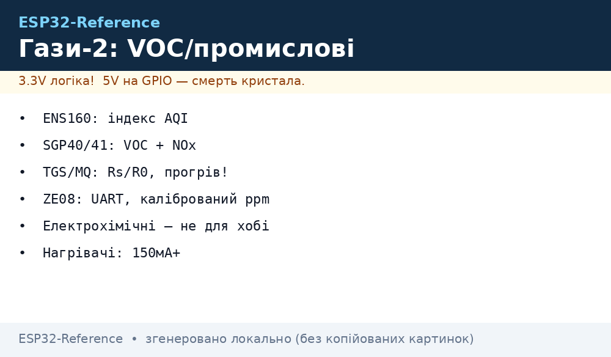
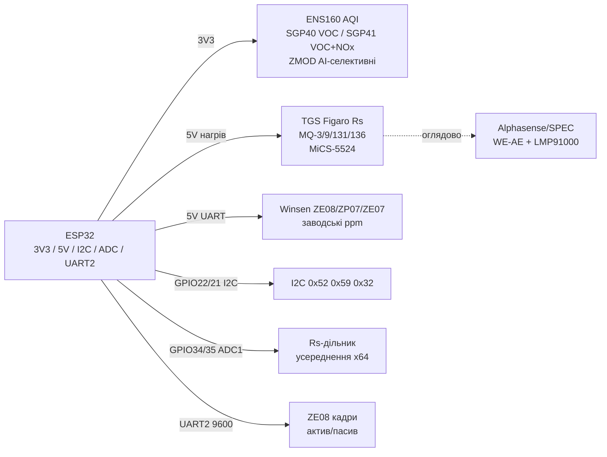

# ENS160, SGP40/41, ZMOD4410/4510, TGS, MQ - VOC і промислові гази


*Рис. 1. Промислові VOC/газ-сенсори на ESP32: цифрові MOX по I2C, калібровані UART-модулі Winsen, аналогові Figaro/MQ через ADC.*

## Призначення

Наступний рівень після MQ-2/MQ-7/MQ-135 і CCS811/SGP30: селективні VOC-індекси, справжній AQI, NOx-канал, заводсько-калібровані UART-модулі та промислові електрохімічні комірки. Для витяжок і рекуператорів (DCV за VOC), детекторів витоків LPG/CO/H2S/O3, алкотестерів, озонових камер, моніторингу цехів і котелень.

ENS160 (ScioSense) - готовий AQI 1-5 за UBA + TVOC + eCO2 без бібліотек на хості. SGP40 - тільки VOC-індекс 0-500 (потрібен Gas Index Algorithm), SGP41 - VOC + NOx два канали. ZMOD4410 - селективний IAQ з AI-класифікацією (RAEON/ULP), ZMOD4510 - селективний NO2/O3 для вулиці. TGS2600/2610/2620/813/822/2611 (Figaro) - еталонні MOX з нагрівачем, вимірюється Rs дільником. MQ-3 (алкоголь), MQ-9 (CO/горючі), MQ-131 (озон), MQ-136 (H2S) - дешеві аналогові, тільки тривога/тренд. Winsen ZE08/ZP07/ZE07 - калібровані UART-модулі з заводським калібруванням. MiCS-5524 - компактний MOX для CO/VOC. Електрохімічні Alphasense/SPEC - оглядово: робочий/допоміжний електроди, чому не для хобі.

> Жоден MOX не дає ppm конкретного газу без лабораторного калібрування під цей газ. MOX дає Rs/R0, VOC-індекс або AQI. Для норм і безпеки потрібні NDIR/електрохімічні з калібруванням.

## Характеристики

| Параметр | ENS160 | SGP40 | SGP41 | ZMOD4410 | ZMOD4510 |
| --- | --- | --- | --- | --- | --- |
| Що міряє | AQI 1-5 (UBA) + TVOC + eCO2 | VOC-індекс 0-500 | VOC-індекс + NOx-індекс 0-500 | IAQ, TVOC, eCO2, RMOX (AI) | NO2/O3 селективно (ppb) |
| Принцип | MOX 4 елементи, TrueVOC | MOX multi-pixel, hotplate | MOX dual-channel | MOX + AI-алгоритм | MOX селективний до окислювальних газів |
| Інтерфейс | I2C 0x52/0x53 + SPI | I2C 0x59 | I2C 0x59 | I2C 0x32 + AI-бібліотека | I2C 0x32 + AI-бібліотека |
| Живлення | 1.71-1.98 В (модуль 3.3 В) | 1.7-3.6 В (модуль 3.3 В) | 1.7-3.6 В (модуль 3.3 В) | 1.7-3.6 В | 1.7-3.6 В |
| Струм | ~30 мА (нагрів імпульсами) | ~2.6 мА середній | ~3 мА середній | ~5-20 мА (режими ULP/LP) | ~5-20 мА |
| Вихід | Готовий AQI/TVOC/eCO2 на чипі | Сирий + Gas Index на хості | Два індекси на хості | RAEON, класи запаху | Концентрація NO2/O3 (після калібрування) |
| Прогрів | 1 год перший раз, 3 хв далі | 1 год, компенсація вологості | 1 год, два baseline | 24 год burn-in, далі ULP-сон | 24 год burn-in |
| Особливість | Без бібліотек, вологокомпенсація | RESET/WELL-сумісний | VOC+NOx на одному кристалі | Селективність через AI | Вуличний смог, озон |

| Параметр | TGS2600/2610/2620/813/822/2611 | MQ-3 / MQ-9 / MQ-131 / MQ-136 | Winsen ZE08/ZP07/ZE07 | MiCS-5524 | Alphasense / SPEC (огляд) |
| --- | --- | --- | --- | --- | --- |
| Що міряє | Загальні забруднення / LPG / розчинники / метан | Алкоголь / CO / O3 / H2S (напівкількісно) | CO/O3/HCHO тощо, ppm по UART | CO 1-1000 ppm, VOC, H2 | CO/NO2/SO2/O3/H2S точний ppm |
| Принцип | MOX + нагрівач 5 В, Rs-вимірювання | MOX + нагрівач 5 В, Rs/R0 | Електрохімія/NDIR/MOX + MCU, калібровка | MOX, Rs-дільник | Електрохімічна комірка 3 електроди |
| Інтерфейс | Аналог (ADC!) | Аналог (ADC!) | UART 9600 + аналог/PWM | Аналог (ADC!) | Аналог мкА (потенціостат!) |
| Живлення | Нагрівач 5 В ±0.2 В | Нагрівач 5 В, 150-800 мА | 5 В (деякі 3.3 В), ~50 мА | Нагрівач 2.4 В / 5 В модуль | 3.3 В + LMP91000 |
| Діапазон | Rs 10 кОм-100 кОм типово | Див. даташит криві Rs/R0 | Залежить від моделі, див. табличку | Rs 100-1500 кОм | ppb-ppm, лінійний струм нА/ppm |
| Точність | Тренд ±30 % без калібрування | Тільки поріг/тренд без лабораторії | ±5-10 % (заводська) | Тренд, крос-чутливість | ±2-5 % (з калібруванням) |
| Особливість | Еталон хобі-газу, потрібен R0 на чистому повітрі | MQ-9: два режими нагріву (1.5 В/5 В) | Найпростіший шлях до ppm на ESP32 | Крихітний, для портативу | Дорого, вимагають біас і температуру |

> MQ-131 озоновий і MQ-136 сірководневий отруюються силіконами й високими концентраціями: не паяти поруч без відмивки флюсу, не «нюхати» чистий газ.
> Електрохімічні Alphasense (CO-B4, NO2-B43F, OX-B431) і SPEC (110-102, 110-407): робочий електрод дає струм окислення, допоміжний (AUX) - фон температури/дрейфу, різниця WE−AE - сигнал. Потрібен потенціостат (LMP91000/ULP), біас-напруга, 24 год стабілізації, калібрування газом. Для хобі - не брати: ціна, газові балони, термін 2 роки.

## Легенда пінів модуля

| Пін | Тип | Куди | Примітка |
| --- | --- | --- | --- |
| VIN (ENS160/SGP40/SGP41/ZMOD-модулі) | Живлення 3.3 В | 3V3 ESP32 | На модулі LDO; голий чип - 1.8 В! |
| VH (TGS/MQ нагрівач) | Нагрів 5 В | 5V окремо | MQ до 800 мА - не від 3V3 ESP32, окремий БЖ + спільний GND |
| VC (TGS/MQ вимір) | Опора дільника | 5 В / 3.3 В | Дільник Rs+RL; RL підібрати 10-47 кОм під діапазон |
| AO (TGS/MQ/MiCS) | Аналог | GPIO34/35 (ADC1) | Тільки ADC1 при увімкненому Wi-Fi; усереднювати 64 семпли |
| DO (MQ-компаратор) | Цифровий поріг | GPIO (опційно) | Потенціометр на модулі; для тривоги, не для ppm |
| SDA / SCL (ENS/SGP/ZMOD) | I2C | GPIO21 / GPIO22 | Адреси: ENS 0x52/0x53, SGP 0x59, ZMOD 0x32 - конфліктів немає |
| ADDR (ENS160) | Вибір адреси | GND → 0x52, VCC → 0x53 | Не залишати висячим |
| INTn (ENS160/ZMOD) | Переривання | GPIO (опційно) | Поріг AQI; можна опитувати без нього |
| TX / RX (ZE08/ZP07/ZE07) | UART 9600 | GPIO16/17 (UART2) | Хрест TX→RX; активний/пасивний режим командою |
| WE / AE (SPEC/Alphasense) | мкА-струм | LMP91000, не безпосередньо! | Безпосередньо в ADC - вбити комірку; тільки потенціостат |
| GND | Земля | GND ESP32 | Зірка; мінус 5 В нагрівачів = GND ESP32 |

## Схема підключення

| ESP32 | Модуль | Примітка |
| --- | --- | --- |
| 3V3 | ENS160, SGP40/41, ZMOD4410/4510 VIN | Цифрові MOX, логіка 3.3 В |
| 5V (VU) | TGS/MQ VH+VC, Winsen ZE08 VCC, MiCS-модуль VCC | Нагрівачі окремим дротом, конденсатор 470 мкФ |
| GND | GND усіх модулів | Зірка, товстий провід до нагрівачів |
| GPIO22 | SCL цифрових MOX | I2C0, pull-up 4.7 кОм |
| GPIO21 | SDA цифрових MOX | I2C0, pull-up 4.7 кОм |
| GPIO34/35 | AO TGS/MQ/MiCS | ADC1, дільник Rs/RL, RC-фільтр 1 кОм + 100 нФ |
| GPIO17 → RX модуля | ZE08/ZP07 TX | UART2 TX ESP → RX сенсора |
| GPIO16 ← TX модуля | ZE08/ZP07 RX | UART2 RX ESP ← TX сенсора |
| GPIO25 (опційно) | DO MQ-компаратора | Тривога витоку |

### ASCII-схема

```text
ESP32 DevKit              Промислові гази / VOC
------------              ---------------------------------
3V3 ────────────────────► ENS160 VIN / SGP40 VIN / SGP41 VIN / ZMOD VIN
5V (VU) ────────────────► MQ/TGS VH+VC / ZE08 VCC / MiCS VCC (+470 мкФ!)
GND ────────────────────► GND xN (зірка, товстий провід до нагрівачів!)
GPIO22 ─────────────────► SCL x4 (ENS 0x52 + SGP 0x59 + ZMOD 0x32)
GPIO21 ─────────────────► SDA x4 (паралельно, [4.7 кОм] до 3V3)
GPIO34 ◄───────────────── MQ-AO / TGS-AO / MiCS-AO (дільник Rs+RL)
GPIO35 ◄───────────────── Другий аналог (напр. MQ-131 O3)
GPIO17 (TX2) ───────────► ZE08 RX (команди/режим)
GPIO16 (RX2) ◄─────────── ZE08 TX (кадри ppm, 9600)
GPIO25 ◄───────────────── MQ-DO (компаратор, тривога)
VH окремо: MQ-9 H/L два режими нагріву — перемикати MOSFET!
```

### Mermaid




*Рис. 2. Розподіл живлення: цифрові MOX - 3V3, нагрівачі й UART-модулі - 5 В; електрохімія - тільки через потенціостат.*

## Код ESP-IDF

```c
#include "driver/i2c.h"
#include "driver/adc.h"
#include "driver/uart.h"
#include "esp_log.h"

#define I2C_PORT I2C_NUM_0
static const char *TAG = "gas-ind";

// ENS160: читання AQI (регістр 0x27), TVOC (0x28), eCO2 (0x24)
static esp_err_t ens160_read(uint8_t *aqi, uint16_t *tvoc, uint16_t *eco2)
{
    uint8_t reg = 0x27;
    i2c_cmd_handle_t h = i2c_cmd_link_create();
    i2c_master_start(h);
    i2c_master_write_byte(h, (0x52 << 1) | I2C_MASTER_WRITE, true);
    i2c_master_write_byte(h, reg, true);
    i2c_master_start(h);
    i2c_master_write_byte(h, (0x52 << 1) | I2C_MASTER_READ, true);
    uint8_t d[5] = {0};
    i2c_master_read(h, d, 5, I2C_MASTER_LAST_NACK);
    i2c_master_stop(h);
    esp_err_t e = i2c_master_cmd_begin(I2C_PORT, h, pdMS_TO_TICKS(100));
    i2c_cmd_link_delete(h);
    if (e == ESP_OK) { *aqi = d[0]; *tvoc = d[1] | (d[2] << 8); *eco2 = d[3] | (d[4] << 8); }
    return e;
}

// MQ/TGS: Rs = RL * (VCC - Vout) / Vout, усереднити 64 рази
static float mq_rs_ohm(int adc_pin, float rl_kohm)
{
    uint32_t sum = 0;
    for (int i = 0; i < 64; i++) {
        sum += adc1_get_raw(ADC1_CHANNEL_6); // GPIO34
        ets_delay_us(500);
    }
    float vout = (sum / 64.0f) / 4095.0f * 3.3f;
    if (vout < 0.05f) vout = 0.05f;
    return rl_kohm * (5.0f - vout) / vout * 1000.0f; // Ом
}

void app_main(void)
{
    // I2C0: GPIO21/22, 100 кГц; ADC1 12 біт; UART2 9600 для ZE08
    // SGP40/41: команди measure_raw (0x260F), Gas Index на хості (sensirion_gas_index_algorithm)
    // ZMOD4410/4510: фірмова RAEON-бібліотека, burn-in 24 год
    uint8_t aqi = 0; uint16_t tvoc = 0, eco2 = 0;
    if (ens160_read(&aqi, &tvoc, &eco2) == ESP_OK)
        ESP_LOGI(TAG, "AQI=%d TVOC=%d eCO2=%d", aqi, tvoc, eco2);
    ESP_LOGI(TAG, "MQ Rs=%.0f Om", mq_rs_ohm(34, 10.0f));
}
```

## Код Arduino

```cpp
#include <Wire.h>
#include <ScioSense_ENS160.h>   // ENS160 AQI
#include <SensirionI2CSgp41.h>  // SGP41 VOC+NOx
#include <sensirion_gas_index_algorithm.h>

ScioSense_ENS160 ens160(ENS160_I2CADDR_1); // 0x52
SensirionI2CSgp41 sgp41;
GasIndexAlgorithmParams vocParams, noxParams;

const int MQ_PIN = 34;      // AO MQ/TGS/MiCS
const float RL_KOHM = 10.0; // RL дільника
float R0 = 10000.0;         // калібрувати на чистому повітрі!

void setup() {
  Serial.begin(115200);
  Wire.begin(21, 22);
  ens160.begin();
  ens160.setMode(ENS160_OPMODE_STD);
  sgp41.begin(Wire);
  GasIndexAlgorithm_init(&vocParams, GasIndexAlgorithm_ALGORITHM_TYPE_VOC);
  GasIndexAlgorithm_init(&noxParams, GasIndexAlgorithm_ALGORITHM_TYPE_NOX);
  // Winsen ZE08: Serial2.begin(9600, SERIAL_8N1, 16, 17);
  // MQ-9: окремий MOSFET нагріву H/L (1.5 В/5 В), цикли 60/90 с
}

float mqReadRs() {
  long sum = 0;
  for (int i = 0; i < 64; i++) { sum += analogRead(MQ_PIN); delay(2); }
  float vout = (sum / 64.0) / 4095.0 * 3.3;
  if (vout < 0.05) vout = 0.05;
  return RL_KOHM * (5.0 - vout) / vout * 1000.0;
}

void loop() {
  if (ens160.available()) {
    ens160.measure(true); ens160.measureRaw(true);
    Serial.printf("ENS AQI=%d TVOC=%d eCO2=%d\n",
      ens160.getAQI(), ens160.getTVOC(), ens160.geteCO2());
  }
  uint16_t srawVoc, srawNox;
  if (sgp41.executeConditioning() == 0 && sgp41.measureRawSignals(srawVoc, srawNox) == 0) {
    int32_t vocIdx, noxIdx;
    GasIndexAlgorithm_process(&vocParams, srawVoc, &vocIdx);
    GasIndexAlgorithm_process(&noxParams, srawNox, &noxIdx);
    Serial.printf("SGP41 VOC=%ld NOx=%ld\n", (long)vocIdx, (long)noxIdx);
  }
  float rs = mqReadRs();
  Serial.printf("MQ Rs=%.0f R0=%.0f ratio=%.2f\n", rs, R0, rs / R0);
  // ZE08: пасивний запит 0xFF 0x01 0x86 ... або активні кадри раз на 1 с
  delay(5000);
}
```

## Код MicroPython

```python
from machine import I2C, ADC, Pin, UART
import time

i2c = I2C(0, scl=Pin(22), sda=Pin(21), freq=100000)
print("I2C:", [hex(a) for a in i2c.scan()])  # 0x52 ENS, 0x59 SGP, 0x32 ZMOD

mq = ADC(Pin(34))
mq.atten(ADC.ATTN_11DB)
mq.width(ADC.WIDTH_12BIT)
RL = 10.0  # кОм

ze = UART(2, 9600, tx=17, rx=16)  # Winsen ZE08/ZP07

def mq_rs(n=64):
    s = sum(mq.read() for _ in range(n)) / n
    vout = s / 4095 * 3.3
    vout = max(vout, 0.05)
    return RL * (5.0 - vout) / vout * 1000.0  # Ом

# ENS160: драйвер ens160.py — set_mode(0x02 STD), read AQI/TVOC/eCO2
# SGP40/41: драйвер sgp4x.py — measure_raw + gas_index (порт алгоритму)
# ZMOD4410: фірмовий RAEON недоступний у MicroPython — тільки сирий RMOX

while True:
    print("MQ Rs=%.0f Om" % mq_rs())
    if ze.any() >= 9:
        b = ze.read(9)
        if b and b[0] == 0xFF and b[1] == 0x86:
            print("ZE ppm=", (b[2] << 8) | b[3])
    time.sleep(5)
```

### MiCS-6814: три гази в одному корпусі (CO / NH₃ / NO₂)

| Параметр | Значення |
| --- | --- |
| Канали | 3 окремих нагрівачі: CO, NH₃, NO₂ (оксиди азоту!) |
| Вихід | Аналоговий (3× Rs) - потрібні 3 ADC-канали або мультиплексор! |
| Прогрів | 24-48 год перший раз, далі - постійне живлення |
| Калібрування | R0 на чистому повітрі для КОЖНОГО каналу окремо |
| Споживання | ~90 мА на нагрівачі - не для батарей! |

```text
Підключення: 3× дільник (Rs + навантаження 10к) → CD74HC4067 → 1 ADC ESP32.
Формула як у MQ: ppm = f(Rs/R0) за графіком з даташиту (степенева!).
Селективність умовна: NH₃-канал реагує і на CO — для кількості брати SCD/SPS,
MiCS — для факту «щось не так» + який клас газу.
```

## Типові помилки

| № | Помилка | Симптом | Рішення |
| --- | --- | --- | --- |
| 1 | MOX видають за ppm конкретного газу | «CO = 37 ppm» з MQ без калібрування | MOX - тільки Rs/R0, індекс, AQI; ppm - лише ZE08 або лабораторна калібровка під газ |
| 2 | Немає прогріву/burn-in | Перші години показання пливуть | ENS/SGP - 1 год, ZMOD/TGS/MQ - 24 год burn-in + 3-30 хв щоразу |
| 3 | MQ/TGS живлять від 3V3 | Rs занижений, нагрів не світиться | Нагрівач строго 5 В ±0.2 В, окремий БЖ 1 А, спільний GND |
| 4 | MQ на ADC2 з Wi-Fi | Нулі/шум на GPIO4/0/2 | Тільки ADC1 (GPIO32-39) при Wi-Fi; усереднення 64 + RC-фільтр |
| 5 | SGP40/41 без Gas Index | Сирі значення видають за «якість» | Підключити sensirion_gas_index_algorithm, вологокомпенсація з SHT |
| 6 | ZMOD без AI-бібліотеки | RMOX стрибає, селективності немає | Використати RAEON/ULP-прошивки Renesas, калібрувати під сценарій |
| 7 | MQ-9 одним нагрівом | CO плутається з метаном | Цикли H/L (5 В 60 с / 1.5 В 90 с) через MOSFET, читати в кінці фаз |
| 8 | Електрохімію втикають в ADC | Комірка деградує за дні | Тільки LMP91000/потенціостат, WE−AE, біас за даташитом, калібрування газом |

## Офіційні джерела

- [SGP40 - каталог і даташит (Sensirion)](https://sensirion.com/products/catalog/SGP40) - VOC-індекс, I2C, Gas Index Algorithm.
- [SGP41 - каталог і даташит (Sensirion)](https://sensirion.com/products/catalog/SGP41) - VOC + NOx два канали на одному кристалі.
- [ENS16x - сімейство multi-gas сенсорів (ScioSense)](https://www.sciosense.com/ens16x-digital-metal-oxide-multi-gas-sensor-family) - AQI за UBA, TVOC, eCO2 на чипі.
- [Гайд SGP30 з кодом (Adafruit Learn)](https://learn.adafruit.com/adafruit-sgp30-gas-tvoc-eco2-mox-sensor) - MOX-база, baseline, вологокомпенсація (актуально і для SGP40/41).
- ZMOD4410/4510, Figaro TGS, Winsen ZE08/ZP07, MiCS-5524, Alphasense/SPEC - `перевірити вручну` (сайти Renesas/Figaro/Winsen блокують автоматичні запити).

## Див. також

- [Home](../../../ESP32-Reference/Home.md)
- [17-Gas-CO2-Precision](../../../ESP32-Reference/10-Sensori/17-Gas-CO2-Precision.md)
- [08-BME680-CCS811-MHZ19-PMS5003](../../../ESP32-Reference/10-Sensori/08-BME680-CCS811-MHZ19-PMS5003.md)
- [12-MQ2-MQ7-MQ135-Flame-Sound](../../../ESP32-Reference/10-Sensori/12-MQ2-MQ7-MQ135-Flame-Sound.md)
- [22-Gas-2-VOC-Industrial](../../../ESP32-Reference/10-Sensori/22-Gas-2-VOC-Industrial.md)
- [23-Dust-CO2-2](../../../ESP32-Reference/10-Sensori/23-Dust-CO2-2.md)
- [24-Pressure-Level-Flow](../../../ESP32-Reference/10-Sensori/24-Pressure-Level-Flow.md)
- [ADC](../../../ESP32-Reference/06-Analog/01-ADC.md)
- [I2C](../../../ESP32-Reference/04-Shini/03-I2C.md)
- [UART](../../../ESP32-Reference/04-Shini/01-UART.md)
