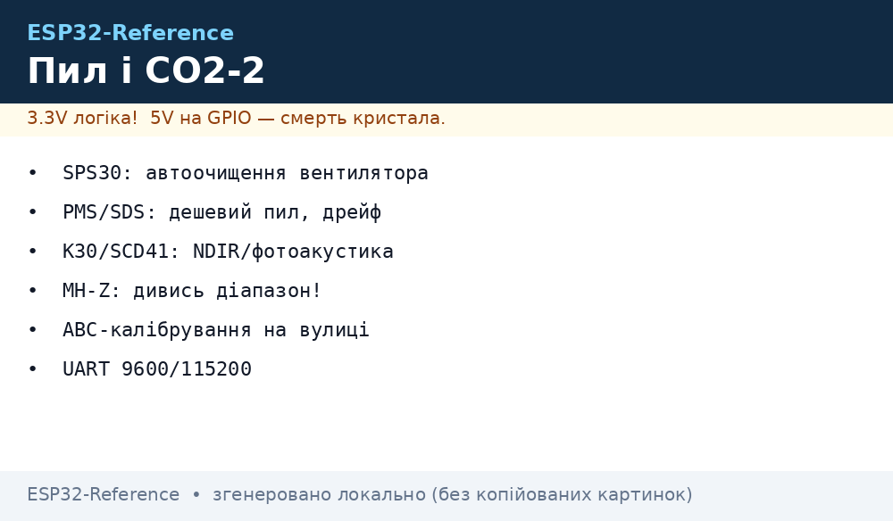
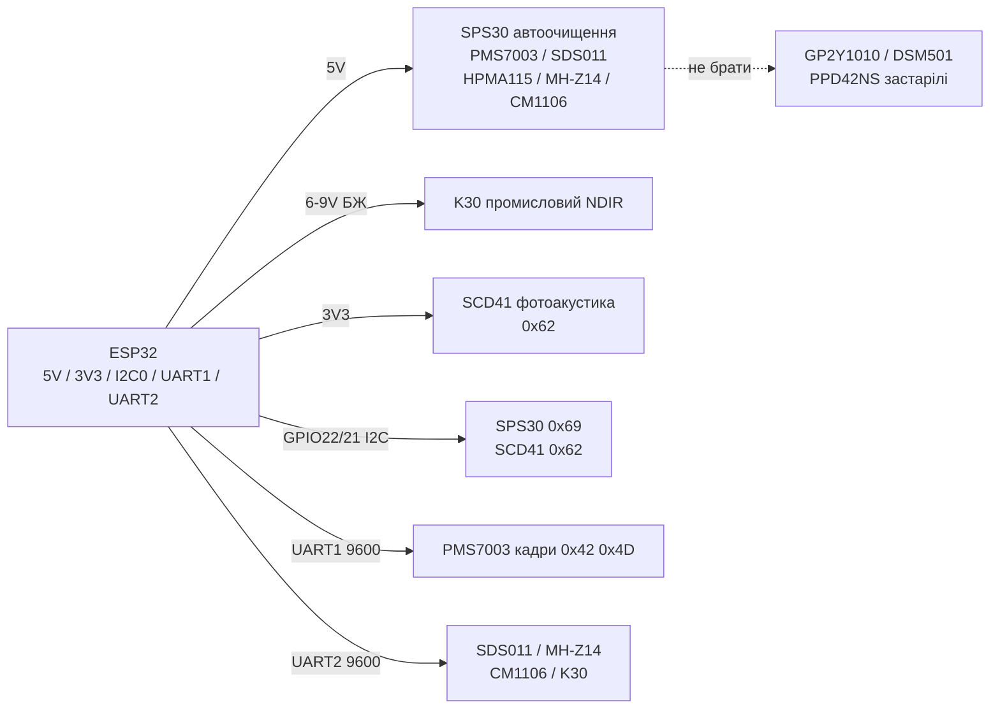

# SPS30, PMS7003, SDS011, HPMA115, OPC-N2, K30, SCD41 - пил і CO2


*Рис. 1. Пил і CO2 другого ешелону: лазерні PM по UART/I2C, промисловий NDIR CO2, фотоакустика SCD41.*

## Призначення

Розширення вузла [08-BME680-CCS811-MHZ19-PMS5003](../../../ESP32-Reference/10-Sensori/08-BME680-CCS811-MHZ19-PMS5003.md): вибір пиломіра під бюджет/точність і вибір CO2-сенсора під вентиляцію, класи та промисловість. Для вуличних станцій PM2.5, фільтрів і очищувачів, DCV-вентиляції шкіл/офісів, теплиць і інкубаторів.

Пил: SPS30 - лазер + автоочищення, еталон хобі/профі. PMS7003/5003T - лазер Plantower, 5003T з температурою. SDS011/021 - дешевий пил з вентилятором, для індикатора. HPMA115 - Honeywell, тихий вентилятор. OPC-N2 (Alphasense) - профі, рефракція + вага частинок, для науки. GP2Y1010/DSM501/PPD42NS - застарілі ІЧ/ШІМ, чому не брати. CO2: K30 (Senseair) - промисловий NDIR, еталон. T6615/T6703 (Telaire/Amphenol) - компактний NDIR/ABC. SCD41 - фотоакустика PASens, маленький і точний. CM1106 (Cubic) - бюджетний NDIR з ABC. MH-Z14/C/E - Winsen, різні діапазони 2000/5000/10000 ppm.

> Пил - це маса/кількість частинок, CO2 - газ NDIR. Дешевий ІЧ-пил (GP2Y) не бачить PM2.5 достовірно. eCO2 з VOC - не заміна NDIR для вентиляції.

## Характеристики

| Параметр | SPS30 | PMS7003 / 5003T | SDS011 / SDS021 | HPMA115S | OPC-N2 |
| --- | --- | --- | --- | --- | --- |
| Що міряє | PM1/2.5/4/10 + кількість | PM1/2.5/10 (T-версія + T/H) | PM2.5/PM10 | PM2.5 | PM1/2.5/10 + гістограма 16 бінів |
| Принцип | Лазерне розсіювання + контролер | Лазерне розсіювання | Лазер/ІЧ + вентилятор | Лазерне розсіювання | Лазер + рефракція/вага |
| Інтерфейс | I2C 0x69 + UART | UART 9600 (актив/пасив) | UART 9600 | UART 9600 + I2C | SPI + USB |
| Живлення | 4.5-5.5 В | 5 В | 5 В | 5 В | 5 В |
| Струм | ~55 мА (вентилятор) | ~100 мА | ~70 мА | ~80 мА | ~200 мА + вентилятор |
| Діапазон | 0-1000 мкг/м³ | 0-500 мкг/м³ | 0-999.9 мкг/м³ | 0-1000 мкг/м³ | 0-1500 мкг/м³ |
| Точність | ±10 % (MCERTS) | ±10 % / ±10 мкг | ±15 % (індикатор) | ±15 % | Профі, калібрування вагою |
| Особливість | Автоочищення! Ресурс 10 років | Дешевий стандарт хобі | Дешевий, шумить, дрейфує | Тихий, для дому | Наука, дорога, велика |
| Ресурс | > 10 років | Вентилятор ~3 роки | Вентилятор ~1-2 роки | ~3-5 років | Насос/вентилятор, обслуговування |

| Параметр | K30 | T6615 / T6703 | SCD41 | CM1106 | MH-Z14 / MH-Z19C / MH-Z19E |
| --- | --- | --- | --- | --- | --- |
| Що міряє | CO2 400-10000 ppm (опції до 5 %) | CO2 400-5000 ppm | CO2 400-5000 ppm + T/RH | CO2 400-5000 ppm | CO2 2000/5000/10000 ppm за моделлю |
| Принцип | NDIR, подвійний канал | NDIR, ABC | Фотоакустика PASens | NDIR, ABC | NDIR, ABC |
| Інтерфейс | UART + I2C + аналог/PWM | UART + I2C + PWM | I2C 0x62 | UART + PWM | UART + PWM (+DAC у E) |
| Живлення | 4.5-14 В | 5 В (3.3 В логіка) | 2.4-5.5 В | 5 В | 5 В (деякі 3.3 В) |
| Струм | ~40 мА середній | ~25 мА | ~15 мА | ~60 мА | ~60 мА |
| Точність | ±(30 ppm + 3 %) | ±(50 ppm + 5 %) | ±(40 ppm + 5 %) | ±(50 ppm + 5 %) | ±(50 ppm + 5 %) |
| Прогрів | 1 хв, ABC раз на тиждень | 2 хв, ABC | Авто, single-shot режим | 3 хв, ABC 24 год | 3 хв, ABC 24 год |
| Особливість | Промисловий еталон, довгий ресурс | Маленький, для HVAC | Міні 10×10 мм, buzzer-детектор | Дешевий NDIR, для дому | Діапазони літерами: C/E/14A/14B |

| Застарілі | GP2Y1010AU0F | DSM501A / PPD42NS |
| --- | --- | --- |
| Принцип | ІЧ-світлодіод + фотодіод, аналог | Нагрів-резистор, ШІМ low-pulse |
| Чому не брати | Бачить тільки крупний пил, дрейф від температури, ручна калібровка | Немає маси мкг/м³, тільки LPO %, шум, зняті з виробництва аналоги |
| Що замість | SPS30/PMS7003 | SPS30/SDS011 |

> SDS021 - вулична версія SDS011 з корпусом. PMS5003T додає T/H, але клімат у потоці вентилятора - орієнтовний.
> K30 живити 5-12 В окремо: пік лампи просаджує 3V3 ESP32. SCD41 ставити далі від ESP32 - самонагрів +5 °C.

## Легенда пінів модуля

| Пін | Тип | Куди | Примітка |
| --- | --- | --- | --- |
| VIN (SPS30/PMS/SDS/HPMA) | 5 В | 5V ESP32 | Струм 70-100 мА; конденсатор 470 мкФ поруч |
| VIN (SCD41/T6703/CM1106) | 3.3-5 В | 3V3 (SCD41) / 5V (інші) | SCD41 можна 3V3; CM1106/MH - строго 5 В |
| VIN (K30) | 4.5-14 В | Зовнішній БЖ 6-9 В | Спільний GND з ESP32; не від USB безпосередньо при довгих лініях |
| GND | Земля | GND ESP32 | Зірка; мінус зовнішнього БЖ = GND |
| SCL / SDA (SPS30/SCD41/T6703) | I2C | GPIO22 / GPIO21 | Адреси: SPS30 0x69, SCD41 0x62 - поруч без конфлікту |
| TX / RX (PMS/SDS/HPMA/K30/CM/MH) | UART 9600 | UART1/UART2 | Хрест TX→RX; один сенсор - один UART! |
| SET / SLEEP (PMS/SDS) | Керування | GPIO / 3V3 | SET=L сон; будити раз на 5-10 хв для ресурсу |
| PWM (MH/T6615/K30) | Вихід | GPIO (опційно) | Альтернатива UART: період 1004 мс (MH) |
| HD (MH-Z14) | Калібровка нуля | Кнопка/GPIO | 400 ppm на свіжому повітрі 20 хв |
| GP2Y Vo / LED | Аналог/строб | GPIO34 + GPIO25 | Не використовувати в нових проєктах |

## Схема підключення

| ESP32 | Модуль | Примітка |
| --- | --- | --- |
| 5V (VU) | SPS30, PMS7003, SDS011, HPMA115, CM1106, MH-Z14 | Вентиляторні - товстий провід, елко 470 мкФ |
| Зовнішні 6-9 В | K30 VIN | Спільний GND; конденсатор 100 мкФ |
| 3V3 | SCD41 VIN | Мінімальний шум живлення |
| GND | GND усіх | Зірка |
| GPIO22/21 | SCL/SDA SPS30 + SCD41 | I2C0, адреси 0x69/0x62 |
| GPIO18/19 (UART1) | PMS7003 TX/RX | 9600, активний або пасивний режим |
| GPIO16/17 (UART2) | SDS011 або MH-Z14 або CM1106 | Тільки один на UART! Другий - через мультиплекс у часі |
| GPIO (опційно) | SET PMS, HD MH-Z14 | Сон і калібровка нуля |

### ASCII-схема

```text
ESP32 DevKit              Пил (PM) + CO2 (NDIR/PAS)
------------              ----------------------------------
5V (VU) ────────────────► SPS30 VIN / PMS7003 VIN / SDS011 VIN
 │                        HPMA115 VIN / CM1106 VIN / MH-Z14 VIN (+470 мкФ!)
6-9В БЖ ────────────────► K30 VIN (GND спільний з ESP32!)
3V3 ────────────────────► SCD41 VIN (тиха лінія)
GND ────────────────────► GND xN (зірка!)
GPIO22 ─────────────────► SCL SPS30 + SCL SCD41 (0x69 + 0x62)
GPIO21 ─────────────────► SDA SPS30 + SDA SCD41 ([4.7 кОм] до 3V3)
GPIO18 (TX1) ───────────► PMS7003 RX
GPIO19 (RX1) ◄─────────── PMS7003 TX (9600, кадр 0x42 0x4D)
GPIO17 (TX2) ───────────► SDS011 RX / MH-Z14 RX
GPIO16 (RX2) ◄─────────── SDS011 TX / MH-Z14 TX (9600)
GPIO26 ─────────────────► PMS SET (HIGH=робота, LOW=сон)
Вхід/вихід повітря PM: НЕ закривати! Вертикально, без протягу вентилятора ESP.
```

### Mermaid




*Рис. 2. Один UART - один пиломір/CO2; I2C-пил і PAS-CO2 висять поруч; K30 - окремий БЖ.*

## Код ESP-IDF

```c
#include "driver/uart.h"
#include "driver/i2c.h"
#include "esp_log.h"

#define U_PMS UART_NUM_1
#define U_CO2 UART_NUM_2
static const char *TAG = "dust-co2";

// PMS7003: пасивний кадр 32 байти 0x42 0x4D
static bool pms_read(int *pm25, int *pm10)
{
    uint8_t b[32];
    if (uart_read_bytes(U_PMS, b, 32, pdMS_TO_TICKS(1000)) != 32) return false;
    if (b[0] != 0x42 || b[1] != 0x4D) return false;
    *pm25 = (b[12] << 8) | b[13];
    *pm10 = (b[14] << 8) | b[15];
    return true;
}

// MH-Z14/19: запит 0xFF 0x01 0x86 ... 0x79
static int mhz_read(void)
{
    uint8_t cmd[9] = {0xFF, 0x01, 0x86, 0, 0, 0, 0, 0, 0x79};
    uart_write_bytes(U_CO2, (char *)cmd, 9);
    uint8_t r[9] = {0};
    if (uart_read_bytes(U_CO2, r, 9, pdMS_TO_TICKS(500)) != 9) return -1;
    if (r[0] != 0xFF || r[1] != 0x86) return -1;
    return r[2] * 256 + r[3];
}

// SPS30: I2C 0x69 start_measurement (0x0010), read (0x0300)
// SCD41: I2C 0x62 start_periodic (0x21B1), read (0xEC05)
// K30: UART Modbus або I2C 0x68; T6703: UART 9600 ASCII
// CM1106: UART-кадри як MH-Z; SDS011: кадр 10 байт 0xAA 0xC0

void app_main(void)
{
    uart_config_t uc = {.baud_rate = 9600, .data_bits = UART_DATA_8_BITS,
        .parity = UART_PARITY_DISABLE, .stop_bits = UART_STOP_BITS_1,
        .flow_ctrl = UART_HW_FLOWCTRL_DISABLE};
    uart_param_config(U_PMS, &uc);
    uart_set_pin(U_PMS, 18, 19, -1, -1);
    uart_driver_install(U_PMS, 512, 0, 0, NULL, 0);
    uart_param_config(U_CO2, &uc);
    uart_set_pin(U_CO2, 17, 16, -1, -1);
    uart_driver_install(U_CO2, 256, 0, 0, NULL, 0);
    for (;;) {
        int pm25 = 0, pm10 = 0, co2 = 0;
        pms_read(&pm25, &pm10);
        co2 = mhz_read();
        ESP_LOGI(TAG, "PM2.5=%d PM10=%d CO2=%d", pm25, pm10, co2);
        vTaskDelay(pdMS_TO_TICKS(5000));
    }
}
```

## Код Arduino

```cpp
#include <Wire.h>
#include <SensirionI2CScd4x.h>
#include <SensirionI2CSps30.h>
#include <HardwareSerial.h>

SensirionI2CScd4x scd41;
SensirionI2CSps30 sps30;
HardwareSerial pmsSerial(1); // UART1: PMS7003
HardwareSerial co2Serial(2); // UART2: SDS011 / MH-Z14 / CM1106

void setup() {
  Serial.begin(115200);
  Wire.begin(21, 22);
  sps30.begin(Wire);
  sps30.startMeasurement(); // автоочищення за розкладом
  // sps30.startFanCleaning() — примусове очищення раз на тиждень
  scd41.begin(Wire);
  scd41.stopPeriodicMeasurement();
  scd41.startPeriodicMeasurement();
  pmsSerial.begin(9600, SERIAL_8N1, 19, 18);
  co2Serial.begin(9600, SERIAL_8N1, 16, 17);
  // K30: Serial2 9600 + ABC; T6703: I2C 0x15 або UART;
  // CM1106/MH-Z14: ті ж кадри 0xFF 0x86; SDS011: 0xAA 0xC0
}

void loop() {
  uint16_t co2; float t, h;
  if (scd41.readMeasurement(co2, t, h) == 0)
    Serial.printf("SCD41 CO2=%d T=%.1f H=%.1f\n", co2, t, h);
  float m1, m25, m4, m10, nc05, nc1, nc25, nc4, nc10, tps;
  if (sps30.readMeasurement(m1, m25, m4, m10, nc05, nc1, nc25, nc4, nc10, tps) == 0)
    Serial.printf("SPS30 PM2.5=%.1f PM10=%.1f\n", m25, m10);
  // PMS7003/SDS011/MH-Z14: парсинг кадрів як у ESP-IDF
  delay(5000);
}
```

## Код MicroPython

```python
from machine import I2C, UART, Pin
import time

i2c = I2C(0, scl=Pin(22), sda=Pin(21), freq=100000)
print("I2C:", [hex(a) for a in i2c.scan()])  # 0x69 SPS30, 0x62 SCD41

pms = UART(1, 9600, tx=18, rx=19)  # PMS7003
co2 = UART(2, 9600, tx=17, rx=16)  # SDS011 / MH-Z14 / CM1106

def read_mhz14():
    co2.write(bytes([0xFF, 0x01, 0x86, 0, 0, 0, 0, 0, 0x79]))
    time.sleep_ms(100)
    r = co2.read(9)
    if r and len(r) == 9 and r[0] == 0xFF and r[1] == 0x86:
        return r[2] * 256 + r[3]
    return None

def read_sds011():
    # SDS011 шле кадр сам: AA C0 PM25L PM25H PM10L PM10H ... AB
    if co2.any() >= 10:
        b = co2.read(10)
        if b and b[0] == 0xAA and b[1] == 0xC0:
            return ((b[3] << 8) | b[2]) / 10.0, ((b[5] << 8) | b[4]) / 10.0
    return None

# SPS30: драйвер sps30.py (start_measurement, read_measurement, fan_clean)
# SCD41: драйвер scd4x.py (start_periodic_measurement)
# K30/T6703/CM1106: UART-команди за даташитом

while True:
    print("CO2:", read_mhz14(), "SDS:", read_sds011())
    if pms.any() >= 32:
        b = pms.read(32)
        if b[0] == 0x42 and b[1] == 0x4D:
            print("PM2.5:", (b[12] << 8) | b[13])
    time.sleep(5)
```

### Winsen ZH03B - лазерний середняк

| Параметр | ZH03B |
| --- | --- |
| Що міряє | PM1.0/PM2.5/PM10, лазерне розсіювання |
| Інтерфейс | UART 9600 (активний потік + пасивний запит 0xFF 0x01 0x78…) |
| Живлення | 5 В, ~80 мА з вентилятором |
| Калібрування | Заводське; вентилятор продути раз на пів року |
| Коли брати | Дешевший за PMS7003, стабільніший за SDS011; для дому/школи |

```text
ESP32 GPIO16 (RX2) ◄── TX ZH03B (рівень 3.3V, дільник не потрібен)
ESP32 GPIO17 (TX2) ──► RX ZH03B (через дільник 1к/2к, модуль 5V!)
5V 1A ──► VCC ZH03B (окремий провід, не з 5V ESP32 при довгих шлейфах)
```

> ZH03B vs PMS7003: схожа оптика, у Winsen чесніший паспорт по дрейфу нуля; обидва бояться сигаретного диму (смола вбиває оптику безповоротно).

## Типові помилки

| № | Помилка | Симптом | Рішення |
| --- | --- | --- | --- |
| 1 | PM-сенсор у закритому корпусі | Нулі або пил «з кімнати плати» | Вікно входу/виходу назовні, вертикально, без протягу вентилятора ESP |
| 2 | Два UART-сенсори на одному UART | Кадри 0x42/0xAA/0xFF перемішуються | Один сенсор - один UART; PMS → UART1, CO2/пил → UART2 |
| 3 | SPS30 без очищення | Дрейф за пів року | Автоочищення увімкнено, примусове раз на тиждень; не дути стисненим повітрям |
| 4 | Живлення PM від 3V3 | Вентилятор не стартує, нулі | Строго 5 В, елко 470 мкФ, короткий товстий провід |
| 5 | ABC CO2 у спальні/теплиці | CO2 «повзе» до 400 | Калібрувати на вулиці 20 хв або вимкнути ABC і калібрувати кнопкою HD |
| 6 | K30 від USB ESP32 | Перезавантаження при вимірі | Окремий БЖ 6-9 В, спільний GND, конденсатор 100 мкФ |
| 7 | GP2Y/DSM501 для PM2.5 | Показання не збігаються з референсом | Замінити на SPS30/PMS7003; застарілі - тільки індикатор пилу |
| 8 | SCD41 біля ESP32 | T +5 °C, RH занижена | Винести на 5-10 см, single-shot при живленні від батареї |
| 9 | ZH03B TX безпосередньо в GPIO при 5 В логіці | Сміття в кадрах | TX модуля 3.3 В - ок; RX модуля через дільник, як у PMS7003 |

## Офіційні джерела

- [SPS30 - каталог і даташит (Sensirion)](https://sensirion.com/products/catalog/SPS30) - лазер PM, автоочищення, I2C/UART.
- [SCD41 - каталог і даташит (Sensirion)](https://sensirion.com/products/catalog/SCD41) - фотоакустика, 400-5000 ppm, single-shot.
- [Гайд PM2.5 PMS5003 з кодом (Adafruit Learn)](https://learn.adafruit.com/pm25-air-quality-sensor) - кадри 0x42 0x4D, UART-підключення.
- PMS7003/5003T, SDS011/021, HPMA115, OPC-N2, K30, T6615/T6703, CM1106, MH-Z14 - `перевірити вручну` (сайти Plantower/Nova/Honeywell/Alphasense/Senseair/Cub ic/Winsen блокують автоматичні запити).

## Див. також

- [Home](../../../ESP32-Reference/Home.md)
- [17-Gas-CO2-Precision](../../../ESP32-Reference/10-Sensori/17-Gas-CO2-Precision.md)
- [08-BME680-CCS811-MHZ19-PMS5003](../../../ESP32-Reference/10-Sensori/08-BME680-CCS811-MHZ19-PMS5003.md)
- [22-Gas-2-VOC-Industrial](../../../ESP32-Reference/10-Sensori/22-Gas-2-VOC-Industrial.md)
- [23-Dust-CO2-2](../../../ESP32-Reference/10-Sensori/23-Dust-CO2-2.md)
- [24-Pressure-Level-Flow](../../../ESP32-Reference/10-Sensori/24-Pressure-Level-Flow.md)
- [ADC](../../../ESP32-Reference/06-Analog/01-ADC.md)
- [I2C](../../../ESP32-Reference/04-Shini/03-I2C.md)
- [UART](../../../ESP32-Reference/04-Shini/01-UART.md)
