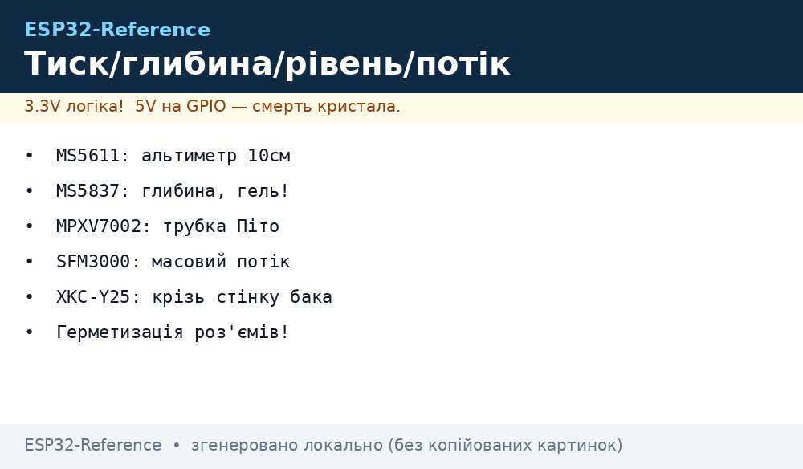
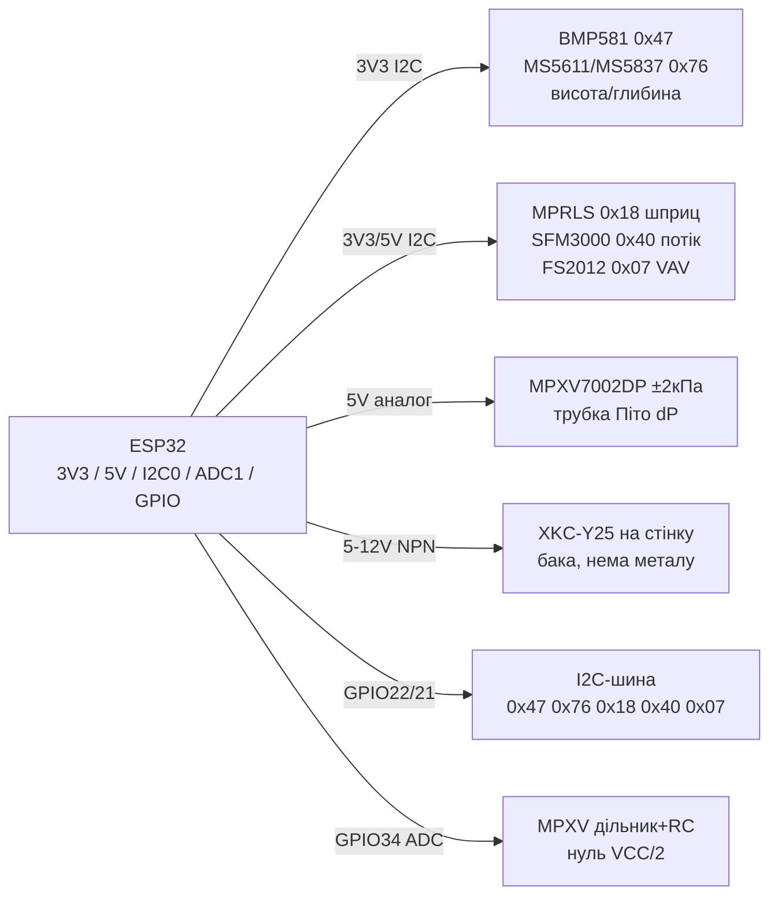

# BMP581, MS5611, MS5837, MPRLS, MPXV7002DP, FS2012/SFM3000, XKC-Y25 - тиск, рівень, потік


*Рис. 1. Тиск, рівень і потік на ESP32: барометри I2C/SPI, шприц-манометри, трубка Піто, масовий потік і безконтактний рівень.*

## Призначення

Альтиметрія, глибина, манометри, анемометрія і контроль рівня рідини: від трекера висоти дрона до датчика глибини батискафа, від трубки Піто до безконтактного рівня бака. Для вариометрів, метеостанцій, дайв-компʼютерів, пневматики, вентиляції (VAV), поливу і септиків.

BMP581 - новий еталон барометра Bosch (±6 Па відносно, ~0.5 м). MS5611 - класика альтиметрів (10 см роздільна). MS5837-30BA - глибина 30 бар з гелем, для води. MPRLS/MPRV - «I2C-шприц»: штуцер + 24-біт АЦП, для манометрів. MPXV7002DP - диференційний ±2 кПа, трубка Піто для швидкості повітря. FS2012/SFM3000 - масовий потік (MEMS-калориметр), для VAV і ШВЛ-макетів. XKC-Y25 - безконтактний рівень: клеїться на стінку бака, вихід NPN.

> Барометр міряє абсолютний тиск (висота), MPRLS - абсолютний/надлишковий у трубці, MPXV7002DP - різницю двох штуцерів, потік - масу повітря, XKC-Y25 - факт наявності рідини за стінкою.

## Характеристики

| Параметр | BMP581 | MS5611 | MS5837-30BA | MPRLS (0-25 PSI) | MPXV7002DP |
| --- | --- | --- | --- | --- | --- |
| Що міряє | Тиск 300-1250 гПа + T | Тиск 10-1200 мбар + T | Тиск 0-30 бар + T (вода!) | Тиск 0-25 PSI (штуцер) | Диференційний ±2 кПа |
| Принцип | Пʼєзорезистивний MEMS | Пʼєзорезистивний + 24-біт | Пʼєзорезистивний, гель | Пʼєзорезистивний + 24-біт АЦП | Кремнієва мембрана, аналог |
| Інтерфейс | I2C (до 1 МГц) + I3C + SPI | I2C/SPI 0x76/0x77 | I2C 0x76 | I2C 0x18 | Аналог 0.5-4.5 В |
| Живлення | 1.65-3.6 В | 1.8-3.6 В | 3.3 В | 3.3-5 В (модуль) | 5 В (4.75-5.25 В) |
| Струм | 1.3 мкА @1 Гц | 1 мкА сон | 0.6 мкА сон | ~3 мА | ~10 мА |
| Точність | ±30 Па абс., ±6 Па відн. | ±1.5 мбар, 10 см висоти | ±50 мбар (глибина ~0.5 м) | ±0.25 % FSS | ±2.5 % (після нуля) |
| Шум | 0.08 Па | 0.1 мбар RMS | 0.2 мбар RMS | 24-біт, калібрований | RC-фільтр обовʼязковий |
| Особливість | FIFO, 480 Гц, для дронів | Еталон хобі-альтиметрів | Гель + кільце O-ring, IP68-вузол | Шприц-трубка 3/32", силікон-гель | Трубка Піто: dP = ½ρv² |

| Параметр | FS2012 (MEMS-потік) | SFM3000 / SFM3019 | XKC-Y25 (рівень) |
| --- | --- | --- | --- |
| Що міряє | Масовий потік 0-... SLM (моделі) | Масовий потік ±200 SLM / 0-240 SLM | Наявність рідини за стінкою (так/ні) |
| Принцип | Калориметричний MEMS-нагрів | Калориметричний CMOSens | Ємнісний, через пластик/скло |
| Інтерфейс | I2C 0x07 (деякі аналог) | I2C 0x40 | NPN-вихід (цифра!) |
| Живлення | 5 В | 3.3-5 В | 5-12 В |
| Струм | ~30 мА | ~4 мА | ~10 мА |
| Точність | ±3-5 % | ±2 % | Поріг, чутливість гвинтом |
| Особливість | Для VAV-фільтрів, макетів ШВЛ | Медичний конус 22 мм, 2 кГц | НЕ для металу! Стінка ≤ 20 мм, безконтактно |

> MS5837 буває 02BA (2 бар, снорклінг) і 30BA (30 бар, дайвінг): для глибини брати саме 30BA з гелем.
> MPXV7002DP при нулі потоку дає ~2.5 В (VCC/2): швидкість v = sqrt(2·dP/ρ). Калібрувати нуль у штиль кожен старт.
> XKC-Y25 не бачить через метал і товстий бак з повітряним зазором: тільки пластик/скло впритул, чутливість - жовтим гвинтом.

## Легенда пінів модуля

| Пін | Тип | Куди | Примітка |
| --- | --- | --- | --- |
| VIN (BMP581/MS5611/MS5837) | 3.3 В | 3V3 ESP32 | Голий чип - без 5 В! Модулі GY-63/86 мають LDO |
| VIN (MPRLS-модуль) | 3-5 В | 3V3/5V | На платі стабілізатор + зсув рівнів |
| VCC (MPXV7002DP) | 5 В | 5V | Аналог ratiometric: опора ADC = VCC! |
| VCC (FS2012/SFM3000) | 3.3-5 В | 3V3/5V за версією | SFM3000 - 5 В типово, логіка 3.3 В толерантна |
| VCC (XKC-Y25, коричневий) | 5-12 В | Зовнішні 5-12 В | Спільний GND з ESP32 |
| GND | Земля | GND ESP32 | Зірка; аналог MPXV окремим дротом |
| SCL / SDA | I2C | GPIO22 / GPIO21 | Адреси: BMP 0x47/0x46!, MS 0x76/0x77, MPRLS 0x18, FS2012 0x07, SFM 0x40 |
| SDO/CSB (BMP/MS) | Адреса/SPI | GND/3V3 | BMP581: 0x47 за замовчуванням (не 0x76!); CSB HIGH в I2C |
| Vout (MPXV7002DP) | Аналог | GPIO34 (ADC1) | Дільник не потрібен (0.5-4.5 В → поділити до 3.3 В!), RC 1 кОм+100 нФ |
| OUT (XKC-Y25, жовтий) | NPN цифра | GPIO25 + pull-up | NPN до GND: pull-up 10 кОм до 3V3, інверсія в коді |
| EOC/RST (MPRLS) | Статус/скидання | GPIO (опційно) | Можна -1, опитувати статусом |

## Схема підключення

| ESP32 | Модуль | Примітка |
| --- | --- | --- |
| 3V3 | BMP581, MS5611/MS5837, MPRLS VIN | Тихі барометри окремо від вентилятора |
| 5V | MPXV7002DP, SFM3000, FS2012, XKC-Y25 (+) | Аналог MPXV - від стабільного 5 В |
| GND | GND усіх | Аналогова земля MPXV окремим дротом до GND |
| GPIO22/21 | SCL/SDA усіх I2C-манометрів | Адреси різні: 0x47/0x76/0x18/0x40/0x07 |
| GPIO34 | MPXV7002DP Vout через дільник | Дільник 2:1 (10 к/10 к) + RC-фільтр |
| GPIO25 | XKC-Y25 OUT (NPN) | Pull-up 10 кОм до 3V3 |
| Трубки | MPRLS - один штуцер; MPXV - два (P1/P2 Піто) | Герметик, хомути; без перегинів |

### ASCII-схема

```text
ESP32 DevKit              Тиск / Рівень / Потік
------------              ----------------------------------
3V3 ────────────────────► BMP581 VIN / MS5611 VIN / MS5837 VIN / MPRLS VIN
5V ─────────────────────► MPXV7002DP VCC / SFM3000 VCC / FS2012 VCC / XKC-Y25 (+)
GND ────────────────────► GND xN (зірка; аналог MPXV окремим проводом!)
GPIO22 ─────────────────► SCL x5 (0x47 BMP581! + 0x76 MS + 0x18 MPRLS + 0x40 SFM)
GPIO21 ─────────────────► SDA x5 (паралельно, [4.7 кОм] до 3V3)
GPIO34 ◄───────────────── MPXV Vout --[10к/10к]--+--[1к+100нФ]-- (0.5-4.5В!)
GPIO25 ◄───────────────── XKC-Y25 OUT (NPN) --[10к]-- 3V3 (pull-up)
Трубки: MPRLS [штуцер]~~~ бак/шприц; MPXV P1/P2 ~~~ трубка Піто;
        SFM3000 [конус 22мм]~~~ повітропровід; XKC-Y25 || стінка бака
```

### Mermaid




*Рис. 2. Аналог MPXV - тільки через дільник; XKC-Y25 - NPN з pull-up; барометри - далі від нагріву ESP32.*

## Код ESP-IDF

```c
#include "driver/i2c.h"
#include "driver/adc.h"
#include "esp_log.h"

#define I2C_PORT I2C_NUM_0
static const char *TAG = "press-flow";

// BMP581: адреса 0x47! (не 0x76 як BMP280/390)
// MS5611/MS5837: 0x76/0x77, PROM-читання + компенсація
// MPRLS: 0x18, тригер 0xAA 0x00 0x00, читання 4 байти статус+24 біт
static esp_err_t mprls_read(float *psi)
{
    uint8_t trig[3] = {0xAA, 0x00, 0x00};
    i2c_cmd_handle_t h = i2c_cmd_link_create();
    i2c_master_start(h);
    i2c_master_write_byte(h, (0x18 << 1) | I2C_MASTER_WRITE, true);
    i2c_master_write(h, trig, 3, true);
    i2c_master_stop(h);
    esp_err_t e = i2c_master_cmd_begin(I2C_PORT, h, pdMS_TO_TICKS(100));
    i2c_cmd_link_delete(h);
    if (e != ESP_OK) return e;
    vTaskDelay(pdMS_TO_TICKS(10)); // конверсія
    uint8_t d[4] = {0};
    h = i2c_cmd_link_create();
    i2c_master_start(h);
    i2c_master_write_byte(h, (0x18 << 1) | I2C_MASTER_READ, true);
    i2c_master_read(h, d, 4, I2C_MASTER_LAST_NACK);
    i2c_master_stop(h);
    e = i2c_master_cmd_begin(I2C_PORT, h, pdMS_TO_TICKS(100));
    i2c_cmd_link_delete(h);
    if (e == ESP_OK) {
        uint32_t raw = ((d[1] << 16) | (d[2] << 8) | d[3]);
        *psi = (raw / 16777215.0f) * 25.0f; // 0–25 PSI
    }
    return e;
}

// MPXV7002DP: Vout 0.5–4.5 В через дільник 1/2 → ADC; dP = (V-2.5)/2 В*2кПа
// SFM3000: 0x40, читання 2 байти потоку + CRC; FS2012: 0x07 аналогічно
// XKC-Y25: gpio_get_level (NPN: 0 = рідина є!)

void app_main(void)
{
    // i2c init: GPIO21/22, 100 кГц (BMP581 до 1 МГц)
    // adc1: GPIO34, atten 11дБ, усереднення 64
    float psi = 0;
    if (mprls_read(&psi) == ESP_OK)
        ESP_LOGI(TAG, "MPRLS=%.2f PSI", psi);
}
```

## Код Arduino

```cpp
#include <Wire.h>
#include <Adafruit_MPRLS.h>
#include <Adafruit_BMP5xx.h>

Adafruit_MPRLS mprls(-1, -1); // без RST/EOC, адреса 0x18
Adafruit_BMP5xx bmp581;

const int MPXV_PIN = 34;   // через дільник 10к/10к!
const int XKC_PIN = 25;    // NPN, pull-up
float dpZero = 2.5;        // калібрувати в штиль

void setup() {
  Serial.begin(115200);
  Wire.begin(21, 22);
  mprls.begin();            // MPRLS 0–25 PSI
  bmp581.begin(0x47);       // BMP581! не 0x76
  bmp581.setPressOversampling(BMP5_OVERSAMPLING_32X);
  pinMode(XKC_PIN, INPUT_PULLUP); // NPN XKC-Y25
  // MS5611: бібліотека MS5611 ( compensated P/T, адреса 0x76/0x77 )
  // MS5837: бібліотека BlueRobotics MS5837 (модель 30BA, fluidDensity!)
  // SFM3000: бібліотека Sensirion SFM3000 (0x40, CRC)
  // FS2012: читання 0x07 або аналог
  // Нуль Піто:
  long s = 0;
  for (int i = 0; i < 64; i++) { s += analogRead(MPXV_PIN); delay(5); }
  dpZero = (s / 64.0) / 4095.0 * 3.3 * 2.0; // назад через дільник
  Serial.printf("Pitot zero=%.2f V\n", dpZero);
}

void loop() {
  Serial.printf("MPRLS=%.2f hPa BMP581=%.1f hPa\n",
    mprls.readPressure(), bmp581.readPressure() / 100.0);
  long s = 0;
  for (int i = 0; i < 32; i++) { s += analogRead(MPXV_PIN); delay(2); }
  float v = (s / 32.0) / 4095.0 * 3.3 * 2.0;   // вольти на сенсорі
  float dp = (v - dpZero) / 2.0 * 2000.0;       // Па (±2 кПа)
  float vel = dp > 0 ? sqrt(2 * dp / 1.225) : 0; // м/с, rho=1.225
  Serial.printf("Pitot dP=%.0f Pa v=%.1f m/s XKC=%d\n",
    dp, vel, !digitalRead(XKC_PIN)); // NPN інверсія
  delay(1000);
}
```

## Код MicroPython

```python
from machine import I2C, ADC, Pin
import time, math

i2c = I2C(0, scl=Pin(22), sda=Pin(21), freq=100000)
print("I2C:", [hex(a) for a in i2c.scan()])
# 0x47 BMP581! 0x76 MS5611/MS5837 0x18 MPRLS 0x40 SFM3000 0x07 FS2012

mpxv = ADC(Pin(34))
mpxv.atten(ADC.ATTN_11DB)
mpxv.width(ADC.WIDTH_12BIT)
xkc = Pin(25, Pin.IN, Pin.PULL_UP)  # NPN: 0 = рідина є

# Нуль Піто в штиль:
z = sum(mpxv.read() for _ in range(64)) / 64 / 4095 * 3.3 * 2.0
print("Pitot zero=%.2f V" % z)

def pitot_ms(n=32):
    s = sum(mpxv.read() for _ in range(n)) / n / 4095 * 3.3 * 2.0
    dp = (s - z) / 2.0 * 2000.0  # Па
    return math.sqrt(2 * max(dp, 0) / 1.225), dp

# BMP581: драйвер bmp5xx.py (addr 0x47, oversampling)
# MS5611/MS5837: драйвери ms5611.py / ms5837.py (PROM + CRC4!)
# MPRLS: i2c.writeto(0x18, b'\xAA\x00\x00'), читання 4 байти
# SFM3000: i2c.readfrom(0x40, 3) — 2 байти + CRC

while True:
    v, dp = pitot_ms()
    print("v=%.1f m/s dP=%.0f Pa level=%s" % (v, dp, "ВОДА" if xkc.value() == 0 else "порожньо"))
    time.sleep(1)
```

### MPXV5010 - диференційний тиск ±10 кПа

| Параметр | MPXV5010DP/GP |
| --- | --- |
| Діапазон | 0…10 кПа диференційних (DP) або відносних (GP) |
| Вихід | Аналог 0.2…4.7 В при живленні 5 В (ratiometric!) |
| Живлення | 4.75-5.25 В, ~7 мА |
| Застосування | Швидкість потоку (трубка Піто), фільтри вентиляції, рівень через барботаж |

```text
5V ──► Vs MPXV5010 ──► Vout (0.2…4.7V) ──[дільник 10к/20к]──► GPIO34 ESP32 (0.13…3.1V)
GND ──► GND (спільна, товстий провід; сенсор ratiometric — шуми живлення = шуми показів!)
```

> Ratiometric-пастка: вихід пропорційний живленню, тож пульсації 5V лінійно лізуть у вимір. Живити від окремого LDO 5V + LC-фільтр, а не від USB-хаба.

## Типові помилки

| № | Помилка | Симптом | Рішення |
| --- | --- | --- | --- |
| 1 | BMP581 шукають на 0x76 | Скан порожній | Адреса BMP581 - 0x47 (SDO розводить 0x46/0x47), не 0x76 як BMP280! |
| 2 | MPXV безпосередньо в 3V3-ADC | Обмеження 3.3 В, перегрів входу | Дільник 10к/10к + RC 1к+100нФ; опора = VCC 5 В, калібрувати нуль |
| 3 | MS5837 без гелю/герметики | Вода в корпусі, корозія | Тільки версія з гелем + O-ring, отвір до води, електроніка суха |
| 4 | Барометр біля ESP32/нагріву | Висота «пливе» ±5 м | Винести, отвір до повітря (не герметичний корпус!), фільтр від вітру |
| 5 | MS5611/MS5837 без CRC PROM | Сміттєвий тиск після вологи | Перевіряти CRC4 PROM при старті, перечитати при помилці |
| 6 | SFM/FS переплутаний напрям | Відʼємний потік | Стрілка на корпусі за потоком; інверсія в коді якщо навпаки |
| 7 | XKC-Y25 на металі/з зазором | Завжди «порожньо» або завжди «вода» | Тільки пластик/скло впритул ≤20 мм, крутити гвинт чутливості |
| 8 | Трубки Піто з перегином | dP шумить, швидкість стрибає | Короткі жорсткі трубки, конденсатовідвідник, нуль у штиль кожен старт |
| 9 | MPXV5010 від USB-хаба без фільтра | Пульсації живлення в показах (ratiometric!) | Окремий LDO 5 В + LC-фільтр, товста спільна земля |

## Офіційні джерела

- [BMP581 - сторінка продукту (Bosch Sensortec)](https://www.bosch-sensortec.com/products/environmental-sensors/pressure-sensors/bmp581/) - ±6 Па, I2C/I3C/SPI, 480 Гц.
- [SFM3019 - каталог і даташит (Sensirion)](https://sensirion.com/products/catalog/SFM3019) - масовий потік, платформа SFM3xxx (аналог SFM3000).
- [Гайд MPRLS з кодом (Adafruit Learn)](https://learn.adafruit.com/adafruit-mprls-ported-pressure-sensor-breakout/overview) - I2C-шприц 0x18, трубка, бібліотеки.
- MS5611/MS5837, MPXV7002DP, FS2012, XKC-Y25 - `перевірити вручну` (сайти TE Connectivity/NXP/IDT/DFRobot блокують автоматичні запити).

## Див. також

- [Home](../../../ESP32-Reference/Home.md)
- [17-Gas-CO2-Precision](../../../ESP32-Reference/10-Sensori/17-Gas-CO2-Precision.md)
- [08-BME680-CCS811-MHZ19-PMS5003](../../../ESP32-Reference/10-Sensori/08-BME680-CCS811-MHZ19-PMS5003.md)
- [22-Gas-2-VOC-Industrial](../../../ESP32-Reference/10-Sensori/22-Gas-2-VOC-Industrial.md)
- [23-Dust-CO2-2](../../../ESP32-Reference/10-Sensori/23-Dust-CO2-2.md)
- [24-Pressure-Level-Flow](../../../ESP32-Reference/10-Sensori/24-Pressure-Level-Flow.md)
- [ADC](../../../ESP32-Reference/06-Analog/01-ADC.md)
- [I2C](../../../ESP32-Reference/04-Shini/03-I2C.md)
- [UART](../../../ESP32-Reference/04-Shini/01-UART.md)
