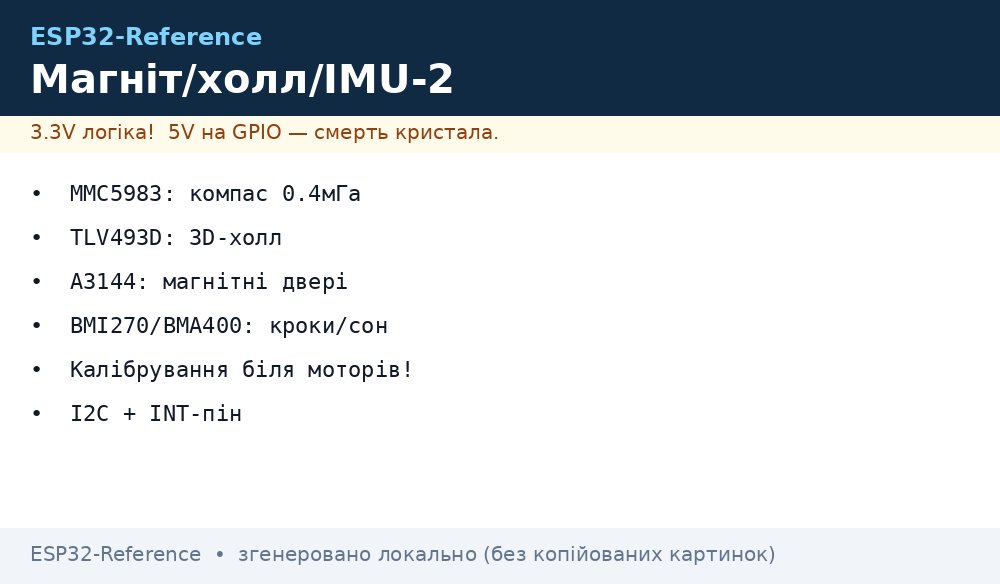
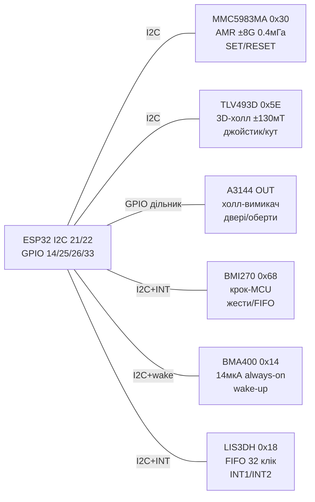

# MMC5983MA / TLV493D / A3144 / BMI270 / BMA400 / LIS3DH - магнітометрія та always-on рух


*Рис. 1. Магнітний + IMU вузол на одній шині I2C ESP32: точний компас MMC5983MA, 3D-холл TLV493D, холл-вимикач A3144, кроковий BMI270, always-on BMA400 та бюджетний LIS3DH.*

## Призначення

Другий магнітно-інерціальний вузол довідника - доповнення до [16-HMC5883-BNO055-RFID-RC522-Barcode](../../../ESP32-Reference/10-Sensori/16-HMC5883-BNO055-RFID-RC522-Barcode.md). Тут зібрані сучасні заміни старих HMC5883/MPU6050: MMC5983MA - AMR-компас з шумом 0.4 мГа і точністю азимута ~0.5°, TLV493D - справжній 3D-холл (±130 мТ, джойстики/енкодери/антитампер), A3144 - дешевий холл-вимикач для дверей/лічильників обертів, BMI270 - 6-осьовий IMU з кроковим MCU на кристалі (жести, активності, FIFO), BMA400 - ultra-low-power акселерометр 14 мкА з always-on детекцією (крок/тап/орієнтація без хоста!), LIS3DH - дешевий акселерометр з FIFO, кліком і перериваннями. Усе - 3.3V, I2C/SPI, сумісне з ESP32/S3/C3.

> Навіщо шість сенсорів в одній ноті: компас дає азимут, 3D-холл - положення магніту поруч, холл-вимикач - факт «двері відчинено», IMU - рух/кроки/орієнтацію. Типовий трекер/робот/розумний замок використовує 2-3 з них одночасно на одній шині [I2C](../../../ESP32-Reference/04-Shini/03-I2C.md).

## Характеристики

| Параметр | MMC5983MA (компас) | TLV493D-A1B6 (3D-холл!) | A3144 (холл-вимикач) |
| --- | --- | --- | --- |
| Принцип | AMR 3 осі, ±8 Гаус | Холл 3 осі Bx/By/Bz, ±130 мТ | Уніполярний вимикач, цифра |
| Роздільність / шум | 18 біт, шум 0.4 мГа RMS | 12 біт, ~98 мкТ/LSB | Поріг Bop ~35 Гс, Brp ~25 Гс |
| Точність азимута | ~0.5° (після калібрування, поза металом) | Не компас! Для близьких магнітів (джойстик/кут) | Немає - лише ON/OFF |
| Інтерфейс / адреса | I2C 0x30 + SPI до 10 МГц | I2C 0x5E (фікс!), до 1 Мбіт | Цифровий OUT (open-collector) |
| Швидкість | До 1000 Гц | До ~3.3 кГц (fast), типово 100 Гц | Кілогерци (реакція ~мкс) |
| SET/RESET | Вбудований degauss (знімає намагнічення!) | Не потрібен | Не потрібен |
| Живлення | 2.8-3.6 В, ~1 мА | 2.7-3.5 В, 10 мкА (ULP) / 100 мкА | 4.5-24 В (модуль KY-003 з 5 В!) |
| Ціна / модуль | ~$5-7 (SparkFun Qwiic) | ~$4 (Adafruit 4366) | ~$0.5 (KY-003/KY-024) |

| Параметр | BMI270 (крок-MCU) | BMA400 (always-on! 14 мкА) | LIS3DH (дешевий, FIFO+клік) |
| --- | --- | --- | --- |
| Сенсори | Accel 16 біт + Gyro 16 біт | Accel 12 біт, 3 осі | Accel 10/12 біт, 3 осі + 3 ADC |
| Діапазони | Acc ±2/4/8/16 g; Gyro ±125…2000 dps | ±2/4/8/16 g | ±2/4/8/16 g |
| Інтерфейс / адреса | I2C 0x68/0x69 (SDO) + SPI | I2C 0x14/0x15 + SPI | I2C 0x18/0x19 (SDO) + SPI |
| ODR | Acc 12.5 Гц-1.6 кГц; Gyro 25 Гц-6.4 кГц | 12.5-800 Гц | 1 Гц-5 кГц |
| Споживання | ~685 мкА повний ODR | 14.5 мкА max-perf; 3.5 мкА low-power; 800 нА auto-wake! | ~2 мкА (LP) … 11 мкА |
| Фішки на кристалі | Крокомір (wrist!), жести, активності, 6 кБ FIFO | Крокомір <4 мкА, активності, тап/подвійний тап, орієнтація, 1 кБ FIFO | FIFO 32 семпли, клік/подвійний клік, free-fall, orientation, INT1/INT2 |
| Живлення | 1.7-3.6 В (VDDIO 1.2-3.6 В) | 1.72-3.6 В | 1.71-3.6 В |
| Корпус | LGA 2.5×3.0×0.8 мм | LGA 2×2×0.95 мм | LGA 3×3×1 мм |

> [!warning] Рівні живлення!
> Усі шість кристалів - 3.3V. Модуль A3144 (KY-003) часто живлять від 5 В - його OUT тоді 5 В! Обов'язково дільник або транзистор перед GPIO ESP32 (див. [Рівні](../../../ESP32-Reference/03-GPIO/03-Pidtyaguvannya-rivni.md)). Решта модулів (GY, Qwiic, STEMMA) - на 3V3.

## Легенда пінів модуля

| MMC5983MA (Qwiic) | Призначення | Куди на ESP32 |
| --- | --- | --- |
| 3V3 / GND | 3.3 В (не 5 В!) | 3V3 / GND |
| SDA / SCL | I2C 0x30 | GPIO21 / GPIO22 ([I2C](../../../ESP32-Reference/04-Shini/03-I2C.md)) |
| CS / SDO | SPI CS / вибір адреси | GPIO5 (якщо SPI) |
| INT | Дані готові (опційно) | GPIO33 |

| TLV493D (Adafruit 4366) | Призначення | Куди |
| --- | --- | --- |
| VIN / GND | 3.3-5 В (є стабілізатор + level-shift!) | 3V3 / GND |
| SDA / SCL | I2C 0x5E фікс! | GPIO21 / GPIO22 |
| 3V3-out | Вихід 3.3 В для своїх потреб | Не вантажити >100 мА |

| A3144 (KY-003) | Призначення | Куди |
| --- | --- | --- |
| VCC / GND | 5 В (на модулі) | 5V / GND |
| OUT (S) | LOW при південному полюсі поруч | GPIO (через дільник!) + pull-up 10 кОм до 3.3 В |
| LED | Індикація спрацювання | - |

| BMI270 (GY-BMI270) | Призначення | Куди |
| --- | --- | --- |
| VCC / GND | 3.3 В | 3V3 / GND |
| SDA/SDI / SCL/SCK | I2C 0x68 (SDO=GND) / 0x69 (SDO=VCC) або SPI | GPIO21 / GPIO22 або GPIO23/18/19 |
| SDO/SAO | Вибір адреси | GND → 0x68, VCC → 0x69 |
| INT1 / INT2 | Крок/any-motion/tap | GPIO25 / GPIO26 |

| BMA400 (Adafruit 4416) | Призначення | Куди |
| --- | --- | --- |
| VIN / GND | 3.3-5 В (LDO) | 3V3 / GND |
| SDA / SCL | I2C 0x14/0x15 | GPIO21 / GPIO22 |
| INT1 / INT2 | Wake-up: крок/тап/активність | GPIO (напр. RTC-GPIO для сну!) |
| SDO | Адреса | GND → 0x14 |

| LIS3DH (Adafruit 2809) | Призначення | Куди |
| --- | --- | --- |
| VIN / GND | 3.3-5 В (LDO + shift) | 3V3 / GND |
| SDA / SCL або MOSI/SCK | I2C 0x18 (SDO=GND) / 0x19 | GPIO21 / GPIO22 |
| INT1 / INT2 | Клік/орієнтація/free-fall | GPIO32 / GPIO33 |
| ADC1-3 | Додаткові аналогові входи (через I2C!) | Датчики 0-VCC |

## Схема підключення

| ESP32 DevKit | MMC5983MA | TLV493D | A3144 | BMI270 | BMA400 | LIS3DH | Примітка |
| --- | --- | --- | --- | --- | --- | --- | --- |
| 3V3 | VCC | VIN | - | VCC | VIN | VIN | Одна шина 3.3 В |
| 5V | - | - | VCC | - | - | - | Тільки холл-вимикач! |
| GND | GND | GND | GND | GND | GND | GND | Зірка |
| GPIO21 | SDA | SDA | - | SDA | SDA | SDA | I2C шина, pull-up 4.7 кОм |
| GPIO22 | SCL | SCL | - | SCL | SCL | SCL | I2C шина |
| GPIO14 | - | - | OUT (дільник!) | - | - | - | Магніт-детектор дверей |
| GPIO25 | - | - | - | INT1 | - | - | Кроки BMI270 |
| GPIO26 | - | - | - | - | INT1 | - | Wake-up BMA400 |
| GPIO33 | INT | - | - | - | - | INT1 | DRDY/клік |

### ASCII-схема

```text
              ESP32-DevKitC
            +-------------------+
 3V3 -------+ 3V3         GPIO21|--- SDA (MMC 0x30 + TLV 0x5E + BMI 0x68 + BMA 0x14 + LIS 0x18)
 GND -------+ GND         GPIO22|--- SCL (усі, pull-up 4k7 до 3V3)
 5V  -------+ 5V          GPIO14|---< дільник 10k/20k >--- OUT (A3144 KY-003!)
            |            GPIO25 |--- INT1 (BMI270 кроки)
            |            GPIO26 |--- INT1 (BMA400 wake-up -> RTC-GPIO!)
            |            GPIO33 |--- INT (MMC DRDY) / INT1 (LIS3DH клік)
            |             GPIO5 |--- CS (якщо MMC/BMI по SPI)
            +-------------------+
 MMC5983MA подалі від моторів/струмів (>10 см), вісь X — вперед.
 TLV493D — НЕ компас: магніт має бути за 2–20 мм від чипа.
 A3144 реагує лише на південний полюс (S)! Переверни магніт, якщо мовчить.
```

### Mermaid



## Код ESP-IDF

```c
#include "driver/i2c.h"
#include "driver/gpio.h"
#include "esp_log.h"
#include <math.h>
#define I2C_P I2C_NUM_0
static const char *TAG = "magimu2";

// MMC5983MA 0x30: безперервний режим 100 Гц + SET/RESET
static void mmc_init(void) {
    uint8_t c0[] = {0x09, 0x08}; // CTRL0: auto SET/RESET + 100 Гц
    uint8_t c1[] = {0x0A, 0x80}; // CTRL1: BW + безперервний
    i2c_master_write_to_device(I2C_P, 0x30, c0, 2, 100);
    i2c_master_write_to_device(I2C_P, 0x30, c1, 2, 100);
}
// TLV493D 0x5E: читання Bx/By/Bz (10 байт, старші біти в статусі)
static void tlv_read(int16_t *x, int16_t *y, int16_t *z) {
    uint8_t d[10];
    i2c_master_read_from_device(I2C_P, 0x5E, d, 10, 100);
    *x = ((d[0] << 4) | (d[4] & 0x0F)) - 2048;
    *y = ((d[1] << 4) | ((d[4] >> 4) & 0x0F)) - 2048;
    *z = ((d[2] << 4) | (d[5] & 0x0F)) - 2048;
}
// BMI270 0x68: увімкнення accel+gyro, крокомір
static void bmi_init(void) {
    uint8_t pwr[] = {0x7D, 0x0E}; // PWR_CTRL: acc+gyro on
    uint8_t feat[] = {0x50, 0x01}; // крокомір enable (спрощено)
    i2c_master_write_to_device(I2C_P, 0x68, pwr, 2, 100);
    i2c_master_write_to_device(I2C_P, 0x68, feat, 2, 100);
}
// BMA400 0x14: always-on крок + wake INT1
static void bma_init(void) {
    uint8_t cfg[] = {0x1A, 0x02}; // ACC_CONFIG + step-counter enable
    i2c_master_write_to_device(I2C_P, 0x14, cfg, 2, 100);
}

void app_main(void) {
    i2c_config_t c = {.mode=I2C_MODE_MASTER,.sda_io_num=21,.scl_io_num=22,
        .sda_pullup_en=1,.scl_pullup_en=1,.master.clk_speed=400000};
    i2c_param_config(I2C_P,&c); i2c_driver_install(I2C_P,c.mode,0,0,0);
    gpio_set_direction(14, GPIO_MODE_INPUT); // A3144 через дільник
    mmc_init(); bmi_init(); bma_init();
    for (;;) {
        uint8_t r = 0x00; uint8_t d[6];
        i2c_master_write_read_device(I2C_P, 0x30, &r, 1, d, 6, 100);
        int32_t mx = (d[0]<<12)|(d[1]<<4)|(d[4]>>4);
        int32_t my = (d[2]<<12)|(d[3]<<4)|(d[5]>>4);
        float head = atan2f((float)my, (float)mx) * 180 / M_PI;
        if (head < 0) head += 360;
        int16_t tx, ty, tz; tlv_read(&tx, &ty, &tz);
        ESP_LOGI(TAG, "head=%.1f TLV=%d,%d,%d door=%d",
            head, tx, ty, tz, gpio_get_level(14));
        vTaskDelay(pdMS_TO_TICKS(200));
    }
}
```

## Код Arduino

```cpp
#include <Wire.h>
#include <Adafruit_TLV493D.h>
#include <Adafruit_LIS3DH.h>
#include <SparkFun_MMC5983MA_Arduino_Library.h>

Adafruit_TLV493D tlv;
Adafruit_LIS3DH lis;
SFE_MMC5983MA mmc;
#define HALL_SW 14
#define BMI_INT 25
#define BMA_INT 26

void setup() {
  Serial.begin(115200);
  Wire.begin(21, 22);
  pinMode(HALL_SW, INPUT); // вже через дільник 5V->3.3V!
  pinMode(BMI_INT, INPUT);
  pinMode(BMA_INT, INPUT);

  if (!mmc.begin()) Serial.println("MMC5983MA не знайдено (0x30?)");
  mmc.softReset();
  mmc.enableContinuousMode();

  if (!tlv.begin()) Serial.println("TLV493D не знайдено (0x5E!)");
  // TLV493D — не компас: магніт тримай за 2-20 мм!

  lis.begin(0x18);
  lis.setRange(LIS3DH_RANGE_4_G);
  lis.setDataRate(LIS3DH_DATARATE_100_HZ);
  lis.setClick(1, 40); // одноклік, поріг

  // BMI270: бібліотека Bosch / SparkFun BMI270 (адреса 0x68)
  // bmi.begin(0x68); bmi.enableStepCounter(); bmi.mapInterrupt(BMI_INT);
  // BMA400: bma.begin(0x14); bma.enableStepCounter(); bma.enableWakeup(BMA_INT);
}

void loop() {
  uint32_t x, y, z;
  double hx, hy, hz;
  mmc.getMeasurementXYZ(&x, &y, &z); // сирі
  mmc.getHeading(&hx, &hy, &hz);     // калібровані мГа
  float head = atan2(hy, hx) * 180 / PI; if (head < 0) head += 360;

  tlv_data_t t = tlv.getData(); // Bx/By/Bz в мТ
  sensors_event_t e; lis.getEvent(&e);
  bool door = digitalRead(HALL_SW); // LOW = магніт поруч (S-полюс!)
  Serial.printf("head=%.0f TLV=%.1f,%.1f,%.1f acc=%.2f,%.2f,%.2f door=%d BMI=%d BMA=%d\n",
    head, t.x, t.y, t.z, e.acceleration.x, e.acceleration.y, e.acceleration.z,
    door, digitalRead(BMI_INT), digitalRead(BMA_INT));
  delay(200);
}
```

## Код MicroPython

```python
from machine import I2C, Pin
import time, math

i2c = I2C(0, scl=Pin(22), sda=Pin(21), freq=400000)
print("I2C:", [hex(a) for a in i2c.scan()])
# Очікуємо: 0x30 MMC, 0x5E TLV, 0x68 BMI, 0x14 BMA, 0x18 LIS

hall = Pin(14, Pin.IN)          # A3144 через дільник!
bmi_int = Pin(25, Pin.IN)
bma_int = Pin(26, Pin.IN)

# MMC5983MA: безперервний режим
i2c.writeto_mem(0x30, 0x09, b"\x08")
i2c.writeto_mem(0x30, 0x0A, b"\x80")

# LIS3DH 0x18: 100 Гц, усі осі, клік
i2c.writeto_mem(0x18, 0x20, b"\x57")  # CTRL1: ODR 100 Гц, XYZ on
i2c.writeto_mem(0x18, 0x23, b"\x10")  # CTRL4: BDU
i2c.writeto_mem(0x18, 0x38, b"\x15")  # CLICK_CFG: single-click XYZ

def mmc_heading():
    d = i2c.readfrom_mem(0x30, 0x00, 6)
    mx = (d[0] << 12) | (d[1] << 4) | (d[4] >> 4)
    my = (d[2] << 12) | (d[3] << 4) | (d[5] >> 4)
    if mx >= (1 << 19): mx -= (1 << 20)
    if my >= (1 << 19): my -= (1 << 20)
    h = math.degrees(math.atan2(my, mx))
    return h + 360 if h < 0 else h

def tlv():
    d = i2c.readfrom(0x5E, 10)  # Bx/By/Bz сирі
    return d[0], d[1], d[2]

# Калібрування компаса «вісімкою» 15 с
mins = [10**9, 10**9]; maxs = [-10**9, -10**9]
t0 = time.ticks_ms()
print("Обертай плату вісімкою 15 с!")
while time.ticks_diff(time.ticks_ms(), t0) < 15000:
    h = mmc_heading()
    time.sleep_ms(50)

while True:
    print("head={:.0f} tlv={} door={} bmi={} bma={}".format(
        mmc_heading(), tlv()[0], hall.value(), bmi_int.value(), bma_int.value()))
    time.sleep_ms(200)
```

## Типові помилки

| № | Помилка | Симптом | Рішення |
| --- | --- | --- | --- |
| 1 | TLV493D використовують як компас | «Азимут» плаває, поле Землі не видно | TLV - для близьких магнітів (±130 мТ), не для 50 мкТ Землі. Компас - тільки MMC5983MA |
| 2 | TLV493D шукають на 0x1E/0x0D | `scan()` показує 0x5E, драйвер мовчить | Адреса TLV фіксована 0x5E; два TLV на шині - тільки через TCA9548 |
| 3 | A3144 від 5 В безпосередньо в GPIO | ESP32 гріється, GPIO вмер | OUT через дільник 10к/20к або N-MOSFET; перевірити 3.3 В мультиметром |
| 4 | A3144 не реагує на магніт | OUT завжди HIGH | Уніполярний: потрібен південний полюс + відстань <10 мм; перевернути магніт |
| 5 | MMC5983MA без SET/RESET | Дрейф нуля після сильного магніту | Увімкнути auto-SR (CTRL0 біт 3); періодичний degauss |
| 6 | Компас біля Wi-Fi/моторів | Похибка 20-60° | Винести на 10+ см, кручена пара, hard-iron калібрування «вісімкою» |
| 7 | BMI270 адреса 0x69 vs 0x68 | NACK | SDO до GND → 0x68, до VCC → 0x69; сканувати шину |
| 8 | BMA400 очікують 800 Гц + 14 мкА | Струм більший | 14 мкА - у low-power use-case; max-perf - 14.5 мкА, але з іншим шумом |
| 9 | LIS3DH без BDU | Рвані дані XYZ | Установити BDU (CTRL4) + читати пакетом 6 байт |
| 10 | INT BMA400 на звичайний GPIO у deep-sleep | Не прокидається | Wake-вихід вести на RTC-GPIO (див. [RTC-GPIO](../../../ESP32-Reference/03-GPIO/05-RTC-GPIO.md)) |
| 11 | Довга шина 5 сенсорів без pull-up | NACK, `ENOMEM` | Pull-up 4.7 кОм до 3.3 В, довжина <30 см, 400 кГц макс. |

## Офіційні джерела

- [BMI270 - сторінка продукту і даташит (Bosch Sensortec)](https://www.bosch-sensortec.com/products/motion-sensors/imus/bmi270/) - крокомір, жести, FIFO, драйвери.
- [BMA400 - сторінка продукту і даташит (Bosch Sensortec)](https://www.bosch-sensortec.com/products/motion-sensors/accelerometers/bma400/) - 14 мкА always-on, wake-up, step-counter.
- [TLV493D-A1B6 - Arduino-бібліотека і даташит (Infineon GitHub)](https://github.com/Infineon/TLV493D-A1B6-3DMagnetic-Sensor) - 3D-холл ±130 мТ, I2C 0x5E.
- [TLV493D - гайд з кодом (Adafruit Learn)](https://learn.adafruit.com/adafruit-tlv493-triple-axis-magnetometer) - чому це не компас, джойстик з магнітом.
- [LIS3DH - гайд з кодом (Adafruit Learn)](https://learn.adafruit.com/adafruit-lis3dh-triple-axis-accelerometer-breakout) - FIFO, клік, переривання, адреси 0x18/0x19.

## Див. також

- [Головна карта довідника](../../../ESP32-Reference/Home.md)
- [Компас/9-DOF перша частина](../../../ESP32-Reference/10-Sensori/16-HMC5883-BNO055-RFID-RC522-Barcode.md)
- [I2C шина](../../../ESP32-Reference/04-Shini/03-I2C.md)
- [Переривання/PWM](../../../ESP32-Reference/03-GPIO/04-Pererivannya-PWM.md)
- [RTC-GPIO для wake-up](../../../ESP32-Reference/03-GPIO/05-RTC-GPIO.md)
- [MPU6050](../../../ESP32-Reference/10-Sensori/04-MPU6050.md)
- [IMU 6/9-DOF](../../../ESP32-Reference/10-Sensori/19-IMU-6-9DOF.md)
- [Ця нота (якір графа)](../../../ESP32-Reference/10-Sensori/25-Mag-IMU-2.md)
- [Світло/УФ/тепловізори/ToF](../../../ESP32-Reference/10-Sensori/26-Light-UV-IRArray-ToF.md)
- [RTC/пам'ять/IO/ЦАП](../../../ESP32-Reference/10-Sensori/27-Time-Mem-IO-DAC.md)
- [Industrial fieldbus](../../../ESP32-Reference/12-Moduli-zvyazku/10-Industrial.md)
- [FAQ](../../../ESP32-Reference/99-Dodatki/02-Troubleshooting-FAQ.md)
