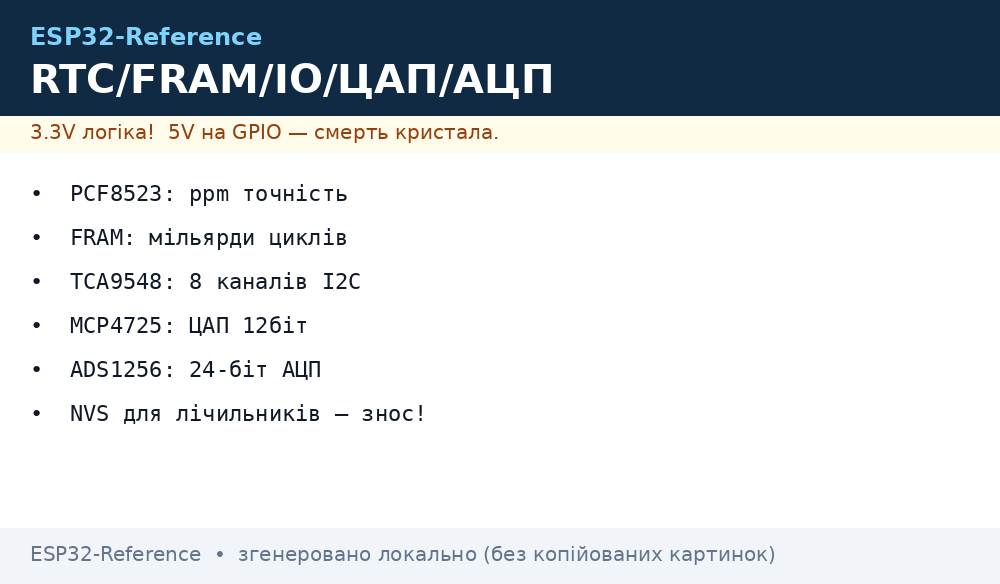
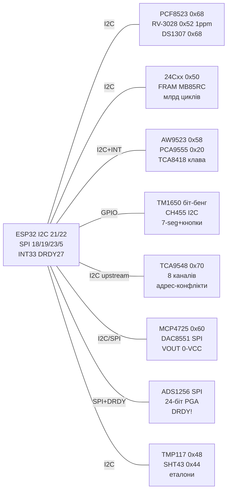

# Час / Пам'ять / IO-розширення / ЦАП / Точні виміри


*Рис. 1. Сервісний вузол ESP32: RTC з батарейкою, EEPROM+FRAM, GPIO-експандери, LED-драйвери 7-сегментів, I2C-мультиплексор, ЦАП, 24-біт АЦП та еталонні термометри.*

## Призначення

Сервісна нота «все, що обслуговує головні сенсори»: RTC (PCF8523/RV-3028/DS1307 - порівняння точності ppm!) для міток часу без Wi-Fi, зовнішня пам'ять (24Cxx EEPROM + FRAM MB85RC з мільярдами циклів!) для лічильників/калібрувань, GPIO/клавіатурні розширювачі (AW9523/PCA9555/TCA8418), LED-драйвери 7-сегментів з кнопками (TM1650/CH455), I2C-мультиплексор TCA9548 на 8 каналів (коли адреси конфліктують!), ЦАП (MCP4725/4728/DAC8551), прецизійний 24-біт АЦП ADS1256 та еталонні температура/волога (TMP117/MCP9808/SHT43/DHT20/AHT30). Пов'язано з [01-Partitions-NVS](../../../ESP32-Reference/08-Pamyat/01-Partitions-NVS.md) (куди писати, щоб не вбити флеш) та [SPI](../../../ESP32-Reference/04-Shini/02-SPI.md).

> Правило: лічильники/стани, що пишуться щохвилини - тільки у FRAM або RTC-SRAM, ніколи у NVS/EEPROM без wear-leveling! NVS - для налаштувань, EEPROM - для калібрувань (тисячі записів), FRAM - для частих записів (мільярди!).

## Характеристики

| Параметр | PCF8523 | RV-3028-C7 | DS1307 |
| --- | --- | --- | --- |
| Точність | ±20 ppm (~±50 с/міс) | ±1 ppm (!), TCXO (~±2.6 с/міс) | ±20 ppm, але дрейфує з температурою |
| Інтерфейс / адреса | I2C 0x68 | I2C 0x52 | I2C 0x68 (конфлікт з PCF8523/MPU!) |
| Напруга / батарейка | 1.8-5.5 В, CR1220/CR2032 | 1.1-5.5 В, trickle-charge! | 4.5-5.5 В (логіка 5 В!), CR2032 |
| Струм від батареї | ~300 нА | ~45 нА (!) | ~500 нА |
| Фішки | Аларми, таймер, калібрування offset | UNIX-лічильник, 2 event-входи, EEPROM | 56 байт SRAM, 1 Гц вихід |
| Висновок | Дешевий і всюди є | Еталон для вулиці/холоду | Тільки для 5 В Arduino-сумісності |
| Живлення з ESP32 | 3.3 В - ідеально | 3.3 В - ідеально | Потрібен level-shift! |

| Параметр | 24Cxx EEPROM (24LC32/256) | FRAM MB85RC (MB85RC256!) |
| --- | --- | --- |
| Обсяг | 4-64 кБ (32-512 кбіт) | 32 кБ-256 кБ |
| Інтерфейс / адреса | I2C 0x50-0x57 (A0-A2!) | I2C 0x50-0x57 (A0-A2) |
| Швидкість | 400 кГц, запис 5 мс (сторінка 32 Б!) | 1 МГц, запис миттєвий, без сторінок! |
| Ресурс | ~1 млн циклів | ~10¹²-10¹³ циклів (мільярди!) |
| Збереження | ~200 років | 95 років при кімнатній |
| Застосування | Калібрування, MAC, налаштування | Лічильники, стани, кільцевий лог |
| Ціна | ~$0.5 | ~$3-5 |

| Параметр | AW9523 | PCA9555 | TCA8418 | TM1650 / CH455 |
| --- | --- | --- | --- | --- |
| Канали | 16 GPIO + LED-dim | 16 GPIO | 18 GPIO + 80-кнопкова матриця! | 4×7-seg + кнопки / 8×7-seg + клавіатура |
| Інтерфейс / адреса | I2C 0x58-0x5B | I2C 0x20-0x27 | I2C 0x34 | I2C-подібний 2-wire (TM1650!) / I2C (CH455) |
| Pull-up | Немає! (зовнішні!) | Програмовані | Програмовані + debounce | Не потрібні |
| INT | Так (зміна піна) | Так | Так + FIFO подій | Ні / так |
| Струм піна | LED constant-current (без резисторів!) | 25 мА | 10 мА | Прямий drive LED |
| Застосування | LED-панелі, кнопки | Класичний expander | Клавіатури 8×10 | Годинники, лічильники |

| Параметр | TCA9548 (мультиплексор!) | MCP4725 / 4728 / DAC8551 | ADS1256 (24-біт!) | TMP117 / MCP9808 / SHT43 / DHT20 / AHT30 |
| --- | --- | --- | --- | --- |
| Призначення | 8 каналів I2C, коли адреси конфліктують! | ЦАП 12 біт (4725 - 1 кан, 4728 - 4 кан, 8551 - SPI!) | Диф. АЦП для тензодатчиків/термопар | Еталонна T/RH |
| Інтерфейс | I2C 0x70-0x77, вибір каналу 1 байтом | I2C 0x60/0x61 (4725) / SPI (8551) | SPI до 30 kSPS | I2C (усі, крім DHT20 - свій протокол!) |
| Точність | - | 12 біт, EEPROM старту (4725!) | 24 біт, PGA 1-64, ~20 нВ | TMP117 ±0.1 °C!, MCP9808 ±0.25 °C, SHT43 ±0.2 °C/±2%RH |
| Живлення | 1.8-5 В | 2.7-5.5 В | 2.7-5.25 В (аналог 5 В!) | 1.8-5.5 В |
| Фішка | 8 однакових сенсорів на шині! | Збереження стартового коду | 8 входів / 4 диференційні | TMP117 - NIST-трейсабл для калібрування інших! |

## Легенда пінів модуля

| RTC (PCF8523/RV-3028/DS1307) | Призначення | Куди |
| --- | --- | --- |
| VCC / GND | 3.3 В (PCF/RV) / 5 В (DS1307!) | 3V3 або 5V / GND |
| SDA / SCL | I2C: PCF 0x68, RV 0x52, DS 0x68 | GPIO21 / GPIO22 |
| BAT | CR1220/CR2032 + діод/конд. | Батарейний тримач (не перезаряджувану без схеми!) |
| INT/SQW | Аларм 1 Гц / переривання | GPIO (пробудження з deep-sleep!) |
| Trickle (RV-3028) | Підзаряд суперкапа | Конфігурувати регістром! Не для CR2032! |

| 24Cxx / FRAM (STEMMA) | Призначення | Куди |
| --- | --- | --- |
| VIN / GND | 3.3-5 В | 3V3 / GND |
| SDA / SCL | I2C 0x50 (+A0-A2) | GPIO21 / GPIO22 |
| A0/A1/A2 | Біти адреси (паяти перемички!) | GND/VCC → 0x50-0x57 |
| WP | Захист запису | GND (дозвіл) / VCC (тільки читання!) |

| AW9523 / PCA9555 / TCA8418 | Призначення | Куди |
| --- | --- | --- |
| VIN / GND | 3.3-5 В | 3V3 / GND |
| SDA / SCL | I2C: AW 0x58, PCA 0x20, TCA8418 0x34 | GPIO21 / GPIO22 |
| INT | Зміна входу (open-drain!) | GPIO + pull-up 10 кОм |
| P0-P15 / R0-C9 | GPIO / матриця кнопок | Кнопки/LED/реле через транзистор! |
| ADDR | Вибір адреси | Перемички за даташитом |

| TM1650 / CH455 | Призначення | Куди |
| --- | --- | --- |
| VCC / GND | 3.3-5 В | 3V3/5V / GND |
| DIO / CLK (TM1650) | 2-wire (не чистий I2C!) | GPIO19 / GPIO18 (біт-бенг!) |
| SDA / SCL (CH455) | I2C 0x60-0x67 | GPIO21 / GPIO22 |
| SEG/DIG | Сегменти/розряди + кнопки | 7-seg common-cathode! |

| TCA9548 | Призначення | Куди |
| --- | --- | --- |
| VIN / GND | 1.8-5 В | 3V3 / GND |
| SDA / SCL (upstream) | До ESP32 0x70-0x77 | GPIO21 / GPIO22 |
| SD0-SD7 / SC0-SC7 | 8 незалежних каналів вниз | Сенсори з однаковими адресами! |
| A0-A2 | Адреса самого мультиплексора | GND/VCC → 0x70-0x77 |
| RST | Скидання (active low) | GPIO або VCC через 10 кОм |

| MCP4725 / DAC8551 | Призначення | Куди |
| --- | --- | --- |
| VCC / GND | 3.3-5 В (VOUT = 0-VCC!) | 3V3 / GND + 100 нФ |
| SDA / SCL (4725) | I2C 0x60 (A0=GND) / 0x61 | GPIO21 / GPIO22 |
| SCK/SDI/CS (8551) | SPI | GPIO18 / GPIO23 / GPIO5 |
| VOUT | 0-VCC, 12-16 біт | ОП-повторювач → 0-10 В / 4-20 мА каскад |
| A0 (4725) | Адреса | GND/VCC → 0x60/0x61 (два ЦАП на шині!) |

| ADS1256 | Призначення | Куди |
| --- | --- | --- |
| VCC/AVDD/DGND | 5 В аналог + 3.3 В цифра! | 5V + 3V3 / GND (розділені!) |
| SCK/MISO/MOSI/CS | SPI до 2 МГц | GPIO18/19/23/5 ([SPI](../../../ESP32-Reference/04-Shini/02-SPI.md)) |
| DRDY | Дані готові (чекати!) | GPIO27 (переривання!) |
| AIN0-7 | 8 SE / 4 DIFF, PGA | Міст/термопара + RC-фільтр! |
| REF | Опора 2.5 В | Не шумити цифрою поруч! |

| TMP117 / MCP9808 / SHT43 | Призначення | Куди |
| --- | --- | --- |
| VIN / GND | 1.8-5.5 В | 3V3 / GND |
| SDA / SCL | I2C: TMP 0x48-0x4B, MCP 0x18-0x1F, SHT 0x44 | GPIO21 / GPIO22 |
| ALERT | Поріг температури | GPIO (опційно) |
| ADDR | Вибір адреси | Перемички (до 8 MCP9808 на шині!) |

## Схема підключення

| ESP32 | RTC/Пам'ять | IO/LED | Мультиплексор | ЦАП/АЦП | Еталони T/RH | Примітка |
| --- | --- | --- | --- | --- | --- | --- |
| 3V3 | PCF/RV/24C/FRAM VCC | AW/PCA/TCA VCC | TCA9548 VCC | MCP4725 VCC | TMP/MCP/SHT VCC | 3.3 В гілка |
| 5V | DS1307 VCC | TM1650 VCC | - | ADS1256 AVDD | - | 5 В гілка (DS1307!) |
| GND | GND + BAT- | GND | GND | AGND+DGND (зірка!) | GND | Зірка, аналог окремо! |
| GPIO21/22 | SDA/SCL усіх I2C | SDA/SCL | SDA/SCL upstream 0x70 | MCP SDA/SCL | SDA/SCL | Шина I2C0 |
| GPIO18/19/23 | - | - | - | ADS/DAC SPI | - | Шина SPI ([SPI](../../../ESP32-Reference/04-Shini/02-SPI.md)) |
| GPIO5 | - | - | RST (опційно) | CS DAC/ADC | - | Вибір кристалів |
| GPIO27 | - | - | - | ADS DRDY | - | Чекати DRDY! |
| GPIO33 | RTC INT/SQW | AW INT | - | - | ALERT | Пробудження/пороги |
| GPIO19/18 | - | TM1650 DIO/CLK | - | - | - | Біт-бенг TM1650! |
| GPIO34 | - | Матриця кнопок | Канали SD0-SC7 | VOUT → ОП | - | Кнопки/зони/аналог |

### ASCII-схема

```text
              ESP32-DevKitC
            +-------------------+
 3V3 -------+ 3V3         GPIO21|--- SDA (RTC 0x68/0x52 + EEPROM 0x50 + FRAM + AW 0x58 + MUX 0x70 + DAC 0x60 + TMP 0x48)
 GND -------+ GND         GPIO22|--- SCL (усі I2C, pull-up 4k7)
 5V  -------+ 5V          GPIO33|--- INT (RTC-аларм / AW-зміна / TMP-поріг)
            |            GPIO27 |--- DRDY (ADS1256, чекати перед читанням!)
            |       GPIO18/19/3|--- SCK/MISO/MOSI (ADS1256 + DAC8551 SPI)
            |             GPIO5 |--- CS_ADC / CS_DAC
            |         GPIO19/18 |--- DIO/CLK (TM1650 біт-бенг, НЕ I2C!)
            |            GPIO34 |--- кнопки / VOUT-контроль
            +-------------------+
 TCA9548 upstream -> ESP32; downstream SD0-SC7 -> 8 однакових сенсорів!
 BAT: CR2032 + діод; RV-3028 trickle НЕ вмикати для неперезаряджуваних!
 ADS1256: аналогова земля окремим проводом до БЖ, RC 1k+100н на входах.
```

### Mermaid



## Код ESP-IDF

```c
#include "driver/i2c.h"
#include "driver/spi_master.h"
#include "esp_log.h"
#define I2C_P I2C_NUM_0
static const char *TAG = "srv";

// PCF8523 0x68: читання часу (BCD-секунди 0x03..)
static void rtc_read(void) {
    uint8_t r = 0x03; uint8_t d[7];
    i2c_master_write_read_device(I2C_P, 0x68, &r, 1, d, 7, 100);
    int ss = ((d[0] >> 4) * 10) + (d[0] & 0x0F);
    int mm = ((d[1] >> 4) * 10) + (d[1] & 0x0F);
    ESP_LOGI(TAG, "RTC %02d:%02d", mm, ss);
}
// FRAM 0x50: довільний запис без очікування сторінки!
static void fram_write(uint16_t addr, uint8_t v) {
    uint8_t b[3] = {addr >> 8, addr & 0xFF, v};
    i2c_master_write_to_device(I2C_P, 0x50, b, 3, 100);
}
// TCA9548 0x70: вибір каналу N (0-7)
static void mux_ch(uint8_t ch) {
    uint8_t b = 1 << ch;
    i2c_master_write_to_device(I2C_P, 0x70, &b, 1, 100);
}
// MCP4725 0x60: VOUT = код 12 біт
static void dac_set(uint16_t code) {
    uint8_t b[3] = {0x40, (code >> 4) & 0xFF, (code << 4) & 0xF0};
    i2c_master_write_to_device(I2C_P, 0x60, b, 3, 100);
}
// TMP117 0x48: температура (регістр 0x00, 7.8125 мK/LSB)
static float tmp117(void) {
    uint8_t r = 0x00; uint8_t d[2];
    i2c_master_write_read_device(I2C_P, 0x48, &r, 1, d, 2, 100);
    return ((d[0] << 8) | d[1]) * 0.0078125;
}
// ADS1256 по SPI: чекати DRDY, читати 24 біт (спрощено)

void app_main(void) {
    i2c_config_t c = {.mode=I2C_MODE_MASTER,.sda_io_num=21,.scl_io_num=22,
        .sda_pullup_en=1,.scl_pullup_en=1,.master.clk_speed=400000};
    i2c_param_config(I2C_P,&c); i2c_driver_install(I2C_P,c.mode,0,0,0);
    mux_ch(0);       // датчики за мультиплексором — канал 0
    rtc_read();
    fram_write(0x0010, 0xAB); // лічильник — у FRAM, не в NVS!
    dac_set(2048);   // ~1.65 В при VCC 3.3 В
    ESP_LOGI(TAG, "TMP=%.3f C", tmp117());
}
```

## Код Arduino

```cpp
#include <Wire.h>
#include <RTClib.h>
#include <Adafruit_FRAM_I2C.h>
#include <Adafruit_MCP4725.h>
#include <Adafruit_TMP117.h>

RTC_PCF8523 rtc;
Adafruit_FRAM_I2C fram;
Adafruit_MCP4725 dac;
Adafruit_TMP117 tmp;
#define MUX 0x70
#define DRDY 27

void mux(uint8_t ch) {
  Wire.beginTransmission(MUX);
  Wire.write(1 << ch); // вибір каналу 0-7
  Wire.endTransmission();
}

void setup() {
  Serial.begin(115200);
  Wire.begin(21, 22);
  pinMode(DRDY, INPUT);
  rtc.begin();
  // rtc.adjust(DateTime(F(__DATE__), F(__TIME__))); // один раз!
  fram.begin(0x50);
  dac.begin(0x60);
  tmp.begin(0x48);

  mux(2); // наприклад, три однакові SHT43 за мультиплексором
  // читати сенсор на каналі 2...

  uint32_t boot = fram.read32(0x00); // лічильник перезавантажень у FRAM!
  fram.write32(0x00, boot + 1);
  dac.setVoltage(2048, false); // без запису в EEPROM
  // dac.setVoltage(1024, true); // зі стартом після ресету!
  Serial.printf("boot=%lu TMP=%.3f\n", (unsigned long)boot + 1, tmp.readTempC());
}

void loop() {
  DateTime t = rtc.now();
  Serial.printf("%02d:%02d:%02d TMP=%.2f\n", t.hour(), t.minute(), t.second(), tmp.readTempC());
  // ADS1256: чекати DRDY LOW, читати 24 біт по SPI, PGA за мостом
  // TM1650: біт-бенг DIO/CLK (не Wire!), CH455 — звичайний I2C
  delay(1000);
}
```

## Код MicroPython

```python
from machine import I2C, Pin, SPI
import time

i2c = I2C(0, scl=Pin(22), sda=Pin(21), freq=400000)
print("I2C:", [hex(a) for a in i2c.scan()])
drdy = Pin(27, Pin.IN)
rtc_int = Pin(33, Pin.IN)

def mux(ch, addr=0x70):
    i2c.writeto(addr, bytes([1 << ch]))

def rtc_time(addr=0x68):
    d = i2c.readfrom_mem(addr, 0x03, 3)
    ss = (d[0] >> 4) * 10 + (d[0] & 0x0F)
    mm = (d[1] >> 4) * 10 + (d[1] & 0x0F)
    hh = (d[2] >> 4) * 10 + (d[2] & 0x0F)
    return hh, mm, ss

def fram_write(addr, val, dev=0x50):
    i2c.writeto(dev, bytes([(addr >> 8) & 0xFF, addr & 0xFF, val]))

def dac(code, addr=0x60):
    i2c.writeto(addr, bytes([0x40, (code >> 4) & 0xFF, (code << 4) & 0xF0]))

def tmp117(addr=0x48):
    d = i2c.readfrom_mem(addr, 0x00, 2)
    raw = (d[0] << 8) | d[1]
    if raw & 0x8000: raw -= 0x10000
    return raw * 0.0078125

mux(0)
fram_write(0x10, 0xAB)  # часті записи — тільки FRAM!
dac(2048)
while True:
    print("RTC {} TMP={:.3f} DRDY={}".format(rtc_time(), tmp117(), drdy.value()))
    # AW9523: немає pull-up — зовнішні 10 кОм на входи кнопок!
    # ADS1256: SPI + чекати drdy == 0 перед читанням
    time.sleep(1)
```

## Типові помилки

| № | Помилка | Симптом | Рішення |
| --- | --- | --- | --- |
| 1 | DS1307 + PCF8523 на шині | Обидва 0x68, один мовчить | Адресний конфлікт! Залишити один або рознести через TCA9548 |
| 2 | DS1307 від 3.3 В | Час стоїть/скидається | DS1307 - 5 В логіка! PCF8523/RV-3028 для 3.3 В |
| 3 | RV-3028 trickle на CR2032 | Батарейка гріється/тече | Trickle тільки для суперкапа! Для CR2032 - вимкнути регістром |
| 4 | EEPROM запис без паузи 5 мс | Читається старе | Чекати ACK-полінг або 5 мс; писати сторінками по 32 Б |
| 5 | Лічильник у NVS щосекунди | Флеш вмерла за місяці | Часті записи - у FRAM/RTC-SRAM; NVS - налаштування (див. [NVS](../../../ESP32-Reference/08-Pamyat/01-Partitions-NVS.md)) |
| 6 | FRAM шукають сторінки/erase | Зайвий код очікування | FRAM пишеться миттєво побайтово, erase не потрібен! |
| 7 | AW9523 входи висять | Хибні спрацювання | У AW9523 немає pull-up - зовнішні 10 кОм до 3.3 В! |
| 8 | TM1650 через Wire | NACK | TM1650 - не чистий I2C, тільки біт-бенг DIO/CLK! |
| 9 | TCA9548 не вибрано канал | Сенсор «зник» | Перед кожним доступом `mux(ch)`; після ресету канал скидається! |
| 10 | MCP4725 VOUT 5 В в ADC ESP32 | Вмер ADC | VOUT = 0-VCC; при VCC 5 В - дільник перед GPIO36! |
| 11 | ADS1256 читають без DRDY | Сміття 0xFFFFFF | Чекати DRDY LOW (переривання!), SPI ≤ 2 МГц, аналогова земля окремо |
| 12 | ADS1256 цифра шумить аналог | Останні біти плавають | RC 1 кОм+100 нФ на входи, REF чистий, AVDD 5 В LC-фільтр |
| 13 | DHT20 як I2C-сенсор за адресою | NACK | DHT20 - свій single-bus протокол, не сканується як I2C! |
| 14 | TMP117 плутають з LM35 | «Десяті градуса немає» | TMP117 - цифра 0.0078 °C/LSB; калібрувати інші датчики саме по ньому |

## Офіційні джерела

- [PCF8523 - гайд з кодом (Adafruit Learn)](https://learn.adafruit.com/adafruit-pcf8523-real-time-clock) - батарейка, аларми, чому не DS1307 для 3.3 В.
- [DS1307 - гайд з кодом (Adafruit Learn)](https://learn.adafruit.com/ds1307-real-time-clock-breakout-board-kit) - 5 В логіка, SRAM, 1 Гц.
- [FRAM I2C - гайд з кодом (Adafruit Learn)](https://learn.adafruit.com/adafruit-i2c-fram-breakout) - мільярди циклів, без сторінок.
- [24LC32 EEPROM - гайд (Adafruit Learn)](https://learn.adafruit.com/adafruit-24lc32-i2c-eeprom-breakout-32kbit-4-kb) - адреси A0-A2, сторінковий запис.
- [TCA9548A - гайд з кодом (Adafruit Learn)](https://learn.adafruit.com/adafruit-tca9548a-1-to-8-i2c-multiplexer-breakout) - 8 каналів проти конфліктів адрес.

## Див. також

- [Головна карта довідника](../../../ESP32-Reference/Home.md)
- [Partitions/NVS - куди писати](../../../ESP32-Reference/08-Pamyat/01-Partitions-NVS.md)
- [SPI шина](../../../ESP32-Reference/04-Shini/02-SPI.md)
- [I2C шина](../../../ESP32-Reference/04-Shini/03-I2C.md)
- [ADC](../../../ESP32-Reference/06-Analog/01-ADC.md)
- [RTC/енкодери перша частина](../../../ESP32-Reference/10-Sensori/14-DS3231-Encoder-Keypad-Joystick.md)
- [Магнітометри/IMU-2](../../../ESP32-Reference/10-Sensori/25-Mag-IMU-2.md)
- [Світло/УФ/тепловізори/ToF](../../../ESP32-Reference/10-Sensori/26-Light-UV-IRArray-ToF.md)
- [Ця нота (якір графа)](../../../ESP32-Reference/10-Sensori/27-Time-Mem-IO-DAC.md)
- [Industrial fieldbus](../../../ESP32-Reference/12-Moduli-zvyazku/10-Industrial.md)
- [FAQ](../../../ESP32-Reference/99-Dodatki/02-Troubleshooting-FAQ.md)
