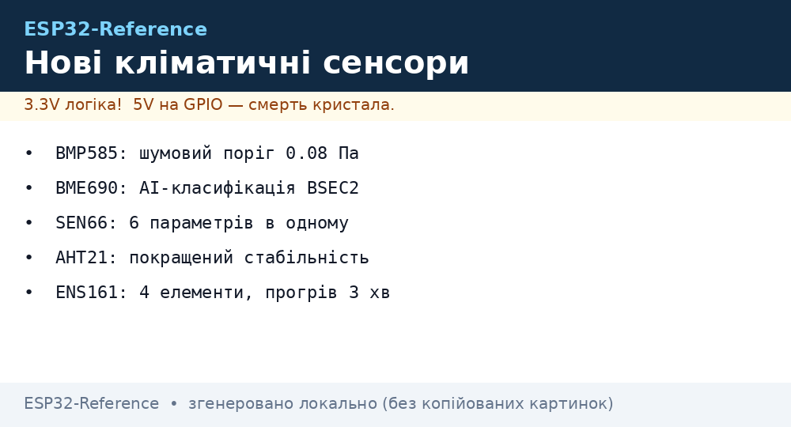

# Нове покоління кліматичних сенсорів (BMP585, BME690, SEN66, AHT21, ENS161)


*Рис. 1. Кліматичні сенсори нового покоління: прецизійний тиск (BMP585), мультигазові комплекси (SEN66, BME690), вологість (AHT21).*

## Призначення

Сенсори покоління 2024-2026 років фокусуються на наднизькому шумі (BMP585 фіксує перепад висоти у 2 см), зменшенні енергоспоживання в deep-sleep, вбудованій апаратній компенсації дрейфу та мультисенсорній інтеграції «все-в-одному» (SEN66 поєднує оптичний PM, NDIR CO2, VOC, NOx, вологість і температуру в єдиному модулі з I2C-інтерфейсом).

## Характеристики

| Модуль | Виробник | Параметри | Інтерфейс | Живлення | Особливість 2026 |
| --- | --- | --- | --- | --- | --- |
| BMP585 | Bosch | Тиск (300..1250 гПа), Темп. | I2C / SPI | 1.8..3.6 В | Шумовий поріг 0.08 Па (2 см висоти!), водозахисний гель |
| BME690 | Bosch | VOC, VSC (сірка), вологість, тиск | I2C / SPI | 1.8..3.6 В | Підтримка AI-класифікації BSEC2, газовий нагрівач низького струму |
| SEN66 | Sensirion | PM1/2.5/4/10, CO2, VOC, NOx, RH/T | I2C | 3.3 / 5 В | 6 параметрів в одному блоці, калібровані фабричні криві |
| AHT21 | Aosong | Вологість (0..100%), Темп. | I2C (0x38) | 2.0..5.5 В | Покращена довгострокова стабільність проти AHT10/20 |
| ENS161 | ScioSense | TVOC, eCO2, індекси AQI UBA | I2C / SPI | 1.8..3.6 В | 4 металооксидні елементи, швидкий прогрів (3 хв) |

## Легенда пінів модуля

| Пін | Тип | Куди на ESP32 | Примітка |
| --- | --- | --- | --- |
| VCC / VIN | Живлення | 3V3 (або 5V якщо модуль з LDO) | Логіка тільки 3.3 В! |
| GND | Земля | Спільний GND | Обов'язкова єдина точка землі |
| SCL | Вхід тактування | GPIO22 (I2C SCL) | Потрібен pull-up 4.7 кОм |
| SDA | Лінія даних | GPIO21 (I2C SDA) | Потрібен pull-up 4.7 кОм |
| INT / RDY | Вихід переривання | GPIO19 / вільний GPIO | Прапор готовності нових даних (опційно) |
| CSB (Bosch) | Вибір інтерфейсу | Підтягнути до VCC для I2C | Якщо LOW - перемикається в SPI |

## Схема підключення

| ESP32 DevKit | Сенсор (I2C) | Примітка |
| --- | --- | --- |
| 3V3 | VIN / VCC | 3.3 В, стабільна лінія |
| GND | GND | Спільний мінус |
| GPIO22 | SCL | Тактування шини I2C |
| GPIO21 | SDA | Дані I2C |

### ASCII-схема

```text
ESP32 DevKit                        Кліматичний сенсор (BMP585/SEN66/AHT21)
  ┌────────────┐                         ┌─────────────┐
  │        3V3 ├─────────────────────────┤ VCC (3.3V)  │
  │        GND ├─────────────────────────┤ GND         │
  │     GPIO22 ├──────────┬──────────────┤ SCL         │
  │     GPIO21 ├───────┬──┼──────────────┤ SDA         │
  └────────────┘       │  │              └─────────────┘
                     [4.7k][4.7k] (Pull-up до 3V3)
```

### Mermaid


## Код ESP-IDF

```c
#include "driver/i2c.h"
#include "esp_log.h"

#define I2C_MASTER_SCL_IO 22
#define I2C_MASTER_SDA_IO 21
#define I2C_MASTER_NUM    I2C_NUM_0
#define AHT21_ADDR        0x38

static const char *TAG = "ENV_NEWGEN";

void app_main(void) {
    i2c_config_t conf = {
        .mode = I2C_MODE_MASTER,
        .sda_io_num = I2C_MASTER_SDA_IO,
        .scl_io_num = I2C_MASTER_SCL_IO,
        .sda_pullup_en = GPIO_PULLUP_ENABLE,
        .scl_pullup_en = GPIO_PULLUP_ENABLE,
        .master.clk_speed = 100000,
    };
    i2c_param_config(I2C_MASTER_NUM, &conf);
    i2c_driver_install(I2C_MASTER_NUM, conf.mode, 0, 0, 0);

    uint8_t cmd_trigger[3] = {0xAC, 0x33, 0x00};
    i2c_master_write_to_device(I2C_MASTER_NUM, AHT21_ADDR, cmd_trigger, 3, pdMS_TO_TICKS(100));
    ESP_LOGI(TAG, "AHT21/BMP585 вимірювання ініційовано");
}
```

## Код Arduino

```cpp
#include <Wire.h>

#define SENSOR_I2C_ADDR 0x38 // Приклад для AHT21

void setup() {
  Serial.begin(115200);
  Wire.begin(21, 22);
  Serial.println("Ініціалізація кліматичного сенсора нового покоління...");
}

void loop() {
  Wire.beginTransmission(SENSOR_I2C_ADDR);
  Wire.write(0xAC);
  Wire.write(0x33);
  Wire.write(0x00);
  Wire.endTransmission();
  delay(80);

  Wire.requestFrom(SENSOR_I2C_ADDR, 6);
  if (Wire.available() >= 6) {
    uint8_t buf[6];
    for (int i = 0; i < 6; i++) buf[i] = Wire.read();
    uint32_t raw_hum = ((uint32_t)buf[1] << 12) | ((uint32_t)buf[2] << 4) | (buf[3] >> 4);
    float humidity = ((float)raw_hum / 1048576.0) * 100.0;
    Serial.printf("Вологість: %.2f %%\n", humidity);
  }
  delay(2000);
}
```

## Код MicroPython

```python
import time
from machine import I2C, Pin

i2c = I2C(0, scl=Pin(22), sda=Pin(21), freq=100000)
addr = 0x38

# Запит виміру
i2c.writeto(addr, bytes([0xAC, 0x33, 0x00]))
time.sleep_ms(80)
data = i2c.readfrom(addr, 6)

raw_h = (data[1] << 12) | (data[2] << 4) | (data[3] >> 4)
humidity = (raw_h / 1048576.0) * 100.0
print(f"AHT21 Вологість: {humidity:.2f}%")
```

## Типові помилки

| № | Помилка | Симптом | Рішення |
| --- | --- | --- | --- |
| 1 | CSB залишений у повітрі (Bosch) | Сенсор не відповідає на I2C-адресу | Підтягнути пін CSB до 3V3 для активації режиму I2C |
| 2 | Спільна шина 5V датчиків | Пробій входу GPIO ESP32 | Забезпечити живлення та підтяжку шини суворо від 3.3 В |
| 3 | SEN66 без достатнього живлення | Ресети модуля при увімкненні вентилятора | SEN66 вимагає пікового струму до 250 мА, потрібен окремий стабілізатор |
| 4 | Відсутність затримки після запуску | NACK або повернення 0xFF | Давати 100 мс після подачі живлення перед першою командою |

## Офіційні джерела

- Bosch Sensortec BMP585: [bosch-sensortec.com](https://www.bosch-sensortec.com/products/environmental-sensors/pressure-sensors/bmp585/)
- Bosch Sensortec BME690: [bosch-sensortec.com](https://www.bosch-sensortec.com/products/environmental-sensors/gas-sensors/bme690/)
- Sensirion Environmental Hub: [sensirion.com](https://sensirion.com/products/catalog/SEN66/)
- Aosong AHT21: `перевірити вручну` (сайт вендора часто під капчею)

## Див. також

- [Home](../../../ESP32-Reference/Home.md)
- [Прецизійні гази](../../../ESP32-Reference/10-Sensori/17-Gas-CO2-Precision.md)
- [BME280 та SHT31](../../../ESP32-Reference/10-Sensori/03-BME280-BMP280-SHT31.md)
- [Шина I2C](../../../ESP32-Reference/04-Shini/03-I2C.md)
- [Живлення ESP32](../../../ESP32-Reference/02-Zhivlennya/01-Lancjugi-zhivlennya.md)
