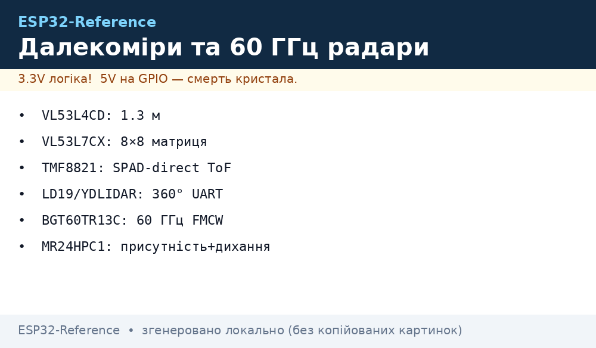
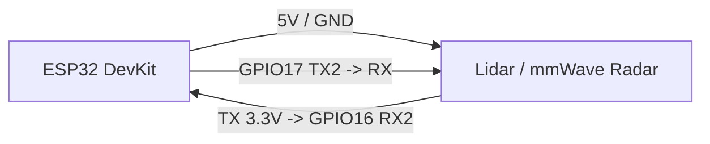

# Далекоміри, 360° лідари та 60 ГГц радари


*Рис. 1. Точні сенсори відстані та присутності: матричні ToF (VL53L7CX 8x8), 360° оптичні лідари (LD19/YDLIDAR), міліметрові 60 ГГц радари (MR24HPC1, BGT60).*

## Призначення

Сенсори для навігації роботів, детекції людини у кімнаті за диханням, побудови 2D/3D карт простору та безконтактного керування. На відміну від ультразвуку, прямий ToF та 60 ГГц mmWave працюють крізь скло/пластик, фіксують мікрорухи серцебиття та дають матрицю відстаней до 64 зон одночасно.

## Характеристики

| Модуль | Тип | Діапазон | Інтерфейс | Живлення | Особливість |
| --- | --- | --- | --- | --- | --- |
| VL53L4CD | Прямий ToF | 1 мм .. 1.3 м | I2C (0x29) | 2.8..3.3 В | Частота до 100 Гц, для дрібних об'єктів |
| VL53L7CX | Матричний ToF 8×8 | До 3.5 м (64 зони) | I2C / SPI | 3.3 В | Матриця глибини, трекінг кількох цілей |
| TMF8821 | Direct ToF multizone | До 5 м (3×3 / 4×4 / 3×6) | I2C | 3.3 В | Пряме вимірювання часу польоту фотона (SPAD) |
| LD19 / YDLIDAR | 360° Triangulation / DToF | 0.05 .. 12 м | UART (230400 бод) | 5 В (мотор) + 3.3 В | 4500 точок/сек, 2D SLAM картографія |
| MR24HPC1 / C1001 | 24/60 ГГц mmWave | До 6 м | UART (115200 бод) | 5 В (стабільні 200 мА) | Детекція статичної присутності за диханням |
| BGT60TR13C | 60 ГГц FMCW радар | 0.1 .. 10 м | SPI | 3.3 В | Субміліметрове розділення мікрожестів |

## Легенда пінів модуля

| Пін | Тип | Куди на ESP32 | Примітка |
| --- | --- | --- | --- |
| VCC (3.3V) | Живлення | 3V3 ESP32 | Для ToF сенсорів (VL53, TMF) |
| 5V / VIN | Живлення | 5V / VIN плати | Обов'язково для мотора лідара та mmWave модулів |
| GND | Земля | Спільний GND | Спільний мінус усієї схеми |
| TX / RX | Послідовний | GPIO16 (RX2) / GPIO17 (TX2) | Для радарів та лідарів (3.3 В рівні!) |
| SCL / SDA | Шина I2C | GPIO22 (SCL) / GPIO21 (SDA) | Для ToF сенсорів + pull-up 4.7 кОм |
| LPn / XSHUT | Керування | Вільний GPIO (OUT) | Для зміни I2C адреси при каскадуванні ToF |
| M_EN / PWM | ШІМ мотора | GPIO18 (LEDC PWM) | Керування швидкістю обертання лідара |

## Схема підключення

| ESP32 DevKit | Модуль (Radar/Lidar UART) | Сенсор (ToF I2C) | Примітка |
| --- | --- | --- | --- |
| 5V (VIN) | 5V / VCC | - | Живлення мотора/радара |
| 3V3 | - | VCC / VIN | Живлення ToF 3.3 В |
| GND | GND | GND | Спільна земля |
| GPIO16 (RX2) | TX | - | Прийом пакетів точок/присутності |
| GPIO17 (TX2) | RX | - | Конфігурація радара |
| GPIO22 (SCL) | - | SCL | Тактування I2C |
| GPIO21 (SDA) | - | SDA | Дані I2C |

### ASCII-схема

```text
ESP32 DevKit                          60 ГГц Радар / LD19 Лідар
  ┌────────────┐                         ┌─────────────┐
  │         5V ├─────────────────────────┤ VCC (5V)    │
  │        GND ├─────────────────────────┤ GND         │
  │ GPIO16(RX2)│◄────────────────────────┤ TX (3.3V)   │
  │ GPIO17(TX2)├────────────────────────►│ RX (3.3V)   │
  └────────────┘                         └─────────────┘
```

### Mermaid



## Код ESP-IDF

```c
#include "driver/uart.h"
#include "esp_log.h"

#define UART_NUM UART_NUM_2
#define TX_PIN 17
#define RX_PIN 16
#define BUF_SIZE 1024

static const char *TAG = "RANGE_RADAR";

void app_main(void) {
    uart_config_t uart_config = {
        .baud_rate = 115200,
        .data_bits = UART_DATA_8_BITS,
        .parity    = UART_PARITY_DISABLE,
        .stop_bits = UART_STOP_BITS_1,
        .flow_ctrl = UART_HW_FLOWCTRL_DISABLE
    };
    uart_param_config(UART_NUM, &uart_config);
    uart_set_pin(UART_NUM, TX_PIN, RX_PIN, UART_PIN_NO_CHANGE, UART_PIN_NO_CHANGE);
    uart_driver_install(UART_NUM, BUF_SIZE * 2, 0, 0, NULL, 0);

    uint8_t data[128];
    while (1) {
        int len = uart_read_bytes(UART_NUM, data, sizeof(data), pdMS_TO_TICKS(100));
        if (len > 0) {
            ESP_LOGI(TAG, "Отримано %d байт від радара", len);
        }
    }
}
```

## Код Arduino

```cpp
#define RX2_PIN 16
#define TX2_PIN 17

void setup() {
  Serial.begin(115200);
  Serial2.begin(115200, SERIAL_8N1, RX2_PIN, TX2_PIN);
  Serial.println("Запуск mmWave радара присутності...");
}

void loop() {
  if (Serial2.available()) {
    uint8_t b = Serial2.read();
    Serial.printf("%02X ", b);
  }
}
```

## Код MicroPython

```python
import time
from machine import UART

uart = UART(2, baudrate=115200, tx=17, rx=16)

while True:
    if uart.any():
        data = uart.read()
        print("Radar raw:", data.hex())
    time.sleep(0.1)
```

## Типові помилки

| № | Помилка | Симптом | Рішення |
| --- | --- | --- | --- |
| 1 | Живлення радара від піна 3V3 | Падіння WiFi / постійний ресет ESP32 | Радари 24/60 ГГц та мотори лідарів живити тільки від 5V джерела |
| 2 | Шум від металевих корпусів | Помилкові спрацювання радара | Радари монтувати за радіопрозорим пластиком (ABS, акрил) без металу |
| 3 | Плутанина RX/TX | Повна відсутність даних | TX сенсора йде на RX ESP32, RX сенсора - на TX ESP32 |
| 4 | Відсутність XSHUT при двох ToF | Обидва датчики мають однаковий ID 0x29 | Вмикати ToF почергово через лінію XSHUT і змінювати адресу програмно |

## Офіційні джерела

- STMicroelectronics VL53L7CX: [st.com](https://www.st.com/en/imaging-and-photonics-solutions/vl53l7cx.html)
- Infineon BGT60TR13C: [infineon.com](https://www.infineon.com/cms/en/product/sensor/radar-sensors/radar-sensors-for-iot/60ghz-radar/bgt60tr13c/)
- Seeed Studio MR24HPC1 mmWave: [seeedstudio.com](https://www.seeedstudio.com/24GHz-mmWave-Sensor-Human-Static-Presence-Module-Lite-p-5524.html)
- YDLIDAR / LD19 docs: `перевірити вручну`

## Див. також

- [Home](../../../ESP32-Reference/Home.md)
- [Базові ToF сенсори](../../../ESP32-Reference/10-Sensori/10-VL53L0X-TCS34725-TSL2561.md)
- [LD2410 та радари](../../../ESP32-Reference/12-Moduli-zvyazku/08-LD2410-UWB-IR-Voice.md)
- [Шина UART](../../../ESP32-Reference/04-Shini/01-UART.md)
- [Ланцюги живлення](../../../ESP32-Reference/02-Zhivlennya/01-Lancjugi-zhivlennya.md)
