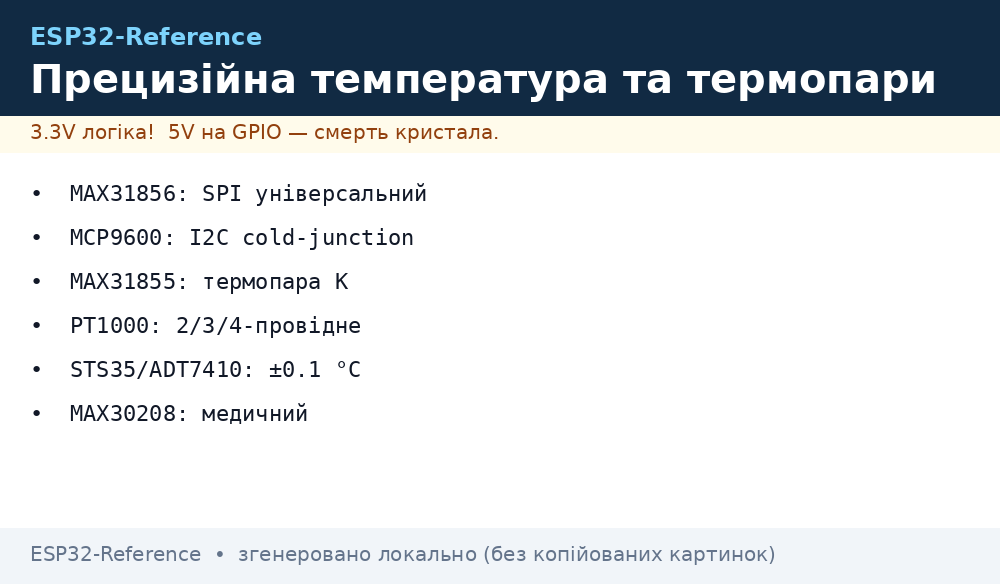
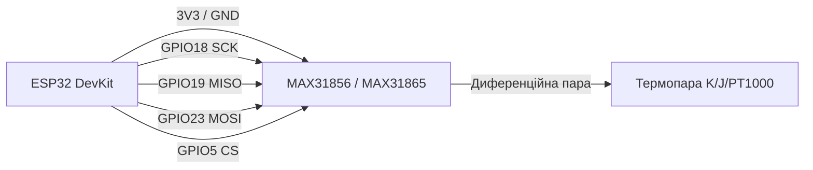

# Прецизійна температура та термопари


*Рис. 1. Еталонні вимірювання температури: універсальні перетворювачі термопар (MAX31856, MCP9600), резистивні платинові сенсори (PT1000), медичні цифрові термометри (MAX30208, STS35).*

## Призначення

Точне вимірювання екстремальних температур від −200 °C до +1800 °C (металургія, печі, 3D-друк) за допомогою термопар K/J/N/R/S/T-типів або прецизійний клінічний моніторинг (±0.1 °C у діапазоні тіла людини) та калібрування кліматичних камер. Перетворювачі - SPI/I2C (MAX31856, MCP9600), холодний спай - обовʼязкова компенсація.

## Характеристики

| Модуль | Тип | Діапазон | Точність | Інтерфейс | Живлення |
| --- | --- | --- | --- | --- | --- |
| MAX31856 | Універсальний термопарний АЦП | −210 .. +1800 °C | 19-біт (0.0078 °C) | SPI | 3.3 В |
| MCP9600 | I2C перетворювач термопар | −200 .. +1372 °C | 18-біт, cold-junction | I2C (0x60..0x67) | 2.7 .. 5.5 В |
| MAX31855 | Термопара K-типу | −200 .. +1350 °C | 14-біт (0.25 °C) | SPI (тільки читання) | 3.3 В |
| PT1000 (з MAX31865) | Платиновий RTD | −200 .. +600 °C | Клас A (±0.15 °C) | SPI | 3.3 В |
| STS35 / ADT7410 | Цифровий IC термометр | −40 .. +125 °C | ±0.1 °C (типово) | I2C (0x4A / 0x48) | 2.15 .. 5.5 В |
| MAX30208 | Медичний термометр | +30 .. +50 °C | ±0.1 °C (клінічний) | I2C (0x50) | 1.7 .. 3.6 В |
| HDC1080 / HTU21D | Температура + Вологість | −40 .. +125 °C | ±0.2 °C / ±2% RH | I2C (0x40) | 2.7 .. 5.5 В |

## Легенда пінів модуля

| Пін | Тип | Куди на ESP32 | Примітка |
| --- | --- | --- | --- |
| VCC | Живлення | 3V3 ESP32 | Суворо 3.3 В для більшості SPI модулів |
| GND | Земля | Спільний GND | Спільний мінус |
| SCK / SCL | Тактування | GPIO18 (VSPI SCK) або GPIO22 (I2C) | Залежить від інтерфейсу модуля |
| SDO / MISO / SDA | Дані | GPIO19 (VSPI MISO) або GPIO21 (I2C) | Лінія даних |
| SDI / MOSI | Вхід даних | GPIO23 (VSPI MOSI) | Тільки для двонаправлених SPI (MAX31856) |
| CS | Chip Select | GPIO5 (або будь-який вільний GPIO) | Активний рівень LOW |
| T+ / T- | Вхід термопари | До виводів термопари | Дотримуватися полярності (T+ жовтий/червоний)! |

## Схема підключення

| ESP32 DevKit | MAX31856 (SPI) | STS35 / MCP9600 (I2C) | Примітка |
| --- | --- | --- | --- |
| 3V3 | VCC | VCC | Живлення 3.3 В |
| GND | GND | GND | Спільна земля |
| GPIO18 | SCK | - | SPI тактування |
| GPIO19 | SDO (MISO) | - | SPI прийом даних |
| GPIO23 | SDI (MOSI) | - | SPI передача конфігу |
| GPIO5 | CS | - | Вибір кристала |
| GPIO22 | - | SCL | I2C тактування |
| GPIO21 | - | SDA | I2C дані |

### ASCII-схема

```text
ESP32 DevKit                        MAX31856 / MAX31865 (SPI)
  ┌────────────┐                         ┌─────────────┐
  │        3V3 ├─────────────────────────┤ VCC         │
  │        GND ├─────────────────────────┤ GND         │
  │     GPIO18 ├─────────────────────────┤ SCK         │
  │     GPIO19 ├─────────────────────────┤ SDO (MISO)  │
  │     GPIO23 ├─────────────────────────┤ SDI (MOSI)  │
  │      GPIO5 ├─────────────────────────┤ CS          │
  └────────────┘                         └──────┬──────┘
                                                │ T+/T-
                                          [ Термопара ]
```

### Mermaid



## Код ESP-IDF

```c
#include "driver/spi_master.h"
#include "esp_log.h"

#define PIN_NUM_MISO 19
#define PIN_NUM_MOSI 23
#define PIN_NUM_CLK  18
#define PIN_NUM_CS   5

static const char *TAG = "MAX31856";

void app_main(void) {
    spi_bus_config_t buscfg = {
        .miso_io_num = PIN_NUM_MISO,
        .mosi_io_num = PIN_NUM_MOSI,
        .sclk_io_num = PIN_NUM_CLK,
        .quadwp_io_num = -1,
        .quadhd_io_num = -1,
    };
    spi_bus_initialize(SPI2_HOST, &buscfg, SPI_DMA_CH_AUTO);

    spi_device_interface_config_t devcfg = {
        .clock_speed_hz = 1000000,
        .mode = 1, // CPOL=0, CPHA=1 для MAX31856
        .spics_io_num = PIN_NUM_CS,
        .queue_size = 1,
    };
    spi_device_handle_t spi;
    spi_bus_add_device(SPI2_HOST, &devcfg, &spi);
    ESP_LOGI(TAG, "SPI термопарний інтерфейс ініціалізовано");
}
```

## Код Arduino

```cpp
#include <SPI.h>
#include <Adafruit_MAX31856.h>

Adafruit_MAX31856 maxthermo = Adafruit_MAX31856(5, 23, 19, 18);

void setup() {
  Serial.begin(115200);
  if (!maxthermo.begin()) {
    Serial.println("Помилка ініціалізації MAX31856!");
    while (1) delay(10);
  }
  maxthermo.setThermocoupleType(MAX31856_TCTYPE_K);
}

void loop() {
  Serial.printf("Температура термопари: %.2f °C\n", maxthermo.readThermocoupleTemperature());
  delay(1000);
}
```

## Код MicroPython

```python
import time
from machine import Pin, SPI

spi = SPI(1, baudrate=1000000, polarity=0, phase=1, sck=Pin(18), mosi=Pin(23), miso=Pin(19))
cs = Pin(5, Pin.OUT, value=1)

def read_raw():
    cs.value(0)
    spi.write(bytes([0x0C])) # Регістр температури
    data = spi.read(3)
    cs.value(1)
    return data

print("MAX31856 готовий")
```

## Типові помилки

| № | Помилка | Симптом | Рішення |
| --- | --- | --- | --- |
| 1 | Зворотна полярність T+/T- | При нагріванні температура падає | Поміняти місцями дроти термопари |
| 2 | Довгі неекрановані лінії термопар | Значний шум, скачки на ±20 °C | Використовувати екрановану виту пару та фільтр 100 нФ на клемах |
| 3 | Плутанина PT100 та PT1000 | Показники відрізняються в 10 разів | Правильно задавати референсний резистор у розрахунках (400 Ом для PT100, 4000 Ом для PT1000) |
| 4 | Перегрів мікросхеми на платі | Помилка компенсації холодного спаю | Не розташовувати мікросхему MAX31856 поруч із гарячим LDO чи ESP32 |

## Офіційні джерела

- Analog Devices (Maxim) MAX31856: [analog.com](https://www.analog.com/en/products/max31856.html)
- Microchip MCP9600: [microchip.com](https://www.microchip.com/en-us/product/mcp9600)
- Sensirion STS35: [sensirion.com](https://sensirion.com/products/catalog/STS35/)
- Texas Instruments ADT7410: [ti.com](https://www.ti.com/product/ADT7410)

## Див. також

- [Home](../../../ESP32-Reference/Home.md)
- [Базові аналогові термодатчики](../../../ESP32-Reference/10-Sensori/11-NTC-PT100-MAX6675-LM35.md)
- [Шина SPI](../../../ESP32-Reference/04-Shini/02-SPI.md)
- [Шина I2C](../../../ESP32-Reference/04-Shini/03-I2C.md)
- [ПІД регулювання нагрівачами](../../../ESP32-Reference/06-Analog/03-PID-Filters.md)
