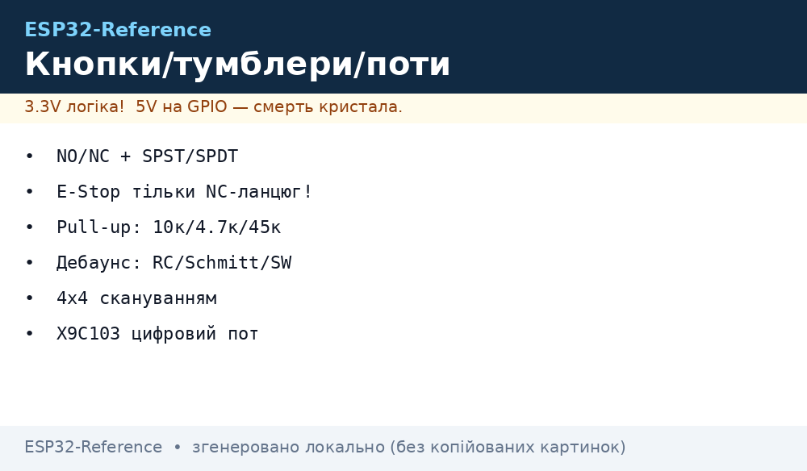
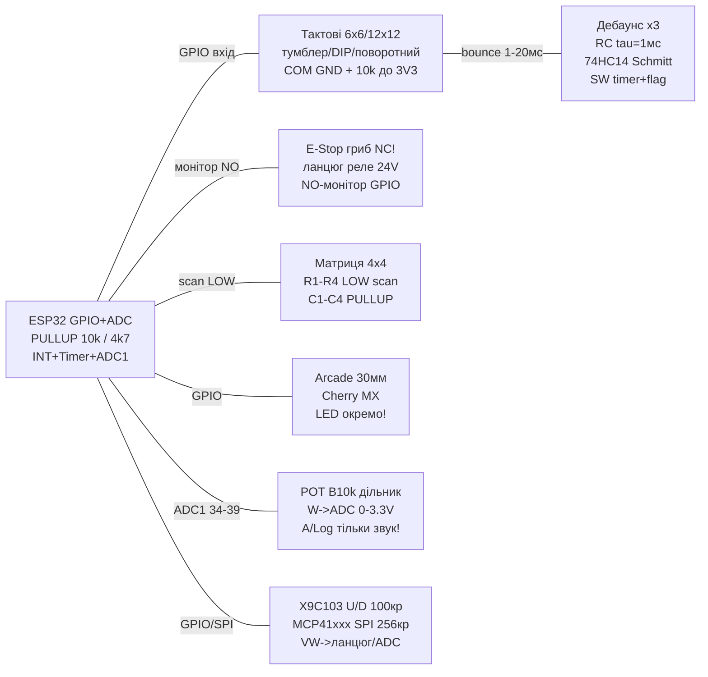

# Кнопки, вимикачі та потенціометри: тактові, тумблери, E-Stop, матриці 4×4, arcade, Cherry MX, RC-дебаунс, Schmitt, X9C103/MCP41xxx


*Рис. 1. Вузол ручного вводу ESP32: тактова кнопка з pull-up, RC + 74HC14, E-Stop NC-ланцюг, матриця 4×4, потенціометр-дільник, цифровий потенціометр.*

> [!danger] Тільки 3.3V на GPIO!
> ESP32 **не толерантний до 5V**. Попередження: **5V через кнопку на GPIO - тільки з pull-up до 3.3V!** Тобто: кнопка замикає пін на GND, а підтяжка йде до **3V3**, ніколи до 5V. Якщо контакт комутує 5V-ланцюг - тільки через дільник або оптопару. Див. [Рівні 3.3V/5V](../../../ESP32-Reference/03-GPIO/03-Pidtyaguvannya-rivni.md).
>
> [!tip] Де це живе
> Кнопка «старт/стоп», тумблер режиму, кінцевик осі 3D-принтера/ЧПК, грибок аварійного стопу, мембранна клавіатура коду доступу, arcade-кнопки аркадного автомата, Cherry MX-клавіатура, ручка гучності на потенціометрі, електронне регулювання через X9C103/MCP41xxx.

## Призначення

Ця нота - повний розбір найпростішого і наймасовішого вводу ESP32: **сухий механічний контакт** (кнопка/тумблер/кінцевик) та **змінний резистор** (потенціометр/тример/цифровий пот). На відміну від [14-DS3231-Encoder-Keypad-Joystick](../../../ESP32-Reference/10-Sensori/14-DS3231-Encoder-Keypad-Joystick.md) (енкодер KY-040, джойстик) та [33-Input-IO-2](../../../ESP32-Reference/10-Sensori/33-Input-IO-2.md) (TTP223/MPR121), тут контакт безпосередньо замикає GPIO на GND/3V3, а потенціометр задає напругу для [ADC](../../../ESP32-Reference/06-Analog/01-ADC.md).

Що покрито: тактові кнопки 6×6/12×12 мм, тумблери/клавішні/повзункові/DIP/поворотні перемикачі, термінологія NO/NC + SPST/SPDT/DPDT з описом контактів, мікроперемикачі-кінцевики, аварійний гриб E-Stop з NC-ланцюгом, мембранні матриці 4×4 зі скануванням, arcade-кнопки 24/30 мм + Cherry MX, розрахунок pull-up резистора (закон Ома `I=E/R`, порівняння 10к vs 4.7к vs внутрішній ~45к), дебаунс трьома способами (RC-ланцюг з `tau=R*C`, тригер Шмітта 74HC14, програмний таймер/переривання+флаг), потенціометри/тримери лінійні (B/Lin) vs логарифмічні (A/Log) як дільники напруги, цифрові потенціометри X9C103 (кнопковий інтерфейс U/D) та MCP41xxx (SPI).

Головне правило цієї ноти: **вхід ESP32 в спокої ніколи не висить у повітрі** - завжди є pull-up або pull-down. Друге правило: **механічний контакт завжди брязкотить (bounce) 1-20 мс** - завжди є дебаунс. Третє: **потенціометр - це дільник, його крайні виводи на 3V3/GND, ніколи на 5V** (інакше повзунок видасть 5V в ADC!).

## Характеристики

### Тактові кнопки та механічні вимикачі

| Тип | Розмір / приклад | Контакти | Струм/ресурс | Куди на ESP32 |
| --- | --- | --- | --- | --- |
| Тактова 6×6 мм | Висота штока 4.3-12 мм, крок 6 мм | 4 виводи = 2 пари (всередині попарно з'єднані!) | ~50 мА 12 В, ~100 тис. натискань | GPIO вхід + pull-up, LOW = натиснута |
| Тактова 12×12 мм | Більший шток, ковпачки круглі/квадратні | 4 виводи, аналогічно 6×6 | ~100 мА, ~100 тис. | Те саме |
| Тумблер (toggle) | MTS-102/103, ON-OFF / ON-ON | SPST / SPDT | 2-6 А 125/250 В AC | GPIO вхід, рівень = положення важеля |
| Клавішний (rocker) | KCD1/KCD3 з підсвіткою (неонка 220 В!) | SPST/DPST, підсвітка окремо! | 6-16 А | Тільки контакти до ESP32, підсвітку - до свого живлення |
| Повзунковий (slide) | SS12D00, 1P2T | SPDT | ~0.5 А | GPIO + перемикання HIGH/LOW |
| DIP-перемикач | 4/8 секцій, крок 2.54 мм | N×SPST, спільний ряд | ~25 мА | Кожна секція = окремий GPIO або матриця |
| Поворотний (rotary switch) | 1P6T/2P6T, галетник | 1 полюс на 6 позицій | ~0.3-2 А | 6 GPIO (або дільник до 1 ADC!) |
| Мікрик/кінцевик | KW11, V-15, ролик/важіль | COM + NO + NC | 1-16 А, хід ~1 мм | COM→GND, NO або NC→GPIO |
| E-Stop грибок | 22 мм, фіксація поворотом, жовте кільце | 1-2× NC (!) + опційно NO | До 10 А, аварійний | NC-ланцюг + окремий GPIO-монітор |
| Мембранна 4×4 | Шлейф 8 пін, плівка | Матриця 4 рядки × 4 стовпці | Пасивна, ~1 млн | 8 GPIO скануванням |
| Arcade 24/30 мм | Прозора/матова, мікрик + LED 5/12 В | NO мікрик + окремі LED-контакти! | ~100 мА контакт | Мікрик→GPIO, LED→через резистор/транзистор |
| Cherry MX | Red/Blue/Brown, 2-4 піни + LED | NO, 2 мм точка спрацювання, 4 мм хід | 50 млн натискань | Матриця діодна або прямий GPIO |

### Термінологія контактів: NO/NC + SPST/SPDT/DPDT (картинка-опис)

| Позначення | Розшифровка | Що це означає | Поведінка |
| --- | --- | --- | --- |
| NO | Normally Open | Нормально розімкнений | У спокої розімкнено, при натисканні замкнуто |
| NC | Normally Closed | Нормально замкнутий | У спокої замкнуто, при натисканні розімкнено |
| COM | Common | Спільний (рухомий) контакт | Перекидається між NO та NC |
| SPST | Single Pole Single Throw | 1 полюс, 1 напрям (вкл/викл) | 2 виводи: замкнуто/розімкнено |
| SPDT | Single Pole Double Throw | 1 полюс, 2 напрями (перекидний) | 3 виводи: COM + NO + NC |
| DPST | Double Pole Single Throw | 2 полюси, 1 напрям | 4 виводи: два незалежні вкл/викл |
| DPDT | Double Pole Double Throw | 2 полюси, 2 напрями | 6 виводів: два перекидні мости |

Картинка-опис контактів (як читати маркування на корпусі):

```text
 SPST (кнопка/тумблер ON-OFF):        SPDT (тумблер ON-ON / мікрик):
   1 o----/ ----o 2                      NC o----\
   спокій: розімкнено                             \___o COM
   натиснуто: 1-2 замкнуто                     NO o----/ (спокій: COM-NC!)
                                                     (натиснуто: COM-NO!)

 DPST (клавішний KCD з 4 ніг):        DPDT (6 ніг, два мости):
   1 o----/ ----o 2                      NC1 o----\___o COM1
   3 o----/ ----o 4                      NO1 o----/
   (обидва мости разом)                  NC2 o----\___o COM2
                                         NO2 o----/
```

> [!warning] Пастка 4-піних тактових кнопок!
> У тактової 6×6 мм 4 піни - це **дві пари, з'єднані всередині**. Пари йдуть уздовж боків (зазвичай 1-2 та 3-4). Якщо підключити щуп до однієї пари - кнопка «завжди натиснута». Правило: продзвонити мультиметром або брати **діагональні** піни (1-3 або 2-4). На макеті кнопку ставити **через канавку** (пари по різні боки канавки).

### Потенціометри, тримери, цифрові поти

| Тип | Маркування | Закон | Опір / кроки | Куди |
| --- | --- | --- | --- | --- |
| Потенціометр лінійний | B10K / Lin | Лінійний: `Vout = Vcc * angle` | 1к-100к, оберт 270° | Середній→ADC, крайні→3V3/GND |
| Потенціометр логарифмічний | A10K / Log/Audio | Логарифмічний (під вухо!) | 10к-100к | Тільки гучність/яскравість «на слух», не для вимірювань! |
| Тример (підстроювальний) | 3296W/3362P | Лінійний, гвинт 25 обертів | 1к-1М | Калібрування порогів компараторів/дільників |
| Повзунковий (slider) | B10K slide | Лінійний | 10к | Мікшери, кросфейдери |
| Джойстик POT | KY-023 (2×10к) | Лінійний | 10к | VRX/VRY→ADC (див. HMI-ноту) |
| X9C103S | Цифровий, U/D-інтерфейс | 100 кроків, енергонезалежний wiper! | 10к (X9C102=1к, X9C104=100к) | INC/U/D + CS → GPIO, VL→ADC |
| MCP41010/MCP41100/MCP4131 | Цифровий, SPI | 256 кроків (8 біт), волатильний | 10к/50к/100к | CS/SCK/SI → SPI ESP32 |
| DS3502/DS1804 | Цифровий, I2C | 128 кроків | 10к | SDA/SCL (альтернатива, не в коді нижче) |

> [!warning] Логарифмічний потенціометр - не для вимірювань!
> A/Log потрібен лише там, де людське сприйняття логарифмічне (гучність, яскравість). Для калібрування датчиків, порогів, керування швидкістю - тільки **лінійний B/Lin**, інакше середина шкали дасть не 1.65 В, а ~0.3 В.

### Розрахунок pull-up: закон Ома `I = E / R`

Вхід ESP32 - КМОН-затвор, струм витоку ~1 мкА. Резистор pull-up задає: (а) струм при натиснутій кнопці, (б) стійкість до наводок.

| Варіант | R | Струм при LOW `I = 3.3/R` | Потужність `P = E²/R` | Швидкість фронту | Коли брати |
| --- | --- | --- | --- | --- | --- |
| Внутрішній pull-up ESP32 | ~45 кОм (30-80 кОм розкид!) | ~73 мкА | ~0.24 мВт | Повільний, плаває від екземпляра | Макет, короткі дроти <10 см, одна кнопка |
| Зовнішній 10 кОм | 10 кОм | 0.33 мА | ~1.1 мВт | Стандарт, фронт ~1 мкс з ємністю 100 пФ | **Базовий вибір для кнопок**, шлейф до 30 см |
| Зовнішній 4.7 кОМ | 4.7 кОм | 0.70 мА | ~2.3 мВт | Швидкий, давить наводки | Довгі дроти, цех, поруч реле/мотори, I2C-стиль |
| Сильний 1 кОм | 1 кОм | 3.3 мА | ~11 мВт | Дуже швидкий | Тільки для агресивних перешкод; гріє/їсть струм у батареї |

Розрахунок покроково (приклад 10 кОм):

```text
E = 3.3 В, R = 10 000 Ом
I = E / R = 3.3 / 10000 = 0.33 мА   (струм через кнопку при натисканні)
P = E * I = 3.3 * 0.00033 ≈ 1.1 мВт (на резисторі, будь-який 0603/0805 підійде)
V_LOW = I_витоку * R ≈ 1 мкА * 10 кОм = 0.01 В  (надійно < 0.8 В порога LOW)
```

Чому не 100 кОм+ на довгих дротах: струм 33 мкА не «пробиває» окислення контактів (потрібен wetting current ~1-10 мА для силових мікриків!) і наводка 50 Гц легко перевалює вхід. Тому для кінцевиків ЧПК - 4.7 кОм, а для силового мікрика з окислами - інколи 1 кОм.

## Легенда пінів модуля

### Тактова кнопка 6×6 (4 піни = 2 пари)

| Пін кнопки | Призначення | Куди на ESP32 |
| --- | --- | --- |
| Пін 1-2 (пара A, продзвонюється завжди) | Одна сторона моста | GND |
| Пін 3-4 (пара B) | Друга сторона моста | GPIO (вхід + pull-up), LOW = натиснута |
| Корпус | Механіка | Через канавку макету! |

### Тумблер SPDT / мікрик-кінцевик (COM/NO/NC)

| Пін | Призначення | Куди |
| --- | --- | --- |
| COM | Рухомий контакт | GND (схема з pull-up!) |
| NO | Замкнуто при спрацюванні | GPIO (режим: кнопка без фіксації) |
| NC | Замкнуто у спокої | GPIO (режим: контроль обриву/E-Stop!) |

### E-Stop грибок (аварійний, NC-ланцюг!)

| Пін | Призначення | Куди |
| --- | --- | --- |
| NC1-NC2 | Аварійний ланцюг, розмикається грибком | Послідовно в ланцюг живлення котушки реле/драйвера! |
| NO (опційно) | Сигнальний «грибок натиснуто» | GPIO з pull-up → GND через NO |
| Монітор NC | Контроль цілісності ланцюга | Другий GPIO через оптопару (див. схему) |

### Мембранна клавіатура 4×4 (шлейф 8 пін)

| Пін шлейфу | Призначення | Куди |
| --- | --- | --- |
| R1-R4 | Рядки-виходи | GPIO-виходи (по черзі LOW) |
| C1-C4 | Стовпці-входи | GPIO-входи `INPUT_PULLUP` (натиснута = LOW на перетині) |

### Arcade-кнопка + Cherry MX

| Пін | Призначення | Куди |
| --- | --- | --- |
| Мікрик COM/NO (arcade) | Контакт натискання | COM→GND, NO→GPIO + pull-up |
| LED arcade (+/−) | Підсвітка 5/12 В (!), не контакт! | Через резистор/транзистор до свого БЖ, не до GPIO! |
| Cherry MX 1-2 | NO-контакт | Матриця з діодами або прямий GPIO |
| Cherry MX LED +/− | Підсвітка (опційно) | Окремо, не плутати з контактом! |

### Потенціометр / тример (дільник!)

| Пін | Призначення | Куди |
| --- | --- | --- |
| Крайній A | Верх дільника | 3V3 (ніколи 5V!) |
| Крайній B | Низ дільника | GND |
| Повзунок W | Вихід `Vout = 3.3 * Rниз / (Rверх+Rниз)` | GPIO34-39 (ADC1!) |

### X9C103S (цифровий, U/D) / MCP41xxx (SPI)

| X9C103S | Призначення | Куди |
| --- | --- | --- |
| VCC/GND | 5 В або 3.3 В (логіка = живлення!) | 5V/3V3 + GND (для ESP32 краще 3.3 В) |
| INC / U/D / CS | Такт / напрям / вибір | GPIO (виходи) |
| VH/VL/VW | Верх/низ/повзунок реостата | VW→ADC або в ланцюг, VH/VL→опори |
| MCP41xxx CS/SCK/SI | SPI | GPIO5/18/23 ([SPI](../../../ESP32-Reference/04-Shini/02-SPI.md)) |

## Схема підключення

| ESP32 | Кнопка/тумблер | Матриця 4×4 | Потенціометр | X9C/MCP | Примітка |
| --- | --- | --- | --- | --- | --- |
| 3V3 | Pull-up 10 кОм до 3V3! | - | Верх пота | VCC (3.3 В) | Pull-up тільки до 3V3! |
| GND | Другий бік кнопки | - | Низ пота | GND | Спільна земля |
| GPIO4 | Кнопка (LOW=натиск) | - | - | - | `INPUT_PULLUP` або зовнішній 10к |
| GPIO16/17 | Тумблер SPDT (COM→GND) | - | - | X9C INC/U/D | Переривання/флаг |
| GPIO19/23/5/13 | - | R1-R4 (виходи) | - | - | Сканування рядків |
| GPIO12/14/26/25 | E-Stop NO-монітор | C1-C4 (входи PULLUP) | - | - | Не тиснути клавіші при boot (GPIO12 strapping!) |
| GPIO34 | Кінцевик NC-контроль | - | Повзунок W | VW | ADC1, тільки вхід |
| GPIO18/23/19/5 | - | - | - | MCP SCK/SI/SO/CS | SPI |

### ASCII-схема

Кнопка з pull-up (база, LOW = натиснута):

```text
 3V3 ---[10k]---+--- GPIO4 (INPUT_PULLUP або зовнішній)
                |
               o /o  тактова 6x6 (діагональні ніжки!)
                |
 GND -----------+--- GND кнопки
 Натиснута: GPIO=0; відпущена: GPIO=1 (3.3 В через 10к)
 СТРУМ: I = 3.3/10000 = 0.33 мА
```

> [!danger] ЗАБОРОНЕНО: 5V через кнопку на GPIO!
>
> ```text
>  ПОГАНО:  5V ---[10k]--- GPIO --- кнопка --- GND  => на GPIO 5V, ESP32 деградує!
>  ДОБРЕ:   3V3 ---[10k]--- GPIO --- кнопка --- GND  => максимум 3.3V
>  Якщо треба комутувати 5V: кнопка в ланцюзі 5V + окремий NPN/оптопара до GPIO.
> ```

RC-дебаунс + Schmitt 74HC14 (спосіб 1+2, див. розділ дебаунсу):

```text
 3V3 ---[10k]---+---[10k]---+---|>(o--- GPIO (чистий фронт!)
                |           |   | 74HC14
               o /o        === 100нФ
                |           |
 GND -----------+-----------+--- GND
 tau = R*C = 10k * 100нФ = 1.0 мс (брязкіт 1-5мс давиться, затримка ~1мс)
 74HC14: Vt+ ≈ 2.9В, Vt- ≈ 1.9В (при 5В; при 3.3В ≈ 1.9/1.2В), гістерезис ~0.7-1В
 Живлення 74HC14: строго 3.3В (щоб вихід не видав 5V в ESP32!)
```

E-Stop NC-ланцюг (аварійний!):

```text
 +24В ---[запобіжник]--- NC(E-Stop) --- котушка реле --- GND
                              |
                         (доп. NO-контакт грибка)
                              +--- GPIO (PULLUP) --- GND при аварії = LOW
 Логіка: обрив/натискання грибка РОЗМИКАЄ NC => реле падає НЕЗАЛЕЖНО від ESP32!
 ESP32 тільки МОНІТОРИТЬ (не керує захистом!). Скидання — поворотом грибка.
```

Матриця 4×4 (сканування):

```text
      C1   C2   C3   C4  (входи PULLUP: GPIO12/14/26/25)
       |    |    |    |
 R1 ---+----+----+----+--- [1][2][3][A]
 R2 ---+----+----+----+--- [4][5][6][B]  (виходи: GPIO19/23/5/13)
 R3 ---+----+----+----+--- [7][8][9][C]
 R4 ---+----+----+----+--- [*][0][#][D]
 Цикл: R1=LOW (інші HIGH-Z), читаємо C1-C4; далі R2...; LOW на перетині = клавіша.
 Ghosting: без діодів 2+ клавіші дають фантоми — тільки по одній!
```

Потенціометр-дільник + тример порога:

```text
 3V3 ---+---[10k верх пота]---+--- GPIO34 (ADC1, 0-3.3В!)
        |                     |
       POT 10k Lin           [W повзунок]
        |                     |
 GND ---+---------------------+--- GND
 Vout = 3.3 * Rниж/(Rверх+Rниж); середина = 1.65В => ADC ≈ 2048 (ідеально)
 Тример 3296 як верхнє плече дільника — калібрування порога компаратора.
```

X9C103 (U/D) та MCP41100 (SPI):

```text
 X9C103S:  GPIO16 ---> INC (імпульс вниз = крок)
           GPIO17 ---> U/D (HIGH=вгору, LOW=вниз)
           GPIO5  ---> CS (LOW=активний)
           VW ---> ADC або в ланцюг (100 кроків, пам'ять wiper!)
 MCP41100: GPIO18 ---> SCK, GPIO23 ---> SI, GPIO5 ---> CS (SPI, 256 кроків)
           A/B = кінці резистора, W = повзунок (реостат/потенціометр)
```

### Mermaid



## Дебаунс трьома способами (обов'язково!)

Механічний контакт при замиканні дзвенить: серія імпульсів 1-20 мс. Без дебаунсу один натиск = 5-50 спрацювань лічильника/переривання.

### Спосіб 1 - RC-ланцюг (апаратний, розрахунок tau)

Низькочастотний фільтр `R2 + C` згладжує брязкіт. Стала часу `tau = R * C`.

```text
R2 = 10 кОм, C = 100 нФ => tau = 10000 * 100e-9 = 1.0 мс
Правило: tau ≈ (2-3) × тривалість брязкоту, але << тривалості натискання.
Брязкіт 5 мс => tau 1 мс (R=10к, C=100нФ). Довгий брязкіт мікрика 10-20мс => C=470нФ (tau=4.7мс).
Затримка натискання ≈ 0.7-1×tau — непомітна для пальця (1-5мс).
```

Плюси: нуль коду, давить і ЕМІ-наводки. Мінуси: повільний фронт (повільний перехід через поріг 1.6 В дає кратні спрацювання без Шмітта!) - тому RC завжди в парі зі способом 2 або програмним гістерезисом.

### Спосіб 2 - Тригер Шмітта 74HC14 (апаратний, ідеальний фронт)

Інвертор з гістерезисом: верхній поріг `Vt+`, нижній `Vt-`, різниця ~0.7-1 В «ковтає» повільний фронт RC і залишковий брязкіт.

| Параметр 74HC14 | При VCC=3.3 В | При VCC=5 В |
| --- | --- | --- |
| Vt+ (наростання) | ~1.9 В | ~2.9 В |
| Vt− (спадання) | ~1.2 В | ~1.9 В |
| Гістерезис | ~0.7 В | ~1.0 В |
| Затримка | ~15 нс | ~15 нс |

Ланцюг: кнопка → RC (10к/100нФ) → 74HC14 (2 інвертори послідовно = неінверсія) → GPIO. Живлення 74HC14 - **строго 3.3 В**, інакше його вихід 5 В вб'є GPIO! Невикористані входи 74HC14 - на GND/VCC (не висіти!).

### Спосіб 3 - Програмний (таймер + переривання + флаг, рекомендовано)

Переривання лише фіксує факт (флаг + мітка часу), рішення приймає таймер/loop через 20-50 мс. В ISR - мінімум коду, ніяких `delay`!

Алгоритм: `ISR (FALLING) → flag=true, t=millis()` → `loop: якщо flag і millis()-t>30мс і пін досі LOW → натискання підтверджено, flag=false`. Альтернатива без переривань - опитування кожні 10 мс + лічильник стабільних станів (3× поспіль = стабільно). Див. код нижче у трьох стеках.

## Код ESP-IDF

```c
#include "driver/gpio.h"
#include "driver/adc.h"
#include "esp_log.h"
#include "esp_timer.h"
#include "freertos/FreeRTOS.h"
#include "freertos/task.h"

#define BTN GPIO_NUM_4
#define TUMBLER GPIO_NUM_16
#define ESTOP_MON GPIO_NUM_25
#define POT_CH ADC1_CHANNEL_6 // GPIO34
static const char *TAG = "btn";
static volatile bool btn_evt = false;
static volatile int64_t btn_t = 0;

// Спосіб 3: ISR тільки ставить флаг + мітку часу!
static void IRAM_ATTR btn_isr(void *a) {
    btn_t = esp_timer_get_time();
    btn_evt = true;
}

void app_main(void) {
    // Кнопка: вхід + внутрішній pull-up (~45к); для довгих дротів — зовнішній 10к/4.7к!
    gpio_config_t c = {.pin_bit_mask = (1ULL<<BTN)|(1ULL<<TUMBLER)|(1ULL<<ESTOP_MON),
        .mode = GPIO_MODE_INPUT, .pull_up_en = GPIO_PULLUP_ENABLE,
        .pull_down_en = GPIO_PULLDOWN_DISABLE, .intr_type = GPIO_INTR_NEGEDGE};
    gpio_config(&c);
    gpio_install_isr_service(0);
    gpio_isr_handler_add(BTN, btn_isr, NULL);

    adc1_config_width(ADC_WIDTH_BIT_12);
    adc1_config_channel_atten(POT_CH, ADC_ATTEN_DB_11); // 0-3.3В

    bool last_btn = true;
    for (;;) {
        // Програмний дебаунс: флаг + 30мс + перевірка рівня
        if (btn_evt && (esp_timer_get_time() - btn_t > 30000)) {
            btn_evt = false;
            bool lvl = gpio_get_level(BTN);
            if (lvl == 0 && last_btn) {
                ESP_LOGI(TAG, "BTN PRESS (debounced 30ms)");
                last_btn = false;
            } else if (lvl == 1) last_btn = true;
        }
        int t = gpio_get_level(TUMBLER);   // SPDT: положення важеля
        int e = gpio_get_level(ESTOP_MON); // E-Stop NO-монітор: LOW = аварія!
        if (e == 0) ESP_LOGE(TAG, "E-STOP ACTIVE! NC-ланцюг розімкнено");
        int raw = adc1_get_raw(POT_CH);    // POT B10K: середина ~2048
        float v = raw * 3.3f / 4095.0f;
        ESP_LOGI(TAG, "tumbler=%d estop=%d pot=%d (%.2fV)", t, e, raw, v);
        vTaskDelay(pdMS_TO_TICKS(200));
    }
}
// X9C103: INC/U/D імпульси через gpio_set_level (крок = 1 FALLING на INC при CS=LOW).
// MCP41xxx: SPI-передача 2 байт (команда + дані) через spi_device_transmit, CS=GPIO5.
```

## Код Arduino

```cpp
#include <Keypad.h>

#define BTN 4
#define TUMBLER 16
#define ESTOP_MON 25
#define POT 34
// X9C103 піни
#define X9_INC 17
#define X9_UD 18
#define X9_CS 5

volatile bool btnEvt = false;
volatile unsigned long btnT = 0;
void IRAM_ATTR onBtn() { btnT = millis(); btnEvt = true; } // тільки флаг!

const byte ROWS = 4, COLS = 4;
char keys[ROWS][COLS] = {{'1','2','3','A'},{'4','5','6','B'},{'7','8','9','C'},{'*','0','#','D'}};
byte rowP[ROWS] = {19, 23, 5, 13};
byte colP[COLS] = {12, 14, 26, 25};
Keypad kb = Keypad(makeKeymap(keys), rowP, colP, ROWS, COLS);

void x9_step(bool up) { // один крок X9C103
  digitalWrite(X9_UD, up);
  digitalWrite(X9_CS, LOW);
  digitalWrite(X9_INC, HIGH); delayMicroseconds(2);
  digitalWrite(X9_INC, LOW);  delayMicroseconds(2);
  digitalWrite(X9_CS, HIGH);
}

void setup() {
  Serial.begin(115200);
  pinMode(BTN, INPUT_PULLUP);
  pinMode(TUMBLER, INPUT_PULLUP);
  pinMode(ESTOP_MON, INPUT_PULLUP);
  attachInterrupt(digitalPinToInterrupt(BTN), onBtn, FALLING);
  pinMode(X9_INC, OUTPUT); pinMode(X9_UD, OUTPUT); pinMode(X9_CS, OUTPUT);
  digitalWrite(X9_CS, HIGH);
  analogReadResolution(12);
}

void loop() {
  static bool lastBtn = HIGH;
  // Дебаунс 30мс: флаг з ISR + перевірка рівня
  if (btnEvt && (millis() - btnT > 30)) {
    btnEvt = false;
    bool lvl = digitalRead(BTN);
    if (lvl == LOW && lastBtn == HIGH) { Serial.println("BTN PRESS"); lastBtn = LOW; }
    else if (lvl == HIGH) lastBtn = HIGH;
  }
  char k = kb.getKey(); // матриця 4x4: сканування всередині бібліотеки + дебаунс
  if (k) { Serial.printf("KEY=%c\n", k); if (k == '+') x9_step(true); if (k == '-') x9_step(false); }
  int raw = analogRead(POT); // B10K: 0-4095
  Serial.printf("tumbler=%d estop=%d pot=%d (%.2fV)\n",
    digitalRead(TUMBLER), digitalRead(ESTOP_MON), raw, raw * 3.3 / 4095.0);
  delay(200);
}
// MCP41xxx (SPI): SPI.begin(18,19,23,5); SPI.transfer16(0x1100 | val) — wiper 0-255.
```

## Код MicroPython

```python
from machine import Pin, ADC
import time

btn = Pin(4, Pin.IN, Pin.PULL_UP)
tumbler = Pin(16, Pin.IN, Pin.PULL_UP)
estop = Pin(25, Pin.IN, Pin.PULL_UP)  # LOW = аварія!
pot = ADC(Pin(34)); pot.atten(ADC.ATTN_11DB)

# X9C103 керування
x_inc = Pin(17, Pin.OUT, value=1)
x_ud = Pin(18, Pin.OUT, value=1)
x_cs = Pin(5, Pin.OUT, value=1)

def x9_step(up=True):
    x_ud.value(1 if up else 0)
    x_cs.value(0)
    x_inc.value(1); time.sleep_us(2)
    x_inc.value(0); time.sleep_us(2)
    x_cs.value(1)

# Програмний дебаунс: переривання ставить флаг, loop підтверджує через 30мс
_evt = [False, 0]
def on_btn(p):
    _evt[0] = True; _evt[1] = time.ticks_ms()
btn.irq(trigger=Pin.IRQ_FALLING, handler=on_btn)

# Матриця 4x4 скануванням (рядки-виходи, стовпці-входи PULLUP)
rows = [Pin(p, Pin.OUT, value=1) for p in (19, 23, 5, 13)]
cols = [Pin(p, Pin.IN, Pin.PULL_UP) for p in (12, 14, 26, 25)]
KEYS = ["123A", "456B", "789C", "*0#D"]
def scan():
    for i, r in enumerate(rows):
        r.value(0); time.sleep_us(50)
        for j, c in enumerate(cols):
            if c.value() == 0:
                time.sleep_ms(20)  # дебаунс клавіші
                if c.value() == 0:
                    r.value(1); return KEYS[i][j]
        r.value(1)
    return None

last = 1
while True:
    if _evt[0] and time.ticks_diff(time.ticks_ms(), _evt[1]) > 30:
        _evt[0] = False
        lvl = btn.value()
        if lvl == 0 and last == 1:
            print("BTN PRESS"); last = 0
        elif lvl == 1:
            last = 1
    k = scan()
    if k: print("KEY=", k)
    raw = pot.read()
    print("tumbler={} estop={} pot={} {:.2f}V".format(tumbler.value(), estop.value(), raw, raw * 3.3 / 4095))
    if estop.value() == 0:
        print("! E-STOP ACTIVE");
    time.sleep_ms(200)
```

## Типові помилки

| № | Помилка | Симптом | Рішення |
| --- | --- | --- | --- |
| 1 | 5V pull-up до GPIO через кнопку | GPIO «плавиться», перезавантаження, смерть піна | Pull-up тільки до 3V3! 5V-ланцюг - через оптопару/NPN |
| 2 | Вхід без pull-up (висить у повітрі) | Хаотичні 0/1, реагує на руку | `INPUT_PULLUP` або зовнішній 10 кОм до 3V3 |
| 3 | Тактова 6×6 підключена в межах однієї пари | «Завжди натиснута» | Брати діагональні піни, продзвонити пари |
| 4 | Внутрішній 45 кОм на довгому шлейфі | Хибні спрацювання біля моторів | Зовнішній 4.7 кОм (0.7 мА), екран/кручена пара |
| 5 | Немає дебаунсу | Один натиск = 5-50 спрацювань | RC 10к/100нФ + 74HC14 або програмні 30 мс |
| 6 | `delay(50)` всередині ISR | Watchdog reset, пропуски | В ISR тільки флаг+час; затримка в loop |
| 7 | RC без Шмітта на перериванні | Серія переривань на одному фронті | Додати 74HC14 (VCC=3.3 В!) або програмний гістерезис |
| 8 | 74HC14 живиться від 5 В | 5 В на GPIO з виходу | Живити 74HC14 від 3.3 В; невикористані входи на GND/VCC |
| 9 | E-Stop заведений тільки в ESP32 (SW-стоп) | При зависанні прошивки захисту немає | NC-ланцюг рве живлення реле безпосередньо; ESP32 лише монітор |
| 10 | Матриця без дебаунсу/з довгим шлейфом | Фантоми, двійні символи | Дебаунс 20 мс, шлейф <30 см; N-key не підтримується без діодів |
| 11 | GPIO12 у матриці + натискання при boot | ESP32 не завантажується | На час reset не тиснути; або перенести стовпець з GPIO12 |
| 12 | Логарифмічний пот для вимірювань | Середина шкали ≠ 1.65 В | Для вимірювань тільки B/Lin; A/Log лише гучність |
| 13 | Потенціометр від 5 В (край на 5V) | До 5 В на ADC, смерть ADC | Крайні тільки 3V3/GND; 5V-пот - через дільник 2:1 |
| 14 | Arcade-LED 5/12 В підключено до GPIO | Згорілий пін/LED | LED через резистор до свого БЖ або через NPN; контакт окремо |
| 15 | X9C103 живиться 5 В, а VW в ADC | 5 В на ADC | Живити X9C від 3.3 В або VW через дільник; VH≤VCC логіки |

## Офіційні джерела

- [GPIO & RTC GPIO - ESP-IDF Programming Guide (Espressif)](https://docs.espressif.com/projects/esp-idf/en/stable/esp32/api-reference/peripherals/gpio.html) - режими GPIO, pull-up/pull-down, переривання, `gpio_config`.
- [Quick reference for the ESP32 - MicroPython docs](https://docs.micropython.org/en/latest/esp32/quickref.html) - `machine.Pin` (PULL_UP), IRQ, ADC/atten, Timer.
- [ESP32 Digital Inputs and Outputs - Random Nerd Tutorials](https://randomnerdtutorials.com/esp32-digital-inputs-outputs-arduino/) - `pinMode`/`digitalRead`, кнопка + LED, pull-down розрахунок.
- [SN74HC14 Hex Schmitt-Trigger Inverters - Texas Instruments](https://www.ti.com/product/SN74HC14) - даташит: пороги Vt+/Vt−, гістерезис, затримки.
- [ESP32 ADC - Read Analog Values - Random Nerd Tutorials](https://randomnerdtutorials.com/esp32-adc-analog-read-arduino-ide/) - `analogRead`, нелінійність ADC, атенюація, читання потенціометра.

## Див. також

- [Головна карта довідника](../../../ESP32-Reference/Home.md)
- [GPIO огляд](../../../ESP32-Reference/03-GPIO/01-GPIO-oglyad.md)
- [Переривання/PWM](../../../ESP32-Reference/03-GPIO/04-Pererivannya-PWM.md)
- [RTC/HMI: енкодер, клавіатура, джойстик](../../../ESP32-Reference/10-Sensori/14-DS3231-Encoder-Keypad-Joystick.md)
- [Електронні IO: TTP223/MPR121/експандери](../../../ESP32-Reference/10-Sensori/33-Input-IO-2.md)
- [ADC](../../../ESP32-Reference/06-Analog/01-ADC.md)
- [Промислові входи: індуктивні/фотоелектричні/NPN-PNP](../../../ESP32-Reference/12-Moduli-zvyazku/14-Proximity-Inputs.md)
