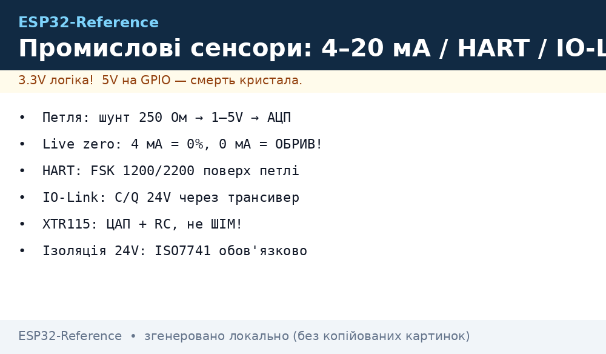
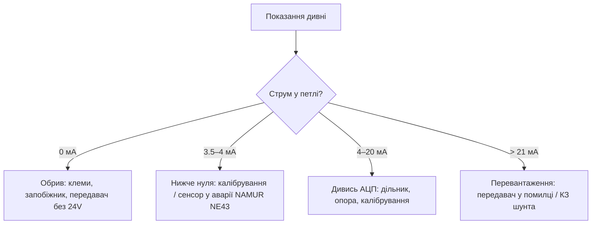
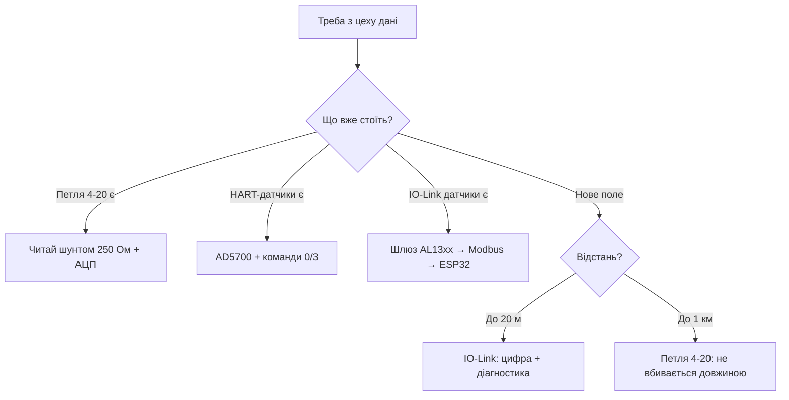

# Промислові сенсори: IO-Link, HART, петля 4-20 мА

## Призначення

Заводський цех говорить трьома мовами: IO-Link (точка-точка 24V), HART (FSK поверх 4-20 мА) і сама петля 4-20 мА (аналоговий стандарт з 1970-х, який переживе всіх). ESP32 вміє всі три - але через ізоляцію і з повагою до 24V.

База: старт - [Home](../../../ESP32-Reference/Home.md), 4-20 мА передавач - [10-Industrial](../../../ESP32-Reference/12-Moduli-zvyazku/10-Industrial.md), тиск/рівень - [24-Pressure-Level-Flow](../../../ESP32-Reference/10-Sensori/24-Pressure-Level-Flow.md), точний АЦП - [27-Time-Mem-IO-DAC](../../../ESP32-Reference/10-Sensori/27-Time-Mem-IO-DAC.md), ізоляція - [04-PCB-Design](../../../ESP32-Reference/17-Lab/04-PCB-Design.md), корпус - [03-Enclosure-Cert-Factory](../../../ESP32-Reference/17-Lab/03-Enclosure-Cert-Factory.md).

> [!danger] 24V промисловості і ESP32
> Жоден пін ESP32 не бачить 24V. Будь-який промисловий сенсор підключається ТІЛЬКИ через: передавач/приймач 4-20 мА, IO-Link-трансивер, або хоча б дільник + TVS + опто/цифрова ізоляція. Прямий дріт «подивитись що буде» = мертвий кристал + мертвий сенсор.


*Рис. Три гілки: IO-Link (C/Q 24V через трансивер), HART-модем поверх петлі, прийом 4-20 мА через 250 Ом + АЦП з ізоляцією.*

## Характеристики трьох стандартів

| Параметр | IO-Link | HART | Петля 4-20 мА |
| --- | --- | --- | --- |
| Фізика | 3-провід: 24V + GND + C/Q (дані) | 2-провід: 4-20 мА + FSK 1200/2200 Гц поверх | 2-провід: струм 4-20 мА |
| Топологія | Точка-точка (master→device) | Точка-точка або multidrop (до 15) | Точка-точка |
| Швидкість | COM1 4.8 / COM2 38.4 / COM3 230.4 кбод | 1200 бод (Bell 202) | Аналог (смуга ~10 Гц) |
| Живлення сенсора | По тій самій лінії (до 200 мА, Class A/B) | По петлі (live zero 4 мА живить!) | По петлі |
| Діагностика | IODD-файл: параметри, події, серійник | Універсальні + специфічні команди | Тільки «<4 мА = обрив» |
| Стандарт | IEC 61131-9 | IEC 62591 (WirelessHART - окремо!) | Де-факто з 1970-х |

> Live zero - геніальність петлі: 4 мА = «нуль шкали», а 0 мА = «обрив дроту». Тому обрив відрізняється від нуля без жодного додаткового біта.

## 1. Петля 4-20 мА: прийом на ESP32

### 1.1. Схема: шунт 250 Ом → 1-5V → дільник → АЦП

```text
Петля від передавача (24V, 4–20 мА):
  (+) ──► [запобіжник PTC] ──► [TVS 5V] ──► [шунт 250 Ом 0.1%] ──► (−) повернення
                                          │
                                     1–5V точка ──[дільник 10к/20к]──► 0.66–3.3V ──► ADC GPIO34
                                          │
                                    [100 нФ до GND] (фільтр 50 Гц!)
Розрахунок: 4 мА × 250 Ом = 1.0V; 20 мА × 250 Ом = 5.0V; далі дільник /1.5.
Точність: шунт 0.1% + калібрування за двома точками (4 і 20 мА).
```

### 1.2. Передача 4-20 мА з ESP32 (XTR115/XTR116)

```text
ESP32 ──PWM/ЦАП (MCP4725!)──► [RC-фільтр] ──► VIN XTR115 ──► петля 4–20 мА (24V)
  XTR115: перетворювач 0–5V → 4–20 мА, двошпровідний, живлення З ПЕТЛІ.
  НЕ годувати XTR з ШІМ безпосередньо: пульсації ШІМ = шум у петлі. Тільки через ЦАП + RC.
  Калібрування: ЦАП 0 → підстроїти 4.00 мА; ЦАП max → 20.00 мА (два тримери).
```

### 1.3. Mermaid: діагностика петлі



## 2. HART: FSK-шепіт поверх петлі

HART кладе цифру (1200 бод, Bell 202: 1200/2200 Гц) поверх аналогового струму ±0.5 мА - петля продовжує працювати, а зверху їде діагностика.

| Параметр | Значення |
| --- | --- |
| Модуляція | FSK: 1200 Гц = «1», 2200 Гц = «0», амплітуда ±0.5 мА |
| Швидкість | 1200 бод, напівдуплекс (master/slave) |
| Адресація | 0 (аналог+цифра) або 1-15 (multidrop, струм фіксовано 4 мА!) |
| Команди | Universal (0-30: читати PV, Units), Common Practice, Device-Specific |
| Модем-чіпи | AD5700/AD5700-1 (повний HART-модем, SPI/UART), DS8500, або софт-модем |

### 2.1. Підключення HART-модема AD5700 до ESP32

```text
Петля 4–20 мА ──[C-модемний трансформатор/RC]──► AD5700 ──UART──► ESP32 (GPIO16/17)
  AD5700 живиться 3.3V, споживає ~300 мкА в прийомі.
  Софт-альтернатива без чипа: АЦП читає FSK (дискретизація ≥ 8 кГц!) +
  ЦАП генерує FSK через RC — працює, але їсть CPU і чутливе до шуму.
  Для серії — тільки апаратний модем.
```

### 2.2. Мінімальна HART-сесія (універсальні команди)

```text
Команда 0 (читати унікальний ID): преамбула 5×0xFF + 0x02 + addr + 0x00 + 0x00 + CRC
  ← відповідь: manufacturer ID + device type + серійник (ідентифікація датчика!)
Команда 1 (читати PV): ← значення + одиниці (⁴C, бар, %...)
Команда 3 (читати 4 змінні): ← PV/SV/TV/QV одним пакетом — стандартний опит!
```

## 3. IO-Link: C/Q-лінія 24V

IO-Link - точка-точка: master-порт ↔ один device. Фізично та сама 3-жила (коричневий 24V, синій GND, чорний C/Q), логічно - UART-подібний протокол з пробудженням (wake-up імпульс) і трьома швидкостями.

| Параметр | Значення |
| --- | --- |
| Клас порту | Class A (4 піни: L+, C/Q, L−, +DI) / Class B (додаткове живлення) |
| Wake-up | Master тягне C/Q, device відповідає зі своєю швидкістю |
| Кадр | UART 8E1-ish + контрольна сума (CKT), цикли 400 мкс - 100+ мс |
| IODD | XML-опис device: параметри, діагностика, картинка для PLC-софта |
| Трансивери | MAX14827A, L6360, TIOL111 (перетворюють 24V C/Q ↔ 3.3V UART) |

```text
ESP32 ──UART──► [MAX14827A / L6360] ──C/Q (24V!)──► IO-Link сенсор (напр. IFM/Turck/Balluff)
  Живлення сенсора: 24V окремим DC-DC (не від ESP32!).
  Ізоляція UART: ISO7741 між ESP32 і трансивером (див. 17-Lab/04).
  Wake-up і зміну COM-швидкості реалізує прошивка master-стека (напр. порт TI-стека).
  Чесно: повний IO-Link-master на ESP32 — проєкт на місяці; для 1–2 сенсорів
  дешевше взяти готовий USB/Modbus-шлюз IO-Link (IFM AL13xx) і читати його по Modbus!
```

### Mermaid: що вибрати



## Код (3 фреймворки)

### Arduino - читання петлі 4-20 мА з калібруванням

```cpp
// Петля → 250 Ом → дільник → GPIO34. Калібрування: i4/adc4, i20/adc20.
const int PIN = 34;
int adc4 = 850, adc20 = 3900;  // виміряти при 4.00 і 20.00 мА!
float loop_mA() {
  long s = 0; for (int i = 0; i < 64; i++) { s += analogRead(PIN); delay(2); }
  float adc = s / 64.0;
  return 4.0 + (adc - adc4) * 16.0 / (adc20 - adc4);
}
void setup() {
  Serial.begin(115200);
  analogReadResolution(12);
  analogSetAttenuation(ADC_11db);
}
void loop() {
  float ma = loop_mA();
  float pct = (ma - 4.0) / 16.0 * 100.0;  // 0–100% шкали
  if (ma < 3.6) Serial.println("ОБРИВ ПЕТЛІ!");
  else Serial.printf("%.2f мА = %.1f%%\n", ma, pct);
  delay(1000);
}
```

### MicroPython - читання петлі

```python
from machine import ADC, Pin
import time
adc = ADC(Pin(34)); adc.atten(ADC.ATTN_11DB); adc.width(ADC.WIDTH_12BIT)
ADC4, ADC20 = 850, 3900  # калібрування!
def loop_ma(n=64):
    s = sum(adc.read() for _ in range(n)) / n
    return 4.0 + (s - ADC4) * 16.0 / (ADC20 - ADC4)
while True:
    ma = loop_ma()
    print("ОБРИВ!" if ma < 3.6 else "%.2f мА" % ma)
    time.sleep(1)
```

### ESP-IDF - читання петлі (калбрований ADC)

```c
// adc_oneshot + curve fitting (див. [[06-Analog/01-ADC|ADC]]): зняти криву за двома
// точками 4/20 мА, далі лінійна інтерполяція; усереднення 64 семпли проти 50 Гц.
```

## Типові помилки

| # | Помилка | Чому погано | Як правильно |
| --- | --- | --- | --- |
| 1 | 24V безпосередньо в GPIO/АЦП | Мертвий кристал | Шунт + дільник + TVS, розділ 1.1 |
| 2 | Шунт 5% без калібрування | Похибка 5% + дрейф | 0.1% + дві точки 4/20 мА |
| 3 | ШІМ безпосередньо в XTR115 | Шум у петлі, PLC лається | ЦАП + RC-фільтр |
| 4 | 0 мА = «нуль» | Це ОБРИВ, не нуль! | Live zero: 4 мА = 0% |
| 5 | HART без модема «на слух» | 1200 бод FSK софтом - крихко | AD5700 для серії |
| 6 | IO-Link-master «за вечір» | Wake-up + CKT + IODD - місяці | Шлюз AL13xx → Modbus |
| 7 | Спільна земля 24V і ESP32 без ізоляції | Петлі, кидки, зварка поруч | ISO7741 + окремий DC-DC |
| 8 | C/Q поруч із силовими | Наведення вбиває кадри | Окремий кабель/лоток |
| 9 | Multidrop HART з аналогом | Конфлікт струмів! | Multidrop = всі адреси 1-15, струм 4 мА фікс |
| 10 | Передача XTR без 24V петлі | XTR живиться З ПЕТЛІ | Спочатку 24V, потім сигнал |

## Офіційні джерела

- [IO-Link Consortium - специфікації](https://io-link.com/downloads) - IEC 61131-9, IODD, COM-режими.
- [HART Communication Foundation (FieldComm Group)](https://www.fieldcommgroup.org/technologies/hart) - команди, Bell 202, multidrop.
- [XTR115/XTR116 datasheet (TI)](https://www.ti.com/product/XTR115) - передавач 4-20 мА, калібрування.
- [AD5700 HART modem (ADI)](https://www.analog.com/en/products/ad5700.html) - модем, типові схеми.

## Див. також

- [Головна](../../../ESP32-Reference/Home.md)
- [Промисловість: шини і 220V](../../../ESP32-Reference/12-Moduli-zvyazku/10-Industrial.md)
- [SIM + живлення](../../../ESP32-Reference/12-Moduli-zvyazku/26-SIM-Power.md)
- [Тиск/рівень/потік](../../../ESP32-Reference/10-Sensori/24-Pressure-Level-Flow.md)
- [RTC/FRAM/IO/ЦАП](../../../ESP32-Reference/10-Sensori/27-Time-Mem-IO-DAC.md)
- [ADC](../../../ESP32-Reference/06-Analog/01-ADC.md)
- [I2C](../../../ESP32-Reference/04-Shini/03-I2C.md)
- [UART](../../../ESP32-Reference/04-Shini/01-UART.md)
- [PCB-Design](../../../ESP32-Reference/17-Lab/04-PCB-Design.md)
- [Корпус/сертифікація](../../../ESP32-Reference/17-Lab/03-Enclosure-Cert-Factory.md)
