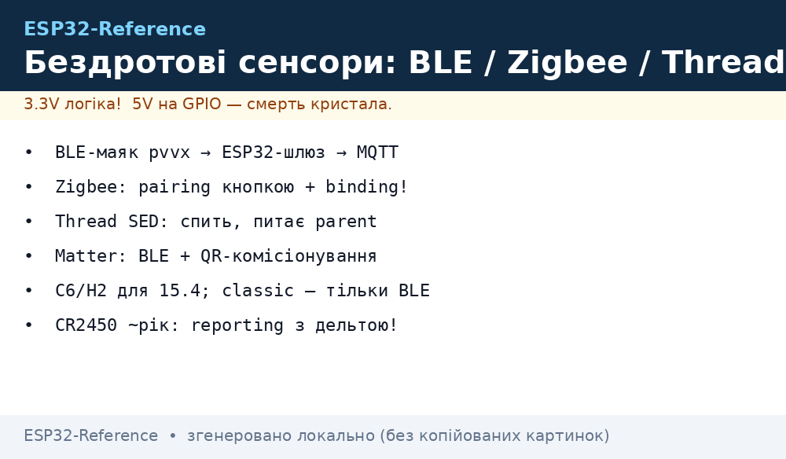
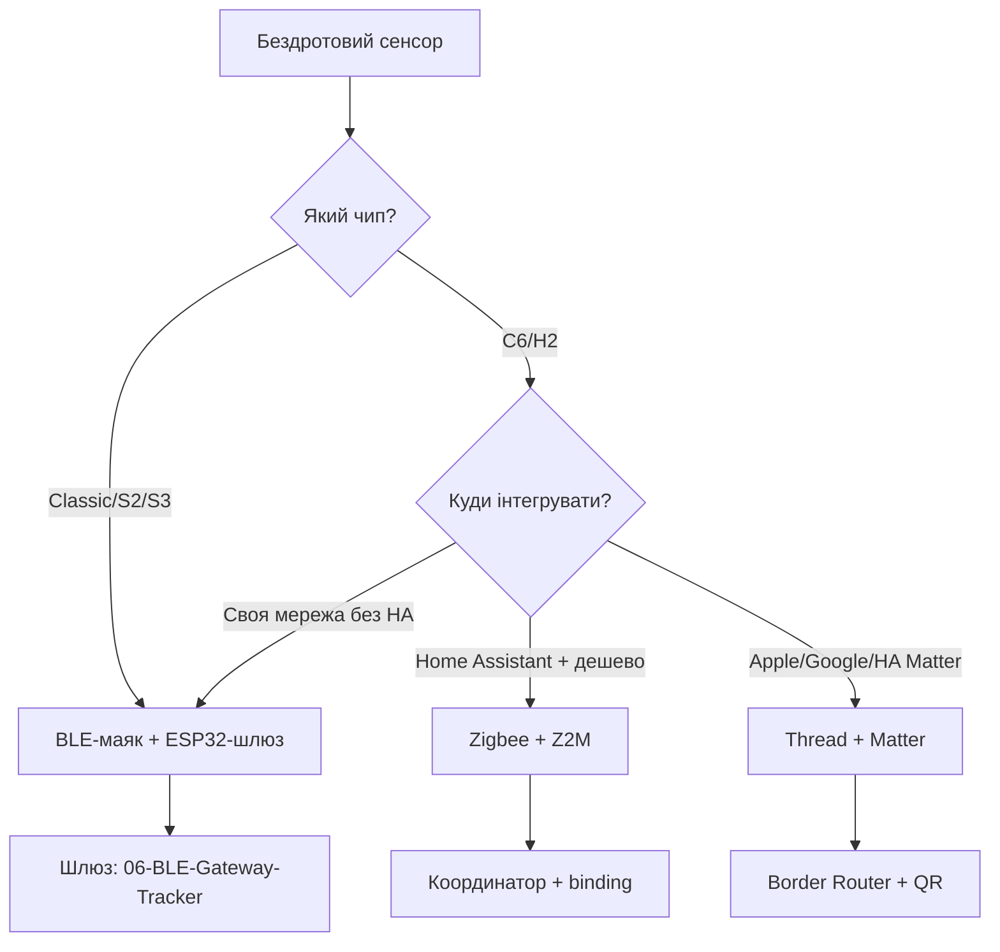

# Бездротові сенсори: BLE-маяки, Thread, Matter, Zigbee

## Призначення

Сенсор без дротів - це радіо + батарея + сон. Три екосистеми: BLE-маяки (дешево, телефон/шлюз читає), Zigbee (зріла mesh, ZHA/Z2M), Thread+Matter (нове, IP з коробки). ESP32-C6/H2 закривають усі три одним кристалом.

База: старт - [Home](../../../ESP32-Reference/Home.md), BLE-база - [02-BLE-Bluetooth](../../../ESP32-Reference/05-Radio/02-BLE-Bluetooth.md), BLE-шлюз - [06-BLE-Gateway-Tracker](../../../ESP32-Reference/05-Radio/06-BLE-Gateway-Tracker.md), Matter - [09-Matter-Thread-Zigbee](../../../ESP32-Reference/15-Protokoli/09-Matter-Thread-Zigbee.md), сон - [03-Sleep-ULP](../../../ESP32-Reference/07-Timeri-Son/03-Sleep-ULP.md), живлення - [Споживання](../../../ESP32-Reference/02-Zhivlennya/03-Spozhivannya.md).

> [!warning] Чип має значення!
> Classic ESP32/S2: тільки BLE (без Thread/Zigbee - там немає 802.15.4!). Thread/Zigbee/Matter - ТІЛЬКИ C6/H2 (є радіо 802.15.4). Купувати залізо під задачу, а не навпаки.


*Рис. Три гілки: BLE-маяк → шлюз, Thread-сенсор → border router, Zigbee-датчик → координатор; всі - батарейні, всі сплять.*

## Характеристики підходів

| Параметр | BLE-маяк (pvvx/ATC) | Zigbee (ZHA/Z2M) | Thread + Matter |
| --- | --- | --- | --- |
| Радіо | BLE advertising | 802.15.4 mesh | 802.15.4 mesh + IPv6 |
| Чип ESP32 | Будь-який з BLE (включно classic!) | Тільки C6/H2 | Тільки C6/H2 |
| Батарея CR2450 | 1-2 роки (реклама 2 с) | 1-2 роки (репорти) | 0.5-1.5 року (IP-накладні витрати) |
| Шлюз | ESP32-шлюз / телефон | Координатор (Z2M-стик) | Border Router (OpenThread) |
| Хмара | MQTTDiscovery в HA | ZHA/Z2M → MQTT | Matter-контролер (HA/Apple/Google) |
| Комісіонування | Прошивка один раз | Pairing кнопкою | BLE + QR-код (Matter!) |
| Ціна вузла | $3-5 | $8-15 | $8-15 |

## 1. BLE-маяки: pvvx/ATC-прошивки

Готові термометри (LYWSD03MMC та клони) з кастомною прошивкою pvvx/ATC шлють температуру/вологість/батарею в advertising - ESP32-шлюз слухає пасивно, розбирає і віддає в MQTT.

```text
Маяк LYWSD03MMC (pvvx, формат custom):
  ADV-пакет: [MAC][temp ×100][hum ×100][batt %][RSSI] — без з'єднання!
ESP32-шлюз (active scan 10 с / passive): фільтр за MAC → MQTT device/ble/<mac>
Живлення маяка: CR2032 1–2 роки при інтервалі 2.5 с; bindkey — якщо шифрування!
```

> Bindkey: шифровані маяки (ATC1441+) без ключа - мовчать. Ключ дістається з MiHome-дампа при перепрошивці - записати одразу, потім не знайти.

## 2. Zigbee-сенсори на C6/H2: pairing і binding

```text
Процедура pairing (ZHA/Z2M):
  1. Координатор: permit join 120 с.
  2. Сенсор: утримати кнопку 5 с → LED блимає → join.
  3. Z2M: перейменувати (sensor_kitchen), прив'язати reporting (темп: мін 60 с / макс 600 с / дельта 0.1°C).
Binding (прямий зв'язок без координатора): вимикач ↔ лампа — працює при мертвому HA!
```

| Параметр reporting | Сенс | Типове |
| --- | --- | --- |
| min interval | Не частіше (захист батареї) | 30-60 с |
| max interval | heartbeat «я живий» | 600-3600 с |
| reportable change | Дельта для позапланового | 0.1°C / 1% RH |

## 3. Thread + Matter: sleepy end device

Thread-сенсор - повноцінний IPv6-хост, але сплячий (SED): прокидається, питає parent «є мені?», віддає дані, спить.

```text
Комісіонування Matter (як це виглядає для користувача):
  1. QR-код на корпусі сенсора (setup code + discriminator).
  2. Телефон (HA Companion / Apple Home) → BLE-з'єднання → передача Thread-кредів.
  3. Сенсор в mesh, з'являється в контролері з кластерами (Temperature, Battery...).
ESP32-C6 прошивка: examples connectedhomeip (matter) — гілка під свій чип (див. Versions!).
```

### Mermaid: вибір екосистеми



## 4. Живлення батарейних вузлів: бюджет

```text
BLE-маяк (реклама 2.5 с, CR2032 220 мАг):
  TX-пачка ~10 мА × 5 мс + сон 3 мкА → середнє ~25 мкА → ~1 рік. ЧЕСНО.
Thread SED (репорт 5 хв, CR2450 620 мАг):
  пробудження + poll + TX ~15 мА × 100 мс → середнє ~60 мкА → ~1.2 року.
Вбивці батареї: частий reporting (дельта 0!), debug-UART у сні, LED-живлення,
  pull-up на висячих пінах. Вимірювати ТІЛЬКИ на гнізді мкА (див. 17-Lab/01)!
```

## Код (3 фреймворки)

### Arduino (C6/H2) - Zigbee-температура (скорочено)

```cpp
// ESP32-C6 Arduino: Zigbee Temp Sensor (бібліотека esp-zigbee). Pairing кнопкою BOOT.
#include "Zigbee.h"
ZigbeeTempSensor zb(10);  // endpoint 10
void setup() {
  zb.addAnalogInput();              // кластер Temperature
  Zigbee.begin();                   // чекає permit join з координатора
}
void loop() {
  zb.setTemperature(readSHT40());   // reporting за таблицею розд. 2
  delay(60000);
}
```

### ESP-IDF - Thread SED (концепція)

```c
// otIcmp6 / OpenThread: роль SED (CHILD_SUPERVISION), poll period 1000 мс,
// приклад esp-idf/examples/openthread/ot_sleepy_device. Matter поверх —
// connectedhomeip приклад light-switch як старт для сенсора (замінити кластери).
```

### MicroPython - BLE-маяк-сканер (будь-який ESP32 з BLE)

```python
from machine import Pin
import bluetooth, time
ble = bluetooth.BLE(); ble.active(True)
seen = {}
def irq(ev, data, addr, rssi, adv):
    if ev == 5:  # ADV_IND/SCAN_RSP
        mac = ":".join("%02X" % b for b in addr[1])
        seen[mac] = (rssi, bytes(adv))
ble.irq(irq)
ble.gap_scan(10000, 30000, 30000)  # 10 с скан
time.sleep(11)
for m, (r, a) in seen.items():
    print(m, r, a.hex()[:40])  # далі — розбір pvvx/ATC за форматом
```

## Типові помилки

| # | Помилка | Чому погано | Як правильно |
| --- | --- | --- | --- |
| 1 | Thread на classic ESP32 | Немає 802.15.4-радіо | C6/H2 |
| 2 | Reporting кожну секунду | Батарея за місяць | min 60 с + дельта |
| 3 | Загублений bindkey | Шифрований маяк мовчить | Записати при перепрошивці |
| 4 | Маяк у металевому корпусі | −20 дБ одразу | Пластик + зовнішній виступ |
| 5 | Matter без Border Router | Немає куди join | OpenThread BR в мережі |
| 6 | Debug-UART у сні | +мА замість мкА | Вимикати периферію перед сном |
| 7 | Один reporting для всіх | Вологість стрибає - спам | Окремі дельти t/RH/batt |
| 8 | Тест на столі = поле | Мультипас у цеху інший | Виміряти RSSI на місці |

## Офіційні джерела

- [pvvx ATC custom firmware (GitHub)](https://github.com/pvvx/ATC_MiThermometer) - формати ADV, bindkey.
- [ESP Zigbee SDK (Espressif)](https://docs.espressif.com/projects/esp-zigbee-sdk/) - C6/H2, reporting, binding.
- [OpenThread + ESP32 (Espressif)](https://docs.espressif.com/projects/esp-idf/en/latest/esp32c6/api-guides/openthread.html) - SED, Border Router.
- [Matter + ESP32 (connectedhomeip)](https://github.com/espressif/connectedhomeip) - комісіонування, кластери.

## Див. також

- [Головна](../../../ESP32-Reference/Home.md)
- [BLE](../../../ESP32-Reference/05-Radio/02-BLE-Bluetooth.md)
- [BLE-шлюз](../../../ESP32-Reference/05-Radio/06-BLE-Gateway-Tracker.md)
- [Matter/Thread/Zigbee](../../../ESP32-Reference/15-Protokoli/09-Matter-Thread-Zigbee.md)
- [Sleep](../../../ESP32-Reference/07-Timeri-Son/03-Sleep-ULP.md)
- [Споживання](../../../ESP32-Reference/02-Zhivlennya/03-Spozhivannya.md)
- [Вологість I2C](../../../ESP32-Reference/10-Sensori/07-AHT10-AHT20-SHT40.md)
- [Прилади](../../../ESP32-Reference/17-Lab/01-Instruments.md)
