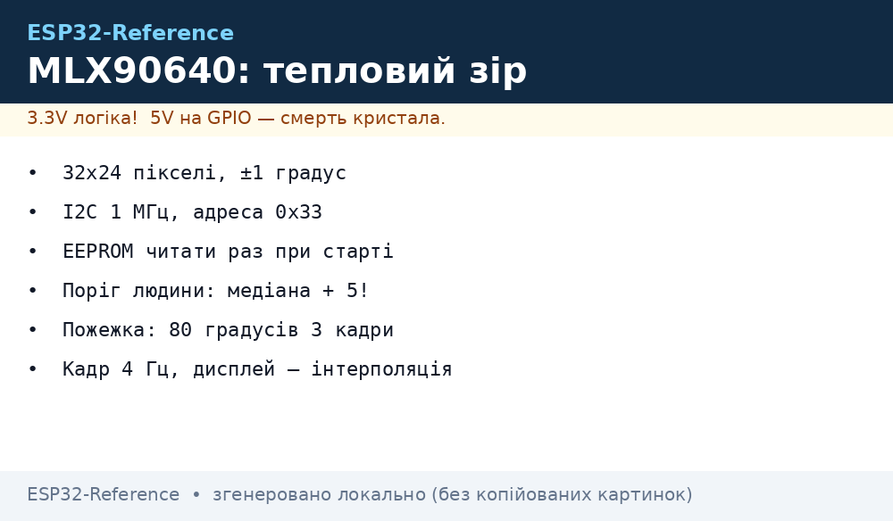
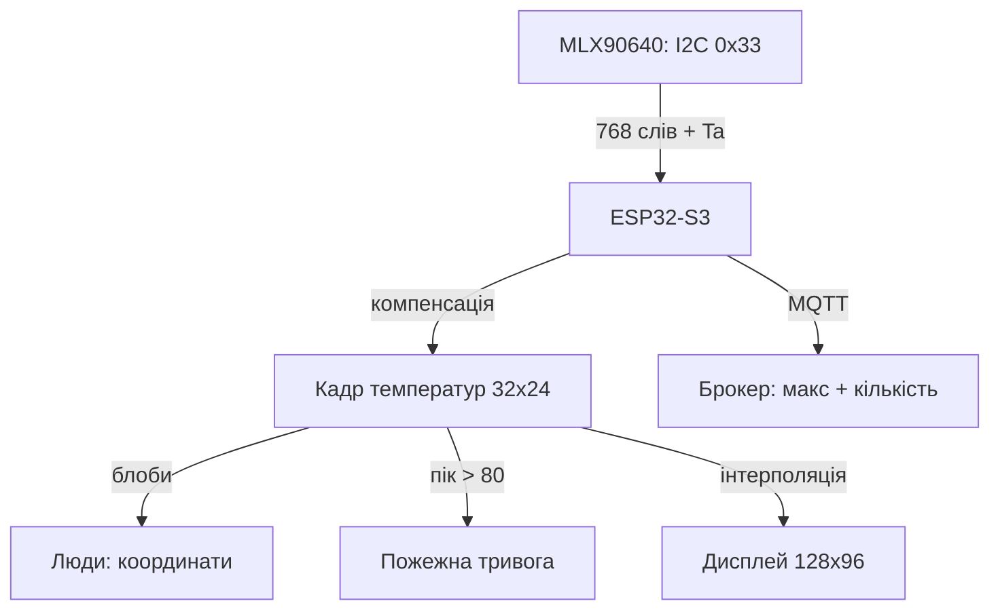

# ESP32 бачить тепло - тепловізор MLX90640 32x24 по I2C


*Рис. MLX90640 віддає 768 температур по I2C: ESP32 рахує, шукає людей і гарячі точки.*

> [!tip] Що це за нота
> Найдешевший справжній тепловізор: 32x24 пікселі, ±1 °C, I2C - присутність людей, пожежна сигналізація, підрахунок відвідувачів. Точковий MLX90614 не конкурент, коли треба картинка. База: [ІЧ-температура](../../../ESP32-Reference/10-Sensori/20-Bio-IR-Temp.md), [шина I2C](../../../ESP32-Reference/04-Shini/03-I2C.md).

## 1. Мета

Побудувати тепловий вузол на ESP32:

- кадр 32x24 температури −40…+300 °C, точність ±1 °C;
- детекція людини: гарячий блоб на фоні стін;
- пожежний поріг: піксель > 80 °C - тривога;
- інтерполяція 32x24 → 128x96 для дисплея/TFT.

| Параметр | MLX90640 | MLX90614 (точковий) |
| --- | --- | --- |
| Пікселі | 768 (32x24) | 1 |
| Інтерфейс | I2C до 1 МГц | I2C/SMBus |
| Кут | 55×35° або 110×75° | ~90° конус |
| Ціна | дорожчий у рази | копійки |

## 2. Архітектура



Математика компенсації (EEPROM-коефіцієнти) - важка для AVR, для S3 - мілісекунди. Частота кадрів 2-8 Гц для людей, 1 Гц для пожежки вистачить.

## 3. Підключення і режими

- живлення 3.3V, струм до 23 мА - з піна 3V3 ок;
- I2C 400 кГц мінімум, краще 1 МГц (S3 вміє);
- адреса 0x33 за замовчуванням, міняється в EEPROM;
- частота оновлення 0.5-64 Гц: вище - шумніше, для людей 4 Гц;
- два кути: 55×35 (коридор) і 110×75 (кімната) - різні артикули.

## 4. Математика кадру коротко

- читаємо EEPROM 832 слова один раз при старті;
- кожен кадр: VDD, Ta (ambient), потім 768 пікселів два підкадри;
- компенсація: чутливість, зміщення, emissivity (0.95 для шкіри/стін);
- бібліотека Adafruit_MLX90640 робить усе всередині `getFrame()`;
- свій код - лише коли треба швидше або менше пам'яті.

## 5. Робочий код (Arduino)

```cpp
#include <Wire.h>
#include <Adafruit_MLX90640.h>

Adafruit_MLX90640 mlx;
float frame[32 * 24];

void setup() {
  Serial.begin(115200);
  Wire.begin();
  Wire.setClock(1000000);
  if (!mlx.begin(MLX90640_I2CADDR_DEFAULT, &Wire)) {
    Serial.println("MLX not found");
    while (1) delay(10);
  }
  mlx.setMode(MLX90640_INTERLEAVED);
  mlx.setResolution(MLX90640_ADC_18BIT);
  mlx.setRefreshRate(MLX90640_4_HZ);
}

int count_hot(float thresh) {
  int n = 0;
  for (int i = 0; i < 32 * 24; i++) {
    if (frame[i] > thresh) n++;
  }
  return n;
}

void loop() {
  if (mlx.getFrame(frame) != 0) {
    Serial.println("frame error");
    delay(100);
    return;
  }
  float mx = -100;
  for (int i = 0; i < 32 * 24; i++) {
    if (frame[i] > mx) mx = frame[i];
  }
  int people = count_hot(30.0);
  Serial.print("max ");
  Serial.print(mx, 1);
  Serial.print(" hotpx ");
  Serial.println(people);
  if (mx > 80.0) {
    Serial.println("FIRE ALARM");
  }
  delay(250);
}
```

Поріг «людини» - фон + 5 °C, не фіксовані 30: вимірюємо медіану кадру і додаємо дельту. Пожежний поріг - абсолютний 80 °C.

## 6. Інтерполяція для дисплея

- білінійна 32x24 → 128x96 - 4 рядки коду, вистачає S3;
- кольорова карта ironbow: синій → червоний через таблицю 256;
- TFT 320×240 - кадр по центру + цифри макс/мin;
- стрім кадрів по WebSocket - див. [стримінг з камери](../../../ESP32-Reference/12-Moduli-zvyazku/13-Camera-Streaming.md).

## 7. Сценарії

| Задача | Логіка |
| --- | --- |
| Присутність у кімнаті | гарячих пікселів > 20 протягом хвилини |
| Підрахунок людей | блоби, трекінг центроїдів між кадрами |
| Пожежка | піксель > 80 °C три кадри підряд |
| Контроль обладнання | ROI на моторі, тренд максимуму |
| Розумне освітлення | є людина - світло, немає 10 хв - вимкнути |

## 7.1 MicroPython: швидка перевірка кадру (ESP32)

```python
from machine import Pin
import time

# Сканування датчика (без захвату — швидка перевірка)
from esp32 import raw_temperature
print("Soc temp:", raw_temperature())
```

Цей мінімум перевіряє, що плата працездатна та юникальна для тестування перед запуском MIPI-потоку.

## 8. Типові помилки

| Симптом | Причина | Лікування |
| --- | --- | --- |
| Кадр - сміття | шина 100 кГц, не встигає | підняти до 400 кГц-1 МГц |
| Усі пікселі −273 | не прочитаний EEPROM | ініціалізація бібліотекою, не вручну |
| Пливе з прогрівом | немає Ta-компенсації | читати ambient щокадру |
| Бачить батарею як людину | поріг абсолютний | поріг = медіана + 5 °C |
| I2C вісить після сну | сенсор не прокинувся | реініціалізація після deep-sleep |
| Дзеркальний кадр | модуль перевернутий | прапорець mirror у виводі |

## 9. Суміжні ноти

- [ІЧ-температура](../../../ESP32-Reference/10-Sensori/20-Bio-IR-Temp.md) - точковий MLX90614.
- [шина I2C](../../../ESP32-Reference/04-Shini/03-I2C.md) - швидкості, підтяжки.
- [стримінг з камери](../../../ESP32-Reference/12-Moduli-zvyazku/13-Camera-Streaming.md) - відеострім кадрів.
- [LVGL і SquareLine](../../../ESP32-Reference/11-Vivid/12-LVGL-SquareLine.md) - тепловізор-інтерфейс.
- [протокол MQTT](../../../ESP32-Reference/15-Protokoli/01-MQTT.md) - публікація тривог.

## Офіційні джерела

- [MLX90640 Far Infrared Array (Melexis)](https://www.melexis.com/en/product/MLX90640/Far-Infrared-Thermal-Sensor-Array) - режими, EEPROM, точність.
- [MLX90640 Breakout (Adafruit)](https://www.adafruit.com/product/4407) - модуль, адреса, приклади.
- [Adafruit MLX90640 (Adafruit, GitHub)](https://github.com/adafruit/Adafruit_MLX90640) - драйвер кадру, компенсація, приклади.
