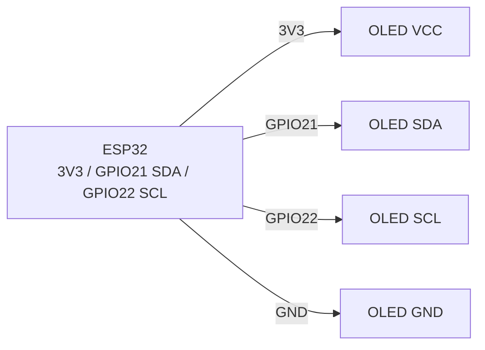
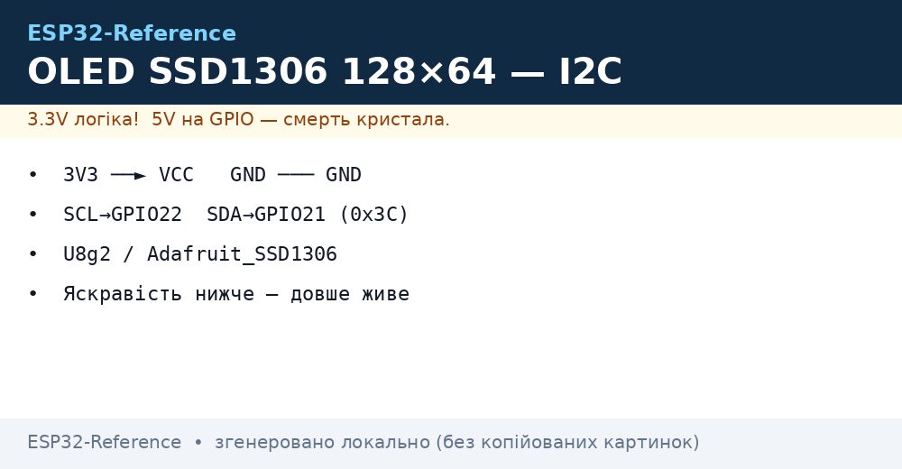

# OLED SSD1306 128×64 (I2C) - дисплей

## Призначення

Монохромний OLED 0.96″ 128×64 на контролері SSD1306 - стандартний дисплей для налагодження, меню, міні-дашбордів, годинників, сенсорних вузлів. I2C-інтерфейс (2 дроти), живлення 3.3 В, бібліотеки U8g2 / Adafruit_SSD1306 / esp-ssd1306. Не вигорає швидко при помірній яскравості; для статичних картинок роками - вмикати screensaver/invert.

## Характеристики

| Параметр | Значення |
| --- | --- |
| Контролер | SSD1306 (рідше SH1106 - інший драйвер!) |
| Роздільність | 128×64, монохром (білий/блакитний/жовто-блакитний) |
| Інтерфейс | I2C, адреса 0x3C (типово) / 0x3D (перемичка) |
| Живлення | 3.3-5 В (модулі з LDO/charge-pump; логіка 3.3 В OK) |
| Струм | ~15-25 мА (залежить від кількості білих пікселів) |
| Буфер кадру | 1024 байти (128×64/8) - в ОЗП контролера |
| Швидкість | I2C 400 кГц → ~10-20 fps повного кадру |
| Ресурс | ~10 000 год до помітного вигорання |

> SH1106 виглядає так само, але має 132×64 пам'ять зі зсувом 2 px - з драйвером SSD1306 картинка «з'їжджає». Перевіряти маркування та підбирати драйвер/конструктор.

## Розпіновка

| Пін модуля (4-pin I2C) | Призначення | Примітка |
| --- | --- | --- |
| VCC | 3.3 В (або 5 В, якщо є LDO) | Рекомендовано 3.3 В від ESP32 |
| GND | Земля | Спільна земля |
| SCL | I2C clock | GPIO22 + pull-up (є на модулі) |
| SDA | I2C data | GPIO21 + pull-up (є на модулі) |

SPI-версії (7 pin: CS/DC/RES/DIN/CLK): швидші, але займають 5 GPIO - див. [SPI](../../../ESP32-Reference/04-Shini/02-SPI.md).

## Схема підключення

| ESP32 | OLED SSD1306 | Примітка |
| --- | --- | --- |
| 3V3 | VCC | Живлення 3.3 В |
| GND | GND | Спільна земля |
| GPIO22 | SCL | Апаратний I2C0, до 400 кГц-1 МГц |
| GPIO21 | SDA | Апаратний I2C0 |

Перевірка адреси: `i2c.scan()` має показати `0x3C`. Якщо 0x3D - передати адресу в конструктор. Два дисплеї: один з адресою 0x3C, другий перепаяти на 0x3D (перемичка SA0) або другий I2C-порт.

### ASCII-схема

```text
ESP32 DevKit            OLED SSD1306 128×64 (I2C, 4-pin)
------------            --------------------------------
3V3 ──────────────────► VCC (3.3 В рекомендовано)
GND ──────────────────► GND
GPIO22 ───────────────► SCL (400 кГц, pull-up на модулі)
GPIO21 ───────────────► SDA (pull-up на модулі)
VCC ◄──[100 нФ]──► GND (біля дисплея проти артефактів)
Адреса: 0x3C типово; SA0-перемичка → 0x3D
```

### Mermaid




*Рис. OLED SSD1306 - шина I2C 400 кГц, адреса 0x3C, живлення 3V3. Місце під фото - див. .*

## Код ESP-IDF

```c
#include "ssd1306.h"  // компонент esp-ssd1306 / esp-idf-lib
#include "driver/i2c.h"
#include "font8x8_basic.h"

#define I2C_PORT I2C_NUM_0

void app_main(void)
{
    i2c_config_t cfg = {
        .mode = I2C_MODE_MASTER,
        .sda_io_num = GPIO_NUM_21, .scl_io_num = GPIO_NUM_22,
        .sda_pullup_en = GPIO_PULLUP_ENABLE,
        .scl_pullup_en = GPIO_PULLUP_ENABLE,
        .master.clk_speed = 400000,
    };
    i2c_param_config(I2C_PORT, &cfg);
    i2c_driver_install(I2C_PORT, cfg.mode, 0, 0, 0);

    SSD1306_t dev;
    i2c_init(&dev, 128, 64, 0x3C, I2C_PORT);
    ssd1306_init(&dev);
    ssd1306_clear_screen(&dev, false);
    ssd1306_display_text(&dev, 0, "ESP32 OLED", 9, false);
    ssd1306_display_text(&dev, 1, "T=24.5C H=55%", 13, false);
    // Графіка: ssd1306_draw_pixel / line / bitmap, потім ssd1306_show_buffer
}
```

## Код Arduino

```cpp
#include <Wire.h>
#include <Adafruit_GFX.h>
#include <Adafruit_SSD1306.h>

#define SCREEN_W 128
#define SCREEN_H 64
Adafruit_SSD1306 display(SCREEN_W, SCREEN_H, &Wire, -1);

void setup() {
  Serial.begin(115200);
  Wire.begin(21, 22);
  Wire.setClock(400000);
  if (!display.begin(SSD1306_SWITCHCAPVCC, 0x3C)) {
    Serial.println("SSD1306 не знайдено!");
    for (;;) delay(10);
  }
  display.clearDisplay();
  display.setTextSize(1);
  display.setTextColor(SSD1306_WHITE);
  display.setCursor(0, 0);
  display.println("ESP32 OLED OK");
  display.printf("T=24.5C H=55%%\n");
  display.display();
}

void loop() {
  // U8g2-альтернатива: U8G2_SSD1306_128X64_NONAME_F_HW_I2C u8g2(U8G2_R0);
}
```

## Код MicroPython

```python
from machine import I2C, Pin
import ssd1306  # вбудований драйвер

i2c = I2C(0, scl=Pin(22), sda=Pin(21), freq=400000)
print("I2C:", [hex(a) for a in i2c.scan()])
oled = ssd1306.SSD1306_I2C(128, 64, i2c, addr=0x3C)

oled.fill(0)
oled.text("ESP32 OLED OK", 0, 0)
oled.text("T=24.5C H=55%", 0, 12)
oled.hline(0, 30, 128, 1)
oled.rect(0, 35, 60, 20, 1)
oled.show()
```

## Типові помилки

1. **SH1106 замість SSD1306** → картинка зі зсувом/сміття. Використати драйвер SH1106 (`Adafruit_SH110X`, `U8G2_SH1106_...`).
2. **Не та адреса (0x3D)** → чорний екран. Сканувати I2C, передати правильну адресу в `begin()`/конструктор.
3. **Живлення 5 В на модуль без LDO** → перегрів/вихід з ладу. Перевірити наявність стабілізатора; за замовчуванням 3.3 В.
4. **I2C 100 кГц + повний редизайн щокадру** → мерехтіння. Підняти до 400 кГц, оновлювати тільки змінені рядки.
5. **Забутий `display.display()` / `oled.show()`** → буфер не виводиться. Виклик show після кожного кадру.
6. **Статична картинка роками** → вигорання. Періодично інвертувати, гасити (`ssd1306_display_off` / `display.ssd1306_command(SSD1306_DISPLAYOFF)`), знизити контраст.
7. **Довгі дроти SDA/SCL** → артефакти. Короткі дроти, pull-up 4.7 кОм, 100 нФ за живленням біля дисплея.

## Офіційні джерела

- SSD1306 Datasheet (Solomon Systech) - `перевірити вручну`.
- [OLED 0.96″ - живе фото (Adafruit)](https://www.adafruit.com/product/326) - сторінка товару з фото.
- [Туторіал OLED + ESP32 з кодом (RNT)](https://randomnerdtutorials.com/esp32-ssd1306-oled-display-arduino-ide/) - Adafruit_SSD1306, приклади.
- [Гайд монохромних OLED з кодом (Adafruit Learn)](https://learn.adafruit.com/monochrome-oled-breakouts) - SSD1306/SH1106, бібліотеки.

## Див. також

- [I2C](../../../ESP32-Reference/04-Shini/03-I2C.md)
- [SPI](../../../ESP32-Reference/04-Shini/02-SPI.md)
- [01-GPIO-oglyad](../../../ESP32-Reference/03-GPIO/01-GPIO-oglyad.md)
- [ADC](../../../ESP32-Reference/06-Analog/01-ADC.md)
- [04-Pererivannya-PWM](../../../ESP32-Reference/03-GPIO/04-Pererivannya-PWM.md)
- [02-TFT-LCD-Epaper](../../../ESP32-Reference/11-Vivid/02-TFT-LCD-Epaper.md)
- [03-NeoPixel-Servo-Rele-MOSFET](../../../ESP32-Reference/11-Vivid/03-NeoPixel-Servo-Rele-MOSFET.md)
