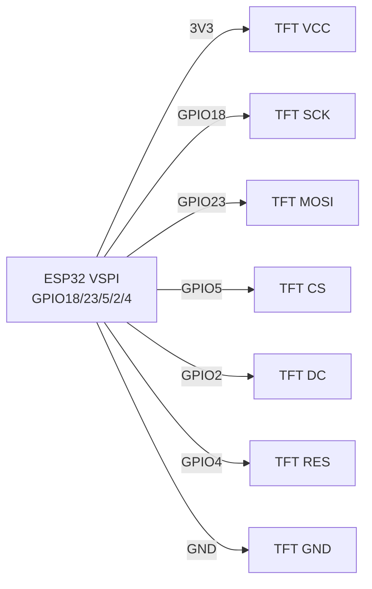
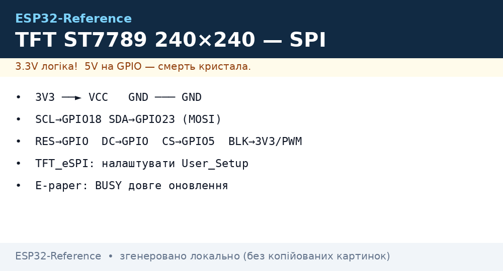

# TFT ST7789 / ILI9341, LCD1602+I2C, E-paper - дисплеї

## Призначення

Огляд «великих» дисплеїв для ESP32: ST7789 (IPS 240×240 / 240×320, швидкий SPI) - годинники, дашборди, камери; ILI9341 240×320 + touch XPT2046 - панелі керування; LCD1602 + PCF8574 - дешевий 2-рядковий текст; E-paper (GDEY/DEPG на Good Display, драйвер GxEPD) - цінники, вуличні табло зі статикою та живленням від батареї.

## Характеристики

| Дисплей | Роздільність | Інтерфейс | Живлення | Особливість |
| --- | --- | --- | --- | --- |
| ST7789 1.3-1.54″ | 240×240 | SPI 40-80 МГц | 3.3 В | IPS, яскравий; потрібен TFT_eSPI/LovyanGFX |
| ST7789 2.0″ | 240×320 | SPI | 3.3 В | Той же драйвер, інший offset |
| ILI9341 2.4-2.8″ | 240×320 | SPI + XPT2046 touch (SPI) | 3.3 В (модулі з LDO → 5 В) | Touch окремим CS |
| LCD1602 + PCF8574 | 16×2 текст | I2C 0x27 (типово) / 0x3F | 5 В (підсвітка!) | Контраст потенціометром |
| E-paper 2.13-4.2″ | 250×122 … 400×300 | SPI (GxEPD/GxEPD2) | 3.3 В | Оновлення 2-30 с, partial refresh; не оновлювати частіше ~3 хв |

> E-paper НЕ любить часті повні оновлення: кожні 5-10 хв робити повний refresh проти «привидів», уникати оновлення при <0 °C без підігріву.

## Розпіновка

| ST7789 (модуль) | Призначення |
| --- | --- |
| VCC / GND | 3.3 В / земля |
| SCL (SCK) | SPI clock → GPIO18 |
| SDA (MOSI) | SPI MOSI → GPIO23 |
| RES (RST) | Reset → GPIO4 (або EN) |
| DC | Data/Command → GPIO2 |
| CS | Chip-select → GPIO5 |
| BLK | Підсвітка → 3V3 або PWM-GPIO (яскравість) |

| ILI9341 + touch | Додатково |
| --- | --- |
| T_CLK/T_DOUT/T_DIN/T_CS/T_IRQ | Другий SPI-пристрій: спільні SCK/MISO/MOSI, окремий T_CS (GPIO14), IRQ опційно |

| LCD1602+I2C | I2C 0x27/0x3F, живлення 5 В (контраст!) |

## Схема підключення

| ESP32 | ST7789 / ILI9341 | Примітка |
| --- | --- | --- |
| 3V3 | VCC | Тільки 3.3 В (модулі ILI9341 з LDO можна 5 В) |
| GND | GND | Спільна земля |
| GPIO18 | SCL/SCK | VSPI SCK |
| GPIO23 | SDA/MOSI | VSPI MOSI |
| GPIO19 | MISO | Тільки ILI9341-touch (XPT2046 читає); ST7789 зазвичай без MISO |
| GPIO5 | CS | TFT CS |
| GPIO2 | DC | Data/Command (не strapping-проблема після boot) |
| GPIO4 | RES | Reset |
| GPIO15 | BLK (ST7789) | Через PWM - регулювання яскравості |
| GPIO14 | T_CS (ILI9341) | Touch CS, окремий від TFT CS |

| ESP32 | LCD1602+I2C | Примітка |
| --- | --- | --- |
| 5V | VCC | Підсвітка хоче 5 В |
| GND | GND | Земля |
| GPIO22 | SCL | I2C |
| GPIO21 | SDA | I2C, адреса 0x27 або 0x3F |

| ESP32 | E-paper (SPI) | Примітка |
| --- | --- | --- |
| 3V3/GND | VCC/GND | 3.3 В |
| GPIO18/23/5 | SCK/MOSI/CS | SPI |
| GPIO2/4/15 | DC/RST/BUSY | BUSY - вхід очікування |

### ASCII-схема

```text
ESP32 DevKit (VSPI)     ST7789 / ILI9341 (SPI)
-------------------     ----------------------
3V3 ──────────────────► VCC (тільки 3.3 В!)
GND ──────────────────► GND
GPIO18 ───────────────► SCL / SCK
GPIO23 ───────────────► SDA / MOSI
GPIO19 ───────────────► MISO (тільки ILI9341-touch XPT2046)
GPIO5 ────────────────► CS (TFT)
GPIO2 ────────────────► DC (Data/Command)
GPIO4 ────────────────► RES / RST
GPIO15 ──[PWM]────────► BLK (яскравість підсвітки)
GPIO14 ───────────────► T_CS (touch, окремий від TFT CS)
VCC ◄──[100 нФ]──► GND біля дисплея; SPI 20–40 МГц на довгих дротах
```

### Mermaid




*Рис. TFT ST7789 - апаратний VSPI, DC/RES окремо, підсвітка через PWM. Місце під фото - див. .*

## Код ESP-IDF+Arduino+TFT_eSPI

`TFT_eSPI` (Arduino/PlatformIO): у `User_Setup.h` або `platformio.ini` build_flags:

```ini
-DILI9341_DRIVER=1      ; або -DST7789_DRIVER=1
-DTFT_MOSI=23 -DTFT_SCLK=18 -DTFT_CS=5 -DTFT_DC=2 -DTFT_RST=4
-DTOUCH_CS=14           ; для ILI9341 touch
-DSPI_FREQUENCY=40000000
```

```cpp
#include <TFT_eSPI.h>
TFT_eSPI tft;
void setup() {
  tft.init();
  tft.setRotation(1);
  tft.fillScreen(TFT_BLACK);
  tft.setTextColor(TFT_WHITE, TFT_BLACK);
  tft.drawString("ESP32 TFT OK", 10, 10, 2);
  tft.drawRect(10, 40, 100, 30, TFT_GREEN);
}
void loop() {}
```

LovyanGFX (рекомендовано для ST7789 + ESP-IDF/Arduino): автодетект, DMA, спрайт-буфер.

## Код MicroPython

```python
# ST7789 (драйвер st7789.py, RusHuang)
from machine import SPI, Pin
import st7789
spi = SPI(2, baudrate=40000000, sck=Pin(18), mosi=Pin(23))
tft = st7789.ST7789(spi, 240, 240, reset=Pin(4, Pin.OUT),
                    dc=Pin(2, Pin.OUT), cs=Pin(5, Pin.OUT),
                    backlight=Pin(15, Pin.OUT), rotation=1)
tft.fill(st7789.BLACK)
tft.text("ESP32 TFT OK", 10, 10, st7789.WHITE)

# LCD1602 I2C:
# from lcd1602 import LCD; lcd = LCD(I2C(0, scl=Pin(22), sda=Pin(21)), 0x27)
# lcd.print("Hello ESP32")
```

## E-paper GxEPD (Arduino)

```cpp
#include <GxEPD2_BW.h>
GxEPD2_BW<GxEPD2_213_BN, GxEPD2_213_BN::HEIGHT> display(
  GxEPD2_213_BN(5, 2, 4, 15)); // CS, DC, RST, BUSY
void setup() {
  display.init(115200);
  display.setRotation(1);
  display.fillScreen(GxEPD_WHITE);
  display.setTextColor(GxEPD_BLACK);
  display.setCursor(10, 20);
  display.print("E-paper OK");
  display.display(); // повне оновлення ~2-3 с
}
void loop() { delay(60000); } // НЕ частіше раз на кілька хвилин!
```

## Типові помилки

1. **Білий екран ST7789** → не той offset/rotation або переплутані DC/RES. Підібрати `User_Setup` під точну діагональ (135×240 vs 240×240 vs 240×320).
2. **Живлення TFT від 3V3 слабкого LDO плати** → просідання, мерехтіння. Живити дисплей окремо при яскравій підсвітці.
3. **ILI9341 touch не працює** → T_CS конфліктує з TFT CS (мають бути різні GPIO), або MISO не підключено.
4. **LCD1602 показує кубики/порожньо** → не та адреса (0x27 vs 0x3F) або контраст на нулі. Сканувати I2C, крутити потенціометр.
5. **LCD1602 від 3.3 В** → тьмяна підсвітка/невидимі символи. Живити 5 В (SDA/SCL 3.3 В вистачає).
6. **E-paper «привиди»** → часткові оновлення без повного refresh. Повний `display()` кожні N часткових; не оновлювати частіше ~180 с.
7. **SPI 80 МГц на довгих дротах** → артефакти. Знизити до 20-40 МГц, короткі дроти, 100 нФ за живленням.

## Офіційні джерела

- [TFT ST7789 - живе фото (Adafruit)](https://www.adafruit.com/product/3787) - сторінка товару з фото; даташит Sitronix - `перевірити вручну`.
- [Туторіал I2C LCD + ESP32 з кодом (RNT)](https://randomnerdtutorials.com/esp32-esp8266-i2c-lcd-arduino-ide/) - LCD1602/2004 через PCF8574.
- [E-paper HAT - фото і wiki (Waveshare)](https://www.waveshare.com/wiki/2.13inch_e-Paper_HAT) - схеми, приклади коду.
- ILI9341 Datasheet (Ilitek) - `перевірити вручну`.

## Див. також

- [SPI](../../../ESP32-Reference/04-Shini/02-SPI.md)
- [I2C](../../../ESP32-Reference/04-Shini/03-I2C.md)
- [01-GPIO-oglyad](../../../ESP32-Reference/03-GPIO/01-GPIO-oglyad.md)
- [01-OLED-SSD1306](../../../ESP32-Reference/11-Vivid/01-OLED-SSD1306.md)
- [04-Pererivannya-PWM](../../../ESP32-Reference/03-GPIO/04-Pererivannya-PWM.md)
- [03-NeoPixel-Servo-Rele-MOSFET](../../../ESP32-Reference/11-Vivid/03-NeoPixel-Servo-Rele-MOSFET.md)
