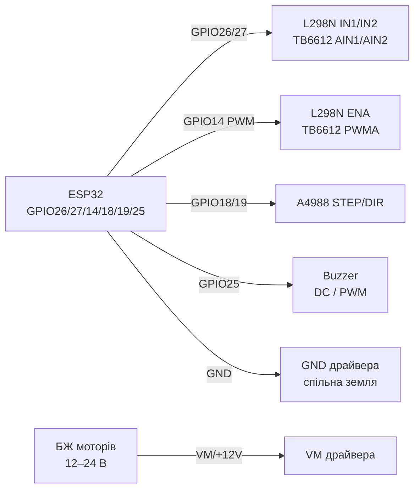
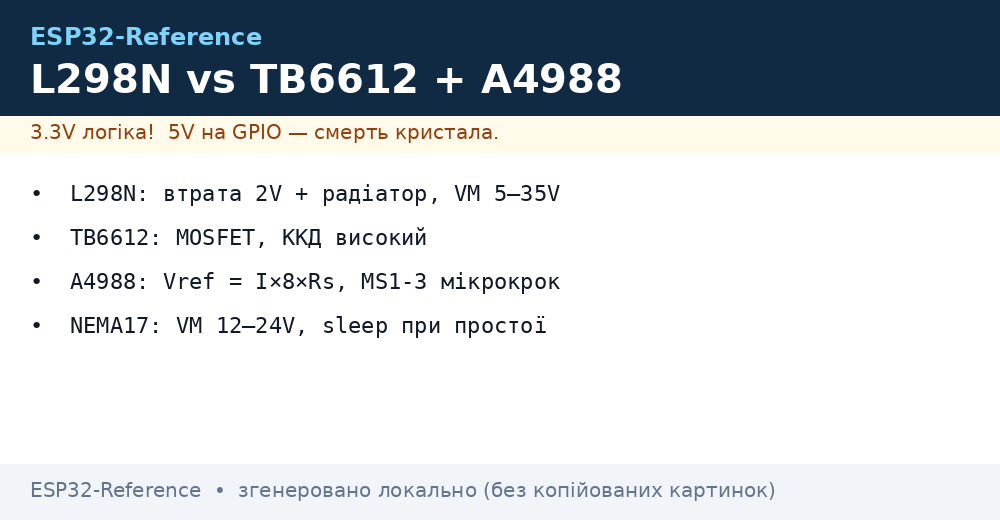

# L298N, TB6612FNG, A4988, Buzzer - драйвери моторів і звук

## Призначення

Драйвери колекторних (DC) та крокових моторів + звукові випромінювачі: L298N - класичний біполярний H-міст (дешевий, але з втратою ~2 В і нагрівом); TB6612FNG - сучасний MOSFET-міст (високий ККД, без радіатора); A4988 - драйвер біполярного кроковика NEMA17 (мікрокрок до 1/16, налаштування струму через Vref); активний buzzer (пищить сам від DC) vs пасивний (потребує PWM-мелодії).

## Характеристики

| Параметр | L298N (модуль) | TB6612FNG | A4988 |
| --- | --- | --- | --- |
| Тип | Біполярний H-міст ×2 | MOSFET H-міст ×2 | Chopper-драйвер кроковика |
| Напруга моторів | 5-35 В (логіка 5 В) | 2.5-13.5 В (логіка 2.7-5.5 В) | 8-35 В (логіка 3-5.5 В) |
| Струм | 2 А/канал (пік 3 А), реально 1-1.5 А з радіатором | 1.2 А постійно / 3.2 А пік на канал | До 1 А без радіатора / 2 А з обдувом |
| Втрата | ~2-3 В (насичення транзисторів!) | ~0.1-0.3 В (Rds(on) MOSFET) | Chopper - ККД високий |
| Мікрокрок | Ні | Ні (тільки напрям+ШІМ) | Full/1-2/1-4/1-8/1-16 (MS1-MS3) |
| Захист | Діоди на модулі, термозахист слабкий | Тепловий shutdown, UVLO | Тепловий + overcurrent |
| ESP32-рівні | OK (поріг ~2 В) | OK безпосередньо 3.3 В | STEP/DIR 3.3 В OK |

Buzzer:

| Тип | Керування | Звук |
| --- | --- | --- |
| Активний (з генератором) | DC HIGH/LOW - пищить сам (~2-4 кГц) | Один тон, гучний; для алармів |
| Пасивний (без генератора) | PWM/мелодія (`tone()`, LEDC, RMT) | Будь-яка мелодія; для інтерфейсів |

## Розпіновка

| L298N модуль | Призначення |
| --- | --- |
| +12V / GND | Живлення моторів (5-35 В) + спільна земля з ESP32 |
| +5V | Вихід 5 В (джампер 5V-EN стоїть, Vin ≤12 В) або вхід 5 В логіки (джампер знято, Vin >12 В) |
| IN1/IN2 | Напрям мотора A (GPIO) |
| IN3/IN4 | Напрям мотора B (GPIO) |
| ENA/ENB | Швидкість (ШІМ) - джампер зняти для PWM, стоїть = завжди ON |
| OUT1/OUT2, OUT3/OUT4 | До моторів A/B |

| TB6612FNG | Призначення |
| --- | --- |
| VM / VCC / GND | VM = мотори, VCC = логіка 3.3-5 В, спільний GND |
| AIN1/AIN2, BIN1/BIN2 | Напрям (GPIO) |
| PWMA/PWMB | Швидкість (ШІМ) |
| STBY | HIGH = робота (підтягнути до VCC/GPIO) |
| AO1/AO2, BO1/BO2 | До моторів |

| A4988 (StepStick) | Призначення |
| --- | --- |
| VMOT/GND | 8-35 В мотори + електроліт 100 мкФ біля плати! |
| VDD/GND | Логіка 3.3-5 В |
| STEP/DIR | Крок (фронт) / напрям (GPIO) |
| ENABLE | LOW = увімкнено (можна на GND) |
| MS1-MS3 | Мікрокрок (див. таблицю) |
| RESET/SLEEP | З'єднати між собою (інакше спить) |
| 1A/1B, 2A/2B | Обмотки кроковика (пара визначається мультиметром!) |
| Vref (потенціометр) | Струм: Itrip = Vref / (8 × Rs); Rs=0.1 Ом → I = Vref/0.8 |

## Схема підключення

| ESP32 | L298N | Примітка |
| --- | --- | --- |
| GPIO26 | IN1 | Напрям A |
| GPIO27 | IN2 | Напрям A |
| GPIO14 | ENA | ШІМ швидкості (джампер ENA знято) |
| GPIO32/33 | IN3/IN4 | Напрям B |
| GPIO15 | ENB | ШІМ швидкості |
| GND | GND | Спільна земля обов'язкова |
| - | +12V | БЖ моторів (НЕ від ESP32!) |

| ESP32 | TB6612FNG | Примітка |
| --- | --- | --- |
| GPIO26/27 | AIN1/AIN2 | Напрям |
| GPIO14 | PWMA | ШІМ 20 кГц (вище чутного) |
| 3V3 | VCC + STBY | Логіка + дозвіл |
| БЖ моторів | VM | 2.5-13.5 В |
| GND | GND | Спільна земля |

| ESP32 | A4988 | Примітка |
| --- | --- | --- |
| GPIO18 | STEP | Крок, імпульс ≥1 мкс |
| GPIO19 | DIR | Напрям |
| GPIO21 | ENABLE | Опційно (LOW = on) |
| 3V3 | VDD | Логіка |
| 12-24 В БЖ | VMOT | Електроліт 100 мкФ! |
| GND | GND (обидві) | Спільна земля |

| ESP32 | Buzzer | Примітка |
| --- | --- | --- |
| GPIO25 | + активного (DC) | Через 100 Ом; гучний - резистор 100-220 Ом |
| GPIO25 | + пасивного | PWM/LEDC/RMT-мелодія; NPN-транзистор при 5 В-бузері |

### ASCII-схема

```text
ESP32 DevKit            L298N / TB6612 / A4988 / Buzzer
------------            --------------------------------
GPIO26 ───────────────► IN1 / AIN1 (напрям A)
GPIO27 ───────────────► IN2 / AIN2 (напрям A)
GPIO14 ──[PWM 20 кГц]─► ENA / PWMA (швидкість, джампер знято!)
GPIO32/33 ────────────► IN3/IN4 (мотор B, L298N)
3V3 ──────────────────► VCC логіки + STBY (TB6612 HIGH = робота)
БЖ моторів ───────────► +12V (L298N) / VM (TB6612) / VMOT (A4988)
GND ──────────────────► GND драйвера (= GND ESP32 обов'язково!)
A4988: GPIO18 ──► STEP, GPIO19 ──► DIR, [100 мкФ] на VMOT!
Buzzer: GPIO25 ──[100 Ом]──► + (активний DC / пасивний PWM)
Мотори — ніколи від 5V/3V3 плати, тільки окремий БЖ!
```

### Mermaid




*Рис. L298N/TB6612 - окрема силова земля зі спільним GND, ШІМ на ENA/PWMA, A4988 STEP/DIR. Місце під фото - див. .*

## Код ESP-IDF

```c
#include "driver/ledc.h"
#include "driver/gpio.h"
#include "freertos/FreeRTOS.h"
#include "freertos/task.h"

#define IN1 GPIO_NUM_26
#define IN2 GPIO_NUM_27
#define ENA_PWM_CH LEDC_CHANNEL_0
#define STEP_PIN GPIO_NUM_18
#define DIR_PIN  GPIO_NUM_19

static void motor_dc(int8_t speed) // -100..100
{
    gpio_set_level(IN1, speed >= 0);
    gpio_set_level(IN2, speed < 0);
    uint32_t duty = abs(speed) * 8191 / 100; // 13 біт
    ledc_set_duty(LEDC_LOW_SPEED_MODE, ENA_PWM_CH, duty);
    ledc_update_duty(LEDC_LOW_SPEED_MODE, ENA_PWM_CH);
}

static void stepper_steps(int n, int us_delay)
{
    for (int i = 0; i < n; i++) {
        gpio_set_level(STEP_PIN, 1);
        esp_rom_delay_us(5);
        gpio_set_level(STEP_PIN, 0);
        esp_rom_delay_us(us_delay);
    }
}

void app_main(void)
{
    gpio_set_direction(IN1, GPIO_MODE_OUTPUT);
    gpio_set_direction(IN2, GPIO_MODE_OUTPUT);
    gpio_set_direction(STEP_PIN, GPIO_MODE_OUTPUT);
    gpio_set_direction(DIR_PIN, GPIO_MODE_OUTPUT);
    // LEDC 20 кГц для ENA + 2 кГц для пасивного buzzera — за потребою
    motor_dc(70);
    gpio_set_level(DIR_PIN, 1);
    stepper_steps(400, 1000); // 2 оберти при 1/1, 200 кроків/об
}
```

## Код Arduino

```cpp
#define IN1 26
#define IN2 27
#define ENA 14
#define STEP_PIN 18
#define DIR_PIN 19
#define BUZZ_PIN 25

void dcSpeed(int8_t s) { // -255..255
  digitalWrite(IN1, s >= 0);
  digitalWrite(IN2, s < 0);
  analogWrite(ENA, abs(s)); // ESP32 core: LEDC
}

void setup() {
  pinMode(IN1, OUTPUT); pinMode(IN2, OUTPUT);
  pinMode(STEP_PIN, OUTPUT); pinMode(DIR_PIN, OUTPUT);
  pinMode(BUZZ_PIN, OUTPUT);
  // A4988 мікрокрок MS1..MS3: LOW LOW LOW = full step
  digitalWrite(DIR_PIN, HIGH);
}

void loop() {
  dcSpeed(180); delay(1500);
  dcSpeed(-180); delay(1500);
  // Кроковик: 200 імпульсів = 1 оберт (full step, NEMA17 1.8°)
  for (int i = 0; i < 200; i++) {
    digitalWrite(STEP_PIN, HIGH); delayMicroseconds(5);
    digitalWrite(STEP_PIN, LOW); delayMicroseconds(1000);
  }
  tone(BUZZ_PIN, 2000, 150); // пасивний buzzer; активному — digitalWrite HIGH
  delay(1000);
}
```

## Код MicroPython

```python
from machine import Pin, PWM
import time

in1, in2 = Pin(26, Pin.OUT), Pin(27, Pin.OUT)
ena = PWM(Pin(14), freq=20000)
step_pin, dir_pin = Pin(18, Pin.OUT), Pin(19, Pin.OUT, value=1)
buzz = PWM(Pin(25, freq=2000, duty=0))

def dc(speed):  # -100..100
    in1.value(speed >= 0); in2.value(speed < 0)
    ena.duty(int(abs(speed) * 1023 / 100))

dc(70); time.sleep(1.5)
dc(-70); time.sleep(1.5); dc(0)

for _ in range(200):  # 1 оберт NEMA17 full-step
    step_pin.value(1); time.sleep_us(5)
    step_pin.value(0); time.sleep_us(1000)

buzz.duty(512); time.sleep_ms(150); buzz.duty(0)  # пасивний beep
```

## Налаштування струму A4988 (Vref)

1. Вимкити мотор, подати VMOT + VDD.
2. Мультиметр: чорний на GND, червоний на вістря потенціометра.
3. Крутити до `Vref = Itrip × 0.8` (при Rs 0.1 Ом): NEMA17 1.2 А → Vref ≈ 0.96 В; без обдува обмежити 1 А → 0.8 В.
4. Перевірити нагрів за 5 хв: палець тримає ~10 с - норма; ні - зменшити Vref / додати радіатор+вентилятор.
5. НІКОЛИ не вимкати мотор при поданому VMOT - кидок вбиває міст.

## Типові помилки

1. **L298N + 6 В мотори від 6 В БЖ** → на моторі ~4 В (втрата 2 В), повільно/слабко. Підняти БЖ на 2-3 В або перейти на TB6612.
2. **Джампер ENA стоїть + подано PWM** → конфлікт, ШІМ не працює. Зняти джампер ENA/ENB при керуванні швидкістю.
3. **Немає спільної землі ESP32-драйвер** → мотори смикаються/драйвер не слухається. Усі GND разом.
4. **A4988 без електроліта 100 мкФ на VMOT** → кидки вбивають драйвер. Конденсатор біля плати обов'язковий.
5. **Переплутані пари обмоток кроковика** → вібрація замість обертання. Пари дзвоняться мультиметром (низький опір ~одиниці Ом).
6. **STBY TB6612 висить / RESET-SLEEP A4988 не з'єднані** → драйвер мовчить. STBY → HIGH; RESET ↔ SLEEP перемичкою.
7. **Активний buzzer на PWM-мелодії** → хрипить/мовчить. Активному - тільки DC HIGH/LOW; мелодії - тільки пасивному.

## Офіційні джерела

- [Туторіал L298N + ESP32 з кодом (RNT)](https://randomnerdtutorials.com/esp32-dc-motor-l298n-motor-driver-control-speed-direction/) - швидкість і напрям DC-мотора.
- [TB6612 - живе фото (Adafruit)](https://www.adafruit.com/product/2448) - сторінка товару з фото.
- [Гайд TB6612 з кодом (Adafruit Learn)](https://learn.adafruit.com/adafruit-tb6612-h-bridge-dc-stepper-motor-driver-breakout) - DC і крокові мотори.
- A4988 Datasheet (Allegro) - `перевірити вручну`.

## Див. також

- [04-Pererivannya-PWM](../../../ESP32-Reference/03-GPIO/04-Pererivannya-PWM.md)
- [01-GPIO-oglyad](../../../ESP32-Reference/03-GPIO/01-GPIO-oglyad.md)
- [ADC](../../../ESP32-Reference/06-Analog/01-ADC.md)
- [I2C](../../../ESP32-Reference/04-Shini/03-I2C.md)
- [SPI](../../../ESP32-Reference/04-Shini/02-SPI.md)
- [03-NeoPixel-Servo-Rele-MOSFET](../../../ESP32-Reference/11-Vivid/03-NeoPixel-Servo-Rele-MOSFET.md)
- [05-HC-SR04-PIR](../../../ESP32-Reference/10-Sensori/05-HC-SR04-PIR.md)
