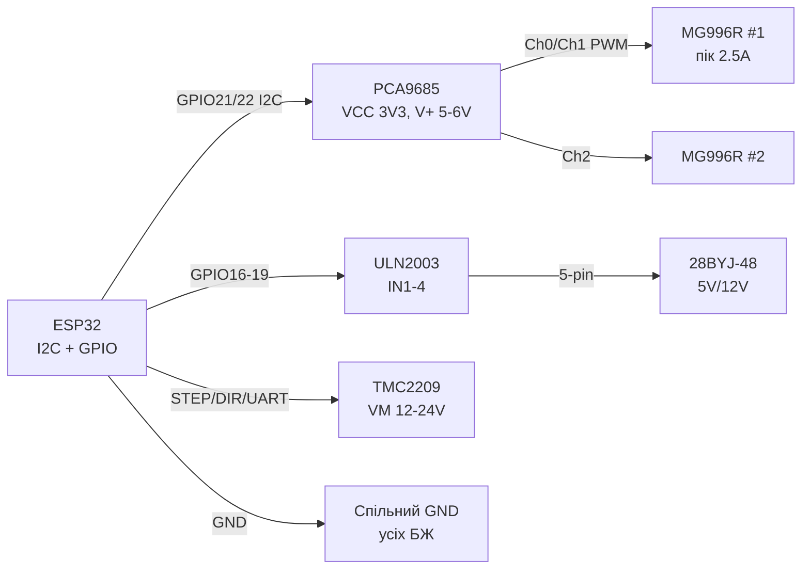
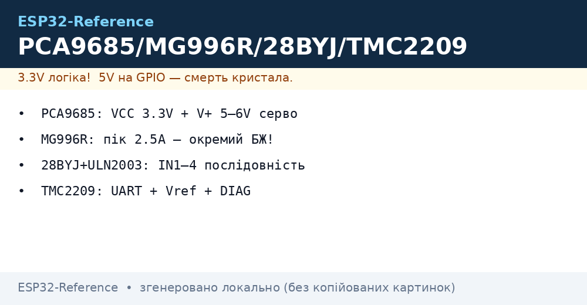
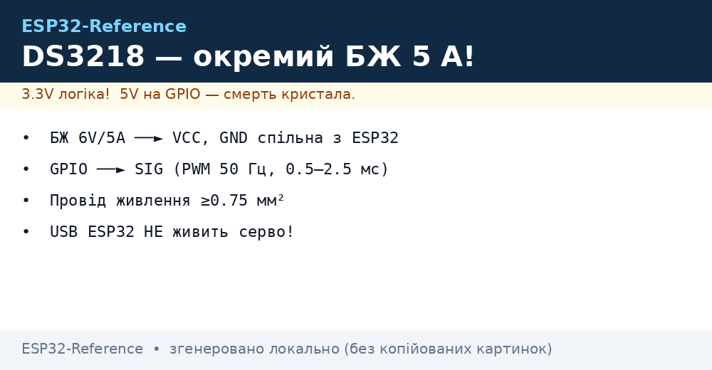

# PCA9685, MG996R, 28BYJ-48, TMC2209 - серво, крокові, драйвери

## Призначення

Потужний рух для ESP32 без боротьби за таймери: 16-канальний ШІМ-драйвер PCA9685 по I2C крутить до 16 серво з точністю 12 біт; серво MG996R дає ~10 кг·см для рук, шасі, замків; кроковий 28BYJ-48 з драйвером ULN2003 - дешеве точне позиціонування (годинники, заслінки, дозатори); драйвер TMC2209 - тихе (StealthChop) керування біполярними NEMA17/14 по STEP/DIR або UART. Усе з окремим силовим живленням і спільним GND.

## Характеристики

| Модуль | Керування | Живлення | Ключове правило |
| --- | --- | --- | --- |
| PCA9685 16ch 12-bit PWM | I2C, адреса 0x40 + A0-A5 (до 62 плат) | VCC 3.3 В (логіка) + V+ 5-6 В (серво) | OE на GND (або PWM-диммінг); частота серво 50-60 Гц |
| MG996R серво | PWM 50 Гц, 1-2 мс (0-180°) | 4.8-6 В, робочий ~500 мА, пік stall ~2.5 А! | Окремий БЖ 5-6 В / 3 А+; НІКОЛИ від 3.3 В ESP32 |
| 28BYJ-48 + ULN2003 | IN1-IN4, послідовність півкрок/повний крок | 5 В (є версія 12 В - дивитись маркування!) | Редуктор 1:64 → 4096 півкроків/оберт |
| TMC2209 | STEP/DIR + UART (адреса, струм, StealthChop) | VM 4.75-28 В, VIO 3.3 В | Vref / UART-ліміт струму; MS1/MS2 - адреса UART |
| Бібліотеки Arduino | Adafruit_PWMServoDriver | ESP32Servo | AccelStepper, CheepStepper |
| ESP-IDF | i2c + розрахунок prescale | LEDC 50 Гц | RMT/PCNT або MCPWM STEP |

> Силова земля і логічна земля - спільні, а силове живлення - ОКРЕМЕ. Серво/мотори від піна 3V3 ESP32 = гарантовані ребути і смерть стабілізатора.

## Легенда пінів модуля

| Пін | Тип | Куди | Примітка |
| --- | --- | --- | --- |
| PCA9685 VCC | Живлення логіки | 3.3 В ESP32 | Тільки логіка! |
| PCA9685 V+ (зелений клемник) | Силове | 5-6 В БЖ (серво) | Струм = сума всіх серво; запас 20 %+ |
| PCA9685 GND | Земля | GND ESP32 + GND силового БЖ | Спільна точка обов'язкова |
| PCA9685 SDA / SCL | I2C | GPIO21 / GPIO22 | Підтяжки на платі є; адреса A0-A5 джамперами |
| PCA9685 OE | Вхід, active LOW | GND (або GPIO/PWM) | HIGH вимикає всі виходи - аварійний стоп |
| PCA9685 Ch0-Ch15 (PWM/Servo) | Виходи | Signal серво | GND+V+ беруться з клемника поруч |
| MG996R коричневий/чорний | GND | GND силового БЖ | Товстий дріт! |
| MG996R червоний | 5-6 В | V+ БЖ | Пік 2.5 А - конденсатор 470-1000 мкФ |
| MG996R помаранчевий | Signal | PCA9685 Ch / GPIO | PWM 50 Гц |
| ULN2003 IN1-IN4 | Входи | GPIO 4 шт. | Послідовність півкроку: 8 станів |
| ULN2003 VCC / GND | Живлення | 5 В / GND | Джампер живлення на платі |
| 28BYJ-48 роз'єм | 5-pin | Плата ULN2003 | Не переплутати 5 В і 12 В версії! |
| TMC2209 VM / GND | Силове | 12-24 В (мотори) | Електроліт 100 мкФ біля VM! |
| TMC2209 VIO | Логіка | 3.3 В | Спільний GND з ESP32 |
| TMC2209 STEP / DIR | Входи | GPIO | Крок - фронт; DIR - напрям |
| TMC2209 TX / RX (PDN_UART) | UART 1-wire | GPIO (115200) | Налаштування струму, мікрокроку, StealthChop |
| TMC2209 MS1 / MS2 | Адреса UART | GND/VIO комбінації | 4 адреси на одній лінії UART |
| TMC2209 DIAG | Вихід | GPIO (переривання) | StallGuard - кінець/зіткнення без кінцевиків |
| TMC2209 EN | Вхід | GPIO або GND | LOW = драйвер активний |

## Схема підключення

| ESP32 | Модуль | Примітка |
| --- | --- | --- |
| GPIO21 | PCA9685 SDA | I2C; до 62 плат на шині |
| GPIO22 | PCA9685 SCL | 400 кГц ок |
| 3V3 | PCA9685 VCC | Логіка |
| GND | PCA9685 GND | + GND силового БЖ сюди ж |
| БЖ 5-6 В | PCA9685 V+ (клемник) | 3 А+ для 2× MG996R |
| Ch0.. | MG996R Signal | По одному каналу на серво |
| GPIO16,17,18,19 | ULN2003 IN1-IN4 | Порядок важливий для безпосередньо |
| 5V БЖ | ULN2003 VCC | Версія мотора 5 В! |
| GPIO25 | TMC2209 STEP | Імпульси кроку |
| GPIO26 | TMC2209 DIR | Напрям |
| GPIO27 | TMC2209 RX/TX (1-wire) | Через резистор 1 кОм; UART 115200 |
| GPIO14 | TMC2209 DIAG | Опційно, StallGuard |
| 3V3 | TMC2209 VIO + EN-логіка | EN на GND = завжди активний (простіше GPIO) |

### ASCII-схема

```text
ESP32 DevKit              PCA9685 + MG996R + ULN2003 + TMC2209
------------              ------------------------------------
GPIO21 ──────────────────► SDA PCA9685 (VCC=3V3, V+=5-6V БЖ!)
GPIO22 ──────────────────► SCL PCA9685 (A0-A5 = адреса)
GND ─────────────────────► GND PCA9685 (= GND силового БЖ!)
Ch0/Ch1 ─────────────────► Signal MG996R ×2 (VCC ──► V+ БЖ)
БЖ 5-6V/3A+ ─────────────► V+ PCA9685 + [470мкФ] на клемник
GPIO16-19 ───────────────► IN1-IN4 ULN2003 (VCC=5V мотора!)
GPIO25 ──────────────────► STEP TMC2209 (VM=12-24V +[100мкФ])
GPIO26 ──────────────────► DIR  TMC2209 (VIO=3V3)
GPIO27 ──[1к]────────────► PDN_UART TMC2209 (115200, адреса)
GPIO14 ◄───────────────── DIAG TMC2209 (StallGuard)
```

### Mermaid




*Рис. PCA9685 з роздільним живленням логіки і серво, ULN2003 для 28BYJ-48, TMC2209 з VM 12-24 В. Усі GND спільні, силові плюси - окремі. Місце під фото - див. .*

## Код ESP-IDF

```c
// PCA9685 по I2C: prescale для 50 Гц + кут серво; STEP для TMC2209 по RMT/GPIO
#include "driver/i2c.h"
#include "driver/gpio.h"

#define PCA_ADDR 0x40
#define SERVO_CH 0

static void pca_write(uint8_t reg, uint8_t val) {
    i2c_cmd_handle_t c = i2c_cmd_link_create();
    i2c_master_start(c);
    i2c_master_write_byte(c, (PCA_ADDR << 1) | I2C_MASTER_WRITE, true);
    i2c_master_write_byte(c, reg, true);
    i2c_master_write_byte(c, val, true);
    i2c_master_stop(c);
    i2c_master_cmd_begin(I2C_NUM_0, c, pdMS_TO_TICKS(50));
    i2c_cmd_link_delete(c);
}

static void servo_angle(uint8_t ch, float deg) {
    // 50 Гц, 12 біт: 1мс=205, 2мс=410
    uint16_t off = 205 + (uint16_t)(deg * (205.0f / 180.0f));
    uint8_t base = 0x06 + ch * 4;
    pca_write(base, 0); pca_write(base + 1, 0);
    pca_write(base + 2, off & 0xFF); pca_write(base + 3, off >> 8);
}

void app_main(void) {
    i2c_config_t cfg = {.mode = I2C_MODE_MASTER,
        .sda_io_num = 21, .scl_io_num = 22,
        .sda_pullup_en = true, .scl_pullup_en = true,
        .master.clk_speed = 400000};
    i2c_param_config(I2C_NUM_0, &cfg);
    i2c_driver_install(I2C_NUM_0, I2C_MODE_MASTER, 0, 0, 0);

    pca_write(0x00, 0x10);   // sleep для зміни prescale
    pca_write(0xFE, 121);    // prescale: 25МГц/(4096*50)-1 ≈ 121
    pca_write(0x00, 0x00);   // wake
    pca_write(0x01, 0x04);   // totem-pole (не open-drain)
    servo_angle(SERVO_CH, 90);
}
```

## Код Arduino

```cpp
#include <Wire.h>
#include <Adafruit_PWMServoDriver.h>
#include <AccelStepper.h>
#include <TMCStepper.h>

// --- PCA9685 + MG996R ---
Adafruit_PWMServoDriver pca = Adafruit_PWMServoDriver(0x40);
#define SERVO_MIN 205   // 1 мс @50Гц
#define SERVO_MAX 410   // 2 мс @50Гц
void servoDeg(uint8_t ch, float deg) {
  pca.setPWM(ch, 0, SERVO_MIN + deg * (SERVO_MAX - SERVO_MIN) / 180.0);
}

// --- 28BYJ-48 + ULN2003 (півкрок) ---
AccelStepper byj(AccelStepper::HALF4WIRE, 16, 18, 17, 19);

// --- TMC2209 по UART ---
#define RX_PIN 27  // PDN_UART 1-wire через 1к
#define TX_PIN 27
#define DRV_ADDR 0b00
TMC2209Stepper tmc(&Serial2, 0.11f, DRV_ADDR);

void setup() {
  Wire.begin(21, 22);
  pca.begin();
  pca.setPWMFreq(50);
  servoDeg(0, 90);

  byj.setMaxSpeed(500);
  byj.setAcceleration(200);
  byj.moveTo(2048);  // пів оберта

  Serial2.begin(115200, SERIAL_8N1, RX_PIN, TX_PIN);
  tmc.begin();
  tmc.rms_current(600);      // мА мотора!
  tmc.microsteps(16);
  tmc.en_spreadCycle(false); // StealthChop = тихо
  tmc.pwm_autoscale(true);

  pinMode(25, OUTPUT);  // STEP
  pinMode(26, OUTPUT);  // DIR
}

void loop() {
  byj.run();
  digitalWrite(26, HIGH);
  digitalWrite(25, HIGH); delayMicroseconds(5);
  digitalWrite(25, LOW); delayMicroseconds(500);
}
```

## Код MicroPython

```python
from machine import Pin, I2C
import time

# --- PCA9685 ---
i2c = I2C(0, sda=Pin(21), scl=Pin(22), freq=400_000)
PCA = 0x40
def w(reg, val):
    i2c.writeto_mem(PCA, reg, bytes([val]))

w(0x00, 0x10); w(0xFE, 121); w(0x00, 0x00); w(0x01, 0x04)
time.sleep_ms(10)

def servo(ch, deg):
    off = int(205 + deg * 205 / 180)
    base = 0x06 + ch * 4
    i2c.writeto_mem(PCA, base, bytes([0, 0, off & 0xFF, off >> 8]))

servo(0, 90)

# --- 28BYJ-48 півкрок ---
SEQ = [(1,0,0,0),(1,1,0,0),(0,1,0,0),(0,1,1,0),
       (0,0,1,0),(0,0,1,1),(0,0,0,1),(1,0,0,1)]
pins = [Pin(n, Pin.OUT) for n in (16, 17, 18, 19)]
def step_once(i, d=2):
    for p, v in zip(pins, SEQ[i % 8]):
        p.value(v)
    time.sleep_ms(d)

for i in range(512):  # ~1/8 оберта для тесту
    step_once(i)

# --- TMC2209 STEP/DIR (UART-конфіг — через модуль tmc2209 за наявності) ---
step, dir_ = Pin(25, Pin.OUT), Pin(26, Pin.OUT)
dir_.value(1)
for _ in range(200):
    step.value(1); time.sleep_us(5)
    step.value(0); time.sleep_us(500)
```

### DS3218 - велике серво 20 кг/см

| Параметр | DS3218 (180° / 270° / 360° версії) |
| --- | --- |
| Момент / швидкість | 20 кг/см при 6.8 В, 0.16 с/60° |
| Керування | PWM 50 Гц, 0.5-2.5 мс (ширше вікно, ніж SG90!) |
| Живлення | 4.8-6.8 В, пік stall до 3 А |
| Калібрування | Кінці 0.5/2.5 мс підібрати під екземпляр - розкид ±10 % |

```text
БЖ 6 В / 5 А ──► VCC DS3218 ═══ GND спільна з ESP32 ═══
ESP32 GPIO ──► SIG DS3218 (рівень 3.3 В достатньо, вхід 5V-толерантний за паспортом)
```

> DS3218 vs MG996R: удвічі більший момент і металевий редуктор, але й пік 3 А - БЖ з запасом, провід живлення не тонше 0.75 мм².


*Рис. DS3218: окремий БЖ 6 В/5 А, спільна земля, PWM 50 Гц з вікном 0.5-2.5 мс.*

## Типові помилки

| # | Помилка | Симптом | Виправлення |
| --- | --- | --- | --- |
| 1 | Серво (особливо MG996R) від 3V3/USB плати | Ребути, тремтіння, смерть AMS1117 | Окремий БЖ 5-6 В / 3 А+, товсті дроти, 470-1000 мкФ на V+ |
| 2 | Немає спільного GND ESP32-PCA-БЖ | Серво смикається хаотично | Усі GND в одну точку (зірка) |
| 3 | Неправильний prescale PCA9685 | Кут не 0-180°, гул серво | Prescale 121 для 50 Гц (внутрішній 25 МГц ± розкид - калібрувати) |
| 4 | MG996R тримає навантаження постійно | Перегрів, знос редуктора | Вимкати PWM (setPWM 0/4096) або OE в паузах |
| 5 | 28BYJ-48 на 12 В замість 5 В (або навпаки) | Слабкий/гарячий, пропуски | Читати маркування мотора; живлення = номіналу |
| 6 | Неправильний порядок IN1-IN4 | Вібрує на місці, не крутиться | Міняти порядок пінів (16,17,18,19) або інвертувати послідовність |
| 7 | TMC2209 без струмового ліміту | Кип'ячий мотор/драйвер | rms_current() = ~70 % номіналу мотора; радіатор + обдув |
| 8 | TMC2209 VM без електроліта / довгі дроти | Скидання, пробій від back-EMF | 100 мкФ біля VM, короткі товсті дроти, VM у межах 4.75-28 В |
| 9 | Адреса UART TMC2209 (MS1/MS2) не збігається | Мовчить по UART, працює лише STEP/DIR | MS1/MS2 обидва GND = 0b00; перевірити адресу в коді |
| 10 | DS3218 живлять від USB ESP32 | Ребути при русі + просадка | Окремий БЖ 5-6.8 В / 5 А, GND спільна, сигнальний провід окремо від силового |

## Офіційні джерела

- PCA9685 Datasheet (NXP) - `перевірити вручну` (редизайн сайту nxp.com).
- [PCA9685 - живе фото (Adafruit)](https://www.adafruit.com/product/815) - сторінка товару з фото.
- [Туторіал Servo + ESP32 з кодом (RNT)](https://randomnerdtutorials.com/esp32-servo-motor-web-server-arduino-ide/) - керування серво, актуально і для PCA9685.
- [Як працює Servo з кодом (LME)](https://lastminuteengineers.com/servo-motor-arduino-tutorial/) - ШІМ, кути, живлення.
- TMC2209 Datasheet (Analog/Trinamic) - `перевірити вручну`.
- DS3218 Datasheet (пошук PDF): [DS3218 search](https://www.alldatasheet.com/view.jsp?Searchword=DS3218) - серво 20 кг/см (generic-модель кількох фабрик, звіряти з конкретним лотом).

## Див. також

- [04-Pererivannya-PWM](../../../ESP32-Reference/03-GPIO/04-Pererivannya-PWM.md)
- [01-Timeri-MCPWM-PCNT-RMT](../../../ESP32-Reference/07-Timeri-Son/01-Timeri-MCPWM-PCNT-RMT.md)
- [I2C](../../../ESP32-Reference/04-Shini/03-I2C.md)
- [UART](../../../ESP32-Reference/04-Shini/01-UART.md)
- [01-Lancjugi-zhivlennya](../../../ESP32-Reference/02-Zhivlennya/01-Lancjugi-zhivlennya.md)
- [Home](../../../ESP32-Reference/Home.md)
- [03-NeoPixel-Servo-Rele-MOSFET](../../../ESP32-Reference/11-Vivid/03-NeoPixel-Servo-Rele-MOSFET.md)
